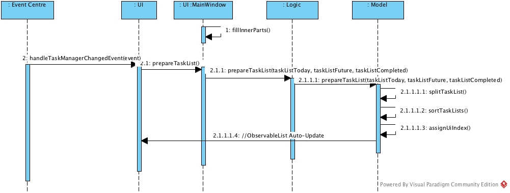
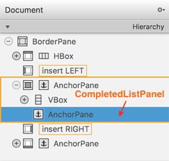

# Today - Developer Guide

By : `T09B1`  &nbsp;&nbsp;&nbsp;&nbsp; Since: `Mar 2017`

---

1. [Introduction](#1-introduction)
2. [Setting Up](#2-setting-up)
3. [Design](#3-design) 
    3.1. [Architecture](#31-architecture) 
    3.2. [UI](#32-ui) 
    3.3. [Logic](#33-logic) 
    3.4. [Model](#34-model) 
    3.5. [Storage](#35-storage) 
    3.6. [Event-Driven Design](#36-event-driven-design)
4. [Implementation](#4-implementation)
5. [Testing](#5-testing)
6. [Dev Ops](#6-dev-ops)

* [Appendix A: User Stories](#appendix-a--user-stories)
* [Appendix B: Use Cases](#appendix-b--use-cases)
* [Appendix C: Non Functional Requirements](#appendix-c--non-functional-requirements)
* [Appendix D: Glossary](#appendix-d--glossary)
* [Appendix E : Product Survey](#appendix-e--product-survey)

## 1. Introduction

**Today** is a minimalistic task manager that aims to be the simplest way to organize your day. We help users focus on the things that they can control - the tasks they're tackling today.

If you're interested in helping us improve the lives of our users, we're always looking for new contributors of all proficiency levels.

- If you're a **beginner**, start by looking at our [list of bugs](https://github.com/CS2103JAN2017-T09-B1/main/issues?q=is%3Aissue+is%3Aopen+label%3Atype.bug). You can help by reporting new bugs, or by fixing an existing one.
- If you're an **experienced Java programmer**, take a look at our [wishlist](https://github.com/CS2103JAN2017-T09-B1/main/issues?q=is%3Aissue+is%3Aopen+label%3Atype.enhancement), and see if you're interested in implementing any of the new features planned for the next release.

Before starting work on an issue, make sure to leave a comment to let us know. Other non-issue specific queries should be sent to ask@todaytaskmanager.com.sg.

## 2. Setting up

If it's your first-time working on **Today**, you'll need to follow the instructions in this section to set up your environment.

### 2.1. Prerequisites

1. **JDK `1.8.0_60`**  or later
2. **Eclipse** IDE
3. **e(fx)clipse** plugin for Eclipse
4. **Buildship Gradle Integration** plugin from the Eclipse Marketplace
5. **Checkstyle Plug-in** plugin from the Eclipse Marketplace

### 2.2. Importing the project into Eclipse

1. Fork this repository, and clone the fork to your computer.
2. Open Eclipse (Note: Ensure you have installed the **e(fx)clipse** and **buildship** plugins as given
   in the prerequisites above).
3. Click `File` > `Import`.
4. Click `Gradle` > `Gradle Project` > `Next` > `Next`.
5. Click `Browse`, then locate the project's directory.
6. Click `Finish`.

  > * If you are asked whether to 'keep' or 'overwrite' config files, choose to 'keep'.
  > * Depending on your connection speed and server load, it can even take up to 30 minutes for the set up to finish.
      (This is because Gradle downloads library files from servers during the project set up process.)
  > * If Eclipse auto-changed any settings files during the import process, you can discard those changes.

### 2.3. Configuring Checkstyle
1. Click `Project` -> `Properties` -> `Checkstyle` -> `Local Check Configurations` -> `New...`.
2. Choose `External Configuration File` under `Type`.
3. Enter an arbitrary configuration name e.g. taskmanager.
4. Import checkstyle configuration file found at `config/checkstyle/checkstyle.xml`.
5. Click OK once, go to the `Main` tab, use the newly imported check configuration.
6. Tick and select `files from packages`, click `Change...`, and select the `resources` package.
7. Click OK twice. Rebuild project if prompted.

> Note to click on the `files from packages` text after ticking in order to enable the `Change...` button.

### 2.4. Troubleshooting project setup

**Problem: Eclipse reports compile errors after new commits are pulled from Git**

* Reason: Eclipse fails to recognize new files that appeared due to the Git pull.
* Solution: Refresh the project in Eclipse: 
  Right click on the project (in Eclipse package explorer), choose `Gradle` -> `Refresh Gradle Project`.

**Problem: Eclipse reports some required libraries missing**

* Reason: Required libraries may not have been downloaded during the project import.
* Solution: [Run tests using Gradle](UsingGradle.md) once (to refresh the libraries).

## 3. Design

### 3.1. Architecture

 
_Figure 3.1.1 : Architecture Diagram_

The **_Architecture Diagram_** given above explains the high-level design of the App. We provide a quick overview of each component below.

`Main` has only one class called [`MainApp`](../src/main/java/seedu/address/MainApp.java) which ...

* At app launch: Initializes the components in the correct sequence, and connects them up with each other.
* At shut down: Shuts down the components and invokes cleanup method where necessary.

`Commons` represents a collection of classes used by multiple other components.
Two of those classes play important roles at the architecture level.

* `EventsCenter` : This class (written using [Google's Event Bus library](https://github.com/google/guava/wiki/EventBusExplained))
  is used by components to communicate with other components using events (i.e. a form of [Event-Driven Design](#36-event-driven-design))
* `LogsCenter` : This class is used by many components to write log messages to the App's log file.

[`UI`](#32-ui) represents a collection of classes that manages the front-end visual elements of the application.

[`Logic`](#33-logic) represents a collection of classes where all the input commands are parsed then executed.

[`Model`](#34-model) represents a collection of classes that manage the in-memory data while the application is running.

[`Storage`](#35-storage) represents a collection of classes that ensure the in-memory data is stored and saved on disk upon changes in data. This allows tasks to be restored from the disk when you close and reopen the application.

UI, Logic, Model and Storage are key components that

* Define their _API_ in interfaces with the same names as the Components.
* Expose their functionality using `{Component Name}Manager` classes.

For example, the `Logic` component defines its API in the `Logic.java` interface and exposes its functionality using the `LogicManager.java` class.

We elaborate more about the individual components below.

### 3.2. UI
 
_Figure 3.2.1 : Structure of the UI Component_

**API** : [`Ui.java`](../src/main/java/seedu/address/ui/Ui.java)

The UI consists of a `MainWindow` that is made up of parts e.g.`CommandBox`, `ResultDisplay`, `TaskListPanel`, `StatusBarFooter`, `BrowserPanel` etc. All these, including the `MainWindow`, inherit from the abstract `UiPart` class.

The `UI` component uses JavaFx UI framework. The layout of these UI parts are defined in matching `.fxml` files that are in the `src/main/resources/view` folder.

For example, the layout of the [`MainWindow`](../src/main/java/seedu/address/ui/MainWindow.java) is specified in  [`MainWindow.fxml`](../src/main/resources/view/MainWindow.fxml)

The `UI` component passes user commands using the `Logic` component, auto-update when data in the `Model` changes, and responds to events raised from various parts of the App and updates the interface accordingly.

### 3.3. Logic

**API** : [`Logic.java`](../src/main/java/seedu/address/logic/Logic.java)

The **Logic** component of the software handles the input from the **UI** and calls methods from the **Model**, **Config**, and **Storage** to perform the appropriate changes.

When a command is entered, the `Parser` processes the text and selects the appropriate `CommandParser` based on the first word in the text to parse the arguments as well. Its respective `Command` is then initialized which calls the relevant methods from other components, and returns a `CommandResult` to the UI to make the relevant changes.

> `Parser` makes use of classes such as `ArgumentTokenizer`, `ParserUtil`, and `CliSyntax` for certain repetitive parsing tasks

> `CommandParser` may return an `IncorrectCommand` in the case when the arguments are not of the suitable format

**Command Parsers**

Command parsers are designed to facilitate logic manager to understand certain user commands. They break the input string down based on the keywords in the commands, and generating instances like dates and names that the logic manager will understand. 

All the parsers are extending from CommandParser abstract class, and they all have a parse() method which accepts a user input string as parameter. Usually the parser breaks down the user input through regex patterns, which are included in the CliSyntax.java. For certain commands, like `add` and `edit` commands, which have flexible input styles, the parsers need to process the input strings progressively. For example, to process an `add` command, the parser will find the tag information first. After that, the date time information, and finally, the title of the task. The parsers will not process the relative UI index it reads, instead it will only check whether the index exist and pass the UI index string to the logic manager untouched. The parsers will not modify the model directly. 

The parsers will generate Command instances, based on the type of commands they received. The Command instance will include all the fields the parser identified. 

In the event the parser encounters input errors, for example the input contains invalid characters or the index typed is unknown, an IncorrectCommand instance will be returned to the handler, containing the error information.

### 3.4. Model

 
_Figure 3.4.1 : Structure of the Model Component_

**API** : [`Model.java`](../src/main/java/seedu/address/model/Model.java)

**Task**

Task class is the fundamental block of the whole task manager. Each Task instance holds the specifications of one task.

Task is an abstract class, and it has three subclasses, namely FloatingTask (task with no date time), DeadlineTask (task with a deadline), and EventTask (task with a starting time and an ending time). Each subclass has a unique constructor which will initiate the name and tag information of one task with the given information. The constructor also needs date time information based on the type of the task. For EventTask, the constructor will check whether the ending time is after the starting time. If not, an IllegalValueException will be thrown.

**Filter**

All tasks are stored in an ObservableList inside model. In order to fetch a list of tasks which meet some certain criteria, filters can be applied to the ObservableList. The filters are written as Predicate instances.

**History**

The command history and previous states of the task manager are also saved in the model, in order to make `undo` and `redo` user commands possible. 

### 3.5. Storage

 
_Figure 3.5.1 : Structure of the Storage Component_

**API** : [`Storage.java`](../src/main/java/seedu/address/storage/Storage.java)

Similar to the `Model`, `Storage` contains the `UserPrefsStorage` object and the `TaskManagerStorage` object.

`UserPrefsStorage` writes and reads a JSON file which contains the user's preferences.

`TaskManagerStorage` writes and reads an XML file which contains the user's tasks and the related details.

### 3.6. Event-Driven Design

Because there are many different components that may be affected by a single command, we use events to simplify method calling. In our code, after a command has successfully executed its primary functionality like making a change to the **Model**, it raises an `Event` which is then picked up by **Storage**, and **UI** which then calls the relevant methods to make the appropriate changes.

The _Sequence Diagram_ below exemplifies this process. In the figure below, you can see that entering `delete 2` causes a change in the model which is the command's primary task.

 
_Figure 3.6.1 : Component interactions for `delete 2` command_

Only after the task is complete, is an `Event` raised to modify the storage and UI components in step 1.1.1.3.

## 4. Implementation

### 4.1. Logging

The `LogsCenter` class manages logging levels and logging destinations.

* The logging level can be controlled using the `logLevel` setting in the configuration file
  (see [Configuration](#configuration)).
* The `Logger` for a class can be obtained using `LogsCenter.getLogger(Class)` which will log messages according to
  the specified logging level.
* Log messages are currently output through both the `Console` and a `.log` file.

**Logging Levels**

`
SEVERE  : A critical problem is detected. The application is likely to be terminated.
WARNING : A minor problem is detected. The application will continue running, but errors may be surfacing in the User Interface or the data.
INFO    : No errors detected. The application is reporting routine actions taken while carrying out user commands.
FINE    : No errors detected. The application is reporting minor details that may be useful in debugging.
`

### 4.2. Configuration

Certain properties of the application can be controlled (e.g app name, logging level) through the configuration file
(default: `config.json`).

### 4.3. UI Implementation Details
#### 4.3.1 Splitting of Task List
In Model, all tasks to be shown on the UI are maintained in a single `filteredTaskList`. In order for tasks to be displayed under correct category(i.e. today, future and completed), it is necessary to split them into three sublists every time before refreshing the UI.

In our UI implementation, tasks are stored in three `ObservableList<ReadOnlyTask>` which are `taskListToday`, `taskListFuture` and `taskListCompleted`. The reason we chose `ObservableList` is because it help to automatically refresh the UI view when updating task list, saving the trouble of reinventing the wheel. The three lists are initialised in `MainWindow`'s fillInnerPart() function during instantiation.

Whenever the UI receives a `TaskManagerChangedEvent`, it calls `MainWindow` to prepare the splitted task lists(Step 2.1). `MainWindow` further calls `logic.prepareTaskList()` while passing `taskListToday`, `taskListFuture` and `taskListCompleted`'s references as well. Logic then calls Model to do the dirty job.

Model does the splitting work in the following steps:

1. It creates three temporary ArrayLists for today, future and completed tasks. These duplicated list are used for the later splitting and sorting process. We did not use the three `ObservableList` from the parameters because adding and sorting on these lists will result in multiple UI refreshes, which is both undesirable for perforance and may result in potential synchronisation issues.

2. In `splitTaskList`, tasks are copied from `filteredTaskList` to their corresponding temporary lists. They are then sorted by task type first followed by deadlines. Floating tasks will always appear at the beginning of the list while event/deadline tasks with earlier deadlines will come first. Lastly, `assignUiIndex()` will assign a relative ID to individual tasks for UI display(See section 4.3.2 for more details).

3. The three temporary lists are copied to the corresponding `ObservableList`, forcing the UI to refresh.

_Figure 4.2.1: Sequence diagram of the process of splitting task lists_ 

#### 4.3.2 Mapping between UI index(task ID) and absolute index
As you may have noticed, task IDs in the UI all begin with "T/F/C". It is a design decision made to improve the usability of commands. Originally, all tasks shared a same set of index and there were "hops" between to adjacent tasks. For example, two adjacent tasks in the list **Future** may have indexes of "1" and "5" respectively because task "2", "3" and "4" are in **Today**, which did not seem to be intuitive.

Thus, we decided to adopt the current numbering scheme while hoping to retain the original implementation based on absolute index. That is where the index mapping came from. We used a HashMap in ModelManager to store the mapping from relative to absolute index. Every time after splitting the task list, `assignUiIndex()` is called to refresh the task ID.
 
#### 4.3.3 Autocomplete
The autocomplete feature of CommandBox utilises `Textfields.bindAutoCompletion()` from the ControlsFX Library. To extend the list of candidates, simply add new commands inside `bindAutoCompletion()` from the constructor of `MainWindow.java`. 

> Notice: In GUI testing, "Enter" is now pressed **twice** in `runCommand(String command)` in `CommandBoxHandle` so as to ensure that the autocomplete windows is dismissed before executing any command. You may want to take notice of this when debugging.

#### 4.3.4 UI Animation
##### 4.3.4.1 Slide Animation of CompletedTaskListPanel

**prefHeight Setting**

The panel of completed tasks is hidden by default. It only shows up when called by `listcompleted` command. Implementation-wise, this panel is anchored at the bottom of the centre position of `MainWindow` with preHeight set to 0. The actual height is written as a constant variable `completedPanelHeight` in `CompletedTaskListPanel.java`.

_Figure 4.3.4.1: Control Layout of MainWindow_

##### 4.3.4.2 Command Animation
In **Today**, there are two types of command animation, namely **before-execute** and **after-execute**. The first is for commands such as `delete` or `done` which has to be played before the command takes effect. Otherwise the deleted/hidden task will not be visible to the user. The second is for commands such as `add` or `edit` which the added/edited task will remain in the UI after command execution. This section explains the different approaches taken when implementing them. 

In general, both animations comprise of two stages: **displaying a progress bar underneath the task** and **scrolling the LiseView to it**.

**Before-execute Animation (Add/Edit)**

**After-execute Animation(Delete/Done)**

#### 4.3.5 Snack Bar Notification

## 5. Testing

Tests can be found in the `./src/test/java` folder.

**In Eclipse**:

* To run all tests, right-click on the `src/test/java` folder and choose
  `Run as` > `JUnit Test`.
* To run a subset of tests, right-click on a test package, test class, or a test and choose
  to run as a JUnit test.

**Using Gradle**:

* See [UsingGradle.md](UsingGradle.md) for how to run tests using Gradle.

We have two types of tests:

1. **GUI Tests** - These are _System Tests_ that test the entire App by simulating user actions on the GUI. These are in the `guitests` package.

2. **Non-GUI Tests** - These are tests not involving the GUI. They include,
   1. _Unit tests_ targeting the lowest level methods/classes.  
      e.g. `t09b1.today.commons.UrlUtilTest`
   2. _Integration tests_ that are checking the integration of multiple code units
     (those code units are assumed to be working). 
      e.g. `t09b1.today.storage.StorageManagerTest`
   3. Hybrids of unit and integration tests. These test are checking multiple code units as well as how the are connected together. 
      e.g. `t09b1.today.logic.LogicManagerTest`

#### Headless GUI Testing
Thanks to the [TestFX](https://github.com/TestFX/TestFX) library we use,
 our GUI tests can be run in the _headless_ mode.
 In the headless mode, GUI tests do not show up on the screen.
 That means youthe developer can do other things on the Computer while the tests are running. 
 See [UsingGradle.md](UsingGradle.md#running-tests) to learn how to run tests in headless mode.

### 5.1. Troubleshooting tests

 **Problem: Tests fail because NullPointException occurs when AssertionError is expected**

 * Reason: Assertions are not enabled for JUnit tests.
   This can happen if you are not using a recent Eclipse version (i.e. _Neon_ or later).
 * Solution: Enable assertions in JUnit tests as described
   [here](http://stackoverflow.com/questions/2522897/eclipse-junit-ea-vm-option).  
   Delete run configurations created when you ran tests earlier.

## 6. Dev Ops

### 6.1. Build Automation

See [UsingGradle.md](UsingGradle.md) to learn how to use Gradle for build automation.

### 6.2. Continuous Integration

We use [Travis CI](https://travis-ci.org/) and [AppVeyor](https://www.appveyor.com/) to perform _Continuous Integration_ on our projects.
See [UsingTravis.md](UsingTravis.md) and [UsingAppVeyor.md](UsingAppVeyor.md) for more details.

### 6.3. Publishing Documentation

See [UsingGithubPages.md](UsingGithubPages.md) to learn how to use GitHub Pages to publish documentation to the
project site.

### 6.4. Making a Release

Here are the steps to create a new release.

 1. Generate a JAR file [using Gradle](UsingGradle.md#creating-the-jar-file).
 2. Tag the repo with the version number. e.g. `v0.1`
 2. [Create a new release using GitHub](https://help.github.com/articles/creating-releases/)
    and upload the JAR file you created.

### 6.5. Managing Dependencies

A project often depends on third-party libraries. For example, **Today** depends on the
[Jackson library](http://wiki.fasterxml.com/JacksonHome) for XML parsing. Managing these _dependencies_
can be automated using Gradle.

## Appendix A : User Stories

Priorities: High (must have) - `* * *`, Medium (nice to have)  - `* *`,  Low (unlikely to have) - `*`

Priority | As a ... | I want to ... | So that I can...
-------- | :-------- | :--------- | :-----------
 `* * *` | New User | Know all the commands that are available | Know how to use the Task Manager effectively
 `* * *` | User | Add a task | Keep track of my tasks
 `* * *` | User | Specify a start date for a task | Keep track of when I intend to start on my task
 `* * *` | User | Specify a deadline for a task | Keep track of when my tasks are due
 `* * *` | User | Update an existing task | Correct a mistake or indicate a change in the task
 `* * *` | User | Delete a task | Indicate a change in the task
 `* * *` | User | Tag my tasks | Find the tasks more easily, and make my task manager more organized
 `* * *` | User | Manage (add, delete, rename) the tags | Indicate changes in tags
 `* * *` | User | Find a specific task by keywords in the description/title | I can view or modify the task
 `* * *` | User | Find tasks due on a specific day | I can see my workload for that day
 `* * *` | User | View all tasks | Know what tasks I have
 `* * *` | User | Be able to indicate if I have completed a task or not | Keep track of my progress
 `* * *` | User | View all tasks that I have not done | View how much more work is there to be done
 `* * *` | User | View completed tasks (hidden by default) | Know what tasks I have completed
 `* * *` | User | Undo my previous commands | undo any mistakes that I have made
 `* * *` | User | Redo my undo command | undo my undo
 `* * *` | User | Specify a location to save the storage file | Choose where to save the file to
 `* * *` | User | Specify a storage file to open | Access a task list from another computer
 `* * *` | User | Enter commands using natural language and in an intuitive manner | Easily use the task manager without having to memorize command formats
 `* * *` | User | Exit the task manager | Have a peace of mind that the program exits safely
 `* *` | User | See if the commands that I typed are valid while I am typing them | Check that my command is valid before I press enter
 `* *` | User | Export all tasks to an external file | Backup the list of tasks
 `* *` | User | Restore tasks from an external file | Access tasks from one computer on another computer
 `*` | User | Add recurring tasks | Avoid duplicate work and adding daily/weekly/monthly tasks multiple times
 `*` | Team leader | Push the team event schedule to every team member | Notify the whole team about the team schedule
 `*` | Advanced User | Use hotkeys to bring the Task Manager from the background to the foreground | Make adding tasks faster

## Appendix B : Use Cases

(For all use cases below, the **System** is the `Task Manager` and the **Actor** is the `user`, unless specified otherwise)

### Use Case: Add Task
**MSS**

1. User requests to add a new task
2. TaskManager adds a new task
Use case ends

**Extensions** 
2a. User supplies optional parameters 
>  2a1. TaskManager includes optional parameters in task details 
>  Use case resumes at step 2

### Use Case: Find Task
**MSS**

1. User requests to find a specific task
2. TaskManager finds all related tasks and displays to user
Use case ends

**Extensions** 
1a. User requests to find a task in sorted order. 
>  1a1. TaskManager displays tasks in sorted order 
>  Use case ends

2a. TaskManager cannot find any related tasks. 
> 2a1. User tries new search 
> Use case resumes at step 1

### Use Case: View Tasks
**MSS**

1. User requests TaskManager to display task list
2. TaskManager displays the task list to the user
Use case ends

**Extensions** 
1a. User requests to view tasks in sorted order 
> 1a1. TaskManager displays tasks in specified sorted order. 
> Use case ends.

### Use Case: Update Task
**MSS**

1. User requests TaskManager to display task list
2. TaskManager displays the task list to the user
3. User specifies a task to be updated and supplies parameters to update task
4. TaskManager updates the task
Use case ends

**Extensions** 
4a. User supplied invalid parameters 
> 4a1. TaskManager informs user that invalid parameters were entered 
> Use case resumes at step 3

### Use Case: Delete Task
**MSS**

1. User requests TaskManager to display task list
2. TaskManager displays the task list to the user
3. User specifies a task to be deleted
4. TaskManager deletes the task
Use case ends

**Extensions** 
4a. Specified task does not exist 
> 4a1. TaskManager informs user that invalid task was specified 
> Use case ends

### Use Case: Indicate Task completed
**MSS**

1. User requests TaskManager to display task list
2. TaskManager displays the task list to the user
3. User specifies a task to indicate as completed
4. TaskManager saves task as completed
Use Case ends

**Extensions** 
4a. Specified task does not exist 
> 4a1. TaskManager informs user that invalid task was specified 
> Use case ends

### Use Case: Change Storage File Location
**MSS**

1. User specifies new storage file location to TaskManager
2. TaskManager changes the storage file to the new location
Use Case ends

**Extensions** 
2a. Specified location does not exist 
> 2a1. TaskManager informs user that invalid location was specified 
> Use case ends

### Use Case: Edit Tag
**MSS**

1. User requests TaskManager to display tag list
2. TaskManager displays the tag list to the user
3. User specifies a tag to be modified
4. TaskManager displays success message
Use case ends

**Extensions** 
3a. Specified tag does not exist 
> 3a1. TaskManager informs user that the selected tag does not exist 
> 3a2. Use case resumes at step 3 

3b. The new tag is not valid, i.e. contains illegal characters or too long. 
> 3b1. TaskManager informs user that the input is not valid 
> 3b2. Use case resumes at step 3 

### Use Case: Undo Previous Command
**MSS**

1. User requests to undo the previous command
2. TaskManager displays the last modification command sent by the user
3. User confirms the undo command
4. TaskManager displays success message
Use case ends

**Extensions** 
1a. There is no undo backup during this session so far 
> 1a1. TaskManager informs user that there is no undo backup file 
> 1a2. Use case ends

### Use Case: Redo Previous Command that has been undone
**MSS**

1. User requests to redo the previous command that has been undone
2. TaskManager displays the last modification command sent by the user
3. User confirms the redo command
4. TaskManager displays success message
Use case ends

**Extensions** 
1a. There is no redo backup during this session so far 
> 1a1. TaskManager informs user that there is no redo backup file 
> 1a2. Use case ends

## Appendix C : Non Functional Requirements

1. The task manager should be a desktop software that works on the Windows 7 or later.
1. The task manager should use a Command Line Interface as a main form of input.
1. The task manager should work without requiring additional software extensions.
1. The task manager should store data locally in the form of a human editable text file.
1. The task manager should work without requiring an installer.
1. The task manager only use third-party frameworks/libraries that:
  * are free.
  * do not require any installation by the user of your software.
  * do not violate other constraints.

## Appendix D : Glossary

### Any . Do

Author: Ken

#### Pros
* Simple, Minimalistic
* Mobile Friendly
* "Moment" feature that cycles through the tasks you have on that day and prompts you to plan your day

#### Cons
* Poor Web Application

### Google Calendar

Author: Shi Yuan

#### Pros
* Supports Natural Language commands
* Synchronizes on all devices

#### Cons
* Unable to set priorities for tasks

### Things

Author: Yu Li

#### Pros
* Highly customizable
* Daily Review
* Autofill

#### Cons
* Cannot export

### Wunderlist

Author: Cao Wei

#### Pros
* Many shortcuts
* Sorts tasks by priority and category
* Compatible with almost every OS

#### Cons
* No calendar view
