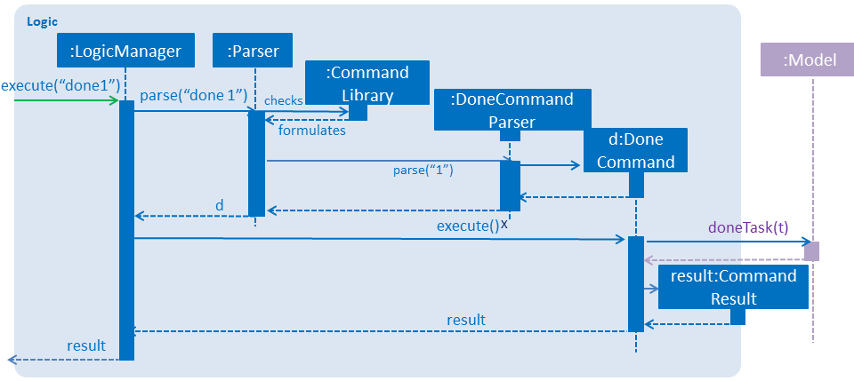
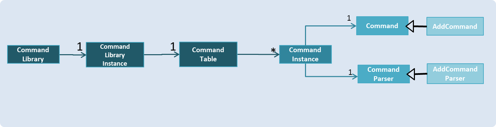
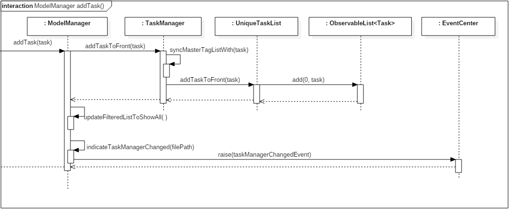
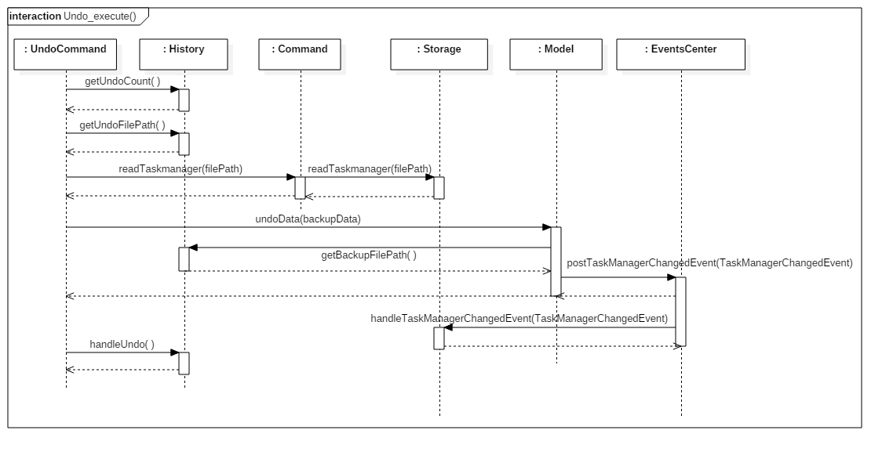
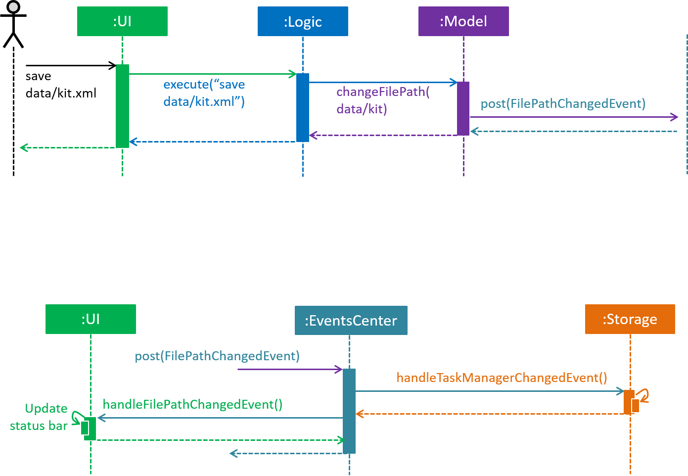

# KIT Developer Guide:

1. [Setting Up](#1-setting-up)
2. [Design](#2-design)
3. [Implementation](#3-implementation)
4. [Testing](#4-testing)
5. [Dev Ops](#5-dev-ops)

* [Appendix A: User Stories](#appendix-a--user-stories)
* [Appendix B: Use Cases](#appendix-b--use-cases)
* [Appendix C: Non Functional Requirements](#appendix-c--non-functional-requirements)
* [Appendix D: Glossary](#appendix-d--glossary)
* [Appendix E : Product Survey](#appendix-e--product-survey)

## 1. Setting up

### 1.1. Prerequisites

1. **JDK `1.8.0_60`**  or later 

    > Having any Java 8 version is not enough.  
    This app will not work with earlier versions of Java 8.

2. **Eclipse** IDE
3. **e(fx)clipse** plugin for Eclipse (Do the steps 2 onwards given in
   [this page](http://www.eclipse.org/efxclipse/install.html#for-the-ambitious))
4. **Buildship Gradle Integration** plugin from the Eclipse Marketplace
5. **Checkstyle Plug-in** plugin from the Eclipse Marketplace

### 1.2. Importing the project into Eclipse

1. Fork this repo, and clone the fork to your computer
2. Open Eclipse (Note: Ensure you have installed the **e(fx)clipse** and **buildship** plugins as given
   in the prerequisites above)
3. Click `File` > `Import`
4. Click `Gradle` > `Gradle Project` > `Next` > `Next`
5. Click `Browse`, then locate the project's directory
6. Click `Finish`

  > * If you are asked whether to 'keep' or 'overwrite' config files, choose to 'keep'.
  > * Depending on your connection speed and server load, it can even take up to 30 minutes for the set up to finish
      (This is because Gradle downloads library files from servers during the project set up process)
  > * If Eclipse auto-changed any settings files during the import process, you can discard those changes.

### 1.3. Configuring Checkstyle
1. Click `Project` -> `Properties` -> `Checkstyle` -> `Local Check Configurations` -> `New...`
2. Choose `External Configuration File` under `Type`
3. Enter an arbitrary configuration name e.g. taskmanager
4. Import checkstyle configuration file found at `config/checkstyle/checkstyle.xml`
5. Click OK once, go to the `Main` tab, use the newly imported check configuration.
6. Tick and select `files from packages`, click `Change...`, and select the `resources` package
7. Click OK twice. Rebuild project if prompted

> Note to click on the `files from packages` text after ticking in order to enable the `Change...` button

### 1.4. Troubleshooting project setup

**Problem: Eclipse reports compile errors after new commits are pulled from Git**

* Reason: Eclipse fails to recognize new files that appeared due to the Git pull.
* Solution: Refresh the project in Eclipse: 
  Right click on the project (in Eclipse package explorer), choose `Gradle` -> `Refresh Gradle Project`.

**Problem: Eclipse reports some required libraries missing**

* Reason: Required libraries may not have been downloaded during the project import.
* Solution: [Run tests using Gradle](UsingGradle.md) once (to refresh the libraries).

## 2. Design

### 2.1. Architecture

 
_Figure 2.1.1 : Architecture Diagram_

The **_Architecture Diagram_** given above explains the high-level design of the App.
Given below is a quick overview of each component.

> Tip: The `.pptx` files used to create diagrams in this document can be found in the [diagrams](diagrams/) folder.
> To update a diagram, modify the diagram in the pptx file, select the objects of the diagram, and choose `Save as picture`.

#### Separation of concerns principle
Fundamentally, this App has been designed with the separation of concern principle.
* As clearly color-coded in the **_Architecture Diagram_** above, this App has several **sub-systems** or **components** each of which accounts for a particular aspect or feature of the App. E.g., the`UI (colored as green)` component handles specifically all the interaction with the user and deals with other features minimally.
* This practice increases the _modularity_ of the program by creating distinct classes responsible for different concerns, thus _reducing functional overlaps_ and making the App more resilient to ripple effects of future changes to the system.
* More detailed explanations on the implementation of this principle to each individual component can be found below.

#### **Main**
**`Main`** has only one class called [`MainApp`](../src/main/java/seedu/task/MainApp.java). It is responsible for,

* At app launch: Initializes the components in the correct sequence, and connects them up with each other.
* At shut down: Shuts down the components and invokes cleanup method where necessary.

#### **Commons**
[**`Commons`**](#26-common-classes) represents a collection of classes used by multiple other components.
Two of those classes play important roles at the architecture level.

  * `EventsCenter` : This class (written using [Google's Event Bus library](https://github.com/google/guava/wiki/EventBusExplained))
  is used by components to communicate with other components using events (i.e. a form of _Event Driven_ design)
  * `LogsCenter` : Used by many classes to write log messages to the App's log file.

The rest of the App consists of four components.

[**`UI`**](#22-ui-component) : The UI component handles interaction with the user i.e. taking in input and displaying results.
[**`Logic`**](#23-logic-component) : The Logic component does the procesing and executing of all the commands.
[**`Model`**](#24-model-component) : The Model component holds, modifies and updates the data of tha App in-memory.
[**`Storage`**](#25-storage-component) : The Storage component reads data from, and writes data to, the hard disk.

#### Each of the four components

* ##### Defines its _API_ in an `interface` with the same name as the Component.
* ##### Exposes its functionality using a `{Component Name} Manager` class.

For example, the **`Logic`** component (see the class diagram given below) defines it's API in the **`Logic.java`** interface and exposes its functionality using the **`LogicManager.java`** class. 
 
_Figure 2.1.2 : Class Diagram of the Logic Component_

### 2.11 Events-Driven nature of the design

The *_Sequence Diagram_* below shows how the components interact for the scenario where the user issues the
command `done 1`.

 
_Figure 2.1.3a : Component interactions for `done 1` command (part 1)_

>Note that the `Model` simply raises a `TaskManagerChangedEvent` when the Task Manager data are changed, instead of asking the `Storage` to save the updates to the hard disk.

The diagram below shows how the `EventsCenter` reacts to that event, which eventually results in the updates being saved to the hard disk and the status bar of the UI being updated to reflect the 'Last Updated' time.  
 
_Figure 2.1.3b : Component interactions for `done 1` command (part 2)_

> Note how the event is propagated through the `EventsCenter` to the `Storage` and `UI` without `Model` having to be coupled to either of them. This is an example of how this Event Driven approach reduces direct **coupling** between components.

#### Model-View-Controller (_MVC_) pattern
In the above two figures, it is clear that a _MVC_ pattern is present.
* The **`Model`** component of the App acts as the _model_ in _MVC_ as it updates the data as per requested.
* The **`UI`** component of the App acts as both the _view_ and _controller_ in _MVC_ as it is responsible for displaying the results and taking in user input.

##### The following sections give more details of each component.

### 2.2. UI component

Author: Walter Tay

 
_Figure 2.2.1 : Structure of the UI Component_

**API** : [`Ui.java`](../src/main/java/seedu/task/ui/Ui.java)

The UI consists of a `MainWindow` that is made up of parts e.g.`CommandBox`, `ResultDisplay`, `TaskListPanel`, `StatusBarFooter`, `BrowserPanel` etc. All these, including the `MainWindow`, inherit from the abstract `UiPart` class.

The `UI` component uses JavaFx UI framework. The layout of these UI parts are defined in matching `.fxml` files that are in the `src/main/resources/view` folder. 
 For example, the layout of the [`MainWindow`](../src/main/java/seedu/task/ui/MainWindow.java) is specified in [`MainWindow.fxml`](../src/main/resources/view/MainWindow.fxml)

The `UI` component,

* Takes in user commands.
* Binds itself as a _listener_ to the `Model` so that the UI can update when data in the `Model` is changed.
* Responds to events raised from various parts of the App and updates the UI accordingly.

### 2.3. Logic component

Author: Xu Xinyi

 
_Figure 2.3.1 : Structure of the Logic Component_

**API** : [`Logic.java`](../src/main/java/seedu/task/logic/Logic.java)

* `LogicManager` implements `Logic Interface`, and manages the interaction with classes outside `Logic component`.
*  `Parser` will in turn check the `Command Library` to  create the correct `Command` object.
*  The `Command` object is executed by the `LogicManager`.
* The command execution can affect the `Model` (e.g. updating the data by adding a task) and/or raise events.
* The result of the command execution is encapsulated as a `CommandResult` object which is passed back to the `UI`.

Given below is the Sequence Diagram for interactions within the `Logic` component for the `execute("done 1")`
 API call. 
 
_Figure 2.3.1 : Interactions Inside the Logic Component for the `done 1` Command_

1. The `LogicManager` receives `execute("done 1")`.
2. It passes this command text (_as a string_) to `Parser`.
3. `Parser` checks it against `CommandLibrary`.
4. `Parser` formulates a done command and sends it to `DoneCommandParser`.
5. `DoneCommandParser` creates the corresponding command and returns it.
6. The `LogicManager` executes the returned `DoneCommand`, accessing `Model`, and then returns the `CommandResult` back to `UI`.

#### **`CommandLibrary` of Singleton pattern**:

This class stores the information of all the commands, including their `keyword`, `usage`, `sucess_message` and etc. To illustrate,`CommandLibrary` serves as an intermediate between the `Parser` class and other individual `CommandParser` classes. `Parser` is now solely responsible for parsing the arguments, so the **cohesion** of the system is improved.

This approach applies the **Single Responsibility Principle** in that it restricts the `Parser` to account for only parsing arguments, and not creating the respective commands and their corresponding command parsers.

The `CommandLibrary` class is implemented using the **Singleton pattern** as one instance is sufficient and such practice prevents the program from creating too many unnucessary instances.

 
_Figure 2.3.1 : CommandLibrary Class Diagram_

#### **`Command` of Command pattern**:

Both `Command` and `CommandParser` classes are designed with the **Command pattern**. Because each command has a specific behaviour and might take in particular arguments, these two classes are implemented as _abstract class_ and the individual `Command`(e.g. AddCommand) and `CommandParser`(e.g. AddCommandParser) classes inherit from them.

**Liskov substitution principle** applies in this case in that the `CommandLibrary` can store and look up different subclasses, e.g. `AddCommand` and `AddCommandParser` using the superclasses, and still be able to utilize the different behaviours of the respective subclasses.

### 2.4. Model component

Author: Chan Lup Seng

The Model component is where the 'memory' or actual data of KIT is stored and managed.

Any updates to the data will require a change in the UI to reflect the changes. To allow UI to know when data is changed, the _Observer Pattern_ is used. This is done by exposing an `UnmodifiableObservableList<ReadOnlyTask>`, which is 'observed' by the UI. To do this, the UI is bound to this list and thus will automatically update when there is changes to any data in the list.

When data is modified, we will also save it into a file for persistent memory. This is handled by the Storage component. Instead of Model directly interacting with Storage, we use the event-driven approach as mentioned [before](#211-events-driven-nature-of-the-design) and raises an event instead.

With the help of the above mentioned designs, **Model does not depend on any other component.** This keeps the design of Model simple and greatly reduces the coupling between components.

A high level class diagram to show the structure of the Model Component is illustrated in the following diagram.

 
_Figure 2.4.1 : Structure of the Model Component_

The main class here is the `ModelManager`. It implements [`Model.java`](../src/main/java/seedu/task/model/Model.java), the interface of the Model component. It maintains all the tasks which is in a `TaskManager` object and user's preferences in the `UserPref` object.

The `TaskManager` contains the current state of all task and their details. A TaskManager contains an `UniqueTaskList` and a `UniqueTagList`. As their name suggests, these lists asserts their list is unique.

The model component also protects it's data. Interfaces such as`ReadOnlyTaskManager` and `ReadOnlyTask` are measures to prevent other classes from modifying the data. Other components such as UI, are given the least amount of privilege they need to function, they can only read but not to write.

More detailed explanation of the `Task` class can be found in the next [section](#241-task).

The Model class also uses the _facade pattern_. The complicated steps of modifying data are hidden from any callers. It's API can be found in [`Model.java`](../src/main/java/seedu/task/model/Model.java), which is the interface of the Model component. Any feature of KIT that needs to modify or access data will go through this interface. Callers only need to call the API to carry out their desires, instead of thinking the required steps to modify the data.

 
_Figure 2.4.2 : Sequence Diagram of addTask method_

In the above _figure 2.4.2_, the various steps requried to add a new task to Model is shown. Note that steps in `updateFilteredListToShowAll()` and `indicateTaskManagerChanged()` are hidden to keep the diagram concise.

The steps required to just add a task is indeed complicated, but the caller do not need to know or care about these details. They just have to provide a valid Task object and call the `addTask()` method.

### 2.4.1 Task
##### This section briefly describes the design of the task class.

 

The `Task` class represents a task in KIT. Each of its detail such as `Name` and `Date` are classes.

The clean design allows us to perform the verification of each field and specify the desired regex for each field easily.

* Constructor of `Task` only stipulates that startDate is before endDate and lets each individual class perform their respective verification.
* The boolean `isDone` indicates if a task is completed. Due to its simplicity, no additional class was created to avoid unnessary objects.

**Pretty Time**

To implement _Natural Language Processing_ for date we incorporated [pretty time library](http://www.ocpsoft.org/prettytime/), an open source, date formatting library.

We use it to interpret user input and obtain the date in `java.util.Date` format. We also use it for the display of time in a more friendly manner such as:

> "10 minutes from now" or "2 days from now"

### 2.5. Storage component

Author: Zhang Ying

 
_Figure 2.5.1 : Structure of the Storage Component_

**API** : [`Storage.java`](../src/main/java/seedu/task/storage/Storage.java)

The `Storage` component,

* Can save `Config` objects in json format and read it back.
* Can save `UserPref` objects in json format and read it back.
* Can save the Task Manager data in xml format and read it back.

This class is called by other components such as `Model` to assist it in saving and loading the tasks from .xml files. The `StorageManager` class manages any changes in the storage through its implementation of `TaskManagerStorage` and `UserPrefsStorage` for when the `Model` class requires a change in the task manager's model. For example, when saving the file to a new directory, `ModelManager` would raise a new save file event which will be handled by `StorageManager` which relies on methods from sub-components  in `Storage` like `JsonUserPrefsStorage` and `XmlTaskManagerStorage`.

### 2.6. Common classes

Author: Zhang Ying

Common classes used by multiple components are in the `seedu.task.commons` package.

They are further divided into sub-groups like `core`, `events`, `exceptions` and `util`.

* `Core` contains core classes that are used by multiple components. They include `ComponentManager`, `Config`, `EventsCenter`, `GuiSettings`, `LogsCentre`, `Messages`, `UnmodifiableObservableList` and `Version`. For example, in the save and handle command, the storage component would need to call the `Config` class to edit information in the `config.json` file.
* `Events` contains event classes that are raised whenever required. The subsequent classes would subscribe and catch these events whenever neccessary and carry out the changes.
* `Exceptions` contains exception classes which are thrown in various other components in the program
* `Util` contains utilities that other components might require when carrying out certain tasks. For example, in the `JsonUtil`, it simplifies the job of reading json files as we can simply call the functions inside of it.

## 3. Implementation

### 3.1. Logging

We are using `java.util.logging` package for logging. The `LogsCenter` class is used to manage the logging levels and logging destinations.

* The logging level can be controlled using the `logLevel` setting in the configuration file
  (See [Configuration](#configuration))
* The `Logger` for a class can be obtained using `LogsCenter.getLogger(Class)` which will log messages according to
  the specified logging level
* Currently log messages are output through: `Console` and to a `.log` file.

**Logging Levels**

* `SEVERE` : Critical problem detected which may possibly cause the termination of the application
* `WARNING` : Can continue, but with caution
* `INFO` : Information showing the noteworthy actions by the App
* `FINE` : Details that is not usually noteworthy but may be useful in debugging
  e.g. print the actual list instead of just its size

### 3.2. Configuration

Certain properties of the application can be controlled (e.g App name, logging level) through the configuration file. (default: `config.json`):

### 3.3. Undo/Redo Command Implementation

This section describes the design process and implementation of undo/redo feature.

**Function of Undo**

* It should revert any command that modifies the data.
* It should revert add, edit, delete and clear commands but ignores list, list notdone, find commands.
* For example, if a list command is issued after an add, undo should revert the add command and ignore list command.

**Designs Considered**

One of the designs we considered for undo involves the Command pattern. The idea is to have a History class that stores a stack of previous Commands executed. Each Command will have a specified undo method for itself. For example, delete will remember the deleted task and the undo method will add it back.

When undo command is called, it can obtain the latest command from History and invoke its undo method. An undo call is simple with this design, however each current Command and every new Command needs it's own individual implementation of undo method.

The alternate design, which was implemented, involves storing a backup file. This makes use of how every command that modifies data will invoke an automatic save. Before the data is updated, a backup is saved. Undo command now simply loads the backup into memory. Future commands can also support undo easily as they do not need to implement any new methods.

The downside is the extra storage space used. To reduce the extra storage incurred, the backup files are deleted everytime the program closes. The backup files thus functions as temporary files.

After much consideration and research into other products, we decided that `Undo` should be limited to the last 10 commands. We find that for a task manager app, we do not need to provide too many undos. Yes, for a text editing program like Microsoft Word, a high number of undo is needed. However, the same cannot be said for a task manager app. Other popular applications suchs as Evernote, Google Keep and Google Calendar have limited undo capabilities.

**Implementation Details**

A `History` class is used to support and maintain backup, undo and redo operations.
* It is located in the common package along with other common classes.
* It's main responsibility is to decide and provide the file path that commands should backup to and also the file path for undo and redo to load from.
* 11 files are used to support 10 undos. A currentFileIndex is used to decide which file should be used. The index is modular 11 when it reaches the last file.
* It also maintains the undo and redo count so user won't exceed the maximum number.
* History class uses the singleton pattern since there must only be one instance of it. This is because it's important that the data is saved and loaded from the right file.

#### Every command:
1. Will raise a `TaskManagerChangedEvent` containing the TaskManager's data and a filePath indicating the file to backup into. The filePath should be left empty if a backup is not needed.
2. Storage listens to this event, check if a backup is needed and carry out the saving to xml file. Commands that will not backup are command such as list and find commands etc.

##### Undo Command:
When an undo command is issued, its steps are as followed:
1. Check undoCount is valid. (undoCount > 0)
2. Get undoFilePath from `History`.
3. `UndoCommand` calls `Storage` to read from undoFilePath.
4. `UndoCommand` pass the data to model.
5. `Model` loads data into memory and create a `TaskManagerChangedEvent`, passing in backupFilePath obtained from History in the event.
6. `Storage` backs up data into the given filePath. This backup is used if redo command is called.
7. `Storage` saves data into actual data file.
8. `UndoCommand` tells History to update counts and index.

#### Redo command is similiar and is simply the reverse of undo.

**Future Improvements**

Max number of Undo/Redo is currently set at 10. It can be easily increased to higher count if necessary. It is easy to increase this limit since a constant in `History` is used to store the value.

### 3.4 Done/Undone task command implementation

This sections describes the done/undone implementation.

All added tasks will be set to undone as a default setting. The done command updates the selected task to done.

Rather than making a new class under Model/task, we used a boolean method inside the task class. _True_ indicates the task is done and false indicates undone. This allows us avoid implmenting unnecessary classes thereby improving the efficency of our code. Done and undone command works in similar ways. It also allows the listing of tasks by done/undone.

### 3.5 Save/Load file command implementation

This section describes the save/load feature implementation.

**Function of save**

* Makes a copy of the .xml file in specified directory
* Creates a new .xml file specified in the folder
* Prompts user if the file they are saving to already exists and whether they would like to overwrite it with the new data
* Once saved to a new file, any changes made would be done on the newly saved file
* File status would be updated in the status bar footer

**Implementation details**

> 

The initial save location would be in `data/kit.xml` file. To manually change the save location, we can edit `config.json` in a text editor and overwrite the `taskManagerFilePath` parameter. In the save command, whenever the user specifies a new location, the `Logic` component checks if the file is valid (i.e. not a directory) and if the file already exists. If the file with the same name exists, it will prompt the user whether they would like to overwrite it with the new data.

**Function of load**

* Loads the .xml file from a specified file
* Any changes made would be done to the current loaded file
* File status would be updated in the status bar footer

**Implementation details**

The load location by default would be `data/kit.xml` unless specified by the user previously. If the user had loaded a file in a different directory and closed the program, when they restart the program, it will still load from the file where they last loaded the data. The load command implementation is identical to save.

### 3.6 Find command implementation

This section desrcibes the find feature implementation.

**Function of Find**

* Searches for the given keywords as string objects, in all string fields of every task, including `Name`,`Remark`,`Location` and `Tags`
* Searches for both full match and substring match for the string objects
* Searches for date in the `startDate` and `endDate` fields of every task e.g. `"find Apr 4"` -> searches for any task with a `startDate` **or** `endDate` of `Apr 4 2017`(default the current year)
* Able to handle complicated find commands reasonably well e.g. _"find prepare Christmas on Nov 31 2018"_ -> will search for a task that has a date of _Nov 31 2018_ **and** a keyword of _Christmas_.

**Implementation details**

1. The string arguments passed in for a FindCommand is parsed first to identify for any possible date string: e.g._"find meeting next tuesday"_. _"next tuesday"_ is extracted to form a `Date` and searched for as a date.
2. Upon extracting the possible string to form a date, it still searches these strings as keywords, so in the above example, `"next"` and `"tuesday"` will be searched as keywords as well.
3. The search for _"next tuesday"_ is successful is either a date _next tuesday_ is found or both _"next"_ **and** _"tuesday"_ as strings are found.
4. The search result for a possible date string is then combined with the result for other keywords strings to return correctly matching tasks.

**Future Improvement**

Because the extraction of strings to form possible dates depends on the implementation of _Natural Language Processing_ ([Natty Date Parser](http://natty.joestelmach.com/), an external API), which is not perfect and often susceptible different interpretations, it means `FindCommand` may give inaccurate search results to complicated arguments. Improvements to achieve better _Natural Language Processing_ are planned. Meanwhile, we welcome any feedback on incorrect behaviour of `FindCommand`.([Conntact us](docs/ContactUs.md))

### 3.7 Implementation of UI - TitlePane and Colored done task

Using list plane to list all tasks restrcts the number of tasks displayed at once as the UI has a limited space on the screen.
* Implementing a tile plane allows more tasks to be listed and viewed by the user. Epanding the tile plane of a selected task reveals detailed information on the task.
* The implementation of the scrolling of the task list reduces the usage of the mouse.

To allow the user to easily differentiate done and undone task, done tasks' titles are green in color with a tick icon beside the titles.

### 3.8 Google Calendar support

##### Google Calendar is popular, to appeal to this large group of users we also provide some Google Calendar support.
* Google Calendar users are able to log in and view their calendar directly from KIT.
* However, if the user do not wish to use Google Calendar they can simply hide the calendar by draging the task list sidebar to the right and cover Google Calendar.

### Implementation

**Setting up**

* For Google Calendar operations, KIT needs the proper credentials. We get this by asking for the user's permission for access to their calendar.

* A `GoogleCalendar` class, placed in the common classes package is used to maintain the credential and connection to Google API. This class also helps other classes that need to connect Google API. Other classes simply have to call `getCalendarService()` to talk to Google's API. This class also maintains the calendar to interact with. It is set to primary by default but could be changed if needed.

* The class first checks if it has the credentials to access to user's Calendar. If it does not have it, it will open the default browser and requests user to log into the Google account they wish to associate with KIT and requests for access. Once the permission is granted it is stored as a credentials file in the user's computer. Future uses will not require opening the browser and asking for permissions.

* `GoogleCalendar` class follows the _Single Responsibility Principle_ (SRP) well.
    * It only has a single responsibility, to provide Calendar Service.
    * It does not depend on any other classes, it's responsiblity is entirely encapsulated by itself.
    * It is highly cohesive.

**Importing Google Calendar**

* Importing User's Google Calendar is implemented in the `GetGoogleCalendarCommand`. In order to not overflood KIT, we decided to only import events that are upcoming. Past events are thought to be not as relevant, since that they have already ended.

* This command is one way, it will grab events but not post any events. To post events we provide another command and will be described in the next section.

**Posting task to Google Calendar**

* Users are able to post one or multiple task to their calendar.
    * Specifing one task posts the specified task.
    * Without specifing, all tasks in the current listing are posted.
    * This command will not post any duplicate commands.
* If a task has been posted to Google Calendar before, this command updates it instead of creating a new event.
    * To support this every task stores it's own eventId when they recieve one.

**Utilizing Google Calendar's Quick Add for Smart Add**

* The `SmartAdd` command utilizes Google's _quick add_ feature to support some form of natural language processing when adding tasks. The user's query will be used to make a call to Google's quick add API to optain an Event object. This object will consist of the event's name, start, end and location details and is used to create a new `Task`.

* User is still able to add remark and tag using the prefix like in the normal add command.

The limitations of this command is that all tasks created require both start and end time due to the fact that all events in Google Calendar have start and end time. It also requires the internet to work.

After considering both the benefits and the limitations we still decided to provide `SmartAdd` as we felt that the benefit outweights the limitations. This adds a great amount of flexibility to KIT users and does not interfere with the already functional `AddCommand`.

If the user does not have internet or wants to add a task without dates, he can simply use the `AddCommand`.

## 4. Testing

Tests can be found in the `./src/test/java` folder.

**In Eclipse**:

* To run all tests, right-click on the `src/test/java` folder and choose
  `Run as` > `JUnit Test`
* To run a subset of tests, you can right-click on a test package, test class, or a test and choose
  to run as a JUnit test.

**Using Gradle**:

* See [UsingGradle.md](UsingGradle.md) for how to run tests using Gradle.

We have two types of tests:

1. **GUI Tests** - These are _System Tests_ that test the entire App by simulating user actions on the GUI.
   These are in the `guitests` package.

2. **Non-GUI Tests** - These are tests not involving the GUI. They include,
   1. _Unit tests_ targeting the lowest level methods/classes.  
      e.g. `seedu.task.commons.UrlUtilTest`
   2. _Integration tests_ that are checking the integration of multiple code units
     (those code units are assumed to be working). 
      e.g. `seedu.task.storage.StorageManagerTest`
   3. Hybrids of unit and integration tests. These test are checking multiple code units as well as
      how the are connected together. 
      e.g. `seedu.task.logic.LogicManagerTest`

#### Headless GUI Testing
Thanks to the [TestFX](https://github.com/TestFX/TestFX) library we use, our GUI tests can be run in the _headless_ mode. In the headless mode, GUI tests do not show up on the screen. That means the developer can perform other tasks on the Computer while the tests are running. 

* See [UsingGradle.md](UsingGradle.md#running-tests) to learn how to run tests in headless mode.

### 4.1. Troubleshooting tests

 **Problem: Tests fail because NullPointException when AssertionError is expected**

 * Reason: Assertions are not enabled for JUnit tests.
   This can happen if you are not using a recent Eclipse version (i.e. _Neon_ or later)
 * Solution: Enable assertions in JUnit tests as described
   [here](http://stackoverflow.com/questions/2522897/eclipse-junit-ea-vm-option).  
   Delete run configurations created when you ran tests earlier.

## 5. Dev Ops

### 5.1. Build Automation

See [UsingGradle.md](UsingGradle.md) to learn how to use Gradle for build automation.

### 5.2. Continuous Integration

We use [Travis CI](https://travis-ci.org/) and [AppVeyor](https://www.appveyor.com/) to perform _Continuous Integration_ on our projects.
See [UsingTravis.md](UsingTravis.md) and [UsingAppVeyor.md](UsingAppVeyor.md) for more details.

### 5.3. Publishing Documentation

See [UsingGithubPages.md](UsingGithubPages.md) to learn how to use GitHub Pages to publish documentation to the
project site.

### 5.4. Making a Release

Here are the steps to create a new release.

 1. Generate a JAR file [using Gradle](UsingGradle.md#creating-the-jar-file).
 2. Tag the repo with the version number. e.g. `v0.1`
 2. [Create a new release using GitHub](https://help.github.com/articles/creating-releases/)
    and upload the JAR file you created.

### 5.5. Converting Documentation to PDF format

We use [Google Chrome](https://www.google.com/chrome/browser/desktop/) for converting documentation to PDF format, as Chrome's PDF engine preserves hyperlinks used in webpages.

Here are the steps to convert the project documentation files to PDF format.

 1. Make sure you have set up GitHub Pages as described in [UsingGithubPages.md](UsingGithubPages.md#setting-up).
 1. Using Chrome, go to the [GitHub Pages version](UsingGithubPages.md#viewing-the-project-site) of the
    documentation file.  
    e.g. For [UserGuide.md](UserGuide.md), the URL will be `https://<your-username-or-organization-name>.github.io/addressbook-level4/docs/UserGuide.html`.
 1. Click on the `Print` option in Chrome's menu.
 1. Set the destination to `Save as PDF`, then click `Save` to save a copy of the file in PDF format.  
    For best results, use the settings indicated in the screenshot below.  
     
    _Figure 5.4.1 : Saving documentation as PDF files in Chrome_

### 5.6. Managing Dependencies

A project often depends on third-party libraries. For example, Task Manager depends on the
[Jackson library](http://wiki.fasterxml.com/JacksonHome) for XML parsing. Managing these _dependencies_ can be automated using Gradle. For example, Gradle can download the dependencies automatically, which is better than these alternatives. 
a. Include those libraries in the repo (this bloats the repo size) 
b. Require developers to download those libraries manually (this creates extra work for developers) 

## Appendix A : User Stories

Priorities: High (must have) - `* * *`, Medium (nice to have)  - `* *`,  Low (unlikely to have) - `*`

| Priority | As a user I want to ... | So that I can...
| -------- | :-------- | :---------
| `* * *` | see usage instructions | know how to use the commands
| `* * *` | add a new task without deadlines | plan for the future
| `* * *` | add a new task with deadline | know when my task is due
| `* * *` | add a new task with start and end time | fit it into my calendar
| `* * *` | delete a task | remove task that I no longer need
| `* * *` | edit a task | make changes or edit mistakes
| `* * *` | undo a command | undo a mistake
| `* * *` | search for a task | find a task with only few keywords
| `* * *` | mark a task as done | keep track of tasks that are done
| `* * *` | see task by done and not done | keep track of task that are not done
| `* * *` | list task by specific tag | only see task that under a certain tag
| `* * *` | use short form for common commands | have flexibility when i use the app, type faster
| `* * *` | specify folder for data storage | choose where i want to save my info
| `* *` | sort tasks by name | locate a task easily
| `* *` | use hotkeys for commands | do things faster
| `* *` | get feedback for my commands | know if a command is successful or system has hanged
| `* *` | save my task to google calendar | see them on google calendar
| `* *` | get the app to help me find a slot for a task | find a suitable time easily
| `* *` | block multiple slots | block slots when timing of a task is uncertain
| `* *` | list task in sorted order | plan my time
| `* *` | list task by due date | see which task are most urgent
| `* *` | mark a task as not done | undone a done task

## Appendix B : Use Cases
(For all use cases below, the **System** is the `KIT` and the **Actor** is the `user`, unless specified otherwise)

#### Use case: UC1 - Help

**Main success scenario**

	1.  User enters help.
	2.  KIT displays the User Guide in a new window.
	Use case ends.

**Extensions**
1a. KIT detects an error in the command.

> 1a1. KIT waits for another valid command.
1a2. User enters the correct command.
Steps 1a1-1a2 are repeated until the command entered is valid.
Use case resumes from step 2.

#### Use case: UC2 - Add task
**Main success scenario**

	1.  User adds a certain task with its details via command line input.
	2.  KIT adds the task and displays status.
	         Use case ends.
**Extensions**
1a. KIT detects an error in the form of the input.
>	1a1. KIT requests for the input with a correct form.
		1a2. User enters the task with its details again.
	Steps 1a1-1a2 are repeated until the input entered is of a correct form.
	Use case resumes from step 2.

#### Use case: UC3 - Done task
**Main sucess scenario**

    1. User enters list undone.
    2. Kit display all the undone task with their indices.
    3. User choose one of the undone task to done by entering done INDEX.
    4. KIT update the task from undone to done from the list and display status.
        use case ends.

**Extensions**
1a. KIT detects and error in the command.
>   1a1. KIT waits for another valid command.
>   1a2. User enters the correct command.
>   Steps 1a1-1a2 are repeated untill the command entered is valid.
>   Use case resumes from step 2.

3a.KIT detects an error in the command.
>   3a1. KIT waits for another valid command.
>   3a2. User enters the valid command.
>   Steps 3a1-3a2 are repeated untill the command entered is valid.
>   Use case resumes from step 4.

#### Use case: UC4 - Delete task
**Main success scenario**

	1.  User enters list.
	2.  KIT displays all the entered tasks with a index.
	3.  User chooses one of the tasks to delete by entering delete INDEX.
	4.  KIT removes the task from the list and displays status.
	         Use case ends.
**Extensions**
1a. KIT detects an error in the command.
>	1a1. KIT waits for another valid command..
		1a2. User enters the correct command.
	Steps 1a1-1a2 are repeated until the command entered is valid.
	Use case resumes from step 2.

3a. KIT detects an error in the command.
>	3a1. KIT waits for another valid command..
		3a2. User enters the valid command.
	Steps 3a1-3a2 are repeated until the command entered is valid.
	Use case resumes from step 4.

#### Use case: UC5 - Find task
**Main success scenario**

    1.User enters Find with keywords (may or may not contain a date)
    2.KIT display all tasks that contain both the keywords either full match or substring match and the date if a date was given in the find command.
	Use case ends.

**Extensions**

1a. KIT detects an error in command.
>  1a1. KIT waits for another valid command..
    1a2. User enters the correct command.

  2a. KIT find no task with queried keyword
> 2a1. KIT show an message that says no tasks listed
	2a2. KIT waits for another valid command..

#### Use case: UC6 - List tasks by Tag
**Main success scenario**

    1.User enters List tag with tag
    2.KIT display all tasks that contain the input tag.
	Use case ends.

**Extensions**

1a. KIT detects an error in command.
>  1a1. KIT waits for another valid command..
    1a2. User enters the correct command.

  2a. KIT find no task with required tag
> 2a1. KIT show an message that says no task with the required tag.
 	2a2. KIT waits for another valid command..

#### Use case: UC7 - Help Command for a particular command

**Main success scenario**

    1.User enters Help add (or any other valid command keyword)
    2.KIT displays the command usage of the add command.
	Use case ends.

**Extensions**

1a. KIT detects an error in command.
>  1a1. KIT waits for another valid command..
    1a2. User enters the correct command.

2a. KIT does not recognize the queried command keyword..
>  2a1. KIT displays the command summary in a new window

#### Use case: UC8 - ThemeChange Command

**Main success scenario**

    1.User enters changetheme DARK (or any other valid themes)
    2.KIT informs user that the theme has been successfully changed to DARK. Please restart to view the changes.
    3.User restarts KIT and theme is changed.
    Use case ends.

**Extensions**
1a. KIT detects an error in command.
>  1a1. KIT waits for another valid command..
    1a2. User enters the correct command.

2a. KIT does not recognize the given theme.
>   2a1.KIT informs user that the required theme is not recognized.
    2a2. KIT waits for another valid command..

#### Use case: UC9 - import Google Calander command

** Main success scernario

    1.User enters gg to import events from google.
    2.KIT informs user that the google calander events has been successfully imported to local file.
    3.list of all tasks is shown.
    use case ends.

**Extensions**
1a. KIT detects an error in command.
>  1a1. KIT waits for another valid command.
   1a2. User enters the correct command.

1b. KIT does not have access to the internet.
> 1b1. Return error message to User.

1c. KIT does not have user's Google credential.
> 1c1. KIT waits for user to login to Google and authorize KIT for access to his Calander.
> 1c2. User successfuly grant KIT access.

## Appendix C : Non Functional Requirements
1. Core functions work without internet.
2. Can run without installation
3. Must be command line interface
4. Desktop application, not mobile or web
5. Stand-alone application. Not a plug in to another software
6. No relational database. Use text file for data storage. Text file must be human editable
7. Software design must follow object-oriented paradigm
8. Work on macintosh OS and windows 7 or later
9. Third-party framework/libraries must be free and does not require installation

## Appendix D :  Glossary
##### Mainstream OS

> Windows, Linux, Unix, OS-X

##### Duplicate Task

> A task is considered duplicate if there is another task with the exact same name, start date, end date, location and remark. Tags are not considered when determining duplication.

##### Floating Task

> A floating task is a task with no start date or end date. Either user have not decided when to do said task or prefer to leave it without dates.

## Appendix E : Product Survey

**Todoist**

Author: Zhang Ying

Pros:

* “Command line” interface for inputs
* Detects date and time through keywords e.g. on 4th February, by 6pm today.
* Reminders for overdue tasks
* Tagging system
* Able to implement recurring tasks

Cons:

* Can only view tasks in chronological order

**Evernote**

Author: Walter

Pros:
* Search for task by tag, keyword or notebook
* Available on multiple platform
* Able to tag task as well
* Able to take a list of task and turn them into checklist instantly
* Able to link similar task together

Cons:
* Cannot index, only can tag task
* Paying for premium services to offer more services

**Google Keep**

Author: Chan Lup Seng

Pros:
* Available on multiple platform on both web and mobile with synchronization
* Able to store pictures, able to grab text from image
* Time and location based reminders
* Able to draw on notes
* Able to archive
* Able to tag

Cons:
* Not command line interface
* Undo command only once and only available for a short time frame after action

**Outlook calendar**

Author: Xu Xinyi

Pros:
* Available on multiple platforms on both web and mobile with synchronization, and performs well with windows products
* Provides different calendars for different purposes, such as Chinese lunar holiday calendar, Singapore holiday to cater to different individuals’ needs
* Have different display forms, in weekdays, months or years

Cons:
* Not command line interface
* Time-zone feature is difficult to use
* Difficult to edit tasks in a group
* UI is not simple or aesthetic
