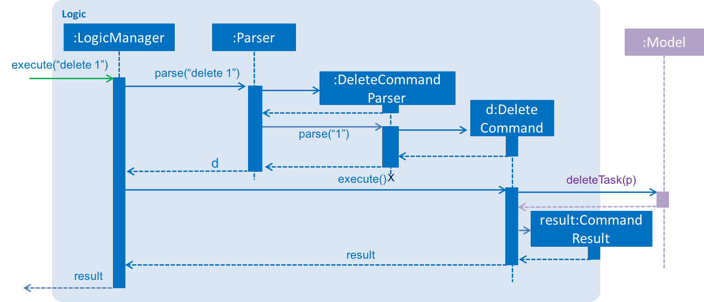

# iManager Developer Guide.

1. [Introduction](#introduction)
2. [Setting Up](#setting-up)
   * 2.1. [Prerequisites](#Prerequisites)
   * 2.2. [Importing the project into Eclipse](#Importing-the-project-into-Eclipse)
   * 2.3. [Configuring Checkstyle](#Configuring-Checkstyle)
   * 2.4. [Troubleshooting project setup](#Troubleshooting-project-setup)
3. [Design](#design)
   * 3.1. [Architecture](#Architecture)
   * 3.2. [UI component](#UI-component)
   * 3.3. [Logic component](#Logic-component)
   * 3.4. [Model component](#Model-component)
   * 3.5. [Storage component](#Storage-component)
   * 3.6. [Common classes](#Common-classes)
4. [Implementation](#implementation)
   * 4.1. [Logging](#Logging)
   * 4.2. [Configuration](#Configuration)
5. [Testing](#testing)
   * 5.1. [Troubleshooting tests](#Troubleshooting-tests)
6. [Dev Ops](#dev-ops)
   * 6.1. [Build Automation](#Build-Automation)
   * 6.2. [Continuous Integration](#Continuous-Integration)
   * 6.3. [Publishing Documentation](#Publishing-Documentation)
   * 6.4. [Making a release](#Making-a-release)
   * 6.5. [Converting Documentation to PDF format](#Converting-Documentation-to-PDF-format)
   * 6.6. [Managing Dependencies](#Managing-Dependencies)
   * [Appendix A: User Stories](#appendix-a--user-stories)
   * [Appendix B: Use Cases](#appendix-b--use-cases)
   * [Appendix C: Non Functional Requirements](#appendix-c--non-functional-requirements)
   * [Appendix D: Glossary](#appendix-d--glossary)
   * [Appendix E : Product Survey](#appendix-e--product-survey)

## 1. Introduction

Welcome to the developer guide of iManager. iManager is an application that helps users to manage their tasks using keyboard or mouse. It is a desktop application written in Java and contains most features that users would ever need to manage their tasks. iManager can help users to add, edit, delete, clear and categorize tasks. It also supports marking tasks as done, undoing and redoing operations and saving data to another file.

This guide is friendly to both new and old contributors who are willing to help with the further development of iManager. It contains subsections including setting up, code design, implementations and testing. Each subsection contains a brief introduction and detailed illustrations.

Without further ado, let us get started.

## 2. Setting up

### 2.1. Prerequisites

1. Make sure you have installed  **JDK `1.8.0_60`** , and take note that having any Java 8 version is not enough. This app will not work with earlier versions of Java 8.
2. You need to have **Eclipse** IDE on your computer.
3. Install **e(fx)clipse** plugin for Eclipse (For further assistance, you can do the steps 2 onwards given in
   [this page](http://www.eclipse.org/efxclipse/install.html#for-the-ambitious))
4. Install **Buildship Gradle Integration** plugin from the Eclipse Marketplace
5. Install **Checkstyle Plug-in** plugin from the Eclipse Marketplace

### 2.2. Importing the project into Eclipse

After setting up Eclipse properly, you can now do the following steps to import this project into Eclipse.

1. Fork this repo, and clone the fork to your computer
2. Open Eclipse (Note: Ensure you have installed the **e(fx)clipse** and **buildship** plugins as given
   in the prerequisites above)
3. Click `File` > `Import`
4. Click `Gradle` > `Gradle Project` > `Next` > `Next`
5. Click `Browse`, then locate the project's directory
6. Click `Finish`

  > * If you are asked whether to 'keep' or 'overwrite' config files, choose to 'keep'.
  > * Depending on your connection speed and server load, it can even take up to 30 minutes for the set up to finish
      (This is because Gradle downloads library files from servers during the project set up process)
  > * If Eclipse auto-changed any settings files during the import process, you can discard those changes.

### 2.3. Configuring Checkstyle

Now you have set up the Eclipse and imported the project, next step is to configure the checkstyle.

1. Click `Project` -> `Properties` -> `Checkstyle` -> `Local Check Configurations` -> `New...`
2. Choose `External Configuration File` under `Type`
3. Enter an arbitrary configuration name e.g. iManager
4. Import checkstyle configuration file found at `config/checkstyle/checkstyle.xml`
5. Click OK once, go to the `Main` tab, use the newly imported check configuration.
6. Tick and select `files from packages`, click `Change...`, and select the `resources` package
7. Click OK twice. Rebuild project if prompted

> Note to click on the `files from packages` text after ticking in order to enable the `Change...` button

### 2.4. Troubleshooting project setup

In case you encounter any problems when setting up, use the following as a guide.

**Problem: Eclipse reports compile errors after new commits are pulled from Git**

* Reason: Eclipse fails to recognize new files that appeared due to the Git pull.
* Solution: Refresh the project in Eclipse: 
  Right click on the project (in Eclipse package explorer), choose `Gradle` -> `Refresh Gradle Project`.

**Problem: Eclipse reports some required libraries missing**

* Reason: Required libraries may not have been downloaded during the project import.
* Solution: [Run tests using Gradle](UsingGradle.md) once (to refresh the libraries).

## 3. Design

This section will introduce you the code design for iManager.

### 3.1. Architecture

 
_Figure 3.1.1 : Architecture Diagram_

The **_Architecture Diagram_** given above explains the high-level design of the App.
Given below is a quick overview of each component.

> Tip: The `.pptx` files used to create diagrams in this document can be found in the [diagrams](diagrams/) folder.
> To update a diagram, modify the diagram in the pptx file, select the objects of the diagram, and choose `Save as picture`.

`Main` has only one class called [`MainApp`](../src/main/java/seedu/address/MainApp.java). It is responsible for,

* At app launch: Initializes the components in the correct sequence, and connects them up with each other.
* At shut down: Shuts down the components and invokes cleanup method where necessary.

[**`Commons`**](#common-classes) represents a collection of classes used by multiple other components.
Two of those classes play important roles at the architecture level.

* `EventsCenter` : This class (written using [Google's Event Bus library](https://github.com/google/guava/wiki/EventBusExplained))
  is used by components to communicate with other components using events (i.e. a form of _Event Driven_ design)
* `LogsCenter` : Used by many classes to write log messages to the App's log file.

The rest of the App consists of four components.

* [**`UI`**](#ui-component) : The UI of the App.
* [**`Logic`**](#logic-component) : The command executor.
* [**`Model`**](#model-component) : Holds the data of the App in-memory.
* [**`Storage`**](#storage-component) : Reads data from, and writes data to, the hard disk.

Each of the four components

* Defines its _API_ in an `interface` with the same name as the Component.
* Exposes its functionality using a `{Component Name}Manager` class.

For example, the `Logic` component (see the class diagram given below) defines it's API in the `Logic.java`
interface and exposes its functionality using the `LogicManager.java` class. 
 
_Figure 3.1.2 : Class Diagram of the Logic Component_

#### Events-Driven nature of the design

The _Sequence Diagram_ below shows how the components interact for the scenario where the user issues the
command `delete 1`.

 
_Figure 3.1.3a : Component interactions for `delete 1` command (part 1)_

>Note how the `Model` simply raises a `TaskListChangedEvent` when the Task List data are changed,
 instead of asking the `Storage` to save the updates to the hard disk.

The diagram below shows how the `EventsCenter` reacts to that event, which eventually results in the updates
being saved to the hard disk and the status bar of the UI being updated to reflect the 'Last Updated' time.  
 
_Figure 3.1.3b : Component interactions for `delete 1` command (part 2)_

> Note how the event is propagated through the `EventsCenter` to the `Storage` and `UI` without `Model` having
  to be coupled to either of them. This is an example of how this Event Driven approach helps us reduce direct
  coupling between components.

#### Undo command and redo command

Next, our approach for undo and redo command will be introduced. Note that iManager only support 5 undo operations and 5 redo operations.

iManager saves task list status into `statusStack` in `Model` component each time after the user changes the task list. The commands will be saved into `commandStack` in `Model` component as well. When the user uses undo command, iManager would check whether there are commands to undo, which means to check whether `commandStack` is empty. If there exists at least one command to undo, with in `Model` component, iManager would pop current task list status from `statusStack` and previous command from `commandStack` and push them to `undoneStatus` stack and `undoneCommand` stack respectively. Finally, iManager will get the previous task list status using peek method from `statusStack` and replace the current task list with the previous one. For the convenience of redo operation, iManager would also save the task list status after undo operation into `Model` component.

When the user type in redo command, iManager would check whether the user has undone anything. If there exists at least one command to redo, iManager would further check whether the user made further changes after the undo command, which means checking the whether the current task list status is the same as the `statusAfterUndo` saved in `Model` component. With the checking result, iManager would edit command result message accordingly. For the part of physically implementing redo operation, iManager would pop command and status in `undoneStatus` stack and `undoneCommand` stack, then push them into `statusStack` and `commandStack` respectively. After that, iManager would replace current task list with the task list peeked from `statusStack`.

Except for this approach, I have also thought of two other different approaches. One of them is to save details of all commands user made. When the user uses redo or undo command, iManager would edit task list accordingly. For example, if user's last command is to add a task named update developer guide, iManager can edit the task list and undo the add command by calling the delete command. After that, iManager can save the undo information in `Model` for the convenience of redo operation. Similar to undo command, following the previous example, redo operation would add the update developer guide task back. However, I chose to use this approach because of three reasons. Firstly, the tasks users would save in the task list would not be too much. Therefore, the task list statuses saved would not consume much memory. Secondly, this approach allows divergence in history. Even though the user changes task list after undo operation, the redo command is still operational. However, one of the approaches that I have thought of depends on the previous status. If user did further changes after undo command and before redo command, redo operation might crash since the previous status has been changed. Finally, due to time limitation, I was forced to choose a method that is relatively easier and less time-consuming to code. This approach might seem naïve, but it is the best approach for our team.

The sections below give more details of each component.

<!---A0135998H-->
### 3.2. UI component

 
_Figure 3.2.1 : Structure of the UI Component_

**API** : [`Ui.java`](../src/main/java/seedu/address/ui/Ui.java)

The UI consists of a `MainWindow` that is made up of parts e.g.`CommandBox`, `ResultDisplay`, `TaskListPanel`, `TaskTabPanel`, `StatusBarFooter`, `BrowserPanel` etc. All these, including the `MainWindow`, inherit from the abstract `UiPart` class.

The `UI` component uses JavaFx UI framework. The layout of these UI parts are defined in matching `.fxml` files
 that are in the `src/main/resources/view` folder. 
 For example, the layout of the [`MainWindow`](../src/main/java/seedu/address/ui/MainWindow.java) is specified in
 [`MainWindow.fxml`](../src/main/resources/view/MainWindow.fxml)

The `UI` component,

* Executes user commands using the `Logic` component.
* Binds itself to some data in the `Model` so that the UI can auto-update when data in the `Model` change.
* Responds to events raised from various parts of the App and updates the UI accordingly.

### 3.3. Logic component

 
_Figure 3.3.1 : Structure of the Logic Component_

**API** : [`Logic.java`](../src/main/java/seedu/address/logic/Logic.java)

1. `Logic` uses the `Parser` class to parse the user command.
2. This results in a `Command` object which is executed by the `LogicManager`.
3. The command execution can affect the `Model` (e.g. adding a task) and/or raise events.
4. The result of the command execution is encapsulated as a `CommandResult` object which is passed back to the `Ui`.

Given below is the Sequence Diagram for interactions within the `Logic` component for the `execute("delete 1")`
 API call. 
 
_Figure 2.3.1 : Interactions Inside the Logic Component for the `delete 1` Command_

### 3.4. Model component

 
_Figure 3.4.1 : Structure of the Model Component_

**API** : [`Model.java`](../src/main/java/seedu/address/model/Model.java)

The `Model`,

* stores a `UserPref` object that represents the user's preferences.
* stores the Task List data.
* stores user's commands and different status for task list.
>  This is for undo command and redo command as illustrated in the architecture part.
* exposes a `UnmodifiableObservableList<ReadOnlyPerson>` that can be 'observed' e.g. the UI can be bound to this list
  so that the UI automatically updates when the data in the list change.
* does not depend on any of the other three components.

### 3.5. Storage component

Author: Darius Foong

 
_Figure 3.5.1 : Structure of the Storage Component_

**API** : [`Storage.java`](../src/main/java/seedu/address/storage/Storage.java)

The `Storage` component,

* can save `UserPref` objects in json format and read it back.
* can save the Task list data in xml format and read it back.

### 3.6. Common classes

Classes used by multiple components are in the `seedu.taskList.commons` package.

## 4. Implementation

After knowing the code design for iManager, this section will introduce you how we implement this application including logging and configuration parts.

### 4.1. Logging

We are using `java.util.logging` package for logging. The `LogsCenter` class is used to manage the logging levels
and logging destinations.

* The logging level can be controlled using the `logLevel` setting in the configuration file
  (See [Configuration](#configuration))
* The `Logger` for a class can be obtained using `LogsCenter.getLogger(Class)` which will log messages according to
  the specified logging level
* Currently log messages are output through: `Console` and to a `.log` file.

**Logging Levels**

* `SEVERE` : This level means that there is a critical problem detected which may possibly cause the termination of the application
* `WARNING` : This level means that there are potential harmful situations
* `INFO` : This level designates the information showing the noteworthy actions by the App
* `FINE` : This level designates the details that is not usually noteworthy but may be useful in debugging
  e.g. print the actual list instead of just its size

### 4.2. Configuration

Certain properties of the application can be controlled (e.g App name, logging level) through the configuration file
(default: `config.json`):

## 5. Testing

This section will introduce you the details of testings for iManager.

Tests can be found in the `./src/test/java` folder.

**In Eclipse**:

* To run all tests, right-click on the `src/test/java` folder and choose
  `Run as` > `JUnit Test`
* To run a subset of tests, you can right-click on a test package, test class, or a test and choose
  to run as a JUnit test.

**Using Gradle**:

* See [UsingGradle.md](UsingGradle.md) for how to run tests using Gradle.

We have two types of tests:

1. **GUI Tests** - These are _System Tests_ that test the entire App by simulating user actions on the GUI.
   These are in the `guitests` package.

2. **Non-GUI Tests** - These are tests not involving the GUI. They include,
   1. _Unit tests_ targeting the lowest level methods/classes.  
      e.g. `seedu.address.commons.UrlUtilTest`
   2. _Integration tests_ that are checking the integration of multiple code units
     (those code units are assumed to be working). 
      e.g. `seedu.address.storage.StorageManagerTest`
   3. Hybrids of unit and integration tests. These test are checking multiple code units as well as
      how the are connected together. 
      e.g. `seedu.address.logic.LogicManagerTest`

#### Headless GUI Testing
Thanks to the [TestFX](https://github.com/TestFX/TestFX) library we use,
 our GUI tests can be run in the _headless_ mode.
 In the headless mode, GUI tests do not show up on the screen.
 That means the developer can do other things on the Computer while the tests are running. 
 See [UsingGradle.md](UsingGradle.md#running-tests) to learn how to run tests in headless mode.

### 5.1. Troubleshooting tests

In case you encounter any trouble, you can refer to the following.

 **Problem: Tests fail because NullPointException when AssertionError is expected**

 * Reason: Assertions are not enabled for JUnit tests.
   This can happen if you are not using a recent Eclipse version (i.e. _Neon_ or later)
 * Solution: Enable assertions in JUnit tests as described
   [here](http://stackoverflow.com/questions/2522897/eclipse-junit-ea-vm-option).  
   Delete run configurations created when you ran tests earlier.

## 6. Dev Ops

### 6.1. Build Automation

You can see [UsingGradle.md](UsingGradle.md) to learn how to use Gradle for build automation.

### 6.2. Continuous Integration

We use [Travis CI](https://travis-ci.org/) and [AppVeyor](https://www.appveyor.com/) to perform _Continuous Integration_ on our projects.
See [UsingTravis.md](UsingTravis.md) and [UsingAppVeyor.md](UsingAppVeyor.md) for more details.

### 6.3. Publishing Documentation

You can refer to [UsingGithubPages.md](UsingGithubPages.md) to learn how to use GitHub Pages to publish documentation to the
project site.

### 6.4. Making a Release

Here are the steps to create a new release.

 1. Generate a JAR file [using Gradle](UsingGradle.md#creating-the-jar-file).
 2. Tag the repo with the version number. e.g. `v0.1`
 2. [Create a new release using GitHub](https://help.github.com/articles/creating-releases/)
    and upload the JAR file you created.

### 6.5. Converting Documentation to PDF format

We use [Google Chrome](https://www.google.com/chrome/browser/desktop/) for converting documentation to PDF format,
as Chrome's PDF engine preserves hyperlinks used in webpages.

Here are the steps to convert the project documentation files to PDF format.

 1. Make sure you have set up GitHub Pages as described in [UsingGithubPages.md](UsingGithubPages.md#setting-up).
 1. Using Chrome, go to the [GitHub Pages version](UsingGithubPages.md#viewing-the-project-site) of the
    documentation file.  
    e.g. For [UserGuide.md](UserGuide.md), the URL will be `https://<your-username-or-organization-name>.github.io/addressbook-level4/docs/UserGuide.html`.
 1. Click on the `Print` option in Chrome's menu.
 1. Set the destination to `Save as PDF`, then click `Save` to save a copy of the file in PDF format.  
    For best results, use the settings indicated in the screenshot below.  
     
    _Figure 6.4.1 : Saving documentation as PDF files in Chrome_

### 6.6. Managing Dependencies

A project often depends on third-party libraries. For example, iManager depends on the
[Jackson library](http://wiki.fasterxml.com/JacksonHome) for XML parsing. Managing these _dependencies_
can be automated using Gradle. For example, Gradle can download the dependencies automatically, which
is better than these alternatives. 
a. Include those libraries in the repo (this bloats the repo size) 
b. Require developers to download those libraries manually (this creates extra work for developers) 

## Appendix A : User Stories

Priorities: High (must have) - `* * *`, Medium (nice to have)  - `* *`,  Low (unlikely to have) - `*`

Priority | As a ... | I want to ... | So that I can...
-------- | :-------- | :--------- | :-----------
`***` | new user | use the program easily | use the program almost immediately without much learning
`***` | user | add event | create new tasks
`***` | user | add floating task | create tasks that have no associated dates
`***` | user | mark task as complete | keep a record of completed tasks
`***` | user | modify a task | update a task with new details or fix an incorrectly entered tasks
`***` | user | delete a task | delete tasks that are no longer necessary
`***` | user | view instructions | learn how to use the program with more details
`***` | user | search for tasks by keywords | look for the tasks I want quickly
`***` | user | choose where to save my tasks | backup my tasks
`***` | user | undo previous operations | revert unintended actions
`***` | user | redo previous operations | change my mind on whether to perform an action
`**` | user | add recurring tasks | create repeating tasks easily
`**` | user | view tasks in a time period | look for related tasks in a time period (use the find command)
`**` | user | see suggestions when typing commands | use the program with minimal reference to instructions
`*` | user | have syntax highlighting | ensure commands are entered correctly
`*` | user | view tasks that require the most attention | pay attention to them first
`*` | user | star a task | mark an important task for priority display
`*` | user | view tasks in a calendar view | visualize tasks assigned to different time periods quickly
`*` | user | create subtasks | add high level and low level tasks
`*` | user | link tasks together | access related tasks quickly
`*` | user | link emails/files/folders to tasks | view more information about a task easily
`*` | user | generate tasks from emails using subject and dates found in the email or using a specified format | create tasks quickly or automatically
`*` | user | receive email reminders for upcoming tasks | remember to complete my tasks
`*` | user | switch interface from normal to compact interface | focus on what i need right now

## Appendix B : Use Cases

#### Use case: UC01 - Input task details

**MSS**

1. Program requests for description of task.
2. User inputs description of task. 
Use case ends

**Extensions**

2a. Program detects the description is empty.

> 2a1. Program shows an error message stating the description is empty.  
  2a2. Program requests for re-input.  
  Use case resumes at step 3

2b. User chooses to add tags(UC02).

> Use case ends

#### Use case: UC02 - Input tags for task

**MSS**

1. User chooses to add tags.
2. Program requests for tags to be added.
3. User inputs tags.
Use case ends

**Extensions**

3a. Program detects that there are no tags specified.

> 3a1. Program shows a warning that there are no tags specified.  
  Use case ends

3b. Program detects that there are duplicate tags specified.

> 3a1. Programs shows a warning that there are duplicate tags specified.  
  Use case ends

#### Use case: Create floating task

**MSS**

1. User chooses to add a floating task.
2. User inputs task details(UC01).
3. Program adds the task to the list of tasks.
Use case ends

#### Use case: Create an event

**MSS**

1. User chooses to add an event.
2. User inputs task details(UC01).
3. Program requests for start date.
4. User inputs start date.
5. Program requests for end date.
6. User inputs end date.
7. Program adds the task to the list of tasks.
Use case ends

**Extensions**

4a. Program detects the start date is empty.

> 4a1. Program shows an error message stating the start date is empty.  
  4a2. Program requests for re-input.  
  Use case resumes at step 4

4b. Program detects the start date is invalid.

> 4b1. Program shows an error message stating the start date is invalid.  
  4b2. Program requests for re-input.  
  Use case resumes at step 4

6a. Program detects the end date is empty.

> 6a1. Program shows an error message stating the end date is empty.  
  6a2. Program requests for re-input.  
  Use case resumes at step 6

6b. Program detects the end date is invalid.

> 6b1. Program shows an error message stating the end date is invalid.  
  6b2. Program requests for re-input.  
  Use case resumes at step 6

#### Use case: Create task with deadline

**MSS**

1. User chooses to add a task with deadline.
2. User inputs task details(UC01).
3. Program requests for deadline.
4. User inputs deadline.
5. Program adds the task to the list of tasks.
Use case ends

**Extensions**

4a. Program detects the deadline is empty.

> 4a1. Program shows an error message stating the deadline is empty.  
  4a2. Program requests for re-input.  
  Use case resumes at step 4

4b. Program detects the deadline is invalid.

> 4b1. Program shows an error message stating the deadline is invalid.  
  4b2. Program requests for re-input.  
  Use case resumes at step 4

#### Use case: Update a task

**MSS**

1. User chooses to update a task.
2. Program requests for the task to be updated.
3. User inputs the task to be updated.
4. Program requests for changes to be made to the task.
5. User inputs the changes to to be made to the task.
6. Program updates the task.
Use case ends

**Extensions**

3a. Program detects that there are multiple tasks with the same words specified by user.

> 3a1. Program requests user to specify the exact task.  
  3a2. User specifies the exact task to be updated.  
  3a3. Program deletes the task.  
  Use case ends

3b. Program detects the specified task is not valid.

> 3b1. Program returns an error message.  
  3b2. Program requests for re-input.  
  Use case resumes at step 3

3a2a. Program detects that there are still multiple tasks with the same words specified by the user.

> Use case resumes at step 3a1

#### Use case: Delete a task

**MSS**

1. User chooses to delete task.
2. Program requests for the task to be deleted.
3. User inputs the task to be deleted.
4. Program deletes the task.
Use case ends

**Extensions**

3a. Program detects that there are multiple tasks with the same words specified by the user.

> 3a1. Program requests user to specify the exact task.  
  3a2. User specifies the exact task to be deleted.  
  3a3. Program deletes the task.  
  Use case ends

3b. Program detects the specified task is not valid.

> 3b1. Program shows an error message.  
  3b2. Program requests for re-input.  
  Use case resumes at step 3

3a2a. Program detects that there are still multiple tasks with the same words specified by the user.

> Use case resumes at step 3a1

#### Use case: Mark a task as complete

**MSS**

1. User chooses to mark a task as complete.
2. Program requests for the task to be marked complete.
3. User inputs the task to be marked complete.
4. Program marks the task as complete.
Use case ends

**Extensions**

3a. Program detects that there are multiple tasks with the same words specified by the user.

> 3a1. Program marks all the tasks with the same words as complete.
  3a2. Program informs user that multiple tasks are marked as complete.
  Use case ends

3b. Program detects the specified task is not valid.

> 3b1. Program shows an error message.
  3b2. Program requests for re-input.
  Use case resumes at step 3

3a2a. Program detects that there are still multiple tasks with the same words specified by the user.

> Use case resumes at step 3a1

#### Use case: Undo operations

**MSS**

1. User chooses to undo operation.
2. Program requests for number of operations to undo.
3. User specifies the number of operations to undo.
4. Program undo the number of operations specified.
Use case ends

**Extensions**

3a. Program detects that user did not specify the number of operations.

> 3a1. Program undo one operation.  
  Use case ends

3b. Program detects the specified number of operations is not valid.

> 3b1. Program requests for re-input for number of operations.  
  Use case resumes at step 3

3c. Programs detect the number of operations to undo is more than the undo history.

> 3c1. Program undo all the operations in the undo history.  
  3c2. Program informs the user that the number specified is more than the undo history so it will undo all operations in the history.  
  Use case ends

#### Use case: Search for tasks

**MSS**

1. User chooses to search for tasks.
2. Program requests for the keywords.
3. User inputs the keywords.
4. Program shows the tasks with the specified keywords.
Use case ends

**Extensions**

3a. Program detects that user did not specify any keywords.

> 3a1. Program shows an error message stating no keywords are specified.  
  3a2. Program requests for re-input.  
  Use case resumes at step 3

## Appendix C : Non Functional Requirements

1. Should work on any [mainstream OS](#mainstream-os) as long as it has Java `1.8.0_60` or higher installed.
2. Should be able to hold up to 100 tasks without a noticeable sluggishness in performance for typical usage.
3. A user with above average typing speed for regular English text (i.e. not code, not system admin commands)
   should be able to accomplish most of the faster using commands than using the mouse.
4. Should have a response time of at most five seconds, including functionality that require longer than five seconds to
   execute. This can be achieved by status updates on an ongoing function.
5. Should have reasonable amount of documentation so that future developers can easily extend the project.
6. Should have reasonably high quality source code as determined by the supervisor.
7. Should not have any proprietary dependencies.
8. Should be able to function standalone without any installation of third-party software (excluding Java).
9. Data should be stored locally in the form of a human editable text file.
10. Should able to work offline.

## Appendix D : Glossary

##### Mainstream OS

> Windows, Linux, Unix, OS-X

##### Response time

> Amount of time elapsed before a system respond upon user input

##### Third-party software

> Any software that is not iManager or pre-installed with the OS

##### Operation

> An action that the user wants to perform, usually a command.

##### Task

> A piece of work required to be done.

##### Command

> An instruction causing computer to perform functions.

##### Functionality

> The range of operations that can be run within the software.

## Appendix E : Product Survey

**Hitask**

Pros:

* Uers can easily sign in with Google account
* Support team work
* Settings allow users to change date and time preferences
* Users can close or open calendar and team when they need to

Cons:

* Ask for too much information when signing in with Google account, might make users feel their privacy is insecure
* Font size is too small, difficult for users to read
* Too much information in one page

**Trello**

Pros:

* Users can easily sign in with Google account without asking for too much information
* Uses a novel way to display tasks
* Users can see the emergency of tasks easily
* Users can add detail information about tasks easily

Cons:

* Small font size
* The interface might not be good enough. After clicking on close menu button or show menu button, the tasks in the same interface do not become larger or smaller accordingly.
* Detailed information of tasks includes boards, labels and due dates, which might be too complex and troublesome for some users.

**Wunderlist**

Pros:

* Accessible on many devices.
* Users can easily sign in with Google account without asking for too much information
* Lists including not only tasks from work but also movies to watch and familiy etc. Creates a less stressful environment for users.
* Interface is simple and clear
* Users can make list copies or share lists easily.
* Users can start conversations with each other.
* Due dates of tasks are clearly shown.

Cons:

* Web application is either not well developed or unintuitive. New users might face difficulties when trying to add new tasks.
* Users can not set due date and reminder directly when creating new task.
* Tasks cannot be sorted by due date.
