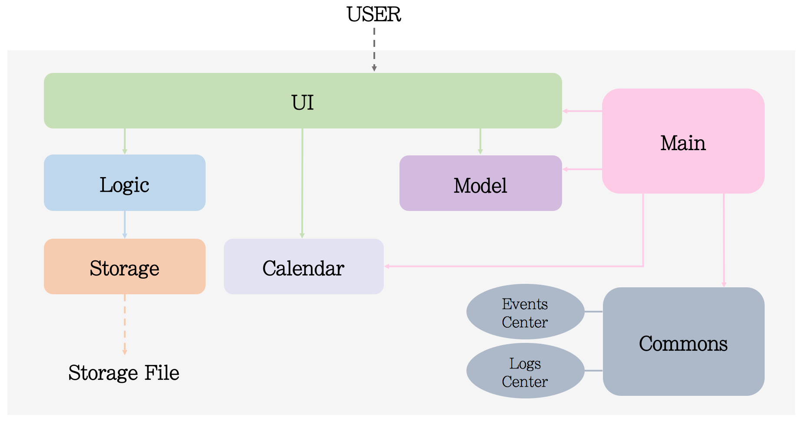
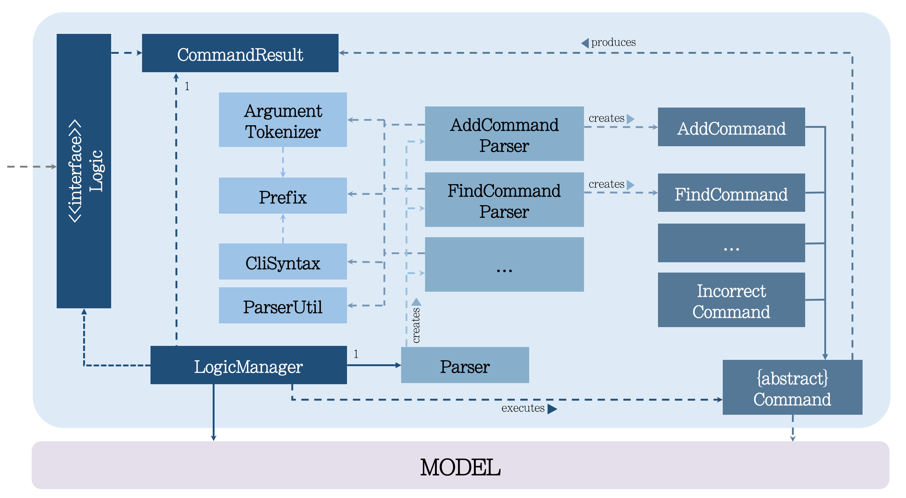
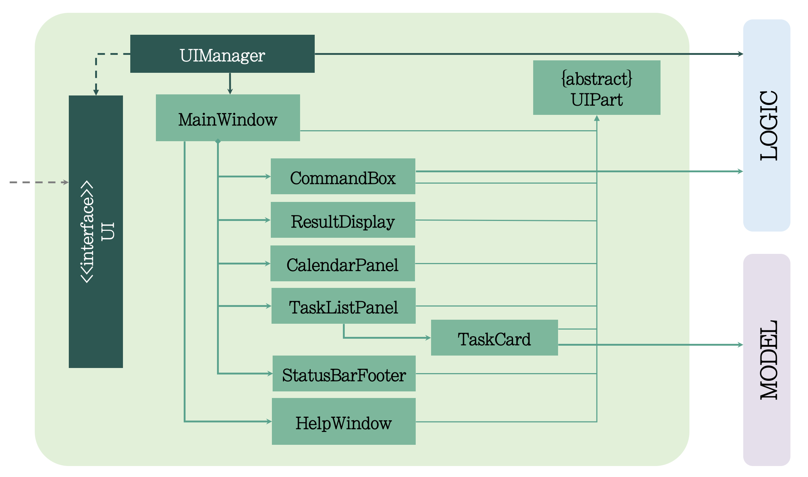
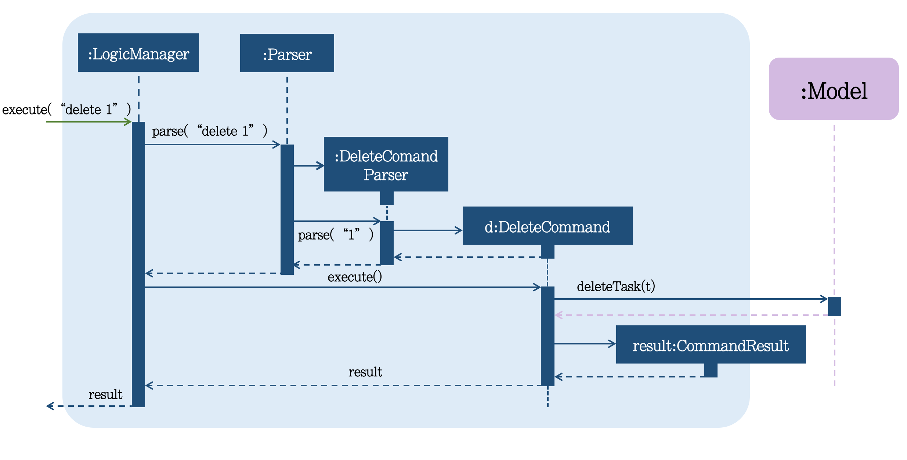
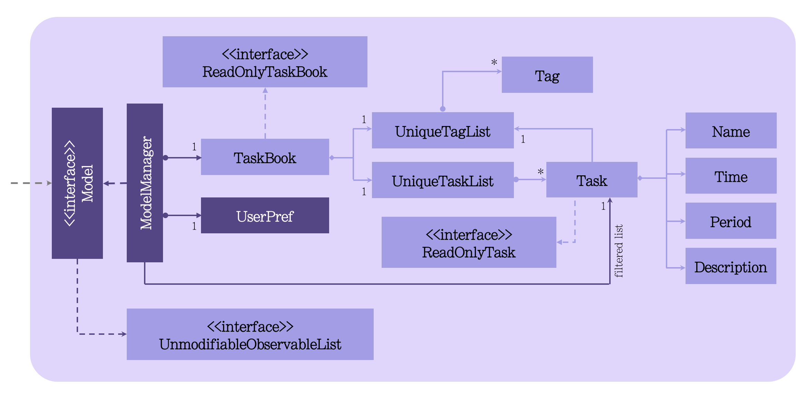
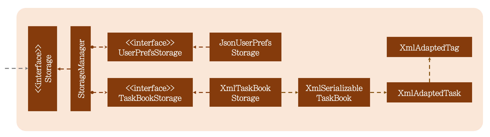

# Developer Guide 

* [Appendix A: User Stories](#appendix-a--user-stories)
* [Appendix B: Use Cases](#appendix-b--use-cases)
* [Appendix C: Non Functional Requirements](#appendix-c--non-functional-requirements)
* [Appendix D: Glossary](#appendix-d--glossary)
* [Appendix E : Product Survey](#appendix-e--product-survey)

## Setting up

#### Prerequisites

1. **JDK `1.8.0_60`**  or later 

    > Having any Java 8 version is not enough.  
    This app will not work with earlier versions of Java 8.
    
2. **Eclipse** IDE
3. **e(fx)clipse** plugin for Eclipse (Do the steps 2 onwards given in
   [this page](http://www.eclipse.org/efxclipse/install.html#for-the-ambitious))
4. **Buildship Gradle Integration** plugin from the Eclipse Marketplace
5. **Checkstyle

#### Importing the project into Eclipse

0. Fork this repo, and clone the fork to your computer
1. Open Eclipse (Note: Ensure you have installed the **e(fx)clipse** and **buildship** plugins as given 
   in the prerequisites above)
2. Click `File` > `Import`
3. Click `Gradle` > `Gradle Project` > `Next` > `Next`
4. Click `Browse`, then locate the project's directory
5. Click `Finish`

  > * If you are asked whether to 'keep' or 'overwrite' config files, choose to 'keep'.
  > * Depending on your connection speed and server load, it can even take up to 30 minutes for the set up to finish
      (This is because Gradle downloads library files from servers during the project set up process)
  > * If Eclipse auto-changed any settings files during the import process, you can discard those changes.
  
#### Configuring Checkstyle
1. Click `Project` -> `Properties` -> `Checkstyle` -> `Local Check Configurations` -> `New...` 
2. Choose `External Configuration File` under `Type`
3. Enter an arbitrary configuration name e.g. taskbook
4. Import checkstyle configuration file found at `config/checkstyle/checkstyle.xml`
5. Click OK once, go to the `Main` tab, use the newly imported check configuration.
6. Tick and select `files from packages`, click `Change...`, and select the `resources` package
7. Click OK twice. Rebuild project if prompted

> Note to click on the `files from packages` text after ticking in order to enable the `Change...` button  

#### Troubleshooting project setup

**Problem: Eclipse reports compile errors after new commits are pulled from Git**
* Reason: Eclipse fails to recognize new files that appeared due to the Git pull. 
* Solution: Refresh the project in Eclipse:  
  Right click on the project (in Eclipse package explorer), choose `Gradle` -> `Refresh Gradle Project`.
  
**Problem: Eclipse reports some required libraries missing**
* Reason: Required libraries may not have been downloaded during the project import. 
* Solution: [Run tests using Gardle](UsingGradle.md) once (to refresh the libraries).
 

## Design

### Architecture

 
The **_Architecture Diagram_** given above explains the high-level design of the App.
Given below is a quick overview of each component.

`Main` has only one class called [`MainApp`](../src/main/java/seedu/jobs/MainApp.java). It is responsible for,
* At app launch: Initializes the components in the correct sequence, and connect them up with each other.
* At shut down: Shuts down the components and invoke cleanup method where necessary.

[**`Commons`**](#common-classes) represents a collection of classes used by multiple other components.
Two of those classes play important roles at the architecture level.
* `EventsCentre` : This class (written using [Google's Event Bus library](https://github.com/google/guava/wiki/EventBusExplained))
  is used by components to communicate with other components using events (i.e. a form of _Event Driven_ design)
* `LogsCenter` : Used by many classes to write log messages to the App's log file.

The rest of the App consists four components.
* [**`UI`**](#ui-component) : The UI of tha App.
* [**`Logic`**](#logic-component) : The command executor.
* [**`Model`**](#model-component) : Holds the data of the App in-memory.
* [**`Storage`**](#storage-component) : Reads data from, and writes data to, the hard disk.

Each of the four components
* Defines its _API_ in an `interface` with the same name as the Component.
* Exposes its functionality using a `{Component Name}Manager` class.

For example, the `Logic` component (see the class diagram given below) defines it's API in the `Logic.java`
interface and exposes its functionality using the `LogicManager.java` class. 
 

##### Events-Driven nature of the design 

The _Sequence Diagram_ below shows how the components interact for the scenario where the user issues the
command `delete 1`.

>Note how the `Model` simply raises a `TaskBookChangedEvent` when the JOBS data are changed,
 instead of asking the `Storage` to save the updates to the hard disk.

The diagram below shows how the `EventsCenter` reacts to that event, which eventually results in the updates
being saved to the hard disk and the status bar of the UI being updated to reflect the 'Last Updated' time.  

> Note how the event is propagated through the `EventsCenter` to the `Storage` and `UI` without `Model` having
  to be coupled to either of them. This is an example of how this Event Driven approach helps us reduce direct 
  coupling between components.

The sections below give more details of each component.

### UI component

 

**API** : [`Ui.java`](../src/main/java/seedu/jobs/ui/Ui.java)

The UI consists of a `MainWindow` that is made up of parts e.g.`CommandBox`, `ResultDisplay`, `TaskListPanel`,
`StatusBarFooter`, `CalendarPanel` etc. All these, including the `MainWindow`, inherit from the abstract `UiPart` class
and they can be loaded using the `UiPartLoader`.

The `UI` component uses JavaFx UI framework. The layout of these UI parts are defined in matching `.fxml` files
 that are in the `src/main/resources/view` folder. 
 For example, the layout of the [`MainWindow`](../src/main/java/seedu/jobs/ui/MainWindow.java) is specified in
 [`MainWindow.fxml`](../src/main/resources/view/MainWindow.fxml)

The `UI` component,
* Executes user commands using the `Logic` component.
* Binds itself to some data in the `Model` so that the UI can auto-update when data in the `Model` change.
* Responds to events raised from various parts of the App and updates the UI accordingly.

### Logic component

 

**API** : [`Logic.java`](../src/main/java/seedu/jobs/logic/Logic.java)

1. `Logic` uses the `Parser` class to parse the user command.
2. This results in a `Command` object which is executed by the `LogicManager`.
3. The command execution can affect the `Model` (e.g. adding a task) and/or raise events.
4. The result of the command execution is encapsulated as a `CommandResult` object which is passed back to the `Ui`.

Given below is the Sequence Diagram for interactions within the `Logic` component for the `execute("delete 1")`
 API call. 
 

### Model component

 

**API** : [`Model.java`](../src/main/java/seedu/jobs/model/Model.java)

The `Model`,
* stores a `UserPref` object that represents the user's preferences.
* stores the JOBS data.
* exposes a `UnmodifiableObservableList<ReadOnlyTask>` that can be 'observed' e.g. the UI can be bound to this list
  so that the UI automatically updates when the data in the list change.
* does not depend on any of the other three components.

### Storage component

 

**API** : [`Storage.java`](../src/main/java/seedu/jobs/storage/Storage.java)

The `Storage` component,
* can save `UserPref` objects in json format and read it back.
* can save the Address Book data in xml format and read it back.

### Common classes

Classes used by multiple components are in the `seedu.jobs.commons` package.

## Implementation

### Logging

We are using `java.util.logging` package for logging. The `LogsCenter` class is used to manage the logging levels
and logging destinations.

* The logging level can be controlled using the `logLevel` setting in the configuration file
  (See [Configuration](#configuration))
* The `Logger` for a class can be obtained using `LogsCenter.getLogger(Class)` which will log messages according to
  the specified logging level
* Currently log messages are output through: `Console` and to a `.log` file.

**Logging Levels**

* `SEVERE` : Critical problem detected which may possibly cause the termination of the application
* `WARNING` : Can continue, but with caution
* `INFO` : Information showing the noteworthy actions by the App
* `FINE` : Details that is not usually noteworthy but may be useful in debugging
  e.g. print the actual list instead of just its size

### Configuration

Certain properties of the application can be controlled (e.g App name, logging level) through the configuration file 
(default: `config.json`):

## Testing

Tests can be found in the `./src/test/java` folder.

**In Eclipse**:
* To run all tests, right-click on the `src/test/java` folder and choose
  `Run as` > `JUnit Test`
* To run a subset of tests, you can right-click on a test package, test class, or a test and choose
  to run as a JUnit test.

**Using Gradle**:
* See [UsingGradle.md](UsingGradle.md) for how to run tests using Gradle.

We have two types of tests:

1. **GUI Tests** - These are _System Tests_ that test the entire App by simulating user actions on the GUI. 
   These are in the `guitests` package.
  
2. **Non-GUI Tests** - These are tests not involving the GUI. They include,
   1. _Unit tests_ targeting the lowest level methods/classes.  
      e.g. `seedu.jobs.commons.UrlUtilTest`
   2. _Integration tests_ that are checking the integration of multiple code units 
     (those code units are assumed to be working). 
      e.g. `seedu.jobs.storage.StorageManagerTest`
   3. Hybrids of unit and integration tests. These test are checking multiple code units as well as 
      how the are connected together. 
      e.g. `seedu.jobs.logic.LogicManagerTest`
  
#### Headless GUI Testing
Thanks to the [TestFX](https://github.com/TestFX/TestFX) library we use,
 our GUI tests can be run in the _headless_ mode. 
 In the headless mode, GUI tests do not show up on the screen.
 That means the developer can do other things on the Computer while the tests are running. 
 See [UsingGradle.md](UsingGradle.md#running-tests) to learn how to run tests in headless mode.
 
#### Troubleshooting tests
 **Problem: Tests fail because NullPointException when AssertionError is expected**
 * Reason: Assertions are not enabled for JUnit tests. 
   This can happen if you are not using a recent Eclipse version (i.e. _Neon_ or later)
 * Solution: Enable assertions in JUnit tests as described 
   [here](http://stackoverflow.com/questions/2522897/eclipse-junit-ea-vm-option).  
   Delete run configurations created when you ran tests earlier.
  
## Dev Ops

### Build Automation

See [UsingGradle.md](UsingGradle.md) to learn how to use Gradle for build automation.

### Continuous Integration

We use [Travis CI](https://travis-ci.org/) to perform _Continuous Integration_ on our projects.
See [UsingTravis.md](UsingTravis.md) for more details.

### Making a Release

Here are the steps to create a new release.
 
 1. Generate a JAR file [using Gradle](UsingGradle.md#creating-the-jar-file).
 2. Tag the repo with the version number. e.g. `v0.1`
 2. [Create a new release using GitHub](https://help.github.com/articles/creating-releases/) 
    and upload the JAR file your created.
   
### Managing Dependencies

A project often depends on third-party libraries. For example, JOBS depends on the
[Jackson library](http://wiki.fasterxml.com/JacksonHome) for XML parsing. Managing these _dependencies_
can be automated using Gradle. For example, Gradle can download the dependencies automatically, which
is better than these alternatives. 
a. Include those libraries in the repo (this bloats the repo size) 
b. Require developers to download those libraries manually (this creates extra work for developers) 

## Appendix A : User Stories

Priorities: High (must have) - `* * *`, Medium (nice to have)  - `* *`,  Low (unlikely to have) - `*`

Priority | As a ... | I want to ... | So that I can...
-------- | :-------- | :--------- | :-----------
`* * *` | user | add a task with deadlines | record tasks that need to be done
`* * *` | user | add a floating task | record tasks without specific deadlines
`* * *` | user |add an event | record tasks that have start time and end time
`* * *` | user | add a recurring task | record task that will recur at certain frequency
`* * *` | user | list all task filtered by task types/completion/date/tags| view a specific section of the tasks that have to completed
`* * *` | user | edit my task | ensure that the task is still relevant
`* * *` | user | delay my task |automatically postpone deadlines 
`* * *` | user | delete my task | conveniently remove task that is no longer relevant
`* * *` | user  | delete all my task | clear my data
`* * *` | user | delete my task | conveniently remove task that is no longer relevant
`* * *` | new user | have some flexibility in inputting my command | conveniently remove task that is no longer relevant
`* * *` | advanced user | utilize text search | find specific tasks with specificied tags or keywords
`* * *` | user | load my data from any specified location | have ease of access in using the application
`* * *` | user | export my data to any specified location | share my task list with other local machines
`* * *` | user | set a deadline reminder | been notified at some time before deadline
`* * *` | new user | view command lists or more information about a particular command | learn how to use various command
`* * ` | user | add several tags for a task | search tasks based on tags
`* * ` | user | sort listed task based on deadline | prioritize the completion of task
`* * ` | user | find recently deleted tasks | retrieve accidentally deleted tasks and monitor past activities
`* * ` | user | support for undo/redo operation | flexibly manage the changes made on the list of task
`*` | user | upload todo items to Google Calendar | synchronize with Google Calendar
`*` | user | customize application’s background | personalize the appearance of the task manager
`*` | user | view different task types in different areas on GUI | view different task types easier
`*` | advanced user | type commands with auto-complete | type a command faster
`*` | advanced user | alias a particular command with some arguments | type a command faster

{More to be added}

## Appendix B : Use Cases

(For all use cases below, the **System** is the `JOBS` and the **Actor** is the `user`, unless specified otherwise)

#### Use case: 

**UC01 ‐ Create a task**

**MSS**

1. User types in the task that he/she wishes to be included in the task reminder
2. System informs the user that the task has been included in the task reminder
Use case ends.  
 
**Extensions**
User enters the wrong task format
JOBS shows the expected task format
JOBS prompts user to re-enter the task 

> Use case ends

**Use case: UC02 ‐ Task Listing **

**MSS**

1. User types in the kind of task that he wants to list
2. System outputs all the information with regards to the task the user queries

**Extensions**
User enters the wrong task format
System shows the expected task format
System prompts user to re-enter the task
The specific task name or filter cannot be found
System informs the user that the specific task/filter cannot be found

>Use case ends.  

**Use case: UC03 ‐ Update a task**

**MSS**

1. User chooses to update a task
2. System requests for task selection.
3. User selects the task.
4. System requests for details of the update.
5. User enters the requested details.
6. System requests for confirmation.
7. User confirms update.
8. System updates the selected task and displays the updated task’s information.
Use case ends.  

**Extensions**  
3a. The input task cannot be found.
	3a1. System requests for creating new task.
	3a2. System confirms creating new task.
	3a3. System creates a new task. (UC01)

5a. System detects an error in the entered data.
	5a1. System requests for the correct data.
	5a2. User enters new data.
Step 5a1-5a2 are repeated until the data entered are correct.
Use case resumes from step 6.

* a. At  any time, user chooses to cancel the update
	*a1. System requests to confirm the cancellation.
	*a2. User confirms the cancellation.
	*a3. System discards all the changes.

>Use case ends.

**Use case: UC04 ‐ Delete a task**

**MSS**

1. User chooses to delete a specified task.
2. System requests for confirmation.
3. User confirms deletion
4. System delete the selected task and displays the updated list of task.
Use case ends.  

**Extensions**

1a. The specified task cannot be found.
	1a1. System shows an error message.
	Use case ends

{More to be added}

## Appendix C : Non Functional Requirements

1. Should work on any [mainstream OS](#mainstream-os) as long as it has Java `1.8.0_60` or higher installed.
2. Should be able to hold up to 1000 tasks.
3. Should come with automated unit tests and open source code.
4. Should favor natural language style commands.
5. Should be less than 300MB.
6. Should be able to add plugins.
7. Should be free to use.

{More to be added}

## Appendix D : Glossary

##### BucketList
>The name of this application

##### Events

> A task with specific start and end timing 

##### Floating task

> A task with no specific deadlines

##### Recurring task

> A task that recurs every fix period of time

## Appendix E : Product Survey

### HiTask
Pros:
* Convenient for (shared) project management with features including centralized file library and calendar, synchronization across devices, etc 
* Single-window display
* Provides scheduling platform for hour by hour basis

Cons:
* Complicated navigation procedures involving a lot of clicks, drop-downs or task expansions
* Overly structured which limit flexibility 
* A lot of (unnecessary) functionality that might overwhelm user

### Google Calendar + Google Task
Pros:
* Flexibility in access (private or shared) allows for shared project management 
* Provides scheduling platform for hour by hour basis
* Flexibility in display setting 

Cons:
* Complicated navigation procedures involving a lot of clicks, drop-downs or task expansions
* Overly structured task input requirements limits flexibility 
* Requires internet access for updating, offline access only allows read only display

### Todo.txt
Pros:
* Utilizes plain text as the navigation medium with limited clicks necessary (no checkboxes, drop-downs, etc)
* Simple interface with neat output display
* Comprehensible command words 

Cons:
* Mostly suitable for people comfortable with CLI
* Limited command keyword flexibility

### Todoist
Pros:
* Convenient group task management for shared collaboration (task sharing)
* Flexible navigation with both clicks and keyboard access (shortcut keys)
* Support task list duplication for recurring tasks
* Good intuitive, natural language interpretation for date/time

Cons:
* Relatively structured as every task require a label

### Wunderlist
Pros:
* Convenient group task management for shared collaboration (task sharing)
* Flexible navigation with both clicks and keyboard access (shortcut keys)
* Support task list duplication for recurring tasks

Cons:
* Limited natural language interpretation for date/time
* A lot of (unnecessary) functionality that might overwhelm user (cognitive overload)
