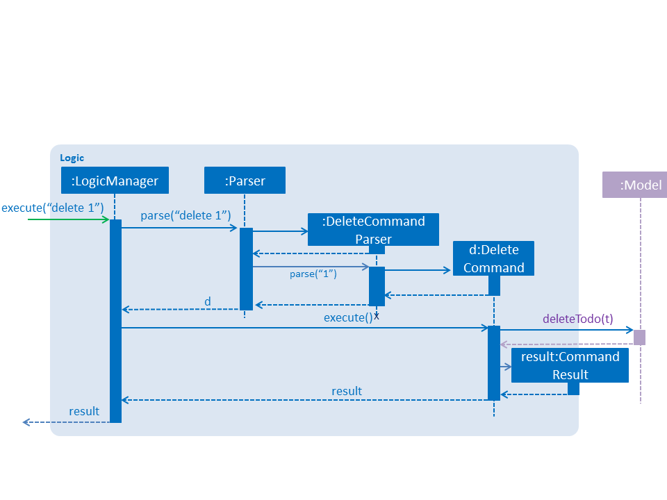
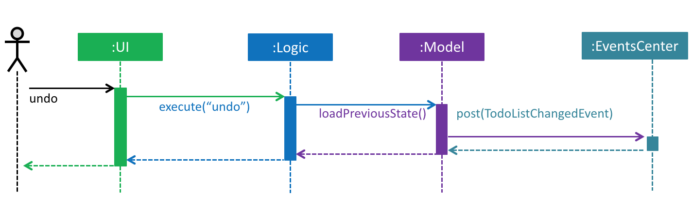
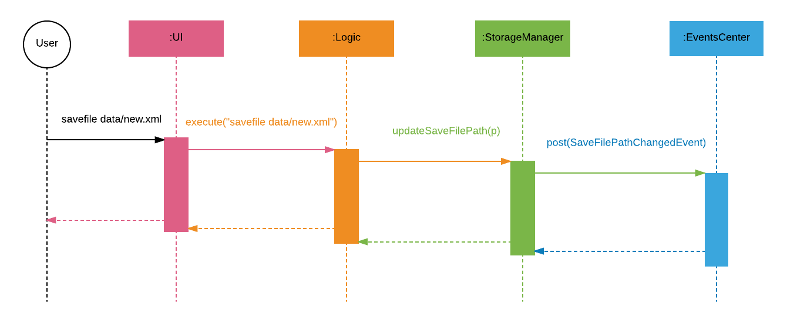
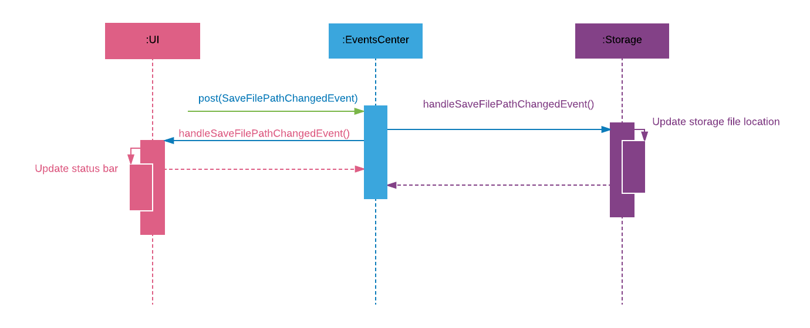

# TodoList Level 4 - Developer Guide

By : `Team AwesomeTodo`  &nbsp;&nbsp;&nbsp;&nbsp; Since: `Jan 2017`  &nbsp;&nbsp;&nbsp;&nbsp; Licence: `MIT`

---

1. [Setting Up](#setting-up)
2. [Design](#design)
3. [Implementation](#implementation)
4. [Testing](#testing)
5. [Dev Ops](#dev-ops)

* [Appendix A: User Stories](#appendix-a--user-stories)
* [Appendix B: Use Cases](#appendix-b--use-cases)
* [Appendix C: Non Functional Requirements](#appendix-c--non-functional-requirements)
* [Appendix D: Glossary](#appendix-d--glossary)
* [Appendix E : Product Survey](#appendix-e--product-survey)

## 1. Setting up

### 1.1. Prerequisites

1. **JDK `1.8.0_60`**  or later 

    > Having any Java 8 version is not enough.  
    This app will not work with earlier versions of Java 8.

2. **Eclipse** IDE
3. **e(fx)clipse** plugin for Eclipse (Do the steps 2 onwards given in
   [this page](http://www.eclipse.org/efxclipse/install.html#for-the-ambitious))
4. **Buildship Gradle Integration** plugin from the Eclipse Marketplace
5. **Checkstyle Plug-in** plugin from the Eclipse Marketplace

### 1.2. Importing the project into Eclipse

0. Fork this repo, and clone the fork to your computer
1. Open Eclipse (Note: Ensure you have installed the **e(fx)clipse** and **buildship** plugins as given
   in the prerequisites above)
2. Click `File` > `Import`
3. Click `Gradle` > `Gradle Project` > `Next` > `Next`
4. Click `Browse`, then locate the project's directory
5. Click `Finish`

  > * If you are asked whether to 'keep' or 'overwrite' config files, choose to 'keep'.
  > * Depending on your connection speed and server load, it can even take up to 30 minutes for the set up to finish
      (This is because Gradle downloads library files from servers during the project set up process)
  > * If Eclipse auto-changed any settings files during the import process, you can discard those changes.

### 1.3. Configuring Checkstyle
1. Click `Project` -> `Properties` -> `Checkstyle` -> `Local Check Configurations` -> `New...`
2. Choose `External Configuration File` under `Type`
3. Enter an arbitrary configuration name e.g. todolist
4. Import checkstyle configuration file found at `config/checkstyle/checkstyle.xml`
5. Click OK once, go to the `Main` tab, use the newly imported check configuration.
6. Tick and select `files from packages`, click `Change...`, and select the `resources` package
7. Click OK twice. Rebuild project if prompted

> Note to click on the `files from packages` text after ticking in order to enable the `Change...` button

### 1.4. Troubleshooting project setup

**Problem: Eclipse reports compile errors after new commits are pulled from Git**

* Reason: Eclipse fails to recognize new files that appeared due to the Git pull.
* Solution: Refresh the project in Eclipse: 
  Right click on the project (in Eclipse package explorer), choose `Gradle` -> `Refresh Gradle Project`.

**Problem: Eclipse reports some required libraries missing**

* Reason: Required libraries may not have been downloaded during the project import.
* Solution: [Run tests using Gradle](UsingGradle.md) once (to refresh the libraries).

## 2. Design

### 2.1. Architecture

 
_Figure 2.1.1 : Architecture Diagram_

The **_Architecture Diagram_** given above explains the high-level design of the App.
Given below is a quick overview of each component.

> Tip: The `.pptx` files used to create diagrams in this document can be found in the [diagrams](diagrams/) folder.
> To update a diagram, modify the diagram in the pptx file, select the objects of the diagram, and choose `Save as picture`.

`Main` has only one class called [`MainApp`](../src/main/java/seedu/todolist/MainApp.java). It is responsible for,

* At app launch: Initializes the components in the correct sequence, and connects them up with each other.
* At shut down: Shuts down the components and invokes cleanup method where necessary.

[**`Commons`**](#common-classes) represents a collection of classes used by multiple other components.
Two of those classes play important roles at the architecture level.

* `EventsCenter` : This class (written using [Google's Event Bus library](https://github.com/google/guava/wiki/EventBusExplained))
  is used by components to communicate with other components using events (i.e. a form of _Event Driven_ design)
* `LogsCenter` : Used by many classes to write log messages to the App's log file.

The rest of the App consists of four components.

* [**`UI`**](#ui-component) : The UI of the App.
* [**`Logic`**](#logic-component) : The command executor.
* [**`Model`**](#model-component) : Holds the data of the App in-memory.
* [**`Storage`**](#storage-component) : Reads data from, and writes data to, the hard disk.

Each of the four components

* Defines its _API_ in an `interface` with the same name as the Component.
* Exposes its functionality using a `{Component Name}Manager` class.

For example, the `Logic` component (see the class diagram given below) defines it's API in the `Logic.java`
interface and exposes its functionality using the `LogicManager.java` class. 
 
_Figure 2.1.2 : Class Diagram of the Logic Component_

#### Events-Driven nature of the design

The _Sequence Diagram_ below shows how the components interact for the scenario where the user issues the
command `delete 1`.

 
_Figure 2.1.3a : Component interactions for `delete 1` command (part 1)_

>Note how the `Model` simply raises a `TodoListChangedEvent` when the TodoList data are changed,
 instead of asking the `Storage` to save the updates to the hard disk.

The diagram below shows how the `EventsCenter` reacts to that event, which eventually results in the updates
being saved to the hard disk and the status bar of the UI being updated to reflect the 'Last Updated' time.  
 
_Figure 2.1.3b : Component interactions for `delete 1` command (part 2)_

> Note how the event is propagated through the `EventsCenter` to the `Storage` and `UI` without `Model` having
  to be coupled to either of them. This is an example of how this Event Driven approach helps us reduce direct
  coupling between components.

The sections below give more details of each component.

### 2.2. UI component

Author: Alice Bee

 
_Figure 2.2.1 : Structure of the UI Component_

**API** : [`Ui.java`](../src/main/java/seedu/todolist/ui/Ui.java)

The UI consists of a `MainWindow` that is made up of parts e.g.`CommandBox`, `ResultDisplay`, `TodoListPanel`,
`StatusBarFooter`, `BrowserPanel` etc. All these, including the `MainWindow`, inherit from the abstract `UiPart` class.

The `UI` component uses JavaFx UI framework. The layout of these UI parts are defined in matching `.fxml` files
 that are in the `src/main/resources/view` folder. 
 For example, the layout of the [`MainWindow`](../src/main/java/seedu/todolist/ui/MainWindow.java) is specified in
 [`MainWindow.fxml`](../src/main/resources/view/MainWindow.fxml)

The `UI` component,

* Executes user commands using the `Logic` component.
* Binds itself to some data in the `Model` so that the UI can auto-update when data in the `Model` change.
* Responds to events raised from various parts of the App and updates the UI accordingly.

### 2.3. Logic component

Author: Bernard Choo

 
_Figure 2.3.1 : Structure of the Logic Component_

**API** : [`Logic.java`](../src/main/java/seedu/todolist/logic/Logic.java)

1. `Logic` uses the `Parser` class to parse the user command.
2. This results in a `Command` object which is executed by the `LogicManager`.
3. The command execution can affect the `Model` (e.g. adding a todo) and/or raise events.
4. The result of the command execution is encapsulated as a `CommandResult` object which is passed back to the `Ui`.

Given below is the Sequence Diagram for interactions within the `Logic` component for the `execute("delete 1")`
 API call. 
 
_Figure 2.3.1 : Interactions Inside the Logic Component for the `delete 1` Command_

### 2.4. Model component

Author: Cynthia Dharman

 
_Figure 2.4.1 : Structure of the Model Component_

**API** : [`Model.java`](../src/main/java/seedu/todolist/model/Model.java)

The `Model`,

* stores a `UserPref` object that represents the user's preferences.
* stores the TodoList data.
* stores two stacks, one which holds the previous states of the todo list and one which holds the next states (See `Handling Undo/Redo Command`).
* exposes a `UnmodifiableObservableList<ReadOnlyTodo>` that can be 'observed' e.g. the UI can be bound to this list
  so that the UI automatically updates when the data in the list change.
* does not depend on any of the other three components.

**Handling Undo/Redo Command**

As shown in Figure 2.4.1, the `Model` component stores two stacks. One of these stacks keeps a record of all previous states, and one keeps a record of all next states. Initially, the next states stack is empty. When a user runs a modifying command such as `add`, the current todo list is pushed into the previous states stack before the command is run. If the user then runs `undo`, the current todo list is pushed into the next states stack. Then, the previous state is popped from previous states stack and used to populate the current todo list. If the user subsequenty runs `redo`, the current todo list is pushed into the previous states stack. Then, the next state is popped from the next states stack and used to populate the current todo list. This allows the user to undo/redo as many commands as they wish. The Sequence Diagram below shows how the components interact when the user enters the "undo" command.

 
_Figure 2.4.1 : Sequence Diagram for Undo Command_

### 2.5. Storage component

Author: Darius Foong, Justin Wong

 
_Figure 2.5.1 : Structure of the Storage Component_

**API** : [`Storage.java`](../src/main/java/seedu/todolist/storage/Storage.java)

The `Storage` component,

* can save `UserPref` objects in json format and read it back.
* can save the TodoList data in xml format and read it back.

**Handling Save File Location Changes**

The Sequence Diagrams below show how the components interact for the scenario where the user requests to change the save file location.

 
_Figure 2.5.2 : Component interactions for `saveFile data/new.xml` command (part 1)_

>The `StorageManager` raises a SaveFileChangedEvent when the save file is changed by the user

The diagram below shows how the EventsCenter reacts to that event, which eventually updates the path location in the configuration file and updates the status bar of the UI to reflect the 'Last Updated' time and new save file path.

 
_Figure 2.5.3 : Component interactions for `savefile data/new.xml` command (part 2)_

>The event is fired through the `EventsCenter` to the `Storage` and `UI` without `Model` having to be coupled to either of them. This is an example of how this Event Driven approach helps us reduce direct coupling between components.

### 2.6. Common classes

Classes used by multiple components are in the `seedu.todolist.commons` package.

## 3. Implementation

### 3.1. Logging

We are using `java.util.logging` package for logging. The `LogsCenter` class is used to manage the logging levels
and logging destinations.

* The logging level can be controlled using the `logLevel` setting in the configuration file
  (See [Configuration](#configuration))
* The `Logger` for a class can be obtained using `LogsCenter.getLogger(Class)` which will log messages according to
  the specified logging level
* Currently log messages are output through: `Console` and to a `.log` file.

**Logging Levels**

* `SEVERE` : Critical problem detected which may possibly cause the termination of the application
* `WARNING` : Can continue, but with caution
* `INFO` : Information showing the noteworthy actions by the App
* `FINE` : Details that is not usually noteworthy but may be useful in debugging
  e.g. print the actual list instead of just its size

### 3.2. Configuration

Certain properties of the application can be controlled (e.g App name, logging level) through the configuration file
(default: `config.json`):

## 4. Testing

Tests can be found in the `./src/test/java` folder.

**In Eclipse**:

* To run all tests, right-click on the `src/test/java` folder and choose
  `Run as` > `JUnit Test`
* To run a subset of tests, you can right-click on a test package, test class, or a test and choose
  to run as a JUnit test.

**Using Gradle**:

* See [UsingGradle.md](UsingGradle.md) for how to run tests using Gradle.

We have two types of tests:

1. **GUI Tests** - These are _System Tests_ that test the entire App by simulating user actions on the GUI.
   These are in the `guitests` package.

2. **Non-GUI Tests** - These are tests not involving the GUI. They include,
   1. _Unit tests_ targeting the lowest level methods/classes.  
      e.g. `seedu.todolist.commons.UrlUtilTest`
   2. _Integration tests_ that are checking the integration of multiple code units
     (those code units are assumed to be working). 
      e.g. `seedu.todolist.storage.StorageManagerTest`
   3. Hybrids of unit and integration tests. These test are checking multiple code units as well as
      how the are connected together. 
      e.g. `seedu.todolist.logic.LogicManagerTest`

#### Headless GUI Testing
Thanks to the [TestFX](https://github.com/TestFX/TestFX) library we use,
 our GUI tests can be run in the _headless_ mode.
 In the headless mode, GUI tests do not show up on the screen.
 That means the developer can do other things on the Computer while the tests are running. 
 See [UsingGradle.md](UsingGradle.md#running-tests) to learn how to run tests in headless mode.

### 4.1. Troubleshooting tests

 **Problem: Tests fail because NullPointException when AssertionError is expected**

 * Reason: Assertions are not enabled for JUnit tests.
   This can happen if you are not using a recent Eclipse version (i.e. _Neon_ or later)
 * Solution: Enable assertions in JUnit tests as described
   [here](http://stackoverflow.com/questions/2522897/eclipse-junit-ea-vm-option).  
   Delete run configurations created when you ran tests earlier.

## 5. Dev Ops

### 5.1. Build Automation

See [UsingGradle.md](UsingGradle.md) to learn how to use Gradle for build automation.

### 5.2. Continuous Integration

We use [Travis CI](https://travis-ci.org/) and [AppVeyor](https://www.appveyor.com/) to perform _Continuous Integration_ on our projects.
See [UsingTravis.md](UsingTravis.md) and [UsingAppVeyor.md](UsingAppVeyor.md) for more details.

### 5.3. Publishing Documentation

See [UsingGithubPages.md](UsingGithubPages.md) to learn how to use GitHub Pages to publish documentation to the
project site.

### 5.4. Making a Release

Here are the steps to create a new release.

 1. Generate a JAR file [using Gradle](UsingGradle.md#creating-the-jar-file).
 2. Tag the repo with the version number. e.g. `v0.1`
 2. [Create a new release using GitHub](https://help.github.com/articles/creating-releases/)
    and upload the JAR file you created.

### 5.5. Converting Documentation to PDF format

We use [Google Chrome](https://www.google.com/chrome/browser/desktop/) for converting documentation to PDF format,
as Chrome's PDF engine preserves hyperlinks used in webpages.

Here are the steps to convert the project documentation files to PDF format.

 1. Make sure you have set up GitHub Pages as described in [UsingGithubPages.md](UsingGithubPages.md#setting-up).
 1. Using Chrome, go to the [GitHub Pages version](UsingGithubPages.md#viewing-the-project-site) of the
    documentation file.  
    e.g. For [UserGuide.md](UserGuide.md), the URL will be `https://<your-username-or-organization-name>.github.io/todolist-level4/docs/UserGuide.html`.
 1. Click on the `Print` option in Chrome's menu.
 1. Set the destination to `Save as PDF`, then click `Save` to save a copy of the file in PDF format.  
    For best results, use the settings indicated in the screenshot below.  
     
    _Figure 5.4.1 : Saving documentation as PDF files in Chrome_

### 5.6. Managing Dependencies

A project often depends on third-party libraries. For example, TodoList depends on the
[Jackson library](http://wiki.fasterxml.com/JacksonHome) for XML parsing. Managing these _dependencies_
can be automated using Gradle. For example, Gradle can download the dependencies automatically, which
is better than these alternatives. 
a. Include those libraries in the repo (this bloats the repo size) 
b. Require developers to download those libraries manually (this creates extra work for developers) 

## Appendix A : User Stories

Priorities: High (must have) - `* * *`, Medium (nice to have)  - `* *`,  Low (unlikely to have) - `*`

Priority | As a ... | I want to ... | So that I can...
-------- | :-------- | :--------- | :-----------
`* * *` | user | create a task without a specific start time and deadline | create a task with little details
`* * *` | user | read my task
`* * *` | user | add a new task |
`* * *` | user | delete a task | remove entries that I no longer need
`* * *` | user | update the details of a task
`* * *` | user | undo recent action | fix my error quickly
`* * *` | user | perform a text search for a task | find my task quickly
`* * *` | user | see my task history | determine which tasks are done and which are not
`* * *` | user | assign a task a due date
`* *` | new user | see usage instructions | refer to instructions when I forget how to use the App
`* *` | user | delete tasks by tag or category | delete tasks in batches
`* *` | user | find a task by name | locate details of task without having to go through the entire list
`*` | user with many tasks in the todo | sort tasks by category | locate a task easily
`*` | user | notified if a task is due soon | start on the task

{More to be added}

## Appendix B : Use Cases

(For all use cases below, the **System** is the `Todo` and the **Actor** is the `user`, unless specified otherwise)

### Use case: List tasks

**MSS**

1. User requests to list tasks
2. Todo shows a list of tasks
Use case ends.

**Extensions**

2a. The list is empty

> Use case ends

### Use case: Delete task

**MSS**

1. User requests to list tasks
2. Todo shows a list of tasks
3. User requests to delete a specific task in the list
4. Todo deletes the task  
Use case ends.

**Extensions**

2a. The list is empty

> Use case ends

3a. The given index is invalid

> 3a1. Todo shows an error message  
  Use case resumes at step 2

### Use case: Reschedule task

**MSS**

1. User requests to list tasks
2. Todo shows a list of tasks
3. User requests to reschedule a specific task in the list with a new due date
4. Todo reschedules the task  
Use case ends.

**Extensions**

2a. The list is empty

> Use case ends

3a. The given index is invalid

> 3a1. Todo shows an error message  
  Use case resumes at step 2

### Use case: Completing a task

**MSS**

1. User requests to list tasks
2. Todo shows a list of tasks
3. User requests to mark a specific task in the list as complete
4. Todo marks the task as complete  
Use case ends.

**Extensions**

2a. The list is empty

> Use case ends

3a. The given index is invalid

> 3a1. Todo shows an error message  
  Use case resumes at step 2

3b. The given task is already marked as complete

> 3b1. Todo shows an error message  
  Use case resumes at step 2

### Use case: Searching for a task

**MSS**

1. User requests to search for a task
2. Todo searches for task with exact or similar names
3. Todo lists the tasks that best match the search query
Use case ends.

**Extensions**

2a. The list is empty

> Use case ends

{More to be added}

## Appendix C : Non Functional Requirements

1. Should work on any [mainstream OS](#mainstream-os) as long as it has Java `1.8.0_60` or higher installed.
2. Should be able to hold up to 1000 tasks without a noticeable sluggishness in performance for typical usage.
3. A user with above average typing speed for regular English text (i.e. not code, not system admin commands)
   should be able to accomplish most of the tasks faster using commands than using the mouse.
4. Should work with the command line.
5. Program should boot up in less than 3 seconds.
6. Should work without any third party extensions.
7. Should not require an installer

{More to be added}

## Appendix D : Glossary

##### Mainstream OS

> Windows, Linux, Unix, OS-X

##### Private contact detail

> A contact detail that is not meant to be shared with others

## Appendix E : Product Survey

**Wunderlist**

Author: Wunderlist

Pros:

* Desktop, web and mobile app available with cloud sync (access from anywhere)
* Desktop app supports keyboard shortcuts
* Todo-list-style-app captures tasks that need to be done before/after a specific date/time or tasks without specific times
* Able to add a task with just the keyboard (i.e. keyboard shortcut to add a new task and then key in the new task)
* Operates with/without internet connectivity
* Can prioritize/flag important tasks
* Easy and intuitive to mark a completed task or to postpone an item
* Feature to add notes to tasks
* Notifications, due dates and reminders
* Folders for categorizing and grouping similar tasks
* Tagging to add more context to to-dos
* Search support
* Email and web plug-ins (e.g. turn emails into actions by forwarding * them) which accelerate the process of adding an email related task
* Sub tasks
* File attachments to a task

Cons:

* Unable to view schedule availability (i.e. no concept of open slot, busy slot, conflicts, etc.)
* No calendar view so it is difficult to visually understand when tasks are due

**Reminders**

Author: Apple Inc.

Pros:

* Desktop, web and mobile app available with cloud sync (access from anywhere)
* Siri and spotlight support (with 3rd party addon) that allows users to quickly add tasks with voice commands and spotlight commands respectively
* Keyboard shortcuts
* Operates with/without internet connectivity
* Easy and intuitive to mark a completed task
* Notifications, due dates and reminders
* Categories/folders
* Search support

Cons:

* Desktop and mobile apps only available for OSX
* No intuitive way of postponing a task
* Cannot add notes to tasks
* Cannot add files/attachments to tasks
* No email and web plug-in support
* No sub tasks
* Unable to view schedule availability
* No calendar view
* Cannot prioritize tasks

**Fantastical**

Author: Flexibits Inc.

Pros:

* Desktop, web and mobile app available with cloud sync
* Keyboard shorcuts
* Operates with/without internet connectivity
* Calendar view to easily visualize calendar events, task deadlines, conflicts, etc.
* Notifications, due dates and reminders
* Categories and tags
* Search support
* Supports calendar events as well as todo tasks
* Natural language processing

Cons:
* No email forwarding
* Cannot add notes to tasks
* No sub tasks
* No file or attachment support
