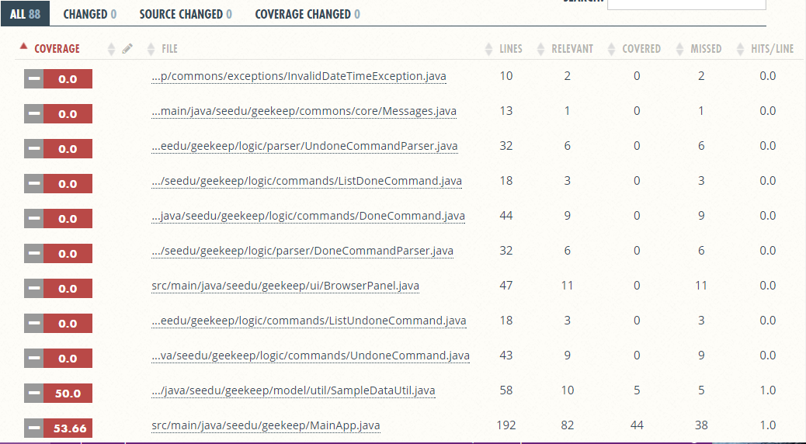
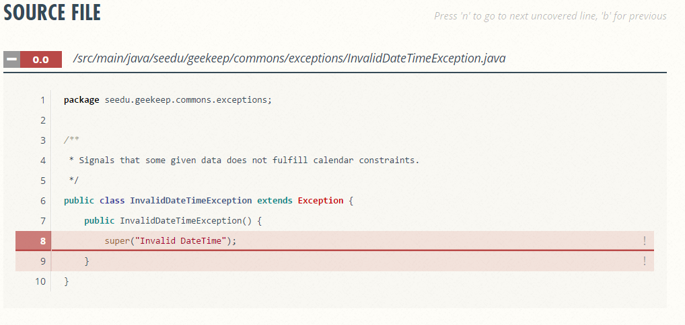

# Developer Guide

This guide is for developers who wish to continue developing GeeKeep.

GeeKeep is a simple Command-Line-Interface (CLI) based Task Manager app. It is a Task Manager for users who prefer typing over reliance on GUI. In this guide, you can find information which is helpful in getting started as a GeeKeep contributor with respect to the code, tests, and design of the architecture.

In order to better contribute, you should:
* Be proficient in object-oriented programming with Java.
* Be familiar with [libraries](../README.md#dependencies), e.g. JavaFX, used by GeeKeep.
* Be familiar with [testing frameworks](../README.md#dependencies), e.g. JUnit, used by GeeKeep.
* Follow the [Java coding standard](https://oss-generic.github.io/process/codingStandards/CodingStandard-Java.html).

<h2 id="user-content-table">Table of Contents</h2>

1. [Setting Up](#user-content-1)
    * [Prerequisites](#user-content-pre)
    * [Importing The Project into Eclipse](#user-content-import)
    * [Configuring Checkstyle](#user-content-checkstyle)
    * [Troubleshooting Project Setup](#user-content-trouble)
2. [Design](#user-content-2)
    * [Architecture](#user-content-architecture)
    * [UI Component](#user-content-ui)
    * [Logic Component](#user-content-logic)
    * [Model Component](#user-content-model)
    * [Storage Component](#user-content-storage)
    * [Common Classes](#user-content-commons)
3. [Implementation](#user-content-3)
    * [Logging](#user-content-logging)
    * [Configuration](#user-content-config)
4. [Testing](#user-content-4)
    * [Running Tests](#user-content-rt)
    * [Troubleshooting Tests](#user-content-tt)
    * [Writing Tests](#user-content-wt)
5. [Dev Ops](#user-content-5)
    * [Build Automation](#user-content-ba)
    * [Continuous Integration](#user-content-ci)
    * [Making a Release](#user-content-mr)
    * [Converting Documentation to PDF](#user-content-pdf)
    * [Managing Dependencies](#user-content-md)
6. [Appendices](#user-content-6)
    * [Appendix A: User Stories](#user-content-aa)
    * [Appendix B: Use Cases](#user-content-ab)
    * [Appendix C: Non Functional Requirements](#user-content-ac)
    * [Appendix D: Glossary](#user-content-ad)
    * [Appendix E : Product Survey](#user-content-ae)


<h2 id="user-content-1">1. Setting up</h2>

<h3 id="user-content-pre">Prerequisites</h3>

1. **JDK `1.8.0_60`**  or later<br>

    > Having any Java 8 version is not enough. <br>
    This app will not work with earlier versions of Java 8.

2. **Eclipse** IDE
3. **e(fx)clipse** plugin for Eclipse (Follow the instructions given in [this page](http://www.eclipse.org/efxclipse/install.html#for-the-ambitious) from Step 2 onwards.)
4. **Buildship Gradle Integration** plugin from the Eclipse Marketplace
5. **Checkstyle Plug-in** plugin from the Eclipse Marketplace or its [official website](http://eclipse-cs.sourceforge.net/#!/install)


<h3 id="user-content-import">Importing The Project into Eclipse</h3>

1. Fork this repo, and clone the fork to your computer.
2. Open Eclipse (Note: Ensure you have installed the **e(fx)clipse** and **buildship** plugins as given
   in the prerequisites above).
3. Click `File` > `Import`.
4. Click `Gradle` > `Gradle Project` > `Next` > `Next`.
5. Click `Browse`, then locate the project's directory.
6. Click `Finish`.

  > * If you are asked whether to 'keep' or 'overwrite' config files, choose to 'keep'.
  > * Depending on your connection speed and server load, it can even take up to 30 minutes for the set up to finish
      (This is because Gradle downloads library files from servers during the project set up process).
  > * If Eclipse auto-changed any settings files during the import process, you can discard those changes.

<h3 id="user-content-checkstyle">Configuring Checkstyle</h3>

1. Click `Project` -> `Properties` -> `Checkstyle` -> `Local Check Configurations` -> `New...`.
2. Choose `External Configuration File` under `Type`.
3. Enter an arbitrary configuration name e.g. GeeKeep.
4. Import checkstyle configuration file found at `config/checkstyle/checkstyle.xml`.
5. Click OK once, go to the `Main` tab, use the newly imported check configuration.
6. Tick and select `files from packages`, click `Change...`, and select the `resources` package.
7. Click OK twice. Rebuild project if prompted.

> Note to click on the `files from packages` text after ticking in order to enable the `Change...` button.

<h3 id="user-content-trouble">Troubleshooting Project Setup</h3>

**Problem: Eclipse reports compile errors after new commits are pulled from Git**
* Reason: Eclipse fails to recognize new files that appeared due to the Git pull.
* Solution: Refresh the project in Eclipse:<br>
  Right click on the project (in Eclipse package explorer), choose `Gradle` -> `Refresh Gradle Project`.

**Problem: Eclipse reports some required libraries missing**
* Reason: Required libraries may not have been downloaded during the project import.
* Solution: [Run tests using Gradle](UsingGradle.md) once (to refresh the libraries).

**[⬆ back to top](#user-content-table)**

<h2 id="user-content-2">2. Design</h2>

<h3 id="user-content-architecture">Architecture</h3>

<br>
_Figure 2.1 : Architecture Diagram_

The **_Architecture Diagram_** given above explains the high-level design of the App.
Given below is a quick overview of each component.

`Main` has only one class called [`MainApp`](../src/main/java/seedu/geekeep/MainApp.java). It is responsible for:
* App Launching: initialize the components in the correct sequence, and connect them up with each other.
* Shutting Down: shut down the components and invoke cleanup method where necessary.

[**`Commons`**](#common-classes) represents a collection of classes used by multiple other components.
Two of those classes play important roles at the architecture level.
* `EventsCentre` : This class (written using [Google's Event Bus library](https://github.com/google/guava/wiki/EventBusExplained))
  is used by components to communicate with other components using events (i.e. a form of _Event Driven_ design).
* `LogsCenter` : Used by many classes to write log messages to the App's log file.

The rest of the app consists four components:
* [**`UI`**](#ui-component) : Renders the UI.
* [**`Logic`**](#logic-component) : Parses and executes commands.
* [**`Model`**](#model-component) : Holds the data of the app in-memory.
* [**`Storage`**](#storage-component) : Reads data from, and writes data to, the hard disk.

Each of the four components:
* Defines its _API_ in an `interface` with the same name as the Component.
* Exposes its functionality using a `{Component Name}Manager` class.

For example, the `Logic` component (see the class diagram given below) defines its API in the `Logic.java`
interface and exposes its functionality using the `LogicManager.java` class.

**Events-Driven nature of the design**

The _Sequence Diagram_ below shows how the components interact for the scenario where the user issues the
command `delete 1`.

<br>
_Figure 2.3a : Component interactions for `delete 1` command (part 1)_

>Note how the `Model` simply raises a `GeeKeepChangedEvent` when the Task Manager data are changed,
 instead of asking the `Storage` to save the updates to the hard disk.

The diagram below shows how the `EventsCenter` reacts to that event, which eventually results in the updates
being saved to the hard disk and the status bar of the UI being updated to reflect the 'Last Updated' time. <br>
<br>
_Figure 2.3b : Component interactions for `delete 1` command (part 2)_

> Note how the event is propagated through the `EventsCenter` to the `Storage` and `UI` without `Model` having
  to be coupled to either of them. This is an example of how this Event Driven approach helps us reduce direct
  coupling between components.

The sections below give more details of each component.

<h3 id="user-content-ui">UI Component</h3>

<br>
_Figure 2.4 : Class Diagram of the UI Component_

**API** : [`Ui.java`](../src/main/java/seedu/geekeep/ui/Ui.java)

The UI consists of a `MainWindow` that is made up of parts e.g.`CommandBox`, `ResultDisplay`, `TaskListPanel`,
`StatusBarFooter` etc. All these, including the `MainWindow`, inherit from the abstract `UiPart` class
and they can be loaded using the `UiPartLoader`.

The `UI` component uses JavaFx UI framework. The layout of these UI parts are defined in matching `.fxml` files
 that are in the `src/main/resources/view` folder.<br>
 For example, the layout of the [`MainWindow`](../src/main/java/seedu/geekeep/ui/MainWindow.java) is specified in
 [`MainWindow.fxml`](../src/main/resources/view/MainWindow.fxml).

The `UI` component:
* Executes user commands using the `Logic` component.
* Binds itself to some data in the `Model` so that the UI can auto-update when data in the `Model` change.
* Responds to events raised from various parts of the app and updates the UI accordingly.

<h3 id="user-content-logic">Logic Component</h3>

<br>
_Figure 2.5 : Class Diagram of the Logic Component_

**API** : [`Logic.java`](../src/main/java/seedu/geekeep/logic/Logic.java)

The `Logic` component:

* Parses the user command using each command's respective `Parser`.
* Executes a `Command` object based on the command and user input.
* Encapsulates the result, a feedback `string` in a `CommandResult` object.

For example, the following is what happens when the API `execute("delete 1")` is called:

1. `LogicManager` parses the user command using the  `Parser` class.
1. `Parser` subsequently uses `DeleteCommandParser` to parse the argument `1`.
1. This results in a `DeleteCommand` object which is returned to `LogicManager`.
1. `LogicManager` executes the `DeleteCommand` object.
1. The command execution can affect the `Model` (e.g. adding a task) and/or raise events.
1. The result of the command execution is encapsulated as a `CommandResult` object which is passed back to the `Ui`.

Given below is the Sequence Diagram for interactions within the `Logic` component for the `execute("delete 1")`
 API call.<br>
<br>
_Figure 2.6 : Interactions Inside the Logic Component for the `delete 1` Command_

<h3 id="user-content-model">Model Component</h3>

<br>
_Figure 2.7 : Class Diagram of the Model Component_

**API** : [`Model.java`](../src/main/java/seedu/geekeep/model/Model.java)

The `Model` component:
* Stores a `UserPref` object that represents the user's preferences.
* Stores the Task Manager data.
* Exposes a `UnmodifiableObservableList<ReadOnlyTask>` that can be 'observed' e.g. the UI can be bound to this list
  so that the UI automatically updates when the data in the list change.
* Does not depend on any of the other three components.

<h3 id="user-content-storage">Storage Component</h3>

<br>
_Figure 2.8 : Class Diagram of the Storage Component_

**API** : [`Storage.java`](../src/main/java/seedu/geekeep/storage/Storage.java)

The `Storage` component:
* Can save `UserPref` objects in JSON format and read it back.
* Can save the Task Manager data in XML format and read it back.

<h3 id="user-content-commons">Common Classes</h3>

You can find classes used by multiple components in the `seedu.geekeep.commons` package. Here are some examples of common classes:
* `IllegalValueException` class used by both `Logic` and `Model` components is responsible for throwing an exception when the value is considered invalid.
* `UnmodifiableObservableList` class used by `Logic`, `Model` and `Storage` components is responsible for providing an unmodifiable view of an observable list.
* `LogsCenter` class used by all components is responsible for creating named loggers which you can further use to log messages and debug your code.

**[⬆ back to top](#user-content-table)**

<h2 id="user-content-3">3. Implementation</h2>

<h3 id="user-content-logging">Logging</h3>

You can find implementation of logging in `java.util.logging` package. The `LogsCenter` class is used to manage the logging levels
and logging destinations.

* You can control the logging level using the `logLevel` setting in the configuration file
  (See [Configuration](#user-content-config)).
* To create a `Logger` for a class and log messages according to
  the specified logging level, you can use `LogsCenter.getLogger(Class)`.
* Currently log messages are output through: `Console` and to a `.log` file.

**Logging Levels:**

* `SEVERE` : Critical problem detected which may possibly cause the termination of the application.
* `WARNING` : Can continue, but with caution.
* `INFO` : Information showing the noteworthy actions by the App.
* `FINE` : Details that are not noteworthy but may be useful in debugging
  e.g. print the actual list instead of just its size.

<h3 id="user-content-config">Configuration</h3>

You can control certain properties of the application (e.g app name, logging level) through the configuration file. By default, `config.json` will be created, when the configuration file is missing. To modify the configuration, you can either directly change the default `config.json` file or create another json file and pass it to the app as an application parameter before running.

A typical configuration file should have the following format:
```json
{
  "appTitle" : "GeeKeep - Command Line Featured Task Manager",
  "logLevel" : "INFO",
  "userPrefsFilePath" : "preferences.json",
  "geeKeepFilePath" : "data/geekeep.xml",
  "geeKeepName" : "MyGeeKeep"
}
```
Note: If you are going to create your own configuration file, remember to stick to the format given above.

**[⬆ back to top](#user-content-table)**

<h2 id="user-content-4">4. Testing</h2>

GeeKeep uses JUnit as the main testing framework and you can find all the tests in the `./src/test/java` folder.

<h3 id="user-content-rt">Running Tests</h3>

**In Eclipse**:
* To run all tests, right-click on the `src/test/java` folder and choose
  `Run as` > `JUnit Test`.
* To run a subset of tests, you can right-click on a test package, test class, or a test and choose
  to run as a JUnit test.

**Using Gradle**:
* See [UsingGradle.md](UsingGradle.md) for how to run tests using Gradle.

There are two types of tests in this project:

1. **GUI Tests** - These are _System Tests_ that test the entire app by simulating user actions on the GUI.
   These are in the `guitests` package.

2. **Non-GUI Tests** - These are tests not involving the GUI. They include,
   1. _Unit tests_ targeting the lowest level methods/classes. <br>
      e.g. `seedu.geekeep.commons.UrlUtilTest`
   2. _Integration tests_ that are checking the integration of multiple code units
     (those code units are assumed to be working).<br>
      e.g. `seedu.geekeep.storage.StorageManagerTest`
   3. Hybrids of unit and integration tests. These test are checking multiple code units as well as
      how the are connected together.<br>
      e.g. `seedu.geekeep.logic.LogicManagerTest`

**Headless GUI Testing**

Fortunately, because this project uses the [TestFX](https://github.com/TestFX/TestFX) library, you can
 run GUI tests in _headless_ mode where the GUI tests do not show up on the screen.
 This means you can do other things on the computer while the tests are running.<br>
 See [UsingGradle.md](UsingGradle.md#running-tests) to learn how to run tests in headless mode.

<h3 id="user-content-tt">Troubleshooting Tests</h3>

 **Problem: Tests fail because NullPointException when AssertionError is expected**
 * Reason: Assertions are not enabled for JUnit tests.
   This can happen if you are not using a recent Eclipse version (i.e. _Neon_ or later)
 * Solution: Enable assertions in JUnit tests as described
   [here](http://stackoverflow.com/questions/2522897/eclipse-junit-ea-vm-option). <br>
   Delete run configurations created when you ran tests earlier.

<h3 id="user-content-wt">Writing Tests</h3>

In this project, [Coveralls](https://coveralls.zendesk.com) is used to track how many statements are executed by test cases over time. You can check the current coverage report [here](https://coveralls.io/github/CS2103JAN2017-W15-B4/main?branch=master).

A sample coverage report looks like _Figure 4.1_ given below:

<br>
_Figure 4.1 Sample Coverage Report_

If you click any of the source files in the report, for example, `InvalidDataTimeException` in _Figure 4.2_, you can find uncovered lines colored with red:

<br>
_Figure 4.2 Coverage Report for InvalidDataTimeException_

Referring to the coverage report, you are welcome to pick source files with low coverage and write more test cases to improve the percentage of code coverage.

**[⬆ back to top](#user-content-table)**

<h2 id="user-content-5">5. Dev Ops</h2>

<h3 id="user-content-ba">Build Automation</h3>

See [UsingGradle.md](UsingGradle.md) to learn how to use Gradle for build automation.

<h3 id="user-content-ci">Continuous Integration</h3>

This project uses [Travis CI](https://travis-ci.org/) and [AppVeyor](https://www.appveyor.com/) to perform _Continuous Integration_.
See [UsingTravis.md](UsingTravis.md) and [UsingAppVeyor.md](UsingAppVeyor.md) for more details.

<h3 id="user-content-mr"> Making a Release</h3>

Here are the steps to create a new release:

 1. Generate a JAR file [using Gradle](UsingGradle.md#creating-the-jar-file).
 2. Tag the repo with the version number. e.g. `v0.1`
 2. [Create a new release using GitHub](https://help.github.com/articles/creating-releases/)
    and upload the JAR file your created.

<h3 id="user-content-pdf"> Converting Documentation to PDF</h3>

You are recommended to use [Google Chrome](https://www.google.com/chrome/browser/desktop/) for converting documentation to PDF format,
as Chrome's PDF engine preserves hyperlinks used in webpages.

Here are the steps to convert the project documentation files to PDF format:

 1. Make sure you have set up GitHub Pages as described in [UsingGithubPages.md](UsingGithubPages.md#setting-up).
 1. Using Chrome, go to the [GitHub Pages version](UsingGithubPages.md#viewing-the-project-site) of the
    documentation file. <br>
    e.g. For [UserGuide.md](UserGuide.md), the URL will be `https://<your-username-or-organization-name>.github.io/geekeep/docs/UserGuide.html`.
 1. Click on the `Print` option in Chrome's menu.
 1. Set the destination to `Save as PDF`, then click `Save` to save a copy of the file in PDF format. <br>
    For best results, use the settings indicated in the screenshot below. <br>
    <br>
    _Figure 5.1 : Saving documentation as PDF files in Chrome_

<h3 id="user-content-md"> Managing Dependencies</h3>

A project often depends on third-party libraries or testing frameworks. For example, GeeKeep depends on the
[Jackson library](http://wiki.fasterxml.com/JacksonHome) for JSON parsing. A full list of GeeKeep's dependencies can be found in [README.md](../README.md#dependencies).

Managing these _dependencies_
can be automated using Gradle. For example, Gradle can download the dependencies automatically, which
is better than these alternatives:<br>
* Include those libraries in the project's repo (this bloats the repo size)<br>
* Require you to download those libraries manually (this creates extra work for you)<br>

**[⬆ back to top](#user-content-table)**

<h2 id="user-content-6">6. Appendices</h2>

<h3 id="user-content-aa">Appendix A : User Stories</h3>

Priorities: High (must have) - `* * *`, Medium (nice to have) - `* *`, Low (unlikely to have) - `*`

| Priority | As a ... | I want to ... | So that I can... |
|--- | :--- | :--- | :--- |
| `* * *` | new user | see usage instructions | refer to instructions when I forget how to use the app |
| `* * *` | user | add a new task with title | add a floating task |
| `* * *` | user | add a new task with title and ending time| add a deadline |
| `* * *` | user | add a new task with title, starting time and ending time| add an event |
| `* * *` | user | list tasks| have a look at all my tasks |
| `* * *` | user | list unfinished tasks | see all the tasks I have yet to complete |
| `* * *` | user | update title, starting time or ending time of a task | change the task title, starting and ending time in case of a mistake or change of plans |
| `* * *` | user | mark a task as done or undone | keep track of completeness of the task |
| `* * *` | user | delete a task | forget about it |
| `* * *` | user | undo previous command | revert the most recent command |
| `* * *` | user | search the tasks by title | find a specific task without listing all of them |
| `* * *` | user | change file location for the data storage |
| `* * *` | user | type command parameters in arbitrary order | have flexibility in typing commands |
| `* * *` | advanced user | use short versions of commands | type a command faster |
| `* *` | user | redo last undo command | revert the most recent undo command |
| `* *` | user | redo last command | repeat the most recent command |
| `* *` | user | add a recurring task | have the same task repeat itself over a specified duration without manually adding all of them |
| `* *` | user | add a task with description | have miscellaneous details not clutter the task title |
| `* *` | user | add a task with a description | see description that task takes place |
| `* *` | user | add a task with a tag | categorize the task |
| `* *` | user | list upcoming tasks for the week | see all the upcoming tasks from now till the end of the week |
| `* *` | user | list all tasks for the day | see an summary of tasks for the day |
| `* *` | user | list all tasks having the same tags | see an summary of tasks for the category |
| `* *` | user | search the tasks by description | find a specific task without listing all of them |
| `* *` | user | search the tasks by venue | find a specific task without listing all of them |
| `* *` | user | search tasks within a time period | find tasks within a time period without listing all of them |
| `* *` | user | filter the listed or search results by title, description, time or tag | find a specific task without looking through all of them |
| `* *` | user | set more than one filter for searching tasks | find desired tasks more easily |
| `*` | user | add a task with multiple time periods | confirm the exact start and end time for the task later |
| `*` | user | delete or update one of the multiple time periods of a task | update the exact start and end time for the task |
| `*` | user | create an alias for a long command | save time typing |
| `*` | user who also uses Google Calendar | sync tasks to Google Calendar | see existing tasks and add local tasks to Google Calendar |


<h3 id="user-content-ab">Appendix B : Use Cases</h3>

(For all use cases below, the System is the GeeKeep and the Actor is the user, unless specified otherwise)

**Use case: UC01 - `Reschedule a task`**

MSS:

1. User requests to list tasks or search tasks.

2. GeeKeep shows an indexed list of tasks.

3. User requests to update the starting time or ending time of a specific task.

4. GeeKeep updates that task with new value.

5. GeeKeep shows the updated task<br>
Use case ends.

Extensions:

2a. The task does not exist.

> Use case ends.

3a. The given index is invalid.

> 3a1. GeeKeep shows an error message.<br>
> Use case resumes at step 2.

3b. The format of new starting time or ending time is invalid.

> 3b1. GeeKeep shows an error message.<br>
> Use case resumes at step 3.

3c. The given ending time is smaller than the starting time format.

> 3c1. GeeKeep shows an error message.<br>
> Use case resumes at step 3.

**Use case: UC02 - `View summary of tasks for today`**

MSS:

1. User requests to list tasks for today.

2. GeeKeep shows a list of all tasks for today.

3. User requests to list only completed tasks for today.

4. GeeKeep shows a list of all completed tasks for today.

5. User requests to list only uncompleted tasks for today.

6. GeeKeep shows a list of uncompleted tasks for today.
Use case ends.

Extensions:

2a. There are no tasks for today.

> 2a1. GeeKeep shows an error message.<br>
> Use case ends

3a. There are no completed tasks for today.

> 3a1. GeeKeep shows an error message.<br>
> Use case resumes at step 5.

5a. There are no uncompleted tasks for today.

> 5a1. GeeKeep shows an error message.<br>
> Use case ends.

**Use case: UC03 - `Add a floating task`**

MSS:

1. User add a task without starting date or ending date.

2. Geekeep adds the floating task to the respective panel.
Use case ends.

Extensions:

2a. There is a duplicate task.

> 2a1. Geekeep shows an error message. <br>
> Use case ends.

**Use case: UC04 - `Add a deadline`**

MSS:

1. User add a task without starting date but with an ending date.

2. Geekeep adds the deadline to the respective panel.
Use case ends.

Extensions:

2a. There is a duplicate task.

> 2a1. Geekeep shows an error message. <br>
> Use case ends.

**Use case: UC05 - `Add an event`**

MSS:

1. User add a task with starting date and ending date.

2. Geekeep adds the event to the respective panel.
Use case ends.

Extensions:

2a. There is a duplicate task.

> 2a1. Geekeep shows an error message. <br>
> Use case ends.

2b. The starting date of the event is after the ending date.

> 2b1. Geekeep shows an error message. <br>
> Use case ends.

**Use case: UC06 - `Mark a task as done`**

MSS:

1. User mark a task as done with its index.

2. Geekeep marks the task as done.
Use case ends.

Extensions:

2a. The task associated with the index is not found.

> 2a1. Geekeep shows an error message. <br>
> Use case ends.

**Use case: UC07 - `Mark a task as undone`**

MSS:

1. User mark a task as undone with its index.

2. Geekeep marks the task as undone.
Use case ends.

Extensions:

2a. The task associated with the index is not found.

> 2a1. Geekeep shows an error message. <br>
> Use case ends.

**Use case: UC08 - `Display completed tasks`**

MSS:

1. User requests all the tasks that are already done.

2. Geekeep refreshes the panels with completed tasks.
Use case ends.

Extensions:

2a. There are no completed tasks.

> 2a1. Geekeep displays nothing in the panels. <br>
> Use case ends.

**Use case: UC09 - `Display uncompleted tasks`**

MSS:

1. User requests all the tasks that are not already done.

2. Geekeep refreshes the panels with completed tasks.
Use case ends.

Extensions:

2a. There are no uncompleted tasks.

> 2a1. Geekeep displays nothing in the panels. <br>
> Use case ends.

**Use case UC10 - `Display tasks by tags`**

MSS:

1. User requests all the tasks associated with the given tags.

2. Geekeep refreshes the panels with tasks associated with the given tags.
Use case ends.

Extensions:

2a. There are no tasks associated with the given tags.

> 2a1. The panels display nothing. <br>
> Use case ends.

**Use case UC11 - `Find a task with name`**

MSS:

1. User request tasks with given name.

2. Geekeep returns all the tasks with names that contains the given word.
Use case ends.

Extensions:

2a. There are no matching tasks.

> 2a1. The panals display nothing <br>
> Use case ends.

**Use case UC12 - `Undo the preview command`**

MSS:

1. User requests to undo the previous command.

2. Geekeep retrieve the previous state of the task manager.

3. Geekeep replaces the current state with the previous state and refresh task cards.
Use case ends.

Extensions:

2a. There is no command to undo.

> 2a1. Geekeep ignores the undo command. <br>
> Use case ends.

**Use case UC13 - `Redo the previous command`**

MSS:

1. User requests to redo the previous undo command.

2. Geekeep retrieves the saved state before the undo command.

3. Geekeep replaces the current state with the retreived state and refresh task cards.
Use case ends.

2a. There is no command to redo.

> 2a1. Geekeep ignores the redo command. <br>
> Use case ends.


<h3 id="user-content-ac">Appendix C : Non Functional Requirements</h3>

1. Should work on Windows 7 or later as long as it has Java 1.8.0_60 or higher installed.

2. Should not require any installation apart from Java.

3. Core features should be available and work even when offline.

4. Data storage should be in plain text and be easily readable and editable.

5. A user with above average typing speed for regular English text (i.e. not code, not system admin commands) should be able to accomplish most of the tasks faster using commands than using the mouse.

6. Should be free and come with open sourced code.

7. Users should be able to execute all commands by using the CLI alone

<h3 id="user-content-ad">Appendix D : Glossary</h3>

**Mainstream OS**

> Windows, Linux, Unix, OS-X

**Task**

> A task may or may not have a specific starting or ending time

**Floating Task**

> A task without starting or ending time is a floating task
> (e.g., wash clothes).

**Deadline**

> A task only with a specified ending time is a deadline
> (e.g., submit report).

**Event**

> A task with both starting and ending time is an event
> (e.g., do an internship).
<h3 id="user-content-ae">Appendix E : Product Survey</h3>

 **[Google Keep](https://www.google.com/keep/)**

Author: Goh Yi Rui

Pros:

* Support for lists, plain text, and pictures

* Support for typing and voice recording

* Color coding tasks

* Easily searching through all tasks by name, label, color or category

* Personalised labels or tags

* Automatically identifying tasks that lie within a same category

* Autocompletion and suggestion for tasks

* Synchronization to Google Account

Cons:

* Reliance on GUI for all operations

* No support for events, only tasks and notes

* Only online access

* No project management features

**[Google Calendar](https://www.google.com/calendar)**

Author: Zhang Hanming

Pros:

* Automatically parsing emails and adding events to calendar

* Reminders

* Intuitive UI

* Categorization of events

* Allowing importing and exporting calendars

Cons:

* Requiring a Google account

* Not allowing checking off completed tasks

* A calendar more than a task manager

**[Gmail Tasks](https://mail.google.com/tasks/canvas)**

Author: Liu Ziyang

Pros:

* Allowing marking a task as done

* Allowing postponing a task

* Shortcuts for editing tasks

* Personalised categorization

* Integration with Google Calendar

Cons:

* Only online access

* No support for command line inputs

* No support for events

* No support for undoing an action

* Poor UI with no displaying difference between urgent and non-urgent tasks

**[Habitica](https://habitica.com/static/front)**

Author: How Si Wei

Pros:

* Gamification and thus more motivation

* Intuitive UI

* Categorization of events through tags

* Support for exporting data

* A large number of official and user-created apps and extensions

Cons:

* Requiring a Habitica account

* A possible distraction due to gamification

* Advanced features like group plans restricted to paid users

**[⬆ back to top](#user-content-table)**
