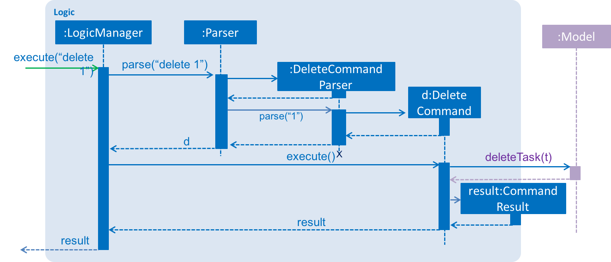

# TaskList - Developer Guide

By : `CS2103JAN2017-T11-B3`  &nbsp;&nbsp;&nbsp;&nbsp; Since: `Feb 2017`  &nbsp;&nbsp;&nbsp;&nbsp; Licence: `MIT`

---

1. [Setting Up](#1-setting-up)
2. [Design](#2-design)
3. [Implementation](#3-implementation)
4. [Testing](#4-testing)
5. [Dev Ops](#5-dev-ops)

* [Appendix A: User Stories](#appendix-a--user-stories)
* [Appendix B: Use Cases](#appendix-b--use-cases)
* [Appendix C: Non Functional Requirements](#appendix-c--non-functional-requirements)
* [Appendix D: Glossary](#appendix-d--glossary)
* [Appendix E : Product Survey](#appendix-e--product-survey)

## 1. Setting up

### 1.1. Prerequisites

1. **JDK `1.8.0_60`**  or later 

    > Having any Java 8 version is not enough.  
    This app will not work with earlier versions of Java 8.

2. **Eclipse** IDE
3. **e(fx)clipse** plugin for Eclipse (Do the steps 2 onwards given in
   [this page](http://www.eclipse.org/efxclipse/install.html#for-the-ambitious))
4. **Buildship Gradle Integration** plugin from the Eclipse Marketplace
5. **Checkstyle Plug-in** plugin from the Eclipse Marketplace

### 1.2. Importing the project into Eclipse

0. Fork this repo, and clone the fork to your computer
1. Open Eclipse (Note: Ensure you have installed the **e(fx)clipse** and **buildship** plugins as given
   in the prerequisites above)
2. Click `File` > `Import`
3. Click `Gradle` > `Gradle Project` > `Next` > `Next`
4. Click `Browse`, then locate the project's directory
5. Click `Finish`

  > * If you are asked whether to 'keep' or 'overwrite' config files, choose to 'keep'.
  > * Depending on your connection speed and server load, it can even take up to 30 minutes for the set up to finish
      (This is because Gradle downloads library files from servers during the project set up process)
  > * If Eclipse auto-changed any settings files during the import process, you can discard those changes.

### 1.3. Configuring Checkstyle
1. Click `Project` -> `Properties` -> `Checkstyle` -> `Local Check Configurations` -> `New...`
2. Choose `External Configuration File` under `Type`
3. Enter an arbitrary configuration name e.g. tasklist
4. Import checkstyle configuration file found at `config/checkstyle/checkstyle.xml`
5. Click OK once, go to the `Main` tab, use the newly imported check configuration.
6. Tick and select `files from packages`, click `Change...`, and select the `resources` package
7. Click OK twice. Rebuild project if prompted

> Note to click on the `files from packages` text after ticking in order to enable the `Change...` button

### 1.4. Troubleshooting project setup

**Problem: Eclipse reports compile errors after new commits are pulled from Git**

* Reason: Eclipse fails to recognize new files that appeared due to the Git pull.
* Solution: Refresh the project in Eclipse: 
  Right click on the project (in Eclipse package explorer), choose `Gradle` -> `Refresh Gradle Project`.

**Problem: Eclipse reports some required libraries missing**

* Reason: Required libraries may not have been downloaded during the project import.
* Solution: [Run tests using Gradle](UsingGradle.md) once (to refresh the libraries).

## 2. Design

### 2.1. Architecture

 
_Figure 2.1.1 : Architecture Diagram_

The **_Architecture Diagram_** given above explains the high-level design of the App.
Given below is a quick overview of each component.

> Tip: The `.pptx` files used to create diagrams in this document can be found in the [diagrams](diagrams/) folder.
> To update a diagram, modify the diagram in the pptx file, select the objects of the diagram, and choose `Save as picture`.

`Main` has only one class called [`MainApp`](../src/main/java/seedu/task/MainApp.java). It is responsible for,

* At app launch: Initializes the components in the correct sequence, and connects them up with each other.
* At shut down: Shuts down the components and invokes cleanup method where necessary.

[**`Commons`**](common-classes) represents a collection of classes used by multiple other components.
Two of those classes play important roles at the architecture level.

* `EventsCenter` : This class (written using [Google's Event Bus library](https://github.com/google/guava/wiki/EventBusExplained))
  is used by components to communicate with other components using events (i.e. a form of _Event Driven_ design)
* `LogsCenter` : Used by many classes to write log messages to the App's log file.

The rest of the App consists of four components.

* [**`UI`**](ui-component) : The UI of the App.
* [**`Logic`**](logic-component) : The command executor.
* [**`Model`**](model-component) : Holds the data of the App in-memory.
* [**`Storage`**](storage-component) : Reads data from, and writes data to, the hard disk.

Each of the four components

* Defines its _API_ in an `interface` with the same name as the Component.
* Exposes its functionality using a `{Component Name}Manager` class.

For example, the `Logic` component (see the class diagram given below) defines it's API in the `Logic.java`
interface and exposes its functionality using the `LogicManager.java` class. 
 
_Figure 2.1.2 : Class Diagram of the Logic Component_

#### Events-Driven nature of the design

The _Sequence Diagram_ below shows how the components interact for the scenario where the user issues the
command `delete 1`.

 
_Figure 2.1.3a : Component interactions for `delete 1` command (part 1)_

>Note how the `Model` simply raises a `TaskListChangedEvent` when the Task List data are changed,
 instead of asking the `Storage` to save the updates to the hard disk.

The diagram below shows how the `EventsCenter` reacts to that event, which eventually results in the updates
being saved to the hard disk and the status bar of the UI being updated to reflect the 'Last Updated' time.  
 
_Figure 2.1.3b : Component interactions for `delete 1` command (part 2)_

> Note how the event is propagated through the `EventsCenter` to the `Storage` and `UI` without `Model` having
  to be coupled to either of them. This is an example of how this Event Driven approach helps us reduce direct
  coupling between components.

The sections below give more details of each component.

### 2.2. UI component

Author: Yu Cheng-Liang

 
_Figure 2.2.1 : Structure of the UI Component_

**API** : [`Ui.java`](../src/main/java/seedu/task/ui/Ui.java)

The UI consists of a `MainWindow` that is made up of parts e.g.`CommandBox`, `ResultDisplay`, `TaskListPanel`,
`StatusBarFooter`, `CalendarPanel` etc. All these, including the `MainWindow`, inherit from the abstract `UiPart` class.

The `UI` component uses JavaFx UI framework. The layout of these UI parts are defined in matching `.fxml` files
 that are in the `src/main/resources/view` folder. 
 For example, the layout of the [`MainWindow`](../src/main/java/seedu/task/ui/MainWindow.java) is specified in
 [`MainWindow.fxml`](../src/main/resources/view/MainWindow.fxml)

The `UI` component,

* Executes user commands using the `Logic` component.
* Binds itself to some data in the `Model` so that the UI can auto-update when data in the `Model` change.
* Responds to events raised from various parts of the App and updates the UI accordingly.

### 2.3. Logic component

Author: Wu Heyang

 
_Figure 2.3.1 : Structure of the Logic Component_

**API** : [`Logic.java`](../src/main/java/seedu/task/logic/Logic.java)

* `Logic` uses the `Parser` class to parse the user command.
* This results in a `Command` object which is executed by the `LogicManager`.
* The command execution can affect the `Model` (e.g. adding a task) and/or raise events.
* The result of the command execution is encapsulated as a `CommandResult` object which is passed back to the `Ui`.

Given below is the Sequence Diagram for interactions within the `Logic` component for the `execute("delete 1")`
 API call. 
 
_Figure 2.3.1 : Interactions Inside the Logic Component for the `delete 1` Command_

Author: Jay Kabra

* The logic behind how to edit a specifc instance of a recurring task is as follows:
* The `Parser` recognizes the `editthis` command to delete the occurrence of the selected task
* from the encapsulated list of RecuirringTaskOccurrence objects (refer to the Model section to see the
* precise architecture of implementing recurring tasks).
* A new task is subsequently instantiated (with its own description, priority, etc. parameters) and added
* to the underlying Task list. Then the edit parameters are applied to this newly instantianted task.
*
* The logic behind how to delete a specific instance of a recurring task is as follows:
* The `Parser` recognizes the `deletethis` command and subsequently removes the entire task from the list.
* Subsequently, it intantiates a new Recurring Task using shared logic with editthis and then adds the
* recurring task back to the list with the specific instance removed. The effect for the user is a deletetion
* of a particular recurring task instance.

### 2.4. Model component

Author: Jay Kabra

 
_Figure 2.4.1 : Structure of the Model Component_

**API** : [`Model.java`](../src/main/java/seedu/task/model/Model.java)

The `Model`,

* stores a `UserPref` object that represents the user's preferences.
* stores the Task List data.
* exposes a `UnmodifiableObservableList<ReadOnlyTask>` that can be 'observed' e.g. the UI can be bound to this list
  so that the UI automatically updates when the data in the list change.
* does not depend on any of the other three components.
* defines reccuring tasks in the following way:
  * Class 'RecurringTaskOccurrence' encapsulates 2 Timing objects (start & end times) and a boolean to indicate if
  * the occurrence is complete.
  * Class 'Task' encapsulates a list of RecurringTaskOccurrence objects. In addition, it also encapsulates a
  *'description,' 'priority,' 'frequency,' and a list of 'tags' for the respective task. Each of these fields is
  * constructed as an object in the backend of the application.
  * This architecture follows the use of the Abstraction Occurrence Pattern by sharing common fields between
  * instances of the same underlying object.
  * If tasks are recurring then their start/end times are populated based on the given frequency parameter.

### 2.5. Storage component

Author: Tyler Rocha

 
_Figure 2.5.1 : Structure of the Storage Component_

**API** : [`Storage.java`](../src/main/java/seedu/task/storage/Storage.java)

The `Storage` component,

* can save `UserPref` objects in json format and read it back.
* can save the Task List data in xml format and read it back.

### 2.6. Common classes

Classes used by multiple components are in the `seedu.task.commons` package.

## 3. Implementation

### 3.1. Logging

We are using `java.util.logging` package for logging. The `LogsCenter` class is used to manage the logging levels
and logging destinations.

* The logging level can be controlled using the `logLevel` setting in the configuration file
  (See [Configuration](configuration))
* The `Logger` for a class can be obtained using `LogsCenter.getLogger(Class)` which will log messages according to
  the specified logging level
* Currently log messages are output through: `Console` and to a `.log` file.

**Logging Levels**

* `SEVERE` : Critical problem detected which may possibly cause the termination of the application
* `WARNING` : Can continue, but with caution
* `INFO` : Information showing the noteworthy actions by the App
* `FINE` : Details that is not usually noteworthy but may be useful in debugging
  e.g. print the actual list instead of just its size

### 3.2. Configuration

Certain properties of the application can be controlled (e.g App name, logging level) through the configuration file
(default: `config.json`):

## 4. Testing

Tests can be found in the `./src/test/java` folder.

**In Eclipse**:

* To run all tests, right-click on the `src/test/java` folder and choose
  `Run as` > `JUnit Test`
* To run a subset of tests, you can right-click on a test package, test class, or a test and choose
  to run as a JUnit test.

**Using Gradle**:

* See [UsingGradle.md](UsingGradle.md) for how to run tests using Gradle.

We have two types of tests:

1. **GUI Tests** - These are _System Tests_ that test the entire App by simulating user actions on the GUI.
   These are in the `guitests` package.

2. **Non-GUI Tests** - These are tests not involving the GUI. They include,
   1. _Unit tests_ targeting the lowest level methods/classes.  
      e.g. `seedu.task.commons.UrlUtilTest`
   2. _Integration tests_ that are checking the integration of multiple code units
     (those code units are assumed to be working). 
      e.g. `seedu.task.storage.StorageManagerTest`
   3. Hybrids of unit and integration tests. These test are checking multiple code units as well as
      how the are connected together. 
      e.g. `seedu.task.logic.LogicManagerTest`

#### Headless GUI Testing
Thanks to the [TestFX](https://github.com/TestFX/TestFX) library we use,
 our GUI tests can be run in the _headless_ mode.
 In the headless mode, GUI tests do not show up on the screen.
 That means the developer can do other things on the Computer while the tests are running. 
 See [UsingGradle.md](UsingGradle.md#running-tests) to learn how to run tests in headless mode.

### 4.1. Troubleshooting tests

 **Problem: Tests fail because NullPointException when AssertionError is expected**

 * Reason: Assertions are not enabled for JUnit tests.
   This can happen if you are not using a recent Eclipse version (i.e. _Neon_ or later)
 * Solution: Enable assertions in JUnit tests as described
   [here](http://stackoverflow.com/questions/2522897/eclipse-junit-ea-vm-option).  
   Delete run configurations created when you ran tests earlier.

## 5. Dev Ops

### 5.1. Build Automation

See [UsingGradle.md](UsingGradle.md) to learn how to use Gradle for build automation.

### 5.2. Continuous Integration

We use [Travis CI](https://travis-ci.org/) and [AppVeyor](https://www.appveyor.com/) to perform _Continuous Integration_ on our projects.
See [UsingTravis.md](UsingTravis.md) and [UsingAppVeyor.md](UsingAppVeyor.md) for more details.

### 5.3. Publishing Documentation

See [UsingGithubPages.md](UsingGithubPages.md) to learn how to use GitHub Pages to publish documentation to the
project site.

### 5.4. Making a Release

Here are the steps to create a new release.

 1. Generate a JAR file [using Gradle](UsingGradle.md#creating-the-jar-file).
 2. Tag the repo with the version number. e.g. `v0.1`
 2. [Create a new release using GitHub](https://help.github.com/articles/creating-releases/)
    and upload the JAR file you created.

### 5.5. Converting Documentation to PDF format

We use [Google Chrome](https://www.google.com/chrome/browser/desktop/) for converting documentation to PDF format,
as Chrome's PDF engine preserves hyperlinks used in webpages.

Here are the steps to convert the project documentation files to PDF format.

 1. Make sure you have set up GitHub Pages as described in [UsingGithubPages.md](UsingGithubPages.md#setting-up).
 1. Using Chrome, go to the [GitHub Pages version](UsingGithubPages.md#viewing-the-project-site) of the
    documentation file.  
    e.g. For [UserGuide.md](UserGuide.md), the URL will be `https://<your-username-or-organization-name>.github.io/main/docs/UserGuide.html`.
 1. Click on the `Print` option in Chrome's menu.
 1. Set the destination to `Save as PDF`, then click `Save` to save a copy of the file in PDF format.  
    For best results, use the settings indicated in the screenshot below.  
     
    _Figure 5.4.1 : Saving documentation as PDF files in Chrome_

### 5.6. Managing Dependencies

A project often depends on third-party libraries. For example, Task List depends on the
[Jackson library](http://wiki.fasterxml.com/JacksonHome) for XML parsing. Managing these _dependencies_
can be automated using Gradle. For example, Gradle can download the dependencies automatically, which
is better than these alternatives. 
a. Include those libraries in the repo (this bloats the repo size) 
b. Require developers to download those libraries manually (this creates extra work for developers) 

## Appendix A : User Stories

Priorities: High (must have) - `* * *`, Medium (nice to have)  - `* *`,  Low (unlikely to have) - `*`

Priority | As a ... | I want to ... | So that I can...
-------- | :-------- | :--------- | :-----------
`* * *` | user | add a new task | record tasks that need to be done ‘some day’.
`* * *` | user | view upcoming tasks | see what needs to be done soon.
`* * *` | user | delete a task | remove tasks that I no longer care to track.
`* * *` | new user | view more information about a particular command | learn how to use various commands.
`* * *` | user | add task deadlines | prioritize what is most urgent.
`* * *` | user | mark a task as completed | view old tasks.
`* * *` | user | undo last command | revert my last action if I make a mistake.
`* * *` | user | add task notes | keep relevant information nearby.
`* * *` | user | confirm a delete action | avoid accidently delete a task.
`* * *` | user | view tasks by day | view relevant tasks.
`* * *` | user | add notification timings | see a popup for high priority tasks prior to the deadline.
`* * *` | user | assign task prioritize | view tasks by importance.
`* * *` | user | close the application | save CPU resources.
`* * *` | user | schedule time to work on a task | plan my time.
`* * *` | user | modify task details | update tasks.
`* *` | advanced user | use command shortcuts | save time.
`* *` | user | backup my data | protect against data loss.
`* *` | user | create subtasks | break up large tasks.
`* *` | user | choose custom background | have a pleasant viewing experience.
`* *` | user | hear nice sounds | further enjoy completing tasks.
`* *` | user | get reminders | know to start doing something.
`* *` | user | change calendar view between month/week/day | see my schedule for that time frame.
`* *` | user | add recurring tasks | avoid repetitive task input.
`* *` | user | estimate task length | know how much effort is required.
`* *` | user | add collaborators | know who I have to work with.
`* *` | user | see error messages for invalid commands | know how to fix my mistake.
`* *` | user | sort tasks by priority | choose most urgent tasks.
`* *` | new user | see user guide in a sidebar | have it for easy reference.
`* *` | user | search tasks by keyword | find tasks.
`* *` | user | see today's tasks on startup | get started immediately.
`* *` | user | categorize tasks | organize more effectively.
`* *` | user | have task manager open on bootup | get started immediately.
`*` | user | view my command history | review my progress.
`*` | user | enter distraction-free mode | be stopped from opening games or social websites before tasks are completed

## Appendix B : Use Cases

(For all use cases below, the **System** is the `TaskList` and the **Actor** is the `user`, unless specified otherwise)

#### Use case: Create task

**MSS**

1. User requests to create a task with a name
2. Task Manager create the task  
Use case ends.

**Extensions**

2a. The taske with the name given by the user already exist
> Use case ends

#### Use case: Delete task

**MSS**

1. User requests to list tasks
2. Task Manager shows a list of tasks
3. User requests to delete a specific task in the list
4. Task Manager deletes the task  
Use case ends.

**Extensions**

2a. The list is empty

> Use case ends

3a. The given index is invalid

> 3a1. Task Manager shows an error message  
  Use case resumes at step 2

#### Use case: Edit/Update task

**MSS**

1. User requests to search for a task with a given name
2. Task Manager shows the task
3. User type in the change
4. User requests to update/edit the task
5. Task Manager change the content of the task  
Use case ends.

**Extensions**

2a. The task does not exist

> Use case ends

4a. The given index is invalid

> 3a1. TaskList shows an error message  
  Use case resumes at step 3

#### Use case: Read task

**MSS**

1. User requests to search for a task with a given name
2. Task Manager shows the task  
Use case ends.

**Extensions**

2a. The task does not exist

> Use case ends

#### Use case: Complete a task

**MSS**

1. User requests to search for a task with a given name
2. Task Manager shows the task
3. User type in the index of the task he/she wants to mark as complete
3. User request to complete a task
4. Task Manager marks the task as completed  
Use case ends.

**Extensions**

2a. The task does not exist

> Use case ends

3a. The given index is invalid

> 3a1. Task Manager shows an error message  
  Use case resumes at step 3

#### Use case: List all task

**MSS**

1. User requests to list all tasks
2. Task Manager shows all the tasks  
Use case ends.

**Extensions**

2a. no tasks exist
> 2a1. Task Manager shows an error message
> Use case ends

#### Use case: List a task

**MSS**

1. User type in the index of the task
2. User request to see the content of the task
3. Task Manager shows the content of the task  
Use case ends.

**Extensions**

2a. The task does not exist
> 2a1. Task Manager shows an error message
> Use case resumes at step 1

#### Use case: Save tasks to file

**MSS**

1. User types file location
2. Task Manager verifies file location
3. Task Manager saves tasks in specified save file
4. Task Manager sets this save file as default  
Use case ends.

**Extensions**

2a. The file path does not exist
> 2a1. Task Manager shows an error message
> Use case ends.

3a. The file path does not end with a file name
> 3a1. Task Manager shows an error message
> Use case ends.

#### Use case: Load tasks from file

**MSS**

1. User types file location
2. Task Manager verifies file location
3. Task Manager loads task data from load file
4. Task Manager sets this load file as default  
Use case ends.

**Extensions**

2a. The file does not exist
> 2a1. Task Manager shows an error message
> Use case ends.

2b. The file path does not end with a file name
> 2b1. Task Manager shows an error message
> Use case ends.

3a. The load file has an invalid format.
> 3a1. Task Manager shows an error message
> Use case ends.

## Appendix C : Non Functional Requirements

1. Should work on any [mainstream OS](#mainstream-os) as long as it has Java `1.8.0_60` or higher installed.
2. Should be able to hold up to 100 tasks without a noticeable sluggishness in performance for typical usage.
3. A user with above average typing speed for regular English text (i.e. not code, not system admin commands)
   should be able to accomplish most of the tasks faster using commands than using the mouse.
4. Should be open source.
6. Should open the app in less than 5 sec.
7. The GUI should not be overcrowded.
8. If the input data's format changes, the developers should be able to make needed adjustments in <20 hours.
9. A user can install and operate the program without assistance of any kind (except consulting the User Guide Documentation).
10. The level of security will be minimal for this product since it is only accessed by a single user.
11. To extend the software, proper security measures can be put into place in <100 hours.
12. Aesthetics of the calendar GUI should be sleek and appealing to 90% of users.
13. Should be scalable so that a user can change the layout of the GUI based on personal preference.
14. Should not overload the CPU so that other running process start to lag.
15. Should not have seperate administrative functions as there is one user who is the Admin by default.

## Appendix D : Glossary

##### Mainstream OS

> Windows, Linux, Unix, OS-X

##### Private contact detail

> A contact detail that is not meant to be shared with others

## Appendix E : Product Survey

**Google Calendar**

Author: Jay Kabra

Pros:
* Syncs with your phone so that the calendar is viewable from gmail on your laptop as well as on your phone
* Allows you to add reminder notifications for events at a customized amount of time
* Can customize tasks by color
* Can easily perform CRUD operations on events
* Can add recurring events and edit them individually if there are exceptions for a particular day
* More GUI based rather than command line
* Relatively intuitive for new users

Cons:
* No way to prioritize tasks
* Need connection to the internet to view on laptop - not a desktop application
* Since it is more GUI based, takes more clicks to add a task rather than typing the task in a command line and having the task added
* appropriately

**Google Tasks**

Author:Google
Pros:
* easy to use
* have all the basic functions a normal user would use.
* easy to install

Cons:
* cannot change the color of tasks based on priority
* alert would not pop out automatically
* everytime I boot up my computer, I have to open the app manually

