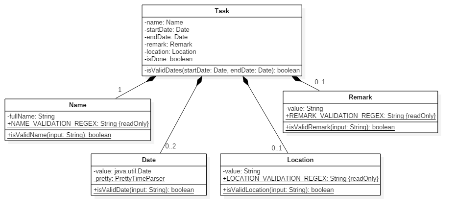

# Developer Guide

* [Introduction](#setting-up)
* [Setting Up](#setting-up)
* [Design](#design)
* [Testing](#testing)
* [Appendix A: User Stories](#appendix-a--user-stories)
* [Appendix B: Use Cases](#appendix-b--use-cases)
* [Appendix C: Non Functional Requirements](#appendix-c--non-functional-requirements)
* [Appendix D: Gloassary](#appendix-d--glossary)

## Introduction

We welcome all software engineers who would like to contribute to our to-do list application OneTwoDo. This guide is specially written for you! 

This guide is a comprehensive document that explains the development environment and internal structure of the application. This guide will help you to get ready to contribute to the amazing application OneTwoDo. 

OneTwoDo is a simple yet effective to-do list application. It helps users to remember their important tasks and to organise their schedules. It is easy to use due to its simple interface and intuitive commands. It is also designed to be extremely keyboard-friendly, so as to save time clicking on buttons and tabs. 

Let us start to examine the application in greater details!

### 1. Setting Up

You will have to get the following setting configured to get started contributing.

### 1.1 Prerequisites

As prerequisites, make sure that your computer has the following software installed.

1. **JDK 1.8.0_60** or later. Having any Java 8 version is not enough. This app will not work with earlier versions of Java 8.

2. **Eclipse IDE**.

3. **e(fx)clipse** plugin for Eclipse . You may refer to the tutorial by doing the steps 2 onwards given here: http://www.eclipse.org/efxclipse/install.html#for-the-ambitious

4. **Buildship Gradle **Integration plugin from the Eclipse Marketplace.

5. **Checkstyle **Plug-in plugin from the Eclipse Marketplace.

### 1.2 Importing the project into Eclipse

We recommend this application to be developed with Eclipse. Simply carry out the following steps to import OneTwoDo into Eclipse Workspace. 

1. Fork this repo, and clone the fork to your computer.

2. Open Eclipse (Note: Ensure you have installed the e(fx)clipse and buildship plugins as given in the prerequisites above).

3. Click File > Import.

4. Click Gradle > Gradle Project > Next > Next.

5. Click Browse, then locate the project’s directory.

6. Click Finish.

**Notes:**

* If you are asked whether to ‘keep’ or ‘overwrite’ config files, choose to ‘keep’.

* Depending on your connection speed and server load, it can even take up to 30 minutes for the set up to finish. This is because Gradle downloads library files from servers during the project set up process. 

* If Eclipse auto-changed any settings files during the import process, you can discard those changes.

### 1.3 Configuring Checkstyle

To adhere to the common coding style adopted for this project, you may want to import Checksyle into WorkSpace as well. 

1. Click Project -> Properties -> Checkstyle -> Local Check Configurations -> New...

2. Choose External Configuration File under Type.

3. Enter an arbitrary configuration name e.g. onetwodo.

4. Import checkstyle configuration file found at config/checkstyle/checkstyle.xml.

5. Click OK once, go to the Main tab, use the newly imported check configuration.

6. Tick and select files from packages, click Change..., and select the resources package.

7. Click OK twice. Rebuild project if prompted.

**Notes**

* To click on the files from packages text after ticking in order to enable the Change... button. 

### 1.4 Troubleshooting project setup

You may encounter some problems during the setup. Here we provide solutions to some common ones.

Problem: Eclipse reports compile errors after new commits are pulled from Git

* Reason: Eclipse fails to recognize new files that appeared due to the Git pull.

* Solution: Refresh the project in Eclipse:
Right click on the project (in Eclipse package explorer), choose Gradle -> Refresh Gradle Project.

Problem: Eclipse reports some required libraries missing

* Reason: Required libraries may not have been downloaded during the project import.

* Solution: Run tests using Gradle once (to refresh the libraries).

## 2. Design

In this section you will find out about each internal part of the application and how they work together. 

### 2.1 Architecture

 
*Figure 2.1.1 : Architecture Diagram*

Welcome to our **_Architecture_** layout!Over here, you get to see a high-level design of our OneTwoDo as shown in the **_Figure 2.1.1_** above. If you ever want to update the diagram, you can do so in the diagram pptx file. Simply select the objects of the diagram, and choose **Save as picture**. Without further ado, we will now give you a quick overview of each component.

`Main` has only one class called [`MainApp`](../src/main/java/seedu/onetwodo/MainApp.java). It is responsible for:

* At app launch: Initializes the components in the correct sequence, and connects them up with each other at app launch.

* At shut down: Shuts down the components and invokes cleanup method where necessary.

`Commons` represents a collection of classes used by multiple other components. Two of those classes play important roles at the architecture level.

* `EventsCenter` : This class is used by components to communicate with other components using events (i.e. a form of** **Event Driven design).

* `LogsCenter`: This class is used by many classes to write log messages to the App’s log file.

The rest of the App consists of these four components.

* [**`UI`**](#ui-component): The UI of the App.

* [**`Logic`**](#logic-component) : The command executor.

* [**`Model`**](#model-component) : Holds the data of the App in-memory.

* [**`Storage`**](#storage-component): Reads data from, and writes data to, the hard disk.

Each of the four components defines its **_API_** in an `interface` with the same name as the Component. They also exposes its functionality using a {Component Name}Manager class. For example, the `Logic` component defines its API in the [`Logic.java`](../src/main/java/seedu/onetwodo/logic/Logic.java) interface and exposes its functionality using the LogicManager.java class.

#### Events-Driven nature of the design

The _Sequence Diagram_ below shows how the components interact for the scenario where the user issues the

**command delete e1**

 
*Figure 2.1.3a : Component interactions for delete e1 command (part 1)*

Note how the `Model` simply raises a `OneTwoDoChangedEvent` when the OneTwoDo data are changed, instead of asking the `Storage` to save the updates to the hard disk.

The diagram below shows how the `EventsCenter` reacts to that event, which eventually results in the updates being saved to the hard disk and the status bar of the UI being updated to reflect the ‘Last Updated’ time. 

 
*Figure 2.1.3b : Component interactions for `delete e1` command (part 2)*

Did you realise? The event is propagated through the **EventsCenter** to the Storage and UI without Model having to be coupled to either of them. This is an example of how this Event Driven approach helps us reduce direct coupling between components.

In the sections below we will provide more details of each component. As OneTwoDo is written in Object-Oriented Paradigm, you may want to pay attention to how these components work and interact with each other. 

### 2.2. UI component

 
*Figure 2.2.1 : Structure of the UI Component*

You can find the API for this component in [`Ui.java`](../src/main/java/seedu/onetwodo/ui/Ui.java)

The UI consists of a `MainWindow` that is made up of parts such as CommandBox, ResultDisplay, TaskListPanel, StatusBarFooter etc. All these, including the `MainWindow`, inherit from the abstract `UiPart` class.

The UI component uses JavaFx UI framework. The layout of these UI parts are defined in matching .fxml files that are in the `src/main/resources/ view` folder. For example, the layout of the `MainWindow` is specified in [`MainWindow.fxml`](../src/main/resources/view/MainWindow.fxml)

The `UI` component is capable of:

* Executes user commands using the `Logic` component.

* Binds itself to some data in the `Model` so that the `UI` can auto-update when data in the `Model` change.

* Responds to events raised from various parts of the App and updates the `UI` accordingly.

### 2.3. Logic component

 
*Figure 2.3.1 : Structure of the Logic Component*

You can find the API for this component in [`Logic.java`](../src/main/java/seedu/onetwodo/logic/Logic.java)

* `Logic` uses the `Parser` class to parse the user command.

* This results in a `Command` object which is executed by the `LogicManager`.

* The command execution can affect the `Model` (e.g. adding a person) and/or raise events.

* The result of the command execution is encapsulated as a `CommandResult` object which is passed back to the `Ui`.

Given below is the _Sequence Diagram_ for interactions within the `Logic` component for the execute("delete e1") API call.

 
*Figure 2.3.1 : Interactions Inside the Logic Component for the delete d2 Command*

//@@author A0141138N

### 2.4. Model component

 
*Figure 2.4.1 : Structure of the Model Component*

You can find the API for this component in [`Model.java`](../src/main/java/seedu/onetwodo/model/Model.java)

The Model is capable of the following:

* Stores a `UserPref` object that represents the user’s preferences.

* Stores the OneTwoDo data.

* Exposes an `UnmodifiableObservableList<ReadOnlyPerson>`. They that can be ‘observed’ so that the UI automatically updates when the data in the list change.

* Does not depend on any of the other three components.

 
*Figure 2.4.2 : Class Diagram for Task*

You can find the API for this component in [`Task.java`](../src/main/java/seedu/onetwodo/model/task/Task.java)

It is compulsory for a task to have the following parameters: _name_, _isDone_ and _taskType_. Other parameters such as _startDate_, _endDate_, _priority_, _description_ and _tag_ are optional. `StartDate` and `EndDate` classes inherit from `Date` class and override the `createDisplayValue()` method of `Date`. Do note that every field must be present and cannot be null.

A task can be defined in the following ways:

1. **To-do**: A task without a startDate and endDate.

2. **Deadline**: A task with an endDate only.

3. **Event**: A task with both a startDate and an endDate.

//@@author 
### 2.5. Storage component

 
*Figure 2.5.1 : Structure of the Storage Component*

You can find the API for this component in [`Storage.java`](../src/main/java/seedu/onetwodo/storage/Storage.java)

The Storage component has **2 functionalities**:

* Saves `UserPref` objects in json format and read it back.

* Saves the OneTwoDo data in xml format and read it back.

### 2.6. Common classes

In `seedu.onetwodo.commons`, you can find these classes that are commonly used by multiple components in the package. They include exceptions, events and log center. 

## 3. Implementation

### 3.1. Logging

Debugging has never been easier with logging. We are using `java.util.logging` package for logging. You can use the `LogsCenter` class to manage the logging levels and logging destinations.

**Notes:**

* The logging level can be controlled using the `logLevel` setting in the configuration file (See [Configuration](#configuration)).

* The Logger for a class can be obtained using `LogsCenter.getLogger(Class)` which will log messages according to the specified logging level.

* Currently log messages are output through the console and to a .log file.

There are 4 different logging levels: 

* `SEVERE`: Use for indicating critical problems detected, which may possibly cause the termination of the application.

* `WARNING`: Use for indicating minor problems detected. Application can continue, but with caution.

* `INFO`: Use for indicating typical noteworthy information and actions by the application.

* `FINE`: Use for indicating details that is not usually noteworthy but may be useful in debugging e.g. print the actual list instead of just its size.

### 3.2. Configuration

You can control various important properties of the application in the file named `config.json`. These properties include App name and logging level. Simply open the `config.json` file and change their values to suit your needs.

## 4. Testing

Have you implemented some cool features and ready to test it? Read this section to know how testing is done during development in our application. 

### 4.1. Running tests

We have already set up the testing environment for you! You can find all tests in the `./src/test/java` folder.

**Running tests in Eclipse:**

* To run all tests, you can simply right-click on the `src/test/java` folder and choose `Run as > JUnit Test`

* To run a subset of tests, you can right-click on a test package, test class, or even a test and choose to run as a `JUnit test`.

**Running tests using Gradle:**

* You may refer to [UsingGradle.md](UsingGradle.md) for how to run tests using Gradle.

We have two types of tests:

1. **GUI Tests** - These are _System Tests_ that test the entire App by simulating user actions on the GUI. You can find them in the guitests package.

2. **Non-GUI Tests** - These are tests not involving the GUI. They include,

    * _Unit tests_: This targets the lowest level methods/classes, e.g. `seedu.onetwodo.commons.UrlUtilTest`.

    * _Integration tests_: This checks the integration of multiple code units, e.g. `seedu.onetwodo.storage.StorageManagerTest`.

    * _Hybrids of unit and integration tests_.: These tests help to check multiple code units as well as how the are connected together. For example please see `seedu.onetwodo.logic.LogicManagerTest`.

#### Headless GUI Testing

Thanks to the [TestFX](https://github.com/TestFX/TestFX) library we use, our GUI tests can be run in the headless mode. In the headless mode, GUI tests do not show up on the screen. That means the developer can do other things on the Computer while the tests are running. You may want to see [UsingGradle.md](UsingGradle.md#running-tests) to learn how to perform this operation.

### 4.2. Troubleshooting tests

Over here, we provide solutions to some of your common problems you may encounter in the process of testing. 

**Problem: Tests fail because NullPointException when AssertionError is expected**

This is caused by assertions not enabled for JUnit tests. This usually occurs if you are not using a recent Eclipse version (i.e. *Neon* or later).  Try enabling assertions in JUnit tests as described here: stackoverflow.com/questions/2522897/eclipse-junit-ea-vm-option. Also, you can try to delete the run configurations that was created previously when you ran tests.

## 5. Dev Ops

Ready to release a cooler version of the application? Read this section to know how to make releases more efficiently and reliably. 

### 5.1. Build Automation

We use Gradle for automation build. You can check [UsingGradle.md](UsingGradle.md#running-tests) to learn more about Gradle automation build.

### 5.2. Continuous Integration

We use [Travis CI](https://travis-ci.org/) and [AppVeyor](https://www.appveyor.com/) to perform Continuous Integration on our projects. 

You can check [UsingTravis.md](UsingTravis.md) and [UsingAppVeyor.md](UsingAppVeyor.md) for more details.

### 5.3. Publishing Documentation

You can visit [UsingGithubPages.md](UsingGithubPages.md) to learn how to use GitHub Pages to publish documentation to the project site.

### 5.4. Making a Release

Ready to show off your work to the user? Here are the steps to create a new release.

1. Generate a JAR file using Gradle.

2. Tag the repo with the version number. e.g. v0.1.

3. Create a new release using GitHub.

4. and upload the JAR file you created.

### 5.5. Managing Dependencies

Projects often depends on third-party libraries. Likewise, OneTwoDo depends on the **Jackson** library for XML parsing. Do not worry about managing these dependencies. It can be automated using **Gradle**. Gradle can do amazing stuff such as downloading the dependencies automatically. This is better than the alternatives of: 

* Including those libraries in the repo (this bloats the repo size).

* Requiring developers to download those libraries manually (this creates extra work for developers. 

## Appendix A : User Stories

<table>
  <tr>
    <td>Priority</td>
    <td>As a …</td>
    <td>I want to …</td>
    <td>So that I can…</td>
  </tr>
  <tr>
    <td>* * *</td>
    <td>new user</td>
    <td>see usage instructions</td>
    <td>refer to instructions when I forget how to use the App</td>
  </tr>
  <tr>
    <td>* * *</td>
    <td>user</td>
    <td>add a new task</td>
    <td>add task to manage all my to-do</td>
  </tr>
  <tr>
    <td>* * *</td>
    <td>user</td>
    <td>delete a task</td>
    <td>remove entries that I no longer need</td>
  </tr>
  <tr>
    <td>* * *</td>
    <td>user with many tasks</td>
    <td>find a task by keywords</td>
    <td>search for specific task especially when the list is huge</td>
  </tr>
  <tr>
    <td>* * *</td>
    <td>user</td>
    <td>edit a task</td>
    <td>edit a task if there are any changes</td>
  </tr>
  <tr>
    <td>* * *</td>
    <td>user</td>
    <td>clear all tasks</td>
    <td>quickly start using the tool from scratch</td>
  </tr>
  <tr>
    <td>* * *</td>
    <td>user</td>
    <td>close application</td>
    <td>exit after use</td>
  </tr>
  <tr>
    <td>* * *</td>
    <td>organized user</td>
    <td>add tags to a task</td>
    <td>organize them by tags</td>
  </tr>
  <tr>
    <td>* * *</td>
    <td>user</td>
    <td>add description to task</td>
    <td>describe tasks in more detail</td>
  </tr>
  <tr>
    <td>* * *</td>
    <td>user</td>
    <td>view task description</td>
    <td>view the task in details</td>
  </tr>
  <tr>
    <td>* * *</td>
    <td>user</td>
    <td>list tasks</td>
    <td>view all uncompleted task</td>
  </tr>
  <tr>
    <td>* * *</td>
    <td>advanced user</td>
    <td>sort task by importance</td>
    <td>prioritise which task to do first</td>
  </tr>
  <tr>
    <td>* * *</td>
    <td>last minute user</td>
    <td>sort tasks by most upcoming tasks</td>
    <td>get myself prepared for more urgent tasks</td>
  </tr>
  <tr>
    <td>* * *</td>
    <td>advanced user</td>
    <td>find tasks by tag</td>
    <td>find tasks quickly that contains the specific tag</td>
  </tr>
  <tr>
    <td>* * *</td>
    <td>advanced user</td>
    <td>set reminder to a task</td>
    <td>be notified when tasks are approaching due date</td>
  </tr>
  <tr>
    <td>* * *</td>
    <td>user</td>
    <td>select folder to save data storage</td>
    <td>specify a specific folder and file for data storage</td>
  </tr>
  <tr>
    <td>* * *</td>
    <td>user</td>
    <td>undo most recent action</td>
    <td>undo action to rectify mistake</td>
  </tr>
  <tr>
    <td>* *</td>
    <td>user</td>
    <td>redo most recent action</td>
    <td>redo action to rectify mistake</td>
  </tr>
  <tr>
    <td>* *</td>
    <td>user</td>
    <td>add task to nearest free slot automatically</td>
    <td>add task easily without browsing for free time</td>
  </tr>
  <tr>
    <td>* *</td>
    <td>user with multiple recurring tasks</td>
    <td>add recurring tasks</td>
    <td>avoid adding similar task one by one</td>
  </tr>
  <tr>
    <td>* *</td>
    <td>user with multiple recurring tasks</td>
    <td>edit all instances of a recurring task</td>
    <td>be more efficient when editing recurring tasks</td>
  </tr>
  <tr>
    <td>* *</td>
    <td>advanced user</td>
    <td>filter tasks by multiple keywords</td>
    <td>search tasks by more specific criteria</td>
  </tr>
  <tr>
    <td>* *</td>
    <td>user</td>
    <td>list all tags</td>
    <td>quickly view all the tags in the to-do list</td>
  </tr>
  <tr>
    <td>* *</td>
    <td>user</td>
    <td>keep track of completed tasks</td>
    <td>keep them in track for future references</td>
  </tr>
  <tr>
    <td>* *</td>
    <td>busy user</td>
    <td>postpone task</td>
    <td>defer uncompleted task to near future where I am free</td>
  </tr>
  <tr>
    <td>* *</td>
    <td>advanced user</td>
    <td>select task and pin it at the top of display</td>
    <td>quickly mark certain tasks as demanding of priority attention</td>
  </tr>
  <tr>
    <td>* *</td>
    <td>existing google calendar user</td>
    <td>sync google calendar on create, update and delete tasks</td>
    <td>exploit google calendar and sync with this task manager</td>
  </tr>
  <tr>
    <td>* *</td>
    <td>user with heavy email usage</td>
    <td>send email notification for upcoming tasks</td>
    <td>remind me on tasks that are approaching due date</td>
  </tr>
  <tr>
    <td>* *</td>
    <td>user who prefer keyboard</td>
    <td>open/close application via keyboard shortcut</td>
    <td>quickly open or exit program easily without mouse click</td>
  </tr>
  <tr>
    <td>* *</td>
    <td>advanced user</td>
    <td>remove all tasks with certain tag</td>
    <td>quickly remove all tasks with some similarity</td>
  </tr>
  <tr>
    <td>*</td>
    <td>advanced user</td>
    <td>change all tag names in one go</td>
    <td>quickly update all tasks with that tag name</td>
  </tr>
  <tr>
    <td>*</td>
    <td>user with a many tasks</td>
    <td>assign priorities to tasks</td>
    <td>distinguish and pinpoint importance task immediately just by looking</td>
  </tr>
  <tr>
    <td>*</td>
    <td>user</td>
    <td>list overdue tasks</td>
    <td>filter out overdue tasks to decide for further actions</td>
  </tr>
  <tr>
    <td>*</td>
    <td>user</td>
    <td>remove tasks within certain range</td>
    <td>easily specify date to remove tasks within that range.</td>
  </tr>
  <tr>
    <td>*</td>
    <td>user</td>
    <td>list near future free slot</td>
    <td>choose suitable free slot to add task</td>
  </tr>
</table>

**Priorities:**

* **High** (must have)

* **Medium** (nice to have) 

* **Low** (unlikely to have) 

## Appendix B : Use Cases

## System refers to our application. Actor refers the user.

#### UC01 - Add a task

#### **MSS**

1. User input information to add task.

2. System notifies user that the task has been successfully added.

Use case ends.

#### Extensions

      2a. Task already exists.

2a1. System informs user that the task already exists and doesn’t add repeated task.

Use case ends.

       2b. Invalid command format.

2b1. System informs user that the command format is invalid and outputs a sample format to user.

Use case ends.

#### UC02 - Delete task

#### **MSS**

1. System display a list of tasks.

2. User input task index to specify which task to delete.

3. System notifies user that task has been successfully deleted.

Use case ends.

#### Extension

      1a. List is empty.

1a1. System informs user that there is no task to delete.

Use case ends.

      2a. Invalid command format.

     2a1. System informs user that the input is invalid and outputs a sample format.

 Use case resume at 1.

     2b. User input index is not valid.

2b1. System informs user that the input index is invalid.

Use case resume at 1.

#### UC03 - Edit task

#### **MSS**

1. User requests list of tasks.

2. System displays a list of tasks.

3. User selects a task to edit.

4. System shows user the task information.

5. User edits and submits a new task information.

6. System displays changes made to task.

Use case ends.

#### Extension

     2a. The list is empty.

2a1. System informs user that there is no task to edit.

Use case ends.

     3a. User task selection is invalid.

3a1. System shows error message.

Use case resumes from step 2.

     3b. System detects an error in the data that user entered.

3b1. System selects valid task.

3b2. User enters new data.

3b3. Repeat steps 3b1 and 3b2 until data has no errors.

Use case resumes from step 4.

     3c. User requests to tag a task with a category that is not currently in the system.

3c1. System creates the category.

Use case resumes from step 4.

#### UC04 - Find task

#### **MSS**

1. User searches for task.

2. System lists tasks which match the keywords entered by user.

Use case ends.

#### Extension

     2a. Task does not exist.

2a1. System informs user that no tasks is found.

Use case ends.

#### UC04 - List tasks

#### **MSS**

1. User requests list of tasks.

2. System displays list of tasks.

3. Use case ends.

#### Extension

     1a. User requests to list task in a certain category.

1a1. System displays list of tasks in that category.

Use case ends.

     2a. The list is empty.

2a1. System displays empty list.

Use case ends.

#### UC05 - Done task

#### **MSS**

1. User requests to list the tasks.

2. System displays a list of tasks.

3. User selects the task to mark as done.

4. System shows user remaining tasks that are uncompleted.

Use case ends.

#### Extension

**     **3a. User task selection is invalid.

3a1. System shows error message.

Use case resumes from step 2.

#### UC06 - Undo most recent action

#### **MSS**

1. User issues command undo.

2. System reverts user’s previous command and displays feedback message to user.

Use case ends.

#### Extension

     2a. There is no previous command yet.

2a1. System feedbacks to user that no previous command has found.

Use case ends.

     2b. Previous command is not mutable.

2b1. System feedbacks to user no action required.

Use case ends.

## Appendix C : Non-Functional Requirements

1. Should work on any [mainstream OS](https://hackmd.io/EYBgHATAxgzGAmBaA7BAjEgLMNNEE4QBDZRIgVnQDN1Mj9NMg===?view#mainstream-os).

2. Should be able to store up to 500 tasks.

3. Should work in online or offline mode.

4. Should respond to commands within 2 seconds.

5. Programme should startup within 3 seconds.

6. Programme should be open source code and readily available.

7. Should have an easy to use interface.

8. Should be able to handle exceptions from user input.

9. Should work as a standalone application.

10. Should have an executable file that can be launched by double clicking or keyboard shortcut.

11. Should not use relational databases to store data.

12. Command line interface should be the main mode of input.

13. Should not violate any copyrights.

14. Should not contain obscene or inappropriate content.

## 

Appendix D : Glossary

<table>
  <tr>
    <td>Mainstream OS</td>
    <td>Windows, Linux, Unix, OS-X.</td>
  </tr>
  <tr>
    <td>Keyword</td>
    <td>Words in task names, tag names, and task description.</td>
  </tr>
  <tr>
    <td>Invalid Commands</td>
    <td>Invalid commands includes invalid arguments.</td>
  </tr>
  <tr>
    <td>Error message</td>
    <td>Error message includes suggestion for correct command.</td>
  </tr>
  <tr>
    <td>START_DATE</td>
    <td>START_DATE refers to start date and time entered.
Defaults to time of 0000 hrs if no time is indicated.</td>
  </tr>
  <tr>
    <td>END_DATE</td>
    <td>END_DATE refers to end of date and time entered.
Defaults to time of 2359 hrs if no time is indicated.</td>
  </tr>
  <tr>
    <td>Event task</td>
    <td>Tasks that have a specific start and end date.</td>
  </tr>
  <tr>
    <td>Deadline task</td>
    <td>Tasks that only have a specific end date.</td>
  </tr>
  <tr>
    <td>To-Do task</td>
    <td>Tasks that have no start or end date.</td>
  </tr>
  <tr>
    <td>Category</td>
    <td>One of Event, Deadline or To-do.</td>
  </tr>
</table>

## Appendix E : Product Survey

//@@author A0141138N
## Review for *Remember the Milk*

## Pros:

* Easy to use interface.

* User can add recurring tasks.

* User can set a start date and end date for the task.

* User can add tag to the task.

* User can view a list of all completed tasks.

* User can set priority to task.

* User can postpone a task.

**Cons:**

* No online support or video tutorials for beginners.

* Pro version is very expensive and most features are only available in pro version.

* No security for data in terms of encryption or HTTPS.

//@@author 
## Review for *Google Calender*

**Pros:**

* Calendar user interface, click on events on the calendar to view more details.

* Users can edit events by dragging.

* Users are able to import calendars using .ical files.

* Users can edit a single instance of event, or recurring events.

* Users can be notified of approaching events.

* Users have daily, weekly, monthly, and "4-days" types of view.

* Users can sync and access on multiple platforms, like mobile, and desktop.

**Cons:**

* Have to be online to access calendar.

* No command line interface.

* Updates may take a while to sync due to network issues.

## Review for *Wunderlist*

**Pros:**

* Allows user to note down descriptions and more information for each task.

* Allows user to create subtasks for each task.

* Allows user to set "Reminder" and “Due Date” separately.

* Allows user to highlight(star) a task.

* Separates "Delete" and “Mark as complete”.

* Parses the reminder time when user types in the task name.

* Automatically creates "Today" and “Week” folder for user to see what needs to be done for today and this week (more urgent tasks).

* Allows user to categorise tasks using folders, e.g. (work, family).

**Cons:**

* Just highlighting (starring) is not enough. User may just highlight all tasks and that defeats the purpose of starring.

* Tasks are not sorted in chronological order in the main folder.

## Review for *Habitica*

**Pros:**

* It has simulation game element which keep the work fun and motivating.

* It has colourful and clean user interface that make important tasks stand out.

* It supports multiple platforms such as mobile and desktop.

* It supports recurring task adding.

* It can set multiple and different reminders on any task.

* It can easily be reordered/sorted using name or tags.

**Cons:**

* Unable to view the calendar when selecting tasks

* Adding tasks require mouse/ touch screen instead of keyboard entering.

* Has the potential of distraction due to the existence of game elements.

* Deadline of the tasks are not shown unless clicked.

* Unable to mark tasks as done without keeping them for future references.

