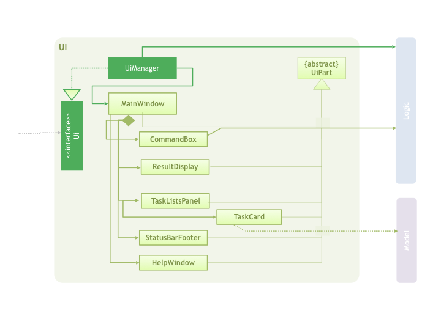

# Task Manager - Developer Guide

By : `[F12-B3]`  &nbsp;&nbsp;&nbsp;&nbsp; Since: `Feb 2017`  &nbsp;&nbsp;&nbsp;&nbsp; Licence: `MIT`

---

1. [Setting Up](#setting-up)
2. [Design](#design)
3. [Implementation](#implementation)
4. [Testing](#testing)
5. [Dev Ops](#dev-ops)

* [Appendix A: User Stories](#appendix-a--user-stories)
* [Appendix B: Use Cases](#appendix-b--use-cases)
* [Appendix C: Non Functional Requirements](#appendix-c--non-functional-requirements)
* [Appendix D: Glossary](#appendix-d--glossary)
* [Appendix E : Product Survey](#appendix-e--product-survey)

## 1. Setting up

### 1.1. Prerequisites

1. **JDK `1.8.0_60`**  or later 

    > Having any Java 8 version is not enough.  
    This app will not work with earlier versions of Java 8.

2. **Eclipse** IDE
3. **e(fx)clipse** plugin for Eclipse (Do the steps 2 onwards given in
   [this page](http://www.eclipse.org/efxclipse/install.html#for-the-ambitious))
4. **Buildship Gradle Integration** plugin from the Eclipse Marketplace
5. **Checkstyle Plug-in** plugin from the Eclipse Marketplace

### 1.2. Importing the project into Eclipse

0. Fork this repo, and clone the fork to your computer
1. Open Eclipse (Note: Ensure you have installed the **e(fx)clipse** and **buildship** plugins as given
   in the prerequisites above)
2. Click `File` > `Import`
3. Click `Gradle` > `Gradle Project` > `Next` > `Next`
4. Click `Browse`, then locate the project's directory
5. Click `Finish`

  > * If you are asked whether to 'keep' or 'overwrite' config files, choose to 'keep'.
  > * Depending on your connection speed and server load, it can even take up to 30 minutes for the set up to finish
      (This is because Gradle downloads library files from servers during the project set up process)
  > * If Eclipse auto-changed any settings files during the import process, you can discard those changes.

### 1.3. Configuring Checkstyle
1. Click `Project` -> `Properties` -> `Checkstyle` -> `Local Check Configurations` -> `New...`
2. Choose `External Configuration File` under `Type`
3. Enter an arbitrary configuration name e.g. taskmanager
4. Import checkstyle configuration file found at `config/checkstyle/checkstyle.xml`
5. Click OK once, go to the `Main` tab, use the newly imported check configuration.
6. Tick and select `files from packages`, click `Change...`, and select the `resources` package
7. Click OK twice. Rebuild project if prompted

> Note to click on the `files from packages` text after ticking in order to enable the `Change...` button

### 1.4. Troubleshooting project setup

**Problem: Eclipse reports compile errors after new commits are pulled from Git**

* Reason: Eclipse fails to recognize new files that appeared due to the Git pull.
* Solution: Refresh the project in Eclipse: 
  Right click on the project (in Eclipse package explorer), choose `Gradle` -> `Refresh Gradle Project`.

**Problem: Eclipse reports some required libraries missing**

* Reason: Required libraries may not have been downloaded during the project import.
* Solution: [Run tests using Gradle](UsingGradle.md) once (to refresh the libraries).

## 2. Design

### 2.1. Architecture

 
_Figure 2.1.1 : Architecture Diagram_

The **_Architecture Diagram_** given above explains the high-level design of the App.
Given below is a quick overview of each component.

> Tip: The `.pptx` files used to create diagrams in this document can be found in the [diagrams](diagrams/) folder.
> To update a diagram, modify the diagram in the pptx file, select the objects of the diagram, and choose `Save as picture`.

`Main` has only one class called [`MainApp`](../src/main/java/seedu/taskmanager/MainApp.java). It is responsible for,

* At app launch: Initializes the components in the correct sequence, and connects them up with each other.
* At shut down: Shuts down the components and invokes cleanup method where necessary.

[**`Commons`**](#common-classes) represents a collection of classes used by multiple other components.
Two of those classes play important roles at the architecture level.

* `EventsCenter` : This class (written using [Google's Event Bus library](https://github.com/google/guava/wiki/EventBusExplained))
  is used by components to communicate with other components using events (i.e. a form of _Event Driven_ design)
* `LogsCenter` : Used by many classes to write log messages to the App's log file.

The rest of the App consists of four components.

* [**`UI`**](#ui-component) : The UI of the App.
* [**`Logic`**](#logic-component) : The command executor.
* [**`Model`**](#model-component) : Holds the data of the App in-memory.
* [**`Storage`**](#storage-component) : Reads data from, and writes data to, the hard disk.

Each of the four components

* Defines its _API_ in an `interface` with the same name as the Component.
* Exposes its functionality using a `{Component Name}Manager` class.

For example, the `Logic` component (see the class diagram given below) defines it's API in the `Logic.java`
interface and exposes its functionality using the `LogicManager.java` class. 
 
_Figure 2.1.2 : Class Diagram of the Logic Component_

#### Events-Driven nature of the design

The _Sequence Diagram_ below shows how the components interact for the scenario where the user issues the
command `delete 1`.

 
_Figure 2.1.3a : Component interactions for `delete 1` command (part 1)_

>Note how the `Model` simply raises a `TaskChangedEvent` when the Task Manager data are changed,
 instead of asking the `Storage` to save the updates to the hard disk.

The diagram below shows how the `EventsCenter` reacts to that event, which eventually results in the updates
being saved to the hard disk and the status bar of the UI being updated to reflect the 'Last Updated' time.  
 
_Figure 2.1.3b : Component interactions for `delete 1` command (part 2)_

> Note how the event is propagated through the `EventsCenter` to the `Storage` and `UI` without `Model` having
  to be coupled to either of them. This is an example of how this Event Driven approach helps us reduce direct
  coupling between components.

The sections below give more details of each component.

### 2.2. UI component

Author: Shen Qi

 
_Figure 2.2.1 : Structure of the UI Component_

**API** : [`Ui.java`](../src/main/java/seedu/taskmanager/ui/Ui.java)

The UI consists of a `MainWindow` that is made up of parts e.g.`CommandBox`, `ResultDisplay`, `PersonListPanel`,
`StatusBarFooter`, `BrowserPanel` etc. All these, including the `MainWindow`, inherit from the abstract `UiPart` class.

The `UI` component uses JavaFx UI framework. The layout of these UI parts are defined in matching `.fxml` files
 that are in the `src/main/resources/view` folder. 
 For example, the layout of the [`MainWindow`](../src/main/java/seedu/taskmanager/ui/MainWindow.java) is specified in
 [`MainWindow.fxml`](../src/main/resources/view/MainWindow.fxml)

The `UI` component,

* Executes user commands using the `Logic` component.
* Binds itself to some data in the `Model` so that the UI can auto-update when data in the `Model` change.
* Responds to events raised from various parts of the App and updates the UI accordingly.

### 2.3. Logic component

Author: Gabriel

 
_Figure 2.3.1 : Structure of the Logic Component_

**API** : [`Logic.java`](../src/main/java/seedu/taskmanager/logic/Logic.java)

1. `Logic` uses the `Parser` class to parse the user command.
2. This results in a `Command` object which is executed by the `LogicManager`.
3. The command execution can affect the `Model` (e.g. adding a task) and/or raise events.
4. The result of the command execution is encapsulated as a `CommandResult` object which is passed back to the `Ui`.

Given below is the Sequence Diagram for interactions within the `Logic` component for the `execute("delete 1")`
 API call. 
 
_Figure 2.3.1 : Interactions Inside the Logic Component for the `delete 1` Command_

### 2.4. Model component

Author: Maggie

 
_Figure 2.4.1 : Structure of the Model Component_

**API** : [`Model.java`](../src/main/java/seedu/taskmanager/model/Model.java)

The `Model`,

* stores a `UserPref` object that represents the user's preferences.
* stores the Task Manager data.
* exposes a `UnmodifiableObservableList<ReadOnlyPerson>` that can be 'observed' e.g. the UI can be bound to this list
  so that the UI automatically updates when the data in the list change.
* does not depend on any of the other three components.

### 2.5. Storage component

Author: Aditya

 
_Figure 2.5.1 : Structure of the Storage Component_

**API** : [`Storage.java`](../src/main/java/seedu/taskmanager/storage/Storage.java)

The `Storage` component,

* can save `UserPref` objects in json format and read it back.
* can save the Task Manager data in xml format and read it back.

### 2.6. Common classes

Classes used by multiple components are in the `seedu.taskmanager.commons` package.

## 3. Implementation

### 3.1. Logging

We are using `java.util.logging` package for logging. The `LogsCenter` class is used to manage the logging levels
and logging destinations.

* The logging level can be controlled using the `logLevel` setting in the configuration file
  (See [Configuration](#configuration))
* The `Logger` for a class can be obtained using `LogsCenter.getLogger(Class)` which will log messages according to
  the specified logging level
* Currently log messages are output through: `Console` and to a `.log` file.

**Logging Levels**

* `SEVERE` : Critical problem detected which may possibly cause the termination of the application
* `WARNING` : Can continue, but with caution
* `INFO` : Information showing the noteworthy actions by the App
* `FINE` : Details that is not usually noteworthy but may be useful in debugging
  e.g. print the actual list instead of just its size

### 3.2. Configuration

Certain properties of the application can be controlled (e.g App name, logging level) through the configuration file
(default: `config.json`):

## 4. Testing

Tests can be found in the `./src/test/java` folder.

Test

**In Eclipse**:

* To run all tests, right-click on the `src/test/java` folder and choose
  `Run as` > `JUnit Test`
* To run a subset of tests, you can right-click on a test package, test class, or a test and choose
  to run as a JUnit test.

**Using Gradle**:

* See [UsingGradle.md](UsingGradle.md) for how to run tests using Gradle.

We have two types of tests:

1. **GUI Tests** - These are _System Tests_ that test the entire App by simulating user actions on the GUI.
   These are in the `guitests` package.

2. **Non-GUI Tests** - These are tests not involving the GUI. They include,
   1. _Unit tests_ targeting the lowest level methods/classes.  
      e.g. `seedu.task.commons.UrlUtilTest`
   2. _Integration tests_ that are checking the integration of multiple code units
     (those code units are assumed to be working). 
      e.g. `seedu.task.storage.StorageManagerTest`
   3. Hybrids of unit and integration tests. These test are checking multiple code units as well as
      how the are connected together. 
      e.g. `seedu.task.logic.LogicManagerTest`

#### Headless GUI Testing
Thanks to the [TestFX](https://github.com/TestFX/TestFX) library we use,
 our GUI tests can be run in the _headless_ mode.
 In the headless mode, GUI tests do not show up on the screen.
 That means the developer can do other things on the Computer while the tests are running. 
 See [UsingGradle.md](UsingGradle.md#running-tests) to learn how to run tests in headless mode.

### 4.1. Troubleshooting tests

 **Problem: Tests fail because NullPointException when AssertionError is expected**

 * Reason: Assertions are not enabled for JUnit tests.
   This can happen if you are not using a recent Eclipse version (i.e. _Neon_ or later)
 * Solution: Enable assertions in JUnit tests as described
   [here](http://stackoverflow.com/questions/2522897/eclipse-junit-ea-vm-option).  
   Delete run configurations created when you ran tests earlier.

## 5. Dev Ops

### 5.1. Build Automation

See [UsingGradle.md](UsingGradle.md) to learn how to use Gradle for build automation.

### 5.2. Continuous Integration

We use [Travis CI](https://travis-ci.org/) and [AppVeyor](https://www.appveyor.com/) to perform _Continuous Integration_ on our projects.
See [UsingTravis.md](UsingTravis.md) and [UsingAppVeyor.md](UsingAppVeyor.md) for more details.

### 5.3. Publishing Documentation

See [UsingGithubPages.md](UsingGithubPages.md) to learn how to use GitHub Pages to publish documentation to the
project site.

### 5.4. Making a Release

Here are the steps to create a new release.

 1. Generate a JAR file [using Gradle](UsingGradle.md#creating-the-jar-file).
 2. Tag the repo with the version number. e.g. `v0.1`
 2. [Create a new release using GitHub](https://help.github.com/articles/creating-releases/)
    and upload the JAR file you created.

### 5.5. Converting Documentation to PDF format

We use [Google Chrome](https://www.google.com/chrome/browser/desktop/) for converting documentation to PDF format,
as Chrome's PDF engine preserves hyperlinks used in webpages.

Here are the steps to convert the project documentation files to PDF format.

 1. Make sure you have set up GitHub Pages as described in [UsingGithubPages.md](UsingGithubPages.md#setting-up).
 1. Using Chrome, go to the [GitHub Pages version](UsingGithubPages.md#viewing-the-project-site) of the
    documentation file.  
    e.g. For [UserGuide.md](UserGuide.md), the URL will be `https://<your-username-or-organization-name>.github.io/taskmanager/docs/UserGuide.html`.
 1. Click on the `Print` option in Chrome's menu.
 1. Set the destination to `Save as PDF`, then click `Save` to save a copy of the file in PDF format.  
    For best results, use the settings indicated in the screenshot below.  
     
    _Figure 5.4.1 : Saving documentation as PDF files in Chrome_

### 5.6. Managing Dependencies

A project often depends on third-party libraries. For example, Task Manager depends on the
[Jackson library](http://wiki.fasterxml.com/JacksonHome) for XML parsing. Managing these _dependencies_
can be automated using Gradle. For example, Gradle can download the dependencies automatically, which
is better than these alternatives. 
a. Include those libraries in the repo (this bloats the repo size) 
b. Require developers to download those libraries manually (this creates extra work for developers) 

## Appendix A : User Stories

Priorities: High (must have) - `* * *`, Medium (nice to have)  - `* *`,  Low (unlikely to have) - `*`

Priority | As a ... | I want to ... | So that I can...
-------- | :-------- | :--------- | :-----------
`* * *` | user | see usage instructions | refer to instructions when I forget how to use the App
`* * *` | user | add a new task with description only | remember what I have to do
`* * *` | user | add a new task with description and deadline | remember what I have to do before stipulated date/time
`* * *` | user | add a new task with description and reminder | remember what I have to do and be reminded at specified date/time
`* * *` | user | add a new task with description and on selective execution dates | remember what I have to do that happens over non-consecutive days
`* * *` | user | add a new recurring task | remember what I have to do that happens repeatedly
`* * *` | user | tag a task | organise my tasks into different group (tags)
`* * *` | user | delete a task | remove tasks that I no longer need
`* * *` | user | delete the tag of a task | delete the unnecessary tags
`* * *` | user | edit a task description | edit tasks description I need to change
`* * *` | user | edit task timings | edit tasks timings I need to change
`* * *` | user | edit the tag of a task | modify the tags of my tasks
`* * *` | user | find a task to do today | locate details of tasks to do today without having to go through the entire list
`* * *` | user | find a specific task by keyword | locate details of tasks to do by searching for keywords
`* * *` | user | find a specific task by tags | locate details of tasks to do by searching for tags
`* * *` | user | mark a task as done | mark tasks as done and become part of history
`* * *` | user | undo an action | undo action if I made a mistake in making an entry
`* *` | user | rank tasks by deadlines | prioritise tasks I need to do
`* *` | user | rank tasks by start dates | schedule tasks accordingly
`* *` | user | see a walkthorough | know the features and how to use the App
`* *` | user | create clickable links in tasks | Access important links quickly from task description
`* *` | user | delete date/time on multiple-timings task | remove one or more timings on a certain task I no longer need
`* *` | user | clear all tasks on period of time | easily remove tasks on holiday
`* *` | busy user | set an alarm for task with deadlines | be reminded regarding deadlines ahead and not miss it
`*` | migrating user from Google Tasks | Import tasks from Google Tasks | import automatically and not have to key in manually
`*` | user with Google Calendar | Import tasks from Google Calendar events | import tasks stored in Google Calendar and add on to that
`*` | user | create group tasks | share group task with fellow users
`*` | user | attach documents | be more versatile with my task description
`*` | advanced user | import and export tasks | have backup and transfer my lists of tasks
`*` | advanced user | create subtasks within a task | break down complicated tasks into smaller ones
`*` | user | find tasks in relation to collaborators | find tasks related to a person and possibly combine a few tasks in a meeting
`*` | user with many tasks | see graphical overview of tasks | plan better

## Appendix B : Use Cases

(For all use cases below, the **System** is the `TaskManager` and the **Actor** is the `user`, unless specified otherwise)

#### Use case: UC01 - Delete task

**MSS**

1. User requests to list tasks
2. TaskManager shows a list of tasks
3. User requests to delete a specific task in the list
4. TaskManager deletes the task  
Use case ends.

**Extensions**

2a. The list is empty

> Use case ends

3a. The given index is invalid

> 3a1. TaskManager shows an error message  
  Use case resumes at step 2

#### Use case: UC02 - Add new task with a task description

**MSS**

1. User enter the new task to be added with all the details including date/time, tags, and description
2. TaskManager accepts the new task with a confirmation
Use case ends.

**Extensions**

1a. The input is not valid

> The TaskManager ask for the correct input  
  Use case resumes at step 1

2a. User requests to undo the action

> 2a1. TaskManager shows that undo is successful  
  Use case ends

#### Use case: UC03 - Edit task

**MSS**

1. User requests to edit task from a previously given list of tasks
2. TaskManager prompts user for the change needed
3. User enters the change needed (allows partial change of the task, ie. only task description)
4. TaskManager confirms and applies the change  
Use case ends.

**Extensions**

1a. The given index is invalid

> 1a1. TaskManager shows an error message  
  Use case resumes at step 1

3a. The edit is invalid

> 3a1. TaskManager shows an error message  
  Use case resumes at step 2

4a. User requests to undo the action

> 4a1. TaskManager shows that undo is successful  
  Use case ends

#### Use case: UC04 - Find a task with a keyword

**MSS**

1. User requests to find task by keyword(s)
2. TaskManager shows a list of tasks containing given keyword
3. User selects a task to view in detail.
4. TaskManager shows details of the selected task.  
Use case ends.

**Extensions**

1a. The input is not valid

> The TaskManager ask for the correct input  
  Use case resumes at step 1

2a. Cannot find relevant result based on keyword

> The TaskManager shows no result found for the input  
  Use case ends

3a. The given index is not valid

> TaskManager shows an error message  
  Use case resumes at step 2

#### Use case: UC05 - Find a task by a tag

**MSS**

1. User requests to find task by a tag
2. TaskManager shows a list of tasks containing given tag
3. User selects a task to view in detail.
4. TaskManager shows details of the selected task.  
Use case ends.

**Extensions**

1a. The input is not valid

> The TaskManager ask for the correct input  
  Use case resumes at step 1

2a. Cannot find relevant result based on keyword

> The TaskManager shows no result found for the input  
  Use case ends

3a. The given index is not valid

> TaskManager shows an error message  
  Use case resumes at step 2

#### Use case: UC06 - Find a task to do today

**MSS**

1. User requests to find task to do today
2. TaskManager shows a list of tasks with deadlines/reminder scheduled today
3. User selects a task to view in detail
4. TaskManager shows details of the selected task.  
Use case ends.

**Extensions**

1a. The input is not valid

> The TaskManager ask for the correct input  
  Use case resumes at step 1

2a. Cannot find relevant result based on keyword

> The TaskManager shows no result found for the input  
  Use case ends

3a. The given index is not valid

> TaskManager shows an error message  
  Use case resumes at step 2

#### Use case: UC07 - Mark a task as done

**MSS**

1. User requests to find a specific task
2. TaskManager shows a list of tasks given the search conditions
3. User requests a task to be marked as done
4. TaskManager marks the task as done and move task to history
Use case ends.

**Extensions**

1a. The input is not valid

> The TaskManager ask for the correct input  
  Use case resumes at step 1

2a. Cannot find relevant result based on keyword

> The TaskManager shows no result found for the input  
  Use case ends

3a. The given index is not valid

> TaskManager shows an error message  
  Use case resumes at step 2

4a. User requests to undo the action

> 4a1. TaskManager shows that undo is successful  
  Use case ends

#### Use case: UC08 - Sort tasks by their start dates

**MSS**

1. User requests to sort tasks by start dates
2. TaskManager shows a sorted list of tasks according to their start dates in ascending order
Use case ends.

**Extensions**

1a. The input is not valid

> The TaskManager asks for the correct input  
  Use case resumes at step 1

## Appendix C : Non Functional Requirements

1. Should work on any [mainstream OS](#mainstream-os) as long as it has Java `1.8.0_60` or higher installed.
2. Should be able to hold up to 1000 tasks without a noticeable sluggishness in performance (5 seconds lag for 
   most modern PCs) for typical usage.
3. A user with above average typing speed for regular English text (i.e. not code, not system admin commands)
   should be able to accomplish most of the tasks faster using commands than using the mouse.
4. The instructions for command format should be concise and intuitive enough for a new user to pick up.
5. Commands should be processed within one second.
6. User should always receive a feedback when a command is typed, even for invalid commands and unsuccessful processes.
7. All functional methods should be documented properly.

## Appendix D : Glossary

##### Mainstream OS

> Windows, Linux, Unix, OS-X

##### Private task detail

> A task detail that is not meant to be shared with others

## Appendix E : Product Survey

**Google Keep**

Author: Gabriel

Pros:

* Sticky note-style task management
* Has location reminders
* Fast and responsive UI
* Supports hand drawings on mobile app
* Works offline

Cons:

* Cannot attach files
* No rich text editing
* No integration with Google Tasks
* No ability to clip web pages

**Todoist**

Author: Maggie

Pros:

* Clean interface
* Works offline
* Supports natural language
* Allows collaboration
* Integrates with IFTTT.com

Cons:

* Most features require a premium subscription
* Search function limited in free plan
* Keyboard shortcuts cannot be customized

**Wunderlist**

Author: Aditya

Pros:

* Slack integration
* Can attach files
* Allows collaboration
* Supports natural language
* Has  #Hashtag feature

Cons:

* No location based reminders
* Does not show last synced time
* Hides subtask from the main view
* Supports drag and drop tasks but cannot drag a task to become a subtask

**Any.do**

Author: Shen Qi

Pros:

* Allows collaboration
* Customizable themes in UI
* No size limits on attachments
* Mobile app has built-in speech recognition
* Can star a task to mark as high priority

Cons:

* Most features require a premium subscription
* Does not hide automatically hide a task when completed
* Does not support natural language
* Does not support email reminders
