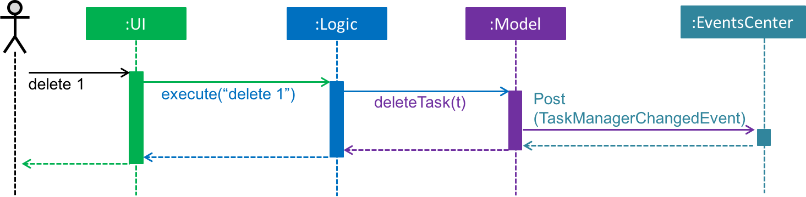

# Opus - Developer Guide

By : `Team W15-B3`  &nbsp;&nbsp;&nbsp;&nbsp; Since: `Mar 2017`  &nbsp;&nbsp;&nbsp;&nbsp; Licence: `MIT`

---

1. [Setting Up](#1-setting-up)
2. [Design](#2-design)
3. [Implementation](#3-implementation)
4. [Code Quality and Testing](#4-code-quality-and-testing)
5. [Dev Ops](#5-dev-ops)

* [Appendix A: Non Functional Requirements](#appendix-a--non-functional-requirements)
* [Appendix B: Glossary](#appendix-b--glossary)
* [Appendix C : Product Survey](#appendix-c--product-survey)

---

## 1. Setting up

### 1.1. Prerequisites

1. **JDK 1.8.0_60 or later**.
    > JDK version `1.8.0_60` or later is required to run the project correctly
2. **Eclipse IDE Neon**. 
    >Follow the instructions [here](https://www.eclipse.org/downloads/eclipse-packages/?show_instructions=TRUE) to download and install Eclipse.
3. **e(fx)clipse plugin for Eclipse**. 
    >Follow the instructions [here](http://www.eclipse.org/efxclipse/install.html#for-the-ambitious) to set up e(fx)clipse for Eclipse
4. **Buildship Gradle Integration**.
    >Buildship is bundled together with Eclipse Neon and above.
5. **Checkstyle Plug-in**.

### 1.2. Installing Checkstyle manually
    As of August 16, 2017, the Checkstyle repository in Eclipse Marketplace is unavailable. 

1. Download the compressed .zip file [here](https://sourceforge.net/projects/eclipse-cs/?source=typ_redirect). **Do not** extract the contents.
2. Launch Eclipse Neon.
3. Click `Help` > `Install new Software...`.
   
4. Click `Add..`.
   
5. Click `Archive` to open up a directory window.
   
6. Nagivate and select the **uncompressed** download file. Click `Open` > `OK`.
   
7. Check `Checkstyle` and click `Next`.
   
8. Click `Next` and accept the user license agreement as follows. 
   
9. Click `Finish` to install Checkstyle.
   

### 1.3. Importing the project through Gradle

1. Clone this repository through this [link](https://github.com/CS2103JAN2017-W15-B3/main.git).
2. Launch Eclipse.
    >Ensure you have installed the **e(fx)clipse** and **buildship** plugins per the prerequisites above.
3. Click `File` > `Import`.
4. Click `Gradle` > `Gradle Project` and then `Next`.
   
5. Click `Next` in the Gradle Import Wizard.
   
6. Click `Browse` and nagivate to the directory of the cloned repository. Click `Finish` to begin importing the project.
   
   > * Gradle will begin importing and building the project. This process may take up 15 minutes depending on the internet connection speed.
   >    
   > * Upon completion, locate the Gradle Tasks menu at the lower section of Eclipse Neon.
   >   
7. Open the project menu and select `build` > `build` to build and test the project.
   
8. Check that the project has builded successfully in the Console view.
   
More information about using Gradle can be found [here](https://github.com/CS2103JAN2017-W15-B3/main/blob/docs-settingup/docs/UsingGradle.md).
  > * If you are asked whether to 'keep' or 'overwrite' config files, choose to 'keep'.
  > * Depending on your connection speed and server load, it can even take up to 30 minutes for the set up to finish
      (This is because Gradle downloads library files from servers during the project set up process)
  > * If any settings files are changed by Eclipse during the import process, you can discard those changes.

### 1.4. Configuring Checkstyle
1. Click `Project` -> `Properties` -> `Checkstyle` -> `Local Check Configurations` -> `New...`.
2. Choose `External Configuration File` under `Type`.
3. Enter an arbitrary configuration name e.g. opus.
4. Import checkstyle configuration file found at `config/checkstyle/checkstyle.xml`.
5. Click OK once, go to the `Main` tab, use the newly imported check configuration.
6. Check and select `files from packages`, click `Change...`, and select the `resource`.
7. Click OK twice. Rebuild project as required.
    
    Click on the `files from packages` text after ticking in order to enable the `Change...` button

### 1.5. Troubleshooting project setup

#### 1.5.1.  Eclipse reports compile errors after merging new commits pulled from Git.
    This is because Eclipse failed to recognize the new files that are pulled from Git.
1. Right click on the project (in Eclipse package explorer) and choose `Gradle` > `Refresh Gradle Project`.

#### 1.5.2.  Eclipse reports missing libraries.
    Eclipse has failed to retrieve all required dependencies during the project import.
1. Right click on the project and select `Gradle` > `Run tests using Gradle`.

## 2. Design

### 2.1. Architecture

 
_Figure 2.1.1 : Architecture Diagram_

The **_Architecture Diagram_** given above explains the high-level design of the App.
Given below is a quick overview of each component.

> Tip: The `.pptx` files used to create diagrams in this document can be found in the [diagrams](diagrams/) folder.
> To update a diagram, modify the diagram in the pptx file, select the objects of the diagram, and choose `Save as picture`.

#### Main
`Main` has only one class called [`MainApp`](../src/main/java/seedu/address/MainApp.java). It is responsible for,

* At app launch: Initializes the components in the correct sequence, and connects them up with each other.
* At shut down: Shuts down the components and invokes cleanup method where necessary.

#### Commons
[**`Commons`**](#common-classes) represents a collection of classes used by multiple other components.
Two of those classes play important roles at the architecture level.

* `EventsCenter` : This class (written using [Google's Event Bus library](https://github.com/google/guava/wiki/EventBusExplained))
  is used by components to communicate with other components using events (i.e. a form of _Event Driven_ design)
* `LogsCenter` : Used by many classes to write log messages to the App's log file for debugging and communication between developers.

#### User Interface (UI)
The [**`UI`**](#ui-component) represents graphical views and handles interactions between the user and the program such as display the task lists. 

#### Logic
The [**`Logic`**](#logic-component) accepts commands sent from the user pass it to the model to process.

#### Model
The [**`Model`**](#model-component) holds the data of the App in-memory and manage and update it accordingly to the commands received.

#### Storage
The [**`Storage`**](#storage-component) Reads data from, and writes data to, the hard disk.

Each of the four components, [**`UI`**](#ui-component), [**`Logic`**](#logic-component), 
[**`Model`**](#model-component) and [**`Storage`**](#storage-component)

* Defines its _API_ in an `interface` with the same name as the Component.
* Exposes its functionality using a `{Component Name}Manager` class.

For example, the `Logic` component (see the class diagram given below) defines it's API in the `Logic.java`
interface and exposes its functionality using the `LogicManager.java` class.  
 
_Figure 2.1.2 : Class Diagram of the Logic Component_

#### Events-Driven Architecture

Event-driven architecture (EDA) consists of event emitters and receivers that allow loosely coupled components to communicate each other. The affected components react only when they receive events and process accordingly.
The _Sequence Diagram_ below shows how the components interact for the scenario where the user issues the
command `delete 1`.

 
_Figure 2.1.3a : Component interactions for `delete 1` command (part 1)_

>Note how the `Model` simply raises a `TaskManagerChangedEvent` when the TaskManager data are changed,
 instead of asking the `Storage` to save the updates to the hard disk.

The diagram below shows how the `EventsCenter` reacts to that event, which eventually results in the updates
being saved to the hard disk and the status bar of the UI being updated to reflect the 'Last Updated' time.  
 
_Figure 2.1.3b : Component interactions for `delete 1` command (part 2)_

> Note how the event is propagated through the `EventsCenter` to the `Storage` and `UI` without `Model` having
  to be coupled to either of them. This is an example of how this Event Driven approach helps us reduce direct
  coupling between components.

The sections below give more details of each component.

### 2.2. UI component

Author: [Xu Bili](http://github.com/xbili)

The `UI` component allows users to enter commands and receive the results through its graphical interfaces. It is responsible to handle the user interactions and ensure the commands are passed to `Logic` correctly.

 
_Figure 2.2.1 : Structure of the UI Component_

**API** : [`Ui.java`](../src/main/java/seedu/address/ui/Ui.java)

The UI consists of a `MainWindow` consists of multiple parts e.g.`CommandBox`, `ResultDisplay`, `TodayTaskListPanel`,
`WeekTaskListPanel`, `FloatingTaskListPanel`,`StatusBarFooter` etc.
All these, including the `MainWindow`, inherit from the abstract `UiPart` class.

The `CommandBox` allows users to enter the commands which will later be executed in `Logic`.

The `ResultDisplay` panel shows the feedback of the commands.

The `TodayTaskListPanel` shows all incomplete tasks that are due today and completed tasks that have been done today.

The `WeekTaskListPanel` shows all incomplete tasks that are due within a week.

The `FloatingTaskListPanel` shows all the incomplete tasks that do not have deadlines.

The `StatusBarFooter` shows when the app has been last updated and storage file path.
 
The `UI` component uses JavaFx UI framework. The layout of these UI parts are defined in matching `.fxml` files
 that are in the `src/main/resources/view` folder. 
 For example, the layout of the [`MainWindow`](../src/main/java/seedu/address/ui/MainWindow.java) is specified in
 [`MainWindow.fxml`](../src/main/resources/view/MainWindow.fxml)

The `UI` component,

* Executes user commands using the `Logic` component.
* Binds itself to some data in the `Model` so that the UI can auto-update when data in the `Model` change.
* Responds to events raised from various parts of the App and updates the UI accordingly.

### 2.3. Logic component

Author: [Lam Guang Jun](http://github.com/gjlam95)

The `Logic` component process all the business logic and incoming requests. 
It manipulates data based on the `Model` component and communicates with the `UI` component
to display the final output.

 
_Figure 2.3.1 : Structure of the Logic Component_

**API** : [`Logic.java`](../src/main/java/seedu/address/logic/Logic.java)

1. `Logic` uses the `Parser` class to parse the user command.
2. This results in a `Command` object which is executed by the `LogicManager`.
3. The command execution can affect the `Model` (e.g. adding a person) and/or raise events.
4. The result of the command execution is encapsulated as a `CommandResult` object which is passed back to the `Ui`.

Given below is the Sequence Diagram for interactions within the `Logic` component for the `execute("delete 1")`
 API call. 
 
_Figure 2.3.1 : Interactions Inside the Logic Component for the `delete 1` Command_

In this diagram, the `Logic Manager` receives an event to delete the task at index 1 and parses into a `DeleteCommand` that communicates with the Model to perform the deletion. The result is pass back to the `UI` component through `CommandResult`.

### 2.4. Model component

Author: [Han Lynn](http://github.com/hlynn93)

The `Model` component handles the data related logic and defines the structure of the data. It reacts to the `Logic` requests and changes its and its attributes' states accordingly.

 
_Figure 2.4.1 : Structure of the Model Component_

**API** : [`Model.java`](../src/main/java/seedu/address/model/Model.java)

The `Model` component does not depends on other three components and consists of three main objects: `Task`, `Tag` and `UserPref`.
* The `UserPref` object represents the user's preferences.
* The `Task` object stores the attributes of task which consist of `Name`, `Priority`, `Status`, `Note`, `StartTime` and `EndTime`. It is also linked to the `Tag` object that categorises the existing tasks.

The `Model` component exposes a `UnmodifiableObservableList<ReadOnlyTask>` that can be 'observed' e.g. the UI can be bound to this list so that the UI automatically updates when the data in the list change.

### 2.5. Storage component

Author: [Shi Yanzhang](http://github.com/mynameisyz)

The `Storage` component reads and writes component state information to the storage files in the hard disk.

 
_Figure 2.5.1 : Structure of the Storage Component_

**API** : [`Storage.java`](../src/main/java/seedu/address/storage/Storage.java)

The `Storage` component listens the `TaskManagerChangedEvent` and 
whenever there is a change to the task manager data, the component updates the storage files accordingly. It

* saves `UserPref` objects in json format and read it back.
* saves the Task Manager data in xml format and read it back.

### 2.6. Common classes

Classes used by multiple components are in the `seedu.addressbook.commons` package.

## 3. Implementation

### 3.1. Logging

We are using `java.util.logging` package for logging. The `LogsCenter` class is used to manage the logging levels
and logging destinations.

* The logging level can be controlled using the `logLevel` setting in the configuration file
  (See [Configuration](#configuration))
* The `Logger` for a class can be obtained using `LogsCenter.getLogger(Class)` which will log messages according to
  the specified logging level
* Currently log messages are output through: `Console` and to a `.log` file.

**Logging Levels**

* `SEVERE` : Critical problem detected which may possibly cause the termination of the application
* `WARNING` : Can continue, but with caution
* `INFO` : Information showing the noteworthy actions by the App
* `FINE` : Details that is not usually noteworthy but may be useful in debugging
  e.g. print the actual list instead of just its size

### 3.2. Configuration

Certain properties of the application can be controlled (e.g App name, logging level) through the configuration file
(default: `config.json`):

## 4. Code Quality and Testing

### 4.1. Code Quality

In Opus, we asipre to attain high quality coding standards by applying the principles of defensive programming. Defensive prgramming principles and techniques enable the developer to handle unexpected situations that may cause a program or a routine to stop working. Some examples of defensive coding are:
* Using assertions to check validity of arguments before passing them into functions.
* Throwing Excpetions when encountering unexpected events.
* Enforcing 1-to-1 associations
A good write up on defensive programming can be found [here](http://www.comp.nus.edu.sg/~cs2103/AY1617S2/files/handouts/%5bL7P2%5d%20Putting%20up%20defenses%20to%20protect%20our%20code.pdf) 

### 4.2. Testing

Tests can be found in the `./src/test/java` folder.

**Using JUnit test in Eclipse**:

* To run all tests, right-click on the `src/test/java` folder and choose
  `Run as` > `JUnit Test`
* To run a subset of tests, you can right-click on a test package, test class, or a test and choose
  to run as a JUnit test.

**Using Gradle**:

* See [UsingGradle.md](UsingGradle.md) for how to run tests using Gradle.

We have two types of tests:

1. **GUI Tests** - These are _System Tests_ that test the entire App by simulating user actions on the GUI.
   These are in the `guitests` package.

2. **Non-GUI Tests** - These are tests not involving the GUI. They include,
   1. _Unit tests_ targeting the lowest level methods/classes.  
      e.g. `seedu.address.commons.UrlUtilTest`
   2. _Integration tests_ that are checking the integration of multiple code units
     (those code units are assumed to be working). 
      e.g. `seedu.address.storage.StorageManagerTest`
   3. Hybrids of unit and integration tests. These test are checking multiple code units as well as
      how the are connected together. 
      e.g. `seedu.address.logic.LogicManagerTest`

#### Headless GUI Testing
Thanks to the [TestFX](https://github.com/TestFX/TestFX) library we use,
 our GUI tests can be run in the _headless_ mode.
 In the headless mode, GUI tests do not show up on the screen.
 That means the developer can do other things on the Computer while the tests are running. 
 See [UsingGradle.md](UsingGradle.md#running-tests) to learn how to run tests in headless mode.
 
### 4.3. Improving test coverage using Coveralls
>Coveralls is a code analytic tool that tracks and analyses test coverage of a project. We have integrated Coveralls into our project to keep track and improve upon the test coverage of the code to deliver a robust and throughly-tested product. 
 
 The Coveralls dashboard can be accessed [here](https://coveralls.io/github/CS2103JAN2017-W15-B3/main?branch=master). 
   
 
 Upon every pull request, Coveralls will run an analysis of the pushed code and produce a report. To view the coverage report, nagivate the to pull request in Github.

 1. Click on the Coveralls badge in the pull request to open the coverage report as follows:
    
 2. Scroll the report and select any file to view detailed analysis of the code.
    
 Lines that are highlighted in red indicate that there is no test coverage for the code branch.
    
 
    To maintain the code quality of the product, we strongly insist that all possible code branches are well covered with test cases.

### 4.4. Troubleshooting tests

#### 4.4.1. Tests fail because NullPointException when AssertionError is expected**
    This is because Assertions are not enabled for JUnit tests.
1. Enable assertions in JUnit tests as described
   [here](http://stackoverflow.com/questions/2522897/eclipse-junit-ea-vm-option).  
2. Delete run configurations created when you ran tests earlier.

## 5. Dev Ops

### 5.1. Build Automation

See [UsingGradle.md](UsingGradle.md#using-gradle) to learn how to use Gradle for build automation.

### 5.2. Continuous Integration

We use [Travis CI](https://travis-ci.org/) and [AppVeyor](https://www.appveyor.com/) to perform _Continuous Integration_ on our projects.
See [UsingTravis.md](UsingTravis.md) and [UsingAppVeyor.md](UsingAppVeyor.md) for more details.

### 5.3. Publishing Documentation

See [UsingGithubPages.md](UsingGithubPages.md) to learn how to use GitHub Pages to publish documentation to the
project site.

### 5.4. Making a Release

Here are the steps to create a new release.

 1. Generate a JAR file [using Gradle](UsingGradle.md#creating-the-jar-file).
 2. Tag the repo with the version number. e.g. `v0.1`
 2. [Create a new release using GitHub](https://help.github.com/articles/creating-releases/)
    and upload the JAR file you created.

### 5.5. Converting Documentation to PDF format

We use [Google Chrome](https://www.google.com/chrome/browser/desktop/) for converting documentation to PDF format,
as Chrome's PDF engine preserves hyperlinks used in webpages.

Here are the steps to convert the project documentation files to PDF format.

 1. Make sure you have set up GitHub Pages as described in [UsingGithubPages.md](UsingGithubPages.md#setting-up).
 1. Using Chrome, go to the [GitHub Pages version](UsingGithubPages.md#viewing-the-project-site) of the
    documentation file.  
    e.g. For [UserGuide.md](UserGuide.md), the URL will be `https://<your-username-or-organization-name>.github.io/addressbook-level4/docs/UserGuide.html`.
 1. Click on the `Print` option in Chrome's menu.
 1. Set the destination to `Save as PDF`, then click `Save` to save a copy of the file in PDF format.  
    For best results, use the settings indicated in the screenshot below.  
     
    _Figure 5.4.1 : Saving documentation as PDF files in Chrome_

### 5.6. Managing Dependencies and External Libraries

In Opus, Gradle is used to managed all dependencies and external libraries. The external libraries used in this project are:
* [ControlsFx](http://fxexperience.com/controlsfx/) `8.40.11`
* [Guava](https://github.com/google/guava) `19.0`
* [Jackson](https://github.com/FasterXML/jackson) `2.7.0`
* [jUnit](http://junit.org/junit4/) `4.12`
* [TestFx](https://github.com/TestFX/TestFX) `4.0`
* [Monocle](https://wiki.openjdk.java.net/display/OpenJFX/Monocle) `1.8.0_20`

## Appendix A : Non Functional Requirements

1. Should work on any [mainstream OS](#mainstream-os) as long as it has Java `1.8.0_60` or higher installed.
2. Should be able to hold up to 1000 tasks without a noticeable sluggishness in performance for typical usage.
3. A user with above average typing speed for regular English text (i.e. not code, not system admin commands)
   should be able to accomplish most of the tasks faster using commands than using the mouse.
4. Should include well-written guides for users and developers
5. Should follow OOP principles
6. Should come with automated tests

## Appendix B : Glossary

##### Mainstream OS

> Windows, Linux, Unix, OS-X

## Appendix C : Product Survey

[**Simpliday**](http://www.simpliday.com/)

Author: Yanzhang

Pros:

* Excellent user interface design and user experience
* Intuitive design for users to pick up easily
* Easy to organize tasks reminiscent of a physical organiser
* Convenient integration with cloud-based services (Google sign-in)
* Advanced features for tasks including geo-tagging, sharing through social media, emails

Cons:

* Certain features are not relevant to certain types of user
* Only available on App Store (iOS)

[**Pivotal Tracker**](https://www.pivotaltracker.com/)

Author: Han Lynn

Pros:

* Dashboard view for entire project
* Tasks tracking & prioritizing
* Release and milestone management
* Dedicated apps are available on major platforms
* Open APIs for developers to integrate

Cons:

* Not intuitive enough that it requires a few tutorials to fully understand the controls
* Very specific to software engineering projects

[**Trello**](https://trello.com/)

Author: Xu Bili

Pros:

* Intuitive UI that needs little explaining of how to use it
* Stores information on the cloud, accessible from any device
* Collaborative, *kanban* can be shared with other people
* Integrates with GitHub and other useful services

Cons:

* Specific to technical tasks
* Tasks have to be small enough to be broken down into cards
* Gets really messy when the project scales up

