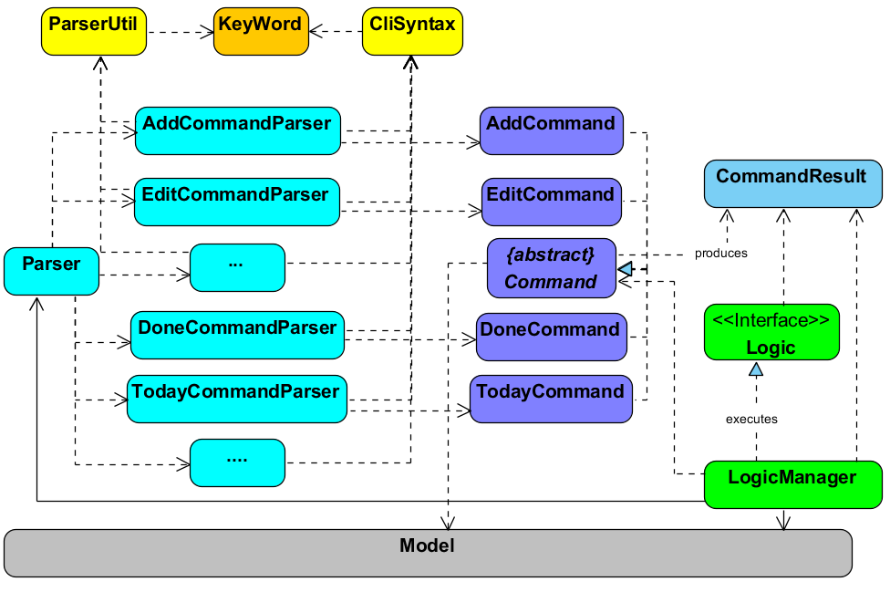

# Task Manager - Developer Guide

By : `T09B1`  &nbsp;&nbsp;&nbsp;&nbsp; Since: `Mar 2017`

---

## Design

### Logic component

The **Logic** component of the software handles the input from the **UI** and calls methods from the **Model**, **Config**, and **Storage** to perform the appropriate changes.

When a command is entered, the `Parser` processes the text and selects the appropriate `CommandParser` based on the first word in the text to parse the arguments as well. Its respective `Command` is then initialized which calls the relevant methods from other components, and returns a `CommandResult` to the UI to make the relevant changes.

> `Parser` makes use of classes such as `ArgumentTokenizer`, `ParserUtil`, and `CliSyntax` for certain repetitive parsing tasks

> `CommandParser` may return an `IncorrectCommand` in the case when the arguments are not of the suitable format

### Event-Driven Nature

Because there are many different components that may be affected by a single command, we use events to simplify method calling. In our code, after a command has successfully executed its primary functionality like making a change to the **Model**, it raises an `Event` which is then picked up by **Storage**, and **UI** which then calls the relevant methods to make the appropriate changes.

The _Sequence Diagram_ below exemplifies this process. In the figure below, you can see that entering `delete 1` causes a change in the model which is the command's primary task.

 
_Figure _ : Primary Component interactions for `delete 1` command (part 1)_

Only after the task is complete, is an `Event` raised to modify the storage and UI components as can be seen in the next diagram.

 
_Figure _ : Secondary Component interactions for `delete 1` command (part 2)_

## Appendix A : User Stories

Priorities: High (must have) - `* * *`, Medium (nice to have)  - `* *`,  Low (unlikely to have) - `*`

Priority | As a ... | I want to ... | So that I can...
-------- | :-------- | :--------- | :-----------
 `* * *` | New User | Know all the commands that are available | Know how to use the Task Manager effectively
 `* * *` | User | Add a task | Keep track of my tasks
 `* * *` | User | Specify a start date for a task | Keep track of when I intend to start on my task
 `* * *` | User | Specify a deadline for a task | Keep track of when my tasks are due
 `* * *` | User | Update an existing task | Correct a mistake or indicate a change in the task
 `* * *` | User | Delete a task | Indicate a change in the task
 `* * *` | User | Tag my tasks | Find the tasks more easily, and make my task manager more organized
 `* * *` | User | Manage (add, delete, rename) the tags | Indicate changes in tags
 `* * *` | User | Find a specific task by keywords in the description/title | I can view or modify the task
 `* * *` | User | Find tasks due on a specific day | I can see my workload for that day
 `* * *` | User | View all tasks | Know what tasks I have
 `* * *` | User | Be able to indicate if I have completed a task or not | Keep track of my progress
 `* * *` | User | View all tasks that I have not done | View how much more work is there to be done
 `* * *` | User | View completed tasks (hidden by default) | Know what tasks I have completed
 `* * *` | User | Undo my previous commands | undo any mistakes that I have made
 `* * *` | User | Redo my undo command | undo my undo
 `* * *` | User | Specify a location to save the storage file | Choose where to save the file to
 `* * *` | User | Specify a storage file to open | Access a task list from another computer
 `* * *` | User | Enter commands using natural language and in an intuitive manner | Easily use the task manager without having to memorize command formats
 `* * *` | User | Exit the task manager | Have a peace of mind that the program exits safely
 `* *` | User | See if the commands that I typed are valid while I am typing them | Check that my command is valid before I press enter
 `* *` | User | Export all tasks to an external file | Backup the list of tasks
 `* *` | User | Restore tasks from an external file | Access tasks from one computer on another computer
 `*` | User | Add recurring tasks | Avoid duplicate work and adding daily/weekly/monthly tasks multiple times
 `*` | Team leader | Push the team event schedule to every team member | Notify the whole team about the team schedule
 `*` | Advanced User | Use hotkeys to bring the Task Manager from the background to the foreground | Make adding tasks faster

## Appendix B : Use Cases

(For all use cases below, the **System** is the `Task Manager` and the **Actor** is the `user`, unless specified otherwise)

### Use Case: Add Task
**MSS**

1. User requests to add a new task
2. TaskManager adds a new task
Use case ends

**Extensions** 
2a. User supplies optional parameters 
>  2a1. TaskManager includes optional parameters in task details 
>  Use case resumes at step 2

### Use Case: Find Task
**MSS**

1. User requests to find a specific task
2. TaskManager finds all related tasks and displays to user
Use case ends

**Extensions** 
1a. User requests to find a task in sorted order. 
>  1a1. TaskManager displays tasks in sorted order 
>  Use case ends

2a. TaskManager cannot find any related tasks. 
>	2a1. User tries new search 
>	Use case resumes at step 1

### Use Case: View Tasks
**MSS**

1. User requests TaskManager to display task list
2. TaskManager displays the task list to the user
Use case ends

**Extensions** 
1a. User requests to view tasks in sorted order 
>	1a1. TaskManager displays tasks in specified sorted order. 
>	Use case ends.

### Use Case: Update Task
**MSS**

1. User requests TaskManager to display task list
2. TaskManager displays the task list to the user
3. User specifies a task to be updated and supplies parameters to update task
4. TaskManager updates the task
Use case ends

**Extensions** 
4a. User supplied invalid parameters 
>	4a1. TaskManager informs user that invalid parameters were entered 
>	Use case resumes at step 3

### Use Case: Delete Task
**MSS**

1. User requests TaskManager to display task list
2. TaskManager displays the task list to the user
3. User specifies a task to be deleted
4. TaskManager deletes the task
Use case ends

**Extensions** 
4a. Specified task does not exist 
>	4a1. TaskManager informs user that invalid task was specified 
>	Use case ends

### Use Case: Indicate Task completed
**MSS**

1. User requests TaskManager to display task list
2. TaskManager displays the task list to the user
3. User specifies a task to indicate as completed
4. TaskManager saves task as completed
Use Case ends

**Extensions** 
4a. Specified task does not exist 
>	4a1. TaskManager informs user that invalid task was specified 
>	Use case ends

### Use Case: Change Storage File Location
**MSS**

1. User specifies new storage file location to TaskManager
2. TaskManager changes the storage file to the new location
Use Case ends

**Extensions** 
2a. Specified location does not exist 
>	2a1. TaskManager informs user that invalid location was specified 
>	Use case ends

### Use Case: Edit Tag
**MSS**

1. User requests TaskManager to display tag list
2. TaskManager displays the tag list to the user
3. User specifies a tag to be modified
4. TaskManager displays success message
Use case ends

**Extensions** 
3a. Specified tag does not exist 
>	3a1. TaskManager informs user that the selected tag does not exist 
>	3a2. Use case resumes at step 3 

3b. The new tag is not valid, i.e. contains illegal characters or too long. 
>	3b1. TaskManager informs user that the input is not valid 
>	3b2. Use case resumes at step 3 

### Use Case: Undo Previous Command
**MSS**

1. User requests to undo the previous command
2. TaskManager displays the last modification command sent by the user
3. User confirms the undo command
4. TaskManager displays success message
Use case ends

**Extensions** 
1a. There is no undo backup during this session so far 
>	1a1. TaskManager informs user that there is no undo backup file 
>	1a2. Use case ends

### Use Case: Redo Previous Command that has been undone
**MSS**

1. User requests to redo the previous command that has been undone
2. TaskManager displays the last modification command sent by the user
3. User confirms the redo command
4. TaskManager displays success message
Use case ends

**Extensions** 
1a. There is no redo backup during this session so far 
>	1a1. TaskManager informs user that there is no redo backup file 
>	1a2. Use case ends

## Appendix C : Non Functional Requirements

1. The task manager should be a desktop software that works on the Windows 7 or later.
1. The task manager should use a Command Line Interface as a main form of input.
1. The task manager should work without requiring additional software extensions.
1. The task manager should store data locally in the form of a human editable text file.
1. The task manager should work without requiring an installer.
1. The task manager only use third-party frameworks/libraries that:
  * are free.
  * do not require any installation by the user of your software.
  * do not violate other constraints.

## Appendix D : Glossary

## Appendix E : Product Survey

**Any.Do**

Author: Ken

Pros:
* Simple, Minimalistic
* Mobile Friendly
* "Moment", feature that cycles through the tasks you have on that day and prompts you to plan your day

Cons:
* Poor Web Application

**Google Calendar**

Author: Shi Yuan

Pros:
* Supports Natural Language commands
* Synchronizes on all devices

Cons:
* Unable to set priorities for tasks

**Things**

Author: Yu Li

Pros:
* Highly customizable
* Daily Review
* Autofill

Cons:
* Cannot export

**Wunderlist**

Author: Cao Wei

Pros:
* Many shortcuts
* Sorts tasks by priority and category
* Compatible with almost every OS

Cons:
* No calendar view
