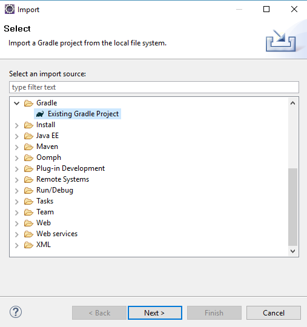
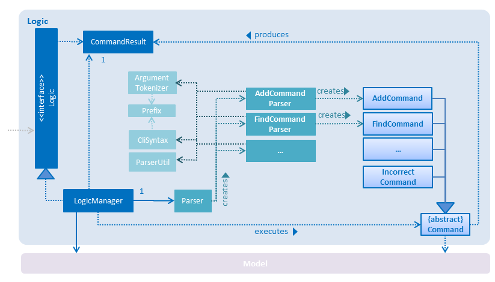
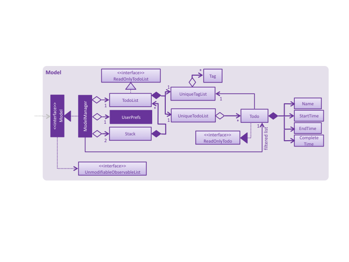

# myPotato - Developer Guide

By : `Team myPotato`  &nbsp;&nbsp;&nbsp;&nbsp; Since: `Feb 2017`  &nbsp;&nbsp;&nbsp;&nbsp; Licence: `MIT`

---

1. [Setting Up](#setting-up)
2. [Design](#design)
3. [Implementation](#implementation)
4. [Testing](#testing)
5. [Dev Ops](#dev-ops)

* [Appendix A: User Stories](#appendix-a--user-stories)
* [Appendix B: Use Cases](#appendix-b--use-cases)
* [Appendix C: Non Functional Requirements](#appendix-c--non-functional-requirements)
* [Appendix D: Glossary](#appendix-d--glossary)
* [Appendix E : Product Survey](#appendix-e--product-survey)

## 1. Setting up

### 1.1. Prerequisites

1. Ensure that your system runs on **JDK `1.8.0_60`**  or later 
2. Ensure your system has **Eclipse** IDE pre-installed
3. **e(fx)clipse** plugin for Eclipse (Do the steps 2 onwards given in
   [this page](http://www.eclipse.org/efxclipse/install.html#for-the-ambitious))
4. **Buildship Gradle Integration** plugin from the Eclipse Marketplace
5. **Checkstyle Plug-in** plugin from the Eclipse Marketplace

### 1.2. Importing the project into Eclipse

1. Fork this repo, and clone the fork to your computer
2. Open Eclipse (Note: Ensure you have installed the **e(fx)clipse** and **buildship** plugins as given
   in the prerequisites above)
3. Click `File` > `Import`
4. Click `Gradle` > `Existing Gradle Project` > `Next` > `Next`
   
    
5. Click `Browse`, then locate the project's directory
6. Click `Finish`

### 1.3. Configuring Checkstyle
1. Click `Project` -> `Properties` -> `Checkstyle` -> `Local Check Configurations` -> `New...`
2. Choose `External Configuration File` under `Type`
3. Enter an arbitrary configuration name e.g. myPotato
4. Import checkstyle configuration file found at `config/checkstyle/checkstyle.xml`
5. Click OK once, go to the `Main` tab, use the newly imported check configuration.
6. Tick and select `files from packages`, click `Change...`, and select the `resources` package
7. Click OK twice. Rebuild project if prompted

> Note to click on the `files from packages` text after ticking in order to enable the `Change...` button

### 1.4. Troubleshooting project setup

**Problem: Eclipse reports compile errors after new commits are pulled from Git**

* Reason: Eclipse fails to recognize new files that appeared due to the Git pull.
* Solution: Refresh the project in Eclipse: 
  Right click on the project (in Eclipse package explorer), choose `Gradle` -> `Refresh Gradle Project`.

**Problem: Eclipse reports some required libraries missing**

* Reason: Required libraries may not have been downloaded during the project import.
* Solution: [Run tests using Gradle](UsingGradle.md) once (to refresh the libraries).

## 2. Design

### 2.1. Architecture

 
_Figure 2.1.1 : Architecture Diagram_

The **_Architecture Diagram_** given above explains the high-level design of the App.
Given below is a quick overview of each component.

> Tip: The `.pptx` files used to create diagrams in this document can be found in the [diagrams](diagrams/) folder.
> To update a diagram, modify the diagram in the pptx file, select the objects of the diagram, and choose `Save as picture`.

`Main` has only one class called [`MainApp`](../src/main/java/seedu/address/MainApp.java). It is responsible for,

* At app launch: Initializes the components in the correct sequence, and connects them up with each other.
* At shut down: Shuts down the components and invokes cleanup method where necessary.

[**`Commons`**](#common-classes) represents a collection of classes used by multiple other components.
Two of those classes play important roles at the architecture level.

* `EventsCenter` : This class (written using [Google's Event Bus library](https://github.com/google/guava/wiki/EventBusExplained))
  is used by components to communicate with other components using events (i.e. a form of _Event Driven_ design)
* `LogsCenter` : Used by many classes to write log messages to the App's log file.

The rest of the App consists of four components.

* [**`UI`**](#ui-component) : The UI of the App.
* [**`Logic`**](#logic-component) : The command executor.
* [**`Model`**](#model-component) : Holds the data of the App in-memory.
* [**`Storage`**](#storage-component) : Reads data from, and writes data to, the hard disk.

Each of the four components

* Defines its _API_ in an `interface` with the same name as the Component.
* Exposes its functionality using a `{Component Name}Manager` class.

For example, the `Logic` component (see the class diagram given below) defines it's API in the `Logic.java`
interface and exposes its functionality using the `LogicManager.java` class. 
 
_Figure 2.1.2 : Class Diagram of the Logic Component_

#### Events-Driven nature of the design

The _Sequence Diagram_ below shows how the components interact for the scenario where the user issues the
command `delete 1`.

 
_Figure 2.1.3a : Component interactions for `delete 1` command (part 1)_

>Note how the `Model` simply raises a `AddressBookChangedEvent` when the Address Book data are changed,
 instead of asking the `Storage` to save the updates to the hard disk.

The diagram below shows how the `EventsCenter` reacts to that event, which eventually results in the updates
being saved to the hard disk and the status bar of the UI being updated to reflect the 'Last Updated' time.  
 
_Figure 2.1.3b : Component interactions for `delete 1` command (part 2)_

> Note how the event is propagated through the `EventsCenter` to the `Storage` and `UI` without `Model` having
  to be coupled to either of them. This is an example of how this Event Driven approach helps us reduce direct
  coupling between components.

The sections below give more details of each component.

### 2.2. UI component

Author: Long & Ivan Koh

 
_Figure 2.2.1 : Structure of the UI Component_

**API** : [`Ui.java`](../src/main/java/seedu/address/ui/Ui.java)

The UI consists of a `MainWindow` that is made up of parts e.g.`CommandBox`, `ResultDisplay`, `PersonListPanel`,
`StatusBarFooter`, `TaskDescription` etc. All these, including the `MainWindow`, inherit from the abstract `UiPart` class.

The `UI` component uses JavaFx UI framework. The layout of these UI parts are defined in matching `.fxml` files
 that are in the `src/main/resources/view` folder. 
 For example, the layout of the [`MainWindow`](../src/main/java/seedu/address/ui/MainWindow.java) is specified in
 [`MainWindow.fxml`](../src/main/resources/view/MainWindow.fxml)

The `UI` component,

* Executes user commands using the `Logic` component.
* Binds itself to some data in the `Model` so that the UI can auto-update when data in the `Model` change.
* Responds to events raised from various parts of the App and updates the UI accordingly.

### 2.3. Logic component

Author: Long, Ivan, Di Feng, Yan Hao

 
_Figure 2.3.1 : Structure of the Logic Component_

**API** : [`Logic.java`](../src/main/java/seedu/address/logic/Logic.java) src/main/java/seedu/address/logic

1. `Logic` uses the `Parser` class to parse the user command.
2. This results in a `Command` object which is executed by the `LogicManager`.
3. The command execution can affect the `Model` (e.g. adding a person) and/or raise events.
4. The result of the command execution is encapsulated as a `CommandResult` object which is passed back to the `Ui`.

Given below is the Sequence Diagram for interactions within the `Logic` component for the `execute("delete 1")`
 API call. 
 
_Figure 2.3.2 : Interactions Inside the Logic Component for the `delete 1` Command_

### 2.4. Model component

Author: Yan Hao

 
_Figure 2.4.1 : Structure of the Model Component_

**API** : [`Model.java`](../src/main/java/seedu/address/model/Model.java)

The `Model`,

* stores a `UserPref` object that represents the user's preferences.
* stores the Task Manager data.
* exposes a `UnmodifiableObservableList<ReadOnlyTask>` that can be 'observed' e.g. the UI can be bound to this list
  so that the UI automatically updates when the data in the list change.
* does not depend on any of the other three components.

### 2.5. Storage component

Author: Di Feng

 
_Figure 2.5.1 : Structure of the Storage Component_

**API** : [`Storage.java`](../src/main/java/seedu/address/storage/Storage.java)

The `Storage` component,

* can save `UserPref` objects in json format and read it back.
* can save the Task Manager data in xml format and read it back.

### 2.6. Common classes

Classes used by multiple components are in the `seedu.addressbook.commons` package.

## 3. Implementation

### 3.1. Logging

java.util.logging package is used for logging. The `LogsCenter` class is used to manage the logging levels
and logging destinations.

* The logging level can be controlled using the `logLevel` setting in the configuration file
  (See [Configuration](#configuration))
* The `Logger` for a class can be obtained using `LogsCenter.getLogger(Class)` which will log messages according to
  the specified logging level
* Currently log messages are output through: `Console` and to a `.log` file.

**Logging Levels**

* `SEVERE` : Critical problem detected which may possibly cause the termination of the application
* `WARNING` : Can continue, but with caution
* `INFO` : Information showing the noteworthy actions by the App
* `FINE` : Details that is not usually noteworthy but may be useful in debugging
  e.g. print the actual list instead of just its size

### 3.2. Configuration

Certain properties of the application can be controlled (e.g App name, logging level) through the configuration file
(default: `config.json`):

## 4. Testing

Tests can be found in the `./src/test/java` folder.

**In Eclipse**:

* To run all tests, right-click on the `src/test/java` folder and choose
  `Run as` > `JUnit Test`
* To run a subset of tests, you can right-click on a test package, test class, or a test and choose
  to run as a JUnit test.

**Using Gradle**:

* See [UsingGradle.md](UsingGradle.md) for how to run tests using Gradle.

There are two types of tests:

1. **GUI Tests** - These are _System Tests_ that test the entire App by simulating user actions on the GUI.
   These are in the `guitests` package.

2. **Non-GUI Tests** - These are tests not involving the GUI. They include,
   * _Unit tests_ targeting the lowest level methods/classes.  
      e.g. `seedu.address.commons.UrlUtilTest`
   * _Integration tests_ that are checking the integration of multiple code units
     (those code units are assumed to be working). 
      e.g. `seedu.address.storage.StorageManagerTest`
   * Hybrids of unit and integration tests. These test are checking multiple code units as well as
      how they are connected together. 
      e.g. `seedu.address.logic.LogicManagerTest`

#### Headless GUI Testing
Thanks to the [TestFX](https://github.com/TestFX/TestFX) library we use,
 our GUI tests can be run in the _headless_ mode.
 In the headless mode, GUI tests do not show up on the screen.
 That means the developer can do other things on the Computer while the tests are running. 
 See [UsingGradle.md](UsingGradle.md#running-tests) to learn how to run tests in headless mode.

### 4.1. Troubleshooting tests

 **Problem: Tests fail because NullPointException when AssertionError is expected**

 * Reason: Assertions are not enabled for JUnit tests.
   This can happen if you are not using a recent Eclipse version (i.e. _Neon_ or later)
 * Solution: Enable assertions in JUnit tests as described
   [here](http://stackoverflow.com/questions/2522897/eclipse-junit-ea-vm-option).  
   Delete run configurations created when you ran tests earlier.

## 5. Dev Ops

### 5.1. Build Automation

See [UsingGradle.md](UsingGradle.md) to learn how to use Gradle for build automation.

### 5.2. Continuous Integration

We use [Travis CI](https://travis-ci.org/) and [AppVeyor](https://www.appveyor.com/) to perform _Continuous Integration_ on our projects.
See [UsingTravis.md](UsingTravis.md) and [UsingAppVeyor.md](UsingAppVeyor.md) for more details.

### 5.3. Publishing Documentation

See [UsingGithubPages.md](UsingGithubPages.md) to learn how to use GitHub Pages to publish documentation to the
project site.

### 5.4. Making a Release

Here are the steps to create a new release.

 1. Generate a JAR file [using Gradle](UsingGradle.md#creating-the-jar-file).
 2. Tag the repo with the version number. e.g. `v0.1`
 2. [Create a new release using GitHub](https://help.github.com/articles/creating-releases/)
    and upload the JAR file you created.

### 5.5. Converting Documentation to PDF format

We use [Google Chrome](https://www.google.com/chrome/browser/desktop/) for converting documentation to PDF format,
as Chrome's PDF engine preserves hyperlinks used in webpages.

Here are the steps to convert the project documentation files to PDF format.

 1. Make sure you have set up GitHub Pages as described in [UsingGithubPages.md](UsingGithubPages.md#setting-up).
 1. Using Chrome, go to the [GitHub Pages version](UsingGithubPages.md#viewing-the-project-site) of the
    documentation file.  
    e.g. For [UserGuide.md](UserGuide.md), the URL will be `https://<your-username-or-organization-name>.github.io/addressbook-level4/docs/UserGuide.html`.
 1. Click on the `Print` option in Chrome's menu.
 1. Set the destination to `Save as PDF`, then click `Save` to save a copy of the file in PDF format.  
    For best results, use the settings indicated in the screenshot below.  
     
    _Figure 5.4.1 : Saving documentation as PDF files in Chrome_

### 5.6. Managing Dependencies

A project often depends on third-party libraries. For example, Address Book depends on the
[Jackson library](http://wiki.fasterxml.com/JacksonHome) for XML parsing. Managing these _dependencies_
can be automated using Gradle. For example, Gradle can download the dependencies automatically, which
is better than these alternatives. 
a. Include those libraries in the repo (this bloats the repo size) 
b. Require developers to download those libraries manually (this creates extra work for developers) 

## Appendix A : User Stories

Priorities: High (must have) - `* * *`, Medium (nice to have)  - `* *`,  Low (unlikely to have) - `*`

Priority | As a ... | I want to ... | So that I can...
-------- | :-------- | :--------- | :-----------
`* * *` | user | edit a task | make changes if necessary
`* * *` | user | add a task | know what I need to do
`* * *` | user | delete a task | remove entries that I no longer need
`* * *` | user | see the list of tasks | track what I have done and not done
`* * *` | user | add a priority to a task | know what needs to be done first
`* * *` | user | sort a task by its date |  find the latest task easily
`* * *` | user | have a task reminder | know when the deadline for a task is
`* * *` | user | have a back up of my tasks | retrieve tasks which I accidentally deleted
`* * *` | user | have a command list | know what command format to use and follow
`* * *` | user | have a list of overdue tasks | track tasks that I have yet to complete.
`* * *` | user | undo a change | undo the previous action
`* *` | user | see a list of tasks I have done in a certain day | track the progress
`* *` | user | duplicate a task | duplicate a task conveniently
`* *` | user | delete many tasks at once | save time
`* *` | user | pin my tasks | take note of the most important tasks 
`* *` | user | categorize my task | find my task conveniently
`* *` | user | search task by task name| find a specific task without scrolling
`* *` | user | advanced command suggestion | know what format to follow without referring to the command list
`* *` | user | launch the application using keyboard shortcuts | access the application without using the mouse.
`* *` | user | sync with google calendar | use a calendar to schedule my tasks.
`* *` | user | have a login function | have privacy
`* *` | user | have an auto complete feature | save my time typing
`* *` | user | use the task manager anywhere | access it as and when I want. 
`* *` | user | add a tag to a task | group my tasks 
`*` | user | export the list of my tasks | send it to another user
`*` | user | set my profile picture | feel more personal
`*` | user | option to turn off the task reminder | choose not be prompted again after I have accomplished my task
`*` | user | customize my task manager | feel more personal
`*` | user | share my task with other colleagues | collaborate with our colleagues
`*` | user | set different frequency for my task reminder | prepare for the tasks.
`*` | user |  open my task list offline | open my task list without Internet access

{More to be added}

## Appendix B : Use Cases

(For all use cases below, the **System** is the `myPotato` and the **Actor** is the `user`, unless specified otherwise)

#### Use case: Add a task

**MSS**

1. User request to add a task
2. myPotato shows the list with added task

**Extension**

1a. The command is invalid

> 1a1. myPotato shows the list of command help
> Use case ends

#### Use case: Delete a task

**MSS**

1. User requests to list all tasks
2. myPotato shows a list of tasks
3. User requests to delete a specific task in the list
4. myPotato deletes the task  
Use case ends.

**Extensions**

2a. The list is empty

> Use case ends

3a. The given index is invalid

> 3a1. myPotato shows an error message  
  Use case resumes at step 2

#### Use Case: Sort tasks by date

**MSS**

1. User choose a date;
2. myPotato show all the tasks in that day;
3. User type in command sort;
4. myPotato sort and shows the list of tasks according to deadlines;
Use case ends.

**Extensions**

2a. If there is no task in that day

> 2a1. myPotato shows an error message  

3a.If there are more than one tasks sharing the same deadline:

> 3a1. System show the list according to alphabetic order among those tasks.

#### Use Case: Edit tasks

**MSS**

1. User requests to list tasks
2. myPotato shows a list of tasks
3. User requests to change a specific task
4. myPotato shows the specific task
5. User makes the changes
6. myPotato saves and update changes  
Use case ends.

**Extensions**

2a. The list is empty

> Use case ends

3a. The given name is invalid

> 3a1. myPotato shows an error message 
  Use case resumes at Step 2
 
####Use case: Undo a task

**MSS**

1. User requests to show the list of deleted tasks
2. myPotato shows the list of tasks
3. User requests to undo a task
4. myPotato brings the task back to the to do list
Use case ends.

**Extension**

2a. The given task is invalid

> 2a1. myPotato shows an error message
  Use case resumes at step 2
  
####Use case: Setting Priority

**MSS**

1. User requests to list tasks
2. myPotato shows the list of tasks
3. User requests to set a priority for a task
4. myPotato updates and save changes
Use case ends.

**Extension**

2a. The given task is invalid

> 2a1. myPotato shows an error message
  Use case resumes at step 2
  
3a. the list is empty

> Use case ends

{More to be added}

## Appendix C : Non Functional Requirements

1. Should work on any [mainstream OS](#mainstream-os) as long as it has Java `1.8.0_60` or higher installed.
2. Should be able to hold up to 1000 persons without a noticeable sluggishness in performance for typical usage.
3. A user with above average typing speed for regular English text (i.e. not code, not system admin commands)
   should be able to accomplish most of the tasks faster using commands than using the mouse.

{More to be added}

## Appendix D : Glossary

##### Mainstream OS

> Windows, Linux, Unix, OS-X

##### Private contact detail

> A contact detail that is not meant to be shared with others

## Appendix E : Product Survey

**Microsoft Outlook**

Author: Tang Di Feng

Pros:

* Email and Calendar features. 
* Sync Email directly into Calendar. Jim will be able to schedule his tasks.
* Integrated search function for finding emails, contacts, date. Jim will be able to find a specific task.
* Portable
* Retrieve others' calendars for references

Cons:

* Cost. Jim may not be able to afford solely for his personal use.
* Little support to run on Linux-based system
* Too much functionalities and may be complex for users to use. Confusing for Jim.

**Wunderlist**

Author: My Duy Hoang Long

Pros:

* Subtasks can be created for each task
* Tags can be added to each task using hashtag
* Allow natural language input
* Simple and friendly UI
* Support multiple platforms
* Share list with other people. Since Jim work alone, this function might not be useful for Jim.

Cons:

* Sync process slow down the application
* Sync with Google Calendar and Outlook may not work properly

**Google Calendar**

Author : Ivan Koh

Pros

* Can be used in both online and offline mode
* can use color code to dictate the priority of each task
* Can share your tasks with others by simply inviting them
* Support multiple platforms
* Can view tasks in either daily, monthly, or even yearly mode
* Can setup reminder in Google Calender, which will be especially useful to Jim
* Allows you to repeat some events automatically
* Allows natural language input
* Allows you to jump to a specific date easily
* Can sync with other task manager inlcuding Microsoft Outlook

Cons

* Google Calender doesn't allows you to use tags to categorize your task

**HiTask**

Author: Zhang Yan Hao

Pros: 
      
* HiTask has data backup, I think this feature is suitable for Jim,
* since Jim is a forgetful person, he might delete some important task accidentally.
* HiTask can sync with google calendar, I think this is useful since Jim may have plenty tasks,
* he might need to rely heavily on google calendar to help him organize his schedule.
* HiTask is easy to use, available in office, at home and on the road. I think this is useful for Jim,
* Jim is a busy man, so he might use his free time like on his way to work or back home to check his schedule.
 
Cons:

* HiTask is a team project management and task collaboration, I think this feature is not suitable for Jim,
  since Jim usually work alone.
* From the analysis, HiTask is suitable for Jim beside that this is a collaboration tool for group work.
