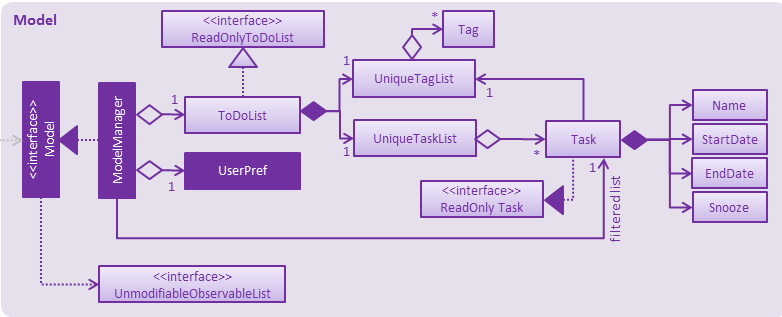
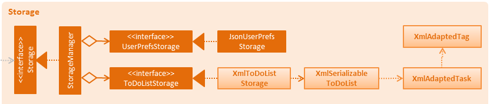

# DoMe! Developer Guide

By : `Team W15-B1`  &nbsp;&nbsp;&nbsp;&nbsp; Since: `Jan 2017`  &nbsp;&nbsp;&nbsp;&nbsp; Licence: `MIT`

---

1. [Introduction](#1-introduction)
2. [Setting Up](#2-setting-up)
3. [Design](#3-design)
4. [Implementation](#4-implementation)
5. [Testing](#5-testing)
6. [Dev Ops](#6-dev-ops)
7. [Appendices](#7-appendices)

* [Appendix A : User Stories](#appendix-a-:-user-stories)
* [Appendix B : Use Cases](#appendix-b-:-use-cases)
* [Appendix C : Non Functional Requirements](#appendix-c-:-non-functional-requirements)
* [Appendix D : Glossary](#appendix-d-:-glossary)
* [Appendix E : Product Survey](#appendix-e-:-product-survey)

## 1. Introduction

*DoMe!* is a simple todo app for users to manage their daily tasks, such as keeping track of deadlines and scheduling of events. This app is also a Java desktop application that has a GUI.

This guide describes the design and implementation of *DoMe!*. Through this guide, you will gain an understanding of how *DoMe!* works and how you can further contribute to its development.

## 2. Setting up

### 2.1. Prerequisites

1. **JDK `1.8.0_60`**  or later 

    > Having any Java 8 version is not enough.
    This app will not work with earlier versions of Java 8.

2. **Eclipse** IDE
3. **e(fx)clipse** plugin for Eclipse (Do the steps 2 onwards given in
   [this page](http://www.eclipse.org/efxclipse/install.html#for-the-ambitious))
4. **Buildship Gradle Integration** plugin from the Eclipse Marketplace
5. **Checkstyle Plug-in** plugin from the Eclipse Marketplace

### 2.2. Importing the project into Eclipse

0. Fork this repo, and clone the fork to your computer
1. Open Eclipse (Note: Ensure you have installed the **e(fx)clipse** and **buildship** plugins as given
   in the prerequisites above)
2. Click `File` > `Import`
3. Click `Gradle` > `Gradle Project` > `Next` > `Next`
4. Click `Browse`, then locate the project's directory
5. Click `Finish`

  > * If you are asked whether to 'keep' or 'overwrite' config files, choose to 'keep'.
  > * Depending on your connection speed and server load, it can even take up to 30 minutes for the set up to finish
      (This is because Gradle downloads library files from servers during the project set up process)
  > * If Eclipse auto-changed any settings files during the import process, you can discard those changes.

### 2.3. Configuring Checkstyle
1. Click `Project` -> `Properties` -> `Checkstyle` -> `Local Check Configurations` -> `New...`
2. Choose `External Configuration File` under `Type`
3. Enter an arbitrary configuration name e.g. taskmanager
4. Import checkstyle configuration file found at `config/checkstyle/checkstyle.xml`
5. Click OK once, go to the `Main` tab, use the newly imported check configuration.
6. Tick and select `files from packages`, click `Change...`, and select the `resources` package
7. Click OK twice. Rebuild project if prompted

> Note to click on the `files from packages` text after ticking in order to enable the `Change...` button

### 2.4. Troubleshooting project setup

**Problem: Eclipse reports compile errors after new commits are pulled from Git**

* Reason: Eclipse fails to recognize new files that appeared due to the Git pull.
* Solution: Refresh the project in Eclipse: 
  Right click on the project (in Eclipse package explorer), choose `Gradle` -> `Refresh Gradle Project`.

**Problem: Eclipse reports some required libraries missing**

* Reason: Required libraries may not have been downloaded during the project import.
* Solution: [Run tests using Gradle](UsingGradle.md) once (to refresh the libraries).

## 3. Design

### 3.1. Architecture

 
_Figure 3.1.1 : Architecture Diagram_

The **_Architecture Diagram_** given above explains the high-level design of the App.
Given below is a quick overview of each component.

> Tip: The `.pptx` files used to create diagrams in this document can be found in the [diagrams](diagrams/) folder.
> To update a diagram, modify the diagram in the pptx file, select the objects of the diagram, and choose `Save as picture`.

`Main` has only one class called [`MainApp`](../src/main/java/seedu/address/MainApp.java). It is responsible for,

* At app launch: Initializes the components in the correct sequence, and connects them up with each other.
* At shut down: Shuts down the components and invokes cleanup method where necessary.

[**`Commons`**](#common-classes) represents a collection of classes used by multiple other components.
Two of those classes play important roles at the architecture level.

* `EventsCenter` : This class (written using [Google's Event Bus library](https://github.com/google/guava/wiki/EventBusExplained))
  is used by components to communicate with other components using events (i.e. a form of _Event Driven_ design)
* `LogsCenter` : Used by many classes to write log messages to the App's log file.

The rest of the App consists of four components.

* [**`UI`**](#ui-component) : Shows the user interface of the application.
* [**`Logic`**](#logic-component) : Executes commands.
* [**`Model`**](#model-component) : Holds the data of the App in-memory.
* [**`Storage`**](#storage-component) : Reads data from the hard disk, and writes data to the hard disk.

Each of the four components

* Defines its _API_ in an `interface` with the same name as the Component.
* Exposes its functionality using a `{Component Name}Manager` class.

For example, the `Logic` component (see the class diagram given below) defines it's API in the `Logic.java`
interface and exposes its functionality using the `LogicManager.java` class. 
 
_Figure 3.1.2 : Class Diagram of the Logic Component_

#### Events-Driven nature of the design

The _Sequence Diagram_ below shows how the components interact for the scenario where the user issues the
command `delete 1`.

 
_Figure 3.1.3a : Component interactions for `delete 1` command (part 1)_

>Note how the `Model` simply raises a `TaskManagerChangedEvent` when the Task Manager data are changed,
 instead of asking the `Storage` to save the updates to the hard disk.

The diagram below shows how the `EventsCenter` reacts to that event, which eventually results in the updates
being saved to the hard disk and the status bar of the UI being updated to reflect the 'Last Updated' time.  
 
_Figure 3.1.3b : Component interactions for `delete 1` command (part 2)_

> Note how the event is propagated through the `EventsCenter` to the `Storage` and `UI` without `Model` having
  to be coupled to either of them. This is an example of how this Event Driven approach helps us reduce direct
  coupling between components.

The sections below give more details of each component.

### 3.2. UI component

Author: Alice Bee

 
_Figure 3.2.1 : Structure of the UI Component_

**API** : [`Ui.java`](../src/main/java/seedu/
/ui/U.java)

The UI consists of a `MainWindow` that is made up of parts e.g.`CommandBox`, `ResultDisplay`, `PersonListPanel`,
`StatusBarFooter`, `BrowserPanel` etc. All these, including the `MainWindow`, inherit from the abstract `UiPart` class.

The `UI` component uses JavaFx UI framework. The layout of these UI parts are defined in matching `.fxml` files
 that are in the `src/main/resources/view` folder. 
 For example, the layout of the [`MainWindow`](../src/main/java/seedu/address/ui/MainWindow.java) is specified in
 [`MainWindow.fxml`](../src/main/resources/view/MainWindow.fxml)

The `UI` component,

* Executes user commands using the `Logic` component.
* Binds itself to some data in the `Model` so that the UI can auto-update when data in the `Model` change.
* Responds to events raised from various parts of the App and updates the UI accordingly.

### 3.3. Logic component

Author: Bernard Choo

 
_Figure 3.3.1 : Structure of the Logic Component_

**API** : [`Logic.java`](../src/main/java/seedu/address/logic/Logic.java)

1. `Logic` uses the `Parser` class to parse the user command.
2. This results in a `Command` object which is executed by the `LogicManager`.
3. The command execution can affect the `Model` (e.g. adding a person) and/or raise events.
4. The result of the command execution is encapsulated as a `CommandResult` object which is passed back to the `Ui`.

Given below is the Sequence Diagram for interactions within the `Logic` component for the `execute("delete 1")`
 API call. 
 
_Figure 3.3.2 : Interactions Inside the Logic Component for the `delete 1` Command_

### 3.4. Model component

Author: Cynthia Dharman

 
_Figure 3.4.1 : Structure of the Model Component_

**API** : [`Model.java`](../src/main/java/seedu/address/model/Model.java)

The `Model` component,

* stores a `UserPref` object that represents the user's preferences.
* stores the Address Book data.
* exposes a `UnmodifiableObservableList<ReadOnlyPerson>` that can be 'observed' e.g. the UI can be bound to this list
  so that the UI automatically updates when the data in the list change.
* depends on none of the other three components.

### 3.5. Storage component

Author: Darius Foong

 
_Figure 3.5.1 : Structure of the Storage Component_

**API** : [`Storage.java`](../src/main/java/seedu/address/storage/Storage.java)

The `Storage` component,

* saves `UserPref` objects in json format and read it back.
* saves the Address Book data in xml format and read it back.

### 3.6. Common classes

Classes used by multiple components are in the `seedu.taskmanager.commons` package.

## 4. Implementation

### 4.1. Logging

We are using `java.util.logging` package for logging. The `LogsCenter` class is used to manage the logging levels
and logging destinations.

* The logging level can be controlled using the `logLevel` setting in the configuration file
  (See [Configuration](#configuration))
* The `Logger` for a class can be obtained using `LogsCenter.getLogger(Class)` which will log messages according to
  the specified logging level
* Currently log messages are output through: `Console` and to a `.log` file.

**Logging Levels**

* `SEVERE` : Critical problem detected which may possibly cause the termination of the application
* `WARNING` : Caution advised if the application were to continue
* `INFO` : Information showing the noteworthy actions by the App
* `FINE` : Details that is not usually noteworthy but may be useful in debugging
  e.g. print the actual list instead of just its size

### 4.2. Configuration

Certain properties of the application can be controlled (e.g App name, logging level) through the configuration file
(default: `config.json`):

## 5. Testing

Tests can be found in the `./src/test/java` folder.

**In Eclipse**:

* To run all tests, right-click on the `src/test/java` folder and choose
  `Run as` > `JUnit Test`
* To run a subset of tests, you can right-click on a test package, test class, or a test and choose
  to run as a JUnit test.

**Using Gradle**:

* See [UsingGradle.md](UsingGradle.md) for how to run tests using Gradle.

We have two types of tests:

1. **GUI Tests** - These are _System Tests_ that test the entire App by simulating user actions on the GUI.
   These are in the `guitests` package.

2. **Non-GUI Tests** - These are tests not involving the GUI. They include,
   1. _Unit tests_ targeting the lowest level methods/classes.  
      e.g. `seedu.address.commons.UrlUtilTest`
   2. _Integration tests_ that are checking the integration of multiple code units
     (those code units are assumed to be working). 
      e.g. `seedu.address.storage.StorageManagerTest`
   3. Hybrids of unit and integration tests. These test are checking multiple code units as well as
      how the are connected together. 
      e.g. `seedu.address.logic.LogicManagerTest`

#### Headless GUI Testing
Thanks to the [TestFX](https://github.com/TestFX/TestFX) library we use,
 our GUI tests can be run in the _headless_ mode.
 In the headless mode, GUI tests do not show up on the screen.
 That means the developer can do other things on the Computer while the tests are running. 
 See [UsingGradle.md](UsingGradle.md#running-tests) to learn how to run tests in headless mode.

### 5.1. Troubleshooting tests

 **Problem: Tests fail because NullPointException when AssertionError is expected**

 * Reason: Assertions are not enabled for JUnit tests.
   This can happen if you are not using a recent Eclipse version (i.e. _Neon_ or later)
 * Solution: Enable assertions in JUnit tests as described
   [here](http://stackoverflow.com/questions/2522897/eclipse-junit-ea-vm-option).  
   Delete run configurations created when you ran tests earlier.

## 6. Dev Ops

### 6.1. Build Automation

See [UsingGradle.md](UsingGradle.md) to learn how to use Gradle for build automation.

### 6.2. Continuous Integration

We use [Travis CI](https://travis-ci.org/) and [AppVeyor](https://www.appveyor.com/) to perform _Continuous Integration_ on our projects.
See [UsingTravis.md](UsingTravis.md) and [UsingAppVeyor.md](UsingAppVeyor.md) for more details.

### 6.3. Publishing Documentation

See [UsingGithubPages.md](UsingGithubPages.md) to learn how to use GitHub Pages to publish documentation to the
project site.

### 6.4. Making a Release

Here are the steps to create a new release.

 1. Generate a JAR file [using Gradle](UsingGradle.md#creating-the-jar-file).
 2. Tag the repository with the version number. e.g. `v0.1`
 2. [Create a new release using GitHub](https://help.github.com/articles/creating-releases/)
    and upload the JAR file you created.

### 6.5. Converting Documentation to PDF format

We use [Google Chrome](https://www.google.com/chrome/browser/desktop/) for converting documentation to PDF format,
as Chrome's PDF engine preserves hyperlinks used in webpages.

Here are the steps to convert the project documentation files to PDF format.

 1. Make sure you have set up GitHub Pages as described in [UsingGithubPages.md](UsingGithubPages.md#setting-up).
 1. Using Chrome, go to the [GitHub Pages version](UsingGithubPages.md#viewing-the-project-site) of the
    documentation file.  
    e.g. For [UserGuide.md](UserGuide.md), the URL will be `https://<your-username-or-organization-name>.github.io/taskmanager-level4/docs/UserGuide.html`.
 1. Click on the `Print` option in Chrome's menu.
 1. Set the destination to `Save as PDF`, then click `Save` to save a copy of the file in PDF format.  
    For best results, use the settings indicated in the screenshot below.  
     
    _Figure 5.4.1 : Saving documentation as PDF files in Chrome_

### 6.6. Managing Dependencies

A project often depends on third-party libraries. For example, Address Book depends on the
[Jackson library](http://wiki.fasterxml.com/JacksonHome) for XML parsing. Managing these _dependencies_
can be automated using Gradle. For example, Gradle can download the dependencies automatically, which
is better than these alternatives. 
a. Include those libraries in the repo (this bloats the repo size) 
b. Require developers to download those libraries manually (this creates extra work for developers) 

## 7. Appendices

### Appendix A : User Stories

Priorities: High (must have) - `* * *`, Medium (nice to have)  - `* *`,  Low (unlikely to have) - `*`

| Priority | As a ... | I want to ... | So that I can...|
| :-------- | :-------- | :--------- | :-----------|
|`***`|New User|view instructions|read documentation on how to use the program|
|`***`|User|add task|keep track of things to do|
|`***`|User|edit task|correct or revise the task name and its details|
|`***`|User|write a description about a task|keep track of my progress|
|`***`|User|add tags to task|be able to group tasks under a category|
|`***`|User|complete task|update my progress|
|`***`|User|delete a task|remove tasks I no longer want to keep track of|
|`***`|User|view incomplete tasks|keep track of what I still need to do|
|`***`|User|view complete tasks|keep track of tasks I have completed|
|`***`|User|view upcoming deadlines|keep track of my deadlines|
|`***`|User|view overdue tasks|know which tasks to prioritise finishing|
|`***`|User|view task progress|keep track of my progress|
|`***`|User|search for keyword|search for a task by keywords|
|`***`|User|undo previous command|revert accidental changes|
|`***`|User|redo command|execute previously undone commands|
|`***`|User|choose location to store save data|adjust application according to my needs|
|`**`|User|change UI theme|customise the application|
|`**`|User|be alerted of conflicting tasks|avoid duplicates|
|`**`|User|have a relevant link for my task|keep track of the task details|

### Appendix B : Use Cases

(For all use cases below, the **System** is the `TaskManager`)

| Use Case | Description |
|-----|-----|
|[Display help](#use-case-display-help)|Displays a list of possible instructions|
|[Add task](#use-case-add-task)|Adds a task to the todo list. The task may have a concrete or floating time. Including tags at the end of the task is optional|
|[Edit task](#use-case-edit-task)|Access a particular task and make changes|
|[Describe task](#use-case-describe-task)|Write a description for a particular task|
|[Add tags to created task](#use-case-add-tags-to-created-task)|Adds one or more tags to a task to label it|
|[Mark task as complete](#use-case-complete-task)|Marks a task done by its name|
|[Delete task](#use-case-delete-task)|Removes a task from the todo list|
|[View incomplete tasks](#use-case-list-uncompleted-tasks)| Lists all uncompleted tasks|
|[View completed tasks](#use-case-list-completed-tasks)| Lists all completed tasks|
|[View overdue tasks](#use-case-view-overdue-tasks)|Displays a list of tasks that are overdue|
|[View progress](#use-case-show-task-progress-report)|Displays the current statistics on how many tasks have been added, completed, and pending completion|
|[Search](#use-case-search)|Displays a list of tasks with matching keywords as queried|
|[Undo previous command](#use-case-undo-previous-command)|Undoes the previous command|
|[Redo previous command](#use-case-redo-previous-command)|Redo the previously undone command|
|[Customize file storing](#use-case-customize-file-storing)|Sets a custom location for where to save the data|
|[Change UI theme](#use-case-change-ui-theme)|Changes the theme of user interface|
|[Duplicates detection](#use-case-duplicates-detection)|Detects same name and send warning|
|[Attach links](#use-case-attach-links)|Attaches links to a task|

---

#### Use Case: Display Help
##### Main Success Scenario:

1. User requests to display help.
2. System displays the help messages.
3. Use case ends.

##### Extensions

1a. User entered an invalid command.
> 1a1. System displays help messages.
> 1a2. Use case ends.

---

#### Use Case: Add Task
##### Main Success Scenario:

1. User requests to add a task.
2. System accepts the task.
3. Use case ends.

##### Extensions

1a. User entered an invalid command.

> 1a1. System display unsuccessful message.
> 1a2. Use case ends.

---

#### Use case: Edit Task
##### Main Success Scenario:
1. User requests to list uncompleted tasks.
2. System displays uncompleted tasks.
3. User edits a task.
4. System saves the edits.
5. Use case ends.

##### Extensions
2a. There is no list.
> 2a1. Use case ends.

3a. The given index is invalid.
> 3a1. System gives an error message.
> 3a2. Use case resumes at step 2.

---

#### Use case: Describe Task
##### Main Success Scenario:
1. User requests to list tasks.
2. System displays tasks and their details.
3. User write description for a task.
4. System saves the new description.
5. System updates the UI accordingly.
6. Use case ends.

##### Extensions
2a. There is no list.
> 2a1. Use case ends.

3a. The given index is invalid.
> 3a1. System gives an error message.
> 3a2. Use case resumes at step 2.

3b. The description given by the user is blank
> 3b1. Use case ends.

---

#### Use case: Add Tags to Created Task
##### Main Success Scenario:
1. User requests to list tasks.
2. System shows a list of tasks.
3. User requests to add tags to a specific task in the list.
4. System adds the tags and displays the task.
5. Use case ends.

##### Extensions
2a. There is no list.
> 2a1. Use case ends.

3a. The given index is invalid.
> 3a1. System gives an error message.
> 3a2. Use case resumes at step 2.

---

#### Use Case: Complete Task
##### Main Success Scenario:

1. User requests to list tasks.
2. System displays tasks.
3. User selects a task based on its task number and marks it as completed.
4. System marks the task as completed.
5. Use case ends.

##### Extension
2a. There is no list.
> Use case ends.

3a. The task has already been completed.
> 3a1. System shows error message that the task has already been completed.
> 3a2. Use case ends.

3b. The provided task number does not exist.
> 3b1. System shows error message that the task number does not exist.
> 3b2. Use case ends.

---

#### Use case: Delete Task
##### Main Success Scenario:
1. User requests to list tasks.
2. System displays tasks.
3. User deletes a task by its index.
4. System displays new list without the deleted task.
5. Use case ends.

##### Extensions
2a. There is no list.
> Use case ends.

3a. The given index is invalid.
> 3a1. System gives an error message.
Use case resumes at step 2.

---

#### Use case: View Incomplete Tasks
##### Main Success Scenario:
1. User requests for list of uncompleted tasks.
2. System display list of uncompleted task.
3. Use case ends.

##### Extensions
2a. No uncompleted tasks
> 2a1. System displays no uncompleted tasks.
> 2a2. Use case ends.

---

#### Use case: View Completed Tasks
##### Main Success Scenario:
1. User requests for list of completed tasks.
2. System display list of completed task.
3. Use case ends.

##### Extensions
2a. No completed tasks
> 2a1. System displays no completed tasks.
> 2a2. Use case ends.

---

#### Use case: View Overdue Tasks
##### Main Success Scenario:
1. User requests for a list of overdue tasks.2. System shows a list of tasks that are overdue.
3. Use case ends.

---

#### Use case: View progress
##### Main Success Scenario:
1. User requests for a report of his/her completed tasks, overdue tasks and upcoming tasks.
2. System shows a report of the user's completed tasks, overdue tasks and upcoming tasks.
3. Use case ends.

##### Extension
2a. The list is empty.
> 2a1. Use case ends.

---

#### Use case: Search
##### Main Success Scenario:

1. User requests for a list of tasks that have matching keywords typed in.
2. System shows a list of tasks that have the matching keywords. 
3. Use case ends. 

---

#### Use case: Undo Previous Command
##### Main Success Scenario:
1. User requests to undo a previous command that mutates the data.
2. System undo the last command that mutates the data. 
3. System prints the command that was undone on the feedback box.
4. Use case ends.

##### Extensions
2. There is nothing to undo.
> 2a1. Use case ends.

---

#### Use case: Redo Previous Command
##### Main Success Scenario:
1. User requests to execute a previous command that was undone.
2. System execute the last command that was undone. 
3. System prints the command that was redone on the feedback box.
4. Use case ends.

##### Extensions
2. There is no command to redo.
> 2a1. Use case ends. 

---

#### Use case: Customize File Storing
##### Main Success Scenario:
1. User requests to store data in the specified file instead of the default storing location.
2. System transfer all data to the specified file.
3. System shows success message.
4. Use case ends.

##### Extension
1a. Specified file does not exist
> 1a1. System shows error message that specified file does not exist.
> 1a2. Use case ends.

1b. Specified file is not a .txt file
> 1b1. System shows error message that specified file's format is not valid.
> 1b2. Use case ends.

---

#### Use case: Change UI Theme
##### Main Success Scenario:
1. User requests to change theme.
2. System prompts user to select a new theme from list.
3. User selects theme from list.
4. System changes the theme.
5. Use case ends.

---

#### Use case: Duplicates Detection
##### Main Success Scenario:
1. User requests to add a new task.
2. System detects same name and display message.
3. User changes the task name.
4. System adds task.
5. Use case ends.

##### Extensions
3. Same name, start time and end time detected again.
> 3a1. Go back to 2.

---

#### Use case: Attach Links
##### Main Success Scenario:
1. User inputs a link and requests for it to be attached to a task corresponding to the input task number.
2. System attach the specified link to the specified task.
3. System shows success message.
4. Use case ends.

##### Extension
1a. The provided link is of invalid format.
> 1a1. System shows error message that the link is of invalid format.
> 1a2. Use case ends.

1b. The provided task number does not exist.
> 1b1. System shows error message that the task number does not exist.
> 1b2. Use case ends.

---

### Appendix C : Non Functional Requirements

1. Should work on any [mainstream OS](#mainstream-os) as long as it has Java `1.8.0_60` or higher installed.
2. Should be able to hold up to 1000 persons without a noticeable sluggishness in performance for typical usage.
3. A user with above average typing speed for regular English text (i.e. not code, not system admin commands)
   should be able to accomplish most of the tasks faster using commands than using the mouse.

{More to be added}

---
### Appendix D : Glossary

##### Mainstream OS

> > Windows, Linux, Unix, OS-X

---
### Appendix E : Product Survey

**Reminders** (surveyed by Ng Shao Hui)

> Pros:
> * Simple and intuitive interface
> * Syncs across Apple devices
> * Desktop version available

> Cons:
> * Only available on iOS
> * Lacks collaborative features
> * Unable to customise

**Todoist** (surveyed by Low Tian Wei)

> Pros:
> * Ubiquitous, available in many platforms
> * Relatively cheap compared to other devices
> * Extremely user-friendly
> * Sends motivational messages

> Cons:
> * Good functions are premium and user has to pay
> * Search function limited in free plan
> * Not available in Windows except for Windows 10

**Cozi Family Organiser** (surveyed by Gng Jia Hui)

> Pros:
> * Many relevant categories like Upcoming Events, Groceries and Calendar
> * Easy to collaborate with other family members
> * Easily updated from mobile phone or computer
> * Available in iTunes and Google Play

> Cons:
> * Requires a working Internet connection
> * Some categories like Birthdays are only available in the premium version
> * Calendar cannot be synced to Google Calendar

**Evernote** (surveyed by Ng Shao Hui)

> Pros:
> * Able to store multiple lists under different headings
> * Desktop version available
> * Can add tags to a task
> * Flexibility in items that can be added, such as images and web clippings

> Cons:
> * Need to pay to access app over more than 2 devices
> * No calendar view

**Wunderlist** (surveyed by Ng Shao Hui)
> Pros:
> * Cross platform
> * Desktop version available
> * Simple to use
> * Able to share the lists

> Cons:
> * Unable to repeat tasks
> * Unable to add subtasks

**Remember The Milk** (surveyed by Le Minh Phuc)
> Pros:
> * Is essentially a CLI app modified to be more interactive using tags
> * Has desktop version
> * Has an email-like interface, which is familiar and easy to use
> * Has a pleasant blue colour theme
> * Allows the more tech-savy user to set keyboard shortcut
> * Allows tasks to be repeated

> Cons:
> * Does not allow the user to divide a task into smaller subtasks
> * Does not allow the user to attach links/files to a task
