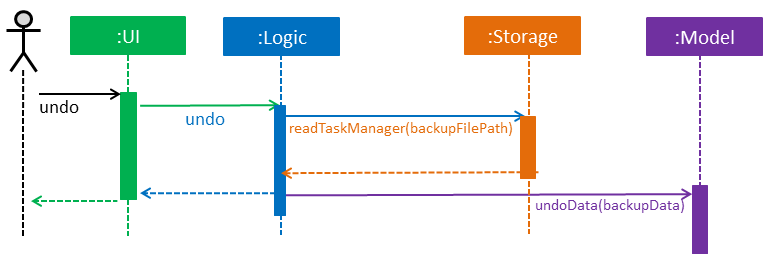

# KIT Developer Guide:

1. [Setting Up](#1-setting-up)
2. [Design](#2-design)
3. [Implementation](#3-implementation)
4. [Testing](#4-testing)
5. [Dev Ops](#5dev-ops)

* [Appendix A: User Stories](#appendix-a--user-stories)
* [Appendix B: Use Cases](#appendix-b--use-cases)
* [Appendix C: Non Functional Requirements](#appendix-c--non-functional-requirements)
* [Appendix D: Glossary](#appendix-d--glossary)
* [Appendix E : Product Survey](#appendix-e--product-survey)

## 1. Setting up

### 1.1. Prerequisites

1. **JDK `1.8.0_60`**  or later 

    > Having any Java 8 version is not enough.  
    This app will not work with earlier versions of Java 8.

2. **Eclipse** IDE
3. **e(fx)clipse** plugin for Eclipse (Do the steps 2 onwards given in
   [this page](http://www.eclipse.org/efxclipse/install.html#for-the-ambitious))
4. **Buildship Gradle Integration** plugin from the Eclipse Marketplace
5. **Checkstyle Plug-in** plugin from the Eclipse Marketplace

### 1.2. Importing the project into Eclipse

0. Fork this repo, and clone the fork to your computer
1. Open Eclipse (Note: Ensure you have installed the **e(fx)clipse** and **buildship** plugins as given
   in the prerequisites above)
2. Click `File` > `Import`
3. Click `Gradle` > `Gradle Project` > `Next` > `Next`
4. Click `Browse`, then locate the project's directory
5. Click `Finish`

  > * If you are asked whether to 'keep' or 'overwrite' config files, choose to 'keep'.
  > * Depending on your connection speed and server load, it can even take up to 30 minutes for the set up to finish
      (This is because Gradle downloads library files from servers during the project set up process)
  > * If Eclipse auto-changed any settings files during the import process, you can discard those changes.

### 1.3. Configuring Checkstyle
1. Click `Project` -> `Properties` -> `Checkstyle` -> `Local Check Configurations` -> `New...`
2. Choose `External Configuration File` under `Type`
3. Enter an arbitrary configuration name e.g. taskmanager
4. Import checkstyle configuration file found at `config/checkstyle/checkstyle.xml`
5. Click OK once, go to the `Main` tab, use the newly imported check configuration.
6. Tick and select `files from packages`, click `Change...`, and select the `resources` package
7. Click OK twice. Rebuild project if prompted

> Note to click on the `files from packages` text after ticking in order to enable the `Change...` button

### 1.4. Troubleshooting project setup

**Problem: Eclipse reports compile errors after new commits are pulled from Git**

* Reason: Eclipse fails to recognize new files that appeared due to the Git pull.
* Solution: Refresh the project in Eclipse: 
  Right click on the project (in Eclipse package explorer), choose `Gradle` -> `Refresh Gradle Project`.

**Problem: Eclipse reports some required libraries missing**

* Reason: Required libraries may not have been downloaded during the project import.
* Solution: [Run tests using Gradle](UsingGradle.md) once (to refresh the libraries).

## 2. Design

### 2.1. Architecture

 
_Figure 2.1.1 : Architecture Diagram_

The **_Architecture Diagram_** given above explains the high-level design of the App.
Given below is a quick overview of each component.

> Tip: The `.pptx` files used to create diagrams in this document can be found in the [diagrams](diagrams/) folder.
> To update a diagram, modify the diagram in the pptx file, select the objects of the diagram, and choose `Save as picture`.

`Main` has only one class called [`MainApp`](../src/main/java/seedu/task/MainApp.java). It is responsible for,

* At app launch: Initializes the components in the correct sequence, and connects them up with each other.
* At shut down: Shuts down the components and invokes cleanup method where necessary.

[**`Commons`**](#common-classes) represents a collection of classes used by multiple other components.
Two of those classes play important roles at the architecture level.

* `EventsCenter` : This class (written using [Google's Event Bus library](https://github.com/google/guava/wiki/EventBusExplained))
  is used by components to communicate with other components using events (i.e. a form of _Event Driven_ design)
* `LogsCenter` : Used by many classes to write log messages to the App's log file.

The rest of the App consists of four components.

* [**`UI`**](#ui-component) : The UI of the App.
* [**`Logic`**](#logic-component) : The command executor.
* [**`Model`**](#model-component) : Holds the data of the App in-memory.
* [**`Storage`**](#storage-component) : Reads data from, and writes data to, the hard disk.

Each of the four components

* Defines its _API_ in an `interface` with the same name as the Component.
* Exposes its functionality using a `{Component Name}Manager` class.

For example, the `Logic` component (see the class diagram given below) defines it's API in the `Logic.java`
interface and exposes its functionality using the `LogicManager.java` class. 
 
_Figure 2.1.2 : Class Diagram of the Logic Component_

#### Events-Driven nature of the design

The _Sequence Diagram_ below shows how the components interact for the scenario where the user issues the
command `done 1`.

 
_Figure 2.1.3a : Component interactions for `done 1` command (part 1)_

>Note how the `Model` simply raises a `TaskManagerChangedEvent` when the Task Manager data are changed,
 instead of asking the `Storage` to save the updates to the hard disk.

The diagram below shows how the `EventsCenter` reacts to that event, which eventually results in the updates
being saved to the hard disk and the status bar of the UI being updated to reflect the 'Last Updated' time.  
 
_Figure 2.1.3b : Component interactions for `done 1` command (part 2)_

> Note how the event is propagated through the `EventsCenter` to the `Storage` and `UI` without `Model` having
  to be coupled to either of them. This is an example of how this Event Driven approach helps us reduce direct
  coupling between components.

The sections below give more details of each component.

### 2.2. UI component

Author: Walter Tay

 
_Figure 2.2.1 : Structure of the UI Component_

**API** : [`Ui.java`](../src/main/java/seedu/task/ui/Ui.java)

The UI consists of a `MainWindow` that is made up of parts e.g.`CommandBox`, `ResultDisplay`, `TaskListPanel`,
`StatusBarFooter`, `BrowserPanel` etc. All these, including the `MainWindow`, inherit from the abstract `UiPart` class.

The `UI` component uses JavaFx UI framework. The layout of these UI parts are defined in matching `.fxml` files
 that are in the `src/main/resources/view` folder. 
 For example, the layout of the [`MainWindow`](../src/main/java/seedu/task/ui/MainWindow.java) is specified in
 [`MainWindow.fxml`](../src/main/resources/view/MainWindow.fxml)

The `UI` component,

* Executes user commands using the `Logic` component.
* Binds itself to some data in the `Model` so that the UI can auto-update when data in the `Model` change.
* Responds to events raised from various parts of the App and updates the UI accordingly.

### 2.3. Logic component

Author: Xu Xinyi

 
_Figure 2.3.1 : Structure of the Logic Component_

**API** : [`Logic.java`](../src/main/java/seedu/task/logic/Logic.java)

1. `Logic` uses the `Parser` class to parse the user command.
2. `Parser` will in turn check the `Command Library` to formulate the correct command, with which it then creates a `Command` object.
3. The `Command` object is executed by the `LogicManager`.
4. The command execution can affect the `Model` (e.g. adding a task) and/or raise events.
5. The result of the command execution is encapsulated as a `CommandResult` object which is passed back to the `Ui`.

Given below is the Sequence Diagram for interactions within the `Logic` component for the `execute("delete 1")`
 API call. 
 
_Figure 2.3.1 : Interactions Inside the Logic Component for the `delete 1` Command_

1. The `LogicManager` receives `execute("done 1")`.
2. It passes this command text (as a string) to `Parser`.
3. `Parser` checks it against `CommandLibrary`.
4. `Parser` formulates a done command and sends it to `DoneCommandParser`.
5. `DoneCommandParser` creates the corresponding command and returns it.
6. The `LogicManager` exectes the returned delete command, accessing `Model`, and then returns the `CommandResult` back to `UI`.

#### Implemenation of `CommandLibrary` class:

This class serves as an intermediate between the `Parser` class and other utility classes like `CliSyntax`, threreby decreasing the **coupling** between `Parser` and these utility classes.

The `CommandLibrary` class is implemented using the **singleton pattern** as one instance is sufficient and such practice prevents the program from creating too many unnucessary instances.

#### Rationale behind various `Command` classes:

KIT can accept various commands and correctly execute them by having different command classes such as `AddCommand`, `UndoCommand` and `ListByTagCommand`, each of which dedicated to handle specific instructions. Such practice allows KIT to have higher **cohesion**.

### 2.4. Model component

Author: Chan Lup Seng

 
_Figure 2.4.1 : Structure of the Model Component_

**API** : [`Model.java`](../src/main/java/seedu/task/model/Model.java)

The `Model`,

* stores a `UserPref` object that represents the user's preferences.
* stores the Task Manager data.
* exposes a `UnmodifiableObservableList<ReadOnlyTask>` that can be 'observed' e.g. the UI can be bound to this list
  so that the UI automatically updates when the data in the list change.
* does not depend on any of the other three components.

## Task Object
This section briefly describes the design of the task object.

 

The task object represents a task in KIT. Each of its detail such as Name and Date are objects.

This clean design allows us to do the verification of each value and specify the desired regex for each detail easily.

Task only verifies that startDate is before endDate and lets each individual class do their own verification. isDone represents whether a task is completed or not. As it's function is simple we do not create unnecessary objects.

**Pretty Time**

To implement natural language date parsing we incorporated [pretty time library](http://www.ocpsoft.org/prettytime/), an open source, date formatting library.

We are using it to parse user input and obtain the the date in java.util.Date format. We also use it for the display of time in a more friendly manner such as:

> "10 minutes from now" or "2 days from now"

### 2.5. Storage component

Author: Zhang Ying

 
_Figure 2.5.1 : Structure of the Storage Component_

**API** : [`Storage.java`](../src/main/java/seedu/task/storage/Storage.java)

The `Storage` component,

* can save `Config` objects in json format and read it back.
* can save `UserPref` objects in json format and read it back.
* can save the Task Manager data in xml format and read it back.

This class is called by other components such as `Model` to assist it in saving and loading the tasks from .xml files. The StorageManager class managers any changes in the storage through its implementation of `TaskManagerStorage` and `UserPrefsStorage` for when the Model class requires a change in the task manager's model. For example, when saving the file to a new directory, `ModelManager` would raise a new save file event which will be handled by `StorageManager` which relies on methods from sub-components  in `Storage` like `JsonUserPrefsStorage` and `XmlTaskManagerStorage`.

### 2.6. Common classes

Author: Zhang Ying

Classes used by multiple components are in the `seedu.task.commons` package.

They are further divided into sub-groups like `core`, `events`, `exceptions` and `util`.

* `Core` contains core classes that are used by multiple components. They include `ComponentManager`, `Config`, `EventsCenter`, `GuiSettings`, `LogsCentre`, `Messages`, `UnmodifiableObservableList` and `Version`. For example, in the save and handle command, the storage component would need to call the `Config` class to edit information in the config.json file.
* `Events` contains event classes that are raised whenever required. The subsequent classes would subscribe and catch these events whenever neccessary and carry out the changes.
* `Exceptions` contains exception classes which are thrown in various other components in the program
* `Util` contains utilities that other components might require when carrying out certain tasks. For example, in the `JsonUtil`, it simplifies the job of reading json files as we can simply call the functions inside of it.

## 3. Implementation

### 3.1. Logging

We are using `java.util.logging` package for logging. The `LogsCenter` class is used to manage the logging levels
and logging destinations.

* The logging level can be controlled using the `logLevel` setting in the configuration file
  (See [Configuration](#configuration))
* The `Logger` for a class can be obtained using `LogsCenter.getLogger(Class)` which will log messages according to
  the specified logging level
* Currently log messages are output through: `Console` and to a `.log` file.

**Logging Levels**

* `SEVERE` : Critical problem detected which may possibly cause the termination of the application
* `WARNING` : Can continue, but with caution
* `INFO` : Information showing the noteworthy actions by the App
* `FINE` : Details that is not usually noteworthy but may be useful in debugging
  e.g. print the actual list instead of just its size

### 3.2. Configuration

Certain properties of the application can be controlled (e.g App name, logging level) through the configuration file
(default: `config.json`):

### 3.3. Undo/Redo Command Implementation

This section describes the design process and implementation of undo/redo feature in KIT.

**Function of Undo**

* It should revert any command that modifies the data.
* It should revert add, edit, delete and clear commands but ignores list, listtag, listnotdone commands.
* For example, if a list command is issued after an add, undo should revert the add command and ignore list command.

**Designs Considered**

One of the design we considered for undo involves the Command pattern. The idea is to have a History class that stores a stack of Commands executed. Each Command will have an undo method that handles the undo for itself. For example, delete will remember the deleted task and the undo method will add it back.

When undo command is called, it can obtain the latest command from History and invoke it's undo method. An undo call is simple with this design, however each current Command and every new Command needs it's own individual implementation of undo method.

The alternate design, which was implemented, involves storing a backup file. This makes use of how every command that modifies data will invoke an automatic save to kit.xml. Before the data is saved, a backup is saved. Undo command now simply loads the backup into memory. Future commands can also support undo easily as they do not need to implmennt any new methods.

The downside is the extra storage space used. To reduce the downside, the backup file is deleted everytime the program closes. The backup file thus functions as a temporary file.

**Implementation Details**

1. Every command that modifies data raises a `TaskManagerChangedEvent` containing the TaskManager's data and a boolean flag indicating if a backup.xml should be saved.
2. Storage listens to this event, check if a backup is needed and carry out the saving to xml file. Commands that will not backup are command such as list and find commands etc. Undo itself will not create a backup.
3. When undo command is issued, storage reads backup.xml and undo pass the data to model to load it into memory.

**Future Improvements**

Currently only one undo is implemented. Multiple undo and redo implementation are planned.

### 3.4 Done/Undone task command implementation

This sections describes the done/undone implementation in KIT.

All added task will be set to undone as a default setting. By using the done command it will update the selected task to done. This allows the user indicate if his task is done or undone. It also allow the sorting of task by done/undone to provide the user a better view of the outstanding task.

One of the design considering being implemented for this specific command is that rather than making a new class under Model/task, we created a boolean method inside the task class. True being that the task is done and false being that the task is undone. This allows us avoid implmenting unnecessary classes thereby improving the efficency of our code. Done and undone command works in similar ways.

### 3.5 Save/Load file command implementation

This section describes the save/load implementation in KIT.

**Function of save**

* Makes a copy of the .xml file in specified directory
* Creates a new .xml file specified in the folder
* Prompts user if the file they are saving to already exists and whether they would like to overwrite it with the new data
* Once saved to a new file, any changes made would be done on the newly saved file
* File status would be updated in the status bar footer

**Implementation details**

The initial save location would be in `data/kit.xml` file. To manually change the save location, we can edit `config.json` in a text editor and overwrite the `taskManagerFilePath` parameter. In the save command, whenever the user specifies a new location, the `Logic` component checks if the file is valid (i.e. not a directory) and if the file already exists. If the file with the same name exists, it will prompt the user whether they would like to overwrite it with the new data.

**Function of load**

* Loads the .xml file from a specified file
* Any changes made would be done to the current loaded file
* File status would be updated in the status bar footer

**Implementation details**

The load location by default would be `data/kit.xml` unless specified by the user previously. If the user had loaded a file in a different directory and closed the program, when they restart the program, it will still load from the file where they last loaded the data.

## 4. Testing

Tests can be found in the `./src/test/java` folder.

**In Eclipse**:

* To run all tests, right-click on the `src/test/java` folder and choose
  `Run as` > `JUnit Test`
* To run a subset of tests, you can right-click on a test package, test class, or a test and choose
  to run as a JUnit test.

**Using Gradle**:

* See [UsingGradle.md](UsingGradle.md) for how to run tests using Gradle.

We have two types of tests:

1. **GUI Tests** - These are _System Tests_ that test the entire App by simulating user actions on the GUI.
   These are in the `guitests` package.

2. **Non-GUI Tests** - These are tests not involving the GUI. They include,
   1. _Unit tests_ targeting the lowest level methods/classes.  
      e.g. `seedu.task.commons.UrlUtilTest`
   2. _Integration tests_ that are checking the integration of multiple code units
     (those code units are assumed to be working). 
      e.g. `seedu.task.storage.StorageManagerTest`
   3. Hybrids of unit and integration tests. These test are checking multiple code units as well as
      how the are connected together. 
      e.g. `seedu.task.logic.LogicManagerTest`

#### Headless GUI Testing
Thanks to the [TestFX](https://github.com/TestFX/TestFX) library we use,
 our GUI tests can be run in the _headless_ mode.
 In the headless mode, GUI tests do not show up on the screen.
 That means the developer can do other things on the Computer while the tests are running. 
 See [UsingGradle.md](UsingGradle.md#running-tests) to learn how to run tests in headless mode.

### 4.1. Troubleshooting tests

 **Problem: Tests fail because NullPointException when AssertionError is expected**

 * Reason: Assertions are not enabled for JUnit tests.
   This can happen if you are not using a recent Eclipse version (i.e. _Neon_ or later)
 * Solution: Enable assertions in JUnit tests as described
   [here](http://stackoverflow.com/questions/2522897/eclipse-junit-ea-vm-option).  
   Delete run configurations created when you ran tests earlier.

## 5. Dev Ops

### 5.1. Build Automation

See [UsingGradle.md](UsingGradle.md) to learn how to use Gradle for build automation.

### 5.2. Continuous Integration

We use [Travis CI](https://travis-ci.org/) and [AppVeyor](https://www.appveyor.com/) to perform _Continuous Integration_ on our projects.
See [UsingTravis.md](UsingTravis.md) and [UsingAppVeyor.md](UsingAppVeyor.md) for more details.

### 5.3. Publishing Documentation

See [UsingGithubPages.md](UsingGithubPages.md) to learn how to use GitHub Pages to publish documentation to the
project site.

### 5.4. Making a Release

Here are the steps to create a new release.

 1. Generate a JAR file [using Gradle](UsingGradle.md#creating-the-jar-file).
 2. Tag the repo with the version number. e.g. `v0.1`
 2. [Create a new release using GitHub](https://help.github.com/articles/creating-releases/)
    and upload the JAR file you created.

### 5.5. Converting Documentation to PDF format

We use [Google Chrome](https://www.google.com/chrome/browser/desktop/) for converting documentation to PDF format,
as Chrome's PDF engine preserves hyperlinks used in webpages.

Here are the steps to convert the project documentation files to PDF format.

 1. Make sure you have set up GitHub Pages as described in [UsingGithubPages.md](UsingGithubPages.md#setting-up).
 1. Using Chrome, go to the [GitHub Pages version](UsingGithubPages.md#viewing-the-project-site) of the
    documentation file.  
    e.g. For [UserGuide.md](UserGuide.md), the URL will be `https://<your-username-or-organization-name>.github.io/addressbook-level4/docs/UserGuide.html`.
 1. Click on the `Print` option in Chrome's menu.
 1. Set the destination to `Save as PDF`, then click `Save` to save a copy of the file in PDF format.  
    For best results, use the settings indicated in the screenshot below.  
     
    _Figure 5.4.1 : Saving documentation as PDF files in Chrome_

### 5.6. Managing Dependencies

A project often depends on third-party libraries. For example, Task Manager depends on the
[Jackson library](http://wiki.fasterxml.com/JacksonHome) for XML parsing. Managing these _dependencies_
can be automated using Gradle. For example, Gradle can download the dependencies automatically, which
is better than these alternatives. 
a. Include those libraries in the repo (this bloats the repo size) 
b. Require developers to download those libraries manually (this creates extra work for developers) 

## Appendix A : User Stories

Priorities: High (must have) - `* * *`, Medium (nice to have)  - `* *`,  Low (unlikely to have) - `*`

| Priority | As a user I want to ... | So that I can...
| -------- | :-------- | :---------
| `* * *` | see usage instructions | know how to use the commands
| `* * *` | add a new task without deadlines | plan for the future
| `* * *` | add a new task with deadline | know when my task is due
| `* * *` | add a new task with start and end time | fit it into my calendar
| `* * *` | delete a task | remove task that I no longer need
| `* * *` | edit a task | make changes or edit mistakes
| `* * *` | undo a command | undo a mistake
| `* * *` | search for a task | find a task with only few keywords
| `* * *` | mark a task as done | keep track of tasks that are done
| `* * *` | see task by done and not done | keep track of task that are not done
| `* * *` | list task by specific tag | only see task that under a certain tag
| `* * *` | use short form for common commands | have flexibility when i use the app, type faster
| `* * *` | specify folder for data storage | choose where i want to save my info
| `* *` | sort tasks by name | locate a task easily
| `* *` | use hotkeys for commands | do things faster
| `* *` | get feedback for my commands | know if a command is successful or system has hanged
| `* *` | save my task to google calendar | see them on google calendar
| `* *` | get the app to help me find a slot for a task | find a suitable time easily
| `* *` | block multiple slots | block slots when timing of a task is uncertain
| `* *` | list task in sorted order | plan my time
| `* *` | list task by due date | see which task are most urgent
| `* *` | mark a task as not done | undone a done task

## Appendix B : Use Cases
(For all use cases below, the **System** is the `KIT` and the **Actor** is the `user`, unless specified otherwise)

#### Use case: UC1 - Help

**Main success scenario**

	1.  User enters help.
	2.  KIT displays the command list.
	Use case ends.

**Extensions**
1a. KIT detects an error in the command.

> 1a1. KIT waits for another valid command.
1a2. User enters the correct command.
Steps 1a1-1a2 are repeated until the command entered is valid.
Use case resumes from step 2.

#### Use case: UC2 - Add task
**Main success scenario**

	1.  User adds a certain task with its details via command line input.
	2.  KIT adds the task and displays status.
	         Use case ends.
**Extensions**
1a. KIT detects an error in the form of the input.
>	1a1. KIT requests for the input with a correct form.
		1a2. User enters the task with its details again.
	Steps 1a1-1a2 are repeated until the input entered is of a correct form.
	Use case resumes from step 2.

#### use case: UC3 - Done task
**Main sucess scenario**

    1. User enters listundone.
    2. Kit display all the undone task with a index.
    3. User choose one of the undone task to done by entering done INDEX.
    4. KIT request confirmation.
    5. User confirms action.
    6. KIT update the task from undone to done from the list and display status.
        use case ends.

**Extensions**
1a. KIT detects and error in the command.
>   1a1. KIT waits for another valid command.
>   1a2. User enters the correct command.
>   Steps 1a1-1a2 are repeated untill the command entered is valid.
>   Use case resumes from step 2.

3a.KIT detects an error in the command.
>   3a1. KIT waits for another valid command.
>   3a2. User enters the valid command.
>   Steps 3a1-3a2 are repeated untill the command entered is valid.
>   Use case resumes from step 4.

#### Use case: UC3 - Delete task
**Main success scenario**

	1.  User enters list.
	2.  KIT displays all the entered tasks with a index.
	3.  User chooses one of the tasks to delete by entering delete INDEX.
	4.  KIT requests confirmation.
	5.  User confirms action.
	6.  KIT removes the task from the list and displays status.
	         Use case ends.
**Extensions**
1a. KIT detects an error in the command.
>	1a1. KIT waits for another valid command..
		1a2. User enters the correct command.
	Steps 1a1-1a2 are repeated until the command entered is valid.
	Use case resumes from step 2.

3a. KIT detects an error in the command.
>	3a1. KIT waits for another valid command..
		3a2. User enters the valid command.
	Steps 3a1-3a2 are repeated until the command entered is valid.
	Use case resumes from step 4.

5a. KIT does not receive confirmation of receives invalid command.
>	5a1. Use case ends.

#### Use case: UC4 - Find task
**Main success scenario**

    1.User enters Find with keyword or index
    2.KIT display all tasks that contain input keyword or index.
	Use case ends.

**Extensions**

1a. KIT detects an error in command.
>  1a1. KIT waits for another valid command..
    1a2. User enters the correct command.

  2a. KIT find no task with similar keyword or index
> 2a1. KIT show an message that says no similar task
	2a2. KIT waits for another valid command..

#### Use case: UC5 - List tasks by Tag
**Main success scenario**

    1.User enters Listtag with tag
    2.KIT display all tasks that contain the input tag.
	Use case ends.

**Extensions**

1a. KIT detects an error in command.
>  1a1. KIT waits for another valid command..
    1a2. User enters the correct command.

  2a. KIT find no task with required tag
> 2a1. KIT show an message that says no task with the required tag.
 	2a2. KIT waits for another valid command..

## Appendix C : Non Functional Requirements
1. Core functions work without internet.
2. Can run without installation
3. Must be command line interface
4. Desktop application, not mobile or web
5. Stand-alone application. Not a plug in to another software
6. No relational database. Use text file for data storage. Text file must be human editable
7. Software design must follow object-oriented paradigm
8. Work on windows 7 or later
9. Third-party framework/libraries must be free and does not require installation

## Appendix D :  Glossary
##### Mainstream OS

> Windows, Linux, Unix, OS-X

##### Private contact detail

> A contact detail that is not meant to be shared with others

{More to be added}

## Appendix E : Product Survey

**Todoist**

Author: Zhang Ying

Pros:

* “Command line” interface for inputs
* Detects date and time through keywords e.g. on 4th February, by 6pm today.
* Reminders for overdue tasks
* Tagging system
* Able to implement recurring tasks

Cons:

* Can only view tasks in chronological order

**Evernote**

Author: Walter

Pros:
* Search for task by tag, keyword or notebook
* Available on multiple platform
* Able to tag task as well
* Able to take a list of task and turn them into checklist instantly
* Able to link similar task together

Cons:
* Cannot index, only can tag task
* Paying for premium services to offer more services

**Google Keep**

Author: Chan Lup Seng

Pros:
* Available on multiple platform on both web and mobile with synchronization
* Able to store pictures, able to grab text from image
* Time and location based reminders
* Able to draw on notes
* Able to archive
* Able to tag

Cons:
* Not command line interface

**Outlook calendar**

Author: Xu Xin Yi

Pros:
* Available on multiple platforms on both web and mobile with synchronization, and performs well with windows products
* Provides different calendars for different purposes, such as Chinese lunar holiday calendar, Singapore holiday to cater to different individuals’ needs
* Have different display forms, in weekdays, months or years

Cons:
* Not command line interface
* Time-zone feature is difficult to use
* Difficult to edit tasks in a group
* UI is not simple or aesthetic
