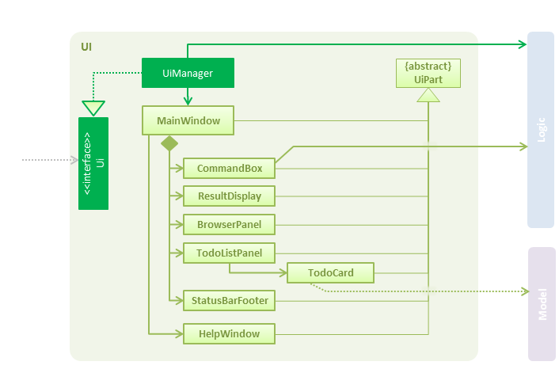

# Developer Guide
 

1. [Introduction](#1-introduction) 
2. [Setting Up](#2-setting-up) 
    2.1 [Prerequisites](#21-prerequisites) 
    2.2 [Importing the Project into Eclipse](#22-importing-the-project-into-eclipse) 
3. [Design](#3-design) 
    3.1 [Architecture](#31-architecture) 
    3.2 [UI](#32-ui) 
    3.3 [Logic](#33-logic) 
    3.4 [Model](#34-model) 
    3.5 [Storage](#35-storage) 
    3.6 [Common classes](#36-common-classes) 
4. [Target Users](#4-target-users) 
5. [Testing](#5-testing) 
   5.1 [Types of Tests](#51-types-of-tests) 
   5.2 [How to Test](#52-how-to-test) 
6. [Dev Ops](#6-dev-ops) 
    6.1 [Build Automation](#61-build-automation) 
    6.2 [Continuous Integration](#62-continuous-integration) 
    6.3 [Publishing Documentation](#63-publishing-documentation) 
    6.4 [Making a Release](#64-making-a-release) 
    6.5 [Converting Documentation to pdf format](#65-converting-documentation-to-pdf-format) 
    6.6 [Managing Dependencies](#66-managing-dependencies) 
7. [Appendix A: User Stories](#7-appendix-a--user-stories) 
8. [Appendix B: Use Cases](#8-appendix-b--use-cases) 
9. [Appendix C: Non Functional Requirements](#9-appendix-c--non-functional-requirements) 
10. [Appendix D: Glossary](#10-appendix-d--glossary) 
11. [Appendix E: Product Surveys](#11-appendix-e--product-surveys) 
    11.1 [Trello](#111-trello) 
    11.2 [Sticky Notes](#112-sticky-notes) 
    11.3 [Wunderlist](#113-wunderlist) 
    11.4 [Nirvana for GTD](#114-nirvana-for-gtd) 

  

## 1. Introduction
ezDo is the eziest™ way to keep track of all the user's tasks efficiently with command line style inputs. It is a Java desktop application with a user-friendly GUI implemented with JavaFX.

ezDo is written in Java and is designed in an Object Oriented Programming (OOP) manner. As such, this guide describes the class design and technical implementation of ezDo. It will help developers (like you) understand how classes within ezDo interact with each other and how you can contribute to its development.

We have organized this guide in a top-down manner so that you can understand the general framework of ezDo before moving on to the more detailed sections of ezDo's components. Each sub-section is mostly self-contained to provide ease of reference.

## 2. Setting Up

### 2.1 Prerequisites
* [**Java Development Kit (JDK) 8**](http://www.oracle.com/technetwork/java/javase/downloads/index.html) or later
* [**Eclipse**](http://www.eclipse.org/downloads/eclipse-packages/) IDE
* [**e(fx)clipse Plug-in**](https://wiki.eclipse.org/Efxclipse/Tutorials/AddingE(fx)clipse_to_eclipse_) for Eclipse
* [**Buildship Gradle Integration Plug-in**](http://marketplace.eclipse.org/content/buildship-gradle-integration) (from the Eclipse Marketplace)
* [**Checkstyle Plug-in**](http://eclipse-cs.sourceforge.net/#!/install) (from the Eclipse Marketplace)

 

### 2.2 Importing the Project into Eclipse
1. From [this repository](https://github.com/CS2103JAN2017-W14-B4/main), ___fork___ and ___clone___ it to your computer.

2. Open your ___Eclipse IDE___.
   > Ensure that you have installed the [e(fx)clipse](https://wiki.eclipse.org/Efxclipse/Tutorials/AddingE(fx)clipse_to_eclipse_) and [Buildship Gradle Integration](http://marketplace.eclipse.org/content/buildship-gradle-integration) plugins as given in the prerequisites above.

3. Click ___`File`___ > ___`Import`___ .

4. Click ___`General`___ > ___`Existing Projects into Workspace`___ > ___`Next`___ .

5. Click ___`Browse`___ , then ___locate the project's directory___.

6. Click ___`Finish`___ .

  

## 3. Design
 

### 3.1 Architecture
---
 

<h5 align="center">Figure 1: Architecture Diagram</h5>
  

Figure 1 explains the high-level design of ezDo.

> * The `.pptx` files used to create diagrams in this document can be found in the [diagrams](diagrams/) folder.
>
> * To update a diagram, modify the diagram in the `.pptx` file, select the objects of the diagram, and choose `Save as picture`.

 

`Main` has only one class called [`MainApp`](../src/main/java/seedu/ezdo/MainApp.java):

* At ezDo launch, it is responsible for initializing the components in the correct sequence and connecting them up with each other.

* At shut down, it is responsible for shutting down the components and invoking cleanup methods where necessary.

 

[**`Commons`**](#common-classes) represents a collection of classes used by multiple other components.
Two of those classes play important roles at the architecture level:

* `EventsCenter` : This class (written using [Google's Event Bus library](https://github.com/google/guava/wiki/EventBusExplained)) is used by components to communicate with other components using events (i.e. a form of Event Driven design).

* `LogsCenter` : This class is used by many classes to write log messages to ezDo's log file.

 

The rest of ezDo consists of four components:

* [**`UI`**](#ui-component) : The UI of ezDo.
* [**`Logic`**](#logic-component) : The command executor.
* [**`Model`**](#model-component) : The data of ezDo in-memory.
* [**`Storage`**](#storage-component) : The handler of read-write operations to disk.

 

Each of the four components

* Defines its API in an `interface` with the same name as the component.
* Exposes its functionality using a `{Component Name} Manager` class. 

For example, **`Logic`** (see Figure 2) defines its API in the `Logic.java` interface and exposes its functionality using the `LogicManager.java` class.  

<h5 align="center">Figure 2: Class Diagram of the Logic Component</h5>

  

### Events-Driven Nature of the Design

Figure 3 shows how the components interact for the scenario where the user issues the command `kill 1`.  

<h5 align="center">Figure 3: Component Interactions for kill 1 Command (Part 1)</h5>
  

> Note how **`Model`** simply raises a `EzDoChangedEvent` when ezDo data is changed, instead of asking **`Storage`** to save the updates to the hard disk.

 

Figure 4 shows how `EventsCenter` reacts to that event, which eventually results in the updates being saved to the hard disk and the status bar of the UI being updated to reflect the 'Last Updated' time.   

<h5 align="center">Figure 4: Component Interactions for kill 1 Command (Part 2)</h5>
  

> Note how the event is propagated through `EventsCenter` to **`Storage`** and **`UI`** without **`Model`** having to be coupled to either of them. This is an example of how this Event Driven approach helps us reduce direct coupling between components.

 

The sections below give more details on each component.

  

### 3.2 UI
---
 

<h5 align="center">Figure 5: Structure of the UI Component</h5> 

**API** : [`Ui.java`](../src/main/java/seedu/ezdo/ui/Ui.java)
 

As shown in Figure 5, **`UI`** consists of a `MainWindow` that consists of several parts. _For example: `CommandBox`, `ResultDisplay`, `TaskListPanel`, `StatusBarFooter` and `TaskCardHeader`._ All these, including the `MainWindow`, inherit from the abstract `UiPart` class.

**`UI`** uses the `JavaFX UI` framework. The layout of these UI parts are defined in matching `.fxml` files that are in the `src/main/resources/view` folder. 
 For example, the layout of the [`MainWindow`](../src/main/java/seedu/ezdo/ui/MainWindow.java) is specified in [`MainWindow.fxml`](../src/main/resources/view/MainWindow.fxml).

  

The **`UI`** component:

* Executes user commands using **`Logic`**.

* Binds itself to some data in **`Model`** so that the UI can auto-update when data in **`Model`** changes.

* Responds to events raised from various parts of ezDo and updates the UI accordingly.

  

### 3.3 Logic
---
 

<h5 align="center">Figure 6: Structure of the Logic Component</h5> 

**API** : [`Logic.java`](../src/main/java/seedu/ezdo/logic/Logic.java)
 

As shown in Figure 6,
* **`Logic`** uses the `Parser` class to parse the user command.

* A `Command` object is executed by the `LogicManager`.

* The command execution can affect **`Model`** (e.g. adding a task) and/or raise events.

* The result of the command execution is encapsulated as a `CommandResult` object which is passed back to **`UI`**.

* In some Parser classes such as FindCommandParser, due to the huge amount of search parameters supported by ezDo's power search function (see `Find` in UserGuide), a `SearchParameter` Object is created with the Builder pattern to contain all the search parameters. This allows future developers to introduce more parameters by changing the `SearchParameter` Class instead of changing methods in **Model**.
 
 

The _sequence diagram_ (shown in Figure 7) shows the interactions within **`Logic`** for the _`execute("kill 1")`_ API call. 

<h5 align="center">Figure 7: Interactions Inside the Logic Component</h5>

  

### 3.4 Model
---
 

<h5 align="center">Figure 8: Structure of the Model Component</h5> 

**API** : [`Model.java`](../src/main/java/seedu/ezdo/model/Model.java)
 

As shown in Figure 8, **`Model`**:
* Stores a `UserPref` object that represents the user's preferences.

* Stores `ezDo` data which includes the `Tag` list and `Task` list.

* Exposes a `UnmodifiableObservableList<ReadOnlyTask>` object that can only be 'observed' i.e **`UI`** can be bound to this list so that the displayed list on the interface displays changes when the data in the list changes.

* Changes are made on a FilteredList. The changes are then raised in an eventBus (see other sections) which mutates the `UnmodifiableObservableList<ReadOnlyTask>`. This causes the change within the list to be reflect in the **`UI`**.

#### Design Choices
Changes are made on a FilteredList. The changes are then raised as an event (see other sections) which mutates the `UnmodifiableObservableList<ReadOnlyTask>`. This causes the change within the list to be reflect in the **`UI`**.
 

ezDo stores all tasks, regardless done or undone, in one FilteredList (see `Storage` section for more information).
 As such, commands such as `Edit`, `Done` and `Kill` can be executed easily on a single list instead of keeping track of multiple lists of tasks with different types (done and undone). 
  
 
 This FilteredList is designed with the Singleton Pattern, since only one FilteredList of task is created each time ezDo is run and all mutations and searches are done on this list.
  
 
 A Predicate and Qualifier interface plays a vital role in mutating the FilteredList, since they allow us to indicate a given Qualifer to expose certain tasks as viewable by a user. (e.g filter tasks which are `Done`; filter tasks which have certain `Priority`).
   

ezDo supports undo/redo commands. We saw two ways of doing it:
* Save history states.

* Remember what actions were taken, and do the logical reverse of them when the undo command is called.

After consideration, we decided to go with saving history states. In a task manager, tasks can be deleted and cleared. We can specify a 'de-clear' action, but since data is already lost, we can never actually return to the original state.

As such, our undo/redo functionality is designed with the Memento Pattern. The `EzDo` in `ModelManager` is the originator while the `ModelManager` class that implements **`Model`** is the caretaker. It holds two custom fixed-capacity array-based stacks of size 5. One stack holds history states for the undo command, while the other is for the redo command. We decided to limit the size of the stack in order to prevent stack overflow. This is a real possibility when the task manager holds a lot of data, and the user inputs many commands that keep accumulating history states in the undo stack. We felt that 5 is a good number of history states to save, in that users can undo up to 5 undo-able commands. If the stack is full, the newest history state overwrites the oldest one in the stack, thereby maintaining its size of 5.

Before any undo-able command is fully executed, a copy of the current history state is saved onto the undo stack and the redo stack is cleared.

If a user executes the undo command, the current state would be saved onto the redo stack, and the previous state in the undo stack popped off so that `ModelManager` can rollback to it.
  

### 3.5 Storage
---
 

<h5 align="center">Figure 9: Structure of the Storage Component</h5> 

**API** : [`Storage.java`](../src/main/java/seedu/ezdo/storage/Storage.java)
 

As shown in Figure 9, **`Storage`**:
* Saves `UserPref` objects in `.json` format and read it back.

* Saves ezDo data in `.xml` format and read it back.

#### Design Choices
ezDo allows users to specify a new location to save their data. Instead of populating a user's machine with many duplicates of the saved data by simply copying the old file and creating a new copy, we move the current savefile to the new location specified. This new location is saved in `Config` so that ezDo knows where to retrieve the right savefile in the next session.
  

### 3.6 Common classes
---
Classes used by multiple components are in the `seedu.ezdo.commons` package. 

   

## 4. Target Users
 

Similar to [Jim](http://www.comp.nus.edu.sg/~cs2103/AY1617S2/contents/handbook.html#handbook-project), our main target users have the following characteristics:
* They are office workers and [power users](http://www.dictionary.com/browse/power-user).
* They are willing to use a task manager in advanced ways.
* They have many tasks at hand with varying deadlines.
* They prefer not to use a mouse.

   

## 5. Testing
 

All tests can be found in the `./src/test/java` folder.

### 5.1 Types of Tests:

1. **GUI Tests** - These are _system tests_ that test the entire application by simulating user actions on the GUI. These are in the `guitests` package.

2. **Non-GUI Tests** - These are tests not involving the GUI. They include :
   * ___Unit tests___
      These tests target the lowest level methods/classes.
      _For example: `seedu.ezdo.commons.UrlUtilTest`_

   * ___Integration tests___
      These tests check the integration of multiple code units (i.e. those code units are assumed to be working).
      _For example: `seedu.ezdo.storage.StorageManagerTest`_

   * ___Hybrids of unit and integration tests___
      These tests check the multiple code units (i.e. how they are connected together).
      _For example: `seedu.ezdo.logic.LogicManagerTest`_
3. **Headless GUI Testing** - With compliments to the [TestFX](https://github.com/TestFX/TestFX) library we use, our GUI tests can be run in the ___headless_ mode__. In the headless mode, GUI tests do not show up on the screen. That means the developer can do other things on the computer while the tests are running. 
See [UsingGradle.md](UsingGradle.md#running-tests) to learn how to run tests in headless mode.

### 5.2 How to Test

#### In Eclipse:

* To run ___all tests___, right-click on the `src/test/java` folder and choose `Run as` > `JUnit Test`.

* To run ___a subset of tests___, right-click on a test package, test class, or a test and choose `Run as` > `JUnit Test`.

 

## 6. Dev Ops
 

### 6.1 Build Automation
See [UsingGradle.md](UsingGradle.md) to learn how to use Gradle for build automation.
 
### 6.2 Continuous Integration
We use [Travis CI](https://travis-ci.org/) and [AppVeyor](https://www.appveyor.com/) to perform _Continuous Integration_ on our projects.

See [UsingTravis.md](UsingTravis.md) and [UsingAppVeyor.md](UsingAppVeyor.md) for more details.
 
### 6.3 Publishing Documentation
See [UsingGithubPages.md](UsingGithubPages.md) to learn how to use GitHub Pages to publish documentation to the project site.
 

### 6.4 Making a Release

#### To create a new release,

 1. ___Generate a JAR file___ [using Gradle](UsingGradle.md#creating-the-jar-file).

 2. ___Tag the repo___ with the version number. _(For example: `v0.1`)_

 3. [___Create a new release___ using GitHub](https://help.github.com/articles/creating-releases/) and ___upload the JAR file you created___.
 

### 6.5 Converting Documentation to PDF format
We use [Google Chrome](https://www.google.com/chrome/browser/desktop/) for converting documentation to PDF format, as Google Chrome's PDF engine preserves hyperlinks used in webpages.

#### To convert a project documentation file to a PDF format,

 1. Make sure you have set up GitHub Pages as described in [UsingGithubPages.md](UsingGithubPages.md#setting-up).

 2. Using Google Chrome, ___go to the [GitHub Pages version](UsingGithubPages.md#viewing-the-project-site) of the documentation file___.
    e.g. For [UserGuide.md](UserGuide.md), the URL will be `https://cs2103jan2017-w14-b4.github.io/main/docs/UserGuide.html`.
 3. ___Click on the `Print` option___ in Chrome's menu.
 4. ___Set the destination to `Save as PDF`___ , then ___click `Save`___ to save a copy of the file in PDF format.  
    For best results, use the settings indicated in the screenshot (as shown in Figure 10). 
    

<h5 align="center">Figure 10: Saving Documentation as a PDF File in Google Chrome</h5>
  

### 6.6 Managing Dependencies
A project often depends on third-party libraries. For example, ezDo depends on the [Jackson library](http://wiki.fasterxml.com/JacksonHome) for XML parsing. Gradle can automate downloading the dependencies, which is better than these alternatives.   

> 1. Include those libraries in the repo (this bloats the repo size).  
> 2. Require developers to download those libraries manually (this creates extra work for developers).  

  

## 7. Appendix A : User Stories
 

Table 1 describes the user stories relevant to ezDo.
 

> **Priorities:**
> * High (must have) - `* * *`
> * Medium (nice to have)  - `* *`
> * Low (unlikely to have) - `*`

 

Priority | As a ... | I want to ... | So that I can...
-------- | :-------- | :--------- | :-----------
`* * *` | user | add a floating task | add tasks that need to be done 'some day'
`* * *` | user | add a task with deadlines | know when I must finish the task
`* * *` | user | view all the tasks by the order I added them | be more organised
`* * *` | user | delete a task | get rid of tasks I no longer want to track
`* * *` | user | check a task as done (not deleted) | know I have finished it
`* * *` | user | view a history of all the tasks I have done | check what I have done
`* * *` | new user | view the help guide | know the different commands there are and how to use them
`* * *` | user | edit my tasks | update them
`* * *` | user | undo my last command | undo mistakes/typos
`* * *` | user | add events that have a start and end time | know what my day will be like
`* * *` | user | search for tasks by deadline/description | see what task I entered
`* * *` | user | specify where to keep my tasks (file and folder) | move them around if need be
`* * *` | power user | set tags to tasks | group related tasks by tags
`* * *` | power user | search by tags | know everything I have to do related to that tag
`* *` | user | sort tasks by name, deadline, priority, start date or due date | quickly see what tasks I have to finish first
`* *` | user | list tasks | add deadlines to tasks without deadlines
`* *` | power user | use shortened versions of commands | save time when inputting tasks
`* *` | user | add different priorities to my tasks | know which tasks need to be done first
`* *` | user | list my tasks in priority order | see which tasks have different priorities
`* *` | user | undo multiple commands | revert changes
`* *` | user | enter recurring tasks | enter it just once
`* *` | power user | assign standard commands to my preferred shortcut commands | be familiar with my own  modified commands
`* *` | user | make tasks that have very close deadlines to appear as special priority | remember to complete them
`* *` | user | set notifications for deadlines for my tasks | be notified
`* *` | power user | set how much time it requires to finish a task | know how long I need to start and finish a task and not leave it halfway
`* *` | power user | tell the program how much time I have right now | the program can assign me a task to complete in that time
`* *` | user | set tasks that are currently underway | be aware of the tasks I am working on
`* *` | user | redo my last action | reverse accidental undo commands
`*` | user | list the tasks that are due soon | meet my deadlines
`*` | paranoid user | set password | protect my privacy
`*` | power user | sync tasks and events to Google Calendar | see my tasks and events alongside Google Calendar

<h5 align="center">Table 1: List of User Stories</h5>

  

## 8. Appendix B : Use Cases
 

___For all use cases below, the **System** is `ezDo` and the **Actor** is the `user`, unless otherwise specfied.___

 

### Use Case: Adding a Task
---

**MSS**

1. User enters command to add task along with relevant arguments.
2. ezDo adds the task and returns a confirmation message.
3. Use case ends.

 

**Extensions**

1a. The user enters an invalid command.

> 1a1. ezDo shows an error message and prompts the user to retry.  
  1a2. Use case resumes at step 1.

 

### Use Case: Updating a Task
---

**MSS**

1. User specifies task to update by index along with relevant fields and corresponding information.
2. ezDo updates the task and returns a confirmation message.
3. Use case ends.
 

**Extensions**

1a. The user enters an invalid command.

> 1a1. ezDo shows an error message and prompts the user to retry. 
> 1a2. Use case resumes at step 1.

1b. The indexed task does not exist.

> 1b1. ezDo shows an error message and prompts the user to select another index. 
> 1b2. Use case resumes at step 1.

 

### Use Case: Deleting a Task
---

**MSS**

1. User enters index of task to delete.
2. ezDo deletes the task and returns a  confirmation message.
3. Use case ends.
 

**Extensions**

1a. The indexed task does not exist.

> 1a1. ezDo shows an error message and prompts the user to select another index. 
> 1a2. Use case resumes at step 1.

 

### Use Case: Marking a Task as Done
---

**MSS**

1. User enters index of undone task to mark as done.
2. ezDo marks the specified undone task as done and returns the list of done task and a confirmation message.
3. Use case ends.
 

**Extensions**

1a. The indexed task does not exist.

> 1a1. ezDo shows an error message and prompts the user to select another index. 
> 1b1. Use case resumes at step 1.

 

### Use Case: Specifying Save Location
---

**MSS**

1. User enters command to change save location, along with the new file path.
2. ezDo updates the save location to the given path and returns a confirmation message.
3. Use case ends.
 

**Extensions**

1a. The folder does not exist.

> 1a1. ezDo shows an error message and prompts the user to choose another path. 
> 1a2. Use case resumes at step 1.

1b. The user enters an invalid command.

> 1b1. ezDo shows an error message and prompts the user to try again. 
> 1b2. Use case resumes at step 1.

  

## 9. Appendix C : Non-Functional Requirements
 

ezDo should:
1. Be intuitive so users can pick it up quickly.
2. Come with a very high level of automated testing.
3. Have user-friendly commands.
4. Be able to store at least 1000 tasks.

  

## 10. Appendix D : Glossary
 

### ezDo
> Your life, once you start using ezDo.

### Mainstream OS
> Windows, Linux, Unix, OS X.

### Power User
>  A computer user who uses advanced features which are typically not used by an normal user. 
>  These feautures include computer hardware, operating systems, programs or web sites.

  

## 11. Appendix E : Product Surveys
 

### 11.1 Trello
---
#### Pros
- Simple to use because the interface relies on many visual cues.
- Collaborative - can tag other Trello users to tasks.

#### Cons
- Expensive because users need to pay a monthly fee to use Trello.
- Inflexible - users cannot sort tasks by date.

#### Verdict - Not for Jim
Trello requires most of the work to be done with a mouse (moving of tasks by mouse etc). Moreover, Trello does not sort tasks by deadline or priority. Jim will find it inconvenient if he wishes to view his tasks in a certain order.

 

### 11.2 Sticky Notes
---
#### Pros
- Free with every Microsoft PC.
- Simple to use, like its real-world counterpart - Post-it notes.
- Rearrangeable notes.
- Resizeable notes for better visibility.
- Colorful - different note colors.
- Customizeable - font, font size, and other text options.

#### Cons
- Complicated - keyboard shortcuts only to change options.
- Messy - screen gets cluttered with many notes.
- Hard to differentiate notes.
- Unable to set reminders.

#### Verdict - Not for Jim
Sticky notes is not so good for Jim. Jim follows 'Inbox Zero'. If he uses Sticky Notes, he no longer has to worry about an inbox full of emails, because he gets a desktop full of notes now instead. Sticky notes require mouse-clicks and Jim prefers typing.
Sticky Notes also doesn't show what has to be done by a certain date.

 

### 11.3 Wunderlist
---
#### Pros
- Featureful - supports most features you would expect to find in a to-do list.
- Fast adding of tasks using keyboard shortcuts.
- Intuitive user experience.

#### Cons
- Inflexible - still requires mouse input if you wish to specify a due date.
- Unable to support tags.

#### Verdict - Not for Jim
Wunderlist does not suit Jim's needs.
Though it supports basic task creation with the keyboard alone, it does not allow Jim to record essential details such as the deadlines or priority without using a mouse.

 

### 11.4 Nirvana for GTD
---
#### Pros
- Compatible with Android and iOS
- Simple and clean layout
- Simple to add tasks by command prompt entry
- Customizable view to view tasks or projects that require immediate attention

#### Cons
- Unable to specify due date
- Unable to set commands
- Lacking in features
- Incompatible with OS X and Windows

#### Verdict - Not for Jim
For Jim, the applications allows him to zoom in to tasks or projects that require immediate action. However, this application is restricting  him to add tasks or projects using the command line interface. He has to use the graphical interface to edit or delete a task which will decrease his productivity and therefore it is not suitable for him.

  

<h3 align="center">- End -</h3>
