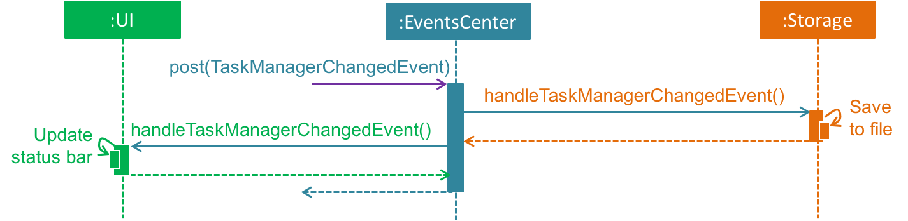

# Tache - Developer Guide

By : `T09-B4`  &nbsp;&nbsp;&nbsp;&nbsp; Since: `Feb 2017`  &nbsp;&nbsp;&nbsp;&nbsp; Licence: `MIT`

---

## Main Content

1. [Introduction](#1-introduction)
2. [Setting Up](#2-setting-up)
3. [Design](#3-design)  
	3.1. [Architecture](#31-architecture)  
	3.2. [User Interface](#32-user-interface-ui-component)  
	3.3. [Logic](#33-logic-component)  
	3.4. [Model](#34-model-component)  
	3.5. [Storage](#35-storage-component)  
4. [Implementation](#4-implementation)  
6. [Testing](#5-testing)
5. [Dev Ops](#6-dev-ops)

## Appendices

* [Appendix A: User Stories](#appendix-a--user-stories)
* [Appendix B: Use Cases](#appendix-b--use-cases)
* [Appendix C: Non Functional Requirements](#appendix-c--non-functional-requirements)
* [Appendix D: Glossary](#appendix-d--glossary)
* [Appendix E : Product Survey](#appendix-e--product-survey)

## 1. Introduction

 
_Figure 1.1 : Tache User Interface_

Tache is an application designed for people who _store, retrieve and edit their to-do tasks frequently_.
We are also targeting our application towards desktop users who _prefer typing on the keyboard over the mouse_.
Hence, primary input for the application will be _command-driven_ and using the
[Command Line Interface](#command-line-interface-cli) (CLI).

## 2. Setting Up

### 2.1. Prerequisites

1. **JDK `1.8.0_60`**  or later 

    > Having any Java 8 version is not enough.  
    Tache will not work with earlier versions of Java 8.

2. **Eclipse** [IDE](#integrated-development-environment-ide)
3. **e(fx)clipse** plug-in for Eclipse (Follow the instructions from Step 2 onwards given in
   [this page](http://www.eclipse.org/efxclipse/install.html#for-the-ambitious))
4. **Buildship Gradle Integration** plug-in from the Eclipse Marketplace
5. **Checkstyle Plug-in** plug-in from the Eclipse Marketplace

### 2.2. Importing the Project into Eclipse

1. Fork this [repo](#repository-or-repo), and clone the fork to your computer.
2. Open Eclipse.

	> Note: Ensure that you have installed the **e(fx)clipse** and **Buildship** plug-ins as given
   in the prerequisites above.

3. Click `File` > `Import`.
4. Click `Gradle` > `Gradle Project` > `Next` > `Next`.
5. Click `Browse`, then locate the project's directory.
6. Click `Finish`.

  > * If you are asked whether to `Keep` or `Overwrite` [config files](#configuration-or-config-file), choose to `Keep`.
  > * Gradle downloads library files from servers during the project set up process.  
  Hence, depending on your connection speed and server load, it can even take up to 30 minutes for the set up to finish.
  > * If Eclipse auto-changed any settings files during the import process, you can discard those changes.

### 2.3. Configuring Checkstyle

1. Click `Project` -> `Properties` -> `Checkstyle` -> `Local Check Configurations` -> `New...`.

2. Choose `External Configuration File` under `Type`.

3. Enter an arbitrary configuration name.  e.g. tache

4. Import the Checkstyle configuration file found at `config/checkstyle/checkstyle.xml`.

5. Click OK once, go to the `Main` tab, and use the newly imported check configuration.

6. Tick and select `files from packages`, click `Change...`, and select the `resources` package.

7. Click OK twice, and rebuild project if prompted.

> Note: You can click on the `files from packages` text after ticking in order to enable the `Change...`
button.

### 2.4. Troubleshooting Project Setup

**Problem: Eclipse reports compile errors after new commits are pulled from Git**

* Reason: Eclipse fails to recognize new files that appeared due to the Git pull.
* Solution: Refresh the project in Eclipse.

  > Right click on the project (in Eclipse package explorer), then choose `Gradle` -> `Refresh Gradle Project`.

**Problem: Eclipse reports some required libraries missing**

* Reason: Required libraries may not have been downloaded during the project import.

* Solution: [Run tests using Gradle](UsingGradle.md) once to refresh the libraries.

## 3. Design

The `.pptx` files used to create diagrams in this section can be found in the
[diagrams](diagrams/) folder.  

You can update a diagram using the following steps:
1. Modify the diagram in the pptx file.

2. Select the objects of the diagram.

3. Choose `Save as picture`.

### 3.1. Architecture

 
_Figure 3.1.1 : Architecture Diagram_

The **_Architecture Diagram_** given above explains the high-level design of the app.

#### Main Component

[**`Main`**](#main-component) has only one class called [`MainApp`](../src/main/java/seedu/address/MainApp.java).

Functions of `Main`:

* **At app launch:** Initializes the components in the correct sequence and connects them with one another

* **At shut down:** Shuts down the components and invokes cleanup method where necessary

#### Commons Component

[**`Commons`**](#commons-component) represents a collection of classes used by multiple other components.
This collection is encapsulated in the `seedu.tache.commons` package.  

2 classes in the package, `EventsCenter` and `LogsCenter`, play important roles at the architecture level as discussed.

Function of `EventsCenter`:

* Uses events to facilitate inter-component communication via an _Event-Driven_ design

  > This class is written using [Google's Event Bus library](https://github.com/google/guava/wiki/EventBusExplained).

Function of `LogsCenter`:

* Allows many classes to write log messages to Tache's log file

#### Other Components

The rest of Tache consists of the following four components:

* [**`User Interface`**](#32-user-interface-ui-component) : Facilitates the interaction between the user and the system

* [**`Logic`**](#33-logic-component) : Executes the user's commands

* [**`Model`**](#34-model-component) : Holds the data of Tache in-memory

* [**`Storage`**](#35-storage-component) : Reads data from, and writes data to, the hard disk

#### Event-Driven Nature

The interactions between the components mentioned above are integral in providing the functionality of Tache. For example,
the [_Sequence Diagram_](#sequence-diagram) below shows how some of these components interact with one another
to execute the user command `delete 1`.

 
_Figure 3.1.2a : Component Interactions for `delete 1` Command (Part 1)_

> Note how the `Model` simply raises a `TaskManagerChangedEvent` when Tache's data is changed,
 instead of asking the `Storage` to save the updates to the hard disk.

The diagram below shows how `EventsCenter` reacts to that event, which eventually results in the following:
* Updates saved to the hard disk
* Status bar of the [User Interface](#user-interface-ui) (UI) updated to reflect the 'Last Updated' time

 
_Figure 3.1.2b : Component Interactions for `delete 1` Command (Part 2)_

> Note how the event is propagated through the `EventsCenter` to the `Storage` and `UI` without `Model` having
  to be coupled to either of them.  
  This is an example of how this Event-Driven approach helps us reduce direct coupling between components.

Each of the four components:

* Defines its _API_ in an `interface` with the same name as the Component.
* Exposes its functionality using a `{Component Name}Manager` class.

For example, the `Logic` component defines its API in the `Logic.java` interface and exposes its functionality
using the `LogicManager.java` class. 

The sections below give more details for each component.

### 3.2. User Interface (UI) Component

 
_Figure 3.2.1 : Structure of the UI Component_

**API** : [`Ui.java`](../src/main/java/seedu/tache/ui/Ui.java)

The [User Interface](#user-interface-ui) (UI) consists of a `MainWindow` that is made up of several parts.
(e.g.`CommandBox`, `ResultDisplay`, `TaskListPanel`)  

All these, including the `MainWindow`, inherit from the abstract `UiPart` class.

> The `UI` component uses the _JavaFX UI_ framework.  
The layout of these UI parts are defined in matching `.fxml` files that are in the `src/main/resources/view` folder.  
 For example, the layout of the [`MainWindow`](../src/main/java/seedu/address/ui/MainWindow.java) is specified in
 [`MainWindow.fxml`](../src/main/resources/view/MainWindow.fxml).

Functions of `UI`:

* Executes user commands using the `Logic` component

* Binds itself to some data in the `Model` so that the UI of Tache can auto-update when data in the `Model` changes

* Responds to events raised from various parts of the Tache and updates its UI accordingly

### 3.3. Logic Component

 
_Figure 3.3.1 : Structure of the Logic Component_

**API** : [`Logic.java`](../src/main/java/seedu/tache/logic/Logic.java)

Function of `Logic`:

* Executes the user's command using the following procedure:

  > 1. `Logic` uses the `Parser` class to [parse](#parse) the user command.  
  > 2. This results in a `Command` object which is executed by the `LogicManager`.  
  > 3. The command execution can affect the `Model` and/or raise events (an example of such a command is **adding a task**).  
  > 4. The result of the command execution is then encapsulated as a `CommandResult` object.  
  > 5. This object is passed back to the `UI`.  

Given below is the [Sequence Diagram](#sequence-diagram) for interactions within the `Logic` component for the
`execute("delete 1")` API call. 
 
_Figure 3.3.2 : Interactions Inside the Logic Component for the `delete 1` Command_

### 3.4. Model Component

 
_Figure 3.4.1 : Structure of the Model Component_

**API** : [`Model.java`](../src/main/java/seedu/tache/model/Model.java)

Functions of `Model`:

* Stores a `UserPref` object that represents the user's preferences

* Stores the data in Tache

* Exposes an `UnmodifiableObservableList<ReadOnlyTask>` that can be 'observed'

  > E.g. The [UI](#user-interface-ui) can be bound to this list so that it automatically
updates when this list is modified.  

`Model` does not depend on any of the other three components.

### 3.5. Storage Component

 
_Figure 3.5.1 : Structure of the Storage Component_

**API** : [`Storage.java`](../src/main/java/seedu/tache/storage/Storage.java)

Functions of `Storage`:

* Saves `UserPref` objects in json format and reads it back

* Saves Tache's data in xml format and reads it back

## 4. Implementation

### 4.1. Logging

We are using the `java.util.logging` package for logging.  
The `LogsCenter` class is used to manage logging levels and logging destinations.

* You can control the logging level using the `logLevel` setting in the [config file](#configuration-or-config-file)
  (See [Configuration](#42-configuration))
* The `Logger` for a class can be obtained using `LogsCenter.getLogger(Class)` which will log messages according to
  the specified logging level

  > Currently, log messages are output through: `Console` and to a `.log` file.

**Logging Levels**

* `SEVERE` : Message shows critical problem detected which may possibly cause the termination of the application
* `WARNING` : Message shows that developers can continue with the program, but with caution
* `INFO` : Message shows information showing the noteworthy actions by Tache
* `FINE` : Message shows details that are not usually noteworthy but may be useful in debugging

  > E.g. print the actual list instead of just its size

### 4.2. Configuration

Certain properties of the application can be controlled (e.g app name, logging level) through the
[config file](#configuration-or-config-file) (default: `config.json`).

## 5. Testing

Tests can be found in the `./src/test/java` folder.

### 5.1. Testing Platforms

**Eclipse**:

* To run **all tests**: Right-click on the `src/test/java` folder.

* To run **a subset of tests**: Right-click on a test package, test class, or a test.  

Then choose `Run as` > `JUnit Test`.

**Gradle**:

* You can see [UsingGradle.md](UsingGradle.md) for how to run tests using Gradle.

### 5.2. Test Types

**GUI Tests**:

These are _System Tests_ that test the entire Tache by simulating user actions on the
[Graphical User Interface](#graphical-user-interface-gui) (GUI).  
These tests are found in the `guitests` package.

**Non-GUI Tests**:

These are tests that do not involve the GUI. They include:
   * _Unit tests_ that target the lowest level methods/classes  
      e.g. `seedu.tache.commons.UrlUtilTest`

   * _Integration tests_ that check the integration of multiple code units
   (those code units are assumed to be working)  
      e.g. `seedu.tache.storage.StorageManagerTest`

   * _Hybrids of unit and integration tests_ that check multiple code units as well as
      how they are connected together  
      e.g. `seedu.tache.logic.LogicManagerTest`

### 5.3. Testing Mode: Headless GUI Testing

Thanks to the [TestFX](https://github.com/TestFX/TestFX) library we use,
our GUI tests can be run in the _headless_ mode.  
 In the headless mode, GUI tests do not show up on the screen.  
 > That means that you can do other things on the computer while the tests are running.  
 You can refer to [UsingGradle.md](UsingGradle.md#running-tests) to learn how to run tests in the headless mode.

### 5.4. Troubleshooting Tests

 **Problem: Tests fail because NullPointException when AssertionError is expected**

 * Reason: Assertions are not enabled for JUnit tests.  
   This can happen if you are not using a recent Eclipse version (i.e. _Neon_ or later).

 * Solution: Enable assertions in JUnit tests as described
   [here](http://stackoverflow.com/questions/2522897/eclipse-junit-ea-vm-option).  
   Delete run configurations created when you ran tests earlier.

## 6. Dev Ops

### 6.1. Build Automation

You can refer to [UsingGradle.md](UsingGradle.md) to learn how to use Gradle for build automation.

### 6.2. Continuous Integration

We use [Travis CI](https://travis-ci.org/) and [AppVeyor](https://www.appveyor.com/) to perform
_Continuous Integration_ on our projects.  
See [UsingTravis.md](UsingTravis.md) and [UsingAppVeyor.md](UsingAppVeyor.md) for more details.

### 6.3. Publishing Documentation

You can see [UsingGithubPages.md](UsingGithubPages.md) to learn how to use GitHub Pages to publish
documentation to the project site.

### 6.4. Making a Release

You can do the following to create a new release:

 1. Generate a JAR file [using Gradle](UsingGradle.md#creating-the-jar-file).

 2. Tag the repo with the version number. e.g. `v0.1`

 2. [Create a new release using GitHub](https://help.github.com/articles/creating-releases/)
    and upload the JAR file you created.

### 6.5. Converting Documentation to PDF Format

We use [Google Chrome](https://www.google.com/chrome/browser/desktop/) for converting documentation to PDF format,
as Chrome's PDF engine preserves hyperlinks used in webpages.

You can follow the following steps to convert the project documentation files to PDF format:

 1. Make sure you have _set up GitHub Pages_ as described in [UsingGithubPages.md](UsingGithubPages.md#setting-up).
 2. Using Chrome, go to the [GitHub Pages version](UsingGithubPages.md#viewing-the-project-site) of the
    documentation file.  

    > E.g. For [UserGuide.md](UserGuide.md), the URL will be
    `https://<your-username-or-organization-name>.github.io/main/docs/UserGuide.html`.

 3. Click on the `Print` option in Chrome's menu.
 4. Set the destination to `Save as PDF`, then click `Save` to save a copy of the file in PDF format.  

    > For best results, use the settings indicated in the screenshot below.  

     
    _Figure 6.5.1 : Saving Documentation as PDF Files in Chrome_

### 6.6. Managing Dependencies

A project often depends on third-party libraries. For example, Tache depends on the
[Jackson library](http://wiki.fasterxml.com/JacksonHome) for XML parsing.  

Managing these dependencies can be automated using Gradle.

> For example, Gradle can download the dependencies automatically, which is better than these alternatives:  
a. Include those libraries in the repo (this bloats the repo size)  
b. Require developers to download those libraries manually (this creates extra work for developers)

## Appendix A : User Stories

Priorities: High (must have) - `* * *`, Medium (nice to have)  - `* *`,  Low (unlikely to have) - `*`

Priority | As a ... | I want to ... | So that I can...
:----------- | :----------- | :--------- | :-----------
`* * *` | user | obtain a list of tasks due today / this week | plan my time to complete these urgent tasks before they are due
`* * *` | user | view tasks planned to be completed within a certain time range | easily decide on tasks I should work on during that period
`* * *` | user | indicate a starting and ending time for my tasks | keep track of events I need to attend
`* * *` | user | display my tasks in a calendar view | obtain a general overview of the tasks I need to complete
`* * *` | user | set tasks as [recurring](#recurring-tasks) at certain intervals | save time having to add the task repeatedly for different times
`* * *` | user | add [subtasks](#subtask) to existing tasks | keep track of and manage subtasks to be completed as part of bigger tasks
`* * *` | user | mark a task as completed and filter tasks that are not completed | keep tracks of tasks that I have to complete
`* * *` | user | view completed tasks | avoid working on tasks that are already completed
`* * *` | user | set notifications to go off when certain tasks are nearing their deadline | avoid missing those deadlines
`* * *` | user | set notifications to go off when I have planned to work on certain tasks | remind myself to work on those tasks that need to be completed
`* * *` | user | undo previous commands | revert back to previous states in case of wrongly entered commands
`* * *` | user  | activate the application quickly using a keyboard shortcut | access my task manager conveniently and efficiently
`* * *` | advanced user | [autocomplete](#autocomplete) my command by pressing a key (e.g. enter) | type my commands faster
`* * *` | user | specify a particular location I want to save the data file of my task manager | [sync](#sync) my task list and access it from other devices
`* * *` | user | search for names of particular tasks | update or view specific tasks efficiently
`* * *` | user | add new tasks | track what i need to do
`* * *` | user | delete tasks | delete task that was inaccurately entered
&nbsp;&nbsp;`* *` | advanced user | use shorter versions of commands | type my commands faster
&nbsp;&nbsp;`* *` | new user | view additional usage information for particular commands | learn how to use specific commands effectively
&nbsp;&nbsp;`* *` | user | secure my task list | prevent other people from viewing my task list
&nbsp;&nbsp;`* *` | user | [sync](#sync) my task list to Google or Microsoft | view my tasks through their respective calendars
&nbsp;&nbsp;`* *` | user | retrieve previously typed commands using the UP and DOWN keys and execute them directly | save time having to retype similar commands repeatedly
&nbsp;&nbsp;`* *` | user | postpone an existing task via a specific command | save time having to specifically enter the new deadline
&nbsp;&nbsp;`* *` | user | attach related documents and links to my tasks | conveniently access documents needed for me to work on the tasks
&nbsp;&nbsp;`* *` | new user | view command hints when typing commands | ensure my commands are correct
&nbsp;&nbsp;`* *` | user | block off multiple slots for the same task and release the unused slots when the exact timing of a task is confirmed | avoid having to add multiple copies of the same task to multiple potential time slots
&nbsp;&nbsp;`* *` | user | view the slots at which I have not planned for any task to be completed | find a suitable slot for new tasks easily
&nbsp;&nbsp;&nbsp;&nbsp;`*`&nbsp;&nbsp;&nbsp;&nbsp;| user sharing  this computer  with other users | switch between different accounts on this task manager | share this application with the other users of this computer
&nbsp;&nbsp;&nbsp;&nbsp;`*`&nbsp;&nbsp;&nbsp;&nbsp;| user | backup my entire task list to the cloud or external storage via export | have extra redundancy against system failures
&nbsp;&nbsp;&nbsp;&nbsp;`*`&nbsp;&nbsp;&nbsp;&nbsp;| user | create shared tasks across different users | track the progress of other users for shared tasks
&nbsp;&nbsp;&nbsp;&nbsp;`*`&nbsp;&nbsp;&nbsp;&nbsp;| user | import previously exported data back | continue from where I left off
&nbsp;&nbsp;&nbsp;&nbsp;`*`&nbsp;&nbsp;&nbsp;&nbsp;| user | receive a daily email at a preferred time that contains tasks due that day | plan my schedule for that day effectively

## Appendix B : Use Cases

### Use case: Show possible commands to be executed

**MSS**

1. `User` types a letter or a sequence of letters
2. `Tache` shows a list of commands that contain that letter or sequence of letters
3. `User` selects specific command in list
4. `Tache` performs an [autocomplete](#autocomplete) on user's command  
Use case ends.

**Extensions**

2a. No command contains letter or sequence of letters typed by `User`

> 2a1. `Tache` informs `User` that there is no such command
  Use case ends

2b. `User` makes changes to input

> Use case resumes at step 2

### Use case: Change save location

**MSS**

1. `User` requests to change data file location
2. `Tache` displays a directory chooser
3. `User` selects a directory
4. `Tache` changes the save location to the one selected  
Use case ends.

**Extensions**

3a. `User` cancels the request

> Use case ends

### Use case: Switch to console using a [hotkey](#hotkey)

**MSS**

1. `User` types in predefined keyboard shortcut
2. `Tache` displays main window
3. `User` types in shortcut again
4. `Tache` minimizes main window  
Use case ends.

### Use case: Delete task

**MSS**

1. `User` requests to list tasks
2. `Tache` shows a list of tasks
3. `User` requests to delete a specific task in the list
4. `User` deletes the task  
Use case ends.

**Extensions**

2a. List is empty

> Use case ends

3a. Given index is invalid

> 3a1. `Tache` informs the `User` that the given index is invalid 
Use case resumes at step 2

### Use case: Add task

**MSS**

1. `User` requests to add a task
2. `Tache` shows user that task is added  
Use case ends.

**Extensions**

1a. [Parameters](#parameter) are wrong

> 1a1. `Tache` informs `User` that the parameters for the add command are wrong 
Use case ends.

1b. Task already exists

> 1b1. `Tache` informs `User` that the task already exists 
Use case ends

### Use case: Undo task

**MSS**

1. `User` requests to undo previous command
2. `Tache` reverts back to previous state before last change  
Use case ends.

**Extensions**

2a. No user command executed beforehand

> 2a1. `Tache` shows that it has nothing to undo  
Use case ends

### Use case: Edit task

**MSS**

1. `User` request to edit a specific task
2. `Tache` shows confirmation that task has been edited and changes are reflected in UI 
Use case ends.

**Extensions**

1a. [Parameters](#parameter) are wrong

> 1a1. `Tache` informs `User` that the parameters for the edit command are wrong 
Use case ends.

### Use case: List tasks

**MSS**

1. `User` request to list tasks with optional filter parameter
2. `Tache` shows lists of tasks 
Use case ends.

**Extensions**

1a. [Parameters](#parameter) are wrong

> 1a1. `Tache` informs `User` that the parameter for the list command is wrong 
Use case ends.

1b. [Parameters](#parameter) not given

> 1b1. `Tache` shows `User` all tasks 
Use case ends.

### Use case: Complete tasks

**MSS**

1. `User` request to complete tasks
2. `Tache` shows confirmation and completed tasks are no longer reflected in UI 
Use case ends.

**Extensions**

1a. [Parameters](#parameter) are wrong

> 1a1. `Tache` informs `User` that the parameters for the complete command are wrong 
Use case ends.

## Appendix C : Non Functional Requirements

#### 1. Should be a desktop app (i.e. not a mobile or Web app)

> Desktop apps are more general than other platforms such as mobile/embedded/web. Therefore, they provide a good
starting point before you move on to those platforms.
> You are allowed to integrate with online services such as Google Calendar as long as the app can provide a
reasonable level of functionality even when offline.

#### 2. [CLI](#command-line-interface) should be the primary mode of input

> If you implement a [GUI](graphical-user-interface), it should be primarily for output (i.e. the GUI is used to give
visual feedback rather than to collect input).
> Some minimal use of mouse is fine (e.g. to click the minimize button) but the primary input should be command-driven.
> Mouse actions should have keyboard alternatives and typing compared to mouse or key combinations.
> Design the app in a way that you can perform actions faster by typing compared to mouse or key combinations.

#### 3. Should work stand-alone, not a plug-in to another software

> However, you can build optional extensions that integrate your application with other existing software.
> Furthermore, you are allowed to build extensions that can plug into your software.

#### 4. Should not use relational databases

> Data storage must be done using text files you create yourself.

#### 5. Data should be stored locally the form of a human editable text file

> This is to allow advanced users to manipulate the data by editing the data file.

#### 6. Should follow object-oriented paradigm
#### 7. Should work on Windows 7 or later
#### 8. Should work without requiring an installer

> Having an optional installer is fine as long as the portable (non-installed) version has all the critical
functionality.

#### 9. Should conform to the Java coding standard
#### 10. Should process and respond to user commands within 1s
#### 11. Should work on any [mainstream OS](#mainstream-os) as long as it has Java 1.8.0_60 or higher installed
#### 12. A user with above average typing speed for regular English text (i.e. not code, not system admin commands) should be able to accomplish most of the tasks faster by typing commands as compared to using the mouse.

## Appendix D : Glossary

Here are some terms that are worth defining:  
(arranged in alphabetical order)

#### Autocomplete:

> Complete words or strings without the user needing to type them in full

#### Command Line Interface (CLI):

> A text-based interface which allows the user to interact with the program by typing in commands

#### Configuration (or Config) File:

> Files that configure the initial settings of a program

#### Graphical User Interface (GUI):

> A graphical interface that allows the user to interact with the program through graphical icons and visual indicators

#### Hotkey:

> A single or combination of keys that is registered with the system to perform specific activity when pressed

#### Integrated Development Environment (IDE):

> An application that provides comprehensive facilities for software development

#### Mainstream OS:

> Windows, Linux, Mac

#### Parameter:

> Detail associated with a task (e.g. duration, name, start time)

#### Parse:

> Resolve a statement into its component parts and describe their syntactic roles

#### Recurring task:

> A task that has to be completed periodically (e.g. daily or monthly)

#### Repository (or "repo"):

> A location where all the files of a particular project are stored

#### Sequence Diagram:

> A diagram used to model the interactions of a system over time

#### Subtask:

> A component of a task

#### Sync:

> Ensure that data files in two or more locations are updated

#### User Interface (UI):

> The visual component of a program through which a user interacts with the software

## Appendix E : Product Survey

We had individually studied and surveyed different existing task manager applications, identifying their strengths and
weaknesses with regards to how well they can cater for our target user's requirements.  

Here are our findings for:
* [Wunderlist](#wunderlist)
* [Google Calendar](#google-calendar)
* [Get it Done](#get-it-done)

### Wunderlist (Free Version)

**Author:** Tan Yu Wei

**Pros:**

* Customizable to-do lists for different purposes (e.g. movies to watch, grocery list)
* Alarm reminders for task when deadline is up AND when user should be working on the task
* Save links and web pages easily for later by via an Add to Wunderlist browser extension
* Compatible and [syncable](#sync) across many operating systems and commonly-used devices
* Transform emails into to-do tasks by simply forwarding them to a specific address
* Print task lists neatly and easily

**Cons:**

* Files added to to-do list have a limited size (i.e. 5 MB)
* Limited number of [subtasks](#subtask) per task (i.e. 25)
* Limited number of backgrounds to personalize Wunderlist (i.e. 20)
* No support for nested to-do lists
* Cannot manage events (cannot add start and end time)
* No calendar view of tasks

**Author:** Brandon Tan Jian Sin

**Pros:**

* Simple layout
* Intuitive controls
* Free
* [Syncable](#sync) across different platforms that Wunderlist supports
* Allows custom categorization of tasks
* Email, Desktop, Push Notifications

**Cons:**

* No calendar view
* Limitations in number of [subtasks](#subtask) and file attachments
* Tasks only scheduled by day not time

### Google Calendar

**Author:** Lim Shun Xian

**Pros:**

* Cross-platform
* Integrated with the majority of Google's applications such as Gmail
* Able to compare your friends' calendars with yours to find common free slots
* Able to share your calendar with others to view
* Able to send a daily reminder email of today's agenda (due tasks) at 5AM

**Cons:**

* Difficult to migrate over should one be already using Outlook or other calendars
* The daily reminder email is fixed at 5AM

### Get it Done

**Author:** Ang Zhi Yuan

**Pros:**

* Simple, clear layout
* Widely accessible across multiple platforms
* Allows cooperation between multiple users
* Clean email notifications
* Can [sync](#sync) to other calendars

**Cons:**

* Subscription based
* No calendar-view, only list view
