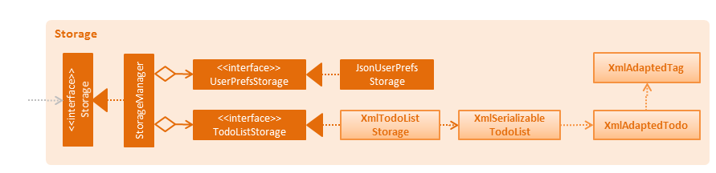
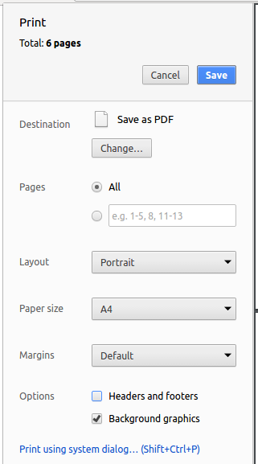

# Developer Guide
1. [Introduction](#introduction)
2. [Setting Up](#setting-up)
    * 2.1 Prerequisites
    * 2.2 Importing the Project into Eclipse
    * 2.3 Configuring Checkstyle
    * 2.4 Troubleshooting Project Setup
3. [Design](#design)
    * 3.1 Architecture
    * 3.2 Events-Driven Nature of the Design
    * 3.3 UI Component
    * 3.4 Logic Component
    * 3.5 Model Component
    * 3.6 Storage Component
    * 3.7 Common Classes
4. [Implementation](#implementation)
    * 4.1 Logging
    * 4.2 Configuration
5. [Testing](#testing)
    * 5.1 Headless GUI Testing
    * 5.2 Troubleshooting Failed Tests
6. [Dev Ops](#dev-ops)
    * 6.1 Build Automation
    * 6.2 Continuous Integration
    * 6.3 Publishing Documentation
    * 6.4 Making a Release
    * 6.5 Converting Documentation to PDF Format
    * 6.6 Managing Dependencies
7. [Appendix A: User Stories](#appendix-a--user-stories)
8. [Appendix B: Use Cases](#appendix-b--use-cases)
    * 8.1 Adding a Task
    * 8.2 Editing a Task
    * 8.3 Deleting a Task
    * 8.4 Undoing a Command
    * 8.5 Redoing a Command
    * 8.6 Sorting Displayed Tasks
    * 8.7 Marking Task as Done
    * 8.8 Filtering Tasks by Date
    * 8.9 Saving to a new Location
    * 8.10 Viewing Completed and Uncompleted Tasks
    * 8.11 Searching for Tasks Containing Keywords
    * 8.12 Updating Priority of a Task
    * 8.13 Getting Help
    * 8.14 Clearing all Tasks
9. [Appendix C: Non Functional Requirements](#appendix-c--non-functional-requirements)
10. [Appendix D: Glossary](#appendix-d--glossary)
11. [Appendix E : Product Survey](#appendix-e--product-survey)

## 1. Introduction
DoIt is a task manager to help users to organise their busy schedules using keyboard commands. It is a written in Java and uses JavaFX for its GUI 

This guide aims to help developers understand how DoIt works by describing its design and implementation. The guide is organised in a top-down fashion to give readers an overview of the entire program before diving into more detailed sections

## 2. Setting up

### 2.1 Prerequisites

1. **JDK `1.8.0_60`**  or later 
    > Having any Java 8 version is not enough
    *Doit* will not work with earlier versions of Java 8

2. **Eclipse** IDE
3. **e(fx)clipse** plugin for Eclipse (Do the steps 2 onwards given in
   [this page](http://www.eclipse.org/efxclipse/install.html#for-the-ambitious))
4. **Buildship Gradle Integration** plugin from the Eclipse Marketplace
5. **Checkstyle Plug-in** from the Eclipse Marketplace

### 2.2 Importing the Project into Eclipse

1. Fork this repo, and clone the fork to your computer
2. Open Eclipse (Note: Ensure you have installed the **e(fx)clipse** and **buildship** plugins as given
   in the prerequisites above)
3. Click `File` > `Import`
4. Click `Gradle` > `Gradle Project` > `Next` > `Next`
5. Click `Browse`, then locate the project's directory
6. Click `Finish`

  > * If you are asked whether to 'keep' or 'overwrite' config files, choose to 'keep'
  > * Depending on your connection speed and server load, it can even take up to 30 minutes for the set up to finish.
      (This is because Gradle downloads library files from servers during the project set up process)
  > * If Eclipse auto-changed any settings files during the import process, you can discard those changes

### 2.3 Configuring Checkstyle
1. Click `Project` -> `Properties` -> `Checkstyle` -> `Local Check Configurations` -> `New...`
2. Choose `External Configuration File` under `Type`
3. Enter an arbitrary configuration name (e.g. taskManager)
4. Import checkstyle configuration file found at `config/checkstyle/checkstyle.xml`
5. Click OK once, go to the `Main` tab, use the newly imported check configuration
6. Tick and select `files from packages`, click `Change...`, and select the `resources` package
7. Click OK twice
8. Rebuild project if prompted

> Note to click on the `files from packages` text after ticking in order to enable the `Change...` button

### 2.4 Troubleshooting Project Setup

**Problem: Eclipse reports compile errors after new commits are pulled from Git**

* Reason: Eclipse fails to recognize new files that appeared due to the Git pull
* Solution: Refresh the project in Eclipse by right clicking on the project (in Eclipse package explorer) and choosing `Gradle` -> `Refresh Gradle Project`

**Problem: Eclipse reports some required libraries are missing**

* Reason: Required libraries may not have been downloaded during the project import
* Solution: [Run tests using Gradle](UsingGradle.md) once (to refresh the libraries)

## 3. Design

### 3.1 Architecture

 
_Figure 2.1.1 : Architecture Diagram_

The **Figure 2.1.1** above explains the high-level design of DoIt

Below is a quick overview of each component:

`Main` has only one class called [`MainApp`](../src/main/java/seedu/address/MainApp.java). It is responsible for:
* Initializing the components in the correct sequence, and connecting them up with each other  at app launch
* Shutting down the components and invoking cleanup method where necessary  at shut down

[**`Commons`**](#common-classes) represents a collection of classes used by multiple other components.Two of those classes play important roles at the architecture level:

* `EventsCenter` : This class (written using [Google's Event Bus library](https://github.com/google/guava/wiki/EventBusExplained))
  is used by components to communicate with other components using events (i.e. a form of [Event-driven architecture](https://en.wikipedia.org/wiki/Event-driven_architecture))
* `LogsCenter` : This class is used by many classes to write log messages to *DoIt*'s log file

The rest of DoIt consists of four components:

* [**`UI`**](#ui-component) : The UI of *DoIt*
* [**`Logic`**](#logic-component) : The command executor
* [**`Model`**](#model-component) : Holding the data of DoIt in-memory
* [**`Storage`**](#storage-component) : Reading data from, and writing data to, the hard disk

Each of the four components

* Defines its API in an `interface` with the same name as the component
* Exposes its functionality using a `{Component Name}Manager` class

For example, `Logic` (seen in **Figure 2.1.2**) defines it's API in the `Logic.java` interface and exposes its functionality using the `LogicManager.java` class 
 
_Figure 2.1.2 : Class Diagram of the Logic Component_

### 3.2 Events-Driven Nature of the Design

The **Figure 2.1.3a** below shows how the components interact for the scenario where the user issues the
command `delete 1`

 
_Figure 2.1.3a : Component interactions for `delete 1` command (part 1)_

>Note how the `Model` simply raises a `TaskManagerChangedEvent` when the DoIt data are changed,
 instead of asking the `Storage` to save the updates to the hard disk

The **Figure 2.1.3b** shows how the `EventsCenter` reacts to that event, which eventually results in the updates
being saved to the hard disk and the status bar of the UI being updated to reflect the 'Last Updated' time 
 
_Figure 2.1.3b : Component Interactions for `delete 1` Command (part 2)_

> Note how the event is propagated through the `EventsCenter` to the `Storage` and `UI` without `Model` having
  to be coupled to either of them. This is an example of how this Event Driven approach helps us reduce direct
  coupling between components

The sections below give more details of each component

### 3.3 UI Component

Author: Ye Huan Hui

 
_Figure 2.2.1 : Structure of the UI Component_

**API** : [`Ui.java`](../src/main/java/seedu/doit/ui/Ui.java)

The UI consists of a `MainWindow` that is made up of parts (e.g.`CommandBox`, `ResultDisplay`, `TaskListPanel`,`StatusBarFooter`, `BrowserPanel` etc). All these, including the `MainWindow`, inherit from the abstract `UiPart` class

The `UI` component uses JavaFx UI framework. The layout of these UI parts are defined in matching `.fxml` files found in the `src/main/resources/view` folder 
 For example, the layout of the [`MainWindow`](../src/main/java/seedu/doit/ui/MainWindow.java) is specified in [`MainWindow.fxml`](../src/main/resources/view/MainWindow.fxml)

The `UI` component:

* Executes user commands using the `Logic` component
* Binds itself to some data in the `Model` so that the UI can auto-update when data in the `Model` change
* Responds to events raised from various parts of DoIt and updates the UI accordingly

### 3.4 Logic Component

Author: Lee Jin Shun

 
_Figure 2.3.1 : Structure of the Logic Component_

**API** : [`Logic.java`](../src/main/java/seedu/address/logic/Logic.java)

The `Logic` component:

* Parses the user command using the `Parser` class
* Creates a `Command` object which is executed by the `LogicManager`
* Invokes changes to the `Model` (e.g. adding a task) and/or raises events
* Encapsulates a `CommandResult` object which is passed back to the `Ui`

Given below is the Sequence Diagram for interactions within the `Logic` component for the `execute("delete 1")` API call 
 
_Figure 2.3.1 : Interactions Inside the Logic Component for the `delete 1` Command_

### 3.5 Model Component

Author: Hon Kean Wai

**API** : [`Model.java`](../src/main/java/seedu/address/model/Model.java)

The `Model` component:

* Stores the user's preferences
* Stores and manages DoIt's task list data
* Exposes a `UnmodifiableObservableList<ReadOnlyTask>` that can be 'observed'
(e.g. the UI can be bound to this list so that the UI automatically updates when the data in the list change)
* Remains unaffected by changes in the other three components due to application of the Observer Pattern
* Interacts with the other components by raising events

The `Model` class is the interface of the `Model` component. It provides several APIs for the other components to retrieve and update DoIt's task list data. The organization and relationship of the various classes are represented in Figure 2.4.1  

 
_Figure 2.4.1 : Structure of the Model Component_

The `ModelManager` implements the `Model` interface. It contains a `UserPrefs` object that represents the user's preferences. It also contains a `TaskManager` along with a `TaskManagerStack` which represents a stack of `TaskManager` objects which are necessary from redo and undo commands

Each `TaskManager` contains a single `UniqueTaskList` object. It also provides methods that directly manipulate the data in the `UniqueTaskList`

A `UniqueTaskList` is a list of `task` objects and cannot contain duplicate `tasks`

The `ReadOnlyItemManager` and `ReadOnlyTask` interfaces allow other classes and components, such as the UI, to access but not modify the list of tasks and their details

### 3.6 Storage Component

Author: Chew Chia Sin

 
_Figure 2.5.1 : Structure of the Storage Component_

**API** : [`Storage.java`](../src/main/java/seedu/doit/storage/Storage.java)

The `Storage` component:

* Saves `UserPrefs` objects in json format and load it back
* Saves the DoIt data in xml format and load it back

The `Storage` class is the interface of the `Storage` component. It provides several APIs for the other components to retrieve and update DoIt's task list data. The organization and relationship of the various classes are represented in Figure 2.5.1

The `StorageManager` implements the `Storage` interface. It contains a `UserPrefsStorage` interface that references `JsonUserPrefsStorage` allows storing and loading of the user's preferences in json format. It also contains a `TaskManagerStorage` interface that references `XmlTaskManagerStorage` that allows storing and loading of the user's DoIt data

The `XmlSerializableTaskManager` is a class that converts `ReadOnlyTaskManager` into a serializable object with which contains a list of `XmlAdaptedTask` and a list of `XmlAdaptedTag`

`XmlAdaptedTask` converts the Model's `Task` into a JAXB-friendly adapted version
`XmlAdaptedTag` converts the Model's `Tag` into a JAXB-friendly adapted version

### 3.7 Common Classes

Classes used by multiple components are in the `seedu.doit.commons` package

## 4. Implementation

### 4.1 Logging

We are using `java.util.logging` package for logging. The `LogsCenter` class is used to manage the logging levels
and logging destinations

* The logging level can be controlled using the `logLevel` setting in the configuration file
  (See [Configuration](#configuration))
* The `Logger` for a class can be obtained using `LogsCenter.getLogger(Class)` which will log messages according to
  the specified logging level
* Currently log messages are output through: `Console` and to a `.log` file

**Logging Levels**

* `SEVERE` : Critical problem detected which may possibly cause the termination of DoIt
* `WARNING` : Can continue, but with caution
* `INFO` : Information showing the noteworthy actions by DoIt
* `FINE` : Details that are not usually noteworthy but may be useful in debugging
  (e.g. print the actual list instead of just its size)

### 4.2 Configuration

Certain properties of DoIt can be controlled (e.g. App name, logging level) through the configuration file
(default: `config.json`):

## 5. Testing

Tests can be found in the `./src/test/java` folder

**In Eclipse**:

* To run all tests, right-click on the `src/test/java` folder and choose `Run as` > `JUnit Test`
* To run a subset of tests, right-click on a test package, test class, or a test and choose to run as a JUnit test

**Using Gradle**:

* See [UsingGradle.md](UsingGradle.md) for how to run tests using Gradle

### 5.1 Headless GUI Testing
Thanks to the [TestFX](https://github.com/TestFX/TestFX) library we use,
 our GUI tests can be run in the headless mode
 In the headless mode, GUI tests do not show up on the screen
 That means the developer can do other things on the Computer while the tests are running 
 See [UsingGradle.md](UsingGradle.md#running-tests) to learn how to run tests in headless mode
 
We have two types of tests:

1. **GUI Tests** - These are _System Tests_ that test the entire App by simulating user actions on the GUI
   These are in the `guitests` package

2. **Non-GUI Tests** - These are tests not involving the GUI. They include:
   1. _Unit tests_ targeting the lowest level methods/classes 
      (e.g. `seedu.doit.commons.UrlUtilTest`)
   2. _Integration tests_ that are checking the integration of multiple code units
     (those code units are assumed to be working) 
     (e.g. `seedu.doit.storage.StorageManagerTest`)
   3. Hybrids of unit and integration tests. These test are checking multiple code units as well as
      how the are connected together. 
      (e.g. `seedu.doit.logic.LogicManagerTest`)

### 5.2 Troubleshooting Failed Tests

 **Tests fail due to NullPointException when AssertionError is expected**

 * Reason: Assertions are not enabled for JUnit tests.
   This can happen if you are not using a recent Eclipse version. (i.e. _Neon_ or later)
 * Solution: Enable assertions in JUnit tests as described [here](http://stackoverflow.com/questions/2522897/eclipse-junit-ea-vm-option) and delete run configurations created when you ran tests earlier.

## 6. Dev Ops

### 6.1 Build Automation

See [UsingGradle.md](UsingGradle.md) to learn how to use Gradle for build automation

### 6.2 Continuous Integration

We use [Travis CI](https://travis-ci.org/) and [AppVeyor](https://www.appveyor.com/) to perform _Continuous Integration_ on our projects
See [UsingTravis.md](UsingTravis.md) and [UsingAppVeyor.md](UsingAppVeyor.md) for more details

### 6.3 Publishing Documentation

See [UsingGithubPages.md](UsingGithubPages.md) to learn how to use GitHub Pages to publish documentation to the project site

### 6.4 Making a Release

Here are the steps to create a new release:

 1. Generate a JAR file [using Gradle](UsingGradle.md#creating-the-jar-file)
 2. Tag the repo with the version number (e.g.`v0.1`)
 2. [Create a new release using GitHub](https://help.github.com/articles/creating-releases/) and upload the JAR file you created

### 6.5 Converting Documentation to PDF Format

We use [Google Chrome](https://www.google.com/chrome/browser/desktop/) for converting documentation to PDF format, as Chrome's PDF engine preserves hyperlinks used in webpages

Here are the steps to convert the project documentation files to PDF format:

 1. Make sure you have set up GitHub Pages as described in [UsingGithubPages.md](UsingGithubPages.md#setting-up)
 2. Using Chrome, go to the [GitHub Pages version (UsingGithubPages.md#viewing-the-project-site) of the documentation file
 3. Click on the `Print` option in Chrome's menu
 4. Set the destination to `Save as PDF`, then click `Save` to save a copy of the file in PDF format 
    For the best results, use the settings indicated in Figure 5.4.1 
     
    _Figure 5.4.1 : Saving documentation as PDF files in Chrome_

### 6.6 Managing Dependencies

A project often depends on third-party libraries. For example, DoIt depends on the [Jackson library](http://wiki.fasterxml.com/JacksonHome) for XML parsing. Managing these dependencies can be automated using Gradle. For example, Gradle can download the dependencies automatically, which is better than these alternatives:  
* Include those libraries in the repo (this bloats the repo size) 
* Require developers to download those libraries manually (this creates extra work for developers) 

## 7. Appendix A : User Stories

Priorities: High (must have) - `* * *`, Medium (nice to have)  - `* *`,  Low (unlikely to have) - `*`

Priority | As a ... | I want to ... | So that I can...
-------- | :-------- | :--------- | :-----------
`* * *` | New user | Have a help command | Refer to instructions when I forget how to use DoIt
`* * *` | User | Add a task | Keep track of a task which can be done anytime
`* * *` | User | Add a task with a deadline | Keep track of a task which has to be done by a specific date and time
`* * *` | User | Add a task with start and end time | Keep track of a task which occurs during a time frame
`* * *` | User | Delete a task | Remove a task that is no longer needed
`* * *` | User | Edit a task | Update task infomation
`* * *` | User | Search a task by its details | Locate task easily
`* * *` | User | Set task as completed | Keep track of completed tasks
`* * *` | User | Undo the most recent action | Revert changes made
`* * *` | User | Block multiple timeslots when the timing is uncertain | Know which times are available for me to add new tasks
`* * *` | User | Set priority to a task | Know which is the highest priority that I should do first
`* * *` | User | Tag/Categorise a task | Know what to do when I am in the current context
`* *` | User | Sort tasks by date, priority, deadline, recurrence, tags | View important tasks first
`* *` | User | Select a task by index | Reduce typing needed
`*` | User | Color scheme to represent priority | Visually differentiate between priority levels easily

## 8. Appendix B : Use Cases

(For all use cases below, the **System** is the `DoIt` and the **Actor** is the `user`, unless specified otherwise)

### 8.1 Use Case: Adding a Task 

**MSS**
1. User enters command to add task
2. System add task and shows it on the to do list
3. Use case ends

**Extensions**
1a. The user enters a duplicate task (same name same deadline)
> System shows an error message
> Use case ends

1b. The user enters a duplicate task but different deadline
> System prompt him to reschedule
> Use case ends

3a. User undos add task command
> System deletes newly added task and show feedback to user
> Use case ends

### 8.2 Use Case: Editing a Task 

**MSS**
1. User enters command to edit task
2. System edits task and displays feedback to user
3. Use case ends

**Extensions**
1a. The user enters a task that is not in the System
> System shows an error message
> Use case ends

1b. The user uses wrong syntax to edit the task
> System shows example of correct syntax
> Resume from 1

3a. User undos task edit command
> System adds the edited task back and shows feedback to user
> Use case ends

### 8.3 Use case: Deleting a Task 

**MSS**

1. User requests to list tasks
2. System shows a list of tasks
3. User requests to delete a specific task in the list by its name/index
4. System deletes the task  
Use case ends

**Extensions**

2a. The list is empty

> Use case ends

3a. The given name/index is invalid

> 3a1. System shows an error message  
  Use case resumes at step 2
  
4a. User undos task delete command

> System adds the deleted task back and shows feedback to user
> Use case ends

### 8.4 User Case : Undoing a Command 

**MSS**
1. User enters command to undo prev undoable command
2. System undo previous undoable command shows feedback to user
Use case ends

**Extensions**
1a. The user enters undo but there is no previous undoable command
> System shows an error message
> Use case ends

3a. User redo undone command
> System redo the undone command and shows feedback to user
> Use case ends

### 8.5 User Case : Redoing a Command 

**MSS**
1. User enters command to redo the previously undone command
2. System redo previously undone command and shows feedback to user
Use case ends

**Extensions**
1a. The user enters redo but there is no undone command
> System shows an error message
> Use case ends

3a. User undo redone command
> System undo the redone command and shows feedback to user
> Use case ends

### 8.6 User Case : Sorting Displayed Tasks 

**MSS**
1. User enters command to sort that tasks displayed
2. System marks sorts the task by what the user wants and shows feedback to user
Use case ends

**Extensions**
1a. The user enters an invalid sort
> System shows an error message
> Use case ends

### 8.7 User Case : Marking Task as Done 

**MSS**
1. User enters command to mark task as done
2. System marks tasks as done and shows feedback to user
Use case ends

**Extensions**
1a. The user enters a task that is not in the System
> System shows an error message
> Use case ends

3a. User undos mark task done command
> System marks the task back as undone and shows feedback to user
> Use case ends

### 8.8 Use Case: Filtering Tasks by Date 

**MSS**
1. User enters command to filter task by date
2. System filters tasks by date and shows them to user
Use case ends

**Extensions**
1a. The user enters an invalid date
> System shows an error message
> Use case ends

## 8.9 Use Case : Saving to a new Location 

**MSS**
1. User enters command to save data to specified location
2. System saves the data and feedback to user the success
Use case ends

**Extensions**
1a. User enters an invalid location to save
> System shows an error message
> Use case ends

1b. User enters the current save location to save
> System shows an error message
> Use case ends

1c. User enters a duplicated save location to save
> System shows an error message
> Use case ends

1d. User enters invalid file name to save
> System shows an error message
> Use case ends

## 8.10 Use Case: Viewing Completed and Uncompleted Tasks 

**MSS**
1. User enters command to view uncompleted or completed tasks
2. System opens a new window show list of completed and uncompleted tasks
Use case ends

## 8.11 Use Case : Searching for Tasks Containing Keywords 

**MSS**
1. User enters command to view uncompleted or completed tasks
2. System show tasks containing keywords
Use case ends

**Extensions**
2a. User enters invalid task name to search
> System shows an error message
> Use case ends

2a. User enters task name not in list
> System shows an empty list
> Use case ends

## 8.12 Use Case : Updating Priority of a Task 

**MSS**
1. User enters command to update priority of task
2. System updates priority to user specified priority 
Use case ends

**Extensions**
1a. User enters a task that is not in the System
> System shows an error message
> Use case ends

1b. User enters an invalid priority
> System shows an error message
> Use case ends

## 8.13 Use Case : Getting Help 

**MSS**
1. User enters command for help
2. System shows help prompt
Use case ends

## 8.14 Use Case : Clearing all Tasks 

**MSS**
1. User enters command to clear all tasks
2. System clears all tasks
Use case ends

## 9. Appendix C : Non-Functional Requirements

1. Should work on any [mainstream OS](#mainstream-os) as long as it has Java `1.8.0_60` or higher installed

2. Should be able to hold up to 100 tasks without a noticeable sluggishness in performance for typical usage

3. Should be able to accomplish most of the tasks faster using commands than using the mouse for a user with above average typing speed for regular English text (i.e. not code, not system admin commands) 
   
4. Should be able to enter a task in one command instead of multiple clicks

5. Should be able to access the program offline access tasks in areas without internet

6. Should be able to complete any user command within 2 seconds

7. Should delete all past tasks automatically without user doing it manually

8. Should should take no more than 5 minutes for a first time user to learn how to use program

{More to be added}

## 10. Appendix D : Glossary

**CRUD**: Create, read, update and delete

**GUI**: Graphical user interface is the means by which information from the system is displayed to the user

**Index of task**: The number visually tagged to a task on the GUI (changes with how tasks are listed)

**Mainstream OS**: Windows, Linux, Unix, OS-X Operating Systems

**MSS**: Main Success Scenario of a use case
    
**Sync**: Synchronize / adjust data on multiple files to be the same as each other

**Task**: A to-do without a date range, and optionally has a deadline

**UI**: User interface is the means by which the user and the system interact with each other

## 11. Appendix E : Product Survey

### Author: Chia Sin
### Product: Toodledo
### Advantages:
* Provides many features to use
* Provides email sync
* Tells you what to do
* Provides default settings so minimal adjustment is needed
* Allows input commands using a keyboard 
 
### Disadvantages: 
* Requires too many clicks for settings and other features other than task
* Requires clicking to delete and update
* Requires internet for desktop version to use

### Author: Kean Wai
### Product: Sticky Notes
### Advantages:
* Functions like text document and is easy to use
* Can be navigated using keyboard only
* Starts up automatically on entering desktop
* Works offline
* Comes preinstalled on windows so no need for special IT permissions 

### Disadvantages:
* Unable to sync with email
* Lack of functionality(No reminders, calendar view, etc) 
* Requires Windows Operating System to be installed

### Author: Jin Shun
### Product: Momentum 
### Advantages:
* Simple to use 
* Nice background 
* Helpful way of reminding users of pending tasks, every time user opens new tab in chrome
* Has integration with full fledged task managers like trello 

### Disadvantages: 
* Only works with chrome browser 
* Requires internet connection 
* Unable to set deadline for tasks 
* Minimal features 
 
### Author: Huanhui
### Product: Wunderlist 
### Advantages:
* Some shortcut keys available, good user flexibility 
* CRUD can function offline 
* Many features such as the ability to set reminders, due dates, recurring tasks 
* Tasks are automatically sorted by due date 
* Able to display completed tasks 
* Well designed UI 

### Disadvantages:
* Not fully functional on keyboard, still need to use mouse to do operations such as select task 
* Do not have an undo function 
* Requires installation
