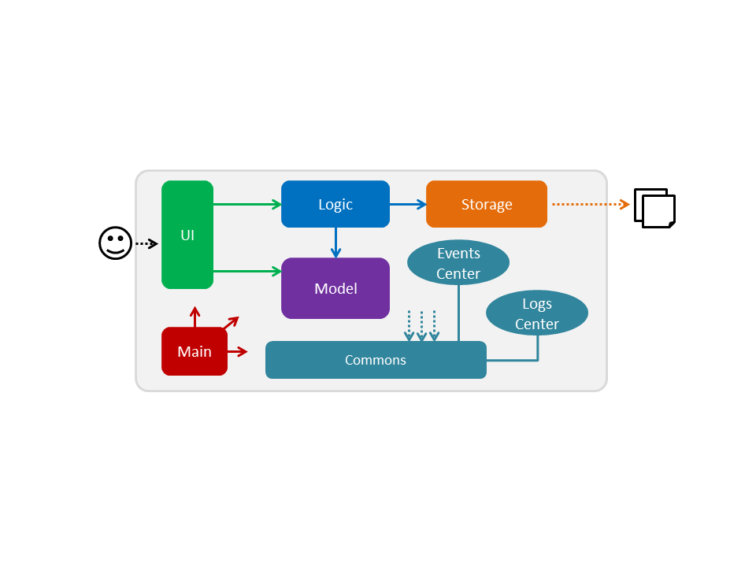
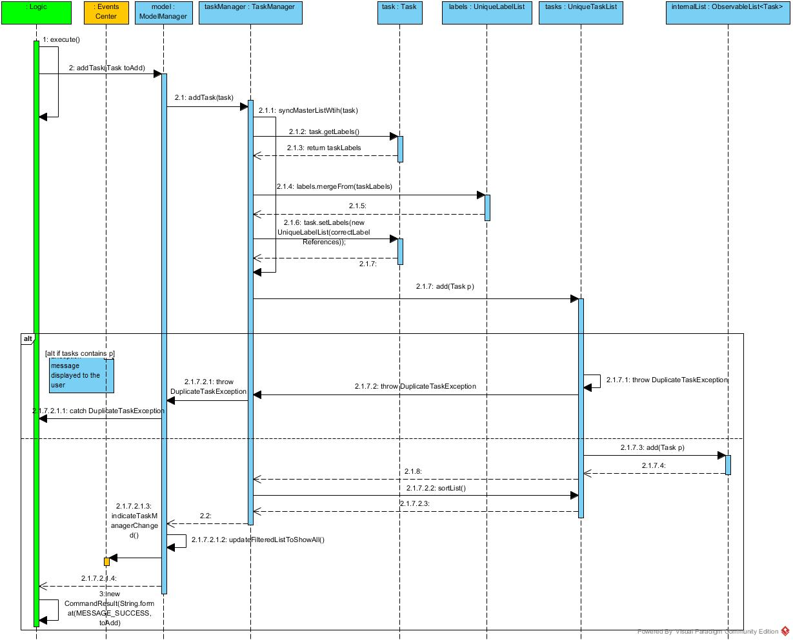
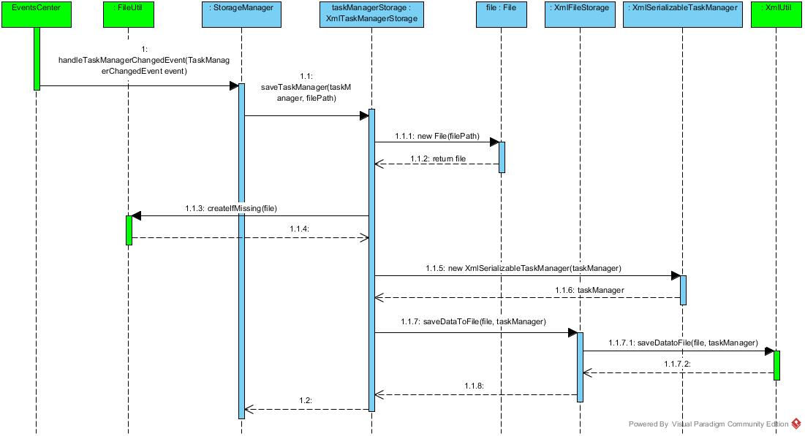

# DoOrDie - Developer Guide

By : `Team CS2103JAN2017-T16-B2`  &nbsp;&nbsp;&nbsp;&nbsp; Since: `JAN 2017`  &nbsp;&nbsp;&nbsp;&nbsp; Licence: `MIT`

---

1. [Setting Up](#1-setting-up)
2. [Design](#2-design)
3. [Implementation](#3-implementation)
4. [Testing](#4-testing)
5. [Dev Ops](#5-dev-ops)

* [Appendix A: User Stories](#appendix-a--user-stories)
* [Appendix B: Use Cases](#appendix-b--use-cases)
* [Appendix C: Non Functional Requirements](#appendix-c--non-functional-requirements)
* [Appendix D: Glossary](#appendix-d--glossary)
* [Appendix E : Product Survey](#appendix-e--product-survey)

## 1. Setting up

### 1.1. Prerequisites

1. **JDK `1.8.0_111`**  or later 

    > Having any Java 8 version is not enough.  
    This app will not work with earlier versions of Java 8.

2. **Eclipse** IDE
3. **e(fx)clipse** plugin for Eclipse (Do the steps 2 onwards given in
   [this page](http://www.eclipse.org/efxclipse/install.html#for-the-ambitious))
4. **Buildship Gradle Integration** plugin from the Eclipse Marketplace
5. **Checkstyle Plug-in** plugin from the Eclipse Marketplace

### 1.2. Importing the project into Eclipse

0. Fork this repo, and clone the fork to your computer
1. Open Eclipse (Note: Ensure you have installed the **e(fx)clipse** and **buildship** plugins as given
   in the prerequisites above)
2. Click `File` > `Import`
3. Click `Gradle` > `Gradle Project` > `Next` > `Next`
4. Click `Browse`, then locate the project's directory
5. Click `Finish`

  > * If you are asked whether to 'keep' or 'overwrite' config files, choose to 'keep'.
  > * Depending on your connection speed and server load, it can even take up to 30 minutes for the set up to finish
      (This is because Gradle downloads library files from servers during the project set up process)
  > * If Eclipse auto-changed any settings files during the import process, you can discard those changes.

### 1.3. Configuring Checkstyle
1. Click `Project` -> `Properties` -> `Checkstyle` -> `Local Check Configurations` -> `New...`
2. Choose `External Configuration File` under `Type`
3. Enter an arbitrary configuration name e.g. doordie
4. Import checkstyle configuration file found at `config/checkstyle/checkstyle.xml`
5. Click OK once, go to the `Main` tab, use the newly imported check configuration.
6. Tick and select `files from packages`, click `Change...`, and select the `resources` package
7. Click OK twice. Rebuild project if prompted

> Note to click on the `files from packages` text after ticking in order to enable the `Change...` button

### 1.4. Troubleshooting project setup

**Problem: Eclipse reports compile errors after new commits are pulled from Git**

* Reason: Eclipse fails to recognize new files that appeared due to the Git pull.
* Solution: Refresh the project in Eclipse: 
  Right click on the project (in Eclipse package explorer), choose `Gradle` -> `Refresh Gradle Project`.

**Problem: Eclipse reports some required libraries missing**

* Reason: Required libraries may not have been downloaded during the project import.
* Solution: [Run tests using Gradle](UsingGradle.md) once (to refresh the libraries).

## 2. Design

### 2.1. Architecture

 
_Figure 2.1.1 : Architecture Diagram_

The **_Architecture Diagram_** given above explains the high-level design of the App.
Given below is a quick overview of each component.

> Tip: The `.pptx` files used to create diagrams in this document can be found in the [diagrams](diagrams/) folder.
> To update a diagram, modify the diagram in the pptx file, select the objects of the diagram, and choose `Save as picture`.

`Main` has only one class called [`MainApp`](../src/main/java/seedu/address/MainApp.java). It is responsible for,

* At app launch: Initializes the components in the correct sequence, and connects them up with each other.
* At shut down: Shuts down the components and invokes cleanup method where necessary.

[**`Commons`**](#common-classes) represents a collection of classes used by multiple other components.
Two of those classes play important roles at the architecture level.

* `EventsCenter` : This class (written using [Google's Event Bus library](https://github.com/google/guava/wiki/EventBusExplained))
  is used by components to communicate with other components using events (i.e. a form of _Event Driven_ design)
* `LogsCenter` : Used by many classes to write log messages to the App's log file.

The rest of the App consists of four components.

* [**`UI`**](#ui-component) : The UI of the App.
* [**`Logic`**](#logic-component) : The command executor.
* [**`Model`**](#model-component) : Holds the data of the App in-memory.
* [**`Storage`**](#storage-component) : Reads data from, and writes data to, the hard disk.

Each of the four components

* Defines its _API_ in an `interface` with the same name as the Component.
* Exposes its functionality using a `{Component Name}Manager` class.

For example, the `Logic` component (see the class diagram given below) defines it's API in the `Logic.java`
interface and exposes its functionality using the `LogicManager.java` class. 
 
_Figure 2.1.2 : Class Diagram of the Logic Component_

#### Events-Driven nature of the design

The _Sequence Diagram_ below shows how the components interact for the scenario where the user issues the
command `delete 1`.

 
_Figure 2.1.3a : Component interactions for `delete 1` command (part 1)_

>Note how the `Model` simply raises a `TaskManagerChangedEvent` when the Task Manager data are changed,
 instead of asking the `Storage` to save the updates to the hard disk.

The diagram below shows how the `EventsCenter` reacts to that event, which eventually results in the updates
being saved to the hard disk and the status bar of the UI being updated to reflect the 'Last Updated' time.  
 
_Figure 2.1.3b : Component interactions for `delete 1` command (part 2)_

> Note how the event is propagated through the `EventsCenter` to the `Storage` and `UI` without `Model` having
  to be coupled to either of them. This is an example of how this Event Driven approach helps us reduce direct
  coupling between components.

The sections below give more details of each component.

### 2.2. UI component

Author: Bernard Yip

 
_Figure 2.2.1 : Structure of the UI Component_

**API** : [`Ui.java`](../src/main/java/seedu/address/ui/Ui.java)

The UI consists of a `MainWindow` that is made up of parts e.g.`CommandBox`, `ResultDisplay`, `TaskListPanel`,
`StatusBarFooter`, `LeftPanel` etc. All these, including the `MainWindow`, inherit from the abstract `UiPart` class.

The `UI` component uses JavaFx UI framework. The layout of these UI parts are defined in matching `.fxml` files
 that are in the `src/main/resources/view` folder. 
 For example, the layout of the [`MainWindow`](../src/main/java/seedu/address/ui/MainWindow.java) is specified in
 [`MainWindow.fxml`](../src/main/resources/view/MainWindow.fxml)

The `UI` component,

* Executes user commands using the `Logic` component.
* Binds itself to some data in the `Model` so that the UI can auto-update when data in the `Model` change.
* Responds to events raised from various parts of the App and updates the UI accordingly.

Given below is the Sequence Diagram for interactions within the `UI` component for the for the `addTask(toAdd)`
 API call.  
 
_Figure 2.2.2 : Interactions inside the UI Component for the process of executing an `add` Command_

### 2.3. Logic component

Author: Lai Zhiyuan

 
_Figure 2.3.1 : Structure of the Logic Component_

**API** : [`Logic.java`](../src/main/java/seedu/address/logic/Logic.java)

1. `Logic` uses the `Parser` class to parse the user command.
2. This results in a `Command` object which is executed by the `LogicManager`.
3. The command execution can affect the `Model` (e.g. adding a task) and/or raise events.
4. The result of the command execution is encapsulated as a `CommandResult` object which is passed back to the `Ui`.

Given below is the Sequence Diagram for interactions within the `Logic` component for the `execute("delete 1")`
 API call.  
 
_Figure 2.3.2 : Interactions Inside the Logic Component for the `delete 1` Command_

### 2.4. Model component

Author: Yesha Simaria

 
_Figure 2.4.1 : Structure of the Model Component_

**API** : [`Model.java`](../src/main/java/seedu/address/model/Model.java)

The `Model`,

* stores a `UserPref` object that represents the user's preferences.
* stores the Task Manager data.
* exposes a `UnmodifiableObservableList<ReadOnlyTask>` that can be 'observed' e.g. the UI can be bound to this list
  so that the UI automatically updates when the data in the list change.
* does not depend on any of the other three components.

Given below is the Sequence Diagram for interactions within the `Model` component for the `addTask(toAdd)`
 API call.  
 
_Figure 2.4.2 : Interactions Inside the Model Component for the `add` Command_

### 2.5. Storage component

Author: Yesha Simaria

 
_Figure 2.5.1 : Structure of the Storage Component_

**API** : [`Storage.java`](../src/main/java/seedu/address/storage/Storage.java)

The `Storage` component,

* can save `UserPref` objects in json format and read it back.
* can save the Task Manager data in xml format and read it back.

Given below is the Sequence Diagram for interactions within the `Storage` component for the `TaskManagerChangedEvent()`
 API call.  
 
_Figure 2.5.2 : Interactions Inside the Storage Component for the `add` Command_

### 2.6. Common classes

Classes used by multiple components are in the `seedu.taskmanager.commons` package.

### 2.7. High level sequence diagrams for commands

This section aims to shed more light on the high level design for different commands.

The diagram below shows the interaction between different components for the `add` command.   
 
_Figure 2.7.1 : Component interactions for `add` command when user types the `add [TITLE] [by DATE]` command_

The diagram below shows the interaction between different components for the `edit` command.   
 
_Figure 2.7.2 : Component interactions for `edit` command when user types the `edit [INDEX] [TITLE] ...` command_

The diagram below shows the interaction between different components for the `list` command.   
 
_Figure 2.7.3 : Component interactions for `list` command when user types `list completed` key_

The diagram below shows the interaction between different components for the `AutoComplete` feature.   
 
_Figure 2.7.4 : Component interactions for `Autocomplete` feature when user presses the `tab` key_
  
The AutocompleteManager implements a request and response design. To use the Autocomplete feature, a response object is created with the command and the current cursor position and sent to the AutomcompleteManager.  
The AutocompleteManager will create a response with the new command with the autocompleted command as well as the new cursor position.
  

The diagram below shows the interaction between different components for the `book` command.   
 
_Figure 2.7.5 : Component interactions for `book` command_

The diagram below shows the interaction between different components for the `Command History` feature.   
 
_Figure 2.7.6 : Component interactions for `Command History` feature when user iterate through their command history for the session by pressing the up or down key_
  
CommandHistoryManager implements a Singleton design as all command history should go to the same manager. 
The CommandHistoryManager can be accessed through the getInstance() method.
  

The diagram below shows the interaction between different components for the delete label command via `delete`.   
 
_Figure 2.7.7 : Component interactions for `delete` label command_

The diagram below shows the interaction between different components for the `find` command.   
 
_Figure 2.7.8 : Component interactions for `find` command_

The diagram below shows the interaction between different components for the `undo` command.   
 
_Figure 2.7.9 : Component interactions for `undo` command_

## 3. Implementation

### 3.1. Logging

We are using `java.util.logging` package for logging. The `LogsCenter` class is used to manage the logging levels
and logging destinations.

* The logging level can be controlled using the `logLevel` setting in the configuration file
  (See [Configuration](#configuration))
* The `Logger` for a class can be obtained using `LogsCenter.getLogger(Class)` which will log messages according to
  the specified logging level
* Currently log messages are output through: `Console` and to a `.log` file.

**Logging Levels**

* `SEVERE` : Critical problem detected which may possibly cause the termination of the application
* `WARNING` : Can continue, but with caution
* `INFO` : Information showing the noteworthy actions by the App
* `FINE` : Details that is not usually noteworthy but may be useful in debugging
  e.g. print the actual list instead of just its size

### 3.2. Configuration

Certain properties of the application can be controlled (e.g App name, logging level) through the configuration file
(default: `config.json`):

## 4. Testing

Tests can be found in the `./src/test/java` folder.

**In Eclipse**:

* To run all tests, right-click on the `src/test/java` folder and choose
  `Run as` > `JUnit Test`
* To run a subset of tests, you can right-click on a test package, test class, or a test and choose
  to run as a JUnit test.

**Using Gradle**:

* See [UsingGradle.md](UsingGradle.md) for how to run tests using Gradle.

We have two types of tests:

1. **GUI Tests** - These are _System Tests_ that test the entire App by simulating user actions on the GUI.
   These are in the `guitests` package.

2. **Non-GUI Tests** - These are tests not involving the GUI. They include,
   1. _Unit tests_ targeting the lowest level methods/classes.  
      e.g. `seedu.address.commons.UrlUtilTest`
   2. _Integration tests_ that are checking the integration of multiple code units
     (those code units are assumed to be working). 
      e.g. `seedu.address.storage.StorageManagerTest`
   3. Hybrids of unit and integration tests. These test are checking multiple code units as well as
      how the are connected together. 
      e.g. `seedu.address.logic.LogicManagerTest`

#### Headless GUI Testing
Thanks to the [TestFX](https://github.com/TestFX/TestFX) library we use,
 our GUI tests can be run in the _headless_ mode.
 In the headless mode, GUI tests do not show up on the screen.
 That means the developer can do other things on the Computer while the tests are running. 
 See [UsingGradle.md](UsingGradle.md#running-tests) to learn how to run tests in headless mode.

### 4.1. Troubleshooting tests

 **Problem: Tests fail because NullPointException when AssertionError is expected**

 * Reason: Assertions are not enabled for JUnit tests.
   This can happen if you are not using a recent Eclipse version (i.e. _Neon_ or later)
 * Solution: Enable assertions in JUnit tests as described
   [here](http://stackoverflow.com/questions/2522897/eclipse-junit-ea-vm-option).  
   Delete run configurations created when you ran tests earlier.

## 5. Dev Ops

### 5.1. Build Automation

See [UsingGradle.md](UsingGradle.md) to learn how to use Gradle for build automation.

### 5.2. Continuous Integration

We use [Travis CI](https://travis-ci.org/) and [AppVeyor](https://www.appveyor.com/) to perform _Continuous Integration_ on our projects.
See [UsingTravis.md](UsingTravis.md) and [UsingAppVeyor.md](UsingAppVeyor.md) for more details.

### 5.3. Publishing Documentation

See [UsingGithubPages.md](UsingGithubPages.md) to learn how to use GitHub Pages to publish documentation to the
project site.

### 5.4. Making a Release

Here are the steps to create a new release.

 1. Generate a JAR file [using Gradle](UsingGradle.md#creating-the-jar-file).
 2. Tag the repo with the version number. e.g. `v0.1`
 2. [Create a new release using GitHub](https://help.github.com/articles/creating-releases/)
    and upload the JAR file you created.

### 5.5. Converting Documentation to PDF format

We use [Google Chrome](https://www.google.com/chrome/browser/desktop/) for converting documentation to PDF format,
as Chrome's PDF engine preserves hyperlinks used in webpages.

Here are the steps to convert the project documentation files to PDF format.

 1. Make sure you have set up GitHub Pages as described in [UsingGithubPages.md](UsingGithubPages.md#setting-up).
 1. Using Chrome, go to the [GitHub Pages version](UsingGithubPages.md#viewing-the-project-site) of the
    documentation file.  
    e.g. For [UserGuide.md](UserGuide.md), the URL will be `https://<your-username-or-organization-name>.github.io/addressbook-level4/docs/UserGuide.html`.
 1. Click on the `Print` option in Chrome's menu.
 1. Set the destination to `Save as PDF`, then click `Save` to save a copy of the file in PDF format.  
    For best results, use the settings indicated in the screenshot below.  
     
    _Figure 5.4.1 : Saving documentation as PDF files in Chrome_

### 5.6. Managing Dependencies

A project often depends on third-party libraries. For example, Task Manager depends on the
[Jackson library](http://wiki.fasterxml.com/JacksonHome) for XML parsing. Managing these _dependencies_
can be automated using Gradle. For example, Gradle can download the dependencies automatically, which
is better than these alternatives. 
a. Include those libraries in the repo (this bloats the repo size) 
b. Require developers to download those libraries manually (this creates extra work for developers) 

## Appendix A : User Stories

Priorities: High (must have) - `* * *`, Medium (nice to have)  - `* *`,  Low (unlikely to have) - `*`

Priority | As a ... | I want to ... | So that I can...
-------- | :-------- | :--------- | :-----------
`* * *` | new user | see usage instructions | refer to instructions when I forget how to use the App
`* * *` | user | create a new task |
`* * *` | user | delete a task | remove task that I no longer need
`* * *` | user | update a task | update task details so that my task is update to date
`* * *` | user | view an existing task | view the details of the task
`* * *` | user | list outstanding/completed/overdue tasks in a chronological order | know what tasks I need to complete and in which order
`* * *` | user | add attachments and links to a task | find all the resources and information I need to complete the task in one place
`* * *` | user | undo my previous operation | can undo any mistakes executed in the previous command
`* * *` | user | find task based on keywords | find out what are the tasks with the same nature
`* * *` | user | add a label to a task | tag a task with a specific label for filtering
`* * *` | user | remove a label from a task | remove a specific task from a label for further filtering
`* * *` | user | edit a label | change a label on all existing tasks that are associated with this label
`* * *` | user | list all task with the same label | view all related tasks
`* * *` | user | book multiple time slots for a task | not need to wait till a time slot is confirmed to be able to add the task
`* * *` | user | other slots to be freed when I confirm a particular slot | better allocate my time for other tasks
`* * *` | user | add a recurring task | not need to create the same task every time
`* * *` | user | mark the completion of a task | differentiate it from other outstanding tasks I need to complete
`* * *` | user | view my completed tasks | keep track of what tasks I have completed
`* * *` | user | save my task manager data to a different location | create a new copy of my data elsewhere
`* * *` | user | load data into my task manager | start working on another set of data without changing the file settings myself
`* *` | user | add location to a task | attach location for event type of tasks
`* *` | user | be able to view my agenda for the day | know what tasks to work on for the day
`* *` | user | iterate through my command history | re-execute a command that I have previously executed before
`* *` | user | have words that I am typing to be autocompleted by the system | execute a command at a faster rate
`* *` | user | delete a label | remove that label from all tasks that has that label
`* *` | user | remove a booking | remove a booking time slot that I am no longer free
`* *` | user | change a booking | change a booking time slot that fits better in my schedule
`* *` | user | add booking time slots | have more time slots available for me to choose from
`*` | user | launch application using shortcut | not need to find the execution file to run the application
`*` | user | generate a printable format schedule | refer to the tasks when I have no access to a laptop

## Appendix B : Use Cases

(For all use cases below, the **System** is the `DoOrDie Task Manger` and the **Actor** is the `user`, unless specified otherwise)

#### Use case: Create new task
Use case ID: UC01 Create new task 
Actor: User 
Precondition: User has opened the application 

**MSS**

1. User enters command to create new task and details of the task.
2. System verify task details and creates the new task.
3. System displays the details of the new task created. 
Use case ends.

**Extensions**

2a. System verifies if there are any clashes with the time slot chosen.

> 2a1. There is a clash 
  System shows a warning message to the user. 
  Resume at step 3.

#### Use case: Delete a task
Use case ID: UC02 Delete task 
Actor: User 
Precondition: User has opened the application and a list of tasks is being displayed 

**MSS**

1. User requests to delete a specific task in the list.
2. System deletes the task. 
Use case ends.

**Extensions**

1a. The given index is invalid

> 1a1. System shows an error message 
  Use case resumes at step 1

#### Use case: Update a task
Use case ID: UC03 Update a task 
Actor: User 
Precondition: A list of tasks is being displayed 

**MSS**

1. User identifies the task to update, enters attributes of the task. to be changed and instructs system to save changes
2. System saves the updated task 
Use case ends

**Extensions**

3a. There is a clash with another task

> 3a1. System shows error to the user 
  3a2. System asks user to reenter the attributes (timeslot) 
  Resume at step 2.

#### Use case: View an existing task
Use case ID: UC04 View an existing task 
Actor: User 
Precondition: A list of tasks is being displayed 

**MSS**

1. User identifies the task to view
2. System displays the details of the task 
Use case ends

#### Use case: View all outstanding tasks in a chronological order
Use case ID: UC05 View all outstanding tasks in a chronological order 
Actor: User 
Precondition: User has opened the application. 

**MSS**

1. User prompts the system to list all outstanding tasks
2. System displays a list of all outstanding tasks 
Use case ends

**Extensions**

2a. There are no outstanding tasks

> 2a1. System notifies user that there are no outstanding tasks 
  Use case ends

#### Use case: Add attachments and links to a task
Use case ID: UC06 Add attachments and links to a task 
Actor: User 
Precondition: User has opened the application and a list of task is being displayed 

**MSS**

1. User identifies the task to attach a file/hyperlink and specifies the location of the file or hyperlink
2. System adds the links and attachments to the task and displays the updated task 
Use case ends

#### Use case: Undo previous operation
Use case ID: UC07 Undo previous operation 
Actor: User 

**MSS**

1. User requests to undo the previous operation
2. System reverts the results of the last command executed by the user 
Use case ends

**Extensions**

2a. Previously executed command does not manipulate data

> 2a1. System executes the undo command and notifies user that nothing was changed 
  Use case ends

2b. No previously executed command exist

> 2b1. System notifies the user that there is no previous operation executed in the current session 
  Use case ends

#### Use case: Find a task
Use case ID: UC08 Find a task 
Actor: User 
Precondition: User has opened the application 

**MSS**

1. User enters some search terms for search for a task
2. System searches for a task based on search terms and returns a list of task that fit the criteria 
Use case ends

**Extensions**

2a. No task found based on search term

> 2a1. System notifies user that no task matches the search term 
  Use case ends

#### Use case: Add a label to an outstanding task
Use case ID: UC09 Add a label to an outstanding task 
Actor: User 
Precondition: User has opened the application and a list of tasks is being displayed 

**MSS**

1. User requests to add a label to a task
2. System tags the task with the specified label and notifies user 
Use case ends

**Extensions**

1a. User specifies an invalid or non-existent task

> 1a1. System notifies user that the task does not exist 
  Use case ends

#### Use case: Remove a label from a task
Use case ID: UC10 Remove a label from a task 
Actor: User 
Precondition: User has opened the application and a list of task is being displayed 

**MSS**

1. User request to remove a label from a task
2. System removes the label from the task and notifies user

**Extensions**

1a. User request to remove a label from an invalid or non-existent task

> 1a1. System notifies user that the task does not exists 
  Use case ends

#### Use case: Edit a label
Use case ID: UC11 Edit a label 
Actor: User 
Precondition: User has opened the application 

**MSS**

1. User request to edit a label to a new label
2. System searches through all tasks and renames all labels to the new label 
Use case ends

**Extensions**

1a. User specifies an invalid or non-existent task/label

> 1a1. System notifies user that the task/label specified does not exist 
  Use case ends

#### Use case: List all tasks under a label
Use case ID: UC12 List all outstanding tasks under a label 
Actor: User 
Precondition: User has opened the application 

**MSS**

1. User requests to list tasks with a label name
2. System shows a list of tasks under a label name 
Use case ends

**Extensions**

1a. The given label name is invalid

> 1a1. System shows an error message 
  Use case ends

#### Use case: Booking multiple slots for a task
Use case ID: UC13 Booking multiple slots for a task 
Actor: User 
Precondition: User has opened the application 

**MSS**

1. User creates a scheduled task with multiple date slots
2. System checks for overlap of events and allocate the selected slots for a task 
Use case ends.

**Extensions**

2a. There is an overlap of events

> 1a1. System shows a warning message to the user 
  Use case ends

#### Use case: Free-ing slot when user confirms a slot for a task
Use case ID: UC14 Free-ing slot when user confirms a slot for a task 
Actor: User 
Precondition: User has opened the application 

**MSS**

1. User confirms a slot for a booked task
2. System free the rest of the not selected time slots and display the details of the updated task 
Use case ends

**Extensions**

1a. The given input is invalid

> Use case ends

2a. The confirmed task has a clash with another task

> 3a1. System shows a warning message to the user 
  Use case resumes at step 2

#### Use case: Add a recurring task
Use case ID: UC15 Add a recurring task 
Actor: User 
Precondition: User has opened the application 

**MSS**

1. User request to add a recurring task and inputs the information required
2. System creates recurring task and displays the task 
Use case ends

**Extensions**

2a. The input in invalid or insufficient

> 2a1. System shows error message 
  Resume at step 1

#### Use case: Mark a task as completed
Use case ID: UC16 Mark a task as completed 
Actor: User 
Precondition: A list of tasks is being displayed 

**MSS**

1. User marks a specific task in the list as completed
2. System update the task, set it to be completed and display the updated task 
Use case ends

**Extensions**

1a. The given index is invalid

> 1a1. System shows an error message 
  Use case resumes at step 1

#### Use case: View completed tasks
Use case ID: UC17 View completed tasks 
Actor: User 
Precondition: User has opened the applications 

**MSS**

1. User request to list completed tasks
2. System shows a list of completed task 
Use case ends

**Extensions**

2a. The list is empty

> 2a1. System notifies the user that there is no completed task 
  Use case ends

#### Use case: Add location to a task
Use case ID: UC18 Add location to a task 
Actor: User 
Precondition: User has opened the application and a list of tasks is being displayed 

**MSS**

1. User selects a task to add location to the task and specifies location
2. System adds the location attribute to the task and displays updated task 
Use case ends

#### Use case: List down agenda for the day
Use case ID: UC19 List down agenda for the day 
Actor: User 
Precondition: User has opened the application 

**MSS**

1. User prompts system to display agenda for the day
2. System returns the list of tasks for the current day 
Use case ends

**Extensions**

2a. There are no tasks for the current day

> System notifies the user that there are no tasks for the current day 
  Use case ends

#### Use case: Iterate through command history
Use case ID: UC20 Iterate through command history 
Actor: User 
Precondition: User has opened the application 

**MSS**

1. User request to iterate through previous commands executed
2. System retrieves a list previously used command and displays it to the user 
Use case ends

**Extensions**

1a. No previous commands

> Use case ends

#### Use case: Autocomplete words that user is typing
Use case ID: UC21 Autocomplete words that user is typing 
Actor: User 
Precondition: User has opened the application 

**MSS**

1. User is in the midst of typing a command and request for an autocomplete option
2. System searches through a dictionary and completes the command if there is a single term found 
Use case ends

**Extensions**

2a. No match found

> Use case ends

2b. Multiple matches found

> 2b1. System will display list of words that currently match whatever the user is typing

> 2b2. User continues to enter more letters into the command and request for an autocomplete option again 
  Steps 2b1-2b2 are repeated until there is 0 or 1 word that matches the partial command 
  Use case resumes from step 2

#### Use case: Delete a label
Use case ID: UC22 Delete a label 
Actor: User 
Precondition: User has opened the application 

**MSS**

1. User requests to delete a specific label
2. System deletes the label and display the updated list of tasks 
Use case ends

**Extensions**

2a. Label is invalid or does not exist

> 2a1. System notifies the user that such a label is invalid/does not exist 
  Use case ends

#### Use case: Launch application using shortcut
Use case ID: UC23 Launch application using shortcut 
Actor: User 
Precondition: User has booted up his computer 

**MSS**

1. User inputs the shortcut to launch the application
2. Operating System launch System 
Use case ends

**Extensions**

1a. The input is invalid

> Use case ends

2a. System is already running

> Use case ends

#### Use case: PDF to printable format
Use case ID: UC24 PDF to printable format 
Actor: User 
Precondition: User has opened the application 

**MSS**

1. User request to print schedule for datetime range
2. System generates printable format 
Use case ends

**Extensions**

1a. The given date time range is invalid.

> Use case ends

#### Use case: View overdue tasks
Use case ID: UC25 View Overdue tasks 
Actor: User 
Precondition: User has opened the applications 

**MSS**

1. User request to list overdue tasks
2. System shows a list of overdue task 
Use case ends

**Extensions**

2a. The list is empty

> 2a1. System notifies the user that there are no overdue tasks 
  Use case ends

#### Use case: Save current data to a new file location
Use case ID: UC26 Save data to new file location 
Actor: User 
Precondition: User has opened the applications 

**MSS**

1. User request to save data to a new file path specified
2. System saves the data and changes will be saved to the new location 
Use case ends

**Extensions**

1a. The file path specified is invalid (does not end with .xml)/not a file

> 1a1. System notifies the user that the file is invalid or not a file 
  Use case ends

#### Use case: Replace data in task manager with new file specified
Use case ID: UC27 Load data from new location 
Actor: User 
Precondition: User has opened the applications 

**MSS**

1. User request to replace data in Task Manager with new file path
2. System loads the data and changes will be saved to the new location 
Use case ends

**Extensions**

1a. The file path specified is invalid/does not end with .xml/not a file

> 1a1. System notifies the user that the file is invalid/does not end with .xml/not a file 
  Use case ends

#### Use case: Remove a booking
Use case ID: UC28 Remove a booking 
Actor: User 
Precondition: User has opened the application 

**MSS**

1. User requests to remove a specific time slot for booking
2. System removes the time slot and display the updated list of tasks and bookings 
Use case ends

**Extensions**

2a. Booking is invalid or does not exist

> 2a1. System notifies the user that such a booking is invalid/does not exist 
  Use case ends

#### Use case: Change a booking
Use case ID: UC29 Change a booking 
Actor: User 
Precondition: User has opened the application 

**MSS**

1. User requests to change a specific time slot for specific booking
2. System replaces the time slot with the updated time slot specified by user and display the updated list of tasks and bookings 
Use case ends

**Extensions**

2a. Booking is invalid or does not exist

> 2a1. System notifies the user that such a booking is invalid/does not exist 
  Use case ends
  
2b. Date specified by user is invalid

> 2b1. System notifies the user that the date specified is invalid 
  Use case ends

#### Use case: Add booking time slots
Use case ID: UC30 Add booking time slots 
Actor: User 
Precondition: User has opened the application 

**MSS**

1. User requests to add more time slot for specific booking
2. System adds the time slot specified by user to the booking and display the updated list of tasks and bookings 
Use case ends

**Extensions**

2a. Booking is invalid or does not exist

> 2a1. System notifies the user that such a booking is invalid/does not exist 
  Use case ends
  
2b. Date specified by user is invalid

> 2b1. System notifies the user that the date specified is invalid 
  Use case ends

## Appendix C : Non Functional Requirements

1. Should work on any [mainstream OS](#mainstream-os) as long as it has Java 8 or higher installed.
2. Should be able to hold up to 1000 tasks.
3. A user with above average typing speed for regular English text (i.e. not code, not system admin commands)
   should be able to accomplish most of the tasks faster using commands than using the mouse.
4. Should come with automated unit tests and open source code.
5. Should favor Unix-style commands over DOS style commands.
6. Should be require less than 3 prompts to complete a function
7. Should backup files after each exit
8. Should allow user to exit the program with no data loss
9. Should allow user to enter the program with previous data if the storage file is present and valid
10. Should create sample data and data storage file when the data storage file is missing
11. Should have basic security features in place
12. Should be able to document the unhandled errors
13. Should come with the user guide and other documentations
14. Intent of the user should be extracted instead of forcing them to adhere to a specific order or keyword
15. Should run on Java 8 and above
16. User should be notified if there is a task that overlaps another task
17. Commands should take less than 5 second to run
18. When pulling from google calendar, priority is given to google calendar if there is a conflict
19. When pushing to google calendar, priority is given to the application if there is a conflict
20. Persistent storage should be updated each time a command that modifies data is executed
21. Translate relative dates into absolute dates

## Appendix D : Glossary

##### Mainstream OS

> Windows, Linux, Unix, OS-X

##### Floating Tasks

> Tasks without any deadline associated with them.

##### Bookings

> Tasks with multiple time slots selected due to the lack of a confirmed slot.

## Appendix E : Product Survey

**Todoist**

Author: Lai Zhiyuan

Pros:

* Their application and extensions are accessable through 10 over different platforms, which makes it easy for users to collaborate and access their tasks everywhere.
* Application is straightforward to use, and they allow users to easily access the more important details of the to-do item.
* See at a glance whether the user is focusing on the right tasks.
* The Karma Mode feature in the application encourages the user to keep up with the good habit of clearing their tasks on hand.
* Allows users to break down big tasks to smaller sub-tasks.
* Provide priority levels to prioritize your tasks on-hand.
* Allows sharing of projects, delegating tasks and discussions on cross platform device.
* Allow user to search for tasks by typing keywords into search bar.
* Allow user to upload notes or files to tasks.

Cons:

* Does not have the features to allow users to create subproject.
* A few important features such as location based reminders, ability to add tasks via email and full collaboration capabilities are not available to free users.
* Karma report are only available to premium users.

**Wunderlist**

Author: Yip Mun Kit Bernard

Pros:

* Can easily edit and rearrange tasks based on changing priorities.
* Allow sharing of task list with other users or collaborators.
* Reminders for the upcoming deadlines no matter which device the user is carrying at the moment.
* Allows the users to upload files to their tasks.
* Easy and straightforward for new user to get started.
* Customizable user interface.
* Allows the user to assign tasks to collarborators.
* The application has features that suggest some task list to get started such as Work list.
* Application supports many different platforms and many different browser plugins.

Cons:

* No location based reminders.
* Only the paid versions allows the user to upload files of any size.
* Limit the number of collaborators to 25.

**Any.do**

Author: Simaria Yesha Bharat

Pros:

* Interactive search feature which provides suggestions to users while they type on the search bar.
* Simple and easy to use interface. Easy to get started for new users.
* AI assistance to review tasks and connect to smart robots who can help the user to accomplish the task.
* Tasks are almost instantly synced across different platforms.
* Chat system feature which allows different collaborators to chat with each other.
* Work seamlessly with other service providers such as Google calendar, Exchange and iCloud.
* User Interface is customizable.
* Able to capture task by voice.
* Application have smart suggestion feature.

Cons:

* Customization of recurring tasks are only available to premium users.
* Unlimited collaboration feature is only available to premium users.
* Extensive location based reminders are only available to premium users.
* Limits the size on attachments.
* Timed and location based services only available to premium users.

