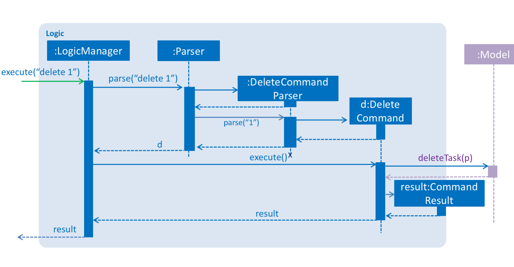

# TaskBoss - Developer Guide

By : `Team W14-B2`  &nbsp;&nbsp;&nbsp;&nbsp; Since: `Mar 2017`  &nbsp;&nbsp;&nbsp;&nbsp; Licence: `MIT`

---

1. [Setting Up](#1-setting-up)
2. [Target Users](#2-target-users)
3. [Design](#3-design)
4. [Implementation](#4-implementation)
5. [Testing](#5-testing)
6. [Dev Ops](#6-dev-ops)

* [Appendix A: User Stories](#appendix-a--user-stories)
* [Appendix B: Use Cases](#appendix-b--use-cases)
* [Appendix C: Non Functional Requirements](#appendix-c--non-functional-requirements)
* [Appendix D: Glossary](#appendix-d--glossary)
* [Appendix E : Product Survey](#appendix-e--product-survey)

## 1. Setting up

### 1.1. Prerequisites

1. **JDK `1.8.0_60`**  or later 

    > Having any Java 8 version is not enough.  
    TaskBoss app will not work with earlier versions of Java 8.

2. **Eclipse** IDE
3. **e(fx)clipse** plugin for Eclipse (Follow instructions from step two onwards given in
   [this page](http://www.eclipse.org/efxclipse/install.html#for-the-ambitious))
4. **Buildship Gradle Integration** plugin from the Eclipse Marketplace
5. **Checkstyle Plug-in** plugin from the Eclipse Marketplace

### 1.2. Importing TaskBoss into Eclipse

1. Fork this repo, and clone the fork to your computer
2. Open Eclipse (Note: Ensure you have installed the **e(fx)clipse** and **buildship** plugins as given
   in the prerequisites above)
3. Click `File` > `Import`
4. Click `Gradle` > `Gradle Project` > `Next` > `Next`
5. Click `Browse`, then locate the project's directory
6. Click `Finish`

  > * If you are asked whether to 'keep' or 'overwrite' config files, choose to 'keep'.
  > * Depending on your connection speed and server load, it can take up to 30 minutes for the set up to finish
      (This is because Gradle downloads library files from servers during the project set up process).
  > * If Eclipse auto-changed any settings files during the import process, you can discard those changes.

### 1.3. Configuring Checkstyle
1. Click `Project` -> `Properties` -> `Checkstyle` -> `Local Check Configurations` -> `New...`
2. Choose `External Configuration File` under `Type`
3. Enter an arbitrary configuration name e.g. taskboss
4. Import checkstyle configuration file found at `config/checkstyle/checkstyle.xml`
5. Click `OK` once, go to the `Main` tab, and use the newly imported check configuration
6. Tick `files from packages`, click `Change...`, and select the `resources` package
7. Click `OK` twice, and rebuild project if prompted

> Note: click on the `files from packages` text after ticking in order to enable the `Change...` button.

### 1.4. Troubleshooting project setup

**Problem: Eclipse reports compile errors after new commits are pulled from Git**

* Reason: Eclipse fails to recognize new files that appeared due to the Git pull
* Solution: Right click on the project (in Eclipse package explorer), choose `Gradle` -> `Refresh Gradle Project`

**Problem: Eclipse reports some required libraries missing**

* Reason: Required libraries may not have been downloaded during the project import
* Solution: [Run tests using Gradle](UsingGradle.md) once (to refresh the libraries)

## 2. Target Users

Our target users (eg. *Jim*) are people who:
* Usually work alone on their personal or office computer
* Do not share their computer with others
* Prefer a command-line approach over a mouse-clicking approach
* Would like to have an organized set up of tasks to categorize, sort, and prioritize them for ease of task management

## 3. Design

### 3.1. Architecture

 
_Figure 2.1.1 : Architecture Diagram_

The **_Architecture Diagram_** given above explains the high-level design of TaskBoss.
Given below is a quick overview of each component.

**`Main`** has only one class called [`MainApp`](../src/main/java/seedu/taskboss/MainApp.java). It is responsible for:

* Initializing the components in the correct sequence, and connecting them up with each other at app launch
* Shutting down the components and invoking cleanup method where necessary at shut down

[**`Commons`**](#36-common-classes) has a collection of classes used by multiple other components.
Two of those classes play important roles at the architecture level:

* [`EventsCenter`](../src/main/java/seedu/taskboss/commons/core/EventsCenter.java) : This class (written using [Google's Event Bus library](https://github.com/google/guava/wiki/EventBusExplained))
  is used by components to communicate with other components using events (i.e. a form of _Event Driven_ design)
* [`LogsCenter`](../src/main/java/seedu/taskboss/commons/core/LogsCenter.java) : This class is used by many classes to write log messages to TaskBoss' log file

The rest of the TaskBoss consists of four components:

* [**`UI`**](#32-ui-component) : The UI of TaskBoss
* [**`Logic`**](#33-logic-component) : The command executor
* [**`Model`**](#34-model-component) : The data holder of TaskBoss in-memory
* [**`Storage`**](#35-storage-component) : The data reader and writer to and from the hard disk

Each of the four components:

* Defines its _API_ in an `interface` with the same name as the component
* Exposes its functionality using a `{Component Name}Manager` class

> For example, the [**`Logic`**](#33-logic-component) component (see the class diagram given below) defines its API in the [`Logic.java`](../src/main/java/seedu/taskboss/logic/Logic.java)
interface and exposes its functionality using the [`LogicManager.java`](../src/main/java/seedu/taskboss/logic/LogicManager.java) class. 

 
_Figure 2.1.2 : Class Diagram of the Logic Component_

#### Events-Driven nature of the design

The _Sequence Diagram_ below shows how the components interact for the scenario where the user issues the
command `delete 1`.

 
_Figure 2.1.3a : Component interactions for `delete 1` command (part 1)_

> Note how the `Model` component simply raises a `TaskBossChangedEvent` when the TaskBoss data is changed,
 instead of asking the `Storage` component to save the updates to the hard disk.

The diagram below shows how the [`EventsCenter`](../src/main/java/seedu/taskboss/commons/core/EventsCenter.java) reacts to that event, which eventually results in the updates being saved to the hard disk and the status bar of the user interface being updated to reflect the 'Last Updated' time.  

 
_Figure 2.1.3b : Component interactions for `delete 1` command (part 2)_

> Note how the event is propagated through the [`EventsCenter`](../src/main/java/seedu/taskboss/commons/core/EventsCenter.java) to the `Storage` and `UI` components without the `Model` component having to be coupled to either of them. This is an example of how this event-driven approach helps us reduce direct coupling between components.

The sections below give more details of each component.

### 3.2. UI component

Author: Tan Wei

 
_Figure 2.2.1 : Structure of the UI Component_

**API** : [`Ui.java`](../src/main/java/seedu/taskboss/ui/Ui.java)

The [**`UI`**](#32-ui-component) component consists of a `MainWindow` that is made up of parts e.g.`CommandBox`, `ResultDisplay`, `CategoryPanel`,
`AllTasksPanel`, `StatusBarFooter`, `HelpWindow` etc. All these, including the `MainWindow`, inherit from the abstract `UiPart` class.

The [**`UI`**](#32-ui-component) component uses JavaFx UI framework. The layout of these UI parts are defined in matching `.fxml` files that are in the `src/main/resources/view` folder. 
 
> For example, the layout of the [`MainWindow`](../src/main/java/seedu/taskboss/ui/MainWindow.java) is specified in
 [`MainWindow.fxml`](../src/main/resources/view/MainWindow.fxml)

The [**`UI`**](#32-ui-component) component,

* Executes user commands using the [**`Logic`**](#33-logic-component) component
* Binds itself to some data in the [**`Model`**](#34-model-component) component so that the user interface can auto-update when data in the [**`Model`**](#34-model-component) component change
* Responds to events raised from various parts of the TaskBoss and updates the user interface accordingly

### 3.3. Logic component

Author: Alsharef Haya Fayez M

 
_Figure 2.3.1 : Structure of the Logic Component_

**API** : [`Logic.java`](../src/main/java/seedu/taskboss/logic/Logic.java)

The [**`Logic`**](#33-logic-component) component,

* Uses the `Parser` class to parse the user command.
* Executes a `Command` object via the `LogicManager`.
* Affects the [**`Model`**](#34-model-component) component (e.g. *adding a person*) and/or raises events.
* Encapsulates as a `CommandResult` object which is passed back to the [**`UI`**](#32-ui-component) component.

Given below is the Sequence Diagram for interactions within the [**`Logic`**](#33-logic-component) component for the *`execute("delete 1")`*
 API call. 
 
 
_Figure 2.3.1 : Interactions Inside the Logic Component for the `delete 1` Command_

### 3.4. Model component

Author: Xu Ruolan

 
_Figure 2.4.1 : Structure of the Model Component_

**API** : [`Model.java`](../src/main/java/seedu/taskboss/model/Model.java)

The [**`Model`**](#34-model-component) component,

* Stores a `UserPref` object that represents the user's preferences
* Stores the TaskBoss data
* Exposes a `UnmodifiableObservableList<ReadOnlyTask>` that can be 'observed' e.g. the [**`UI`**](#32-ui-component) component can be bound to this list so that the user interface automatically updates when the data in the list change
* Does not depend on any of the other three components

### 3.5. Storage component

Author: Soh Wei Kiat Melvin

 
_Figure 2.5.1 : Structure of the Storage Component_

**API** : [`Storage.java`](../src/main/java/seedu/taskboss/storage/Storage.java)

The [**`Storage`**](#35-storage-component) component,

* Saves `UserPref` objects in json format and reads it back.
* Saves the TaskBoss data in xml format and reads it back.

### 3.6. Common classes

Classes used by multiple components are in the `seedu.taskboss.commons` package.

## 4. Implementation

### 4.1. Logging

We are using `java.util.logging` package for logging. The [`LogsCenter`](../src/main/java/seedu/taskboss/commons/core/LogsCenter.java) class is used to manage the logging levels and logging destinations.

* The logging level can be controlled using the `logLevel` setting in the configuration file
  (See [Configuration](#configuration))
* The `Logger` for a class can be obtained using `LogsCenter.getLogger(Class)` which will log messages according to
  the specified logging level
* The log messages are outputted through `Console` and to a `.log` file

**Logging Levels**

* `SEVERE` : Critical problem detected which may possibly cause the termination of the application
* `WARNING` : Can continue running, but with caution
* `INFO` : Information showing the noteworthy actions by TaskBoss
* `FINE` : Details that are not usually noteworthy but may be useful in debugging
  (e.g. *print the actual list instead of just its size*)

### 4.2. Configuration

Certain properties of the application can be controlled (*e.g App name, logging level*) through the configuration file
(default: `config.json`).

## 5. Testing

Tests can be found in the `./src/test/java` folder.

**In Eclipse**:

* To run all tests, right-click on the `src/test/java` folder and choose
  `Run as` > `JUnit Test`
* To run a subset of tests, you can right-click on a test package, test class, or a test and choose
  to run as a JUnit test

**Using Gradle**:

* See [UsingGradle.md](UsingGradle.md) for how to run tests using Gradle

We have two types of tests:

* **GUI Tests** - These are _System Tests_ that test TaskBoss by simulating user actions on the GUI.
   These are in the `guitests` package.

* **Non-GUI Tests** - These are tests that do not involve the GUI. They include:
   1. _Unit tests_ that target the lowest level methods/classes.  
      e.g. *`seedu.taskboss.commons.UrlUtilTest`*
   2. _Integration tests_ that check the integration of multiple code units
     (those code units are assumed to be working). 
      e.g. *`seedu.taskboss.storage.StorageManagerTest`*
   3. Hybrids of unit and integration tests that check multiple code units as well as
      how they are connected together. 
      e.g. *`seedu.taskboss.logic.LogicManagerTest`*

#### Headless GUI Testing
Thanks to the [TestFX](https://github.com/TestFX/TestFX) library we use,
 our GUI tests can be run in the _headless_ mode.
 In the headless mode, GUI tests do not show up on the screen.
 That means the developer can do other things on the computer while the tests are running. 
 See [UsingGradle.md](UsingGradle.md#running-tests) to learn how to run tests in the _headless_ mode.

### 5.1. Troubleshooting tests

 **Problem: Tests fail because of NullPointerException when AssertionError is expected**

 * Reason: Assertions are not enabled for JUnit tests
   This can happen if you are not using a recent Eclipse version (i.e. _Neon_ or later)
 * Solution: Enable assertions in JUnit tests as described
   [here](http://stackoverflow.com/questions/2522897/eclipse-junit-ea-vm-option)  
   Delete run configurations created if you ran tests earlier

## 6. Dev Ops

### 6.1. Building Automation

See [UsingGradle.md](UsingGradle.md) to learn how to use Gradle for build automation.

### 6.2. Performing Continuous Integration

We use [Travis CI](https://travis-ci.org/) and [AppVeyor](https://www.appveyor.com/) to perform _Continuous Integration_ on our projects.
See [UsingTravis.md](UsingTravis.md) and [UsingAppVeyor.md](UsingAppVeyor.md) for more details.

### 6.3. Publishing Documentation

See [UsingGithubPages.md](UsingGithubPages.md) to learn how to use GitHub Pages to publish documentation to the
project site.

### 6.4. Making a Release

Here are the steps to create a new release.

 1. Generate a JAR file [using Gradle](UsingGradle.md#creating-the-jar-file)
 2. Tag the repo with the version number. e.g. `v0.1`
 3. [Create a new release using GitHub](https://help.github.com/articles/creating-releases/)
    and upload the JAR file you created

### 6.5. Converting Documentation to PDF format

We use [Google Chrome](https://www.google.com/chrome/browser/desktop/) for converting documentation to PDF format,
as Chrome's PDF engine preserves hyperlinks used in webpages.

Here are the steps to convert the project documentation files to PDF format:

 1. Make sure you have set up GitHub Pages as described in [UsingGithubPages.md](UsingGithubPages.md#setting-up)
 2. Using Chrome, go to the [GitHub Pages version](UsingGithubPages.md#viewing-the-project-site) of the
    documentation file  
    (e.g. *For [UserGuide.md](UserGuide.md), the URL will be `https://cs2103jan2017-w14-b2.github.io/main/docs/UserGuide.html`*)
 3. Click on the `Print` option in Chrome's menu
 4. Set the destination to `Save as PDF`, then click `Save` to save a copy of the file in PDF format  
    For best results, use the settings indicated in the screenshot below  
    
     
    _Figure 5.4.1 : Saving Documentation as PDF Files in Chrome_

### 6.6. Managing Dependencies

A project often depends on third-party libraries. For example, TaskBoss depends on the
[Jackson library](http://wiki.fasterxml.com/JacksonHome) for XML parsing. Managing these dependencies
can be automated using Gradle. For example, Gradle can download the dependencies automatically, which
is better than these alternatives that:  
* Include those libraries in the repo (this bloats the repo size) 
* Require developers to download those libraries manually (this creates extra work for developers) 

## Appendix A : User Stories

Priorities: High (must have) - `* * *`, Medium (nice to have)  - `* *`,  Low (unlikely to have) - `*`

Priority | As a ... | I want to ... | So that I can...
-------- | :-------- | :--------- | :-----------
`* * *` | new user | see a list of available commands | refer to that list when I forget how to use TaskBoss
`* * *` | user | add tasks | record tasks that I need to get done |
`* * *` | user | delete tasks | get rid of tasks that I no longer need
`* * *` | user | edit tasks | update any outdated information
`* * *` | user | see a list of all the tasks | view all my pending tasks
`* * *` | user | mark my tasks as done | keep track of my tasks' status
`* * *` | user | set deadlines for tasks that have due dates | track the urgency of any given task
`* * *` | user | sort the tasks based on their deadlines | know the most urgent task to address
`* * *` | user | search for any task | find a task if I remember some keywords from the description
`* * *` | user | type shorter commands | execute commands faster
`* *` | user | add a description to my tasks | keep note of the details related to any given task
`* *` | user | undo a command | undo any accidental actions
`* *` | user | export all the tasks into a specified file | save my tasks in my computer
`* *` | user | set start and end times for any given task | cater for any event that I need to attend
`* *` | user | set priority levels for each of my tasks | give my attention to tasks without deadlines that are urgent
`* *` | user | sort my tasks based on priority | check what I need to do urgently
`* *` | user | categorize my tasks | keep my tasks organized
`* *` | user | see the tasks under a specific category | better manage my pending tasks
`* *` | user | see the tasks that I have completed | re-trace my completed tasks if need be
`* *` | user | view a specific task | focus on that task alone
`* *` | user | clear all tasks under a specific category | delete a bulk of tasks at one time
`*` | user | set recurring tasks | add repeating tasks in one go
`*` | user | set reminders | be reminded of tasks if need be
`*` | user | set locations | check locations of the tasks (if any)
`*` | user | add people | check people associated with the task (if any)
`*` | user | create labels for tasks | easily group similar tasks together
`*` | user | redo a command after undoing a command | revert the state of TaskBoss if need be
`*` | user | integrate Google Calendar | see a monthly view of my tasks
`*` | user | view all tasks that are between a specified date/time interval | focus on a particular set of tasks

## Appendix B : Use Cases

(For all use cases below, the **System** is`TaskBoss` and the **Actor** is the `user`, unless specified otherwise)

### Use case: Add a task

**MSS**

1.  User requests to add a task according to some parameters
2.  TaskBoss adds the new task  
Use case ends

**Extensions**

1a. User input is invalid

> 1a1. TaskBoss shows an error message  
Use case ends

1b. User enters a category that does not match any existing category

> 1b1. TaskBoss adds the new task and creates a category with the user-specified name  
Use case ends

1c. User enters incorrect format for date or time

> 1c1. TaskBoss shows an error message  
Use case ends

1d. User enters the same start time and end time

> 1d1. TaskBoss shows an error message  
Use case ends

1e. User enters a start time that is later than the end time

> 1e1. TaskBoss shows an error message  
Use case ends
  
### Use case: List all tasks

**MSS**

1.  User requests to list all tasks
2.  TaskBoss displays all tasks  
Use case ends

**Extensions**

1a.  No tasks to display

> 1a1. TaskBoss shows “No tasks to display” message  
Use case ends

### Use case: Edit a task

**MSS**

1.  User requests to edit certain attribute(s) of a task
2.  TaskBoss updates the task  
Use case ends

**Extensions**

1a. User enters an invalid task index

> 1a1. TaskBoss shows an error message  
Use case ends

### Use case: Delete a task

**MSS**

1.  User requests to delete a task
2.  TaskBoss deletes that specific task  
Use case ends

**Extensions**

1a. User enters an invalid task index

> 1a1. TaskBoss shows an error message  
Use case ends

### Use case: Mark task as done

**MSS**

1. User requests to mark a task as done
2. TaskBoss adds the task to the ‘Done’ category, and removes it from ‘All Tasks’ and the task’s current category  
Use case ends

**Extensions**

1a. User enters an invalid task index

> 1a1. TaskBoss shows an error message  
Use case ends

### Use case: Sort tasks by deadline

**MSS**

1. User requests to sort tasks by deadline
2. TaskBoss displays list of tasks sorted by deadline  
Use case ends

### Use case: Undo previous command

**MSS**

1. User requests to undo previous command
2. TaskBoss undoes previous command and returns to the previous state  
Use case ends

**Extensions**

2a. There is no last operation

> 2a1. TaskBoss shows an error message  
Use case ends

### Use case: Export tasks to an existing filepath

**MSS**

1. User requests to export tasks to an existing filepath for data storage
2. TaskBoss changes the storage location, and saves all existing data into the specified filepath  
Use case ends

**Extensions**

2a. TaskBoss cannot access the given file path

> 2a1. TaskBoss shows an error message  
Use case ends

2b. TaskBoss cannot find the given file path

> 2b1. TaskBoss creates a new filepath  
Use case ends

#### Use case: Export tasks to a new filepath

**MSS**

1. User requests to export tasks to a new file for data storage, specifying the new filepath  
2. TaskBoss saves all existing data into the new file  
Use case ends

**Extensions**

2a. TaskBoss cannot access the given file path

> 2a1. TaskBoss shows an error message. 
 Use case ends
 
### Use case: Search tasks

**MSS**

1. User requests to search for tasks (by description, task title, or deadline) by keywords 
2. TaskBoss displays list of tasks containing keyword  
Use case ends

**Extensions**

3a. The task does not exist

> 3a1. TaskBoss shows “0 tasks found” message.  
Use case ends.
 
### Use case: List tasks by category

**MSS**

1. User requests to list tasks by specified category
2. TaskBoss displays all tasks of the category that user requests  
Use case ends

**Extension**

3a. The category does not exist

> 3a1. TaskBoss shows “0 tasks found” message  
Use case ends

### Use case: Create new category

**MSS**

1. User requests to create a new category and specifies name
2. TaskBoss creates category  
Use case ends.

**Extensions**

1a. Category name already exists

> 1a1. TaskBoss shows an error message  
Use case ends

### Use Case: Edit category name

**MSS**

1. User requests to edit category name
2. TaskBoss updates the category name  
Use case ends.

**Extensions**

1a. Category to be edited does not exist.
		
> 1a1. TaskBoss shows error message “Category does not exist”  
Use case ends

2a. Category name already exists

> 2a1. TaskBoss shows an error message  
Use case ends

### Use case: Clear tasks under certain category

**MSS**

1. User requests to clear all tasks of certain category
2. TaskBoss clears all tasks of the specified category  
Use case ends

**Extensions**

1a. User enters a category that does not match any existing category

> 1a1. TaskBoss shows an error message  
Use case ends

### Use case: Display help guide

**MSS**

1. User requests for help guide
2. TaskBoss displays the help guide window
3. User types any key in the command line
4. TaskBoss closes help guide window  
Use case ends

### Use case: View a specific task

**MSS**

1. User requests to view a specific task
2. TaskBoss displays the task  
Use case ends

**Extensions**

1a. User enters an invalid task index

> 1a1. TaskBoss shows an error message. 
Use case ends  

### Use case: Exit TaskBoss

**MSS**

1. User requests to exit TaskBoss application
2. TaskBoss exits  
User case ends

## Appendix C : Non Functional Requirements

* Should handle at least 100 tasks
* Should work without Internet connection
* Should have an intuitive user interface
* Should start up in less than two seconds
* Should respond to commands in less than one second
* Should come with automated unit tests and open source code
 

## Appendix D : Glossary

##### Task index

> A number assigned to each tasks to ease referrals when deleting or editing.

##### Category

> A way for the user to classify tasks.

##### Done tasks

> Tasks that have been completed.

##### Previous command

> The last executed command.

## Appendix E : Product Survey

### Google Keep

Author: Al Sharef Haya Fayez M

**Pros:**

* Uses sticky notes to record tasks
* Has colourful user interface
* Provides instant capturing of anything by speech and pictures
* Integrates with Google Drive and Google Docs
* Free of charge
* Supports offline editing  

**Cons:**

* Does not support calendar view
* Hard to organize when there is a large number of notes
* Unable to categorize tasks
* Does not support typed commands
* Depends on mouse clicks  

**Verdict-No**

Having a colourful user interface would be a plus but our target user is someone who prefer typed commands over mouse clicks, which Google Keep does not support.

### MeisterTask

Author: Tan Wei

**Pros:**

* Has beautiful user interface
* Free of charge for personal use
* Supports third-party application integrations (*e.g. Google, Dropbox*)
* Available across most platforms (*e.g. Web app, Android, OS X*)
* Can enable task relationships  

**Cons:**

* Does not support calendar view
* Hard to organize when there is a large number of tasks
* Unable to set recurring tasks
* Unable to set task reminders  

**Verdict-No**

The fact that MeisterTask is available across many platforms sounds intriguing, but it is not useful in the case of our target users. In addition, our target users most probably need to set recurring tasks.

### Just

Author: Xu Ruolan

**Pros:**
* Has intuitive user interface
* Provides statistical analysis to track daily/monthly/yearly statistics
* Able to categorize tasks
* Able to prioritize tasks
* Able to set task reminders  

**Cons:**

* Hard to organize when there is a large number of tasks  

**Verdict-No**

Statistical analysis would be useful for our target users as they are most probably office workers, but Just does not accept typed command-line inputs which are important to our target users.

### Persoda

Author: Soh Wei Kiat Melvin

**Pros:**
 
* Has an intuitive interface
* Provides secure accounts and protected password
* Provides a wide range of functions
* Able to set task reminders/hierarchy 
* Able to prioritize tasks
* Supports instant messaging teams among users  

**Cons:**

* Requires users to pay per usage
* Might be confusing to new users as features are based off different price plans  

**Verdict-No**

Secured accounts and protected password are an added plus to have in any task manager, but they are not necessary in the case of our target users as they never share their computers.
