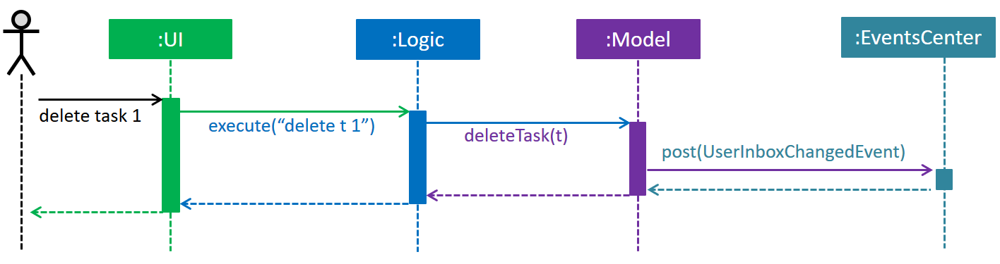
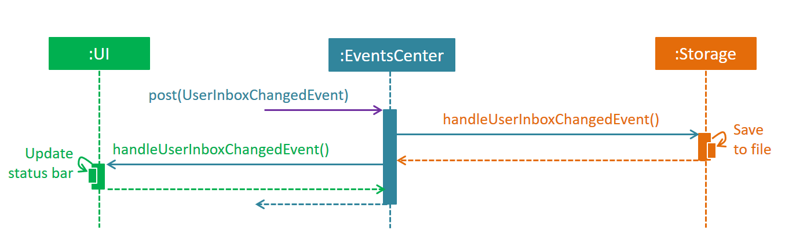

# TaskCrusher - Developer Guide

By : `Team T15B1`  &nbsp;&nbsp;&nbsp;&nbsp; Since: `Feb 2017`  &nbsp;&nbsp;&nbsp;&nbsp; Licence: `MIT`

---

1. [Setting Up](#setting-up)
2. [Design](#design)
3. [Implementation](#implementation)
4. [Testing](#testing)
5. [Dev Ops](#dev-ops)

* [Appendix A: User Stories](#appendix-a--user-stories)
* [Appendix B: Use Cases](#appendix-b--use-cases)
* [Appendix C: Non Functional Requirements](#appendix-c--non-functional-requirements)
* [Appendix D: Glossary](#appendix-d--glossary)
* [Appendix E : Product Survey](#appendix-e--product-survey)

## 1. Setting up

### 1.1. Prerequisites

1. **JDK `1.8.0_60`**  or later 

    > Having any Java 8 version is not enough.  
    This app will not work with earlier versions of Java 8.

2. **Eclipse** IDE
3. **e(fx)clipse** plugin for Eclipse (Do the steps 2 onwards given in
   [this page](http://www.eclipse.org/efxclipse/install.html#for-the-ambitious))
4. **Buildship Gradle Integration** plugin from the Eclipse Marketplace
5. **Checkstyle Plug-in** plugin from the Eclipse Marketplace

### 1.2. Importing the project into Eclipse

0. Fork this repo, and clone the fork to your computer
1. Open Eclipse (Note: Ensure you have installed the **e(fx)clipse** and **buildship** plugins as given
   in the prerequisites above)
2. Click `File` > `Import`
3. Click `Gradle` > `Gradle Project` > `Next` > `Next`
4. Click `Browse`, then locate the project's directory
5. Click `Finish`

  > * If you are asked whether to 'keep' or 'overwrite' config files, choose to 'keep'.
  > * Depending on your connection speed and server load, it can even take up to 30 minutes for the set up to finish
      (This is because Gradle downloads library files from servers during the project set up process)
  > * If Eclipse auto-changed any settings files during the import process, you can discard those changes.

### 1.3. Configuring Checkstyle
1. Click `Project` -> `Properties` -> `Checkstyle` -> `Local Check Configurations` -> `New...`
2. Choose `External Configuration File` under `Type`
3. Enter an arbitrary configuration name e.g. taskmanager
4. Import checkstyle configuration file found at `config/checkstyle/checkstyle.xml`
5. Click OK once, go to the `Main` tab, use the newly imported check configuration.
6. Tick and select `files from packages`, click `Change...`, and select the `resources` package
7. Click OK twice. Rebuild project if prompted

> Note to click on the `files from packages` text after ticking in order to enable the `Change...` button

### 1.4. Troubleshooting project setup

**Problem: Eclipse reports compile errors after new commits are pulled from Git**

* Reason: Eclipse fails to recognize new files that appeared due to the Git pull.
* Solution: Refresh the project in Eclipse: 
  Right click on the project (in Eclipse package explorer), choose `Gradle` -> `Refresh Gradle Project`.

**Problem: Eclipse reports some required libraries missing**

* Reason: Required libraries may not have been downloaded during the project import.
* Solution: [Run tests using Gradle](UsingGradle.md) once (to refresh the libraries).

## 2. Design

### 2.1. Architecture

 
_Figure 2.1.1 : Architecture Diagram_

The **_Architecture Diagram_** given above explains the high-level design of the App.
Given below is a quick overview of each component.

> Tip: The `.pptx` files used to create diagrams in this document can be found in the [diagrams](diagrams/) folder.
> To update a diagram, modify the diagram in the pptx file, select the objects of the diagram, and choose `Save as picture`.

`Main` has only one class called [`MainApp`](../src/main/java/project/taskcrusher/MainApp.java). It is responsible for,

* At app launch: Initializes the components in the correct sequence, and connects them up with each other.
* At shut down: Shuts down the components and invokes cleanup method where necessary.

[**`Commons`**](#common-classes) represents a collection of classes used by multiple other components.
Two of those classes play important roles at the architecture level.

* `EventsCenter` : This class (written using [Google's Event Bus library](https://github.com/google/guava/wiki/EventBusExplained))
  is used by components to communicate with other components using events (i.e. a form of _Event Driven_ design)
* `LogsCenter` : Used by many classes to write log messages to the App's log file.

The rest of the App consists of four components.

* [**`UI`**](#ui-component) : The UI of the App.
* [**`Logic`**](#logic-component) : The command executor.
* [**`Model`**](#model-component) : Holds the data of the App in-memory.
* [**`Storage`**](#storage-component) : Reads data from, and writes data to, the hard disk.

Each of the four components

* Defines its _API_ in an `interface` with the same name as the Component.
* Exposes its functionality using a `{Component Name}Manager` class.

For example, the `Logic` component (see the class diagram given below) defines it's API in the `Logic.java`
interface and exposes its functionality using the `LogicManager.java` class. 
 
_Figure 2.1.2 : Class Diagram of the Logic Component_

#### Events-Driven nature of the design

The _Sequence Diagram_ below shows how the components interact for the scenario where the user issues the
command `delete t 1`.

 
_Figure 2.1.3a : Component interactions for `delete t 1` command (part 1)_

>Note how the `Model` simply raises a `UserInboxChangedEvent` when the UserInbox data are changed,
 instead of asking the `Storage` to save the updates to the hard disk.

The diagram below shows how the `EventsCenter` reacts to that event, which eventually results in the updates
being saved to the hard disk and the status bar of the UI being updated to reflect the 'Last Updated' time.  
 
_Figure 2.1.3b : Component interactions for `delete t 1` command (part 2)_

> Note how the event is propagated through the `EventsCenter` to the `Storage` and `UI` without `Model` having
  to be coupled to either of them. This is an example of how this Event Driven approach helps us reduce direct
  coupling between components.

The sections below give more details of each component.

### 2.2. UI component

Author: Yoshi Nishimura

 
_Figure 2.2.1 : Structure of the UI Component_

**API** : [`Ui.java`](../src/main/java/project/taskcrusher/ui/Ui.java)

The UI consists of a `MainWindow` that is made up of parts e.g.`CommandBox`, `ResultDisplay`, `UserInboxPanel` and its components, and `StatusBarFooter`. All these, including the `MainWindow`, inherit from the abstract `UiPart` class.

The `UI` component uses JavaFx UI framework. The layout of these UI parts are defined in matching `.fxml` files
 that are in the `src/main/resources/view` folder. 
 For example, the layout of the [`MainWindow`](../src/main/java/project/taskcrusher/ui/MainWindow.java) is specified in
 [`MainWindow.fxml`](../src/main/resources/view/MainWindow.fxml)

The `UI` component,

* Executes user commands using the `Logic` component through `CommandBox`.
* Binds itself to some data in the `Model` so that the UI can auto-update when data in the `Model` change.
* Responds to events raised from various parts of the App and updates the UI accordingly. For example, when the user has made changes to the underlying `Model` data by deleting a task, the `statusBar` will update its `syncStatus` field through `UserInboxChangedEvent`.

**The `UserInboxPanel`:**
- contains two `ListView`s, namely, `taskList` and `eventList`.
- The visibility of these two lists will be altered according to the command entered. For example, if the user wants to list tasks whose deadlines are set before next Monday, he would type in `list t d/next Monday`. This command would set the visibility of `eventList` to hidden so that the user can use the entire window to list the tasks he/she is interested in. This is accomplished by the `Model` posting `taskListToShowUpdatedEvent` and `eventListShowUpdatedEvent` and the `UserInboxPanel` listening to these events to determine whether the filtered lists are empty or not.

### 2.3. Logic component

Author: Brea Dionisio

 
_Figure 2.3.1 : Structure of the Logic Component_

**API** : [`Logic.java`](../src/main/java/project/taskcrusher/logic/Logic.java)

1. `Logic` uses the `Parser` class to parse the user command.
2. `Parser` calls the appropriate parser for the identified command, e.g. `AddCommandParser` and `DeleteCommandParser`
3. The command parser creates the appropriate task or event version of the command, e.g. `AddTaskCommand` and `AddEventCommand`
4. This `Command` object is executed by the `LogicManager`.
5. The command execution can affect the `Model` (e.g. editing a task) and/or raise events.
6. The result of the command execution is encapsulated as a `CommandResult` object which is passed back to the `Ui`.

Given below is the Sequence Diagram for interactions within the `Logic` component for the `execute("delete t 1")`
 API call. 
 
_Figure 2.3.1 : Interactions Inside the Logic Component for the `delete t 1` Command_

### 2.4. Model component

Author: Yoshi Nishimura

 
_Figure 2.4.1.1 : Structure of the Model Component1/2_

  
_Figure 2.4.1.2 : Structure of the Model Component2/2_

**API** : [`Model.java`](../src/main/java/project/taskcrusher/model/Model.java)

The `Model`,

* stores a `UserPref` object that represents the user's preferences.
* stores the User inbox data, including the list of events, list of tasks and list of tags associated with the items in user inbox.
* exposes a `UnmodifiableObservableList<ReadOnlyTask>` and `UnmodifiableObservableList<ReadOnlyEvent>` that can be 'observed' e.g. the `UserInboxPanel` in UI can be notified of any updates so that the UI automatically updates when the data in the list change.
* does not depend on any of the other three components.
* `Task` and `Event` inherits of `UserItem`.

**Task** consists of:
1. Name
2. Deadline (optional)
3. Priority: 1, 2, 3 in ascending order (optional. default = 0)
4. Description (optional)
5. Zero or more tags

**Event** consists of:
1. Name
2. One or more Timeslots
3. Location (optional)
4. Description (optional)
5. Zero or more tags

**Note**: the reason why although some elements are optional but are still tied as composition is that when they are not supplied by the user, the `Model` would set their values to default values (e.g. empty string).

### 2.5. Storage component

Author: Yoshi Nishimura

 
_Figure 2.5.1 : Structure of the Storage Component_

**API** : [`Storage.java`](../src/main/java/project/taskcrusher/storage/Storage.java)

The `Storage` component,

* can save `UserPref` objects in json format and read it back.
* can save the `UserInbox` data in xml format and read it back.
* gets notified of the changes in model by `UserInboxChangedEvent` posted by the `Model` each time it updates the data upon executing add, delete or edit. This way, the coupling between `Storage` and `Model` is reduced.

### 2.6. Common classes

Classes used by multiple components are in the `project.taskcrusher.commons` package.

## 3. Implementation

### 3.1. Logging

We are using `java.util.logging` package for logging. The `LogsCenter` class is used to manage the logging levels
and logging destinations.

* The logging level can be controlled using the `logLevel` setting in the configuration file
  (See [Configuration](#configuration))
* The `Logger` for a class can be obtained using `LogsCenter.getLogger(Class)` which will log messages according to
  the specified logging level
* Currently log messages are output through: `Console` and to a `.log` file.

**Logging Levels**

* `SEVERE` : Critical problem detected which may possibly cause the termination of the application
* `WARNING` : Can continue, but with caution
* `INFO` : Information showing the noteworthy actions by the App
* `FINE` : Details that is not usually noteworthy but may be useful in debugging
  e.g. print the actual list instead of just its size

### 3.2. Configuration

Certain properties of the application can be controlled (e.g App name, logging level) through the configuration file
(default: `config.json`):

## 4. Testing

Tests can be found in the `./src/test/java` folder.

**In Eclipse**:

* To run all tests, right-click on the `src/test/java` folder and choose
  `Run as` > `JUnit Test`
* To run a subset of tests, you can right-click on a test package, test class, or a test and choose
  to run as a JUnit test.

**Using Gradle**:

* See [UsingGradle.md](UsingGradle.md) for how to run tests using Gradle.

We have two types of tests:

1. **GUI Tests** - These are _System Tests_ that test the entire App by simulating user actions on the GUI.
   These are in the `guitests` package.

2. **Non-GUI Tests** - These are tests not involving the GUI. They include,
   1. _Unit tests_ targeting the lowest level methods/classes.  
      e.g. `project.taskcrusher.commons.UrlUtilTest`
   2. _Integration tests_ that are checking the integration of multiple code units
     (those code units are assumed to be working). 
      e.g. `project.taskcrusher.storage.StorageManagerTest`
   3. Hybrids of unit and integration tests. These test are checking multiple code units as well as
      how the are connected together. 
      e.g. `project.taskcrusher.logic.LogicManagerTest`

#### Headless GUI Testing
Thanks to the [TestFX](https://github.com/TestFX/TestFX) library we use,
 our GUI tests can be run in the _headless_ mode.
 In the headless mode, GUI tests do not show up on the screen.
 That means the developer can do other things on the Computer while the tests are running. 
 See [UsingGradle.md](UsingGradle.md#running-tests) to learn how to run tests in headless mode.

### 4.1. Troubleshooting tests

 **Problem: Tests fail because NullPointException when AssertionError is expected**

 * Reason: Assertions are not enabled for JUnit tests.
   This can happen if you are not using a recent Eclipse version (i.e. _Neon_ or later)
 * Solution: Enable assertions in JUnit tests as described
   [here](http://stackoverflow.com/questions/2522897/eclipse-junit-ea-vm-option).  
   Delete run configurations created when you ran tests earlier.

## 5. Dev Ops

### 5.1. Build Automation

See [UsingGradle.md](UsingGradle.md) to learn how to use Gradle for build automation.

### 5.2. Continuous Integration

We use [Travis CI](https://travis-ci.org/) and [AppVeyor](https://www.appveyor.com/) to perform _Continuous Integration_ on our projects.
See [UsingTravis.md](UsingTravis.md) and [UsingAppVeyor.md](UsingAppVeyor.md) for more details.

### 5.3. Publishing Documentation

See [UsingGithubPages.md](UsingGithubPages.md) to learn how to use GitHub Pages to publish documentation to the
project site.

### 5.4. Making a Release

Here are the steps to create a new release.

 1. Generate a JAR file [using Gradle](UsingGradle.md#creating-the-jar-file).
 2. Tag the repo with the version number. e.g. `v0.1`
 2. [Create a new release using GitHub](https://help.github.com/articles/creating-releases/)
    and upload the JAR file you created.

### 5.5. Converting Documentation to PDF format

We use [Google Chrome](https://www.google.com/chrome/browser/desktop/) for converting documentation to PDF format,
as Chrome's PDF engine preserves hyperlinks used in webpages.

Here are the steps to convert the project documentation files to PDF format.

 1. Make sure you have set up GitHub Pages as described in [UsingGithubPages.md](UsingGithubPages.md#setting-up).
 1. Using Chrome, go to the [GitHub Pages version](UsingGithubPages.md#viewing-the-project-site) of the
    documentation file.  
    e.g. For [UserGuide.md](UserGuide.md), the URL is TBC
 1. Click on the `Print` option in Chrome's menu.
 1. Set the destination to `Save as PDF`, then click `Save` to save a copy of the file in PDF format.  
    For best results, use the settings indicated in the screenshot below.  
     
    _Figure 5.4.1 : Saving documentation as PDF files in Chrome_

### 5.6. Managing Dependencies

A project often depends on third-party libraries. For example, Taskcrusher depends on the
[Jackson library](http://wiki.fasterxml.com/JacksonHome) for XML parsing. Managing these _dependencies_
can be automated using Gradle. For example, Gradle can download the dependencies automatically, which
is better than these alternatives. 
a. Include those libraries in the repo (this bloats the repo size) 
b. Require developers to download those libraries manually (this creates extra work for developers) 

## Appendix A : User Stories

Priorities: High (must have) - `* * *`, Medium (nice to have)  - `* *`,  Low (unlikely to have) - `*`

Priority | As a ... | I can ... | So that I can...
-------- | :----------- | :-------------------- | :-------------------------
`* * *` | new user |  view an instruction manual | remember the format and syntax of commands when necessary
`* * *` | user | quit the program from the command line | avoid the trouble of using the GUI when quit
`* * *` | user with [events](#event)| add an event by specifying its start date/time and end date/time either in relative or absolute form i.e. `12 Mar` or `today`   **condition**:  when there is already an event booked for that time frame, I can be notified and choose whether or not to force the addition| book that time slot and be reminded of the event
`* * *` | user with [tentative events](#tentative-event)| temporarily [block](#blocking) multiple time slots for a tentative event   **condition**:  I can later confirm its finalized time slot and [release](#releasing) all the other time slots| avoid time clash between events
`* * *` | user with events| specify the location of an event | later adapt my actions based on where the event is located
`* * *` | user with [tasks](#task)| add a task with a deadline, either in relative or absolute form |
`* * *` | user with tasks| add a task without a deadline |
`* * *` | user with tasks or events that are related to each other | add tags to tasks or events | easily search and categorize tasks or events
`* * *` | user | add a description to a task or an event | refer to relevant information in the future
`* * *` | user with tasks| specify the priority of a task | later compare the importance of tasks, which can be especially useful for comparing tasks without deadlines
`* * *` | user with tasks| view only tasks with deadlines |
`* * *` | user with tasks| view only tasks without deadlines |
`* * *` | user with an [active task](#active-task-or-event)| view the list of tasks that need to be completed by a specific deadline |
`* * *` | user with an active task or event | update their fields.  **For both:** <ul><li>name</li><li>tag</li><li>description</li></ul>**For an event:**<ul><li>time frame</li><li>location</li></ul> **For a task:**<ul><li>priority</li><li>deadline</li></ul>|
`* * *` | user with active events| view the list of events taking place during a specific time frame |
`* * *` | user with many active tasks | sort tasks by their fields <ul><li>sort by name</li><li>sort by priority</li><li>sort by deadline</li><li>sort by tag</li></ul>| locate tasks with certain fields easily
`* * *` | user with many active events | sort events by their fields <ul><li>sort by name</li><li>sort by start date</li><li>sort by tag</li></ul>| locate events with certain fields easily
`* * *` | user with an active event | mark an active event as `done` and remove from the active list | separate it from other active tasks and events
`* * *` | user with an active event | cancel and dismiss an event in the active list    **condition**: I can add a reason for why it is being dismissed before it gets moved into the [expired list](#expired-list)| distinguish between a successful event and a cancelled one
`* * *` | user with an active task | mark an active task as `done` and remove from the active list | separate it from other active tasks and events
`* * *` | user with an active task | dismiss an active task and remove from the active list    **condition**: I can add a reason for why it is being dismissed before it gets moved into the expired list| distinguish between a task that was successfully done with one that failed
`* * *` | user with overdue tasks and past events| view the list of tasks that are considered overdue or events past relative to the current time | manage them all at once
`* * *` | user | view the effect of the last action undertaken | confirm the details of the action and amend if necessary
`* * *` | user with many tasks and events in the active list | search for tasks or events by a keyword <ul><li>keyword in name</li> <li>keyword in tag</li><li>keyword in description </li></ul>|
`* * *` | user who have completed one or more tasks | view a reverse chronological log of all completed tasks | see which tasks I have marked as `done` in the past
`* * *` | user who have completed one or more events | view a reverse chronological log of all completed events | see which events I have marked as `done` in the past
`* * *` | user who have dismissed a task | reverse chronological log of all dismissed tasks | see which tasks I have dismissed
`* * *` | user who have completed or dismissed tasks or events | recycle a task or an event kept in the expired list | efficiently add back the previous events and tasks to the active list
`* * *` | user who have completed or dismissed tasks or events | clear all the past tasks and events from the expired list | eliminate no-longer-relevant tasks and events and keep the log clean
`* * *` | user | see error message when I enter an invalid command | ammend the command appropriately
`* * *` | user | undo the last command entered |
`* * *` | user | switch between multiple storage files | have separate task managers of different aspects of my life
`* * *` | user | specify the location of the storage file    **condition**: If the file does not exist in the path, create a new file| place the file anywhere I find convenient, for example, in a shared folder
`* * *` | advanced user | have raw access to the storage files | directly perform CRUD operation on the data all at once
`* *` | user with recurring tasks or events| add a task or an event that are reccuring| avoid the trouble of manually adding repeatedly on a regular basis
`* *` | user | identify free time slots in a day, week or month | can evaluate how busy I am and optimize the date for tasks and events to add
`* *` | user | display daily, weekly, or monthly calendar views | visualize the deadlines of tasks and times of events for the day/week/month
`* *` | user | view the history of all previously undertaken actions | prevent duplicate commands and correct entries that are erroneous in hindsight
`* *` | user | choose between automatic save and manual save |
`*` | user | have an auto-completion for commands that are predictable | avoid the trouble of typing in the full command
`*` | user | enter the options for a command in any order |

## Appendix B : Sample Use Cases

(For all use cases below, the **System** is the `TaskCrusher` and the **Actor** is the `user`, unless specified otherwise)

#### Use case: Add an event

**MSS**

1. User enters the name of an event to be added, together with its start and end date/time and other options.
2. TaskCrusher adds the event to the active list and displays back the details of the add action.

Use case ends.

**Extensions**

2a. The command format is invalid

> 2a1. TaskCrusher shows an error message  
  Use case resumes at step 1

2b. The entered time slot is already occupied by another event
> 2b1. TaskCrusher notifies the user that the time slot for the event has been already occupied by other event, and confirms whether user wants to force the addition.
  2b2. User decides whether or not to force the addition.

> Use case ends

#### <a name = "list"> Use case: Display the active list

**MSS**

1. User requests to list active tasks, active events or both. Additional sort field may be specified.
2. TaskCrusher displays the (filtered) active list according to the listing options, assigning each item in the list an index.

Use case ends

**Extensions**

2a. The command format is invalid

> 2a1. TaskCrusher shows an error message  
> Use case resumes at step 1

2b. The active list is empty.
> 2b1. TaskCrusher notifies the user that the active list is currently empty. 
> Use case ends

#### Use case: Mark a task/event as `done`

**MSS**

1. User requests to [display the active list](#list).
2. TaskCrusher displays the (filtered) active list.
3. User uses the index of the task/event of interest to request to mark it as `done`. Multiple indexes can be entered to process more than one item at once.
4. TaskCrusher moves the item from the active list to the expired list.

Use case ends

**Extensions**

2a. The task/event is not found in the list
> Use case ends

2b. User decides not to mark a task/event.
> Use case ends

3a. The index is invalid
> 3a1. TaskCrusher shows an error message  
Use case resumes at step 2
 
#### Use case: manage overdue tasks and past events

**MSS**

1. User requests to [display the active list](#list) with the option to list only overdue tasks and past events relative to the current time.
2. TaskCrusher displays the filtered list.
3. For each item in the displayed list, user uses the index to request to mark it as `done`, or dismiss it. Multiple indexes may be entered to process more than one item at once.
4. TaskCrusher prompts the user to enter the reason for dismissing an item, if the user chose to dismiss an item rather than mark as `done`.
5. User enters the reason for dismissing a task/event. If user does not wish to do so, user enters nothing and proceeds.
6. TaskCrusher moves the task/event from the active list to the expired list.

Use case ends

**Extensions**

2a. There are no overdue tasks or past events i.e. the filtered list is empty
> Use case ends

2b. User quits the process
> Use case ends

3a. The index is invalid
> Use case resumes at step 2

4a. The reason is in the wrong format
> Use case resumes at step 3

## Appendix C : Non Functional Requirements

1. Should work on any desktop machine running on Windows 7 or later as long as it has Java `1.8.0_60` or higher installed.
2. Must be fully functioning offline.
3. No installation on the user machine should be required.
4. Should work stand-alone.
5. Must come with extensive JUnit error-testing.
6. Must not rely on any relational databases.
7. Must rely minimally on GUI. GUI is used only for output.
8. Must be able to support CLI.
9. Supports one and only one user.
10. A user with an above-average typing speed for regular English text (i.e. not code, not system admin commands) should be able to accomplish most of the tasks faster using commands than using the mouse.
11. Should be able to hold up to 1000 tasks without a noticeable decline, say no more than 1.5 seconds, in performance.

## Appendix D : Glossary

#### Task
> A task is to be completed by some deadline. If a task does not have a deadline, then it is considered to be "done someday"

#### Event
> An event takes place during a specific time frame, which may or may not extend over one or more days.

#### Tentative event
> A tentative event is an event whose time is not yet finalized. User may add a tentative event together with its possible time slots so that these slots can be blocked until the event is finalized.

#### Blocking
> when a tentative event blocks a time slot, that time slot by default cannot be occupied by another event.

#### Releasing
> When the time slot for a tentative event is finalized, those time slots which had been blocked by that event bu are not part of the finalized time slot become free again for other events to occupy.

#### Active task or event
> An active task or event is one that is yet to be marked as `completed` or `cannot be done` by the user.

#### Active list
> The active list contains all the active events and tasks. The active list may contain overdue tasks and past events since it is up to the user to remove them from this list.

#### Expired list
> The expired set contains all the tasks and events that are removed from the active list by the user, which may be recycled. This list can be emptied by the user.

## Appendix E : Product Survey
This product survey is conducted with respect to Jim's needs. Therefore, it may not mention some of the remarkable features of a product should they be irrelevant to Jim.

**Product Name: Remember the Milk**

Author: Yoshiaki Nishimura

Pros:

* Many supplementary information can be specified with the task, including location, start date, due date and priority.
* The task inbox can be sorted by various fields, including task name, due date and priority.
* Adding of tasks can be achieved both through keyboard as well as clicking. After the typing in the task name, you can specify options like due date and tags using meta characters. For example, you can specify due date with `^` followed by date
* The web page supports many keyboard shortcuts, such as `t` for adding tasks.
* Removed tasks are temporarily put into trash, from which a customer can recover tasks within 30 days.
* Can undo a previous delete with one click.
* Can break a task into its subtasks (pro-version).

Cons:

* The Web App is browser-based and needs internet connection, at least for free-versions.
* Only addition of a task can be done from the command line. The rest of user operations rely heavily on GUI.
* Does not offer time-slot “block” feature for tentative events whose time is yet to be finalized.

**Product: Wunderlist**

Author: Anshul Aggarwal

Benefits:

* This to-do list app provides the feature of reminders via in-app notification,email etc.
* The user can set a deadlines for a task
* Very user friendly UI and easy to organise things
* Allow Multiple device usage like Iphone,Ipad,Mac,windows and Kindlefire
* This app is cloud based and has the ability to sync task.
* Allows to colloborate with friends and colleagues.
* Data is stored and synced with device when there is internet access,claims to be faster than Google calendar
* Allow gruping of list into folders
* Allow #tags to add more context to your to dos
* Allow addition of notes to give more clarity

Downsides:

* Unlike what the professor favours this app requires a lot of clicks and fields to save a task
* Dont allow booking of multiple slots for a particular task
* The app allows to set deadline for a task on the basis of due date and not time which might be hinder the users work.

**Product Name: Google Calendar**

Author: Brea Dionisio

Pros:
* Free
* "Quick add" function allows you to type add commands in natural language
* "Quick add" accessed by a keyboard shortcut (q)
* Search function that searches through events as well as emails
* Options to set recurring events
* Undo option available for some time after action taken
* Reminders can be set; users can be notified through the web app, phone app or email
* Elapsed events automatically displayed as such in GUI-- allows one to focus on what is current or in the future
* Concept of separate calendars to segregate items into appropriate categories
* Color coding for events of separate calendars
* Option to turn on and off viewing of calendars in order to focus on the most relevant information

Cons:
* Undo option not available after a short period of time
* Event-focused; functionalities specific to tasks aren't supported
* No concept of tentative timeslots that are released as events are confirmed; such blockings must be deleted manually
* Can't set your own keyboard shortcuts
* No command line-style input accepted other than for adds
* Browser-based only, internet connection required
