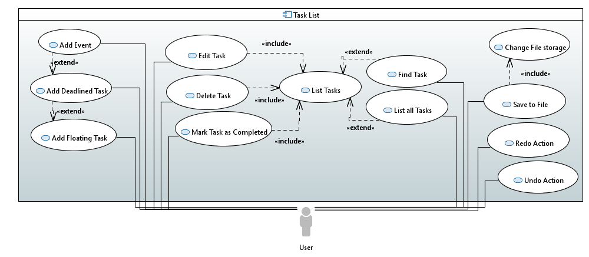

# Use Cases

By : `CS2103JAN2017-W15-B2`  &nbsp;&nbsp;&nbsp;&nbsp; Since: `Mar 2017`  &nbsp;&nbsp;&nbsp;&nbsp; Licence: `MIT`

---

- [Use Case Diagram](#use-case-diagram)
- [Use Cases](#use-cases-1)
    - [Add Floating Task](#add-floating-task)
    - [Add Deadline Task](#add-deadline-task)
    - [Add Event](#add-event)
    - [List all Tasks](#list-all-tasks)
    - [Edit Task](#edit-task)
    - [Mark Task as Completed](#mark-task-as-completed)
    - [Delete Task](#delete-task)
    - [Find Task](#find-task)
    - [Undo Action](#undo-action)
    - [Redo Action](#redo-action)
    - [Save to File](#save-to-file)
    - [Change File storage](#change-file-storage)

## Use Case Diagram

## Use Cases

### Add Floating Task

### Add Deadline Task

### Add Event

### List all tasks

**MSS**

1. User requests to list tasks
2. TaskBook shows a list of tasks  
Use case ends

**Extensions**
2a. The list is empty
> 2a1. TaskBook shows a notice message  
  Use case ends

### Edit task

**MSS**

1. User retrieves list of tasks [via Use Case: List all Tasks](#list-all-tasks)
2. User enters command to edit task
3. TaskBook edits task according to given parameters
Use case ends

**Extensions**

2a. The given index is invalid

> 2a1. TaskBook shows an error message  
  Use case resumes at step 2

2b. The given parameters are invalid

 > 2b1. TaskBook shows an error message  
  Use case resumes at step 2

### Mark Task as Completed

1. User retrieves list of tasks [via Use Case: List all Tasks](#list-all-tasks)
2. User enters command to mark task as completed
3. TaskBook marks specified task as completed
Use case ends

**Extensions**

2a. The given index is invalid

> 2a1. TaskBook shows an error message  
  Use case resumes at step 2

### Delete Task

### Find task

**MSS**

1. User requests to find tasks by keyword
2. TaskBook shows a list of tasks with keywords that match the exact keyword  
Use case ends

**Extensions**
2a. The list is empty
> 2a1. TaskBook shows a notice message  
  Use case ends

### Undo Action

**MSS**

1. User requests to undo the previous action
2. TaskBook undos the last action
3. TaskBook shows the reflected changes  
Use case ends

**Extensions**
2a. There exists no valid action that can be undone
> 2a1. TaskBook shows a notice message  
  Use case ends

### Redo Action

**MSS**

1. User requests to redo the previous undo
2. TaskBook redos the previous undo
3. TaskBook shows the reflected changes  
Use case ends

**Extensions**
2a. There exists no valid undo action that can be redone
> 2a1. TaskBook shows a notice message  
  Use case ends

### Save to File

### Change File storage