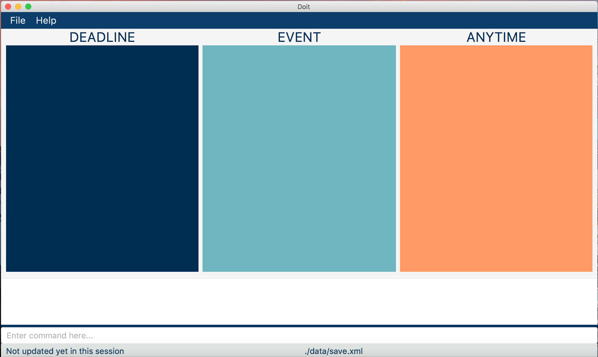

# Doit User Guide

## Table of Contents

1. [Introduction](#introduction)
 1.1 [About Doit](#about-doit)
 1.2 [Terminologies Used](#terminologies-used)
2. [Getting Started](#getting-started)
 2.1 [Downloading Doit](#downloading-doit)
 2.1 [Launching Doit](#launching-doit)
3. [Quick Start](#quick-start)
 3.1 [Visual Walkthrough](#visual-walkthrough)
 3.2 [Command Format](#command-format)
4. [Features](#features)
 4.1 Viewing Help
5. [FAQ](#faq)
6. [Command Summary](#command-summary)

## Introduction

### About Doit
Doit is a personal task management software that helps you to organise your task by providing an overview of the different tasks that you may have at a glance.

Doit is simple to use as all functions can be executed with just a single line of command meaning that you will only need a keyboard to fully navigate this software.

### Terminologies Used

* Task: A job to be done that has a deadline.
* Event: An event to be participated that has a start and end time.
* Floating Task: A job to be done that has no deadline.
* Items: A generic term used to describe a collection of tasks, events and floating tasks.
* GUI : Graphical User Interface.

## Getting Started

### Downloading Doit

1. Ensure that you have Java version `1.8.0_60` or later installed on your computer. 

 > Just having any Java 8 version is not enough.  
 > Doit will not work with earlier versions of Java 8. 
 > You can download the latest version of Java 8 at http://www.oracle.com/technetwork/java/javase/downloads/jre8-downloads-2133155.html.

2. Download the latest `Doit.jar` from the [releases](../../../releases) tab.
3. Copy the file to the folder you want to use as the home folder for Doit.

### Launching Doit

1. Double-click on `Doit.jar` to launch the app.
2. The main interface should appear as shown in figure 1 in a few seconds.
 > 
 > _Figure 1 : Main GUI_

## Quick Start

### Visual Walkthrough

1. Figure 2 shows how Doit may look with a few items added.
 > 
 > _Figure 2 : Example of a GUI instance_

2. Note how Doit has 3 columns "On", "By" and "Anytime".
 * The "On" Column shows you events that take place between a certain time period
 * The "By" Column shows you tasks which have to be completed by a certain deadline
 * The "Anytime" Column shows you floating tasks which can be completed anytime

3. You can type a command in the command box at the bottom and press <kbd>Enter</kbd> to execute it.  
 e.g. typing **`help`** and pressing <kbd>Enter</kbd> will open the help window.

4. Here are some sample commands that you may try:
 * **`help`** : Displays help prompt
 * **`add`** ` completeUserGuide d/28-Feb-2017 t/2359 p/high #Important`
 : Adds a task named completeUserGuide to the task manager.
 * **`delete`**`3` : Deletes the 3rd item shown in the UI
 * **`help`** : Displays help prompt
 * **`exit`** : Exits the app

5. You can refer to the [Features](#features) section below for the details of each command. 

### Command Format

* Words in **`Bold`** are the commands
* Words in `UPPER_CASE` are the parameters.
* Words in `[SQUARE_BRACKETS]` are optional parameters.
* Words with `...` after them can have multiple instances.
* Parameters & optional parameters can be in any order.

## Features

### Getting Help : `help`

Displays the help window

Format: **`help`**

> Help is also shown if you enter an incorrect command e.g. `abcd`

### Adding an Item: `add`

Adds an item to the task manager 
Format: `add NAME [st/STARTTIME] [et/ENDTIME] [d/DESCRIPTION] [p/PRIORITY] [#TAG]...`

> * Items without both `STARTTIME` and `ENDTIME` specified are considered as floating tasks. They will be auto-tagged as floating tasks.
> * Items with `ENDTIME` specified without specifying `STARTTIME` are considered tasks. They will be auto-tagged as tasks.
> * Items with both `STARTTIME` and `ENDTIME` or only `STARTTIME` specified are considered as events. They will be auto-tagged as events.
> * Priority only has 3 types: low, med, high.
> * You will be allocated a default `ENDTIME` for events without specified `ENDTIME`.
> * Case 1: There is no more later events for the day. The default `ENDTIME` will be the end of the day.
> * Case 2: There is another event later during the same day. The default `ENDTIME` will be the start of the next event.

Examples:

* `add floatingtask d/description p/low #NotImportant`
* `add task st/28-Feb-2017 d/description p/med #NotSoImportant`
* `add event st/28-Feb-2017 et/31-Mar-2017 p/high #Important`

### Undoing the Previous Command : `undo`

Undos the previous command that is not the undo command. 
Format: `undo`

> * You can undo <strong>N</strong> commands that is not the undo command by typing undo <strong>N</strong> number of times. 
> * You can only revert up to 1 command that is not the undo command. 

### Editing an Item : `edit`

Edits an existing item in the task manager. 
Format: `edit INDEX [st/STARTTIME] [et/ENDTIME] [d/DESCRIPTION] [p/PRIORITY] [#TAG]...`

> * Edits the item at the specified `INDEX`.
 The index refers to the index number shown in the last item listing. 
 The index **must be a positive integer** 1, 2, 3, ...
> * At least one of the optional fields must be provided.
> * Existing values will be updated to the input values.
> * When editing tags, the existing tags of the item will be removed i.e adding of tags is not cumulative.
> * You can delete the field of a parameter by specifing the parameter syntax without anything behind it.
> * You can remove all the item's tags by typing `#` without specifying any tags after it.

Examples:

* `edit 1 et/9pm p/high #CS1010 d/` 
 Edits the end time ,priority and hashtag of the 1st item to be `9pm` , `high` and `#CS1010` respectively while deleting the description.

* `edit 2 et/9pm p/high #` 
 Edits the name of the 2nd item's deadline to `9pm` and priority to `high` and clears all existing tags.

### Finding all Items Containing any Keywords in Their Names, Tags and Timings: `find`

Finds items whose names, tags and timings contain any of the given keywords. 
Format: `find KEYWORD [MORE_KEYWORDS]`

> * The search is case in-sensitive. e.g `cs1231` will match `CS1231`
> * Only the task name is searched.
> * Only full words will be matched e.g. `CS2103T` will not match `CS2103`
> * Tasks matching at least one keyword will be returned (i.e. `OR` search).
 e.g. `OP` will match `OP1 OP`
> * `KEYWORD` can be dates, times, names or tags.

Examples:

* `find 1-Mar-2017`
 The events, tasks and floating tasks lists will show items that take place on 1-Mar-2017

* `find OP`  
 Returns `OP1`

* `find OP1 OP2 Lab1` 
 Returns Any task having names `Lab1`, `OP1`, or `OP2`

### Marking specified items from the task manager as done: `done`
Marking the specified item from the task manager as done. 
Format: `done [ITEM_TYPE] INDEX`

> Marks the item at the specified `INDEX` as done.  
> `ITEM_TYPE` can be `ftask`, `floating tasks` and `anytime` for floating tasks or nothing,`task` and `before` for tasks. This is only use for the default page, where there are multiple columns.

> The index otherwise refers to the index number shown in the most recent listing of pop-ups. 

> The index **must be a positive integer** 1, 2, 3, ...
> Events cannot be marked.
>
Examples:

* `done 2` 
 Marks the 2nd item in the task manager as done.
* `find MA1521 Tutorial 1` 
 `done 1` 
 Marks the 1st item in the results of the `find` command.
* `done 3` 
 Marks the 3rd floating task shown in the floating task column of the default task manager page as done.

### Deleting specified items from the task manager: `delete`
Deletes the specified item from the task manager. 
Format: `delete INDEX`

> Deletes the item at the specified `INDEX`.  
> The index refers to the index number shown in the most recent listing. 
> The index **must be a positive integer** 1, 2, 3, ...

Examples:

* `delete 2` 
 Deletes the 2nd item in the task manager.
* `find MA1521 Tutorial 1` 
 `delete 1` 
 Deletes the 1st item in the results of the `find` command.

### Clearing all entries : `clear`

Clears all entries from the Task Manager. 
Format: `clear`

### Saving the data into a specified filename and location : `save`

Exits the program. 
Format: `save FILE_PATH/FILE_NAME.xml`
> Saves the data file with your own file name in the layers of folder you declare yourself.
> Saved file must be of type xml. Hence, it must end with .xml.
> Saved file location will be limited in the Doit Application folder.
>
Examples:
* `save folder1/folder2/savefile.xml` 
 Saves the data file in a file named savefile.xml at inside folder2 which is inside folder1 of the Doit Application folder.
* `save savefile.xml` 
 Saves the data file in a file named savefile.xml in the Doit Application folder.
### Exiting the program : `exit`

Exits the program. 
Format: `exit`

### Saving the data

Program data are saved in the hard disk automatically after any command that changes the data. 
There is no need to save manually.

## FAQ

**Q**: How do I transfer my data to another Computer? 
**A**: Install the app in the other computer and overwrite the empty data file it creates with the file that contains the data of your previous task manager folder.

## Command Summary

* **Help** : `help`  
 e.g.
 * `help`
 
* **Add Task** : `add TASKNAME d/DEADLINE DATE [t/DEADLINE TIME] [p/PRIORITY] [#TAG]...` 
 e.g.
 * `add completeUserGuide d/28-Feb-2017 t/2400 p/high #Important`

* **Add Floating Task** : `add FLOATINGTASKNAME [p/PRIORITY] [#TAG]...` 
 e.g.
 * `add reachDiamondRank p/low #Overwatch`

* **Add Event** : `add EVENTNAME sd/START DATE ed/END DATE [st/START TIME] [et/END TIME] [p/PRIORITY] [#TAG]...` 
 e.g.
 * `add finishCS3230Lab sd/01-Mar-17 ed/01-Mar-17 st/2000 et/2200 p/med #CS3230`
 * `add finishCS3230Lab sd/01-Mar-17 st/2000 p/med #CS3230`

* **Undo** : `undo`  
 e.g.
 * `undo`

* **Edit** `edit INDEX [t/DEADLINE TIME] [p/PRIORITY] [#TAG]...` 
 e.g.
 * `edit 1 t/9pm p/high #CS1010`

* **Find** : `find KEYWORD [MORE_KEYWORDS]`  
 e.g.
 * `find MA1101R assignment`
 * `find 01-Mar-2017`

* **Done** : `done [ITEM_TYPE] INDEX`  
 e.g.
 * `done 1`
 * `done ftask 1`
 * `done task 3`

* **Delete** : `delete INDEX`  
 e.g.
 * `delete 3`

* **Clear** : `clear`  
 e.g.
 * `clear`

* **Save** : `save FILE_PATH/FOLDER_NAME.xml`
 e.g.
 * `save folder1/folder2/savefile.xml`

* **Exit** : `exit`
 e.g.
 * `exit`
