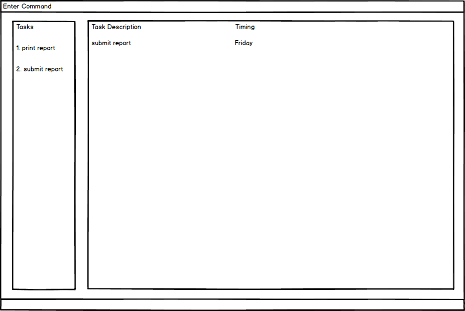

# Task Manager - User Guide

By : `F12-B3`  &nbsp;&nbsp;&nbsp;&nbsp; Since: `Feb 2017`  &nbsp;&nbsp;&nbsp;&nbsp; Licence: `MIT`

---

1. [Quick Start](#quick-start)
2. [Features](#features)
3. [FAQ](#faq)
4. [Command Summary](#command-summary)

## 1. Quick Start

0. Ensure you have Java version `1.8.0_60` or later installed in your Computer. 

   > Having any Java 8 version is not enough.  
   > This app will not work with earlier versions of Java 8.

1. Download the latest `taskmanager.jar` from the [releases](../../../releases) tab.
2. Copy the file to the folder you want to use as the home folder for your Task manager.
3. Double-click the file to start the app. The GUI should appear in a few seconds.
   > 

4. Type the command in the command box and press <kbd>Enter</kbd> to execute it.  
   e.g. typing **`help`** and pressing <kbd>Enter</kbd> will open the help window.
5. Some example commands you can try:
   * **`help`** : list all the command can use
   * **`list`** : list all tasks
   * **`add submit report by Friday`** : add a task to the task manager
   * **`exit`** : exits the app
6. Refer to the [Features](#features) section below for details of each command. 

## 2. Features

### 2.1. Viewing help : `help`

Format: `help`

> Help is also shown if you enter an incorrect command e.g. `abcd`

A command guide will be shown in the window

### 2.2. Adding a task : `add`

Adds a task to the task manager. 
Format: `add TASK s/STARTING_DATE_TIME e/ENDING_DATE_TIME d/Description #tags`

> Only Task title is a compulsory field. 
> Tasks can have any number of tags (including none). 
> Tasks with date specified without time will have the time defaulted to the current time. 
> Tasks with time specified without date will have the date defaulted to the current date. 
> Date and time supports natural language.

Examples:

* `add submit report e/29/07/2017 3pm d/Assignment 1 #academic`
* `add read Harry Potter s/12 March 2017 1300 e/15 December 2017 d/chapter 5 #personal`
* `add do homework s/today e/tmr #urgent`
* `add buy groceries`

### 2.3. Listing all tasks : `list`

Shows a list of all tasks in the task manager. 
Format: `list`

### 2.4. Select a task : `select`

Selects the task identified by the index number used in the last task listing. 
Format: `select INDEX`

Examples:

* `list` 
  `select 2` 
  Selects the 2nd task in the task manager.
* `find report`  
  `select 1` 
  Selects the 1st task in the results of the `find` command.

### 2.5. Editing a task : `edit`

Edits an existing task in the task manager. 
The tasks can be edited through the index from a list. 
Multiple fields in a task can be edited at once. 
Format: `edit INDEX COMPONENT(s)`

Examples:

* `edit 3 e/24/06/2017` 
  Changes the ENDING DATE of task 3 to 24/06/2017
* `edit 2 s/21/01/2017 e/24/06/2017 #school` 
  Changes task 3 STARTING DATE to 21/01/2017, ENDING DATE to 24/06/2017, tags to school

### 2.6. Finding all tasks containing any keyword in their task title / description / tags: `find`

Finds a task with the given keyword. 
Supports partial matching and tolerance for misspelled keywords. 
Format: `find KEYWORD`

Examples:

* `find report` 
  Returns `submit report`  `print report` `#report` etc. in the column
* `find schoolwork sports` 
  Returns `do schoolwork`  `play sports` `#schoolwork` `#sports` etc. in the column
* `find work` 
  Returns `do schoolwork`  `do homework` `#schoolwork` `#workfile` etc. in the column
* `find werk` 
  Returns `do schoolwork`  `do homework` `#schoolwork` `#workfile` etc. in the column

### 2.7. Deleting a task : `delete` or `remove`

Deletes the specified task from the task manager. 
Format: `delete INDEX` `remove INDEX`

> Deletes the task at the specified `INDEX`. 
> The index refers to the index number shown in the most recent listing. 
> The index **must be a positive integer** 1, 2, 3, ...

Examples:

* `delete 1` 
   Delete the task with index 1 in the Task Manager
* `remove 3` 
   Delete the task with index 3 in the Task Manager

### 2.8. Sorting tasks : `sort`

Sorts all tasks by their start date or end date. 
Format: `sort KEYWORD`

> Sorts tasks according to the input `KEYWORD`. 
> The keyword refers to `s/` for start date or `e/` for end date. 
> Invalid keyword will trigger sort by end date as default. 
> New addition of tasks will follow the sort order.  
> Floating tasks will be listed below the sorted tasks. 
> Any trailing symbols after a valid keyword will be ignored.

Examples:

* `sort s/` 
   Sort the task by the start date
* `sort e/` 
   Sort the task by the end date

### 2.9. Clearing all entries : `clear`

Clears all entries from the task manager. 
Format: `clear`

### 2.10. Exiting the program : `exit`

Exits the program. 
Format: `exit`

### 2.11. Saving the data

Task Manager data are saved in the hard disk automatically after any command that changes the data. 
There is no need to save manually.

### 2.12. Change the directory of the task manager : `load` or `open`

Load Task Manager data from specified file path and continue using that directory for operations. 
Create new file if no such file exists with a warning. 
Cancel operations if given non-XML address or invalid XML file. 
Default file path is at data/taskmanager.xml. 
Format: `load FILEPATH` `open FILEPATH`

Examples:

* `load /Users/admin/taskmanager.xml` 
  Changes the Storage Directory to /Users/admin/taskmanager.xml in UNIX/MAC system
* `open data/new/cloudsync.xml` 
  Changes the Storage Directory to ./data/new/cloudsync.xml

### 2.13. Save the task manager to a specified directory: `save` or  `saveas`

Save Task Manager data to specified file path and continue using that directory for operations. 
If existing file with the same name exists, it will be overwritten with current Task Manager data. 
Default file path is at data/taskmanager.xml. 
Format: `save FILEPATH` `saveas FILEPATH`

Examples:

* `save /Users/admin/taskmanager.xml` 
  Moves the Storage Directory to /Users/admin/taskmanager.xml in UNIX/MAC system
* `saveas data/new/cloudsync.xml` 
  Moves the Storage Directory to ./data/new/cloudsync.xml

### 2.14. Undo the last user command that changes data: `undo`

Undo the last user command in that user session that changes data, i.e. add, edit, delete, clear, sort. 
Does nothing if there are no more previous user commands.

Examples:

* `clear` 
  `undo` 
  Restores the data before the clear command
* `add New task` 
  `list` 
  `undo` 
  Undoes last user command that changes data, i.e `add New task`. Removes New task

### 2.15. Redo the last undo command: `redo`

Redo the last undo command by user 
Does nothing if there are no commands to redo that the user has undone

Examples:

* `clear` 
  `undo` 
  `redo` 
  Redoes last user command in undo history, i.e `clear`. Task manager will be cleared
* `add New task` 
  `list` 
  `undo` 
  `redo` 
  Redoes last user command in undo history, i.e `add New task`. Adds New task

### 2.16. Find tasks by date: `findbydate`

Find tasks that are within the specified date(s). 
Format: `findbydate DATE` `findbydate DATE to DATE`

Examples:

* `findbydate today` 
  Lists tasks that have starting dates before today or ending dates after today
* `findbydate today to next wednesday` 
  Lists tasks that start from today and end latest by next Wednesday.

### 2.17. Marking a task as DONE : `done` or `complete` or `finish`

Marks the specified task from the task manager as DONE. 
Format: `done INDEX` `complete INDEX` `finish INDEX`

> Mark the task at the specified `INDEX` as DONE. 
> The index refers to the index number shown in the most recent listing. 
> The index **must be a positive integer** 1, 2, 3, ...

Examples:

* `done 1` 
   Mark the task with index 1 in the Task Manager as done
* `complete 2` 
   Mark the task with index 2 in the Task Manager as done
* `finish 3` 
   Mark the task with index 3 in the Task Manager as done
   
### 2.18. Marking a task as TODO : `undone` or `revert`

Marks the specified task from the task manager as TODO from being DONE initially. 
Format: `undone INDEX` `revert INDEX`

> Mark the task at the specified `INDEX` as TODO from initially DONE. 
> The index refers to the index number shown in the most recent listing. 
> The index **must be a positive integer** 1, 2, 3, ...

Examples:

* `undone 1` 
   Mark the task with index 1 in the Task Manager as done
* `revert 3` 
   Mark the task with index 3 in the Task Manager as done

## 3. FAQ

**Q**: How do I transfer my data to another Computer? 
**A**: Install the app in the other computer and overwrite the empty data file it creates with
       the file that contains the data of your previous Task Manager folder.

## 4. Command Summary

Command | Syntax | Example
------- | ------ | -------
Help    | help
Add     | add TASK | add submit report
Add     | add TASK s/STARTING DATE | add submit report s/24/03/2017
Add     | add TASK s/STARTING DATE e/ENDING DATE    | add submit report s/24/03/207 e/27/03/2017
Add     | add TASK s/STARTING DATE e/ENDING DATE d/Description   | add submit report s/24/03/207 e/27/03/2017 d/assignment 1
Add     | add TASK s/STARTING DATE e/ENDING DATE d/Description #tags   | add submit report s/24/03/207 e/27/03/2017 d/assignment 1 #school
List    | list
Select  | select INDEX                    | select 3
Edit    | edit INDEX COMPONENT            | edit 3 e/04/04/2017
Find    | find KEYWORD(s)                 | find report assignment
Find by Date | findbydate DATE | findbydate today
Find by Date | findbydate DATE to DATE | findbydate today to next wednesday
Delete  | delete INDEX                    | delete 3
Sort    | sort KEYWORD                    | sort e/
Undo    | undo
Redo    | redo
Done    | done INDEX                      | done 1
Undone  | undone INDEX                    | undone 2
Save as | saveas FILEPATH                 | saveas newtaskmanager.xml
Load    | load FILEPATH                   | load /Users/admin/taskmanager.xml
Clear   | clear
Exit    | exit
 
