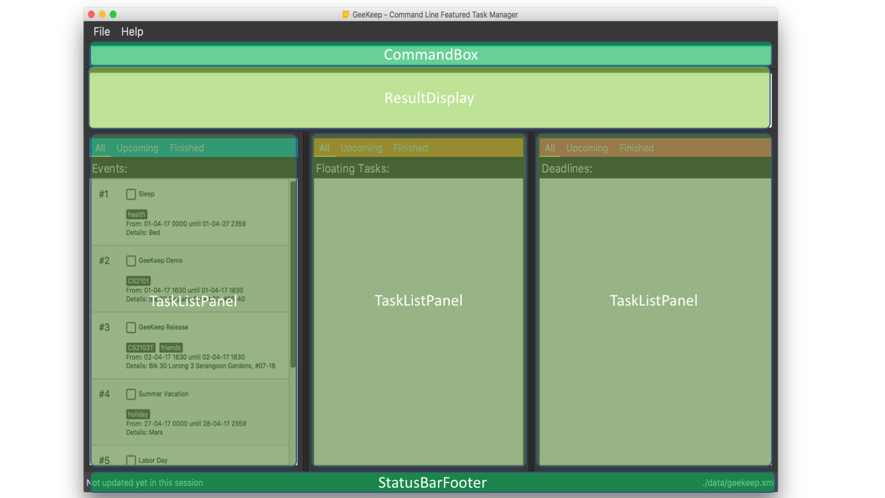

# User Guide

By : `Team CS2103JAN2017-W15-B4`   &nbsp;&nbsp;&nbsp;&nbsp; Since: `Mar 2017`  &nbsp;&nbsp;&nbsp;&nbsp; Licence: `MIT`

Tired of Task Managers with fancy graphics? Want a simple task manager that you can use solely with your keyboard? If you answered yes, we have just the app for you!

GeeKeep (pronounced Geek-keep) is a simple Command-Line-Interface (CLI) task manager that automatically categorizes your tasks into events, deadlines or just plain tasks. It affords you all the basic functionalities of a task manager from just the Command-Line alone!

This guide will help you get started with the commands and features of GeeKeep.

---

## Table of Contents

1. [Quick Start](#1-quick-start)
1. [UI](#2-ui)
1. [Features](#3-features)
    * [Help](#31-viewing-help-help)
    * [Add](#32-adding-a-task-add)
    * [Update](#33-updating-a-task-update)
    * [Done & Undone](#34-marking-a-task-as-done-or-undone-done-undone)
    * [Delete](#35-deleting-a-task-delete)
    * [Clear](#36-deleting-all-tasks-clear)
    * [List](#37-listing-all-tasks-list)
    * [List Done](#38-listing-all-completed-tasks-listdone)
    * [List Undone](#39-listing-all-uncompleted-tasks-listundone)
    * [Find](#310-finding-all-tasks-containing-any-keyword-in-their-title-tag-or-on-a-specific-date-find)
    * [Undo](#311-undo-most-recent-command-undo)
    * [Redo](#312-redo-most-recent-undo)
    * [Save](#313-saving-the-data)
    * [Exit](#314-exiting-the-program-exit)
1. [FAQ](#4-faq)
1. [Command Summary](#5-command-summary)
1. [Parameter Summary](#6-parameter-summary)
1. [Contact Us](#7-contact-us)

## 1. Quick Start

1. Ensure you have Java version 1.8.0_60 or later installed in your Computer.
	> Having any Java 8 version is not enough.  
   This app will not work with earlier versions of Java 8.

2. Download the latest geekeep.jar from the [releases](https://github.com/CS2103JAN2017-W15-B4/main/releases) tab.
3. Move the file to the folder you want to use as the home folder for your task manager.
4. Double-click the file to start the app. You should see the UI appear in a few seconds.
      
    
     

5. Type the command in the command box and press  <kbd>Enter</kbd> to execute it. 
e.g. typing **`help`** and pressing <kbd>Enter</kbd> will open the help window.
6. Some example commands you can try:
    * **`add Complete Progress Report e/20-3-17`** : adds a task titled Complete Progress Report with deadline on 20 March 2017.
    * **`clear`** : deletes all existing tasks
    * **`exit`** : exits the app

10. Refer to the [Features](https://github.com/CS2103JAN2017-W15-B4/main/blob/master/docs/UserGuide.md#features) section below for details of each command or just check out the [Cheatsheet](#4-command-summary) section.

**[⬆ back to top](#table-of-contents)**

## 2. UI

Our UI is broken down into 4 main sections:

1. *Command Box*
    * You enter commands here. When you enter an invalid command, it turns red.
1. *Result Display*
    * The result of your command, whether success, failure or error, will be depicted here.
1. *Event, Task, and Deadline List Panels*
    * The 3 types of tasks are displayed accordingly here. They are updated whenever you execute a relevant command.
1. *Status Bar Footer*
    * Shows you the last updated time and the file storage location.

**[⬆ back to top](#table-of-contents)**

## 3. Features

You can find a list of all commands and their detailed explanation in the following section. You can jump to the [Command Summary](#5-command-summary) for a quick summary.

You may also want to be familiar with the formats and keywords, explained further below, that GeeKeep uses before you continue to the following sections.

> **Command Format**
>
> * Words in *UPPER_CASE* are the parameters.
> * Items in *SQUARE_BRACKETS* are optional.
> * Items with *...* after them can have multiple instances.
> * Parameters can be in any order.

> **Parameter Format**
>
> * Each parameter has its own prefix, for example, the `START_DATETIME` has the prefix `s/` or `start/`. See the [Parameter Summary](#6-parameter-summary) for a complete list.
> * *DateTime* The dateTime format should be `DD-MM-YY HHMM`
> * *Description* The description has no restriction.
> * *Tag* Each tag is a single word.

> **Task Type**
>
> * *Events* are tasks with a `START_DATETIME` and an `END_DATETIME`. A `START_DATETIME` must be matched with a later `END_DATETIME`.
> * *Deadlines* are tasks with only an `END_DATETIME`.
> * *Floating Tasks* are tasks without both `START_DATETIME` and `END_DATETIME`.

### 3.1. Viewing help: `help`

Opens a window that displays this User Guide.

Format: `help`

> If your command did not follow the format specified, a short help summary of the command will be shown just below your command box.

### 3.2. Adding a task: `add`

Adds a task with the specified details.

Format: `add TASKTITLE [start/START_DATETIME] [end/END_DATETIME]  [d/DESCRIPTION] [tag/TAGS...]`

> * Each parameter has its own prefix. See the [Parameter Summary](#6-parameter-summary) for a complete list.
> * You can use abbreviations to represent all the parameter prefixes 
 e.g. You can use `s/` and `e/` in place of `start/` and `end/` respectively.

Examples:

* You can add a floating task:  
`add Shop groceries`
* or a deadline:  
`add Progress report e/15-3-17 1600`
* or an event:  
`add Team meeting s/15-3-17 1500 e/15-3-17 1600`

You should see the following after the above commands are entered.

### 3.3. Updating a task: `update`

Updates any details of existing task's to the new specified .

Format: `update TASKID [TASKTITLE] [start/START_DATETIME] [end/END_DATETIME]  [d/DESCRIPTOIN] [tag/TAGS...]`

> * Updates the task at the specified *TaskID*.
> * *TaskID* refers to the number shown beside the title of the task.
> * At least one of the optional fields must be provided.
> * Existing values will be updated to the input values.

Examples:

* You can change a floating task to a deadline using the `update` command:  `update 1 e/1-4-17 2359`

* Conversely, you can change it back into a floating task:   `update 1 e/`

### 3.4. Marking a task as done or undone: `done` & `undone`

Marks the task with the specified *TaskID* as done.

Format: `done TASKID`

> * Marks the task with the specified *TaskID* as done.
> * *TaskID* refers to the number shown beside the title of the task.

Examples:

* You can mark the task with *TaskID 2* as completed:   `done 2`

### 3.5. Deleting a task: `delete`

Deletes the specified task.

Format: `delete TASKID`

> * Deletes the task with the specified *TaskID*.
> * *TaskID* refers to the number shown beside the title of the task.

Examples:

* You can delete the task with *TaskID 2*:  `delete 2`

### 3.6 Deleting all tasks: `clear`

Deletes all existing tasks.

Format: `clear`

> Your UI should be completely empty after this command.

### 3.7. Listing all tasks: `list`

Shows all tasks, completed or otherwise, in the *Event, Task, and Deadline List Panels*.

Format: `list`

### 3.8. Listing all completed tasks: `listdone`

Shows *only* completed tasks in the *Event, Task, and Deadline List Panels*.

Format: `listdone`

### 3.9 Listing all uncompleted tasks: `listundone`

Shows *only* uncompleted tasks in the *Event, Task, and Deadline List Panels*.

Format: `listundone`

> Sorted in chronological order. You will see tasks closest to their starting date or due date at the top.

### 3.10. Finding all tasks containing any keyword in their title, tag, or on a specific date: `find`

Find and displays only tasks whose title or tag contain any of the given keywords, and/or on the specified date, in the *Event, Task, and Deadline List Panels*.

Format: `find KEYWORD [MORE_KEYWORDS] [DATE]`

> * The search is case insensitive.
> * The order of the keywords does not matter. e.g. `progress report` will match `report progress`
> * Substrings will be matched e.g. meet will match meeting
> * Tasks matching at least one keyword will be returned (i.e. OR search). e.g. `meeting` will match `team meeting`
> * Specifying the date will narrow the search space to ongoing tasks on the date.

Examples:

* You can find any tasks with the word `report` in their title:   `find report`
* You can find any tasks with the partial word `meet` in their title, even if their title is `team meeting`:  `find meet`
* You can find any tasks with the partial word `meet` in their title, on a specific date:  `find meet 17-3-17`

### 3.11. Undo most recent command: `undo`

Undo the most recent command. Can redo with command redo

Format: `undo`

### 3.12. Redo most recent undo: `redo`

Redo the most recent undo. Can undo with command undo.

Format: `redo`

### 3.13. Saving the data

Task manager data are saved in the hard disk automatically (in XML format) after any command that changes the data.

> There is no need to save manually.

### 3.14. Exiting the program: `exit`

Exits the program.

Format: `exit`

> You can exit with Alt-F4 (Windows) or Command-Q (Mac) any time since all changes are automatically saved.

**[⬆ back to top](#table-of-contents)**

## 4. FAQ

**Q**: Why does the app not run even though I have Java 8 installed?
 
**A**: Ensure you have Java version 1.8.0_60 or later installed in your Computer. This app will not work with earlier versions of Java 8.

**Q**: Can I control each of the panels individually?
 
**A**: No, all 3 panels are controlled together, meaning a `listdone` command will list all completed events, floating tasks, and deadlines in all 3 panels respectively.

**Q**: Can I resize each of the panels individually?
 
**A**: Yes, you can adjust their horizontal width just as you would a typical window.

**Q**: Can I change a task into a deadline, event, or vice versa?
 
**A**: Yes, just update the task's `END_DATETIME` for deadlines and its `START_DATETIME` for events.

**Q**: Can I change the order of display?
 
**A**: No, the tasks are always listed in chronological order, starting from today.

**Q**: How do I save the data?
 
**A**: Task manager data are saved in the hard disk automatically (in XML format) after any command that changes the data.

**Q**: Can I edit the saved data directly in XML?
 
**A**: Yes, the app will update accordingly when you launch it.

**Q**: Can I quit without using the exit command?
 
**A**: You can quit however you prefer since all changes are automatically saved.

**Q**: How do I transfer my data to another Computer? 
**A**: Install the app in the other computer and overwrite the empty data file it creates with the file that contains the data of your previous task manager folder.

**[⬆ back to top](#table-of-contents)**

## 5. Command Summary

| Command | Format | example |
|--- | :--- | :--- |
| [Help](#31-viewing-help-help) | `help` | `help` |
| [Add](#32-adding-a-task-add) | `add TASK [s/START_DATETIME] [e/END_DATETIME]` | `add Team meeting s/15-3-17 1500 e/15-3-17 1600` |
| [Update](#33-updating-a-task-update) | `update TASKID [TASK] [e/END_DATETIME]` | `update 1 Summary Report e/15-3-17 2359` |
| [Done & Undone](#34-marking-a-task-as-done-or-undone-done-undone) | `done TASKID` | `done 1` |
| [Delete](#35-deleting-a-task-delete) | `delete TASKID` | `delete 3` |
| [Clear](#36-deleting-all-tasks-clear) | `clear` | `clear` |
| [List all tasks](#37-listing-all-tasks-list) | `list` | `list` |
| [List only completed tasks](#38-listing-all-completed-tasks-listdone) | `listdone` | `listdone` |
| [List only uncompleted tasks](#39-listing-all-uncompleted-tasks-listundone) | `listundone` | `listundone` |
| [Find](#310-finding-all-tasks-containing-any-keyword-in-their-title-tag-or-on-a-specific-date-find) | `find KEYWORD [MORE_KEYWORDS] [DATE]` | `find report 15-3-17` |
| [Undo](#311-undo-most-recent-command-undo) | `undo` | `undo` |
| [Redo](#312-redo-most-recent-undo-redo) | `redo` | `redo` |
| [Exit](#314-exiting-the-program-exit) | `exit` | `exit` |

## 6. Parameter Summary

| Parameter | Prefix | Format | Can be empty | Example |
|--- | :--- | :--- | :--- | :--- |
| TASKTITLE | - | Alphanumeric Characters and spaces | :x: |`CS2103 Assignment 1`|
| START_DATETIME | `start/` | `DD-MM-YY HHMM` | :heavy_check_mark: |`01-04-17 0000`|
| END_DATETIME | `end/` | `DD-MM-YY HHMM` | :heavy_check_mark: | `01-04-17 2359`|
| DESCRIPTION | `d/` | No restriction | :heavy_check_mark: | `School of Computing`|

**[⬆ back to top](#table-of-contents)**

## 7. Contact Us

* **Bug reports, Suggestions** : Post in our [issue tracker](https://github.com/CS2103AUG2016-W15-B4/main/issues)
  if you notice any bugs or have suggestions on how to improve.

* **Contributing** : We welcome pull requests. Follow the process described [here](https://github.com/oss-generic/process)

* **Email** : You can reach us at `e0003323@u.nus.edu`

**[⬆ back to top](#table-of-contents)**
