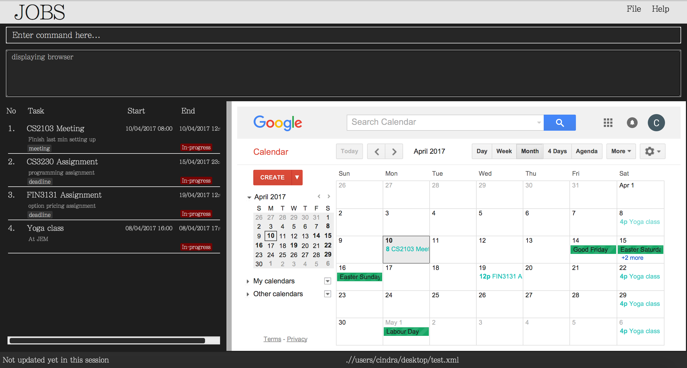

# User Guide

This product is a tool to accept natural language commands via keyboards to manage the user's schedule and todo tasks.

* [Start the program](#start-the-program)
* [Feature details](#feature-details)
    * [help](#view-help-help)
    * [add](#add-a-task-add)
    * [delete](#delete-a-task-delete)
    * [find](#find-a-task-find)
    * [list](#list-tasks-list)
    * [edit](#edit-a-task-edit)
    * [undo/redo](#undo/redo-a-task-undo-redo)
    * [exit](#exit-the-program-exit)
    * [save](#save-the-data)
* [Command Summary](#command-summary)

## Start the program

Double click the JOBS.jar file to start the program.

 

1. User input/command bar: Enter your to-dos here easily using the given Command Tags.
2. Feedback prompt: The outcome to any changes that you make to your tasks is shown here.
3. Display screen: Your tasks are displayed here according to input priority by default.
4. Calendar display: This displays Google Calendar extension based on existing tasks.
5. Exit button: Click to exit the program. Alternatively, type exit in the command bar to exit.

## Feature details

### View help : `help`
Format: `help`

1. Help will show the command list with brief descriptions.
2. Help is also shown if you enter an incorrect command e.g. `abcd`

### Add a task: `add`
Add is the command word to add a task to the task handler application
Format: `add name/TASK_NAME [start/START_TIME end/END_TIME recur/PERIOD desc/DESCRIPTION tag/TAGS]`
1. User inputs are typed in after / as shown by the uppercase variables.
2. The commands inside square brackets are optional.
3. The time format follows `DD-MM-YY HH:mm`
4. If there is no input for start and end, the task will be considered a **floating task**
5. If there is input for end, the task will be considered a **task with deadline**
6. The recur specifies the recurrence period **in days**.

Example :
* `add name/tutorial start/13-01-17 11:00 end/13-01-17 12:00 recur/7 desc/"Tutorial of CS2103" tag/CS2103`
* `add name/v0.0 end/03-03-17 11:00 desc/"Project version 0.0 deadline tag/CS2103 Project"`
* `add name/swim desc/"Remember to swim"`

### Delete a task: `delete`
Delete is the command word that can be used to delete a task
Format: `delete INDEX`

Example:
* `Delete 1`

### Find a task: `find`
Find is the command word that can be used to find a task
Format: `find name/Name`
1. The command finds tasks which have names containing any of the given keywords including substring.

Example:
* `find cs2103`
* `find cs`

### List tasks: `list`
List is the command word to list down all the existing tasks
Formats: `list * | completed | pending | overdue`
1. \* will list all tasks
2. Completed will list all completed tasks
3. Pending will list all pending tasks
4. Overdue will list all overdue tasks

Example:
* `list *`
* `list completed`
* `list pending`
* `list overdue`

### Edit a task: `edit`
Edit is the command word to edit a specific tasks
Format : `update index/INDEX [name/NAME start/START end/END recur/PERIOD desc/DESCRIPTION tag/TAG]`
1. The commands inside square bracket are optional.
>User editss a specific task by specifying the new entry they wish to be reflected on the existing task list

Example:
* `update index/1 desc/"The venue has been changed"`
* `update index/2 start/02-04-17 17:20`

### Undo/Redo a task: `undo` `redo`
Undo is the command word to erase the last change done
Format : `undo` `redo`

Example:
* `delete 1` >> `undo` (to retrieve the previously deleted task)

### Exit the program: `exit`
Exits the program.
Format: `exit`

### Save the data
Task data are saved in the hard disk automatically after any command that changes the data. There is no need to save manually.

## Command Summary
| Command | Format
| --------| --------
| help | `help`
| add | `add name/TASK_NAME [start/START_TIME end/END_TIME recur/PERIOD desc/DESCRIPTION tag/TAGS]`
| delete | `delete index\INDEX`
| find | `find name/Name`
| list | `list * | completed | pending | overdue`
| edit | `edit index/INDEX [name/NAME start/START end/END recur/PERIOD desc/DESCRIPTION tag/TAG]`
| undo/redo | `undo` `redo`
| exit | `exit`
