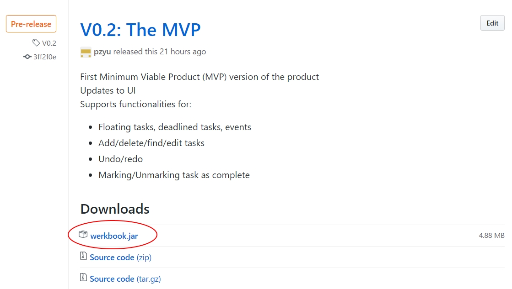
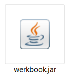
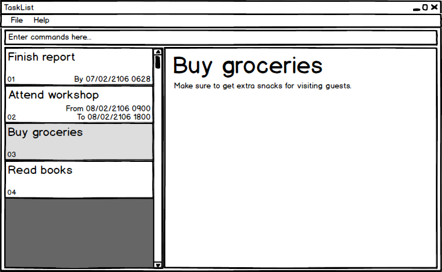

# Werkbook - User Guide

By : `Team W15B2`  &nbsp;&nbsp;&nbsp;&nbsp; Since: `Jun 2016`  &nbsp;&nbsp;&nbsp;&nbsp; Licence: `MIT`

---

1. [Welcome](#1-welcome)
2. [Getting Started](#2-getting-started)
    1. [Installation](#i-installation)
    2. [Starting Werkbook](#ii-starting-werkbook)
    3. [Interface Introduction](#i-interface-introduction)
    4. [Quick Start](#i-quick-start)
3. [User Interface](#3-user-interface)
4. [Features](#4-features)
    1. [Task Management](#i-task-management)
        1. [Add task](#a-add-task)
        2. [List task](#b-list-task)
        3. [Edit task](#c-edit-task)
        4. [Find task](#d-find-task)
        5. [Mark task](#e-mark-task)
        6. [Delete task](#f-delete-task)
        7. [Clear all tasks](#g-clear-all-tasks)
    2. [Program Usage](#ii-program-usage)
        1. [Help](#a-help)
        2. [Undo/Redo](#b-undo-redo)
        3. [Save data](#c-save-data)
        4. [Change save location](#d-change-save-location)
        5. [Exit program](#e-exit-program)
5. [FAQ](#5-faq)
6. [Commands Cheatsheet](#6-commands-cheatsheet)

## 1. Welcome

Werkbook is a task manager.

## 2. Getting Started

### i. Installation
Ensure you have Java version `1.8.0_60` or later installed in your Computer.
> Having any Java 8 version is not enough. 
> This app will not work with earlier versions of Java 8.

Download the latest `werkbook.jar` from the [Releases](../../../releases) tab as shown in *Figure 1* below.

 
*Figure 1: Latest release*

Copy the file to the folder you want to use as the home folder for your Werkbook.

### ii. Starting Werkbook
To start Werkbook, simple double click on `werkbook.jar`.

 
*Figure 2: Launching werkbook.jar*

### iii. Interface Introduction
After launching Werkbook, you will be greeted with the main interface.

 
*Figure 3: Werkbook's main interface*

You can find the **Command Box** at the top of the interface, this is where you type your commands!

The **Results Panel** is located below the **Command Box**, and it tells you the result of your command.

All of your tasks can be found in the **Task Panel**, it is initially empty until you fill it up with tasks.

### iv. Quick Start
Here's a quick guide to get you started with Werkbook.

**Feeling lost?**

Typing **`help`** in the **Command Box** will bring up the help window with a list of all of the available commands.

**Adding your first task**

Let's start by adding a new task to Werkbook. Perhaps you want to remind yourself to get the groceries, you can type the following command in the **Command Box**:

`> add Get Groceries`

**Making changes**

You can also specify a deadline by editing the task using the following command:

`> edit 1 e/05/03/2017 2030`

**Completing a task**

Once you've finished getting the groceries, it's time to mark it as complete by typing the following command:

`> mark 1`

**Ready to go!**

Now you're all set to start managing your tasks! Feel free too refer to our [Features](#features) section below for details of each command.

## 3. User Interface

## 4. Features

**Command Format**

* Words in `UPPER_CASE` are the parameters.
* Items in `SQUARE_BRACKETS` are optional.
* Items with `...` after them can have multiple instances.
* Parameters can be in any order.

### i. Task Management

#### a. Add task

Adds a task to the task list 
Date and time must be formatted as DD/MM/YYYY HHMM 
A task must have a name, the description is optional 
The task can also optionally have a End Date/Time, or both a Start Date/Time and End Date/Time 
Format: `add NAME [d/DESCRIPTION] [s/START_DATETIME] [e/END_DATETIME] [t/TAG]`

Examples:

* `Walk the dog d/Take Zelda on a walk around the park s/01/01/2017 1000 e/01/01/2017 1200 t/Important`

#### b. List tasks

Shows a list of all tasks in the task list. 
Format: `list`

#### c. Edit task

Edits a task in the task list. 
Format: `edit INDEX [NAME] [d/DESCRIPTION] [s/START_DATETIME] [e/END_DATETIME] [t/TAG]...`

> * Edits the task at the specified `INDEX`.
    The index refers to the index number shown in the last task listing. 
    The index **must be a positive integer** 1, 2, 3, ...
> * At least one of the optional fields must be provided.
> * Providing the prefix for start or end date/time without supplying a date/time will remove it from the task
> * Existing values will be updated to the input values.

Examples:

* `edit 1 d/Get the Fish` 
  Edits the description of the 1st task to be `Get the Fish`.
* `edit 2 s/` 
  Removes the start date/time of the 2nd task.

#### d. Find task

Finds tasks whose name or description contain any of the given keywords. 
Format: `find KEYWORD [MORE_KEYWORDS]`

> * The search is case sensitive. e.g `milk` will not match `Milk`
> * The order of the keywords does not matter. e.g. `Apple Juice` will match `Juice Apple`
> * Only the name is searched.
> * Only full words will be matched e.g. `Cake` will not match `Cakes`
> * tasks matching at least one keyword will be returned (i.e. `OR` search).
    e.g. `Milk` will match `Get the Milk`

Examples:

* `find Milk` 
  Returns `Get the Milk` but not `Get the milk`

#### e. Mark task

Marks the status of a task in the task list as `Complete` or `Incomplete`. 
Format: `mark INDEX`

> * Marks the task at the specified `INDEX`.
    The index refers to the index number shown in the last task listing. 
    The index **must be a positive integer** 1, 2, 3, ...
> * If the task's status is `Incomplete`, the command will update it to `Complete` and vice-versa.

Examples:

* `mark 1` 
  Updates the task status to `Complete` if it is `Incomplete`.  
  Updates the task status to `Incomplete` if it is `Complete`.  

#### f. Delete task

Deletes the specified task from the task list. 
Format: `delete INDEX`

> Deletes the task at the specified `INDEX`.  
> The index refers to the index number shown in the most recent listing. 
> The index **must be a positive integer** 1, 2, 3, ...

Examples:

* `list` 
  `delete 2` 
  Deletes the 2nd task in the task list.
* `find Betsy` 
  `delete 1` 
  Deletes the 1st task in the results of the `find` command.

#### g. Clear all tasks

Clears all entries from the task list. 
Format: `clear`

### ii. Program Usage

#### a. Help

Format: `help`

> Help is also shown if you enter an incorrect command e.g. `abcd`

#### b. Undo/Redo

Undo the last command executed.  
Format: `undo`

> Undo the last command executed.
> Repeated use of undo will undo the previous command from the last command undone

Examples:

* `delete 2` 
  `undo` 
  Undo the deletion of the 2nd task in the task list.

Redo the last undo command executed.  
Format: `undo`

> Redo the last undo command executed.
> Repeated use of redo will redo the previous undo command from the last undo command redone

Examples:

* `delete 2` 
  `undo` 
  `redo` 
  The final action would be the deletion of the 2nd task in the task list.

#### c. Save data

Saves all changes to disk.  
Format: `save [SAVE_LOCATION]`

The first time the task manager is saved without `SAVE_LOCATION` the user would be asked to specify where to save. 
Task list data are saved in the hard disk at the last save location automatically after any command that changes the data. 
There is no need to save manually.

#### d. Change save location

#### e. Exit program

Exits the program. 
Format: `exit`

## 5. FAQ

**Q**: How do I transfer my data to another Computer?

**A**: Install the app in the other computer and overwrite the empty data file it creates with
       the file that contains the data of your previous task list folder.

## 6. Commands Cheatsheet

* **Add**  `add NAME [d/DESCRIPTION] [s/START_DATETIME] [e/END_DATETIME] [t/TAG]`  
  e.g. `Walk the dog d/Take Zelda on a walk around the park s/01/01/2017 1000 e/01/01/2017 1200 t/Important`

* **Clear** : `clear`

* **Delete** : `delete INDEX`  
   e.g. `delete 3`

* **Find** : `find KEYWORD [MORE_KEYWORDS]`  
  e.g. `find Milk`

* **Mark** : `mark INDEX`  
  e.g. `mark 1`

* **Undo** : `undo`  
  e.g. `undo`

* **Redo** : `redo`  
  e.g. `redo`

* **List** : `list`  
  e.g. `list`

* **Help** : `help`  
  e.g. `list`

* **Select** : `select INDEX`  
  e.g.`select 2`

* **Exit** : `exit`  
  e.g. `exit`
