# User Guide

1. [Starting the Program](#Starting-the-Program)
2. [Features](#Features)
3. [Command Summary](#Command-Summary)

## Starting the Program

0. Ensure you have Java version `1.8.0_60` or later installed in your Computer. 

   > Having any Java 8 version is not enough.  
   > This app will not work with earlier versions of Java 8.

1. Download the latest `fasttask.jar` from the [releases](../../../releases) tab.
2. Copy the file to the folder you want to use as the home folder for your Task Manager.
3. Double-click the file to start the app. The GUI should appear in a few seconds.
   > 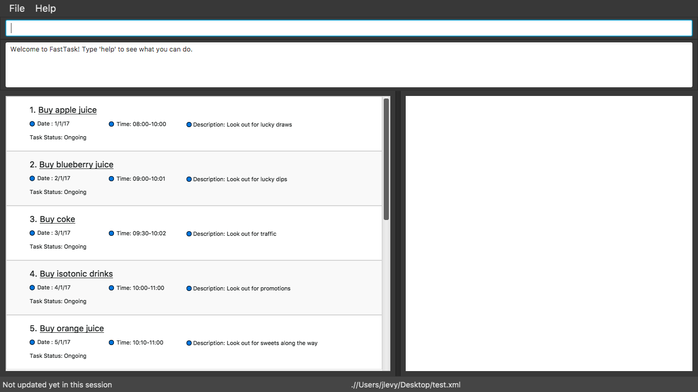
4. Type the command in the command box and press <kbd>Enter</kbd> to execute it.  
   e.g. typing **`help`** and pressing <kbd>Enter</kbd> will open the help window.
5. Some example commands you can try:
   * **`list`** : lists all tasks
   * **`add`**`add Groceries Shopping d/030117 s/09:00 e/12:00 m/Go to Cold Storage, Buy Extra milk` :
     adds a task called `Groceries Shopping` to the Task Manager.
   * **`delete`**` 3` : deletes the 3rd task shown in the current list
   * **`exit`** : exits the app
6. Refer to the [Features](#features) section below for details of each command. 

## 2. Features

## Getting Help : `help`
Format: `help`

> Typing `help` will create a pop up of this User Guide on the user's computer. Internet connection is required.

## Listing All Tasks : `list`
Shows a list of all active tasks. 
Format: `list`

## Adding a Task : `add`
Adds a task to the task manager 
Format: `add TASKNAME [d/DATE1 [DATE2]] [s/STARTTIME] [e/ENDTIME] [m/MESSAGE]`

> Words in `UPPER_CASE` are the parameters, items in `[SQUARE_BRACKETS]` are optional.
> `add` and `TASKNAME` must be in the order shown, but there is no set order for all other parameters.
> A format hint will be added if the user types in an incorrect command.

> `s/STARTTIME` and `e/ENDTIME` can be entered in the format `mm:hh` or `mmhh`. Time is formated using a 24 hour clock. Additionally, many natural language options are available. A list of some possible natural language options are listed below.

* 06:00 hours
* 5:30 a.m.
* noon
* afternoon
* midnight

>`[d/DATE1 [DATE2]` can be entered in the format `ddmmyy`. Additionally, many natural language options are available. A list of some possible natural language options are listed below.

* 1-02-2017
* 2/28/79
* Fri, 21 Nov 2017
* Jan 21
* next thursday
* today
* tomorrow

Example:
* `add Buy apple juice d/010117 s/08:00 e/10:00 m/Lok out for snacks`
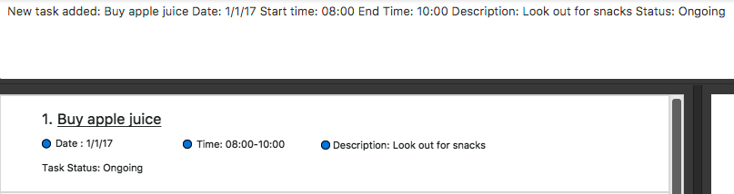

## Finding a Task: `find`
Finds tasks whose names contain any of the given keywords. 
Format: `find KEYWORD [MORE_KEYWORDS]`

> The search is not case sensitive, the order of the keywords does not matter, only the name is searched,
and tasks matching at least one keyword will be returned (i.e. `OR` search).

Example:
* `find juice`
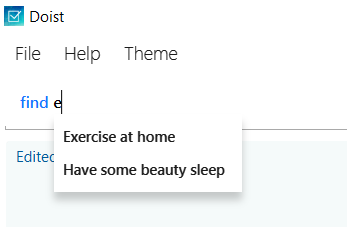

## Deleting a Task : `delete`
Deletes a specified task or tasks from the task manager. Irreversible. 
Format: `delete INDEX [MORE INDECIES]`

> Deletes the tasks at the specified `INDEX` or indecies.
  The index refers to the task number shown in the list.
  `INDEX` must be an exact match in order for the function to work.

Example:
* `delete 2` 
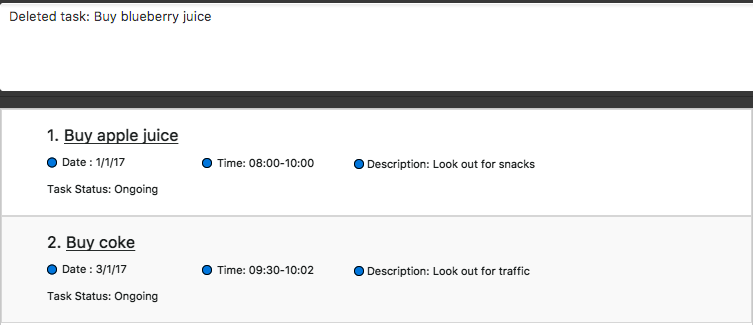

## Editing a Task : `edit`
Edits a specified task from the task manager. 
Format: `edit INDEX [TASKNAME] [d/DATE1 [DATE2]] [s/STARTTIME] [e/ENDTIME] [m/MESSAGE]`

> Edits the task at the specified `INDEX`. The index refers to the
task number shown in the list. `INDEX` must be an exact match in order
for the function to work.

Example: `edit 1 Buy Snacks d/121212` 
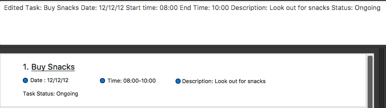

## Clearing all Tasks : `clear`
Clears all tasks from the task manager. 
Format: `clear` 
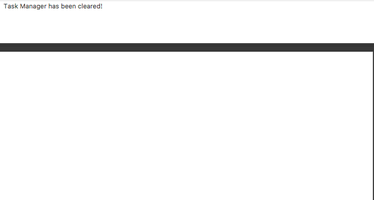

## Undoing an Action : `undo`
Undos the most recent action up to 10 times.
Format: `undo` 

## Redoing an Action : `redo`
Redos the most recent action up to 10 times.
Format: `redo` 

## Completing a Task : `done`
Completes the specified tasks from the task manager and changes the task status from `Ongoing` to `Completed`. Moves comepleted tasks to the bottom of the list 
Format: `done INDEX [MORE INDECIES]`

Example: `done 1` 
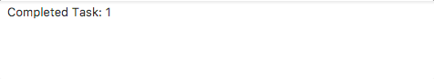  
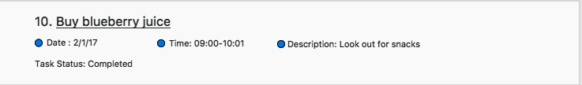

## Filtering the Tasks : `filter`
Filters the list based off of specified flitering criteria. 
Format: `filter FILTER_TYPE FILTER_ARGUMENTS`   
`FILTER_TYPE` includes: `name, desc (description), status, before, after`  
`FILTER_ARGUMENT` can include a date, a status, a task description, or the name of a task  
`name`, `desc`, and `status` find tasks that contain the substring specified by `FILTER_ARGUMENTS`  
`before`, `after` find tasks before and after a certain date specified by `FILTER_ARGUMENTS`

> Filter commands can stack. To return to the unsorted list of tasks, type and enter `list`.  

Examples:
 * `filter status completed`
 * `filter after today`
 * `filter before 12/12/12`
 * `filter name Go to Store`
 * `filter desc Look out for snacks`  

`filter status ongoing` (shows only ongoing tasks)

`filter status completed` (shows only completed tasks)  

## Sorting the Tasks : `sort`
Sorts the tasks by date or by alphabet.
Format: `sort name` or `sort time`, or `sort status`
> Sorts tasks in either alphabetical order or by upcoming tasks. `sort time` will sort the tasks by the date that is closest to the current date. `sort status` will sort the tasks by `Ongoing` or `Completed`.
> To return to the unsorted list of tasks, type and enter `list`.

Examples: 
`sort name` 

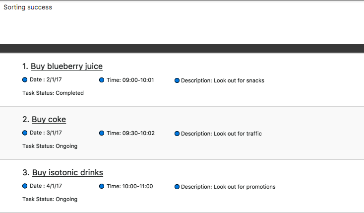  

`sort time` 

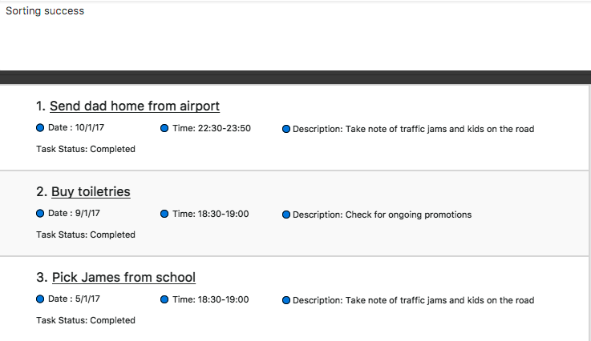

## Googling the Tasks: `google`
Format: `google [INDEX]`
> Googles the task name at the specified index. The user can additionally Google a task name by single clicking on a task.

Example: `google 2`  
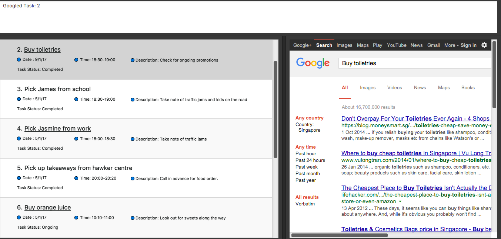

## Changing the Save Path: `path`
Saves a new copy of the Fast Task data to a new file location and changes savepath. Must specify the name of the save file and mark it as a .xml file. 
Format: `path PATHNAME` 
Example for Windows: `path C:\Desktop\MyTasks.xml` 
Example for Mac: `path /Users/name/Desktop/MyTasks.xml`

After entering a save path, this confirmation message will appear.

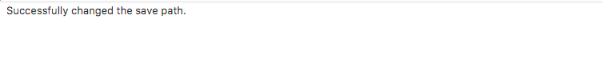

## Loading Fast Task Data: `load`
Loads a copy of Fast Task and changes savepath, but does not overwrite the loaded file. Can be used for loading different sets of task data. Must specify the name of the save file and mark it as a .xml file.  
Format: `load PATHNAME` 
Example for Windows: `load C:\Desktop\MyTasks.xml` 
Example for Mac: `load /Users/name/Desktop/MyTasks.xml`

After entering a load path, this confirmation message will appear.

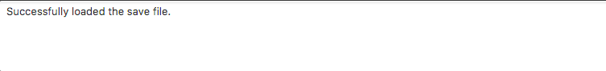  

After loading a .xml file, the path should change at the bottom of the application.

## Exiting the Program : `exit`
Exits the program. 
Format: `exit`

## Saving the Data
Tasks manager data are saved in the hard disk automatically after any command that changes the data. 
There is no need to save manually.

## Save Location
Fast Task data are saved in a file called `TasksManagerData.xml` in the project root folder.

## 4. Command Summary

* **Help** : `help`  

* **Add**  `add TASKNAME [d/DATE1 [DATE2]] [s/STARTTIME] [e/ENDTIME] [m/MESSAGE]`  
  e.g. `add Groceries Shopping d/030117 s/09:00 e/12:00 m/Go to Cold Storage, buy extra milk`

* **Delete** : `delete INDEX`  
   e.g. `delete 3`

* **Filter** : `filter [FILTER_TYPE] [FILTER_ARGUMENTS]`  

* **Edit** : ``edit INDEX [TASKNAME] [d/DATE1 [DATE2]] [s/STARTTIME] [e/ENDTIME] [m/MESSAGE]``  
  e.g. `edit 2 m/Go to Guardian`

* **List** : `list`   

* **Clear** : `clear`

* **Undo** : `undo`   

* **Redo** : `redo`   

* **Done** : `done INDEX [MORE INDECIES]`   
 e.g. `done 3`

* **Filter** : `filter FILTER_TYPE FILTER_ARGUMENTS`  
 e.g. `find status completed`
 e.g. `find after today`

* **Sort** : `sort` 
 e.g.`sort time, sort name, sort status`

* **Path** : `path PATHNAME`   
 e.g. `path C:\Desktop\MyTasks.xml`
 e.g. `path /Users/name/Desktop/MyTasks.xml`

 * **Load** : `load PATHNAME`   
 e.g. `load C:\Desktop\MyTasks.xml`
 e.g. `load /Users/name/Desktop/MyTasks.xml`

* **Google** : `google INDEX`  
  e.g.`google 2`
