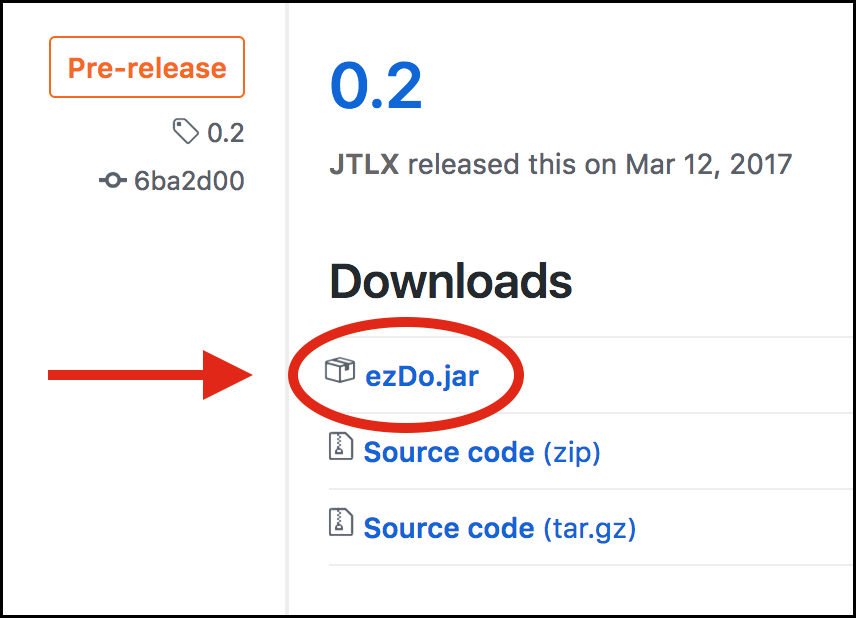
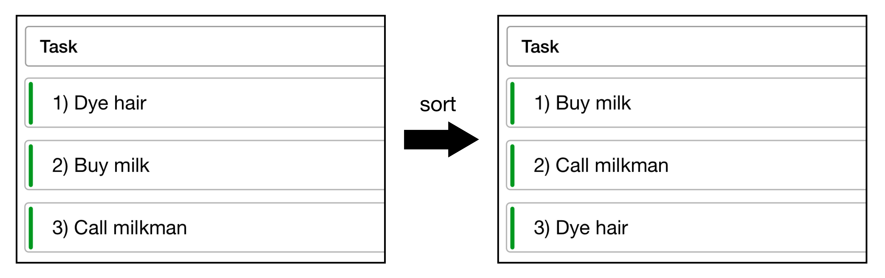

# User Guide
 

1. [About](#1-about) 
2. [Quick Start](#2-quick-start) 
    2.1. [Installation Instructions](#21-installation-instructions) 
    2.2. [Launch](#22-launch) 
    2.3. [Visual Introduction](#23-visual-introduction) 
3. [Features](#3-features) 
	3.1. [Adding a task: **`add / a`**](#31-adding-a-task-add--a) 
	3.2. [Editing a task: **`edit / e`**](#32-editing-a-task-edit--e) 
	3.3. [Marking a task as done/undone: **`done / d`**](#33-marking-a-task-as-doneundone-done--d) 
	3.4. [Deleting a task: **`kill / k`**](#34-deleting-a-task-kill--k) 
	3.5. [Sorting a list of tasks: **`sort / s`**](#35-sorting-a-list-of-tasks-sort--s) 
	3.6. [Finding tasks: **`find / f`**](#36-finding-tasks-find--f) 
	3.7. [Listing all tasks: **`list / l`**](#37-listing-all-tasks-list--l) 
	3.8. [Reverts the command: **`undo / u`**](#38-reverting-the-last-action-undo--u) 
	3.9. [Redoing the last undone command: **`redo / r`**](#39-redoing-the-last-undone-action-redo--r) 
	3.10. [Clearing all entries: **`clear /c `**](#310-clearing-all-entries-clear--c) 
	3.11. [Moving the save file: **`save`**](#311-moving-the-save-file-save) 
	3.12. [Aliasing a command: **`alias`**](#312-aliasing-a-command-alias) 
	3.13. [Exiting the program: **`quit / q`**](#313-exiting-the-program-quit--q) 
	3.14. [Viewing help: **`help / h`**](#314-viewing-help-help--h) 
4. [Frequently Asked Questions](#4-frequently-asked-questions) 
5. [Command Summary](#5-command-summary) 

 

## 1. About
Have you ever felt frustrated because you were unable to manage your daily tasks? Why not try ezDo, the eziest™ way to keep track of all your tasks efficiently? Whether you’re planning a holiday, powering through your day or managing multiple work projects, ezDo is here to help you tick off all your personal and professional to-dos!

With its user-friendly interface and command line style inputs, ezDo allows you to create, find and sort tasks without using the mouse at all!

For an ez™ life, use ezDo.

  

## 2. Quick Start

### 2.1. Installation Instructions

1. Install [Java version `1.8.0_60`](http://www.oracle.com/technetwork/java/javase/downloads/jdk8-downloads-2133151.html) or later on your computer. 
2. Download the latest `ezDo.jar` from the [releases](../../../releases) tab (as shown in Figure 1). 

<h5 align="center">Figure 1: Locating ezDo.jar from the Releases Tab</h5>

3. Copy the latest `ezDo.jar` to the folder you want to use. This folder will be the home folder for ezDo.  

 

### 2.2. Launch
To start the application, double-click on `ezDo.jar`. The user interface should appear in a few seconds. A sample view of the user interface is shown in Figure 2. 

<h5 align="center">Figure 2: Sample View of ezDo</h5>

 

### 2.3. Visual Introduction

Figure 2 above illustrates some features that you will find useful when you embark on ezDo:

1. **Command Box** 
Your commands should be typed here.  
2. **Description Box** 
The results of your command executions will be shown here.  
3. **Task Card** 
Each task in ezDo is represented by a task card with the following properties: 
    * Each task card has an index on the left. 
    * The color bar on the left indicates its priority. 
        * Green: low priority  
        * Orange: medium priority  
        * Red: high priority
    * Task cards may have a start/end time. 
    * Task cards may have any number of tags associated with it. 

4. **Tags** 
Each task may have some tags associated with it. Tags are a way for you to group and classify your tasks.

Now that we are familiar with ezDo's interface, let us get started with the features of ezDo! 

  

## 3. Features

A summary of the commands available on ezDo is shown in Table 1 for your convenience. 

| Command |Description                                                      |
|:-------:|---------------------------------------------------------------- |
|[add / a](#31-adding-a-task-add--a)            |Adds a task              |
|[edit / e](#32-editing-a-task-edit--e)            |Edits a task             |
|[done / d](#33-marking-a-task-as-doneundone-done--d)    |Marks a task as done/undone     |
|[kill / k](#34-deleting-a-task-kill--k)           |Deletes a task           |
|[sort / s](#35-sorting-a-list-of-tasks-sort--s)   |Sorts the list of tasks  |
|[find / f](#36-finding-tasks-find--f)             |Searches for a task      |
|[list / l](#37-listing-all-tasks-list--l)         |Lists the tasks          |
|[undo / u](#38-reverting-the-last-action-undo--u) |Reverts the last action  |
|[redo / r](#39-redoing-the-last-undone-action-redo--r)| Redoes the last undo|
|[clear / c](#310-clearing-all-entries-clear--c)    |Deletes all tasks        |
|[save](#311-moving-the-save-file-save)            |Saves ezDo to a directory|
|[alias](#312-aliasing-a-command-alias)           | Aliases a command       |
|[quit / q](#313-exiting-the-program-quit--q)      |Quits ezDo               |
|[help / h](#314-viewing-help-help--h)             |Shows the user guide     |

<h5 align="center">Table 1: Summary of Commands in ezDo</h5>

 

> #### <u>Quick Tip:</u> 
> You can type the <u><b>first letter</b></u> of any command instead of typing in full (except **`save`**).
> _For example, you can type **`u`** instead of **`undo`** to revert the last command._

 

**Things to note:**
* Words in **`UPPER_CASE`** are the parameters.  
* Parameters in **`[SQUARE_BRACKETS]`** are optional.  
* Parameters with **`...`** after them can have multiple instances (separated by a white space). 

 

### 3.1 Adding a task: `add / a`
---
 _**Adds a task to ezDo.**_ 

#### Format:

**`add TASKNAME [p/PRIORITY] [s/STARTDATE] [d/DUEDATE] [t/TAGNAME1] [t/TAGNAME2]...`**

 

> - Add as many tags as you want to a task, if required.  
> - Add a **`STARTDATE`** or **`DUEDATE`** if required. Refer to Table 2 for examples of **`STARTDATE`** and **`DUEDATE`**.  
> - Mark tasks with **`PRIORITY`** level 1, 2 or 3, with 1 the highest priority and 3 the lowest, if required. 

 

|`STARTDATE` / `DUEDATE`|
|:---------|
|Sun, Nov 21|
|jan 1st|
|february twenty-eighth|
|last wednesday|
|today|
|tomorrow|
|3 days from now|
|three weeks ago|
|1978-01-28|
|1984/04/02|
|1/02/1980|
|2/28/79|
<h5 align="center">Table 2: Examples of valid STARTDATE and DUEDATE formats</h5>

 

#### Examples:
* Buy milk: 
**`add Buy milk`**   
* Buy plane tickets to Hong Kong urgently: 
**`a Buy plane tickets to Hong Kong p/3`**   
* Buy a table by 03/02/2017 13:00: 
**`add Buy a table d/03/02/2017 13:00 t/watchingTV`**   
* Start marking CS2101 reflections on 01/03/2017 08:00: 
**`a Mark CS2101 reflections s/01/03/2017 08:00 t/school`**  

 

### 3.2 Editing a task: `edit / e`
---
_**Edits a particular task by <u>specifying its index</u> and <u> new information to be updated</u>.**_ 

#### Format:

**`edit INDEX [NEWTASKNAME] [p/NEWPRIORITY] [s/NEWSTARTDATE] [d/NEWDUEDATE] [t/NEWTAGNAME]...`**

 

> - Clear a task's field (except task name) by inputting the right prefix only. 

 

#### Example:

This task has just been added at `INDEX` 1 with the `add` command:

 **`add Buy milk p/1 t/NTUC`** 

You can now edit the task in several ways: 

* Change the task name: 
**`edit 1 Buy milk and cereal`**   
* Change the task's priority to 3: 
**`e 1 p/3`**   
* Add a due date: 
**`edit 1 d/05/07/2017`**  
* Remove a task's tag: 
**`edit 1 d/05/07/2017`** 

 

### 3.3 Marking a task as done/undone: `done / d`
---
_**Marks the task at a specified index as done/undone.**_ 

#### Format:

**`done INDEX [INDEX]...`**

 

> - `INDEX` refers to the index number of the tasks shown in the most recent listing.  
> - Once a task is marked as done, it will be removed from the task list and added to the done list.  
> - View the done list with the command `done` without any index specified.  
> - Unmark a done task in the done list and it will return to the previous list.

 

#### Example:

* Mark the task at `INDEX` 1 as done: 
**`d 1`**  
* Marks the task at indexes 3, 5 and 6 as done:
**`done 3 5 6`**  

 

### 3.4 Deleting a task: `kill / k`
---
_**Marks the task at a specified index as deleted.**_ 

#### Format:

**`kill INDEX [INDEX]...`**

 

> - `INDEX` refers to the index number of the tasks shown in the most recent listing.  
> - You must input a valid `INDEX`.  
> - Once a task is deleted, it will be removed from the task list.  

 

#### Example:

* Delete the task at index 2: 
**`kill 2`**   
* Deletes the task at indexes 4, 5 and 6:
**`k 4 5 6`**  

 

### 3.5 Sorting a list of tasks: `sort / s`
---
_**Sorts the list of tasks by the specified field according to the specified ordering.**_  

#### Format:

**`sort FIELD [ORDER]`**

 

> **`FIELD`** can be any of the following: 
> - n - name 
> - p - priority 
> - s - start date 
> - d - due date 

> **`ORDER`** can be any of the following: 
> - a - ascending order 
> - d - descending order 

 

#### Example:

You have just added a few tasks to ezDo with the following **`add`** commands: 

 **`add Dye hair p/1 s/06/05/2017 d/07/08/2017`** 
 **`add Buy milk p/1 s/04/05/2017 d/09/06/2017`** 
 **`add Call milkman p/1 s/05/05/2017 d/08/07/2017`**

Sort the tasks by name using either one of the following commands: 

* **`sort n`**
* **`s n d`**

 

<h5 align="center">Figure 4: View Before and After Sorting Tasks</h5>

 

Figure 4 illustrates the screenshots <u>before</u> and <u>after</u> the **`sort`** command was used. 

 

### 3.6 Finding tasks: `find / f`
---
_**Finds tasks whose information contains any of the given keywords specified by its prefix.**_ 

#### Format:

**`find [KEYWORD] [MORE_KEYWORDS] [p/PRIORITY] [s/STARTDATE] [d/DUEDATE] [t/TAGNAME...]`**

 

> - Input at least one field to search for a task.  
> - The fields are case insensitive.
> _For example: **`find Milk`** will match the task with the name `milk`._   
> - The order of the keywords does not matter.
> _For example: **`find Buy Milk`** will match the task with the name `Milk Buy`._   
> - Only full words will be matched.
> _For example: **`find Milk`** will not match the task with the name `Milks`._   
> - Only tasks that match all the keywords will be returned.
    _For example: **`find Milk p/1`** will not match with the task `Buy Milk` with a priority of 2._
    _For example: **`find donuts milk`** will match the task with the name `Buy donuts and milk`._  
> - Type **`list`** to go back to the default view.

 

#### Examples:

*  Find tasks that have a due date on `20/03/2017`: 
**`f d/20/03/2017`**   
*  Find tasks containing `School` with a priority of `1`: 
**`find School p/1`**  

 

### 3.7 Listing all tasks: `list / l`
---
_**Lists all the tasks in ezDo.**_ 

#### Format:

**`list`**

 

### 3.8 Reverting the last action: `undo / u`
---
_**Reverts the last command.**_ 

#### Format:

**`undo`**

 

> - Only the following commands can be undone: **`add`**, **`clear`**, **`done`**, **`edit`**, **`kill`**.  
> -	The command **`undo`** can only be used up to <u>5 times</u> consecutively.

 

#### Example:

Revert the task **`buy milk`** that was just deleted by typing **`undo`**

 

### 3.9 Redoing the last undone action: `redo / r`
---
_**Redoes the last undone command.**_ 

#### Format:

**`redo`**

 

> - Only commands that can be undone can be redone.  
> - The command **`redo`** can only be used up to <u>5 times</u> consecutively.

 

#### Example:

Redo the last undone deletion of the task **`buy milk`** i.e. delete it again, by typing **`redo`**

 

### 3.10 Clearing all entries: `clear / c`
---
_**Clears all entries from ezDo.**_ 

#### Format:

**`clear`**

 

### 3.11 Moving the save file: `save`
---
_**Moves the save file of ezDo to a specified directory.**_ 

#### Format:

**`save DIRECTORY`**

 

> - The directory specified must be valid.  
> - Administrative permissions might be required to access directories in the computer.

 

#### Example:
* Move the save file of ezDo to `C:/Desktop`: 
**`save C:/Desktop`**  

 

### 3.12 Aliasing a command: `alias`
---
_**Maps a command to the shortcut specified.**_ 

#### Format:

**`alias COMMAND SHORTCUT`** OR **`alias reset`**

 

> - `COMMAND` can only be a valid ezDo command.  
> - `SHORTCUT` must not be an ezDo command.   
> - `alias reset` can be used to reset all aliases.

 

#### Example:

*  Map the **`quit`** command to the shortcut **`boom`**:  
**`alias quit boom`**   
Now you can quit ezDo by entering **`boom`**  
*  Reset all aliases: 
**`alias reset`**   
Now all previously added aliases will be removed.

 

### 3.13 Exiting the program: `quit / q`
---
_**Exits the program.**_ 

#### Format:

**`quit`**

 

> No exit confirmation will be displayed upon executing the command!

 

### 3.14 Viewing help: `help / h`
---
_**Brings up the help guide in a separate window.**_ 

#### Format:

**`help`**

  

## 4. Frequently Asked Questions

#### Q: How do I transfer my data to another computer? 
**A**: Install ezDo on the other computer and overwrite the empty data file it creates with the file that contains the data of your previous ezDo.

#### Q: How do I save my ezDo tasks? 
**A**: ezDo data is saved in the hard disk automatically after any command that changes the data. There is no need to save manually.

  

## 5. Command Summary

For your convenience, the parameters for every command available in ezDo are summarised in Table 3 below.

|Command|Parameters                                               |
|:-----:|---------------------------------------------------------|
|[add / a](#31-adding-a-task-add--a)             |**`add TASKNAME [p/PRIORITY] [s/STARTDATE] [d/DUEDATE] [t/TAGNAME...]`**             |
|[edit / e](#32-editing-a-task-edit--e)         |**`edit INDEX [NEWTASKNAME] [p/NEWPRIORITY] [s/NEWSTARTDATE] [d/NEWDUEDATE] [t/NEWTAGNAME...]`**            |
|[done / d](#33-marking-a-task-as-doneundone-done--d)  |**`done INDEX`**    |
|[kill / k](#34-deleting-a-task-kill--k)        |**`kill INDEX`**          |
|[sort / s](#35-sorting-a-list-of-tasks-sort--s) |**`sort FIELD [ORDER]`** |
|[find / f](#36-finding-tasks-find--f)           |**`find [KEYWORD] [MORE_KEYWORDS] [p/PRIORITY] [s/STARTDATE] [d/DUEDATE] [t/TAGNAME...]`**      |
|[list / l](#37-listing-all-tasks-list--l)       |**`list`**         |
|[undo / u](#38-reverting-the-last-action-undo--u) |**`undo`** |
|[redo / r](#39-redoing-the-last-undone-action-redo--r)|**`redo`**|
|[clear / c](#310-clearing-all-entries-clear--c)  |**`clear`**       |
|[save](#311-moving-the-save-file-save)      |**`save DIRECTORY`**    |
|[alias](#312-aliasing-a-command-alias)      |**`alias COMMAND SHORTCUT`**    |
|[quit / q](#313-exiting-the-program-quit--q)    |**`quit`**              |
|[help / h](#314-viewing-help-help--h)           |**`help`**    |

<h5 align="center">Table 3: Command Summary</h5>

 

<h3 align="center">- End -</h3>

