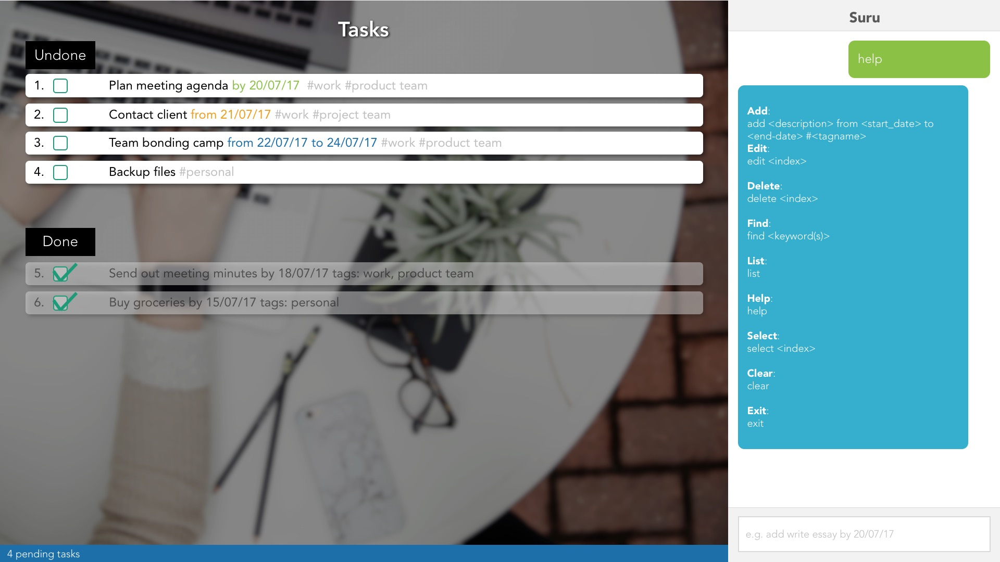
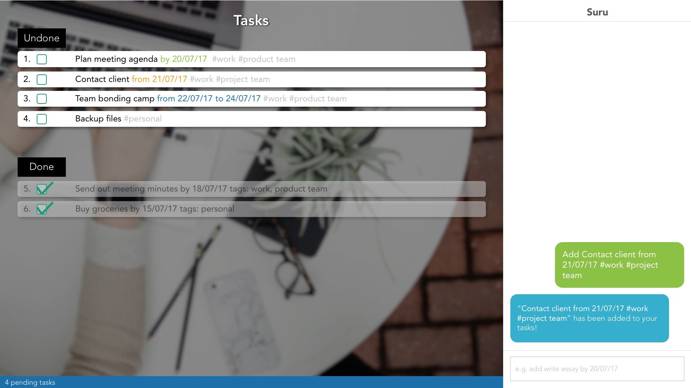
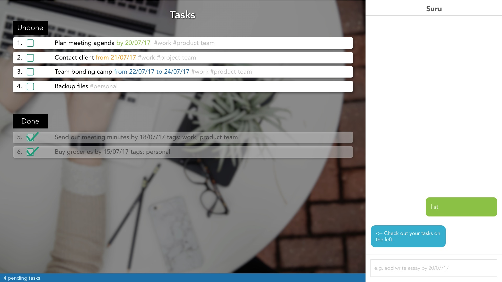
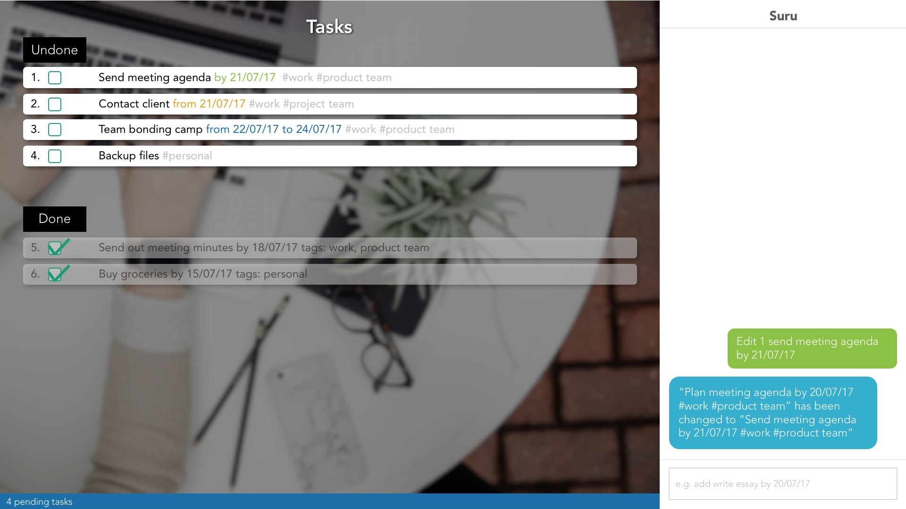
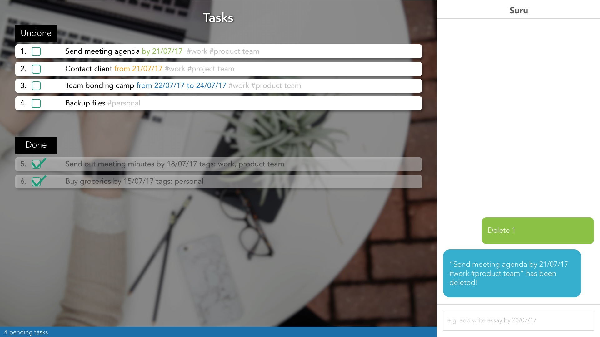

# Suru - User Guide

By : `W09-B3`  &nbsp;&nbsp;&nbsp;&nbsp; Since: `Feb 2017`  &nbsp;&nbsp;&nbsp;&nbsp;

---

1. [Introduction](#1-introduction)
2. [Quick Start](#2-quick-start)
3. [Features](#3-features)
4. [FAQ](#4-faq)
5. [Command Summary](#5-command-summary)

## 1. Introduction

Welcome to Suru, the innovative personal assistant designed to help manage your tasks like a boss. This guide will help you to get Suru installed on your computer and show you how to get the most out of your chatbot.

## 2. Quick Start

0. Before we begin, please ensure you have [Java version `1.8.0_60`](http://www.oracle.com/technetwork/java/javase/downloads/jdk8-downloads-2133151.html) or later installed in your Computer.

   > Having any Java 8 version is not enough.
   > This app will not work with earlier versions of Java 8.

1. Download the latest `suru.jar` from the [releases](../../../releases) tab.
2. Copy the file to a folder you want to use as the home folder for Suru.
3. Double-click the file to start Suru. The app should start in a few seconds and you should see an interface similar to this: 

4. Type a command in the command box and press <kbd>Enter</kbd> to execute it.
   e.g. typing **`help`** and pressing <kbd>Enter</kbd> will open the help window.
5. Some sample commands you can try:
   * **`list`** : lists all of your tasks
   * **`add`**` write essay `**`by`**` 13/3/17` : Adds a task "write essay" with a due date "13/3/17"
   * **`delete`**` 3` : deletes the 3rd task shown in the current list
   * **`exit`** : exits the app
6. Refer to the [Features](#3-features) section below for details of each command.

## 3. Features

> **Command Format**
>
> * Words in `UPPER_CASE` are the parameters.
> * Items in `SQUARE_BRACKETS` are optional.
> * Items with `...` after them can have multiple instances.
> * Parameters can be in any order.

> **Saving the data**
>
> By default, task manager data is saved in the hard disk automatically after commands that change the data.
There is no need to save manually.

### 3.1. Viewing usage instructions: `help`
Suru shows you a list of common commands and how to use them to manage your tasks.

Format: `help`

> Command-specific tips are also shown if you happen to enter an incorrect command or incomplete information. e.g. typing `ad` instead of `add`.

### 3.2. Adding a task with no specified completion date: `add`

Adds a task with just the task description.

Format: `add DESCRIPTION`

> A new task will be added to your task manager with no start or end dates.

Examples:

* `add write essay`

### 3.3. Adding a task with a due date: `add DESCRIPTION by DUE_DATE`

Adds a task with a due date.

Format: `add DESCRIPTION by DUE_DATE`

> A new task with a due date will be added to your task manager.

Examples:

* `add write essay by 13/7/17`

### 3.4. Adding a task with a start date: `add DESCRIPTION from START_DATE`

Adds a task with a start date.

Format: `add DESCRIPTION from START_DATE`

> A new task with a start date will be added to your task manager.

Examples:

* `add write essay from 13/7/17`

### 3.5. Adding a task with a duration: `add DESCRIPTION from START_DATE to END_DATE`

Adds a task with a duration.

Format: `add DESCRIPTION from START_DATE to END_DATE`

> A new task with a duration will be added to your task manager.

Examples:

* `add write essay from 13/7/17 to 15/7/17`

### 3.6. Adding a task with tags: `add DESCRIPTION #TAGNAME`

Adds a task with tags.

Format: `add DESCRIPTION #TAGNAME`

> A new task with tags will be added to your task manager.

Examples:

* `add write essay from 13/7/17 to 15/7/17 #school #homework`
* `add write essay from 13/7/17 #school #homework`
* `add write essay by 15/7/17 #blogging`
* `add write essay #blogging`

### 3.8. Listing all tasks: `list`

Suru displays a list of all your tasks.

Format: `list`

### 3.9. Listing unchecked tasks: `list unchecked`

Suru displays a list of all unchecked tasks in your task manager.

Format: `list unchecked`

### 3.10. Listing checked tasks: `list checked`

Shows a list of all checked tasks in your task manager.

Format: `list checked`

### 3.11. Edit task: `edit INDEX`

Edits a task at the specified `INDEX`.

Format: `edit INDEX`

> * The index refers to the index number shown in the last listing presented by Suru.
> * The index **must be a positive integer** 1, 2, 3, ...
> * The existing task will be updated with your newly entrered information.

Examples:

* `list`
`edit 1 buy groceries by 13/5/17`
  Edits the description of the selected task to `buy groceries` and due date to `13/5/17`.

* `list`
`edit 2 buy groceries`
 Edits the description of the 2nd task in the list to be `buy groceries`.

### 3.12. Deleting a task: `delete INDEX`

Deletes the selected task from your task manager.

Format: `delete INDEX`

> * Deletes the task at the specified `INDEX`.
> * The index refers to the index number shown in the last listing presented by Suru.
> * The index **must be a positive integer** 1, 2, 3, ...

Examples:

* `list`
  `delete 2`
  Deletes the 2nd task in the list.

### 3.13. Undoing a command: `undo`

Reverses your previous command.

Format: `undo`

> Only reverses operations that manipulate data, i.e. `add`, `edit` and `delete`.

### 3.14. Redoing an undone command: `redo`

Reverses your previous undo operation.

Format: `redo`

> Only reverses the previous `undo` operation.

### 3.15. Finding all tasks containing a keyword: `find KEYWORD` 

Finds tasks whose properties contain any of your given keywords.

Format: `find KEYWORD [MORE_KEYWORDS]`

> * The search is **NOT** case sensitive. e.g `write` will match `Write`.
> * The order of the keywords does not matter. e.g. `Write Essay` will match `Essay Write`.
> * All properties are searched e.g. `DUE_DATE`, `TAGS`, `DESCRIPTION` etc.
> * Only full words will be matched e.g. `Ess` will not match `Essay`.
> * Tasks matching at least one keyword will be returned
    e.g. `Essay` will match `Essay Writing Competition`.

Examples:

* `find Essay`
  Returns `Write Essay` and `essay writing`.
* `find Essay Writing Competition`
  Returns any task having keywords `Essay`, `Writing`, or `Competition`.
* `find 17/7/17`
  Returns any task having the date `17/7/17`.

### 3.16. Finding unchecked tasks containg a keyword: `find unchecked KEYWORD`

Finds unchecked tasks whose properties contain any of your given keywords.

Format: `find unchecked KEYWORD [MORE_KEYWORDS]`

> Similar to [regular `find` feature](#315-finding-all-tasks-containing-a-keyword-find-keyword), but only searches through `unchecked` tasks

### 3.17. Finding checked tasks containing a keyword: `find checked KEYWORD`
Finds checked tasks whose properties contain any of the given keywords.

Format: `find checked KEYWORD [MORE_KEYWORDS]`

> Similar to [regular `find` feature](#315-finding-all-tasks-containing-a-keyword-find-keyword), but only searches through `checked` tasks

### 3.18. Checking off a task: `check INDEX`

Checks off a task to indicate that it has been completed.

Format: `check INDEX`

> * Checks off the task at the specified `INDEX`.
> * The index refers to the index number shown in the last listing presented by Suru.
> * The index **must be a positive integer** 1, 2, 3, ...

Examples:

* `list`
  `check 2`
  Checks off the 2nd task in the listing.
* `find Essay`
  `check 1`
  Checks off the 1st task in the results of the `find` command.

### 3.19. Unchecking a task: `uncheck INDEX`

Unchecks a task to indicate that it is incomplete.

Format: `uncheck INDEX`

> * Unchecks the task at the specified `INDEX`.
> * The index refers to the index number shown in the last listing presented by Suru.
> * The index **must be a positive integer** 1, 2, 3, ...

Examples:

* `list`
  `uncheck 2`
  Unchecks the 2nd task in the listing.
* `find Essay`
  `uncheck 1`
  Unchecks the 1st task in the results of the `find` command.

### 3.20. Viewing usage instructions: `help`

Shows a list of commands that Suru accepts.

Format: `help`

### 3.21. Viewing specific command's usage instructions: `help COMMAND`

Shows usage instructions for a specific command.

Format: `help COMMAND`

> Command-specific tips are also shown if you happen to enter an incorrect command or incomplete information. e.g. typing `add` without any information following.

Examples:

* `help add`
Shows usage instructions for the `add` command.

### 3.22. Defining save destination: `saveto FOLDER_PATH`
Allows you to define the destination Suru should save to.

Format: `saveto FOLDER_PATH`

> The `FOLDER_PATH` should be the address of the folder you wish to save your tasks to.

Examples:

* `saveto C:/Suru`

### 3.23. Defining target to load from: `loadfrom FOLDER_PATH`
Allows you to define the target Suru should load from.

Format: `loadfrom FOLDER_PATH`

> The `FOLDER_PATH` should be the address of the folder you wish to load your tasks from.

Examples:

* `loadfrom C:/Suru`

### 3.24. Adding reminders to a task: `add DESCRIPTION reminders: FREQUENCY`

Adds a new task with reminders.

Format: `add DESCRIPTION reminders FREQUENCY:`

> Tasks will be added to your task manager with reminders that will notify you at your desired frequency.

Accepted frequencies:
| Frequency                    | Remarks                         |
|------------------------------|---------------------------------|
| Daily                        | Occurs every day                |
| Weekly                       | Occurs every week               |
| Monthly                      | Occurs every month              |
| Every `NUM_OF_DAYS` days     | Occurs every `NUM_OF_DAYS` days |
| Every `NUM_OF_WEEKS` weeks   | Every `NUM_OF_WEEKS` weeks      |
| Every `NUM_OF_MONTHS` months | Every `NUM_OF_MONTHS` months    |

Examples:

* `add go jogging reminders: every 3 days`
* `add write article on blog from 27/01/17 to 26/06/17 reminders: every week`

### 3.25. Editing reminders of a task: `edit INDEX reminders: FREQUENCY`

Edits an existing task's reminders.

Format: `edit INDEX reminders: FREQUENCY`
> List of accepted frequencies are shown [above](#324-adding-reminders-to-a-task-add-description-reminders-frequency)

Examples:

* `list`
`edit 1 reminders: daily`

### 3.26. Removing reminders from a task: `edit INDEX reminders:`*`(EMPTY)`*

Removes an existing task's reminders.

Format:`edit INDEX reminders:`*`(EMPTY)`*

* `edit 2 buy groceries reminders:`
  Edits the description of the 2nd task to be `buy groceries` and clears all existing reminders.

### 3.27. Adding a recurring task: `add DESCRIPTION recurring: FREQUENCY`

Add a recurring task.

Format: `add DESCRIPTION recurring: FREQUENCY`

> Tasks will be added to your task manager that will repeat at your desired frequency.

Accepted frequencies:
| Frequency                    | Remarks                         |
|------------------------------|---------------------------------|
| Daily                        | Occurs every day                |
| Weekly                       | Occurs every week               |
| Monthly                      | Occurs every month              |
| Every `NUM_OF_DAYS` days     | Occurs every `NUM_OF_DAYS` days |
| Every `NUM_OF_WEEKS` weeks   | Every `NUM_OF_WEEKS` weeks      |
| Every `NUM_OF_MONTHS` months | Every `NUM_OF_MONTHS` months    |

Examples:

* `add write essay recurring: daily`
* `add write essay recurring: weekly`
* `add write essay recurring: every 2 weeks`

### 3.28. Sorting tasks: `sort by PROPERTY`
Suru sorts your tasks by a chosen property.

Format: `sort by PROPERTY`

> Tasks will be sorted and listed by the chosen property

Accepted Properties:
| Property    | Remarks                                |
|-------------|----------------------------------------|
| DESCRIPTION | Sorts by the descriptions of the tasks |
| START  | Sorts by the start dates of the tasks  |
| END    | Sorts by the end dates of the tasks    |

Examples:

* `sort by description`
* `sort by start`
* `sort by end`

### 3.29. Using hotkeys: `-HOTKEY`
Suru recognizes a hotkey combination and executes the required operation.

Format: `-HOTKEY`

Accepted Hotkeys:
| Hotkey    | Remarks                                |
|-------------|----------------------------------------|
| -a | Shorthand for `add` command |
| -s  | Shorthand for `sort by` command  |
| -ls    | Shorthand for `list` command    |
Examples:

* `-a write essay`: adds new task with description `write essay`
* `-s due date`: sorts by `due date`
* `-ls`: lists all tasks

### 3.30. Adding a task to Google Calendar: `addGTask DESCRIPTION`
Add tasks to Google Calendar.

Format: `addGTask DESCRIPTION`

Examples:
* `addGTask meet team for dinner`

### 3.31. Exiting the app: `exit`
Exits Suru.

Format: `exit`

## 4. FAQ

1. How do I transfer my data to another Computer?

    **A**: Install the app in the other computer and use the `loadfrom` command to specify your desired directory to load data from.

2. Does Suru sync my data across different devices?

    **A**: Unfortunately, Suru currently does not sync your data across different devices. Alternatively, you can specify your save location in a synced folder (such as a dropbox folder) on your computer using the [`saveto`](#322-defining-save-destination-saveto-folder-path) command. Thereafter, simply use the [`loadfrom`](#323-defining-target-to-load-from-loadfrom-folder-path) command on your other device to retrieve your synchronized data.

3. Does Suru require internet connectivity to work?

    **A**: No! You can use all the features of Suru without connecting to the internet.

4. Where can we seek further assistance for Suru?
    
    **A**: Feel free to contact us at e0003823@u.nus.edu

## 5. Command Summary
[**Help**](#31-viewing-usage-instructions-help): `help`

[**Add**](#32-adding-a-task-with-no-specified-completion-date-add):`add DESCRIPTION from START_DATE to END_DATE #TAGNAME... recurring:... reminders:...`
Examples:
> * `add Write essay`
> * `add Write essay by 24/12/17`
> * `add Write essay from 20/12/17`
> * `add Write essay from 20/12/17 to 24/12/17`
> * `add Write essay #school #homework`
> * `add Write essay from 20/12/17 recurring: weekly`
> * `add Write essay reminders: 1 day, 30 mins`

[**List**](#38-listing-all-tasks-list): `list`
Examples:
> * `list unchecked`
> * `list checked`

[**Edit**](#311-edit-task-edit-index): `edit INDEX`
Examples:
> * `edit 2 buy groceries`
> * `edit 1 buy groceries by 13/5/17`

[**Delete**](#312-deleting-a-task-delete-index): `delete INDEX`
Examples:
> * `delete 3`

[**Undo**](#313-undoing-a-command-undo): `undo`

[**Redo**](#314-redoing-an-undone-command-redo): `redo`

[**Find**](#315-finding-all-tasks-containing-a-keyword-find-keyword): `find KEYWORD [MORE_KEYWORDS]`
Examples:
> * `find Essay`
> * `find Essay Jogging`

[**Check**](#318-checking-off-a-task-check-index): `check INDEX`
> * `list`
> `check 1`

[**Uncheck**](#319-unchecking-a-task-uncheck-index): `uncheck INDEX`
> * `list`
> `uncheck 1`

[**Save To**](#322-defining-save-destination-saveto-folder-path): `saveto FOLDER_PATH`
Examples:
> * `saveto C:/Suru`

[**Load From**](#323-defining-target-to-load-from-loadfrom-folder-path): `loadfrom FOLDER_PATH`
Examples:
> * `loadfrom C:/Suru`

[**Sort**](#328-sorting-tasks-sort-by-property): `sort by PROPERTY`
Examples:
> * `sort by description`
> * `sort by start`
> * `sort by end`

[**Exit**](#331-exiting-the-app-exit): `exit`
