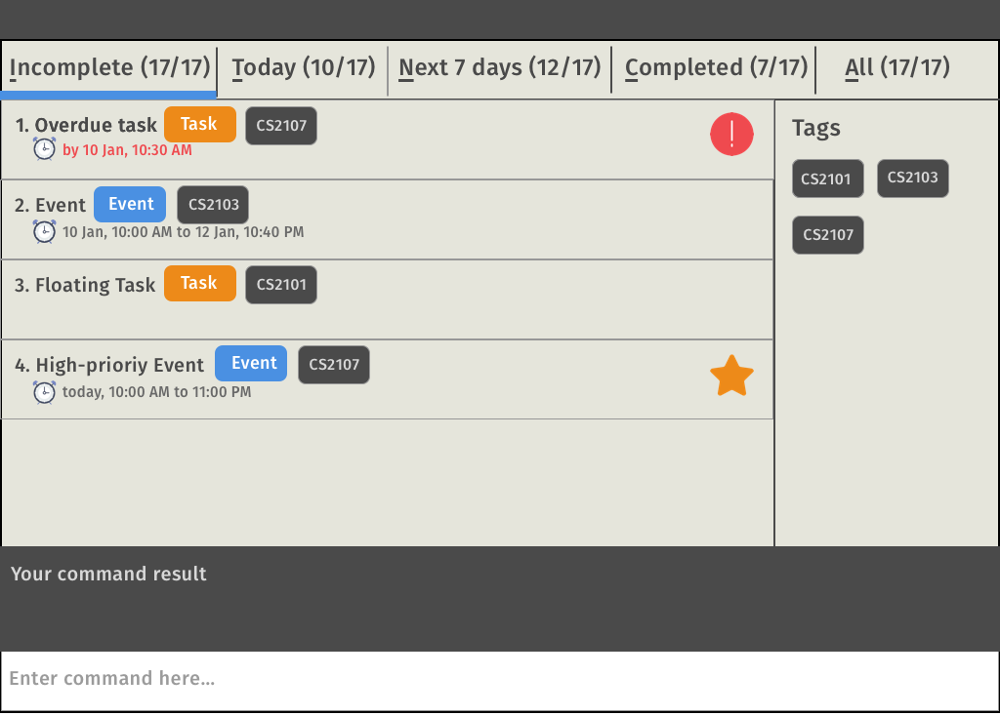

# Doist - User Guide

By : `W13-B4`  &nbsp;&nbsp;&nbsp;&nbsp; Since: `Jan 2017`  &nbsp;&nbsp;&nbsp;&nbsp; Licence: `MIT`

---

1. [Introduction](#1-introduction)  
2. [Quick Start](#2-quick-start)  
3. [Features](#3-features)  
  3.1. [Viewing help](#31-viewing-help--help)  
  3.2. [Adding a new task](#32-adding-a-new-task--add)  
  3.3. [Listing tasks](#33-listing-tasks--list)  
  3.4. [Finding a task](#34-finding-a-task--find)  
  3.5. [Deleting a task](#35-deleting-a-task--delete)  
  3.6. [Marking tasks as finished](#36-marking-tasks-as-finished--finish)  
  3.7. [Editing an existing task](#37-editing-an-existing-task--edit)  
  3.8. [Listing all tags](#38-listing-all-tags--listtag)  
  3.9. [Undoing previous commands](#39-undoing-previous-commands--undo-redo)  
  3.10. [Clearing all tasks](#310-clearing-all-tasks--clear)  
  3.11. [Setting an alias for a command word](#311-setting-an-alias-for-a-command-word--alias-view-alias)  
  3.12. [Changing the storage location](#312-changing-the-storage-location--save-at)  
  3.13. [Saving the data](#313-saving-the-data)  
  3.14. [Exiting the program](#314-exiting-the-program--exit)  
4. [FAQs](#4-faqs)
5. [Command Summary](#5-command-summary)

## 1. Introduction

Do you love the adrenaline rush you get when you check an item off your to-do list, but are you too busy to actually make one? Use Doist today, be a Doist and feel more organised than ever before!

Doist is the comprehensive tool to help you in all your planning. It allows you to key in, sort, tag, set reminders and even search for your tasks and events so that you can focus on getting things done. Your hands never need to leave the keyboard with our command-line input interface, and our easy-to-use UI will keep you coming back for more. Once you are a Doist, there's no looking back.

Doist. Rediscover your love for doing things, one line at a time!

## 2. Quick Start

Are you ready to be a Doist?

0. Ensure you have Java version `1.8.0_60` or later installed in your computer.

>    Having any Java 8 version is not enough.
>    This app will not work with earlier versions of Java 8.

1. Download the latest `.jar` from the [releases](../../../releases) tab.
2. Copy the file to the folder you want to use as the home folder for Doist. You can change this later.
3. Double-click the file to start the app. The GUI should appear in a few seconds.
   
   
 *Figure 2.1: Doist Application Window*  

4. Voila, you are ready to be more productive! Type a command in the command box and press <kbd>Enter</kbd> to execute it.  
   e.g. typing **`help`** and pressing <kbd>Enter</kbd> will open the help window.

### Getting started with commands :

Type the following commands and press <kbd>Enter</kbd> after each command.
1. **`add Attend group meeting \from 3pm \to 5pm`**.  
Adds an event for today with a description of "Attend group meeting" from 3pm to 5pm today
2. **`add Go grocery shopping \by 6pm 25th Oct`**.  
Adds a task with a description of "Go grocery shopping" which has a 6pm deadline on the 25th of October.
3. **`finish 1`**  
Marks the first task in the list as finished.
4. **`list pending`**  
Lists all the pending tasks.
5. **`delete 1`**  
Deletes the 1st task shown in the current list.
6. **`exit`**  
Exits the application.

Go ahead and try out different date and time formats for the add command!

Refer to the [Features](#features) section below for details of each command. 

## 3. Features

**Command Format**

Take note of some general information for our commands :
> * All commands begin with a command word.  
> *e.g.* `add`, `edit`  
> * All keys start with the backslash `\`.  
> *e.g.* `\from`, `\to` are the keys in `add Buy the milk \from 3pm \to 5pm`  
> * Command words and keys that consist of multiple words will not contain spaces. Underscores are used instead.  
> *e.g.* `list_tag`, `\remind_at`  
> * Words in `UPPER_CASE` are the values. You can enter whatever you want for them! 
> * If you want to use backslash `\` in the value, use `\\`.  
> *e.g.* `add Remember to check file at C:\\users\\! \by 3pm` would appear as Remember to check file at C:\users\.  
> * Items in `[]` are optional.  
> * Items with `...` after them can have multiple instances, separated by space.  
> *e.g.* `[INDEX...]` means you can specify multiple indices for that command.  
> * The keys can be entered in any order after the command word.  
> *e.g.* `add Buy the milk \to 3pm \from 5pm` works too!  

### 3.1 Viewing help : `help`

Feeling a bit lost? Simply type "help" to view the handy help page!  
`help`

### 3.2 Adding a new task : `add`

You can use the `add` command to add tasks. Tracking your tasks is what Doist does best!  

**Description**  
Add a new task with a description by using just the `add` command word.  
 
Format: `add TASK_DESCRIPTION`
> **Examples:**  
> - `add buy milk`  

> **Remarks:**  
> - To use backslash `\` in your description, type `\\`

**Start time and End time**  
Add a task with a start time and end time for events that occur over a period of time with `\from` and `\to` keys.  
 
Format: `add TASK_DESCRIPTION [\from START_TIME] [\to END_TIME]`
> **Examples:**  
> - `add buy milk \from 3pm \to 4pm` 
> - `add buy milk \from 12 Oct 3pm \to 4pm`  

> **Remarks:**  
> - See Figure 3.2.1 for acceptable date and time formats.

**Deadline**  
Add a task that has a deadline with the `\by` key.
 
Format: `add TASK_DESCRIPTION [\by TIME]`

> **Examples:**  
> - `add buy milk \by 3pm`  
> - `add buy milk \by 28th Feb`  

**Acceptable date and time formats**  

Date Format |Examples
----------- | :------- |
Day Month | 1st Oct
Day Month Year | 1st Oct 2017
Month Day | Oct 1st
Month / Day | 10/1
Month / Day / Year | 10/1/17
Relative | today, tomorrow, tmr, two days later

Time Format | Examples
----------- | :------- |
Hour:Min | 03:00
Hour.Min | 03.00, 3.00
Hour am/pm (12 hour format) | 3pm, 3am
Hour (24 hour format)| 3
  
 
 *Figure 3.2.1: Acceptable date and time formats*  

> **Remarks:**  
> - If you do not explicitly state the date, the date will be assumed to be within the next 24 hours  
> - If you do not explicitly state the time, the time will be assumed to be the current time of the day
> - If you do not explicitly state the year, the year will be assumed to be the current year
> - Note that the start time and remind time must be earlier or equal to the end time

**Priority**  
Add a task with higher priorities with the `\as` key. By default, tasks are of normal priority. Since we all have certain tasks that are more important than others, you can indicate that they are important or very important!  
 
Format: `[\as PRIORITY]`
> **Examples:**  
> - `add buy milk \as important` 
> - `add buy milk \as very important`  

> **Remarks:**  
> - `Priority` can be `normal`, `important`, `very important`

**Tags**  
Add a task with tags with the `\under` key. Separate multiple tags with spaces. 
 
Format: `[\under TAG...]`
> **Examples:**  
> - `add buy milk \under shopping friends`  
> - `add buy milk \under for_myself`  

> **Remarks:**  
> - Tasks can have any number of tags (including 0)

**Sample Commands:**

* `do group meeting \from 4pm today \to 6pm today \as important \under school_work CS2103T`
* `add submit pre-tutorial activities \by 6pm this Wednesday \remind_at 5pm this Wednesday`

### 3.3 Listing tasks : `list`

You can use the `list` command to list different types of tasks! Doist knows that you have many tasks and will need to filter them in some way to concentrate on doing those tasks.  

**List pending, overdue, finished, all tasks**  
List `pending`, `overdue`, `finished` or `all` tasks by simply using the `list` command.  
 
Format: `list [TYPE]`
> **Examples:**  
> - `list`  
> - `list all`  
> - `list finished`  

> **Remarks:**  
> - `list` will by default show both pending and overdue tasks.  

**List tasks during a time period**  
List tasks occurring during a time period by using the `\from` and `\to` keys.  
 
Format: `[\from TIME] [\to TIME] `
You can also use the `\in` key for tasks occurring `today`, `this week`, `this month` and so on.
`[\in TIME_INTERVAL]`
> **Examples:**  
> - `list \from 3pm \to 5pm`  
> - `list \in this week`  

> **Remarks:**  
> - See Figure 3.2.1 for acceptable date and time formats  

**List tasks under tags**  
List tasks that are under certain tags by using the `\under` key.  
 
Format: `[\under TAG]`
> **Examples:**  
> `list \under shopping`  

**Sample Commmands**
* `list pending \under school_work`  
* `list pending \in today`  
* `list \in this week`  
* `list finished \from 1st March \to 20th March \under internship`  

### 3.4 Finding a task : `find`

You can use the `find` command to find tasks whose description contains any of the given search queries. You just need to remember any of the words in the description of a task to find it in your long list of tasks!  
 
Format: `find 'QUERY' ['QUERY'...]`
> **Examples:**  
> - `find buy groceries`  
> - `list meeting with professor`  

> **Remarks:**  
> - Spaces are allowed in search query. 
> - The search is case insensitive.  
> - The order of the search keys does not matter. *e.g.* `'Hans' 'Bo'` will match `'Bo Hans'`  
> - Only the task description is searched.  
> - Tasks matching at least one search query will be returned.
    *e.g.* A task with a description of `Hans` will match search query `Hans Bo`  

**Sample Commmands**

* `find hiking`  
* `find CS2103T group meeting project`  

### 3.5 Deleting a task : `delete`

You can use the `delete` command to delete the task specifed by an index. The index refers to the index number of the task shown in the most recent listing.  
 
Format: `delete INDEX [INDEX...] [INDEX - INDEX]`
> **Examples:**  
> - `delete 3`  
> - `delete 3 4 5`  
> - `delete 2-6`  

> **Remarks:**  
> - Deletes the tasks at the specified `INDEX`. 
> - You can delete more than one task by specifying multiple indices. 
> - You can also specify a range of indices to be deleted. 

**Sample Commands**
* `list finished` 
  `delete 1 2` 
  This combination of commands deletes the 1st and the 2nd tasks in the result of `list` command.
* `find 'party'` 
  `delete 1-5` 
  This combination of commands deletes the first 5 tasks in the results of the `find` command.

### 3.6 Marking tasks as finished : `finish`

You can use the `finish` command to mark the specified tasks as finished.  
 
Format: `finish INDEX [INDEX...] [INDEX - INDEX] `

Use the `unfinish` command to change the status of an already finished task to not finished.
`unfinish INDEX [INDEX...] [INDEX - INDEX]`

> **Examples:**  
> - `finish 3`  
> - `finish 3 4 7-9`  
> - `unfinish 3`  

> **Remarks:**  
> - The index refers to the index number of the task shown in the most recent listing. 
> - If the task(s) at the specified `INDEX` is/are already finished, there will be no changes made.

**Sample Commands**
* `list pending \in this week` 
  `finish 1 2` 
  This combination of commands marks the 1st and the 2nd tasks in the result of `list` command as finished.
* `find 'project'` 
  `finish 1` 
  This combination of commands marks the 1st task in the results of the `find` command as finished.

### 3.7 Editing an existing task : `edit`

You can use the `edit` command to edit the specified task. Feel free to edit whatever you want in one line. Be assured that other properties of the task will not change!  
 
Format: `edit INDEX [TASK_DESCRIPTION] [\from START_TIME] [\to END_TIME] [\as PRIORITY] [\under TAG...]`

Just like the add command, `[\by TIME]` can be used in place of `\from` and `to`
> **Examples:**  
> - `edit 3 edited description of task`  

> **Remarks:**  
> - Refer to the section about the `add` command to know how to use the keys of the `edit` command because they are used in the exact same way

**Sample Commands**
* `list` 
  `edit 1 \desc watch NBA \from tuesday 7pm \to tuesday 9pm` 
  Suppose that the description of this task is originally `watch nba`,
  the new description will be changed to `watch NBA`.
  The 'from' and 'to' times will also be updated.

### 3.8 Listing all tags : `list_tag`
If you want to list tasks by tag but you can't remember what tags there are, you can use the `list_tag` command to display a list of all existing tags.  
 
Format: `list_tag`  

### 3.9 Undoing previous commands : `undo`, `redo`

You can use `undo` to undo previous commands. Undo as many times as you wish!  
 
Format: `undo`  
 
If you regret undoing a command, you can use `redo` to restore your changes.

### 3.10 Clearing all tasks : `clear`

Done with all your tasks? Need an empty to-do list?
You can simply use `clear` to clear all tasks.  
 
Format: `clear`

### 3.11 Setting an alias for a command word : `alias`, `view_alias`

Do you feel that our default command words are too lengthy and will like to set your own command words?  
You can use `alias` to set an alias for an existing command word. You will then be able to use the alias to trigger the command!    
Format: `alias ALIAS \for COMMAND_WORD`

> **Examples:**  
> - `alias a \for add`  

> **Remarks:**  
> - `ALIAS` should have no spaces, we suggest you use underscores to replace spaces.  
> - If you are unable to set an alias, your alias is an existing command word.
> - If you try to set the same alias to two different command words, the alias will only be set for the second command word.

There are already some default aliases set for you. For example, `do` can be used in place of `add` and `ls` can be used in place of `list`. You can use `view_alias` to view the current list of aliases!  
 
Format: `view_alias`

### 3.12 Changing the storage location : `save_at`

You can use `save_at` to change the place that Doist would store its data at.  
 
Format: `save_at PATH`

> **Examples:**  
> - `save_at C:\Users\admin\Desktop`  
> - `save_at \Desktop`  

> **Remarks:**  
> - You can provide a relative path for this command.

### 3.13 Saving the data

Doist will automatically save! There is no need to save manually.

### 3.14 Exiting the program : `exit`

Use `exit` to exit Doist.  
 
Format: `exit`  

## 4. FAQs

**Q**: How do I transfer my data to another Computer? 
**A**: Install the app in the other computer and overwrite the empty data files (namely, todolist.xml and aliaslistmap.xml) it creates with the old data files that contains the data of your previous Doist folder.

**Q**: Do I need to save my data before I exit Doist?  
**A**: You do not need to explicitly save your data, as Doist automatically does this for you!

**Q**: Why does Doist not recognise the date / time that I typed?  
**A**: See Figure 3.2.1 for acceptable date and time formats. Note that we use the US Date Format of MM/DD/YYYY.

**Q**: Why am I unable to give an alias?  
**A**: If you are unable to alias, your alias is an existing command word.

## 5. Command Summary

* **Add** :
  `add TASK_DESCRIPTION [\from START_TIME] [\to END_TIME] [\as PRIORITY] [\under TAG...]`  
  `add TASK_DESCRIPTION [\by TIME] [\as PRIORITY] [\under TAG...]`  
  e.g. `do group meeting \from 4pm today \to 6pm today \as important \under school_work CS2103T`

* **Alias** :
  `alias ALIAS \for COMMAND_WORD`  
  e.g. `alias set_alias \for alias`
  `view_alias`

* **Clear** :
  `clear`  

* **Change storage path** :
  `save_at PATH`  
  e.g. `save_at C:\Users\admin\Desktop\todolist.xml`

* **Delete** :
  `delete INDEX [INDEX...]`  
   e.g. `delete 3 4 5`

* **Edit** :
  `edit INDEX [\desc TASK_DESCRIPTION] [\from START_TIME] [\to END_TIME] [\as PRIORITY] [\under TAG...]`  
  `edit INDEX [\desc TASK_DESCRIPTION] [\by TIME] [\as PRIORITY] [\under TAG...]`  
  e.g. `edit 1 \desc watch NBA \as important`

* **Exit** :
  `exit`

* **Find** :
  `find KEYWORD [MORE_KEYWORDS]`  
  e.g. `find 'test' 'midterm'`

* **List** :
  `list [TYPE] [\from TIME] [\to TIME] [\under TAG]`  
  `list [TYPE] [\in TIME_INTERVAL] [\under TAG]`  
  e.g. `list pending \in this month \under internship`

* **List tags** :
  `list_tag`

* **Mark as finished** :
  `finish INDEX [INDEX...]` 
  e.g. `finish 1 8`  
  `unfinish`

* **Help** :
  `help`

* **Undo/Redo** :
  `undo`  
  `redo`
