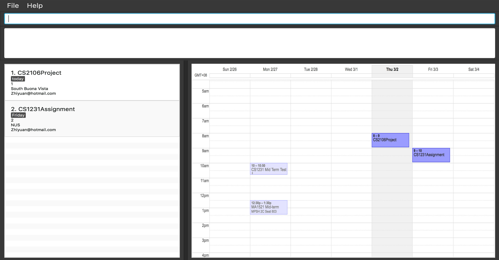

# Task Manager - User Guide

Please refer to the [Setting up](DeveloperGuide.md#setting-up) section to learn how to set up Task Manager.

---

1. [Start Project](#start-project)
2. [Features](#features)
3. [FAQ](#faq)
4. [Command Summary](#command-summary)

## 1. Start Project

1. Ensure you have Java version `1.8.0_60` or later installed in your Computer. 

   > Having any Java 8 version is not enough.  
   > This app will not work with earlier versions of Java 8.

2. Find the project in the `Project Explorer` or `Package Explorer` (usually located at the left hand side of the project explorer)
3. Right click on the project.
4. Click `Run As` > `Java Application` > select `MainApp` and click `ok` at the bottom right hand corner.
5. The GUI should appear in a few seconds.

6. Refer to the [Features](#features) section below for details of each command. 

## 2. Features

> **Command Format**
>
> * Words in `UPPER_CASE` are the parameters.
> * Items in `SQUARE_BRACKETS` are optional.
> * Items with `...` after them can have multiple instances.
> * Parameters can be in any order.

### 2.1. Viewing help : `help`

Format: `help`

> * Help is also shown if you enter an incorrect command e.g. `abcd`

### 2.2. Adding a task: `add`

Adds a task to the task manager 
Format: `add [task] TASKNAME [label LABELNAME] [(by|on) DEADLINE]`

> * Tasks can have a deadline, or can do without one as well.
>   * Tasks added without specifying a deadline will be displayed under "No Deadline".
>   * Date formats can be flexible. The application is able to parse commonly-used human-readable date formats.
>     * e.g. `Monday`, `next wed`, `tomorrow`, `5 days after`, `4 Apr` etc.
> * Dates can include time as well.
>   * If only time is specified, it will default to today's date.
>   * If time is not specified, it will default to the current time of the particular date.
>   * Time formats are flexible as well. The application supports 24 hour format and AM/PM format.
>     * e.g. `Monday 3pm`, `today 1930`, `5:30pm`, `10.00 am`
> * Tasks can have any number of label name. (including 0).
> * Using the `add` command without specifying `task` will interpret the command as `add task`.

Examples:

 * `add CS2106 Mid terms`
 * `add CS2103 V0.0 by tmr`
 * `add task Make baby by next wednesday`

### 2.3 Listing all tasks : `list`

Shows a list of all tasks in Task Manager. Able to filter by type of task (task), or based on status of task such as completed or outstanding.

Format: `list [TYPE]`

> Valid parameters: 
> * `tasks` / `task`
> * `complete` / `completed`
> * `incomplete` / `outstanding`
> * `overdue` / `over`
> * `by DATE`
> * `from STARTDATE to ENDDATE`

Examples:

* `list`  
 Lists all tasks.

* `list overdue tasks`    
 Lists all overdued tasks

* `list outstanding tasks`   
 Lists all outstanding tasks

* `list completed tasks`    
 Lists all completed tasks

* `list by today`  
 Lists all tasks due by today

* `list from monday to friday`    
 Lists all tasks due within Monday-Friday
 
### 2.4. Editing a task : `update`

Edits the specified task's details.

Format:`update INDEX [TASKNAME] [label LABELNAME] ([(by|on) DATE] | [from STARTDATE to ENDATE])`

> * Edits the task at the specified `INDEX`.
    The index refers to the index number shown in the task listing. 
    The index **must be a positive integer** 1, 2, 3, ...
> * At least one of the optional fields must be provided.
> * Existing values will be updated to the input values.
> * When editing labels, the existing labels of the person will be removed i.e adding of labels is not cumulative.
> * You can remove all the person's tags by typing `label` without specifying any tags after it. 

Examples:

* `update 1 label tedious shit by thursday` 
  Edits the label and deadline of the 1st task to be `tedious shit` and deadline to `Thursday` respectively.

* `update 2 CS2106Assignment label` 
  Edits the name of the 2nd task to be `CS2106Assignment` and clears all existing labels.

### 2.5. Finding all task containing any keyword in task name and labels : `find`

Finds tasks whose name and labels containin any of the specified keywords.  

Format: `find [TYPE] KEYWORD [MORE_KEYWORDS]...`

> Valid parameters: 
> * `TaskName`
> * `LabelName`
> * `Complete` / `Completed`
> * `Incomplete` / `Outstanding`
> * `DATE`
> * `from STARTDATE to ENDDATE`

> * The search is case insensitive and the order of the keywords does not matter.
> * Task names, label names will be searched, and tasks with at least one keyword match will be return and display to user.

Examples: 

* `find CS2103`   
Returns all task containing the keyword or label containing `CS2103` & `cs2103`.

* `find task project`  
Returns all task with the name containing `project` & `Project`.

* `find label glocery`    
Returns all task with the label name containing `glocery` & `Glocery`.
  
* `find project glocery`  
Returns all tasks having name or label name containing `project`, `Project`,  `glocery`, `Glocery`.

### 2.6. Deleting a task : `delete`

Deletes the specified task from the address book. Reversible via undo command.

Format: `delete INDEX`

> Deletes the task at the specified `INDEX`.  
> The index refers to the index number shown in the most recent task listing.
> The index **must be a positive integer** 1, 2, 3, ...

Examples:

* `delete 2`    
  Deletes the 2nd task in the Task Manager.
* `find Project`    
  `delete 1`    
  Deletes the 1st task in the results of the `find` command.

### 2.7. Select a Task : `select`

Selects the person identified by the index number used in the last person listing. 
Format: `select INDEX`

> Selects the person and loads the Google search page the person at the specified `INDEX`. 
> The index refers to the index number shown in the most recent listing. 
> The index **must be a positive integer** 1, 2, 3, ...

Examples:

* `list` 
  `select 2` 
  Selects the 2nd person in the address book.
* `find Betsy`  
  `select 1` 
  Selects the 1st person in the results of the `find` command.

### 2.8. Clearing all entries : `clear`

Clears all entries from the Task Manager. 
Format: `clear`

### 2.9. Exiting the program : `exit`

Exits the Task Manager. 
Format: `exit`

### 2.10. Saving the data

Task manager data are saved in the hard disk automatically after any command that changes the data. 
There is no need to save manually.

## 3. FAQ

**Q**: How do I transfer my data to another Computer? 
**A**: Install the app in the other computer and overwrite the empty data file it creates with the file that contains the data of your previous Address Book folder.

## 4. Command Summary

* **Add**  `add NAME p/PHONE_NUMBER e/EMAIL a/ADDRESS [t/TAG]...`  
  e.g. `add James Ho p/22224444 e/jamesho@gmail.com a/123, Clementi Rd, 1234665 t/friend t/colleague`

* **Clear** : `clear`

* **Delete** : `delete INDEX`  
   e.g. `delete 3`

* **Find** : `find KEYWORD [MORE_KEYWORDS]`  
  e.g. `find James Jake`

* **List** : `list`  
  e.g.

* **Help** : `help`  
  e.g.

* **Select** : `select INDEX`  
  e.g.`select 2`

