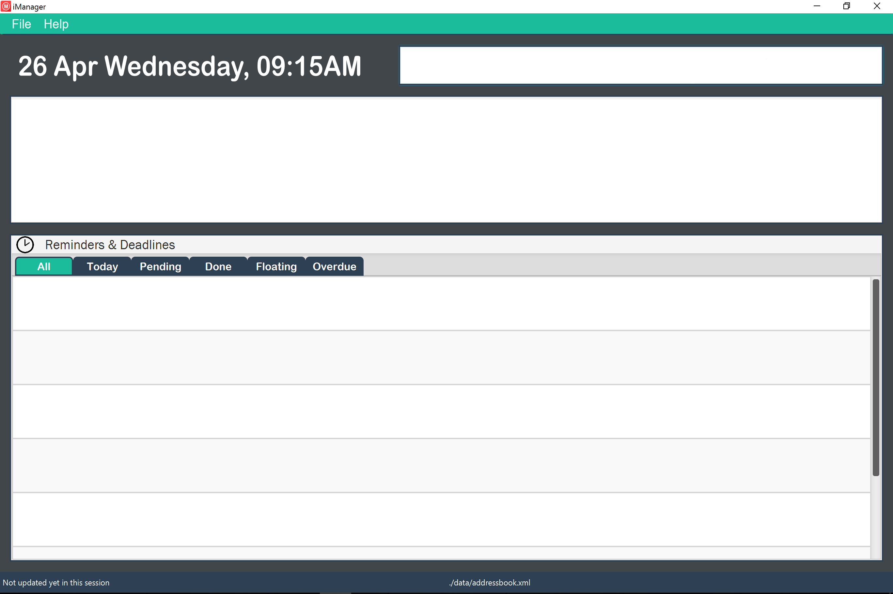
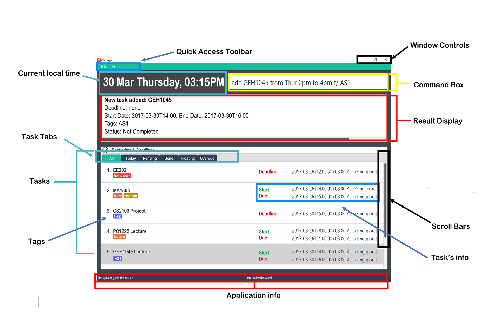
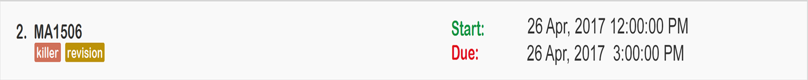
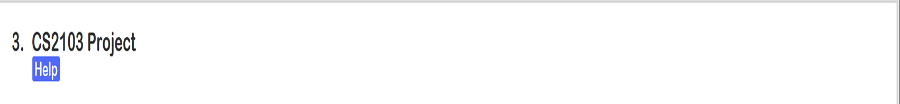

<!---A0135998H-->
# User Guide
* [Introduction](#introduction)
* [Quick Start](#quick-start)
* [Features](#features)
  * [Overview](#overview)
  * [Task Tabs](#task-tabs)
* [Commands](#commands)
  * [Command Format](#command-format)
  * [Date and Time Format](#date-and-time-format)
  * [Viewing help](#viewing-help)
  * [Adding a task](#adding-a-task)
    * [Adding a task with duration](#adding-a-task-with-duration)
    * [Adding a task with deadline](#adding-a-task-with-deadline)
    * [Adding a floating task](#adding-a-floating-task)
   * [Editing a task](#editing-a-task)
   * [Deleting a task](#deleting-a-task)
   * [Viewing tasks](#viewing-tasks)
     * [Viewing all tasks](#viewing-all-tasks)
     * [Viewing all today's tasks](#viewing-all-todays-tasks)
     * [Viewing all pending tasks](#viewing-all-pending-tasks)
     * [Viewing all "done" tasks](#viewing-all-done-tasks)
     * [Viewing all floating tasks](#viewing-all-floating-tasks)
     * [Viewing all overdue tasks](#viewing-all-overdue-tasks)
   * [Marking a task as "done"](#marking-a-task-as-done)
   * [Selecting a task](#selecting-a-task)
   * [Finding for tasks](#finding-for-tasks)
   * [Clearing all tasks](#clearing-all-tasks)
   * [Undo most recent command](#undo-most-recent-command)
   * [Redo most recent undo](#redo-most-recent-undo)
   * [Save](#save)
   * [Exiting the application](#exiting-the-application)
* [FAQ](#faq)
* [Command Summary](#command-summary)

## Introduction
Today’s hectic world constantly bombards people with innumerable tasks at hand. As a result, people tend to lose track of their work progress and deviate from their priorities. Problems like this are far too common among working adults and students embarking on tightly schedule projects. Thus, our team has created the solution to all your management problems:

Presenting to you,  iManager.

iManager is your one-stop application that helps you manage all your tasks at one go. With its interactive UI, managing tasks has never been easier. Our product incorporate niche features such as Flexi Commands and tab reference which saves you time and energy, managing tasks that would otherwise require the use of multiple applications.

Without further ado, let us get started.

## Quick Start
0. Ensure you have Java version `1.8.0_60` or later installed in your Computer. 
   > Having any Java 8 version is not enough.  
   This app will not work with earlier versions of Java 8.

1. Download the latest `iManager.jar` from the [releases](../../../releases) tab.
2. Copy the file to the folder you want to use as the home folder for your iManager application.
3. Double-click the file to start the app. The GUI should appear in a few seconds.
   > 

4. Type the command in the command box and press <kbd>Enter</kbd> to execute it.  
   e.g. typing **`help`** and pressing <kbd>Enter</kbd> will open the help window.
5. Some example commands you can try:
   * **`add Sunrise Marathon from 2pm Sat to 6pm Sat`**: Adds a task named ‘Sunrise Marathon’ that take place on Saturday from 2pm to
   6pm.
   * **`view t`**:  view a list for all events happening today.
   * **`delete 1`**:  Delete the first task from the task list.
   * **`exit`**: exits the application.
6. Refer to the [Commands](#commands) section below for details of each command.

## Features

#### Overview
iManager at a Glance.
> 

### Task Tabs
Tasks are categorised into 6 groups, namely, “All”, “Today”, “Pending”, “Done”, “Floating” and “Overdue”. Each group is associated with a clickable tab that allows you to navigate between a list of tasks that falls under these groups.

> * 
> * Floating tasks are tasks that has neither has a duration nor deadline.
> * Alternatively, you can use the [view](#viewing-tasks) to perform the same navigation using your keyboard.

## Commands
### Command Format
> * Words in `UPPER_CASE` are command arguments, e.g. NAME, INDEX and STARTDATE.
> * Words in `lower_case` are command and connectors, e.g. add and by.
> * Letters with slash are command identifiers, e.g. t/.
> * Items in `SQUARE_BRACKETS` are optional.
> * Items with `...` behind can have multiple instances.
> * `|` means "or".

### Date and time Format
Format: `[EEEEE][dd MM YYYYY][HH:mm:ss a]`
> * Applicable to STARTDATE, ENDDATE, DEADLINE.
> * `[EEEEE]`: Day of the week. Case insensitive. Abbreviation is allowed. (e.g. Mon, Monday, Tue, Tuesday, thur, thursday etc.)
> * `[dd]`: Day of the Month. (e.g. 1, 11, 31 etc.)
> * `[MM]`: Month of the year. Case insensitive. Abbreviation is allowed. (e.g. Jan, January Apr, April, dec, december.)
> * `[YYYYY]`: Period of 12 months. (e.g. 1999, 2016, 2020.)
> * `[HH:mm:ss aTIME]`: 12-hours-clock. Case insensitive. (e.g. 12am, 1:30am, 3:45AM.)
> * The order of the date and time does not matter when typing a command.
> * Missing field will be replace by CURRENT DATE AND TIME.

### Viewing help
#### Viewing all commands
Do you have trouble using iManager? Are you unsure of what to type? Don’t worry, simply type help and our help window will pop up to your rescue.  

Format: `help`
> Pressing "f1" will also produce the same effect.
> Entering the wrong command will flashed the correct usage of the command in the result display.

Examples:
* `help`  
  Shows all available commands with examples.

### Adding a task
Work can be stressful and overwhelming. We are being bombarded with information at home, in school and at work. It is natural to forget things from time to time and panic whenever the submission date is near. That being said, it is important for us to learn how to organize and manage the tasks at hand. However in iManager, things are made easier for you.  

iManager, offers you flexibility to customized your tasks such that it is easily understood in one glance. A typical task may contain either a duration, deadline or none of the previous two (i.e. floating task).  Let us now learn how to add a customize task to iManager.

#### Adding a task with duration
Adds a task with duration to the task list.  

Format: `add NAME from STARTDATE to ENDDATE  [t/TAG...]`

> * 
> * Tasks can have any number of tags.

Examples:
* `add MA1506 from 26 Apr 2017 12pm to 26 Apr 2017 3pm t/killer t/revision`  
   Adding a MA1406 task with duration to iManager.

#### Adding a task with deadline
Hey! But what if my task do not have a start date? No worries, you can always add tasks with deadlines.  

Format: `add NAME by DEADLINE  [t/TAG...]`

> * 
> * Task can have any number of tags.

Examples:
* `add EE2021 by 26 Apr 2017 12PM  t/homework`  
   Adding a EE2021 task with deadline to iManager.

#### Adding a floating task
Not bad! What if I do not have any information regarding a task? As mentioned previously, tasks with neither a deadline nor duration are classified as floating tasks. iManager also allows you to add  floating tasks.  

Format: `add NAME [t/TAG...]`

> * 
> * Task can have any number of tags.

Examples:
* `add CS2103 Project t/help`  
   Adding a CS2103 project task that has neither a deadline nor duration to iManager.

### Editing a task

Made a mistake by accident and wish to amend it? No problem! Simply type edit to update your task anytime, anywhere. Never fear making another mistake again!  

Format: `edit INDEX [NAME] [from STARTDATE to ENDDATE] | [by DEADLINE] [t/TAG...]`                                           `

> * INDEX of a task correspond to the current listing of tasks shown under the current task tab.
> * `INDEX` **MUST** be positive integer, e.g. 1, 2 and 3.
> * Editing a tag would ` overwites existing tags of a task.
> * Task cannot have both deadline and duration.

Examples:
* `edit 1 from 3pm to 5pm t/postpone` 
   Editing the first task in the task list.
* `edit 1 Updated Event by 12pm  t/homework` 
* `add 1 Updated Event from 12pm to 3pm t/important` 

### Deleting a task

Add a wrong task by accident? Simply type delete to remove it!  

Format: `delete INDEX`

> * INDEX of a task correspond to the current listing of tasks shown under the current task tab.
> * `INDEX` **MUST** be positive integer, e.g. 1, 2 and 3.
> * Deleted task can be restored using the [undo](#undo-most-recent-command) command.

Examples:
* `delete 2` 
   Delete the second task in the task list.

### Viewing tasks

#### Viewing all tasks
Want to get an overview of all the tasks stored in iManager? Simply type view to list all the tasks in the task list. Tasks will be listed undo task category “All”.

Format: `view ` 

#### Viewing all today's tasks
Start the day by viewing the tasks that needs to be completed today.

Format: `view t` 

#### Viewing all pending tasks
Still unsure of what to do? Be sure head over to the “Pending” task tab to view a list of pending tasks.

Format: `view p` 

#### Viewing all "done" tasks
Want to feel a sense of satisfaction? Simply head over to the “Done” task tab to view a list of completed tasks.

Format: `view d` 

#### Viewing all floating tasks
Finally decided on a deadline or duration for a particular task? No problem! You can assign a deadline or duration to it by navigating to the “Floating” task tab to view a list of floating tasks.

Format: `view f` 

#### Viewing all overdue tasks
Worried about an old task that needs to be addressed? Simply head over to the “Overdue” task tab to view a list of overdue tasks.

Format: `view o` 

### Marking a task as "done"
Completed an assignment that you have spent many hours on? Give yourself a pat on the back by typing done to mark the task as completed. Completed task will be transferred to task category “Done”.
Format: `done INDEX`

> * INDEX of a task correspond to the current listing of tasks shown under the current task tab.
> * `INDEX` **MUST** be positive integer, e.g. 1, 2 and 3.
> * Marking a “done” task will reverts the task back to its original status.
> * Command can be reverted using the [undo](#undo-most-recent-command) command.

Examples:
* `done 1` 
   Mark the first task in the task list as "done".
* `done exam` 
   Mark a task named "exam" in the task list as "done".

### Selecting a task
Lazy to scroll through an entire list of tasks just to look for one particular task? No problem! Simply type select and jump straight to your selection.

Format: `select INDEX`

> * Selected task will be bolded.
> * INDEX of a task correspond to the current listing of tasks shown under the current task tab.
> * `INDEX` **MUST** be positive integer, e.g. 1, 2 and 3.

Examples:
* `select 1` 
   Select the first task in the task list.

### Finding for tasks
Can’t seem to remember the details for a particular task? Simply use find command to search for tasks whose name or tags matches the keywords provided.

Format: `find [KEYWORD...]`

> * Keywords are case insensitive.
> * The order of the keywords does not matter.
> * A task is matched so long as its name or tags matches a keyword.

Examples:
* `find exam SR1` 
   Find all tasks whose name or tags matchs "exam" or "SR1".

### Clearing all tasks
Wish to start afresh? Wish granted! Simply type clear and embark on a new journey with iManager.

Format: `clear`

> * Cleared tasks in the current session can be restored using the [undo](#undo-most-recent-command) command.

### Undo most recent command
Accidentally executed the wrong command? Do not fret! Simply type undo to remove your latest changes. The command can be executed as many time as you wish so you do not have fear making mistakes. Making mistakes is an essential part of learning!

Format: `undo`

> * `undo` **ONLY** support add, edit, delete, done, clear and redo command.
> * Only redo commands that modify iManager in the same session.
> * Command history will be cleared once iManager exits.

### Redo most recent undo
Wish to change your mind again after performing an undo operation? Are you fickle-minded sometimes? We don’t blame you. Simply type redo to recover the changes that you have undone.

Format: `redo`

> * `redo` **ONLY** support add, edit, delete, done, clear and undo command.
> * Only redo commands that modify iManager in the same session.
> * Command history will be cleared once iManager exits.

### Save
Afraid of others messing with your work? Be sure to save a copy of your data to a secure location that no one knows except for you!

Format: `save FILEPATH`

> * FILEPATH must be valid.
> * By default, data is saved to a file called iManager.xml under the folder called “data”. The data folder is automatically created in the same location where you launched iManager.jar.
> * Changes made to iManager are automatically saved. There is NO NEED to save them manually.

Examples:
* `saveto C:\Users\Computing\Desktop\CS2103`

### Exiting the application
Finished with what you have to do? Close the application by typing exit.

Format : `exit`

## FAQ

Q: Does iManager support Windows 10.  
A: Absolutely! iManager works with devices running on Windows 7 or later.

Q: Can I undo my previous commands after reopening iManager?  
A: Unfortunately, like most task managers out there, iManager does not save your previous commands upon exiting.

Q: What do I do when iManager crashes?  
A: There are many reasons why iManager may just stop working or “freeze.” Most of the time, the problem can be resolve by simply restarting the application.

Q: Does iManager save my tasks after closing the application?  
A: Yes. iManager saves your data every time a command is successfully executed, putting users at ease.

Q: Can I transfer my data to another computer?  
A: Absolutely! Your data are saved in a file called iManager.xml. Just copy this file to the other computer and place in under data\iManager.xml. Ensure you have iManager installed on both computers.

## Command Summary

| Command | Format | Description |
|:-------:|--------|-------------|
| [help](#viewing-help) | `help` | Opens the help window.|
| [add](#adding-a-task) | `add NAME from STARTDATE to ENDDATE [t/TAG...]` | Adds a pending task with start date and end date to the task list. |
|  | `add NAME by DEADLINE [t/TAG...]` | Adds a pending task with a deadline to the task list. |
|  | `add NAME [t/TAG...]` | Adds a floating task to the task list.  |
| [edit](#editing-a-task) | `edit INDEX [NAME] [from STARTDATE to ENDDATE] | [by DEADLINE] [t/TAG...]` | Edit a task by index. |
| [delete](#deleting-a-task) | `delete INDEX` | Delete a task by index. |
| [view](#viewing-tasks) | `view` | View all tasks. |
|  | `view t` | View all today's task. |
|  | `view p` | View all pending task. |
|  | `view d` | View all "done" task. |
|  | `view f` | View all floating task. |
|  | `view o` | View all overdue task. |
| [done](#marking-a-task-as-done) | `done INDEX` | Mark a task(by index) as "done." |
| [select](#selecting-a-task)  | `select INDEX` | Select a task (by index) from the task list. |
| [find](#finding-for-tasks) | `find [KEYWORD..]` | Find all tasks whose name or tag contains the given keyword. |
| [clear](#clearing-all-tasks) | `clear` | Clear all tasks. |
| [undo](#undo-most-recent-command) | `undo` | Undo the most recent command. |
| [redo](#redo-most-recent-undo) | `redo` | Redo the most recent undo. |
| [save](#save) | `save FILEPATH` | Copy and save the existing data to a designated path. |
| [exit](#exiting-the-application) | `exit` | Exits the application. |
