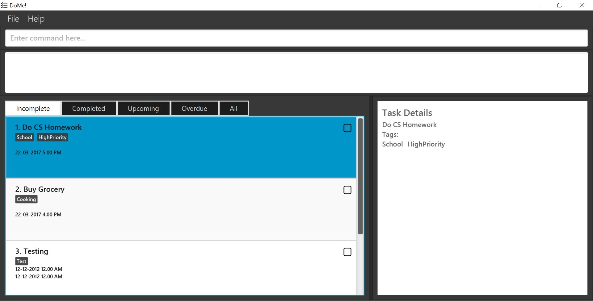

# DoMe! User Guide

By : `Team CS2103-W15-B1`  &nbsp;&nbsp;&nbsp;&nbsp; Since: `Jan 2017`  &nbsp;&nbsp;&nbsp;&nbsp; Licence: `MIT` &nbsp;&nbsp;&nbsp;&nbsp; GithubLink: `https://github.com/CS2103JAN2017-W15-B1/main/blob/master/docs/UserGuide.md`

---

1. [Introduction](#1-introduction)
2. [Quick Start](#2-quick-start)
3. [Features](#3-features)
4. [FAQ](#4-faq)
5. [Command Summary](#5-command-summary)
6. [Appendix](#6-appendix)

## 1. Introduction

Ever felt overwhelmed by the multitude of tasks you have to complete and have no idea where to start? Are you looking for an easy to work with application to help you track all your activities? Well, look no further! Your very own task manager - *DoMe!* is here to assist you!
*DoMe!* is your personal assistant that tracks all your activities and displays them in an easy-to-read display. It saves you the hassle of remembering what needs to be done and helps you prioritise your tasks.
Unlike other software, *DoMe!* is simple and intuitive. All you need is your keyboard to type in a single line of command, removing the inconvenience of clicking and navigating through blundersome menus. Let's get started in being productive and organised with *DoMe!*

## 2. Quick Start

1. Ensure you have Java version `1.8.0_60` or later installed in your Computer. 
> Please note that the app is incompatible with earlier versions of Java 8.
2. Download the latest `taskmanager.jar` from the [releases](../../../releases) tab.
3. Copy the file to the folder you want to use as the home folder for your Address Book.
4. Double-click the file to start the app. The GUI should appear in a few seconds.
> 

## 3. Features

> **Command Format**
> `Square brackets [ ]` denote a required field
> `Curved brackets ( )` denote an optional field'
> `...` denotes that you can have multiple instances

## 3.1 Functional features
This is a list of commands you can give to the application

## 3.1.1 View help: `help`
If you are unsure of the command formats, you can simply type `help` and view all the available commands and how to use them.

_Format:_
`help`

## 3.1.2 Add task: `add`
It's time to start adding tasks to your todo list! You can add events (tasks with start and end date/time), deadlined tasks (tasks with a due date) and also just tasks with names. You can also tag these tasks!

_Format:_
`add [Name-of-Task] (Deadline) (t/Tag-1) (t/Tag-2)`
`add [Name-of-Task] (s/Start-Time) (e/End-Time) (t/Tag-1) (t/Tag-2)`
`add [Name-of-Task]`

_Example:_
`add send TPS report to Bill e/31-02-2017 6PM t/TPS t/report`

## 3.1.3 Edit task: `edit`
You can update the details of your task by editing it, for instance:

_Format:_
`edit [Task-Number] [New-Name-of-Task] (s/New-Start-Time) (e/New-End-Time) (t/New-Tag-1) (t/New-Tag-2)`

_Example:_
`edit 1 buy groceries for Bill s/22-03-2017 e/23-03-2017 t/drinks t/vegetables`

## 3.1.4 Complete task: `complete`
You can mark a task as completed to update its progress

_Format:_
`complete [Task-Number]`

_Example:_
`complete 2`

## 3.1.5 Delete task: `delete`
If you no longer need to do a task, you can simply delete it from your todo list

_Format:_
`delete [Task-Number]`

## 3.1.6 List: `list`
You can view a specific type of the tasks you want to view in your todo list

_Format:_
`list`
> Lists all tasks

`list completed`
> Lists tasks marked as completed

`list incomplete`
> Lists tasks marked as incomplete

`list overdue`
> Lists incomplete tasks with deadlines that have already passed
> 

## 3.1.7 Search: `search`

You can find a task to by simply searching for tasks with matching keywords in their names and/or tags

> The search is case insensitive.

_Format:_
`search (name) (t/tag)`

_Example:_
`search report t/report`
Returns a list of tasks (if any) with the phrase report in its name or tag

## 3.1.8 Undo previous command: `undo`

You can easily undo your last command given

> This will undo the most previous command that mutated the data such as add, edit & delete.

_Format:_
`undo`

_Example:_
`undo`
Returns the undoing of the previous command that mutated the data, e.g. Undone: add send TPS report to Bill by Friday 6pm.

## 3.1.9 Select a task: `select`
You can select a task to view more details about it

_Format:_
`select [Task-Number]`

_Example:_
`select 1`

## 3.1.10 Repeat tasks: `repeat`

You can also put a task on repeat, by setting a task at a fixed periodic time
> Add tags to the task at the specified index. The index refers to the index number shown in the last person listing.
> The periodic time specified must start with the word "every" and must be followed by one of the seven days of the week.

_Format:_
`repeat [Task-Number] [periodic time]`

_Example:_
`repeat 2 every friday`
Returns the task name that was put on repeat

## 3.1.11 Attach links: `addlink`
You can attach relevant link(s) to your task so you can retrieve the link easily and can immediately start on your task!

> The Task-Number refers to the index number shown in the most recent listing of the task.
> This command works for all types of tasks: completed, uncompleted, overdue, etc.

_Format:_
`addlink [Relevant_Link] [Task_Number]`

_Examples:_
`addlink https://www.google.com/drive/presentation-to-boss 5`
Attach the link `https://www.google.com/drive/presentation-to-boss` to task number 5 in the list of task.

`addlink https://mail.google.com/my-mail-box/important-email 10`
Attach the link `https://mail.google.com/my-mail-box/important-email` to task number 10 in the list of tasks.

## 3.1.12 Progress report: `report`
You can see all your completed tasks and overdue tasks in the past week, and incomplete tasks for the coming week

_Format:_
`report`

## 3.1.13 Clear the data : `clear`
You can clear your entire to-do list

_Format:_
`clear`

## 3.1.14 Add tags to task : `tag`
You can organise your tasks by adding tags to your them
> Add tags to the task at the specified index. The index refers to the index number shown in the last person listing.

_Format:_
`tag [Task-Number] [t/Tag-1] (t/Tag-2) ...`

_Example:_
`tag 1 t/urgent t/for mom` 
Returns the task name with the changed tags

## 3.1.15 Customize file storing: `store`
You can change the storage location of the data to transfer your current todo list to your own storage system with ease
> Store all the data of the task manager in the file located at PATH_TO_STORAGE_FILE. It is required that this file be a .txt file located in StorageFile/a folder rooted at StorageFile, and that it is created before the command is called.
#### Saving the data
Data is saved in the hard disk automatically after any command that changes the data.
There is no need to save manually.

_Format:_
`store PATH_TO_STORAGE_FILE`

Examples:
`store StorageFile/StoreHereInstead/MyStorage.txt`
The task manager will store its data in MyStorage.txt located at StorageFile/StoreHereInstead/MyStorage.txt, provided that this file exists before calling the command.

`store StorageFile/AnotherStorage.txt`
The task manager will store its data in AnotherStorage.txt located under StorageFile instead of the default storage location, provided that this file exists before calling the command.

## 4. FAQ

* **Q**: How do I transfer my data to another computer? 
* **A**: Copy the app to the other computer and overwrite the empty data file it creates with the file that contains the data of your previous *DoMe!* folder.

* **Q**: I cannot access the Help document. 
* **A**: Check your internet access. Internet connection is required to access the help document.

## 5. Command Summary

* **Help** : `help` 

* **Add**  `add [Name-of-Task] s/(Start-Time) e/(End-Time) t/[Tag]...` 
  e.g. `add attend seminar s/21-03-2017 9.00 AM e/23-03-2017 9.00 PM t/work`
  
* **Edit** : `edit [Task-Number] [Edited-Details] (t/Edited-Tag)`

* **Delete** : `delete [Task-Number]`
   e.g. `delete 3`
   
* **Undo** : `undo`
   
* **Search** : `search [Keyword] (t/TagKeyword)...`
  e.g. `find email t/urgent`
  
* **List** : `list`,`list incomplete`,`list complete`,`list overdue`

* **Select** : `select [Task-Number]` 
  e.g.`select 2`

* **Tag** : `tag [Task-Number] [t/newTag]`
 e.g. `tag 1 t/urgent`

* **Repeat** : `repeat [Task-Number] [periodic-time]`
 e.g. `repeat 1 every friday`
 
* **Report** : `report`

* **Clear** : `clear`

* **Store** : `store [PATH_TO_STORAGE_FILE]`
 e.g. `store StorageFile/StoreHereInstead/MyStorage.txt`

---
  
## 6. Appendix
  
  | Word | Definition |
|-----|-----|
|[GUI](#GUI)|Graphic User Interface. The interface presented to users to interact with *DoMe!*.|
|[Storage Path](#storage-path)|This is the directory where your data will be saved.|
