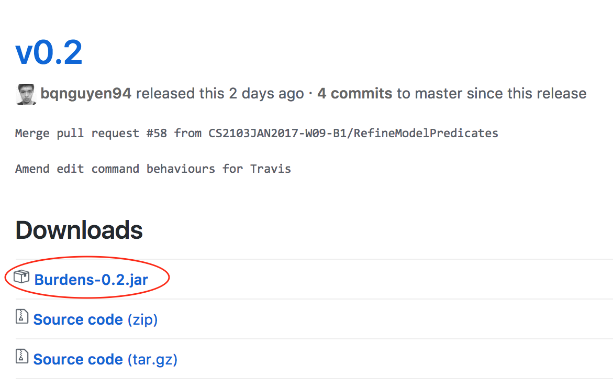

#
# Burdens: User Guide

By : `TEAM W09-B1`  &nbsp;&nbsp;&nbsp;&nbsp; Since: `Mar 2017`  &nbsp;&nbsp;&nbsp;&nbsp;

1. [Introduction](https://github.com/CS2103JAN2017-W09-B1/main/blob/master/docs/UserGuide.md#introduction)
2. [Quick Start](https://github.com/CS2103JAN2017-W09-B1/main/blob/master/docs/UserGuide.md#quick-start)
3. [Features](https://github.com/CS2103JAN2017-W09-B1/main/blob/master/docs/UserGuide.md#features)
   > 3.1. Help 
     3.2. Add tasks 
     3.3. List tasks 
     3.4. Find tasks 
     3.5. Edit tasks 
     3.6. Delete tasks 
     3.7. Mark tasks as complete 
     3.8. Mark tasks as incomplete 
     3.9. Undo 
     3.10. Redo 
     3.11. Select tasks 
     3.12. Reset 
     3.13. Save 
     3.14. Import 
     3.15. Export 
     3.16. Exit 
4. [FAQ](https://github.com/CS2103JAN2017-W09-B1/main/blob/master/docs/UserGuide.md#faq)
5. [Command Summary](https://github.com/CS2103JAN2017-W09-B1/main/blob/master/docs/UserGuide.md#command-summary)

# 1. Introduction

Hello! 
 
Are you overwhelmed by your daily tasks and deadlines in life? 
 
Enter **Burdens**. 
 
A task manager that structures your tasks and deadlines 
using your keyboard commands with a beautiful customisable interface. 
 
Read on and discover how to install and use **Burdens** 
to make sense of your daily life activities. 
 
No more **burdens**.

# 2. Quick Start
**Download**
Ensure you have Java version `1.8.0_60` or later installed.

1. Download the latest Burdens.jar from the [releases](https://github.com/CS2103JAN2017-W09-B1/main/releases) tab.
   > 
2. Copy the jar file to the folder you want to use as the home folder for Burdens.
**Launch**
To start Burdens, double click on **Burdens.jar**. Hello! 
Here is the greeting window at the very first startup.
   > 
As shown, there will be some sample tasks to give you a sense of what your tasks will look like. 

You will see four sections:

- Ongoing: Shows a list of ongoing tasks with deadlines. Recurring tasks will be in red.
- Floating: Shows a list of tasks without deadlines.
- Completed: Shows a list of completed tasks.
- Command: Displays the results of a command and the contains the command box.

Type a command in the command box and press <kbd>Enter</kbd> to execute it.

e.g. typing `help` and pressing <kbd>Enter</kbd> will open the Help window.

Here are some example commands you can try:

  - `list` : lists all tasks.
  - `add Buy groceries d/tomorrow p/5 i/eggs x10, milk x2, bread x2 t/home t/errand` : adds a task titled Buy groceries to the list.
  - `delete 3` : deletes the 3rd task shown in the current list.
  - `exit` : exits the app.

Refer to the [Features](https://github.com/CS2103JAN2017-W09-B1/main/blob/master/docs/UserGuide.md#features) section below for details of each command.

# 3. Features

> **Command Format**
>
> * Words in `UPPER_CASE` are the parameters.
> * Items in `SQUARE_BRACKETS` are optional.
> * Items with `...` after them can have multiple instances.
> * Parameters can be in any order.

**3.1. Viewing help : `help`**

Prompts a help page with all the existing commands.

Format: `help`

> Help is also shown if you enter an incorrect command e.g. abcd

**3.2. Adding a task : `add`**

Adds a task to the list.

Format: `add TITLE [d/DEADLINE] p/PRIORITY i/INSTRUCTION [t/TAG]...`

> The deadline parameter can be entered in natural language, e.g. &quot;today&quot;, &quot;tomorrow at noon&quot;, &quot;this Sunday&quot;, &quot;every Tuesday&quot;. If deadline is not specified, it is assumed that the task is floating, which means the task can be performed earlier or later in the schedule without any form of urgency.  
The priority parameter only accepts levels 1 - 5.  
Tasks can have any number of tags, including 0.

Examples:

- `add Buy groceries p/3 i/eggs x10, milk x2, bread x2 t/home t/errand`
- `add Watch webcast i/CS2103 t/school p/5 d/07032017`

**3.3. Listing all tasks : `list`**

Shows a list of all tasks.

Format: `list`

**3.4. Editing a task : `edit`**

Edits an existing task in the list.

Format: `edit [TASK_LIST] INDEX [TITLE] [d/DATE] [p/PRIORITY] [i/INSTRUCTION] [t/TAG]...`

> Edits the task at the specified TASK\_LIST and INDEX. The task list refers to the name of the task list e.g. &quot;floating&quot;, &quot;ongoing&quot; and &quot;completed&quot;. If no task list name specified, it is assumed to be &quot;ongoing&quot;. The index refers to the index number shown in the last task listing.  
The index must be a positive integer 1, 2, 3, ...  
At least one of the optional fields apart from the task list name must be provided.  
Existing values will be updated to the input values.  
When editing tags, the existing tags of the task will be removed i.e adding of tags is not cumulative.  
You can remove all the task&#39;s tags by typing t/ without specifying any tags after it.

Examples:

- `edit 1 p/1 d/07032017`
   - Edits the priority and date of the 1st task to be 1 and 07032017 respectively.
- `edit floating 2 Drink Coffee t/`
   - Edits the title of the 2nd task in the floating task list to be Drink Coffee and clears all existing tags.

**3.5. Finding all tasks containing any keyword in their title : `find`**

Finds tasks with titles containing any of the given keywords. This command requires at least 3 letters e.g. `find Han` will be accepted, but `find Ha` is an invalid command format.

Format: `find KEYWORD [MORE_KEYWORDS]`

> The search is simultaneously applied to all task lists.  
The search is case sensitive. e.g hans will not match  
The order of the keywords does not matter. e.g. Hans Bo will match Bo Hans  
Only the title is searched.  
Tasks matching at least one keyword will be returned (i.e. OR search). e.g. Hans will match Hans Bo.  
Fuzzy Find is implemented such that e.g. Hns will match Hans.
> - Fuzzy Find works by returning a list of results based on likely relevance even though search argument words and spellings may not exactly match

Examples:

- `find groceries Buy`
   - Returns Buy groceries but not Groceries
- `find buy webcast`
   - Returns any tasks having titles buy or webcast

**3.6. Deleting a task : `delete`**

Deletes the task identified by the index number used in the last task listing.

Format: `delete [TASK_LIST] INDEX`

> Deletes the task at the specified TASK\_LIST and INDEX. The task list refers to the name of the task list e.g. &quot;floating&quot;, &quot;ongoing&quot; and &quot;completed&quot;. If no task list name specified, it is assumed to be &quot;ongoing&quot;.
The index refers to the index number shown in the most recent listing.  
The index must be a positive integer 1, 2, 3, ...

Examples:

- `list`
- `delete 2`
   - Deletes the 2nd task in the list.
- `find 2103T`
- `delete 1`
   - Deletes the 1st task in the results of the `find` command.

**3.7. Marking a task as complete : `complete`**

Marks a task as completed and moves it to the list of completed tasks.

Format: `complete [TASK_LIST] INDEX`

> Marks the task at the specified TASK\_LIST and INDEX as completed. The task list refers to the name of the task list e.g. &quot;floating&quot;, &quot;ongoing&quot;; &quot;completed&quot; is invalid as task list name. If no task list name specified, it is assumed to be &quot;ongoing&quot;.  
The index refers to the index number shown in the most recent listing.  
The index must be a positive integer 1, 2, 3, …

**3.8. Marking a task as incomplete : `incomplete`**

Marks a task as incomplete and moves it back to the list of either floating or ongoing tasks.

Format: `incomplete INDEX`

> Resets the task priority from complete to its old priority level at the specified INDEX, and places the task at its original column.  
The index refers to the index number shown in the most recent listing of the completed tasks.  
The index must be a positive integer 1, 2, 3, ...

**3.9. Undo the previous command : `undo`**

Undo the command previously entered.

Format: `undo`

> If there&#39;s a previous command that changed the state of any of the task lists e.g. add, edit or delete, it is undone and the respective task list is reverted to its prior state before the add, edit or delete command was entered.

**3.10. Redo a command : `redo`**

Redo the command previously undone.

Format: `redo`

> If there&#39;s a previous command that changed the state of any of the task lists e.g. add, edit or delete, and was undone by the undo command afterwards, it is redone and the respective task list is reverted to its prior state after the add, edit or delete command was entered.  
If the undo command was followed by another state-changing command, the command that was previously undone would not be redone.

**3.11. Selecting a task : `select`**

Selects the task identified by the index number used in the last task listing.

Format: `select [TASK_LIST] INDEX`

> Selects the task and loads the Google search page the title at the specified INDEX.  
The index refers to the index number shown in the most recent listing.  
The index must be a positive integer 1, 2, 3, ...

Examples:

- `list`
- `select 2`
   - Selects the 2nd task in the list.
- `find Eat Chips and Pizza`
- `select 1`
   - Selects the 1st task in the results of the find command.

**3.12. Clearing all tasks : `clear`**

Clears all tasks from the list.

Format: `clear`

**3.13. Exiting the program : `exit`**

Exits the program.

Format: `exit`

**3.14. Importing files into the program : `exit`**

Exits the program.

Format: `exit`

**3.15. Saving the data**

All data are saved in the hard disk automatically after any command that changes the data.

There is no need to save manually.

**3.16. Exiting the program : `exit`**

Exits the program.

Format: `exit`
# 4. FAQ

Q: How do I transfer my data to another Computer?

A: Install the app in the other computer and overwrite the empty data file it creates with the file that contains the data of your previous To Do Manager folder.

Q: Do I require knowledge of command line to use this program?

A: No prior command line knowledge is required to use **Burdens**. Instead, just follow the instructions under [Features](https://github.com/CS2103JAN2017-W09-B1/main/blob/master/docs/UserGuide.md#features).

# 5. Command Summary

- Help : `help`
- Add : `add TITLE d/DATE p/PRIORITY i/INSTRUCTION [t/TAG]...`
  - e.g. add Buy groceries d/the first Thursday of May p/5 i/eggs x10, milk x2, bread x2 t/home t/errand
- List : `list`
- Edit : `edit INDEX [TITLE] [d/DATE] [p/PRIORITY] [i/INSTRUCTION] [t/TAG]…`
- Find : `find KEYWORD [MORE_KEYWORDS]`
  - e.g. find Play basketball
- Delete : `delete INDEX`
  - e.g. delete 3
- Complete : `complete [TASK_LIST] INDEX`
  - e.g complete 1 2
- Incomplete : `incomplete INDEX`
  - e.g incomplete 3
- Undo : `undo`
- Redo : `redo`
- Select : `select INDEX`
  - e.g select 2
- Clear : `clear`
- Exit : `exit`
- List : `list`
