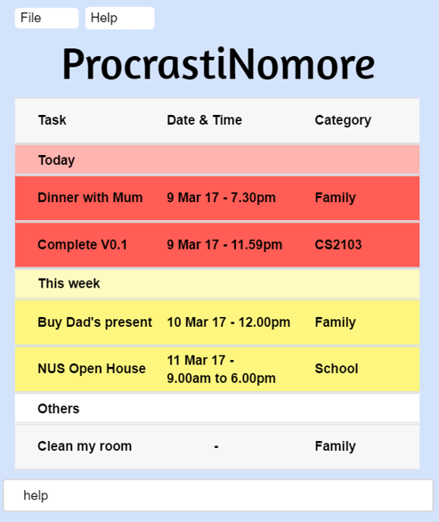

# ProcrastiNomore (Task Manager Application) - User Guide

By : `Team ProcrastiNomore`  &nbsp;&nbsp;&nbsp;&nbsp; Since: `Feb 2017`  &nbsp;&nbsp;&nbsp;&nbsp; Licence: `MIT`

---

1. [Introduction](#1-introduction)
2. [Quick Start](#2-quick-start)
3. [Features](#3-features)
4. [FAQ](#4-faq)
5. [Command Summary](#5-command-summary)

## 1. Introduction

This User Guide will aid you in understanding how ProcrastiNomore operates and what are
the functionalities this application has.

ProcrastinNomore is a single command line task-management application that is able to
store new tasks and edit existing tasks. It is able to store the tasks in Google calendar
and will aid you in organizing all your corresponding tasks and events.

## 2. Quick Start

1. Please ensure that you have Java version 1.8.0_60 or later install in your Computer. 

   > Having any Java 8 version is not enough. 
   > This app will not work with earlier versions of Java 8.

2. Download the latest `ProcrastiNomore.jar` from the [releases](../../../releases) tab.
3. Copy the file to the folder you want to use as the home folder for your Task Manager.
4. Double-click the file to start the app. The GUI should appear in a few seconds.
   > 

5. Using the application

   >a. This application works by entering commands via the keyboard. 
   >b. Type the command in the command box and press <kbd>Enter</kbd> to execute it.  
   >c. There are also several keyboard shortcuts found at the bottom of the User Guide for
   quick access of several functions. 
   >d. typing **`help`** and pressing <kbd>Enter</kbd> in the command box and it will
   open the help window.
   > 

6. Refer to the [Features](#features) section below for more details on the various
commands you can use. 

## 3. Features

> **Command Format**
>
> * Words in `UPPER_CASE` are the parameters.
> * Items in `SQUARE_BRACKETS` are optional.
> * Items with `...` after them can have multiple instances.
> * Parameters can be in any order.

### 3.1. Viewing help : `HELP`

Format: `HELP`

> Help is also shown if you enter an incorrect command e.g. `abcd`

### 3.2. Adding a new Task: `ADD`

There are 4 forms of task that ProcrastiNomore supports:

#### 3.2.1. Events

Format: `ADD TASK ON DATE/DAY`  
&nbsp;&nbsp;&nbsp;&nbsp;&nbsp;&nbsp;&nbsp;&nbsp;&nbsp;&nbsp;&nbsp;&nbsp;`ADD TASK FROM STARTDATE STARTTIME TO ENDDATE ENDTIME`  
&nbsp;&nbsp;&nbsp;&nbsp;&nbsp;&nbsp;&nbsp;&nbsp;&nbsp;&nbsp;&nbsp;&nbsp;`ADD TASK ON DATE/DAY STARTTIME TO ENDTIME`  

#### 3.2.2. Deadlines

Format: `ADD TASK BY DATE/TIME/DATE+TIME`

#### 3.2.3. Untimed

Format:	`ADD TASK`

Examples:

* `ADD eat breakfast ON 03/03/17`
* `ADD eat lunch ON thursday`
* `ADD eat dinner FROM today 1730 TO today 1930`
* `ADD eat breakfast FROM tomorrow 0800 TO tomorrow 0830`
* `ADD eat lunch ON 03/03/17 1400 TO 1500`
* `ADD eat dinner BY 03/03/17`
* `ADD eat breakfast BY 0730`
* `ADD eat lunch BY 03/03/17 330pm`
* `ADD eat breakfast`

> TIME input can be in 24hrs format or 12hrs format with am/pm
> If the function "ADD ... BY .." is used without stating the end time, the default end time will be 2359.

### 3.3. Update an existing task : `UPDATE`

There are 2 types of updates that ProcrastiNomore supports:

#### 3.3.1. Update task name

Format: `UPDATE TASKINDEX TASKNAME`

#### 3.3.2. Update task time/date

Format: `UPDATE TASKINDEX TO STARTTIME ENDTIME`  
&nbsp;&nbsp;&nbsp;&nbsp;&nbsp;&nbsp;&nbsp;&nbsp;&nbsp;&nbsp;&nbsp;&nbsp;`UPDATE TASKINDEX TO TIME`

Examples:
* `LIST`
  `UPDATE 1 eat dinner`
* `LIST`
  `UPDATE 1 FROM thursday TO friday`

### 3.4. Delete an existing task: `DELETE`

Format: `DELETE TASKNAME`  
&nbsp;&nbsp;&nbsp;&nbsp;&nbsp;&nbsp;&nbsp;&nbsp;&nbsp;&nbsp;&nbsp;&nbsp;&nbsp;`DELETE TASKINDEX`  
&nbsp;&nbsp;&nbsp;&nbsp;&nbsp;&nbsp;&nbsp;&nbsp;&nbsp;&nbsp;&nbsp;&nbsp;&nbsp;`DELETE DATE`

> In the event of DELETE TASKNAME, ProcrastiNomore will show a list of tasks
> with the same TASKNAME and user will be required to input the TASKINDEX of
> the TASK user wants to delete

Examples:
* `DELETE breakfast`  
  `1`
* `list`  
  `DELETE 1`
* `DELETE 15/06/17`  

### 3.5. Wipe out history of all or specified tasks: `CLEAR`

There are 2 types of clear commands.

#### 3.5.1. Delete all tasks

Format: `CLEAR all`

#### 3.5.2. Delete all previously marked uncomplete/complete tasks

Format: `CLEAR completed`  
&nbsp;&nbsp;&nbsp;&nbsp;&nbsp;&nbsp;&nbsp;&nbsp;&nbsp;&nbsp;&nbsp;&nbsp;`CLEAR uncompleted`

### 3.6. Search through all existing task by entering keywords/dates: `SEARCH`

Format: `SEARCH KEYWORD`  
&nbsp;&nbsp;&nbsp;&nbsp;&nbsp;&nbsp;&nbsp;&nbsp;&nbsp;&nbsp;&nbsp;&nbsp;`SEARCH DATE`

> In the event of non-unique KEYWORD, ProcrastiNomore will show a list of tasks
> with the same KEYWORD

Examples:
* `SEARCH breakfast`  
  Returns any tasks with containing breakfast
* `SEARCH 05/12/17`  
  Returns any tasks with dates containing 05/12/17

### 3.7. To mark tasks as completed: `MARK`

You can use this command to identify tasks that you have accomplised and completed.

Format: `MARK`  
&nbsp;&nbsp;&nbsp;&nbsp;&nbsp;&nbsp;&nbsp;&nbsp;&nbsp;&nbsp;&nbsp;&nbsp;`UNMARK TASKINDEX`  

Examples:
* `MARK 1`  
  Task number `1` in your to do list will be marked as completed.
* `MARK 5`  
  Task number `5` in your to do list will be marked as completed.

Tasks identified as completed will no longer be displayed in the uncompleted list of tasks.

### 3.8. To mark tasks as uncompleted: `UNMARK`

You can use this command to identify tasks that you have already previously identified that you have
 accomplished as uncompleted.

Format: `UNMARK`  
&nbsp;&nbsp;&nbsp;&nbsp;&nbsp;&nbsp;&nbsp;&nbsp;&nbsp;&nbsp;&nbsp;&nbsp;`UNMARK TASKINDEX`  

Examples:
* `UNMARK 1`  
  Task number `1` in your completed list will be marked as uncompleted and to be done.
* `UNMARK 5`  
  Task number `5` in your completed list will be marked as uncompleted and to be done.

### 3.9. To sort through the list of task displayed: `LIST`

You can use this command to view all the tasks that you have yet to finish doing.

Format: `LIST`

### 3.10. To sort through the list of task displayed: `COMPLETED`

You can use this command to view all the tasks that you have completed.

Format: `COMPLETED`

### 3.11. To sort through the list of task displayed: `SORT`

Format: `SORT`  
&nbsp;&nbsp;&nbsp;&nbsp;&nbsp;&nbsp;&nbsp;&nbsp;&nbsp;&nbsp;&nbsp;&nbsp;`SORT DATE`  
&nbsp;&nbsp;&nbsp;&nbsp;&nbsp;&nbsp;&nbsp;&nbsp;&nbsp;&nbsp;&nbsp;&nbsp;`SORT TASKNAME`

Using the sort command on its own will sort the task in ascending TASKINDEX order

### 3.12. To mark a task with higher importance: `PRIOR`

Format: `PRIOR TASKNAME`  
&nbsp;&nbsp;&nbsp;&nbsp;&nbsp;&nbsp;&nbsp;&nbsp;`PRIOR TASKINDEX`  
&nbsp;&nbsp;&nbsp;&nbsp;&nbsp;&nbsp;&nbsp;&nbsp;`PRIOR DATE`

### 3.13. To Undo your previous commands: `UNDO`

Shortcut: `Ctrl+Z` 

1 command will be undone every time this command is called.

### 3.14. To Redo your previous commands: `REDO`

Shortcut: `Ctrl+Y` 

1 command will be redone every time this command is called.

### 3.15. Saving the data: `SAVE`

Task Manager data are saved in the hard disk automatically after any command that changes the data. 
There is no need to save manually.

In the event that you with to change the save location of the task manager, you may use the following command: `SAVE`  

Format: `SAVE [File Location]`

Examples: 
* `SAVE C:\Users\<ACCOUNT NAME>\Desktop\`  
  Changes the save location of the task manager to your desktop.
* `SAVE data\`  
  Changes the save location of the task manager back to the default save location.

### 3.16. Exiting the program : `EXIT`

Exits the program. 

Format: `EXIT`
  
## 4. FAQ

**Q**: How do I transfer my data to another Computer? 
**A**: Install the app in the other computer and overwrite the empty data file it creates with
       the file that contains the data of your previous Task Manager folder.

## 5. Command Summary

* **Help** : `HELP`  

* **Add**  `ADD TASK ON DATE/DAY FROM STARTTIME TO ENDTIME`  
  &nbsp;e.g. `ADD eat food ON 03/03/17 FROM 0830 TO 1030`

* **Update**  `UPDATE TASKINDEX TASKNAME`  
  &nbsp;e.g. `UPDATE 1 Email boss`

* **Delete** : `DELETE INDEX`  
   e.g. `DELETE 3`

* **Clear** : `CLEAR`

* **Search** : `SEARCH KEYWORD [MORE_KEYWORDS]`  
  e.g. `SEARCH find more food`

* **Mark** : `MARK INDEX`  
   e.g. `MARK 3`

* **Unmark** : `UNMARK INDEX`  
   e.g. `UNMARK 3`

* **List** : `LIST`  

* **Completed** : `COMPLETED`  

* **Sort** : `Sort [Sort Criteria]`  
   e.g. `SORT date`
   e.g. `SORT taskname`

* **Prior** : `PRIOR TASKNAME`  
   e.g. `PRIOR Email boss`

* **Undo** : `Ctrl+Z`  

* **Redo** : `Ctrl+Y`  

* **Save** : `SAVE [File Location]`  
  e.g.`SAVE C:\Users\<ACCOUNT NAME>\Desktop\`
