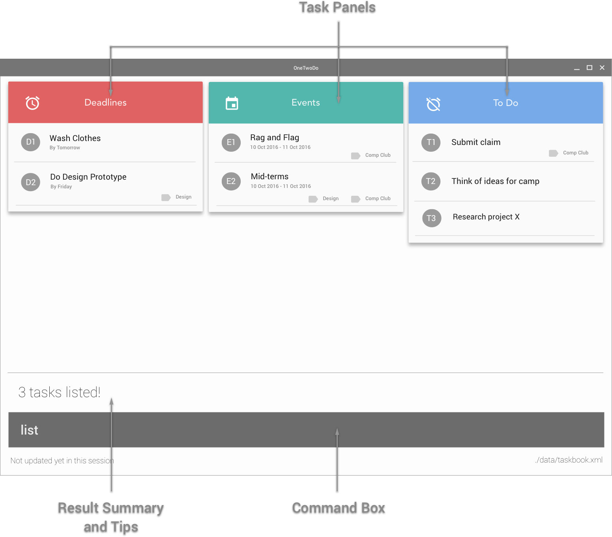

# User Guide

- [About](#about)
- [Getting Started](#getting-started)
- [Features](#features)
- [Format](#format)
- [Commands](#commands)
- [Cheat Sheet](#cheat-sheet)
- [FAQ](#faq)

## About

Having trouble keeping track of the tasks you need to do? Looking for a simple yet effective task manager to help you organise your day? OneTwoDo is what you need!

OneTwoDo helps you to manage your events, deadlines, and other to-do's so that you will not forget about your important tasks.

OneTwoDo has a simple and clean interface, so that with one glance you can have a clear idea of your tasks ahead.

OneTwoDo is specially designed to be keyboard-friendly. By simply typing commands in one line of text, OneTwoDo will faithfully execute your wish. You do not need to worry about clicking multiple buttons or links.

OneTwoDo is also extremely flexible. It is smart enough to understand various command formats and shortcuts.

Get started with OneTwoDo today!

## Getting Started

Before using OneTwoDo, please ensure that you have installed Java version 1.8.0_60 or later as the application does not work with earlier Java 8 versions.

Start your OneTwoDo journey by downloading the latest OneTwoDo.jar from the releases tab. Download OneTwoDo directly into the home folder you want to use for the app.

You can start OneTwoDo by simply double-clicking the icon!
   > 

Figure 1: OneTwoDo User Interface

Congratulations, you are all set up! 

Try some of these commands to get started!

   * **`help`**
   		- Shows the help window.

Figure 2: Help Window

add Scuba Diving session s/tomorrow 1pm e/tomorrow 3pm 

    
You may refer to the [Features](#features) section for more details on all the possible commands.

## Features

After you have started OneTwoDo, you will see the following:

1. **Command box**
    - Enter a command into this box and press enter to execute the command.
2. **Result summary and tips**
    - A summary of the results of the executed command is shown to the user to give feedback about the effects of the command.
3. **Task panels**
    - Each panel displays your tasks depending on the category they belong to. 
    - Other commands also allow you to retreive the tasks to be shown here (e.g. `list` or `find` command. Please refer to the command format below).

Your tasks are separated into 3 categories, where each category is displayed in a task panel:

1. `Deadline` - This panel displays tasks with have an end date but no start date.
2. `Event` - This panel displays tasks with a start and end date.
3. `To-do` - This panel displays tasks without a start or end date.

### Command Format
    
- Command words are the first word of the command. (e.g. `find`, or `help`).
- Command options specifies additional information needed by the command.
    - It consists of a character followed by a forward slash (e.g. `s/`, `t/`, etc), followed by data to be specified after the forward slash if there are any. (e.g. `s/tomorrow 0900`). 
    - The order of options is not fixed after the task name. (e.g. executing `add Go home p/high i/after class` is the same as executing `add Go home i/after class p/high`).
    - Options surrounded by square brackets `[ ]` are optional.
    - Options with ellipses `...` after them can be specified multiple times (e.g. `t/Schoolwork t/CS2103`).
    - Options with `|` the pipe symbol means that either option on the left or right should be used.

- Command parameters are `UPPER_CASE` words representing required data for a command word or its options. Some common examples include:
    - `NAME`
        * The name of the task.
    - `PREFIX_INDEX`
        * The index number shown in the most recent listing.
        * Comprises of a category prefix (`e`, `d`, or `t`, represents `Event`, `Deadline` and `To-Do` categories respectively) and category index (a positive integer, e.g. `1`, `2`, `3`..).
    - `START_DATE`
        * Date and time when the task starts is entered
        * If no time is indicated, the default time is taken as 0000 hrs.
        * Must be before `END_DATE`.
        * Please refer to the Date and Time Format Specification for the list of accepted formats.
    - `END_DATE`
        * Date and time when the task ends is entered
        * If no time is indicated, the default time is taken as 2359 hrs.
        * Must be after `START_DATE`.
        * Please refer to the Date and Time Format Specification for the list of accepted formats.

### Date and Time Format Specification

OneTwoDo accepts most date and time formats, including:
* 2016/12/31
* 12/31/2016
* 2016-12-31
* Dec 31st
* 31st Dec 2016
* 31st of December
* Next Tue 3pm
* Tomorrow 5:30am
* Last Wednesday 0600h
* 3 days from now

Refer to [http://natty.joestelmach.com/doc.jsp](http://natty.joestelmach.com/doc.jsp) for a full list of supported formats.

---
### Viewing command summary : `help`

Let's use OneTwoDo as Jim, a busy professional. He wants to start using OneTwoDo to organize all his meetings and projects more efficiently. However, he is confused on how to navigate through OneTwoDo and which command to type. So he simply type `help` and our concised command summary window pops up to clear his confusion.

    >>  help

Figure 7: Command Summary Window

---
### Viewing userguide : `helpug`

After viewing the command summary, Jim wants to explore more special features offered by OneTwoDo. So he simply types `helpug` and our informative User Guide opens up for Jim's exploration. 

    >>  helpug

Figure 8: User Guide Window

---
### Adding a task: `add`

Now, Jim is ready to add his tasks to OneTwoDo. Jim's boss has emailed him that there will be an important lunch meeting from 1-3pm today.

Format: `add NAME [s/START_DATE] [e/END_DATE] [r/RECUR] [d/DESCRIPTION] [p/PRIORITY] [t/TAG]...`

    >>  add Meeting s/1pm e/12pm p/h d/lunch meeting with boss t/work

Figure 9: Add incorrect task

Jim realizes his mistake after seeing the error message and corrects it.

    >>  add Meeting s/1pm e/3pm p/h d/lunch meeting with boss t/work

Figure 10: Add Meeting task

It is highlighted in grey to bring Jim's attention to it. 

> A task with a start date and end date is an **Event**_.
> **Priority** of a task can be high (h), medium (m) or low (l)_.

Jim also remembers that he has to prepare a weekly review report for a new project he is working on.

    >> add InfoSyc Project Review e/Friday r/weekly t/InfoSyc t/work

Figure 11: Add Review task

> A task with only an end date is a **Deadline**_.
> A task can **recur** daily, weekly, monthly or yearly_
> A task can have multiple **tags** 

After adding all his work-related tasks, he receives a text confirming his travel booking for Hawaii next week! 

    >>  add shopping d/suglasses sunscreen t/hawaii

Figure 12: Add Shopping task

> A task with no date is a **ToDo**.

---
### Finding all tasks containing a keyword in their name or tag: `find`

Can’t remember if you added that task as “Homework” or “Assignment” or “hmwrk”? Simply use the find command and any tasks with matching keywords will be listed out for you.

Format: `find KEYWORD [MORE_KEYWORDS]...`

     >>  find Project Tutorial Assignment

>   Shows any task having names, tags, or description which contain any of the keywords: **Project**, **Tutorial** and **Assignment**.

Figure 11: find task

---
### Listing tasks : `list`

Want to view all the tasks which are due today? Simply use the list command and only the tasks satisfying your criteria will be listed.

Format: `list [DONE_STATUS] [s/START_DATE] [e/END_DATE] [o/ORDER] [p/PRIORITY] [t/TAG]...`

    >>  list done

>   All your completed tasks are listed. The feeling of satisfaction after seeing all the tasks you have successfully accomplished is indescribable. 
  
    >>  list s/today e/next week
> 
>   Tasks which occur before tomorrow are sorted by their priority (from highest to lowest) and listed. This way, you can do the most urgent task for tomorrow first, followed by the rest.
   

Figure 13: Sort tasks by priorty

---
### Editing a task : `edit`

Oops, did you add “Buy Christmas Gifts!” for “26th Dec” instead of “24th Dec”? Don’t worry! It’s natural for us to make mistakes while adding our tasks. Simply type edit and update your task anytime, anywhere.

The command above will edit your task at the specified PREFIX_INDEX, which is the number in the bubble beside the task in the list. However, for the magic of edit to work, be sure to provide at least 1 of the optional fields.

When editing tags, all existing tags of the task will be replaced. (i.e adding of tags is not cumulative).

You can remove all the task’s tags by typing t/ without specifying any tags after it.

Format: `edit PREFIX_INDEX [NAME] [s/START_DATE] [e/END_DATE] [r/RECUR] [d/DESCRIPTION] [p/PRIORITY] [t/TAG]...`

    >>  edit d1 t/

Figure 14: Before - With tags

Figure 15: After – Without any tags

    >>  edit t2 e/16 Dec 2017 t/project t/2103
> 
>    Edits the 2nd task in To-Do category to update the end date of task to 24 Dec 2017. The description is updated to “Buy Santa Claus hat for Minnie” and tag is updated to “xmas”. 

Figure 16: Before – Christmas task

Figure 17: After – Christmas task

---
### Finding a task : `find`

Looking for a particular task? Be it the task name, task description or task tag, this command works like the google search engine.

The `delete` command removes the task at PREFIX_INDEX. 

    >>  delete e2

---
### Selecting a task : `select`

Want to view a task in detailed? Use me!

The `select` command will popup a window for a task at PREFIX_INDEX.

    >>  select e2

---
### Deleting a task : `delete`

Don’t need to do a task anymore? Just type delete and the task will be removed from OneTwoDo.

The `delete` command removes the task at PREFIX_INDEX. 

    >>  delete e2

---
### Deleting all tasks: `clear`
Want to start afresh? No problem! Simply type clear and start your OneTwoDo journey again on a new note!

    >>  clear

---
### Marking a task as completed: `done`
Completed next week’s assignment today? Give yourself a pat on the back and type done to mark the task as completed.

The `done` command archive the task at PREFIX_INDEX.

    >>  done t1

---
### Marking a task as uncompleted: `undone`
Realised that a completed assignment still has some more work to do? Unmark that task as uncompleted.

    >>  undone t1

---
### Undoing actions: `undo`
Panicking because you accidently deleted that high priority task? Keep calm and type undo, and that extremely important task will magically reappear on your OneTwoDo! 

    >>  undo

---
### Redoing actions: `redo`
After heaving a sigh of relief and reversing your actions using undo, you realize that extremely important task is not that important after all. Continue to keep calm and type redo, and that not-so-important task will disappear again from your OneTwoDo!

    >>  redo

---
### Saving the data: `save`

By default, OneTwoDo data is saved in a file called todolist.xml in the data folder. However, you can always change the file location by providing a new file name as the parameter for easier access.

Changes made to OneTwoDo are automatically saved. You do not need to manually save them each time using the save command.

    >>  save myStorage.txt

---
### Exporting the data: `export`

Some export description here..........

    >>  save myStorage.txt

---
### Importing the data: `import`

Some import description here..........

    >>  import otherStorage.xml

### Exiting the program : `exit`

Are you sure you have added all your tasks to OneTwoDo already? If you are, simply type exit and the OneTwoDo window will disappear from your screen!

    >>  exit

---
## Command Summary

| Command       | Format       | Description | Alternatives |
| :-------------|:-------------|:-----------|:-------------|
|  Help         |  `help` | Open help window |
|  Helpug         |  `helpug` | Open this userguide | helpug, helpuserguide, ug
|  Add          |  `add NAME [s/START_DATE] [e/END_DATE] [r/RECUR] [d/DESCRIPTION] [p/PRIORITY] [t/TAG]...` | Add a task| 
|  Edit         |  `edit PREFIX_INDEX [NAME] [s/START_DATE] [e/END_DATE] [r/RECUR] [d/DESCRIPTION] [p/PRIORITY] [t/TAG]...` | Edit any specified task's information|
|  List         |  `list [DONE_STATUS] [s/START_DATE] [e/END_DATE] [o/ORDER] [p/PRIORITY] [t/TAG]...` | List specified tasks in specified order|
|  Find         |  `find KEYWORD [MORE_KEYWORDS]...` | Find tasks with keywords|
|  Select         |  `select PREFIX_INDEX` | Select a task to view|
|  Delete       |  `delete PREFIX_INDEX` | Delete specified task |
|  Clear        |  `clear` | Clear all data in OneTwoDo|
|  Done         |  `done PREFIX_INDEX` | Archive the specified task|
|  Undone       |  `undone PREFIX_INDEX` | Unarchive the specified task|
|  Undo         |  `undo`  | Undo previous action|
|  Redo         |  `redo` | Redo previous action|
|  Save         |  `save [overwrite] FILE_PATH` | Save file to specified location|
|  Export         |  `export [overwrite] FILE_PATH` | Export file to specified location|
|  Import         |  `import FILE_PATH` | Import file to be used|
|  Exit         |  `exit`  | Quit the program|

---
## FAQ

**Q**: How do I transfer my data to another computer?
**A**: Use the `export` command to export out the storage. Transfer the storage file via any means (thumb drive, email, etc) and use the `import` command on another computer to import the storage.

**Q**: What type of date and time format can I use?
**A**: OneTowDo support a variety of formats. You can checkout some of the more common formats above. For complete list of format, checkout the Natty website: http://natty.joestelmach.com/doc.jsp.

**Q**: How do save my OneTwoDo data?
**A**: We will save your data automatically every time you input.

**Q**: What is the different between `find` and `list` command?
**A**: The `find` command helps you to look for a particular task. The `list` command helps you to view the task manager in a particular way.

**Q**: Which commands can be undo?
**A**: You can only undo the commands that will modify the contents of your to do list. The 6 commands that you can undo are: `add`, `delete`, `edit`, `clear`, `done`, and `undone`.

**Q**: What is the different between `done` and `delete` command?
**A**: The command `delete` will remove the selected task from the storage. The command `done` will archive the selected task into the done section. In this way, you can still keep track of the task that has been done.