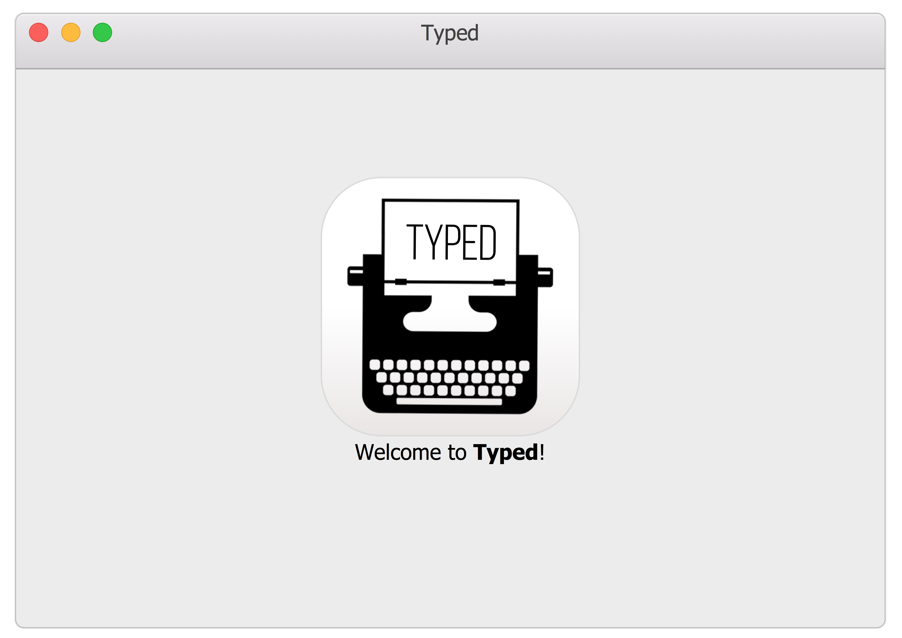
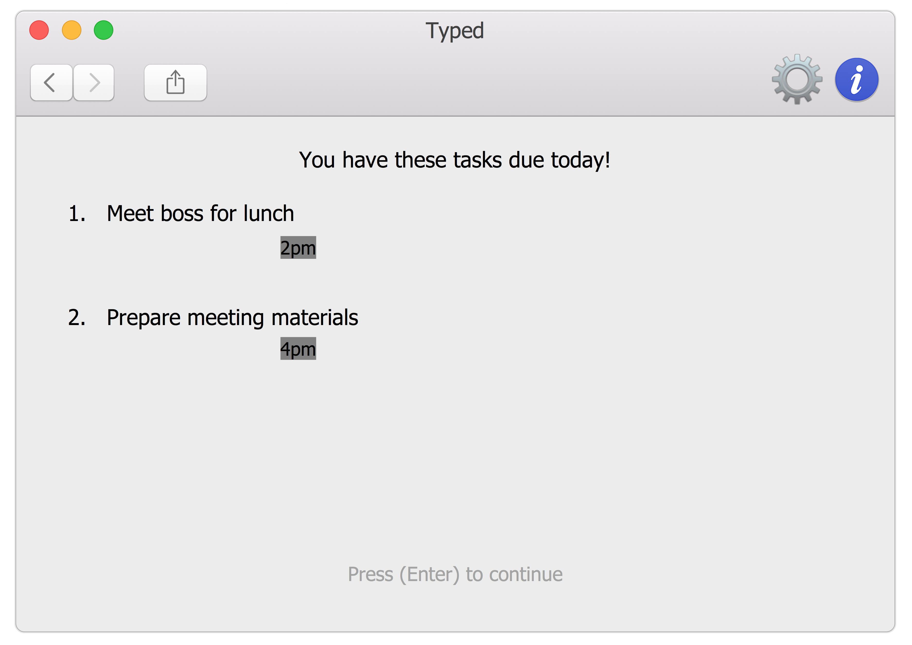

# Typed - User Guide

By : `Typedwriters`  &nbsp;&nbsp;&nbsp;&nbsp; Since: `March 2017`  &nbsp;&nbsp;&nbsp;&nbsp; Licence: `MIT`

---

1. [Getting Started](#getting-started)
2. [Returning to *Typed*](#returning-to-typed)
3. [Features](#features)
4. [Command Summary](#command-summary)
5. [FAQ](#faq)

## 1. Getting Started

Before you setup *Typed*, you should have Java version `1.8.0_60` or later installed.  

1. Download the latest `typed.jar` from the [releases](../../../releases) tab. 
2. Copy the file to the folder you want to use as *Typed*'s new home.
3. Press the Ctrl+Shift+T key to launch the app. *Typed* will welcome you in a few seconds.
      
4. Walk through the tutorial to try out basic features, or experiment with **[Features](#features)** below. 

## 2. Returning to *Typed*

*Typed* is always happy to see you again.  

1. Forget the tutorial, *Typed* is ready for a productive day! You will be greeted with a view of today's focus. This view includes events happening today, overdue tasks and tasks due today. 
2. Let *Typed* know when you are ready to start work by pressing <kbd>Enter</kbd>. 
      
3. This will bring you to the default view. 
      
      

## 2. Features 

> **Command Format**
>
> * Words in `UPPER_CASE` are the parameters.
> * Words in `lower_case` are the exact strings.
> * Items in `SQUARE_BRACKETS` are optional.
> * Items with `|` indicates either or field.
> * Items with `...` after them can have multiple instances.

### 2.1. Viewing help : `help`

Format: `help [COMMAND]`

> `help COMMAND` shows a more detailed explanation of the command e.g. `help add`  
> Help is also shown if you enter an incorrect command e.g. `abcd` 

### 2.2. Adding a task or event: `add`

Adds a task or event to *Typed*. This action can be undone.  
Format: `add TASK [ on DATE | by DATE | every RECURRENT | from DATE to DATE] [#TAG]...`

> * Adds the task with specified deadline. 
> * `RECURRENT` accepts 'daily', 'weekly', 'monthly', and 'yearly'. 
    The day of entry will be taken as the recurring day. 

Examples:

* `add read the little prince`
* `add training camp from 2 May to 5 May`

### 2.3. Listing all tasks and events : `list`

Shows a list of the tasks and events in *Typed*. 
Format: `list [TYPE]`

> * Valid formats for `TYPE` include events, done, undone and all.

Examples:

* `list` 
  List the tasks and events, in a similar way as the default screen. 
* `list undone` 
  List all the undone tasks.  

### 2.4. Editing a task or event : `edit`

Edits an task or event in *Typed*. 
Format: `edit INDEX [DESCRIPTION] [by DATE | TIME] [ #TAG | -#TAG ]`

> * Edits the task or event at the specified `INDEX`.
    The index refers to the index number shown on the screen. 
    The index **must be a positive integer** 1, 2, 3, ...
> * At least one of the optional fields must be provided.
> * Existing values will be updated to the input values except tags.
> * When editing tags, the user can only remove or add tags.
> * You can remove all tags by typing `#` without specifying any tags after it.

Examples:

* `edit 1 by following Sunday` 
  Edits the deadline of the task to the following Sunday. 
* `edit 5 #work` 
  Adds a tag #work to index 5 of the shown list on the screen. 

### 2.5. Finding all tasks and events containing any keyword in their name : `find`

Finds tasks and events whose names contain any or close to the given keywords. 
Format: `find KEYWORD|#TAGS [MORE_KEYWORDS | #MORE_TAGS]`

> * The search is not case sensitive. e.g `boss` will match `Boss`
> * The order of the keywords does not matter. e.g. `Hans Bo` will match `Bo Hans`
> * Only the name of the tasks and events is searched.
> * Fuzzy find is used e.g. `bss` will match `boss`
> * Tasks or events matching at least one keyword will be returned (i.e. `OR` search).
    e.g. `Expo` will match `IT Expo`

Examples:

* `find johnny depp` 
  Returns any tasks and events that names have close to the keywords, johnny and depp
* `find boss #work` 
  Returns any tasks or events with similar words to boss or contains similar tagging to work.

### 2.6. Deleting a task or event : `delete`

Deletes the specified task or event from *Typed*. This action can be undone.  
Format: `delete [all]|INDEX [ to | ,] [INDEX] ...`

> Deletes the task at the specified `INDEX` or range of `INDEX`.  
> The index refers to the index number shown in the most recent listing. 
> The index **must be a positive integer** 1, 2, 3, ...

Examples:

* `list` 
  `delete 2` 
  Deletes the task or event labelled as index 2 on the screen on *Typed*.
* `find boss` 
  `delete 1` 
  Deletes the 1st task or event in the results of the `find` command.

### 2.7. Showing history : `history`

Shows a list of the past commands used in that session. 
Format: `history`

Examples:

* `history` 

### 2.8. Undo : `undo`

Undo the last mutable command e.g. `add`, `delete`, `edit`. 
Format: `undo [INDEX | all]`

> There must be commands that mutate the data before `undo` is called.  
> Undo only works for if mutable commands are used in the **same** session.  

Examples:

* `add read the little prince` 
  `undo` 
  Undo the previous add command. 
* `add read the little prince` 
  `add push git commit by next wednesday` 
  `add write blog post` 
  `undo 2` 
  Undo the previous 2 command, leaving only `add read the little prince` as the only task. 

### 2.9. Redo : `redo`

Redo the last undo. 
Format: `redo [INDEX | all]`

> There must be undo(s) before `redo` is called.  
> `redo` only works for if `undo` commands are used in the **same** session.  
> If a mutable command (e.g. `add`, `delete`, `undo`) is used after `undo`, `redo` have no effect. 

Examples:

* `add read the little prince` 
  `undo` 
  Undo the previous add command. 
  'redo' 
  Redo the undo command i.e. read the little prince is added back to *Typed*.
* `add read the little prince` 
  `add push git commit by next wednesday`  
  `add write blog post` 
  `undo 3` 
  Undo the previous 2 command, leaving only read the little prince as the only task. 
  `redo 2` 
  Redo 2 undos i.e. push git commit and write blog post is added back to *Typed*.
  
### 2.10. Saving the data : `save`

*Typed* data are saved in the hard disk automatically after any command that changes the data. 
There is no need to save manually, unless you would like to save to a new file.

Saves the data in a new file. 
Format: `save FILENAME`

Examples:

* `save newTyped.txt` 
  Saves data to the new file with file name newTyped.txt.

### 2.11. Quiting the program : `quit`

Exits *Typed*  

Format: `quit`

Examples:

* `quit` 

### 2.12. Completing the task : `complete`

Marks the task(s) as completed in *Typed* 

Format: `complete [all]|INDEX [ to | ,] [INDEX] ...`

> Marks the task at the specified `INDEX` or range of `INDEX` as completed.  
> The index refers to the index number shown in the most recent listing. 
> The index **must be a positive integer** 1, 2, 3, ... 

Examples:

* `complete 2` 
  Marks the task at index 2 of the listing shown as completed. Removes from the list of tasks shown.
* `complete 2 to 5` 
  Marks multiple tasks from index 2 to 5 as completed. Remove from the list of tasks shown.

## 3. Command Summary
 
* **Add**  `add TASK [ on DATE | by DATE | every RECURRENT | from DATE to DATE] [#TAG] [#MORE_TAGS]....`   
  e.g. `add read the little prince`  
  e.g. `add push git commit by next wednesday`  
  e.g. `add write blog post every day #/hobby`  
  e.g. `add meet boss every monday`  
  e.g. `add release paycheck every month`  
  e.g. `add my birthday every year`  
  e.g. `add training camp from 2 May to 5 May`  
  e.g. `add drinks with client tomorrow from 1PM to 2PM`  
  e.g. `add clean room on Sunday`  

* **Complete**  `complete [all]|INDEX [ to | ,] [INDEX] ...`  
  e.g. `complete 2`  
  e.g. `complete 2 to 10`  
  e.g. `complete 1,3,5`  
  e.g. `complete 1, 3, 5 to 10`  
  e.g. `complete all`  

* **Delete** : `delete [all]|INDEX [ to | ,] [INDEX] ...`  
  e.g. `delete 2`  
  e.g. `delete 2 to 10`  
  e.g. `delete 1,3,5`  
  e.g. `delete 1, 3, 5 to 10`  
  e.g. `delete all`  

* **Edit** : `edit INDEX [DESCRIPTION] [by DATE | TIME] [ #TAG | -#TAG ]`  
  e.g. `edit 1 by following Saturday`  
  e.g. `edit 2 on 2 May`  
  e.g. `edit 4 from 13:00 to 5pm`  
  e.g. `edit 3 every Wednesday`  
  e.g. `edit 7 play mousehunt`  
  e.g. `edit 5 +#work`  
  e.g. `edit 6 -#supplier`  

* **Find** : `find KEYWORD|#TAGS [MORE_KEYWORDS | #MORE_TAGS]...`   
  e.g. `find johnny depp`  
  e.g. `find boss #work`  
  e.g. `find #forever #alone`  
  
* **Help** : `help`  
  e.g. help  
  
* **History** : `history`  
  e.g. `history`  
  
* **List** : `list TYPE`  
  e.g. `list`  
  e.g. `list all`  
  e.g. `list undone`  
  e.g. `list done`  
  e.g. `list events`  

* **Redo** : `redo [INDEX|all]`  
  e.g.`redo`  
  e.g.`redo 5`  
  e.g.`redo all`  

* **Save** : `save FILENAME`  
  e.g.`save newfile.txt`  
  
* **Quit** : `quit`  
  e.g.`quit`  
  
* **Undo** : `undo [INDEX|all]`  
  e.g.`undo`  
  e.g.`undo 5`  
  e.g.`undo all`  

## 4. FAQ

**Q**: How do I transfer my data to another Computer? 
**A**: Install the app in the other computer and overwrite the empty data file it creates with
       the file that contains the data of your previous Typed folder.
       
**Q**: How do I backup my data to another location? 
**A**: Copy the saved Typed file to any desired location of your choice. Alternatively, 
       use our in-built backup feature as described in the [Features](#features) section above. 
       
**Q**: Is my personal data and information kept secure from the eyes of others (including the dev team)? 
**A**: Yes! Everything you enter into Typed is only stored on your local machine in your specified storage file. 
