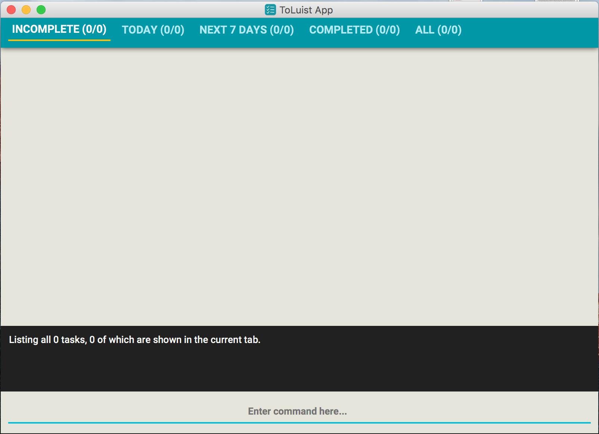
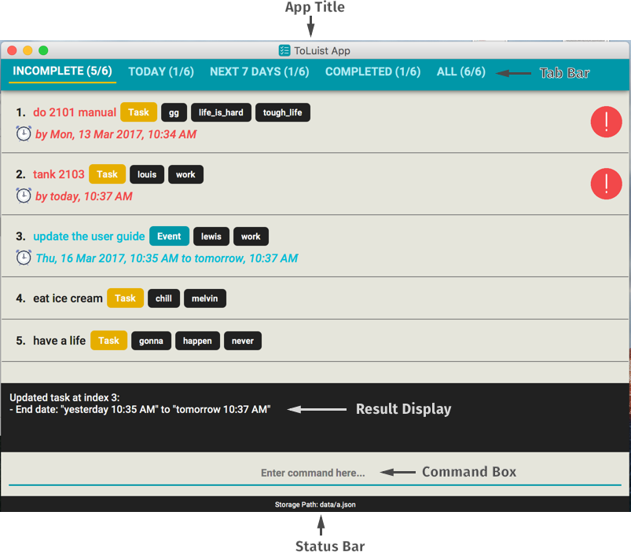
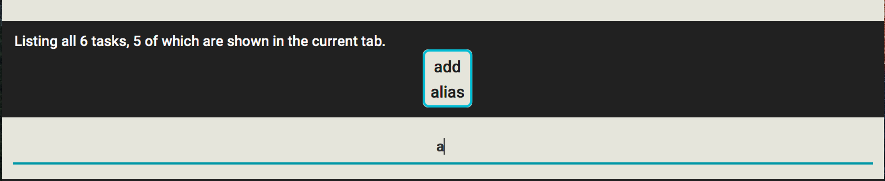
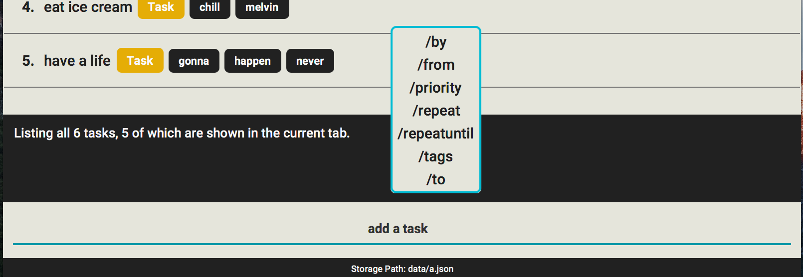
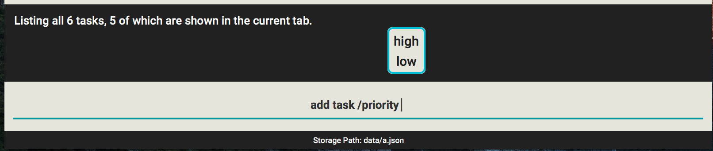
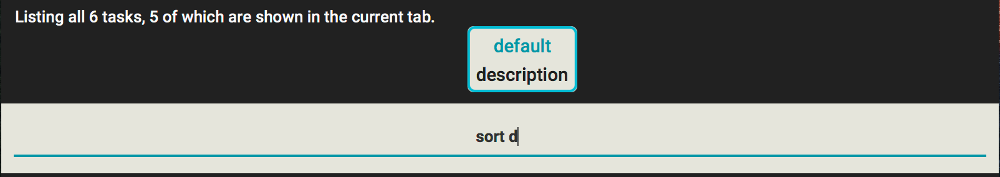

[comment]: # (@@author A0162011A)
# ToLuist - User Guide

By : `Team ToLuist`  &nbsp;&nbsp;&nbsp;&nbsp;

---

1. [Introduction](#1-introduction)
2. [Quick Start](#2-quick-start) 
    2.1 [Install](#21-install) 
    2.2 [Launch](#22-launch) 
    2.3 [Get used to the interface](#23-get-used-to-the-interface) 
    2.4 [Try out some commands](#24-try-out-some-commands)
3. [Features](#3-features)
4. [Command Summary](#4-command-summary)

## 1. Introduction

Have you ever felt overloaded with work? Don't know where to start? 
Now you can use ToLuist, the answer to all of your problems! 
ToLuist is an application which will help you to manage all your tasks, allowing you to sort out your life. 
ToLuist is designed with you in mind, ensuring that you are able to focus on what is important to you.

[comment]: # (@@author A0131125Y)
## 2. Quick Start

### 2.1. Install

1. Before using the app, ensure that you have at least [Java Runtime Environment Version 8 Update 60](https://www.java.com/en/download/manual.jsp)
installed on your computer, so that our app can run properly.
    >   Having any Java 8 version is not enough. 
    This app will not work with earlier versions of Java 8.

2. Using your favourite browser (our recommended choice is [Google Chrome](https://www.google.com/chrome/))
, navigate to our [releases page](https://github.com/CS2103JAN2017-W13-B3/main/releases). Download the latest `toluist.jar` on this page. The current 
latest version should be v0.5.
  
3. Copy the file `toluist` to a folder on your computer where you would like to store your todo list data.

### 2.2. Launch

1. To launch the app, double-click on the file `toluist.jar` you downloaded in [Install](#21-install). 
2. The GUI should appear in a few seconds. Refer to the figure below to see how ToLuist should initially look like on your first launch.
   
    
   **Figure 2.2**: Initial launch screen of ToLuist.

### 2.3. Get used to the interface

With some tasks added in, the interface of ToLuist may look as follows.

    
    **Figure 2.3**: Different components in ToLuist's Ui.
    
At the very top of the app, the **App Title** - which includes an app icon - will highlight that you are 
using ToLuist.
    
Occupying the main bulk of the app, the **Task List** lies in the center of ToLuist. Depending on the 
commands that were entered, as well as the tab selected, the **Task List** may display different sets of 
tasks here. Notice each task is prefixed with an index number. For example, the task `update the user 
guide` has the index number 3. ToLuist uses the index number to uniquely identify a displayed task in 
various commands.

The **Tab Bar** lies just above the **Task List**. It indicates which tab is currently selected by the user. The **Task List** will only show the tasks that satisfy the condition described in the highlighted tab. 
There are 5 different tabs that can be selected:
   * INCOMPLETE: Displays tasks that are not yet completed.
   * TODAY: Displays tasks that are due by / are happening on the current day.
   * NEXT 7 DAYS: Displays tasks that are due by / are happening during the 
    next 7 days, not including the current day.
   * COMPLETED: Displays tasks that are completed.
   * ALL: Displays all tasks.
    
Note that in the label for each tab, there are statistics describing the amount of tasks, and 
how many of these tasks satisfy the tab's description. For example, in the figure above (Figure 2.3), `INCOMPLETE`'s tab 
label is `INCOMPLETE (5/6)`, indicating that there are 5 incomplete tasks out of 6 tasks in total.

The **Command Box** is where you type in your commands. Feedback for your command is displayed in the 
**Result Display**.

Finally, the **Status Bar** is at the bottom of the app. It indicates where your app data is currently 
located.

### 2.4. Try out some commands

Type out these command in the command box and press <kbd>Enter</kbd> to execute it.

1. Since you are new to the app, type in `help` to get some information on the commands ToLuist supports.
2. Try out some example commands:
   * **`add`**` Try Out Todo List` :
     adds a task named `Try Out Todo List` to the todo list.
   * **`delete`**` 1` : deletes the 1st task shown in the current list.
   * **`exit`** : exits the app. 
3. Refer to the [Features](#3-features) section below for details of each command. 

[comment]: # (@@author A0162011A)
## 3. Features

ToLuist is geared towards users who like to type. 
All the features of the application can be accessed through the use of a keyboard, by entering commands into the on-screen text field. 

> **Command Format**
>
> * Words in `UPPER_CASE` are the parameters.
> * Items in `[SQUARE_BRACKETS]` are optional.
> * Items with `...` after them can have multiple instances.
> * Parameters can be in any order.
> * Options with `/` allow either word to be used. (E.g. high/low for task priority)

### 3.1. Viewing help: `help`

If you are a new user of ToLuist, you may need assistance for inputting commands. 
`help` shows you all the commands which are available in the system. 
Format: `help [COMMAND]`

> * The system will also prompt you to enter `help` if you enter an incorrect command.
> * If `help` is entered, followed by a command word, detailed help for that command will be shown instead.

Examples:

* `help`  
  Shows general help information.
* `help add`  
  Shows detailed help information for `add` command.
  
### 3.2. Getting keyword suggestions smartly

You might find it hard to remember all the commands and their format. 
ToLuist will automatically suggest to you how you can complete your command. 
As you type, a list of suggestions (up to 10) will appear.
  
For example, ToLuist suggest to you the command words `add` and `alias` when you type `a`.

    
   **Figure 3.2a**: `add` and `alias` are suggested as `a` is typed.

ToLuist also shows you the parameters available for a command type.

    
   **Figure 3.2b**: Parameters are suggested as ToLuist is aware that you are adding a task.

ToLuist will also show you suggestions for parameters with specific options.

    
   **Figure 3.2c**: `high` and `low` are suggested as options for task priority.

If only one suggestion is shown, you can press <kbd>Tab</kbd> to automatically replace the last word of your 
command with the suggestion. If there are multiple suggestions available, you can press <kbd>Tab</kbd> to 
cycle through the list of suggestions, and press <kbd>Enter</kbd> to select one of them.
 
    
   **Figure 3.2d**: Suggestions can be cycled through. The currently selected suggestion will be highlighted.
  

### 3.3. Switching to a different tab: `switch`

When using ToLuist, you may want to switch between different tabs to zoom in on the tasks most important to
 you. 
`switch` allows you to view a different subset of the currently displayed tasks. 
Format: `switch TABIDENTIFIER`

> * If a number is given for tab identifier, that will be the number of the tab from the left which is selected.
> * If a letter is given, it will be the underlined letter in the window list name.
> * If a word is given, it will be the word with the underlined letter in the window list name.
> * You can also use key combination <kbd>Ctrl</kbd> with a number to switch between different tabs.

Example:
* `switch 2`  
  Switches the displayed view to `Today`.
* `switch T`  
  Switches the displayed view to `Today`.
* You press <kbd>Ctrl</kbd> + <kbd>5</kbd> on the keyboard.  
  Switches the displayed view to `All`.

[comment]: # (@@author A0127545A)
### 3.4. Adding a task: `add`

You can start keeping track of your tasks by adding them to ToLuist. 
`add` allows you to add a task to the system. 
Format: `add DESCRIPTION [/from STARTDATE /to ENDDATE] [/by ENDDATE] [/repeat PERIOD(daily/weekly/monthly/yearly)] [/repeatuntil REPEATDATE] [/priority PRIORITY(high/low)] [/tags TAGS]`

> * `/from` and `/to` must be used together.
> * The values entered for `STARTDATE` and `ENDDATE` are very flexible: 
    Standard dates are parsed, with the month being before the day. i.e. `MM/DD/YY`, `MM/DD/YYYY`, `YYYY/MM/DD`, `YYYY/MM/DD` 
    Relaxed dates are parsed as logically as possible. i.e. `Jan 21, '97`, `Sun, Nov 21`, `The 31st of April in the year 2017` 
    Relative dates are also allowed. i.e. `Yesterday`, `Today`, `Next Sunday`, `3 Days from now` 
    Standard times are parsed in as well. i.e. `0600h`, `8pm`, `noon`, `4:30 p.m.` 
    Similar to dates, relative times are also allowed. i.e. `5 minutes from now`, `in 10 minutes`, `5 hours ago` 
    For more details, please visit http://natty.joestelmach.com/doc.jsp.
> * ToLuist will auto scroll to the newly added task.

#### 3.4.1. Adding a 

Examples:

* `add Do Homework`  
  Adds a task called `Do Homework`.
* `add Meeting With Boss /from 11-11-2011 17:30 /to 11-11-2011 19:30`  
  Adds a task called `Meeting With Boss`, with start date 11-11-2011 17:30, and end date to be 11-11-2011 19:30.
* `add Check Email /by today`  
  Adds a task called `Check Email`, and sets the deadline to be today's date.

[comment]: # (@@author A0127545A)
### 3.5. Updating a task: `update`

Sometimes, you may need to update or fix a previously entered task. 
`update` allows you to update an existing task in the list. 
Format: `update INDEX [NAME] [/from STARTDATE /to ENDDATE] [/by ENDDATE] [/repeat PERIOD(daily/weekly/monthly/yearly)] [/repeatuntil REPEATDATE] [/stoprepeat] [/priority PRIORITY(high/low)] [/tags TAGS]`

> * Updates the task at the specified `INDEX`.  
    The index refers to the index number shown in the last task listing.
> * Only fields entered will be updated.
> * When editing tags, the existing tags of the task will be set to contain the new tags; the old tags will be removed.

Examples:

* `update 2 Assignment 3` 
  Updates the name of the 2nd task to be `Assignment 3`.
* `update 3 /from today /to tomorrow`  
  Updates the start date and end date of the 3rd task to today and tomorrow respectively.

[comment]: # (@@author A0162011A)
### 3.6. Filtering all tasks for a given keyword: `filter`

As you list of tasks grows, you may find the need to filter your todo list to locate a particularly 
important task.
`filter` allows you to finds tasks whose names or tags contain any of the given keywords. 
Format: `filter/list/find [KEYWORDS] [/tag] [/name]`

> * The search is case insensitive. e.g `hans` will match `Hans`
> * The order of the keywords does not matter. e.g. `Hans Bo` will match `Bo Hans`
> * By default the name and tag is searched.
> * Adding '/tag' will search by only tag.
> * Adding '/name' will search by only name.
> * If no keyword is entered, the list of all tasks is displayed.
> * Partial words will be matched. e.g. `Han` will match `Hans`
> * Tasks matching at least one keyword will be returned (i.e. `OR` search).
    e.g. `Hans` will match `Hans Bo`
> * Search terms that are used in the current search will pop up as suggestions in subsequent searches.

Examples:

* `find Assignment` 
  Lists any task with `Assignment` in their names or tags.
* `find Assignment Project Tutorial` 
  Returns any task having `Assignment`, `Project`, or `Tutorial` in their names or tags.
* `find school /tag`  
  Returns any task with the word `school` in the tag name.

### 3.7. Sorting all tasks in a given order: `sort`

You may feel the need to sort your tasks in some order, so that the tasks that require your immediate 
attention stand out at the top. 
`sort` allows you to re-order the task list according to a category you specify. 
Format: `sort CATEGORY(priority/enddate/startdate/description/overdue/default)...`

> * The category entered will be given higher preference for sorting.
> * By default, the sorted order is: overdue -> priority -> enddate -> startdate -> description
> * Using `default` as the category will revert the sorting order to the above mentioned default.
> * Multiple categories can be used. The list will be sorted in order based on which category was entered first.

Examples:

* `sort priority` 
  Changes the sorting order to sort by priority first.
* `sort enddate description` 
  Changes the sorting order to sort by enddate, then description.
* `sort default` 
  Changes the sorting order to the default sort.

[comment]: # (@@author A0127545A)
### 3.8. Deleting a task: `delete`

Assuming you have been using ToLuist for a long while, you may want to remove some of your older tasks. 
`delete` allows you to delete a task or multiple tasks from the todo list. 
Format: `delete INDEX(ES)`

> * Deletes the task at the specified `INDEX`.  
> * The index(es) refers to the index number shown in the most recent listing. 
> * Supports deletion of multiple indexes in a single command.

Examples:

* `delete 2` 
  Deletes the 2nd task in the todo list.
* `delete 3 - 6` 
  Deletes the 3rd, 4th, 5th, and 6th task in the todo list. 
* `delete 3 -` 
  Deletes from 3rd to last in the todo list.
* `delete - 5` 
  Deletes from first to 5th task in the todo list.
* `delete 5, - 3, 7-8 10, 12 -` 
  Deletes from 1st to 3rd, 5th, 7th, 8th, 10th, and from 12th to last task in the todo list.

[comment]: # (@@author A0131125Y)
### 3.9. Completing or Making Incomplete a Task: `mark`

After you completed a task, you may want to indicate this in ToLuist. Alternatively, you may want to mark 
a completed task as incomplete if you feel that it still needs more work. 
`mark` allow you to set the completion status for a task or multiple tasks. 
Format: `mark [complete/incomplete] INDEX(ES)`

> * Using complete as a parameter will mark the selected task(s) as complete.
> * Using incomplete as a parameter will mark the selected task(s) as incomplete.
> * Using neither will default the command to mark as complete.
> * Supports marking of multiple indexes in a single command.

Example:
* `mark complete 1`  
  Marks task 1 as complete.
* `mark incomplete 2`  
  Marks task 2 as incomplete.
* `mark 3`  
  Marks task 3 as complete.
* `mark 3 -` 
  Marks tasks from 3rd to last in the todo list as complete.
* `mark incomplete - 5` 
  Marks tasks from first to 5th task in the todo list as incomplete.
* `mark 5, - 3, 7-8 10, 12 -` 
  Marks tasks from 1st to 3rd, 5th, 7th, 8th, 10th, and from 12th to last task in the todo list as complete.

[comment]: # (@@author A0162011A)
### 3.10. Adding a Tag to a Task: `tag`

You may want to differentiate your tasks by categories. 
`tag` allows you to add a tag or multiple tags to an existing task.  
Format: `tag INDEX TAG...`

> * If the tag already exists, the command will notify you and do nothing.
> * If multiple tags are used in the command, you will be notified of each one.

Example:
* `tag 1 school`  
  Adds the tag 'school' to task 1.
* `tag 2 work home`  
  Adds the tags 'work' and 'home' to task 2.

### 3.11. Removing a Tag from a Task: `untag`

You may change your mind and decide to remove a category from a task. 
`untag` allows you to remove a tag or multiple tags from an existing task.  
Format: `untag INDEX TAG...`

> * If the tag already does not exist, the command will notify you and do nothing.
> * If multiple tags are used in the command, you will be notified of each one.

Example:
* `untag 1 school`  
  Removes the tag 'school' from task 1.
* `untag 2 work home`  
  Removes the tags 'work' and 'home' from task 2.

### 3.12. Clearing all entries: `clear`

Occasionally, the stress may get to you, and you want to start from a clean slate. 
`clear` allows you to clear all entries from the todo list. 
Format: `clear`

[comment]: # (@@author A0131125Y)
### 3.13. Undoing a command: `undo`

As human, we make mistakes, perhaps by entering a wrong command. In these cases, you may wish to reverse 
the result of your command. 
`undo` allows you to undo your previous command(s). 
Format: `undo [NUMBER]`

> * `undo` allows reverting of modifications to the tasks in the todo list. This means that commands like 
`add`, `update`, `delete`, `clear`, `tag`, `untag` and `mark` which modifies the tasks can be reversed with
> `undo`. If loading a different data file with `load` causes the current tasks to be changed, you can go back
> to the previous list of tasks using `undo` too (Using `undo`, however, won't revert the change of data 
storage path. It's not considered modifications to the task).
> Changes that are not modifications to the tasks in the todo list cannot be reversed with `undo`. However, 
> you can still easily revert their effects:
>   * Changing of storage path location (with `save` / `load` ) - You can change your storage path to the 
previous location with `save`.
>   * Setting of aliases (with `alias`) - You can remove the alias with `unalias`.
>   * Removing aliases (with `unalias`) - You can set back the alias with `alias`.
>   * Re-ordering the list of tasks (with `sort`) - You can set back the previous sorting order with `sort`.
>
> * If a number is entered, undoes that amount of previous commands instead.
> * You can also use key combination <kbd>Ctrl</kbd> + <kbd>Z</kbd> to quickly undo one time.

Examples:

* `add Test` 
  `undo` 
  Undo adding Test to the todo list.
* `add Assignment`  
  `add Project`  
  `undo 2` 
  Undo both commands.
* `add Test` 
  Press <kbd>Ctrl</kbd> + <kbd>Z</kbd>  
  Undo adding Test to the todo list.

### 3.14. Redoing a command: `redo`

After undoing a command, you want to re-apply it. 
`redo` allows you to redo previously undone commands. 
Format: `redo [NUMBER]`

> * Similar to `undo`, `redo` will help you re-apply modifications to the tasks in the todo list that 
> * you mistakenly revoked (using `undo`). 
> * If a number is entered, redo that amount of previous commands instead. 
> * The number must be less than or equal to the number of commands undone.
> * You can also use key combination <kbd>Ctrl</kbd> + <kbd>Y</kbd> to quickly redo one time.

Examples:

* `add Test` 
  `undo` 
  `redo`  
  Redo adding Test to the todo list.
* `add Assignment`  
  `add Project` 
  `undo 2` 
  `redo` 
  Redo `add Assignment`.
* `add Test` 
  `undo` 
  Press <kbd>Ctrl</kbd> + <kbd>Y</kbd>  
  Redo adding Test to the todo list.

[comment]: # (@@author A0162011A)
### 3.15. Viewing previous commands and accessing them: `history`

You may want to check what you have previously entered. 
`history` shows you your previous commands entered in the current session.  
Format: `history`

> * Previous commands are listed in order from latest command to earlier command.
> * Alternatively, pressing on the <kbd>up</kbd> and <kbd>down</kbd> arrow keys on the keyboard will cycle through the commands previously entered.

Examples:
* `add Test`  
  `history`  
  Shows `add Test` in the list.
* `add Test`  
  Press on the <kbd>up</kbd> arrow key.  
  Shows `add Test` in your input text field.

### 3.16. Adding alias for any phrase: `alias`

For long commands like `mark complete`, you may want to have a shortcut for it. 
`alias` allows you to add an alias for a phrase.  
Format: `alias ALIAS PHRASE`

> * Once added, alias can be used instead of the phrase to perform operations. In subsequent commands, if 
the first word is detected to an alias, the command will give the same result as if the command starts the 
aliased phrase.
> * The phrase can be multiple words long. It can be anything, not necessarily a command word.
> * Parameter suggestion is also supported for commands that uses an alias. For example, if `a` is set as 
an alias for `add`, the parameters for adding task are also suggested when `a a task` is typed.

Example:
* `alias hs history`  
  `hs`  
  Shows `alias hs history` in the list.
* `alias addTaskNamedTest add Test`  
  `addTaskNamedTest`  
  Performs the command `add Test` which will add a new task called 'Test'.

### 3.17. Removing an alias: `unalias`

You may an alias no longer suitable, and want to remove it from ToLuist. 
`unalias` allows you to remove an alias for a phrase. 
Format: `unalias ALIAS`

Example:
* `alias hs history`  
  `unalias hs`  
  Removes the alias 'hs'.

### 3.18. Viewing aliases: `viewalias`

You may get forgetful and forget the aliases you set in ToLuist. 
`viewalias` shows you all the aliases currently set in the system.  
Format: `viewalias`

> * Lists aliases in the format `ALIAS:PHRASE`.

Example:
* `alias hs history`  
  `viewalias`  
  Shows `hs:history` in the list.

### 3.19. Saving the data

You would want to have your data on your computer always updated, even if you close and re-open 
the application. 
ToLuist data are saved in the hard disk automatically after any command that changes the data. By default, 
the data is saved `data/toluist.json`, relative to the `toluist.jar` executable file. 
There is no need to save manually.

### 3.20. Specifying a new storage location to save data to: `save`

Occasionally, you may want to change the save location of the application, such as if you are 
moving it to a Dropbox folder. 
`save` changes the location for the storage file used in this system.  
Warning: If a file with the requested name already exists, it will be overwritten.  
Format: `save NEWFILELOCATION`

> * All data will be moved to the new file location.
> * If the file does not exist, the file will be created.
> * The old file will be removed.
> * This feature is similar to the `Save as...` feature in other applications.

Example:
* `save data/savefile.txt`  
  Sets the save storage location to `data/savefile.txt`.

### 3.21. Specifying a new storage location to load data from: `load`

Occasionally, you may want to load the data from a different location, such as when you want
 to load the data from a file in Dropbox. 
`load` changes the location for the storage file used in this system.  
Format: `load NEWFILELOCATION`

> * The new save location will be updated to the location.
> * The program will replace the data in the program with data from the new file location.
> * If the file does not exist, an error message will be displayed.
> * Warning: The old data in the program will stay in the old save file, and will not be updated with new values.

Example:
* `load data/savefile.txt`  
  Sets the load storage location to `data/savefile.txt`.

### 3.22. Exiting the program: `exit`

After you are done organizing your todo list, you may want to close the application. 
`exit` allows you to exit the program. 
Format: `exit/quit`

## 4. Command Summary

**Command** | **Format** | **Examples**
-------- | :-------- | :---------
Add | `add NAME [/from STARTDATE /to ENDDATE] [/by ENDDATE] [/repeat PERIOD(day/week/month)] [/priority PRIORITY(high/low)] [/tags TAGS]` | `add Assigment 1 /by Friday /tags school`
Add a Tag to a Task | `tag INDEX TAG...` | `tag 1 school`   `tag 3 work home`
Add Alias | `alias ALIAS PHRASE` | `alias hs history`
Change Load Storage Location | `load FILELOCATION` | `load data/savefile.txt`
Change Save Storage Location | `save FILELOCATION` | `save data/savefile.txt`
Clear | `clear`
Delete | `delete INDEX(ES)` | `delete 3`
Delete Alias | `unalias ALIAS` | `unalias hs`
Exit | `exit/quit`
Filter | `filter/list/find [KEYWORDS] [/tag] [/name]` | `find school tag/`
Help | `help [COMMAND]` | `help add`
History | `history`
Mark a Task Complete or Incomplete | `mark [complete/incomplete] INDEX(ES)` | `mark complete 1`   `mark incomplete 2`   `mark 3`
Sort | `sort CATEGORY(priority/enddate/startdate/overdue/description/default)...` | `sort priority`
Switch Display Task Window | `switch WINDOWIDENTIFIER` | `switch 2`   `switch T`
Undo | `undo [NUMBER]` | `undo 5`   `undo`
Update | `update INDEX [/from STARTDATE /to ENDDATE] [/by ENDDATE] [/repeat PERIOD(day/week/month)] [/stoprepeat] [/priority PRIORITY(high/low)] [/tags TAGS]` | `update 1 /by 11/12/2011`
Remove a Tag from a Task | `untag INDEX TAG...` | `untag 1 school`   `untag 3 work home`
Redo | `redo [NUMBER]` | `redo 5`   `redo`
View Aliases | `viewalias`
