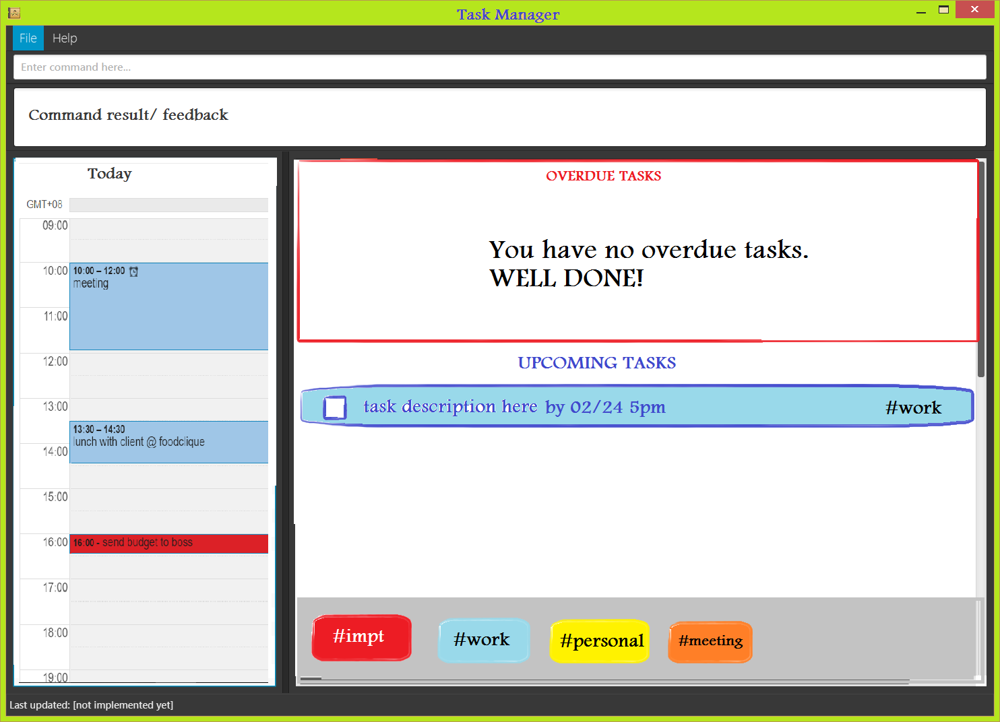

# Task Manager - User Guide

By : `CS2103JAN2017-T16-B3`  &nbsp;&nbsp;&nbsp;&nbsp; Since: `Jan 2017`  &nbsp;&nbsp;&nbsp;&nbsp; Licence: `MIT`

---

1. [Quick Start](#1-quick-start)
2. [Features](#2-features)
3. [FAQ](#3-faq)
4. [Command Summary](#4-command-summary)

## 1. Quick Start

0. Ensure you have Java version `1.8.0_60` or later installed in your Computer. 

   > Having any Java 8 version is not enough.  
   > This app will not work with earlier versions of Java 8.

1. Download the latest `taskmanager.jar` from the [releases](../../../releases) tab.
2. Copy the file to the folder you want to use as the home folder for your Task Manager.
3. Double-click the file to start the app. The GUI should appear in a few seconds.
   > 

4. Type the command in the command box and press <kbd>Enter</kbd> to execute it.  
   e.g. typing **`help`** and pressing <kbd>Enter</kbd> will open the help window.
5. Some example commands you can try:
   * **`list all`** : lists all tasks
   * **`add `**` send budget proposal by next Thurs noon to boss #project` :
     adds a task to the task manager.
   * **`exit`** : exits the app
6. Refer to the [Features](#features) section below for details of each command. 

## 2. Features

> **Command Format**
>
> * Words in `UPPER_CASE` are the parameters.
> * Items in `SQUARE_BRACKETS` are optional.
> * Items with `...` after them can have multiple instances.
> * Parameters can be in any order.

> **DATETIME Format**
>
> Watodo uses the external library Natty Date Parser to parse date and time options.
> Some examples of the acceptable formats are:
> * `2017-02-23` (yyyy-mm-dd)  
> * `04/05` (mm/dd)  
> * `today`  
> * `tomorrow` or `tmr`  
> * `next tues`  
> * `3 weeks from now`  
> * `9pm` or `21:00`  
> * `noon`  

> * if only the date/day is provided, the time will be default set as to 11.59 pm
> * if only the time is provided, the date/day will be default set as the current date/day

### 2.1. Viewing help : `help`

Format: `help`

> A help window will be opened showing the user guide.
> Help for each individual command is also shown when you type the command word only
 or when the argument format is invalid. 

### 2.2. Adding a task : `add`

Adds a task to the task manager. Three types of tasks are supported. 
> Task description need not be continuous, i.e. a tag can be placed in between two chunks of the description
> Task can have any number of tags (including 0)
> Spacing after the dateTime prefixes (eg. by/) is not necessary

### a) Floating task

Format: `add DESCRIPTION [#TAG]...`

Examples:

* `add read Lord of The Rings #personal`
* `add #noTime cut hair

### b) Deadline task

Format: `add DESCRIPTION by/ DATETIME [#TAG]...`  
     OR `add DESCRIPTION on/ DATETIME [#TAG]...`

Examples:

* `add prepare meeting slides by/ tomorrow 9am #impt #work`
* `add send budget proposal on/ Thurs noon to boss #project`

### c) Event task

Format: `add DESCRIPTION from/ START_DATETIME to/ END_DATETIME [#TAG]...`  
     OR `add DESCRIPTION on/ START_DATETIME to/ END_DATE_TIME [#TAG]...`

Examples:

* `add  from/next mon to/ 05/16 attend skills upgrading workshop`
* `add meeting at board room 4 from/ 10am to/ 11am #project #meetings`

### 2.3. Listing tasks by type : `list LIST_TYPE`

Format: `list` 
Shows a list of all overdue tasks and upcoming tasks set for the next day. 

Format: `list all` 
Shows a list of all tasks. 

Format: `list float` 
Shows a list of all floating tasks. 

Format: `list deadline` 
Shows a list of all tasks with deadlines. 

Format: `list event` 
Shows a list of all events. 

Format: `list from/ START_DATETIME to/ END_DATETIME`  
     OR `list by/ DATETIME`
Shows a list of tasks scheduled within the specified range of dates. 

Examples:
* `list from/ tomorrow to/ Sunday`
* `list by/ Sunday`

Format: `list #TAG` 
Shows a list of tasks labeled with the given TAG. 

Format: `list done` 
Shows a list of all tasks that have been marked as completed. 

### 2.4. Finding all tasks containing any keyword in their description: `find`

Finds tasks which contain any of the given keywords in their description. 
Format: `find KEYWORD [MORE_KEYWORDS]...`

> * Only the task description is searched.
> * The search is case insensitive. e.g `Report` will match `report`
> * The order of the keywords does not matter. e.g. `proposal for boss` will match `for boss proposal`
> * Partial words are matched. e.g. `proj` will match `project`
> * Tasks matching at least one keyword will be returned (i.e. `OR` search).
    e.g. `lunch` will match `lunch appointment`

Examples:

* `find write test case` 
  Returns any tasks with `write`, `test`, `case`, `testing`, `cases`, 
  `write case`, and any combination of the individual words as part of its description (case insensitive)

### 2.5. Editing a task : `edit`

Edits an existing task in the task manager. 
Format: `edit INDEX <[DESCRIPTION] [EDIT DATETIME FORMAT] [#TAG]...>`

> * Edits the person at the specified `INDEX`.
    The index refers to the index number shown in the last task listing. 
    The index **must be a positive integer** 1, 2, 3, ...
> * At least one of the optional fields within the <> must be provided.
> * Existing values will be updated to the input values.
> * When editing tags, inputting tags of the task that already exist will removed them from the task i.e adding of tags is not cumulative.
    Inputting tags of the task that do not already exist will add them to the task.

EDIT DATETIME FORMAT
> * Task can be changed from one task type to any other task type
> * DATETIME FORMAT must be one of the following four:
>   a. by/ DATETIME
>   b. on/ DATETIME
>   c. from/ DATETIME to/ DATETIME
>   d. on/ DATETIME to/ DATETIME
> * All existing DATETIME of the task to be edited will be removed.

> * To remove DATETIMEs of a task, the format is:
`edit INDEX REMOVEDATES`
> * No other field is allowed

Examples:

* `list`
  `edit 5 meeting at board room` 
  Edits the task description of the 5th task today to be `meeting at board room`.

  `edit 2 by/ mon ` 
  Edits the deadline of the 2nd task listed to be `mon`

  `edit 3 REMOVEDATES`  
  removes all existing start and end dateTimes in the 3rd task

  `edit 4 #newTag`
  adds the tag newTag to the 4th task in the list, given that the task does not already have that tag

  `edit 1 #existingTag`
  removes the existingTag from the 1st task, given that the task already has that tag

### 2.6. Deleting a task : `delete`

Deletes the specified task from the task manager.  
Format: `delete INDEX [MORE_INDICES]...`

> Deletes the task at the specified `INDEX`.  
> The index refers to the index number shown in the most recent listing. 
> The index **must be a positive integer** 1, 2, 3, ...

Examples:

* `list all` 
  `delete 2 3` 
  Deletes the 2nd and 3rd task in the list of all tasks.

### 2.7. Mark a task : `mark`

Marks the task identified by the index number used in the last task listing. 
Format: `mark INDEX [MORE_INDICES]...`

> Marks the task as completed and hides it from view.
> Task is added to a list of completed tasks that can be viewed by calling `list done`. 
> The index refers to the index number shown in the most recent listing. 
> The index **must be a positive integer** 1, 2, 3, ...

Examples:

* `list today` 
  `mark 2 3` 
  Marks the 2nd and 3rd task in the list of task today.

### 2.8. Unmark a task : `unmark`

Unmarks the task identified by the index number used in the marked task listing. 
Format: `unmark INDEX [MORE_INDICES]...`

> Unmarks a previously marked task and restores it back into its original location and view.
> The index refers to the index number shown in the most recent listing. 
> The index **must be a positive integer** 1, 2, 3, ...

Examples:

* `list marked` 
  `unmark 2 3` 
  Unmarks the 2nd and 3rd task in the list.

### 2.9. Undoing previous step : `undo`

Undo the previous command and restore the data to one step before. 
Format: `undo`

> Supported commands to undo: `add` `clear` `delete` `edit` `mark` `unmark`

### 2.10. Redoing previous step : `redo`

Redo the previous command and restore the data to one step before.  
Fromat: `redo`

> Supported commands to redo: `add` `clear` `delete` `edit` `mark` `unmark`

### 2.11. Clearing all entries : `clear`

Clears all entries from the task manager. 
Format: `clear`

### 2.12. Load data from a specified file : `import`

Clears all entries from the task manager. 
Format: `import FILE_PATH`

Examples:

* `import data/watodo2.xml`
  Load data from data/watodo2.xml and saves future data to the same file location.

### 2.13. Change storage file location : `saveas`

Saves task list data to the new specified file path and loads task list from that location in the future. 
Format: `saveas FILE_PATH`
> * 'FILE_PATH' must end with **.xml**

Examples:

* `saveas data/watodo2.xml`
  Saves current and future data to data/watodo2.xml.

### 2.14. View current storage file location : `viewfile`

Format: `viewfile`

### 2.15 Alternative commands

Below is a list of shortcut keys for some of the above commands:

> * add: `a`
> * edit: `e`
> * list: `l`
> * delete: `d`, `del`
> * mark: `m`, `check`
> * unmark: `um`, `uncheck`
> * find: `f`, `search`

### 2.16 Customize alternative commands: `shortcut`

You can add and delete your own personal shortcut keys to the various commands.
Format: `shortcut + COMMAND_WORD SHORTCUT_KEY` (adds SHORTCUT_KEY for COMMARD_WORD feature)
        `shortcut - COMMAND_WORD SHORTCUT_KEY` (deletes the existing SHORTCUT_KEY)

> SHORTCUT_KEY can be any character except whitespace.
> Unfortunately, special keys (eg. F1, SHIFT, CTRL etc) are not supported. :(

Examples:
* shortcut + add @@
* shortcut + undo z
* shortcut - undo z

### 2.17. Exiting the program : `exit`

Exits the program. 
Format: `exit`

### 2.18. Saving the data

Task manager data are saved in the hard disk automatically after any command that changes the data. 
There is no need to save manually.

## 3. FAQ

**Q**: How do I transfer my data to another Computer? 
**A**: Install the app in the other computer and overwrite the empty data file it creates with
       the file that contains the data of your previous Task Manager folder.

## 4. Command Summary

* **Add**
> * `add TASK [#TAG]...`  
> * `add TASK by/ DATETIME [#TAG]...`
> * `add TASK on/ DATETIME [#TAG]...`
> * `add TASK from/ START_DATETIME to/ END_DATETIME [#TAG]...`
> * `add TASK on/ START_DATETIME to/ END_DATETIME [#TAG]...`

* **List** : `list`  
> * `list` 
> * `list all` 
> * `list float` 
> * `list deadline` 
> * `list event` 
> * `list day` 
> * `list week` 
> * `list month` 
> * `list #TAG` 
> * `list done` 

* **Find** : `find KEYWORD [MORE_KEYWORDS]...`  

* **Edit** : `edit INDEX [TASK] [by DATETIME] [from START_DATETIME to END_DATETIME] [#TAG]...`  

* **Delete** : `delete INDEX [MORE_INDICES]...`  

* **Mark** : `mark INDEX [MORE_INDICES]...`  

* **Unmark** : `unmark INDEX [MORE_INDICES]...`  

* **Undo** : `undo`  

* **Redo** : `redo`  

* **Clear** : `clear`  

* **Import** : `import FILE_PATH`  

* **Save As** : `saveas FILE_PATH`  

* **View File** : `viewfile`  

* **Help** : `help`  

* **Alternative Commands** :  
> * add: `a`
> * edit: `e`
> * list: `l`
> * delete: `d`
> * mark: `m`, `check`
> * unmark: `um`, `uncheck`
> * find: `f`, `search`

* **Customize Alternative Commands** : 'shortcut'
> * `shortcut + COMMAND_WORD SHORTCUT_KEY`
> * `shortcut - COMMAND_WORD SHORTCUT_KEY`
