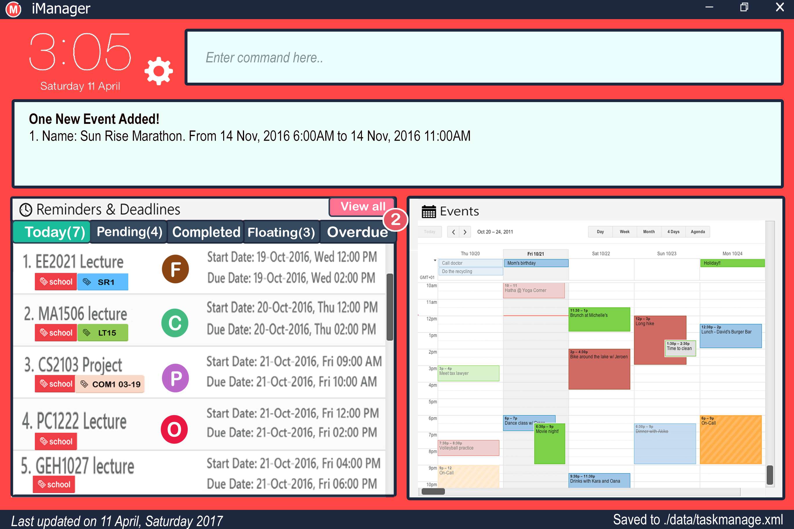

# User Guide

* [Introduction](#introduction)
* [Quick Start](#quick-start)
* [UI Control](#ui-control)
* [Features](#features)
* [FAQ](#faq)
* [Command Summary](#command-summary)

## Introduction
In the hectic world of today, people are constantly bombarded by innumerable tasks at hand. As a result, people tend to lose track of their work progress and deviate from their priorities. Problems like these are far too common among working adults and students embarking on tight projects. Thus, our team would like to present to you a solution that could curb all your management problem! 

Presenting to you, iManager.

iManager is a task manager application that helps you manage all your tasks at one place. With its interactive UI, user can now experience managing their tasks like never before.  Our product incorporates niche features such as FlexiCommands and Google Integration that brings convenient to user in managing their schedules and tasks. iManager remove the need to rely on multiple applications as it manages it all! 

Without further ado, let’s get started. 

   
## Quick Start
0. Ensure you have Java version `1.8.0_60` or later installed in your Computer. 
   > Having any Java 8 version is not enough.  
   This app will not work with earlier versions of Java 8.
   
1.  Download the latest `iManager.jar` from the [releases](../../../releases) tab.
2. Copy the file to the folder you want to use as the home folder for your iManager application.
3. Double-click the file to start the app. The GUI should appear in a few seconds. Refer to [UI Control](#ui-control) for a more detailed walkthrough of various UI components. 
   > 

4. Type the command in the command box and press <kbd>Enter</kbd> to execute it.  
   e.g. typing **`help`** and pressing <kbd>Enter</kbd> will open the help window. 
5. Some example commands you can try:
   * **`NIL`**:    
6. Refer to the[Features](#features) section below for details of each command.
   

## UI Control

### Task Status     
The statuses of a task is shown as below: 

|  Avatar | Status  
|  :---:  | :---:  
|  |         Floating 
|  |        Complete 
|  |          Pending 
|  |          Overdue 

## Features

> **Command Format**
> * Words in `UPPER_CASE` are the parameters.
> * Items in `SQUARE_BRACKETS` are optional.
> * Items with `...` after them can have multiple instances.
> * The order of optional parameters are flexible.

### Viewing help : `help`

Shows a list of all commands in iManager. 

List of available [KEY_WORD] for help:  
-  
-  
-  

Format: `help`

Examples:

* `help`  
  Shows all available commands and examples 
  
### Adding a task: `add` 

Adds a task to iManager 

Format: `add` 

Examples: 
* 
* 

### Editing a task: `edit` 

Edit a task in iManager 

Format: `edit` 

Examples:
* 
* 

### Deleting a task: `delete` 

Delete a task from iManager 

Format: `delete` 

Examples: 
* 
* 

### Viewing tasks : `view` 
Shows a list of all tasks iManage. Able to filter based on status of task/event.

Format: `view` 

Examples: 
* 
* 

### Marking a task as completed : `done` 
Mark an existing task as completed in iManager.

Format: `done`

Examples: 
* 
* 
 
### Finding for tasks : `find` 
With the find command, you can find for tasks or events which contain some keywords in their **name** as well as in their **descriptions**. 

Format: `find `

Examples:
* 
*  
  
### Clearing of tasks : `clear` 
Clears all completed tasks.  

Format: `clear`

Examples: 
* 
* 

### Toggle google calender
Toggle the view of google calendar and focus to certain time time as user specified. 

Format: 

Examples:
* 
* 

### Undo most recent command : `undo` 
You can go back to historical versions of iManager with the use of undo commands. Only commands that modify iManager in the same session will be restored. Any versions of current session will not be accessible after restarting iManager.  

Format: `undo`

### Redo most recent command : `redo` 
You can go advance to historical versions of Dowat with the use of redo commands. Only commands that modify Dowat in the same session will be restored. Any versions of current session will not be accessible after restarting Dowat.  

Format: `redo`

### reset data : `reset`
iManager will save data in a file called iManager.txt in the project root folder by dafault or if the file path is not specified. 
You can change the location by specifying the file path as a command argument.
New file will be automatically created as long as given directory is valid.

Format: `reset`

### Changing the save location : `saveto`
iManager will save data in a file called iManager.txt in the project root folder by dafault or if the file path is not specified. 
You can change the location by specifying the file path as a command argument.
New file will be automatically created as long as given directory is valid.

Format: `saveto FILEPATH`

> FILEPATH (must be valid)

Examples:
* `saveto C:\Users\Computing\Desktop\CS2103` 

### Exiting the program
Format : `exit`

## FAQ

**Q**:  
**A**:  

## Command Summary

 Command | Format  | Description
-------- | -------- | -------- 
[help](#help) | `help`| Opens a help page
[add](#add) | `add NAME [PRIORITY] [/t TAG1, TAG2…]`| Adds a floating task with priority and tags
 | `add NAME at START_DATETIME [PRIORITY] [/t TAG1, TAG2…]`| Adds a pending task with only start time, priority and tags
 | `add NAME by END_DATETIME [PRIORITY] [/t TAG1, TAG2…]`| Adds a pending task with only deadline, priority and tags
 | `add NAME by END_DATETIME [PRIORITY] [/t TAG1, TAG2…]`| Adds a pending task with start time, end time, priority and tags
 | `add [INSTANCES] NAME [at|by|from START_DATETIME] [to END_DATETIME][PRIORITY] every [DAY|MONTH|YEAR] [/t TAG1, TAG2…]` | Adds a recurring number of task instances that spans over a period of time with priority and tags
[edit](#edit) | `Edit INDEX|NAME [at|by|from START_DATETIME] [to END_DATETIME][PRIORITY] every [DAY|MONTH|YEAR] [/t TAG1, TAG2…]` | Edits a task with the new parameters
[delete](#delete) | `Delete INDEX|NAME` | Delete a task 
[view](#view) | `view` | Show all tasks
 | `view t` | Show all today’s tasks
 | `view p` |Show all pending task
 | `view c` | Show all completed task
 | `view f` | Show all floating task
 | `view o` | Show all overdue task
 | `view INDEX|NAME|START_DATETIME|END_DATETIME|PRIORITY|DAY|MONTH|YEAR TAG` | Show a specified task based on its detail 
[done](#done) | `done INDEX|NAME`| Mark a task as done
[find](#find) | `Find KEYWORDS [KEYWORD 1, KEYWORD2,..]`| Find the task associated to the keyword
[clear](#clear) | `clear` | Clear all completed tasks
[undo](#undo) | `undo` | Undo the most recent command
[redo](#redo) | `redo` | Redo the most recent undo
[reset](#reset) | `reset` | Reset save data
[saveto](#saveto) | `saveto PATH` | Change the default save directory 
[exit](#exit) | `exit` | Exit the application

