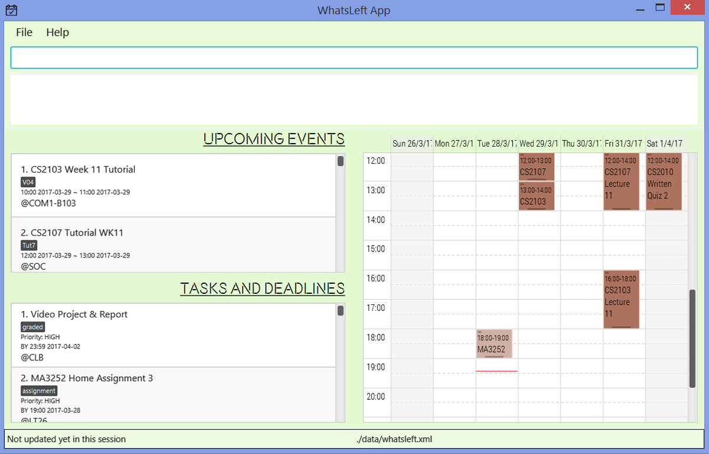

# WhatsLeft - User Guide

By : `Team CS2103JAN2017-W10-B4`  &nbsp;&nbsp;&nbsp;&nbsp; Since: `Feb 2017`  &nbsp;&nbsp;&nbsp;&nbsp; Licence: `MIT`

---

1. [Quick Start](#quick-start)
2. [Features](#features)
3. [FAQ](#faq)
4. [Command Summary](#command-summary)

## 1. Quick Start

0. Ensure you have Java version `1.8.0_60` or later installed in your Computer. 

   > Having any Java 8 version is not enough.  
   > This app will not work with earlier versions of Java 8.

1. Download the latest `whatsleft.jar` from the [releases](../../../releases) tab.
2. Copy the file to the folder you want to use as the home folder for your WhatsLeft.
3. Double-click the file to start the app. The GUI should appear in a few seconds.
   > 

4. Type the command in the command box and press <kbd>Enter</kbd> to execute it.  
   e.g. typing **`help`** and pressing <kbd>Enter</kbd> will open the help window.
5. Some example commands you can try:
   * **`list`** : lists all events and tasks.
   * **`add`**` read CS2103 handout p/high` :
     adds a floating task with description read CS2103 handout and priority high to WhatsLeft.
   * **`delete ev`**` 3` : deletes the 3rd event shown in the current event list.
   * **`exit`** : exits the app.
6. Refer to the [Features](#features) section below for details of each command. 

## 2. Features

> **Command Format**
>
> * Words in `UPPER_CASE` are the parameters.
> * Items in `SQUARE_BRACKETS` are optional.
> * Items with `...` after them can have multiple instances.
> * Parameters can be in any order.

### 2.1. Viewing help : `help`

Format: `help [COMMAND]`

> * Command is optional.
> * When there is no command specified, a help window with all commands will be shown.
> * When the command is specifies, the format and examples of the command will be shown.
> * Help is also shown if you enter an incorrect command e.g. `abcd`

### 2.2. Adding an event/task : `add`

#### 2.2.1. Adding an event : `add`

Adds an event to the event list. Undoable. 
Format: `add DESCRIPTION [st/START_TIME] sd/START_DATE [et/END_TIME] [ed/END_DATE] [l/LOCATION] [ta/TAG]...`

> * Events must be added with description.
> * Start date is required, while other fields are optional. Start date can be easily input with 'today', 'tmr' (tomorrow), 'mon', 'tue', 'wed', 'thurs', 'fri', 'sat', 'sun'. 'next' and 'following' can also be used in conjunction with the 7 days.
> * Otherwise, Start date, and end date should have format `DDMMYY`, e.g. `230117`
> * Start time and end time should have format `MMHH`, e.g. `2359`
> * Default value for end date is set to be the same as start date
> * Default value for start time is set to be 00:01
> * Default value for end time is set to be 23:59
> * Tags can contain only one word without space.
> * Events can have any number of tags (including 0).
> * Clashing events are allowed and will display as normal.
> * Events that are occuring on present day will be indicated with a badge.
> * If description or start date is not entered, help message for add will appear.

Examples:

* `add PhotoShop Workshop st/1900 sd/130217 ed/130217 l/CLB ta/take laptop`
* `add Industrial Talk st/1800 sd/030517 et/2000 ed/030517 l/FoS`
* `add Visit Museum st/1800 sd/next fri et/2000 l/SAM`

#### 2.2.2. Adding a recurring [event] : `recur`

Adds recurring instances of the same event.  
Format: `recur EVENT_INDEX FREQUENCY NUMBER_OF_TIMES`

> * Event must be chosen from the list of existing events.
> * Acceptable parameters for FREQEUNCY are 'daily' and 'weekly'.
> * Acceptable parameters for NUMBER_OF_TIMES are positive integers indicating how many days/weeks you wish to recur the event for.

Examples:

* `recur 1 daily 4'  
   Automatically recur event INDEX:1 for the next 4 days.
* `recur 4 weekly 12'  
   Automatically recur event INDEX:4 for the next 13 weeks.

#### 2.2.3. Adding an [task] : `add`

##### 2.2.3.1. Adding a floating task: `add`

Adds a floating task to the task list.  
Tasks have completion status, which is set to [pending] by default.  
User can mark a task as [Completed] with finish command. (See section 2.9)  
Format: `add DESCRIPTION p/PRIORITY [l/LOCATION] [ta/TAG]...`

> * Tasks must be added with description and priority.
> * Priority can only take on the values `high`. `medium` or `low`.
> * Tags can contain only one word without space.
> * Other fields are optional.
> * Tasks can have any number of tags (including 0).
> * If description or priority is not entered, help message for add will appear.

Examples:

* `add Review CS2103 p/high ta/review`
* `add Buy groceries p/medium`

##### 2.2.3.2. Adding a deadline: `add`

Adds a deadline equivalent to adding a task with by time and by date.  
Deadlines have completion status, which is set to [pending] by default.  
User can mark a deadline as [Completed] with the finish command. (See section 2.9)  
Format: `add DESCRIPTION p/PRIORITY [bt/BYTIME] bd/BY_DATE [l/LOCATION] [ta/TAG]...`

> * Deadlines must be added with description and priority.
> * By date and By time is to be specified to make it a deadline, which would otherwise remains a task.
> * By date can be easily input with 'today', 'tmr' (tomorrow), 'mon', 'tue', 'wed', 'thurs', 'fri', 'sat', 'sun'. 'next' and 'following' can also be used in conjunction with the 7 days.
> * Otherwise, By date should have format `DDMMYY`, e.g. `230117`
> * End time should have format `MMHH`, e.g. `2359`
> * If only by time is specified, by date would be set as the current day by default.
> * If only by date is specified, by time would be set as 23:59 by default.
> * Tags can contain only one word without space.
> * Deadlines can have any number of tags (including 0).
> * Deadlines that have past the current date and time, or are happening today, will be marked with a badge.
> * If description is not entered, help message for add will appear.

Examples:

* `add Home Assignment 1 p/high bd/210317 l/general office ta/hardcopy`
* `add Project Report p/medium bt/2300 bd/120417 ta/softcopy`
* `add MKT2411 Report due p/medium bt/2300 bd/following sat ta/softcopy`

### 2.3. Listing all events/tasks : `list`

Shows the lists of all events and tasks in WhatsLeft. 
Format: `list [TYPE]`

> * Type is optional.
> * If type is not specified, 2 separated lists of all events and tasks (including deadlines) will appear.
> * Type should be `ev` or `ts`.

Examples:

* `list`  
  Shows 2 separated lists of all events and tasks in WhatsLeft.

* `list ev` 
  Shows the list of all events in WhatsLeft.

### 2.4. Editing an event/task : `edit`

#### 2.4.1. Editing an event : `edit ev`

Edits an existing event in WhatsLeft. Undoable. 
Format: `edit ev INDEX [DESCRIPTION] [st/START_TIME] [sd/START_DATE] [et/END_TIME] [ed/END_DATE] [l/LOCATION] [ta/TAG]...`

> * Edits the event at the specified `INDEX`.
    The index refers to the index number shown in the last event list. 
    The index **must be a positive integer** 1, 2, 3, ...
> * At least one of the optional fields must be provided.
> * Existing values will be updated to the input values.
> * When editing tags, the existing tags of the event will be removed i.e adding of tags is not cumulative.
> * You can remove tags by typing `ta/` without specifying any content after it.
> * Removal of other attributes are not allowed.

Examples:

* `edit ev 2 st/0900 et/1300` 
  Edits the start time and end time of the 2nd event to be `09:00` and `13:00` respectively.

* `edit ev 3 Project Discussion ta/` 
  Edits the description of the 3rd event to be `Project Discussion` and clears all tags.

#### 2.4.2. Editing a task : `edit ts`

Edits an existing task in WhatsLeft. Undoable. 
Format: `edit ts INDEX [DESCRIPTION] [p/PRIORITY] [bt/BY_TIME] [bd\BYDATE] [l/LOCATION] [ta/TAG]...`

> * Edits the task at the specified `INDEX`.
    The index refers to the index number shown in the last task listing. 
    The index **must be a positive integer** 1, 2, 3, ...
> * At least one of the optional fields must be provided.
> * Existing values will be updated to the input values.
> * When editing tags, the existing tags of the task will be removed i.e adding of tags is not cumulative.
> * You can remove tags by typing `ta/` without specifying any content after it.

Examples:

* `edit ts 5 l/discussion room 3` 
  Edits the location of the 5th task to be `discussion room 3`.

* `edit ts 3 p/high ta/` 
  Edits the priority of the 3rd task to be high and clears the tags.

### 2.5. Finding all events/tasks containing any keyword in their description : `find`

Finds events/tasks whose descriptions contain any of the given keywords. 
Format: `find [TYPE] KEYWORD [MORE_KEYWORDS]`

> * Type is optional.
> * If type is not specified, 2 separated lists of matched events and tasks will appear.
> * Type should be `ev` or `ts`.
> * The search is case insensitive. e.g `discussion` will match `Discussion`
> * The order of the keywords does not matter. e.g. `Project Discussion` will match `Discussion Project`
> * Only the description is searched.
> * Events/tasks matching at least one keyword will be returned (i.e. `OR` search).
    e.g. `Project` will match `Project Discussion`

Examples:

* `find project discussion` 
  Returns 2 separated lists of events and tasks having description `project` or `discussion`.

* `find ts survey` 
  Returns a task list of tasks having description `survey`.

### 2.6. Selecting an event/task : `select`

Views the specified event/task form the event/task list.

Format: `view TYPE INDEX`

> * Type should be `ev` or `ts`.
> * Selects the event/task at the specified `INDEX`.
> * The index refers to the index number shown in the most recent event/task listing.
> * The index **must be a positive integer** 1, 2, 3, ...
> * Activity list and calendar will jump to the selected activity.

Examples:

* `list` 
  `select ev 2` 
  Selects the 2nd event in the event list.

### 2.7. Deleting an event/task : `delete`

Deletes the specified event/task from WhatsLeft. Undoable. 
Format: `delete TYPE INDEX`

> * Type should be `ev` or `ts`.
> * Deletes the event/task at the specified `INDEX`.
> * The index refers to the index number shown in the most recent event/task listing.
> * The index **must be a positive integer** 1, 2, 3, ...

Examples:

* `list` 
  `delete ev 2` 
  Deletes the 2nd event in the event list.
* `find exam` 
  `delete ev 1` 
  Deletes the 1st event in the results of the `find` command.

### 2.8. Clearing all entries : `clear`

Clears all events/tasks in WhatsLeft. Undoable. 
Format: `clear [TYPE]`

> * Type is optional.
> * If type is not specified, all events and tasks in WhatsLeft will be removed.
> * Type should be `ev` or `ts`.

Examples:

* `clear`  
  Removes all events, deadlines and tasks in WhatsLeft.

* `clear ev` 
  Removes all events in WhatsLeft.

### 2.9. Finishing/Redoing a task:
#### 2.9.1. Finishing a task:

Finishes the specified task/deadline from WhatsLeft. Undoable. 
Format: `finish INDEX`

> * Finishes the task/event at the specified `INDEX`.
> * The index refers to the index number shown in the most recent task listing.
> * The index **must be a positive integer** 1, 2, 3, ...

Examples:

* `list` 
  `finish 2` 
  Finishes the 2nd event in the event list.
* `find Assignment` 
  `delete 1` 
  Finishes the 1st event in the results of the `find` command.

#### 2.9.2. Redoing a completed task: `redo`

Redoes a completed task. 
Format: `redo INDEX`

> * Changes the status of a task from `completed` to `pending`.
Examples:

* `finish 2` 
   `show com` 
   `redo 1` 
   Changes the status of a completed task back to pending.

### 2.10. Task display preference: `show`

  Sets the display status preference. 
  User is able to view all, completed or pending tasks as well as past or future events.
  Format: `show [DISPLAY_PREFERENCE]`

> * Display preference should be empty, `com` or `pend` representing all activities, completed activities and pending activities respectively.

Examples:

* `show` 
   Display all events and tasks
* `show com` 
   Display completed tasks and past events
* `show pend` 
   Display pending tasks and future events

### 2.11. Undoing the latest command : `undo`

Undoes the latest command. 
Format: `undo`

> * Undoes immediately after `edit`, `delete`, `finish`, `clear` and `finish` commands.
> * Cannot undo more than once consecutively.

Examples:

* `finish ts 4` 
  `undo` 
  Undoes finishing task 4.

### 2.12. Save/Read WhatsLeft to/from new location: `save`
#### 2.12.1. Save WhatsLeft to new location: `save`
Changes the location of storage file to designated directory. 
Format: `save DIRECTORY`

> * Directory should be valid and exist.
> * WhatsLeft application will automatically load from the new storage location when started in the future.

Examples:

* `save /User/Andy/Documents`
  Saves the current WhatsLeft content to /User/Andy/Documents.

#### 2.12.2. Read WhatsLeft from new location
Loads WhatsLeft from storage file stored in the designated directory. 
Format: `read DIRECTORY`

> * Directory should be valid and exist.
> * WhatsLeft application will automatically load from the new storage location when started in the future.
> * If no WhatsLeft storage file exists in the designated directory, a blank task book will be created and loaded.

Examples:

* `read /User/Andy/Documents`
  Loads WhatsLeft from the WhatsLeft storage file stored in /User/Andy/Documents.

### 2.13. Changing Calendar Week: `next`
Changes the weekly view on calendar according to specified weeks ahead. 
Format: 'next [WEEKS_AHEAD]'

> * WEEKS_AHEAD must be an integer.

Examples:

* `next 2` 
  Changes the displayed calendar schedule to 2 weeks ahead.

### 2.14. Refreshing the Calendar: `refresh`
Refresh the calendar to show current week. 
Format: `refresh`

Examples:

* `refresh` 
  Changes the displayed calendar to show current week schedule.

### 2.15. Exiting the program : `exit`

Exits the program. 
Format: `exit`

## 3. FAQ

**Q**: How do I transfer my data to another Computer? 
**A**: Install the app in the other computer and overwrite the empty data file it creates with
       the file that contains the data of your previous WhatsLeft folder.

## 4. Command Summary

* **Help** : `help`  

* **Add Event** : `add DESCRIPTION [st/START_TIME] sd/START_DATE [et/END_TIME] [ed/END_DATE] [l/LOCATION] [ta/TAG]...` 
  e.g. `add Industrial Talk st/1800 sd/030517 et/2000 l/FoS`

* **Recur Event** : `recur EVENT_INDEX FREQUENCY NUMBER_OF_TIMES` 
  e.g. `add Industrial Talk st/1800 sd/030517 et/2000 l/FoS`

* **Add Task** : `add DESCRIPTION p/PRIORITY [l/LOCATION] [ta/TAG]...` 
  e.g. `add Buy groceries p/medium l/FairPrice`

* **Add Deadline** : `add DESCRIPTION p/PRIORITY [bt/BY_TIME] [bd/BY_DATE] [l/LOCATION] [ta/TAG]...` 
  e.g. `add Home Assignment 1 bd/210317 l/general office ta/hardcopy`

* **List** : `list [TYPE]` 
  e.g. `list ev`

* **Edit Event** : `edit ev INDEX [DESCRIPTION] [st/START_TIME] [sd/START_DATE] [et/END_TIME] [ed/END_DATE] [l/LOCATION] [ta/TAG]...` 
  e.g. `edit ev 3 Project Discussion ta/`

* **Edit Task** : `edit ts INDEX [DESCRIPTION] [p/PRIORITY] [bt/BY_TIME] [bd\BYDATE] [l/LOCATION] [ta/TAG]...` 
  e.g. `edit ts 5 l/discussion room 3`

* **Find** : `find [TYPE] KEYWORD [MORE_KEYWORDS]` 
  e.g. `find exam`

* **Select** : `select TYPE INDEX` 
  e.g. `view ev 2`

* **Delete** : `delete TYPE INDEX` 
  e.g. `delete ts 3`

* **Clear** : `clear [TYPE]` 
  e.g. `clear ev`

* **Finish Task** : `finish INDEX` 
  e.g. `finish 2`

* **Show Tasks** : `show [DISPLAY_PREFERENCE]` 
  e.g. `show com`

* **Redo** : `redo INDEX` 

* **Undo** : `undo` 

* **Save** : `save DIRECTORY` 
  e.g. `save Desktop/Data`

* **Read** : `read DIRECTORY` 
  e.g. `read Desktop/Data2`

* **Next** : `next WEEKS_AHEAD` 
  e.g. `next 2`

* **Refresh** : `refresh` 
  e.g. `refresh`

* **Exit** : `exit` 
