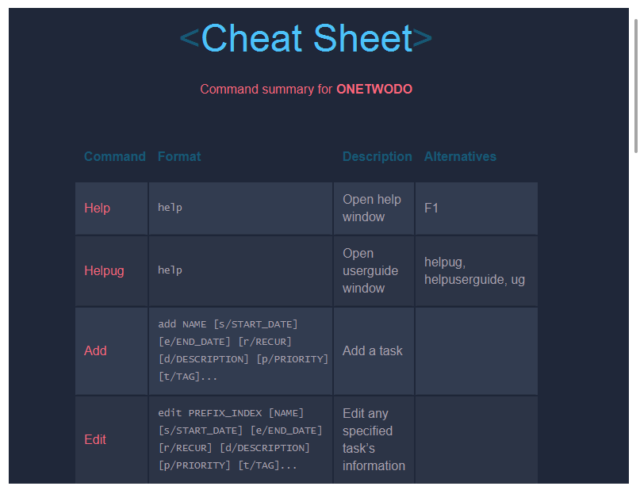
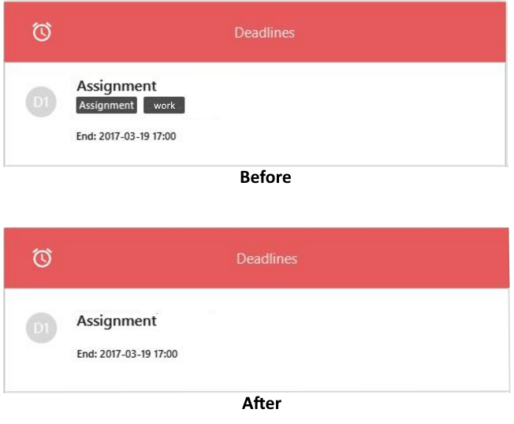
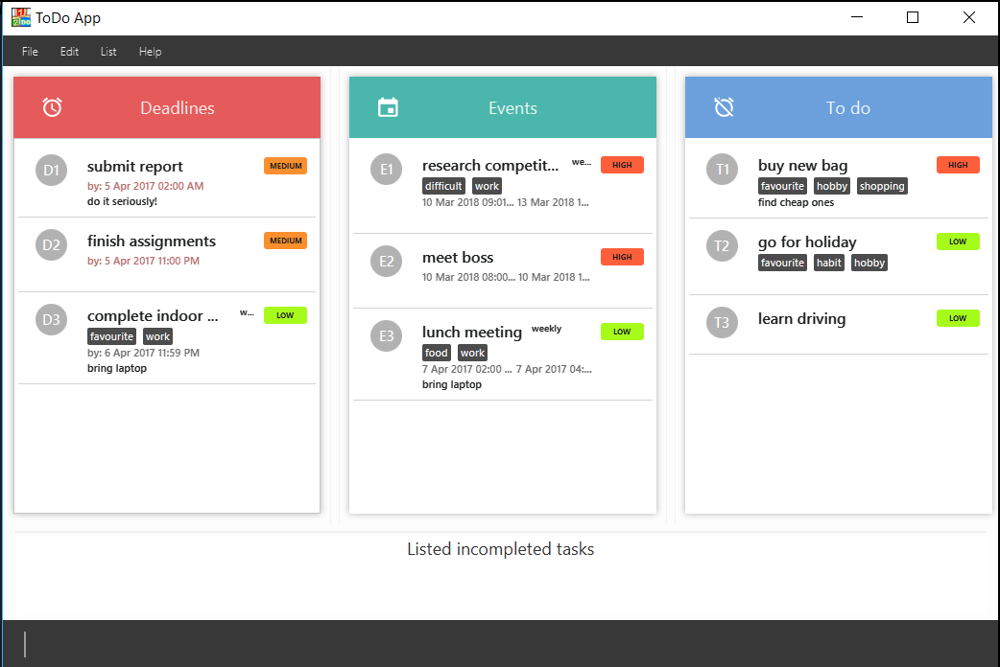

# User Guide

- [About](#about)
- [Getting Started](#getting-started)
- [Features](#features)
- [Command Format](#command-format)
- [Commands](#commands)
- [Cheat Sheet](#cheat-sheet)
- [FAQ](#faq)

## About

Having trouble keeping track of the tasks you need to do? Looking for a simple yet effective task manager to help you organise your day? OneTwoDo is what you need!

OneTwoDo helps you to manage your events, deadlines, and other to-do's so that you will not forget about your important tasks.

OneTwoDo has a simple and clean interface, so that with one glance you can have a clear idea of your tasks ahead.

OneTwoDo is specially designed to be keyboard-friendly. By simply typing commands in one line of text, OneTwoDo will faithfully execute your wish. You do not need to worry about clicking multiple buttons or links.

OneTwoDo is also extremely flexible. It is smart enough to understand various command formats and shortcuts.

Get started with OneTwoDo today!

## Getting Started

Before using OneTwoDo, please ensure that you have installed **Java version 1.8.0_60** or later as the application does not work with earlier Java 8 versions.

Start your OneTwoDo journey by downloading the latest **OneTwoDo.jar** from the releases tab. Download OneTwoDo directly into the home folder you want to use for the app.

You can start OneTwoDo by simply double-clicking the icon!
   > 

*Figure 1: OneTwoDo User Interface*

Congratulations, you are all set up!

## Features

*Figure 2: OneTwoDo main window*

After you have started OneTwoDo, you will see the following:

1. **Command box**
    - Enter a command into this box and press enter to execute the command.
2. **Result summary and tips**
    - A summary of the results of the executed command is shown to the user to give feedback about the effects of the command.
3. **Task panels**
    - Each panel displays your tasks depending on the category they belong to. 
    - Other commands also allow you to retreive the tasks to be shown here (e.g. `list` or `find` command. Please refer to the command format below).

Your tasks are separated into 3 categories, where each category is displayed in a task panel:

1. `Deadline` - This panel displays tasks with have an end date but no start date.
2. `Event` - This panel displays tasks with a start and end date.
3. `To-do` - This panel displays tasks without a start or end date.

## Command Format
    
- Command words are the first word of the command. (e.g. `find`, or `help`).
- Command options specifies additional information needed by the command.
    - It consists of a character followed by a forward slash (e.g. `s/`, `t/`, etc), followed by data to be specified after the forward slash if there are any. (e.g. `s/tomorrow 0900`). 
    - The order of options is not fixed after the task name. (e.g. executing `add Go home p/high d/after class` is the same as executing `add Go home d/after class p/high`).
    - Options surrounded by square brackets `[ ]` are optional.
    - Options with ellipses `...` after them can be specified multiple times (e.g. `t/Schoolwork t/CS2103`).
    - Options with `|` the pipe symbol means that either option on the left or right should be used.

- Command parameters are `UPPER_CASE` words representing required data for a command word or its options. Some common examples include:
    - `NAME`
        * The name of the task.
    - `PREFIX_INDEX`
        * The index number shown in the most recent listing.
        * Comprises of a category prefix (`e`, `d`, or `t`, represents `Event`, `Deadline` and `To-Do` categories respectively) and category index (a positive integer, e.g. `1`, `2`, `3`..).
    - `START_DATE`
        * Date and time when the task starts is entered
        * If no time is indicated, the default time is taken as 0000 hrs.
        * Must be before `END_DATE`.
        * Please refer to the Date and Time Format Specification for the list of accepted formats.
    - `END_DATE`
        * Date and time when the task ends is entered
        * If no time is indicated, the default time is taken as 2359 hrs.
        * Must be after `START_DATE`.
        * Please refer to the Date and Time Format Specification for the list of accepted formats.

### Date and Time Format Specification

OneTwoDo accepts most date and time formats, including:
* 2016/12/31
* 12/31/2016
* 2016-12-31
* Dec 31st
* 31st Dec 2016
* 31st of December
* Next Tue 3pm
* Today 0800
* Tomorrow 5:30am
* Last Wednesday 0600h
* 3 days from now

Refer to [http://natty.joestelmach.com/doc.jsp](http://natty.joestelmach.com/doc.jsp) for a full list of supported formats.
 

## Commands
### Viewing command summary : `help`

Let us assume you are a busy professional. You want to start using OneTwoDo to organize your meetings and projects more efficiently. However, being new to this application, you will definitely need some guidance. Do not worry, simply type `help` and our concised command summary window will pop up to clear your confusion.

    >>  help

*Figure 3: Command Summary Window*

---
### Viewing userguide : `help ug`

After viewing the command summary, you want to explore more special features offered by OneTwoDo. Try typing `help ug` and our informative User Guide will open up for your exploration.

    >>  help ug, help userguide

---
### Adding a task: `add`

First thing first, as a professional, you have an overwhelming number of email to reply whenever you are free. Time to add your to-do down so you will not forget!

Format: `add NAME [s/START_DATE] [e/END_DATE] [r/RECUR] [d/DESCRIPTION] [p/PRIORITY] [t/TAG]...`

    >>  add Reply Emails 

Figure 8: Add a to-do

Oh no! your boss just issue you an important task with deadline! Write it down before you forget! This time, indicate the task's deadline as well.

    >>  add Difficult Task  e/12-May-2017 10pm

Oh noes! your boss just now emailed you that there will be an important lunch meeting from 1-3pm tomorrow. Write it down. This time, indicate the duration. You can choose to input more detailed information related to any task as well.

    >>  add Lunch Meeting  s/tmr 1pm  e/tmr 3pm

    >>  add Lunch Meeting  s/tmr 1pm  e/tmr 3pm  r/weekly  d/bring laptop  p/high  t/work

*Figure 4: Add event task with detailed info*

> - `s/`
>   * The starting date / time.
> - `e/`
>   * The ending date / time.
> - `r/`
>   * The recurring period of the task. It can be *daily*, *weekly*, *monthly* or *yearly*.
> - `d/`
>   * The description of the task.
> - `p/`
>   * The priority level of the task. It can be *high* (h), *medium* (m) or *low* (l).
> - `t/`
>   * The task's tag. Every task can have any number of tags.

---
### Editing a task : `edit`

Your boss has just annouced a postpone of tomorrow's meeting to 2-4pm. Simply use the `edit` command to update your task!

Format: `edit PREFIX_INDEX [NAME] [s/START_DATE] [e/END_DATE] [r/RECUR] [d/DESCRIPTION] [p/PRIORITY] [t/TAG]...`

    >>  edit  e1  s/tmr 2pm  e/tmr 4pm

The command above will edit your task at the specified PREFIX_INDEX. Our `edit` command allows you to edit any field of your task easily.

As for editing tags, all existing tags of the task will be replaced. (i.e adding of tags is not cumulative). You can remove all the task’s tags by typing t/ without specifying any tags after it.

    >>  edit  e1  t/

*Figure 5: Before and after tags removal*

---
### Listing tasks : `list`

Don't like the way your tasks are displayed? Well, you have come to the right session. This command allows you to view your tasks in a particular way. It can sort. It can filter. It can surprise you and help you to make better decisions. 

Format: `list [DONE_STATUS] [s/START_DATE] [e/END_DATE] [o/ORDER] [p/PRIORITY] [t/TAG]...`

  
    >>  list  s/today  e/next week

The above command will filter out all the things you need to do from today till next week. Pretty convinent right? However, you might also want compare which tasks are more crucial and hence needs to be completed earlier. This is where the sorting comes in handy.

    >>  list  o/priority

*Figure 6: Sort by priority*

Also, sometimes you may be so busy that you have forgotten if you have replied an important email.
   
    >>  list  done

All your completed tasks are listed! The feeling of satisfaction after seeing all the tasks you have successfully accomplished is indescribable! But it looks like you haven't reply the email.

*Figure 7: Filter all completed tasks*

> - `o/` refers to ordering or sorting. You can sort by *priority*, *alphanumeric* and *dateTime*.
> - You can also filter and sort your tasks with multiple parameters. Only tasks that has met those parameters' requirement will appear.
>   * E.g. list  s/today  e/next week  o/dateTime  p/high  t/work

---
### Finding all tasks containing a keyword in their name or tag: `find`

You boss asks you to buy him a new bag for his birthday. Can't remember you added that task as "birthday", "shopping" or "assignment"? Simply use the find command and any tasks with matching keywords will be listed out for you.

Format: `find KEYWORD [MORE_KEYWORDS]...`

     >>  find birthday shopping assignment

>   Shows any task having names, tags, or description which contain any of the keywords: **birthday**, **shopping** and **assignment**.

*Figure 8: Find task*

---
### Selecting a task : `select`

Want to view a task's description that you have written? Use this command. It will popup a window for a task at PREFIX_INDEX.

    >>  select e2

---
### Marking a task as completed: `done`
Completed next week’s assignment today? Give yourself a pat on the back and type `done` to mark the task as completed. This command marks a task at PREFIX_INDEX as completed. 

    >>  done t1

---
### Marking a task as uncompleted: `undone`
Realised that a completed task still has something to do? Unmark that task as undone. This command marks a task at PREFIX_INDEX as uncompleted.

    >>  undone t1

---
### Undoing actions: `undo`
OOPS! Did you accidently deleted a high priority task? Keep calm and type `undo`, and that extremely important task will magically reappear on your OneTwoDo! 

    >>  undo

---
### Redoing actions: `redo`
After heaving a sigh of relief and reversing your actions using undo, you realize that extremely important task is not that important after all. Continue to keep calm and type redo, and that not-so-important task will disappear again from your OneTwoDo!

    >>  redo

---
### Saving the data: `save`

Want to change your storage location? By default, your task data is saved in a file called todolist.xml in the data folder. However, you can change the file location with this command. Input `save` and filepath. Remember to put .xml at the end of the file name. If existing storage already exist, you can add `overwrite` to replace the old file.

    >>  save myStorage.xml

    >>  save overwrite myStorage.xml

---
### Exporting the data: `export`

Want to export out your current storage? Input `export` and filepath. Remember to put .xml at the end of the file name. If existing storage already exist, you can add `overwrite` to replace the old file.

    >>  export storageName.xml

    >>` export overwrite storageName.xml

---
### Importing the data: `import`

Want to use another storage? Input `import` and filepath. Remember to put .xml at the end of the file name.

    >>  import storageName.xml

---
### Deleting a task : `delete`

Your boss last minute decided to give you an overtime. Now you cannot go home for your birthday celebration. Type `delete` to remove your celebration plan from OneTwoDo. This command removes the task at PREFIX_INDEX.

    >>  delete e2

---
### Deleting all tasks: `clear`
You have finally quit your job, but there are so many added task that needs to be deleted. No problem! Simply type `clear` and start your OneTwoDo journey again on a new note!

    >>  clear

### Exiting the program : `exit`

Are you sure you have added all your tasks to OneTwoDo already? Simply type `exit` to close the application.

    >>  exit

---
## Command Summary

| Command       | Format       | Description | Alternatives |
| :-------------|:-------------|:-----------|:-------------|
|  Help         |  `help` | Open help window |F1
|  Help ug         |  `help ug` | Open this userguide | help ug, help userguide
|  Add          |  `add NAME [s/START_DATE] [e/END_DATE] [r/RECUR] [d/DESCRIPTION] [p/PRIORITY] [t/TAG]...` | Add a task| 
|  Edit         |  `edit PREFIX_INDEX [NAME] [s/START_DATE] [e/END_DATE] [r/RECUR] [d/DESCRIPTION] [p/PRIORITY] [t/TAG]...` | Edit any specified task's information|
|  List         |  `list [DONE_STATUS] [s/START_DATE] [e/END_DATE] [o/ORDER] [p/PRIORITY] [t/TAG]...` | List specified tasks in specified order| Ctrl+Shift+D,  Ctrl+Shift+U, Ctrl+Shift+A (list *Done*, *Undone* and *All* respecively)
|  Find         |  `find KEYWORD [MORE_KEYWORDS]...` | Find tasks with keywords|
|  Select         |  `select PREFIX_INDEX` | Select a task to view|
|  Done         |  `done PREFIX_INDEX` | Archive the specified task|
|  Undone       |  `undone PREFIX_INDEX` | Unarchive the specified task|
|  Undo         |  `undo`  | Undo previous action| Ctrl+U
|  Redo         |  `redo` | Redo previous action| Ctrl+R
|  Save         |  `save [overwrite] FILE_PATH` | Save file to specified location|
|  Export         |  `export [overwrite] FILE_PATH` | Export file to specified location|
|  Import         |  `import FILE_PATH` | Import file to be used|
|  Delete       |  `delete PREFIX_INDEX` | Delete specified task |
|  Clear        |  `clear` | Clear all data in OneTwoDo|
|  Exit         |  `exit`  | Quit the program| Ctrl+E

---
## FAQ

**Q**: How do I transfer my data to another computer?  
**A**: Use the `export` command to export out the storage. Transfer the storage file via any means (thumb drive, email, etc) and use the `import` command on another computer to import the storage.
 
 

**Q**: What type of date and time format can I use?  
**A**: OneTowDo support a variety of formats. You can checkout some of the more common formats above. For complete list of format, checkout the Natty website: http://natty.joestelmach.com/doc.jsp.
 
 

**Q**: How do save my OneTwoDo data?  
**A**: We will save your data automatically every time you input.
 
 

**Q**: What is the different between `find` and `list` command?  
**A**: The `find` command helps you to look for a particular task. The `list` command helps you to view the task manager in a particular way.
 
 

**Q**: Which commands can be undo?  
**A**: You can only undo the commands that will modify the contents of your to do list. The 6 commands that you can undo are: `add`, `delete`, `edit`, `clear`, `done`, and `undone`.
 
 

**Q**: What is the different between `done` and `delete` command?  
**A**: The command `delete` will remove the selected task from the storage. The command `done` will archive the selected task into the done section. In this way, you can still keep track of the task that has been done.
