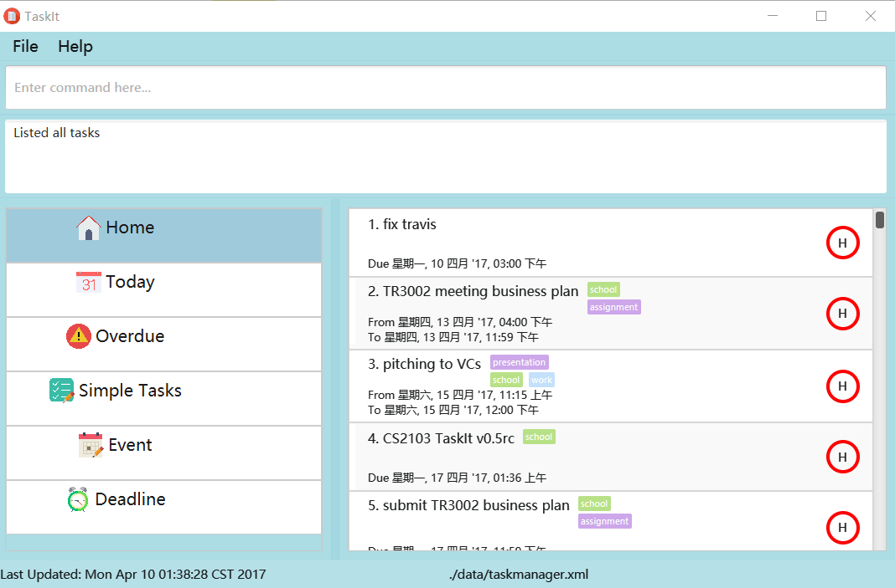
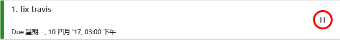

# TaskIt - User Guide

By : `Team T15-B4`  &nbsp;&nbsp;&nbsp;&nbsp; Since: `February 2017`  &nbsp;&nbsp;&nbsp;&nbsp; Licence: `MIT`

---

1. [Quick Start](#1-quick-start)
2. [User Interface](#2-user-interface)
3. [Features](#3-features)
4. [FAQ](#4-faq)
5. [Command Summary](#5-command-summary)

## 1. Quick Start

0. Ensure you have Java version `1.8.0_60` or later installed in your Computer. 

   > Having any Java 8 version is not enough.  
   > This app will not work with earlier versions of Java 8.

1. Download the latest `TaskIt.jar` from the [releases](../../../releases) tab.
2. Copy the file to the folder you want to use as the home folder for your Task Manager.
3. Double-click the file to start the app. The GUI should appear in a few seconds. Refer to [User Interface](#2-user-interface) section for a more detailed explanations of various UI components. 
   > 

4. Type the command in the command box and press <kbd>Enter</kbd> to execute it.  
   e.g. typing **`help`** and pressing <kbd>Enter</kbd> will open the help window.
5. Some example commands you can try:
   * **`list`**` all`: lists all tasks
   * **`add`**` do SWE project tag school tag CS` :
     adds a task titled `do SWE project` to the TaskIt.
   * **`delete`**` 3` : deletes the 3rd task shown in the current list
   * **`exit`** : exits the app
6. Refer to the [Features](#3-features) section below for details of each command. 

<!-- @@author A0141872E -->
## 2. User Interface

#### Menu Bar : update the task list to display all relevant tasks based on the selection for fast search  
Home will display all tasks inside, other buttons will only display incompleted tasks with the specified type.
For example, click on overdue, only incompleted tasks which are overdued will be displayed: 

 

#### Task Card : display all details about a task and the date will shown in different languages based on system languages  
An incompleted task card is shown with a white color bar:
 
 
A completed task card is shown with a green color bar:
 
 
A overdued task card is shown with a red color bar: 
 
 
There are three priorities associated with task: low, medium and high, and they are highlighted using red, orange and yellow circles at the end of the task card: 
  
 

## 3. Features

<!-- @@author A0141872E -->
> **Command Format**
>
> * Words in `UPPER_CASE` are the parameters.
> * Items in `SQUARE_BRACKETS` are optional.
> * Items with `...` after them can have multiple instances.
> * Parameters can be in any order.

### 3.1. Viewing help : `help`

Format: `help`

> Help is also shown if you enter an incorrect command e.g. `abcd`
> Help is also shown for specific command if command is entered with incorrect arguments e.g.  `delete asdf`

### 3.2. Adding a task: `add`

Add a new task to TaskIt 
Format: `add <TITLE> [tag TAG|by DATE|from DATE to DATE|priority <high|medium|low>]`

> * Title can add at the back using quote. 
> * Quotes can be used to add title with keywords.  
> * Tasks can have any number of tags (including 0) 

Examples:

* `add finish hw tag study tag school by April 5th`
* `add Interview tag work priority high`
* `add friend's party tag leisure tag friend from next Wednesday 8 pm to next Wednesday at 11pm`
* `add tag school tag assignment by 11pm "CS2103 revision"`
* `add "tag friends on facebook" priority high tag friends tag facebook` 

### 3.3. Listing all tasks: `list`

Listing all relevant tasks based on given parameters 
Format: `list <all|undone|done|today|overdue|floating|event|deadline|high|medium|low>`

> * All parameters are case insensitive. 

List all the existing tasks in TaskIt. 
Format: `list all`

List only the undone tasks in TaskIt. 
Format: `list undone`

List only the completed tasks in TaskIt. 
Format: `list done`

List only the overdued tasks in TaskIt. 
Format: `list overdue`

List all the tasks dued today in TaskIt. 
Format: `list today`

### 3.4. Editing an existing task : `edit` 

Edits an existing task in TaskIt. 
Format: `e/edit <INDEX>  <[title]|[from]|[to]|[priority]|[tag]> <NEW>`

> * Edits the task at the specified `INDEX`.
    The index refers to the index number shown in the last task listing. 
    The index **must be a positive integer** 1, 2, 3, ...
> * Existing values will be updated to the input values.
> * When new title contains keywords such as from, to, please quote the new value to avoid error.
> * Can remove start or end dates by typing `null` or `none`
> * When editing tags, the existing tags of the task will be removed i.e adding of tags is not cumulative.
> * You can remove all the task's tags by typing `null`.

Examples:

* `e/edit 2 title finish SWE HW` 
  Edit the second task title to finish SWE HW.

* `e/edit 1 from null` 
  Remove the first task start time.

* `e/edit 2 title attend meeting from Apr 7 at 2pm to 4pm priority high` 
  Edit the second task title to attend meeting, start time to Apr 7th 2pm, end time to 4pm and prioirty to high.

* `e/edit 5 title "today top priority is to do homework"` 
  Edit the fifth task title to today top priority is to do homework.
  
* `e/edit 1 tag null` 
  Remove all the tags of first task.

### 3.5. Marks a task as done or undone: `mark` 

Mark an existing task as done or undone based on a given valid index. 
Format: `m/mark <INDEX> <undone|done>`

> * The undone|done parameters are case insensitive. 
> * Marks the task at the specified `INDEX`. 
> * The index refers to the index number shown in the most recent listing. 
> * The index **must be a positive integer** 1, 2, 3, ...

Examples:

* `list all` 
  `mark 2 done` 
  Marks the 2nd task in the task manager as done.
  
* `find do HW`  
  `mark 1 undone` 
  Marks the 1st task in the results of the `find` command as undone.

### 3.6. Searching all tasks based on keywords or date: `find`

Finds tasks which matched name/deadline/tag. 
Format: ` find <[NAME]|[DATE]|[TAG]>`

> * The search is case insensitive. e.g `do HW` will match `do hw`
> * The order of the keywords does not matter. e.g. `HW do` will match `do HW`
> * Substrings will be matched e.g. `HW` will match `HWs`
> * Tasks matching at least one keyword will be returned (i.e. `OR` search).
    e.g. `HW` will match `do HW`
> * For exact match, name/deadline/tag should be inside a quote	

Examples:

* `find do HW` 
  Returns tasks with 'do' or 'HW' or both
* `find monday` 
  Returns tasks with dates on monday
* `find "home"` 
  Returns tasks with title|deadline/tag being home

### 3.7. Deleting a task : `delete`

Deletes the specified task from the TaskIt.
Format: `delete INDEX`

> * Deletes the task at the specified `INDEX`.  
> * The index refers to the index number shown in the most recent listing. 
> * The index **must be a positive integer** 1, 2, 3, ...

Examples:

* `list all` 
  `delete 2` 
  Deletes the 2nd task in the task manager.
* `find do HW` 
  `delete 1` 
  Deletes the 1st task in the results of the `find` command.

### 3.8. Select a task : `select`

Selects the task identified by the index number used in the last task listing. 
Format: `select INDEX`

> * Selects the task at the specified `INDEX`. 
> * The index refers to the index number shown in the most recent listing. 
> * The index **must be a positive integer** 1, 2, 3, ...

Examples:

* `list all` 
  `select 2` 
  Selects the 2nd task in the task manager.
* `find do HW`  
  `select 1` 
  Selects the 1st task in the results of the `find` command.

### 3.9. Clearing all entries : `clear`

Clears all entries from the task manager. 
Format: `clear`

<!-- @@author A0141011J -->
### 3.10. Undo previous action: `undo`

Undo the prevous actions. 
Format: `undo`

### 3.11. Redo previous undo: `redo`

Redo the prevous undone action. 
Redo can only work after a successful undo command 
Format: `redo`

### 3.12. Saving data: `save`

Puts all TaskIt data to the file in the specified path.
Format: `save FILEPATH`

Example:

* `save myFolder/myFile.xml` 

### 3.13. Change storage file path: `path`

Change the storage folder to the specified folder.
Format: `path FILEPATH`

Example:
* `path myFolder` 
### 3.14. Exiting the program : `exit`

Exits the program. 
Format: `exit`

<!-- @@author A0141872E -->
## 4. FAQ

**Q**: How do I transfer my data to another Computer? 
**A**: Install the app in the other computer and overwrite the empty data file it creates with
       the file that contains the data of your previous TaskIt folder.

## 5. Command Summary

* **Add**  `add <TITLE> [tag TAG|by DATE|from DATE to DATE|priority <high|medium|low>]`  
  e.g. `add Lunch with Bob tag friend priority low tag leisure` 
  e.g. `add friend's party tag leisure tag friend from next Wednesday 8 pm to next Wednesday at 11pm` 
  e.g. `add tag school tag assignment by 11pm "CS2103 revision"` 

* **Clear** : `clear`

* **Delete** : `delete INDEX`  
   e.g. `delete 3`

* **Edit**  `edit <INDEX>  <[title]|[start]|[end]|[priority]|[tag]> <NEW>`  
  e.g. `edit 1 title Movie` 
  e.g. `edit 2 from this Friday 3 pm` 
  e.g. `edit 2 end none` 
  e.g. `edit 2 end null` 
  e.g. `edit 1 tag School` 
  e.g. `edit 1 tag null` 
  e.g. `edit 1 title "today"` 

* **Find** : `find KEYWORD [MORE_KEYWORDS]`  
  e.g. `find do HW SWE`

* **List** : `list`  
  e.g. `list all` 
  e.g. `list done|undone` 
  e.g. `list low|medium|high` 
  e.g. `list overdue` 
  e.g. `list today` 
  e.g. `list floating|event|deadline` 

* **Mark** : `mark`  
  e.g. `mark 1 undone`
  e.g. `mark 3 done`

* **Undo** : `undo`  
  
* **Redo** : `redo`  

* **Help** : `help`  

* **Select** : `select INDEX`  
  e.g.`select 2`
  
* **Save** : `save FILEPATH`  
  e.g.`save taskIt.xml`
  
* **Path** : `path FILEPATH`  
  e.g.`path newFolder`

