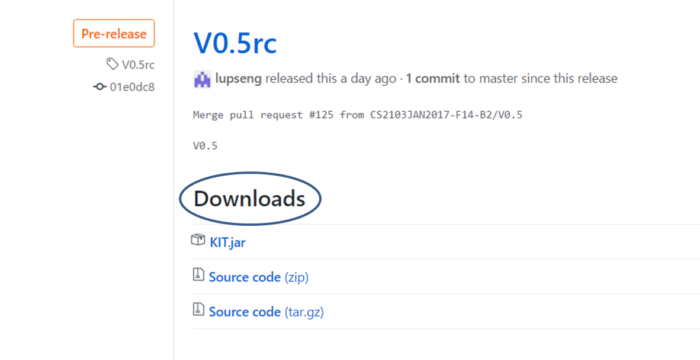
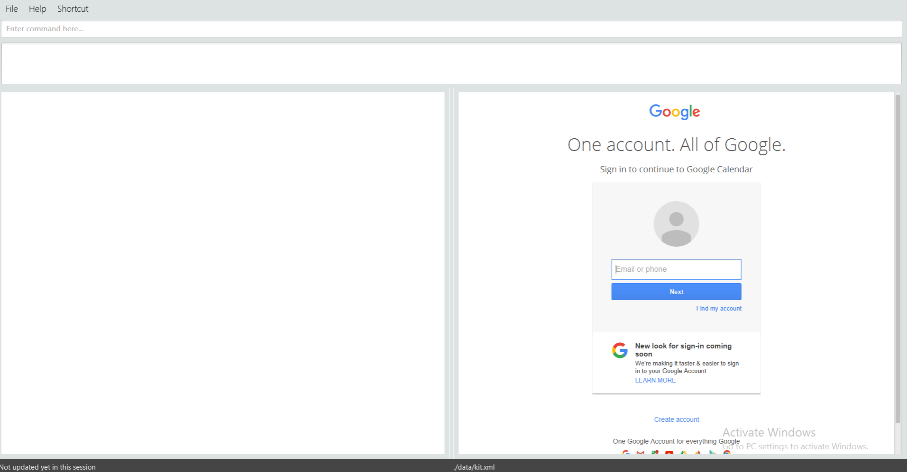

# KIT User Guide:

1. [What is KIT about?](#1-what-is-kit-about)
2. [Quick Start](#2-quick-start)
    * [Downloading KIT](#downloading-kit)
    * [Starting KIT](#starting-kit)
    * [Typing commands](#typing-commands)
3. [Features](#3-features)
    * [Viewing help](#311-viewing-help--help)
    * [Adding a task](#321-adding-a-task-add)
    * [Listing tasks](#331listing-of-task-list)
    * [Marking a task as done](#34-marking-a-task-as-done-done)
    * [Marking a task as undone](#35-marking-a-task-as-undone-undone)
    * [Deleting a task](#36-deleting-a-task-delete)
    * [Undoing/Redoing a command](#371-undo-undo)
    * [Editing a task](#38-editing-a-task-edit)
    * [Finding a task](#391-finding-a-taskfind)
    * [Using Google Calendar](#310-google-calendar)
    * [Clearing KIT](#311-clearing-all-task-clear)
    * [Exiting KIT](#312-exiting-the-program-exit)
    * [Saving Data](#3132-saving-the-data)
    * [Loading Date](#314-loading-your-own-data)
    * [Changing theme](#315-changing-the-appearance-of-kit)
4. [FAQ](#4-faq)
5. [Command Summary](#5-command-summary)

## 1. What is KIT about?

Welcome! We believe that like us, you have many tasks and just too little time to manage them, sort them, filter them or just keep them in order. Is there a solution? Yes!

It's Keep It Tidy.

Or KIT.

KIT is a desktop app that helps users manage their tasks and it is the one and only taskmanager you will ever need. With a simplistic design of UI and powerful functionalies embedded, KIT is capable of executing your instructions swiftly. On top of that, KIT is keyboard friendly, thereby saving you the trouble of moving the mouse and clicking.

Now, let's get you started!
## 2. Quick start
### Downloading KIT
1. Ensure you have Java version `1.8.0_60` or later installed in your Computer. 

   > Having any Java 8 version is not enough.  
   > This app will not work with earlier versions of Java 8

2. Download the latest `KIT.jar` from [here](../../../releases). 
    > 
3. Copy the file to the folder you want to use as the home folder for KIT.

### Starting KIT
4. Double-click the file to start the app. The GUI should appear in a few seconds.
   > 

5. (Optional) You can choose to login to your Google Calendar, click [here](#310-google-calendar) to follow the detailed instructions.

    After you have logged in, it looks something like this.
     > 
    ##### Or you can explore KIT without using Google Calendar at all, just read on!

#### Looks a little empty, no? Let's try adding some tasks!

### Typing commands
6. Type the command in the command box and press <kbd>Enter</kbd> to execute it.  
   e.g. typing **`help`** and pressing <kbd>Enter</kbd> will open the help window.
7. Some example commands you can try:
   * **`list`** : lists all task
       *  > 
       *  > 
   * **`add`**`  do 2103 project r/waiting for john's reply s/03-03-2017 l/nus soc t/school` : adds a task named `do 2103 project` to KIT.
       * > 
       * > 
   * **`delete`**` 1` : deletes the task with index 1 shown in the current list
       * > 
       * > 
   * **`exit`** : exits the app
       *  > 

8. Refer to the [Features](#features) section below for details of each command. 

## 3. Features

> **Command Format**
>
> * Words in `UPPER_CASE` are the parameters.
> * Items in `[SQUARE_BRACKETS]` are optional.
> * Items with `...` after them can have multiple instances.
> * Parameters can be in any order.

### 3.1.1 Viewing help : `help`

If you are not sure where to start, take a sneakpeek at the help sheet!

Format: `help [COMMANDNAME]`, `h [COMMANDNAME]`, `man [COMMANDNAME]`, `manual [COMMANDNAME]`

> * If COMMANDNAME is entered, displays the help message for that specific command
> * If COMMANDNAME is not entered, displays user guide in a new window.
> * Tips: You can also bring up the help window by pressing F1.

Example:

* `man add`
> 
KIT will display the following message:
>add: Adds a task to the task manager. Parameters: NAME s/START e/END r/REMARK l/LOCATION  [t/TAG]...
>Example: add John owes money s/02-03-2017 e/03-03-2017 r/john owes me $100 l/john's house t/friends t/owesMoney

### 3.1.2 Viewing quick overview of command formats : `helpf`

Format: `helpformat`, `helpf`, `summary`, `hf`

> * Helpf shows a quick summary of command formats.
> * Tips: You can also bring up the help window by pressing F3.

### 3.2.1 Adding a task: `add`

#### Now you are ready to start exploring KIT. Try adding a task!

Adds a task to KIT. New tasks are `not done` by default.  

Format: `add NAME [r/REMARKS] [s/STARTDATE] [e/ENDDATE] [l/LOCATION] [t/TAG]...`

> * If you need to type the character /, put a \ before it to avoid t/ getting recognized as tag. eg. carrot\/cabbage  
> * Tasks can contain any number of tags (including 0).

Here are some examples:

* `add do 2103 project r/waiting for john’s reply e/next tuesday l/nus soc t/school`
* `add buy presents s/two week before christmas e/christmas eve l/town t/shopping`
* `add buy groceries r/cabbage and broccoli s/this weekend t/personal`
* `add feed the cat\/dog t/personal t/family e/tomorrow 8am`

    > 

#### Supported Date/Time formats:

KIT has an intelligent processer that interprets your phrases and sentences about date, deadline and time.

Here is a table of interpretation for your convenience.
| Date Format | Example |KIT's interpretation  |
|-------------------|----------|------------------|
|Month/day           | 10/19         | Oct 19 of the curent year |
|Day Month  | 6 Apr         | Apr 6 of the current year|
|Month Day  | Apr 6         | Apr 6 of the current year  |
|Day of the Week| Mon, Monday| The upcoming Monday |
|Relative date| Yesterday, today, tomorrow, two weeks from now         | Corresponding dates relative to today
|Holidays | New Year, Christmas| The dates of the holiday of the current year|

> * If you are adding a date of the current year, you can leave out the year because dates without specified year are assumed to be **the current year**. *See the first 3 entries of the  Date Format Table*
> * HH:mm in 24 hour format or hh:mm am/pm.
> * Times without am/pm are assumed to be in 24 hour format.
> * You may include either both date and time seperated with a space or just either one or even none at all.

### 3.2.2 Adding a task with smart add: `smartadd`

Smart add is similiar to add in the sense that they both adds a new task. However, smart add is more flexible and allows you to add a task's location and date details without using the prefixes. <strong>Note: This command requires the internet to work.</strong>

Description: Flexibly adds a task without specifying prefixes.

Format: sa DESCRIPTION [r/REMARK] [t/TAG]...

> * DESCRIPTION is where you can specify the task name, location and date details.

Example:

* `sa meet friends for dinner in clementi at 6pm t/friends`
* `sa project meeting at 2pm`
* `sa design poster with team in meeting room r/share my new ideas with team`

> 

Some tips for using the Smart Add command:

* If you enter a time but no date, the closest date in the future will be used. If the time is later today, the date will be today. If the time have passed for today, the date will be tomorrow.
* If no start or end time is entered, an all day event will be created.
* If no end time is entered, the event is assumed to be one hour long.
* You can specify start and end time using time ranges or time intervals. These two commands are equivalent:
    * `sa watch movie 3pm for 2 hours`
    * `sa watch movie 3pm-5pm`

<strong>Note: KIT will give the best interpretation for the given description, however this may not always be accurate, especially for ambiguous descriptions.</strong>

For example, `sa Meeting at Wednesday Cafe`.

In this case, either Wednesday Cafe is the actual location and the date is not specified. Or, it could also be interpreted as meeting on wednesday at cafe.

In such cases, we recommend users to use the add command where you can specify clearly the location, date and etc.

### 3.3.1	Listing of task: `list`

If you wish to see your tasks according to certain criteria, you can use the flexible list command.

Description: Shows a list of tasks in KIT depending on chosen criterion.  

Format: `list [criterion]`, `ls [criterion]`, `l [criterion]`

#### Available Criteria

`done` : display the list of all tasks that are done.
`notdone` or `undone` : display the list of all tasks that are not done.
`floating` or `float` : display the list of all tasks that have no start or end dates.

If no criterion is specified, all tasks will be shown.

Examples:
* `ls`
* `list done`
* `l notdone`
* `ls float`

### 3.3.2	Listing of all task under a tag: `list tag`

#### We shouldn't mix personal life with work, KIT understands that.

If you want to see all tasks with a particular tag only, say `work`, you can use the `list tag` function.

Description: Shows a list of task by the specified tag.  

Format: `list tag TAGNAME`, `ls tag TAGNAME`, `l tag TAGNAME`

### 3.4	Marking a task as done: `done`

#### Congratulations on completing your first task!
Now that you have completed a task, you can mark it as done by using the `done` function.

Description: Marks the task at the specified `INDEX` as "Done".  

Format: `done INDEX`, `d INDEX`

> * The index refers to the index number shown in the listing.
> * The index **must be a positive integer** 1, 2, 3, ...

> 
> 

>Tip : You can use the `list done` or `list` command to see the tasks you have marked as done. Those with green names and a tick are the done tasks.
### 3.5	Marking a task as undone: `undone`

#### More follow ups for your task? Need to resume a completed task?

You can easily mark it as "Not Done" again.

Description: Marks the task at the specified `INDEX` as "Not Done".  

Format: `undone INDEX`, `notdone INDEX`, `ud INDEX`, `nd INDEX`

> * The index refers to the index number shown in the listing.
> * The index **must be a positive integer** 1, 2, 3, ...

### 3.6	Deleting a task: `delete`
#### Don't want the old tasks to take up all the space?

If you would like to remove a task from KIT, simply use the `delete` function.

Description: Deletes the specified task from KIT. 

Format: `delete INDEX`

> * Deletes the task at the specified `INDEX`.
> * The index refers to the index number shown in the listing.
> * The index **must be a positive integer** 1, 2, 3, ...

Examples:

* `delete 2` 
  Deletes the 2nd task of the current listing in KIT.

### 3.7.1	Undo: `undo`

#### Made a mistake? No worries.

You can retract it by using the `undo` command.

Description: Undo the last command. 

Format: `undo`, `uhoh`

> * Able to undo up to 10 times.

### 3.7.2	Redo: `redo`

#### Along with undo comes redo.

Just in case you changed your mind, you can also retract your `undo` by using the `redo` command.

Description: Redo the last undo.  

Format: `redo`

> * Able to redo up to 10 times.
> * If you make any new commands right after you undo, you will not be able to do any more redo.
> * Work similarly to the page back and page forward button in your browser.

### 3.8 Editing a task: `edit`

#### Schedules change all the time, and in KIT you can, too.

The `edit` command allows you to edit the details of a task.

Description: Edits an existing task in KIT.  

Format: `edit INDEX [NAME] [r/REMARKS] [s/STARTDATE] [e/ENDDATE] [l/LOCATION] [t/TAG]...`

> * At least one of the optional fields must be provided.
> * Existing values will be updated to the input values.
> * When editing tags, the existing tags of the task will be removed i.e adding of tags is not cumulative.
> * You can remove all the task’s tags by typing `t/` without specifying any tags after it.

Examples:

* `edit 1 r/doing edit command l/home` 
  Edits the remark and location of the 1st task to be `finish up user guide` and `home` respectively.
  >  
  >  

### 3.9.1 Finding a task:`find`

#### Finding a task in a stack of tasks can be troublesome.
KIT has an efficient `find` command that can help. Use it along with any keyword or date you can recall that is related to that task.

Description: Finds task whose names or remark contain **every one** of the given keywords. **Note** : If **both** keywords and date are given, KIT will find tasks that match **both** the keywords and the date.  

Format: `find KEYWORD [MORE_KEYWORDS]`, `f KEYWORD [MORE_KEYWORDS]`

> * The search is case insensitive. e.g `project` will match `Project`
> * The order of the keywords does not matter. e.g. `do project` will match `project do`
> * All fields of the task are searched, ie name, remark and etc, basically every detail of the task is being searched.
> * Substrings will be matched. e.g. `project` will match `projects`
> * Task matching **every** keyword will be found.
    e.g. keywords of`biology project` will match the task of `do biology project` and not the task of `do physics project`.

Examples:

* `find homework` 
  Finds `do homework`

* `find poster Apr 6` 
  Finds any task that contains `poster` and the date of `Apr 6 2017`(the current year).
 >  
### 3.9.2 Finding with exact keyword(s):`findexact`

#### What if you want to search for something more specific?

`findexact` allows you to do that.

Description: Finds task that contains words that are **full matches** of all the keyword(s).  

Format: `findexact KEYWORD...`, `fexact KEYWORD...`, `finde KEYWORD...`, `fe KEYWORD...`

> * The search is the similar to `find` except it **does not** search for substring matches and **does not** search for dates.
e.g `do project` will match `do School project` but not `do School projects`

### 3.10 Google Calendar.

#### Google Calendar is popular, and KIT knows.

Google Calendar operations are supported in KIT.

To use Google Calendar with KIT, we first require your permission to read and add event to your Google Calendar. <strong>Note: Google Calendar related commands requires the internet to work.</strong>

> * The request will automatically open in your default browser permission is requested.
> * Log in to your Google account and approve the request to use this feature.
> * You only need to do this for the first time.

### 3.10.1 Import events from Google Calendar: `gg`

#### Do you have to copy-paste your events in Google Calendar? Of course not!

You can import your google calendar with the `getgoogle` command.

Description: Add your <strong>upcoming</strong> Events from your Google Calendar to KIT.  

Format: `getgoogle`, `gg`
 >  
 >  

> * This command will only grab upcoming Events and ignore duplicate Events.

### 3.10.2 Post Task to Google Calendar: `pg`

#### Similarly, you can keep KIT synchronized with Google Calendar.

With `postgoogle`, you are able to add a task from KIT as an Event to your Google Calendar.

Description: Add the specified task to your Google Calendar.  

Format: `postgoogle [INDEX]`, `pg [INDEX]`

> * If INDEX is specified and correct, adds the selected task to calendar.
> * If INDEX is not specified, adds **all** displayed tasks to calendar.
> * This will not add any duplicate tasks to your google calendar.
> * You can also use this command to update a task you have posted to your calendar before.
> * **Note**: Because of the task specifications (each task needs both the start date and end date) from Google Calendar, only tasks with start and end dates will be added to your google calendar.

### 3.11 Clearing all task: `clear`

#### Need a clean slate to start over?
Just use `clear`.

Description: Clears all entries from KIT.  

Format: `clear`, `clr`

### 3.12 Exiting the program: `exit`

#### Completed your work already, exit KIT to have a break!
Description: Exits the program.  

Format: `exit`

### 3.13.1 Specifying save location: `save`

#### Want a little secrecy? You can always custom the saving location of the file.

You can do so using the `save` function.

Description: Specify location of save file.  

Format: `save PATHNAME`

### 3.13.2 Saving the data

#### KIT saves your data automatically and saves you some trouble.

In KIT, you data are saved automatically after a change has been made. There is no need to save manually.

### 3.14 Loading your own data

#### Transferring you data? KIT's got you covered.
`load` function can load your date from a specified location.

Description: Loads a file from the specified location.

Format: `load PATHNAME`

### 3.15 Changing the appearance of KIT

#### You want to have a bit more colors, absolutely!
`changetheme` allows you to change the colors and appearances of KIT.

Description: Changes the theme of KIT to the required theme.

Format: `changetheme [THEMENAME]`
 >  
 >  

> * After each successful `changetheme` command, you will have to restart KIT to view the changes.
> * If THEMENAME is specified and correct, KIT will change its theme and after restart you will see the changed theme.
> * KIT currently supports three themes: Default, Light and Dark.

## 4. FAQ

**Q**: Does KIT support Windows 10?  
**A**: Yes! KIT works as long as you have Java version `1.8.0_60` or later.

**Q**: Will my tasks be saved after I close the application?   
**A**: Yes. Your data is saved after every command, you can safely exit KIT when you are done.

**Q**: Can I have two task with the same name?   
**A**: Sure, tasks with same names are allowed, as long as at least one of their fields is different. That being said, tasks with completely same details are not allowed. Completely same details refer to same name, location, start date, end date and remark.

**Q**: I accidentally created two exact same tasks, how do I remove just one of them?   
**A**: If you just added the task,meaning the most recent command is the add command, you can do so by typing undo. Otherwise, you can use [find](#391-finding-a-taskfind) or [list](#331-listing-of-task-list) to search for the duplicate tasks and [delete](#36-deleting-a-task-delete) one of them. The other task will remain in KIT. Instructions on these commands can be found in the respective section of the commands.

**Q**: Can I manually edit the storage file?   
**A**: Yes, you can. It is a xml file called kit.xml. It can be found under data\kit.xml by default. Be careful in making changes to it if you are unfamiliar with XML, the program might not start properly if the file’s format is invalid.

**Q**: I use two computers. Can I transfer my data between the two computers?  
**A**: Yes, you can! Your data are saved in a file called kit.xml. Just copy this file to your computer and place in under data\kit.xml. You can change the file location later using the [save](#3132-saving-the-data) command.

**Q**: It’s troublesome to constantly transfer my data between two computers, is there any way for it to synchronize automatically?   
**A**: Sorry, we currently do not support automatical synchronization. However, if you are using Dropbox, you can specify folders that will automatically synchronize through Dropbox. This means that you can use the [save](#3132-saving-the-data) command to specify your save location in your Dropbox folder and thus get synchronization.

## 5. Command Summary

