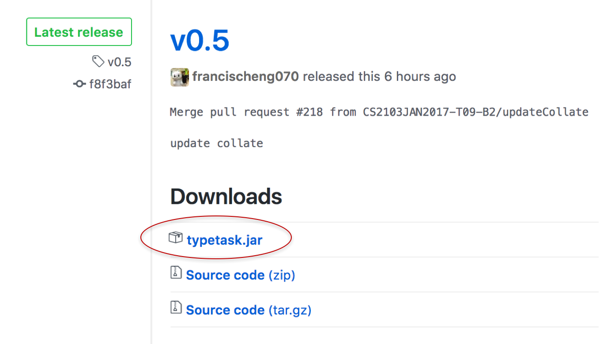

# User Guide
&nbsp;

## Table of contents

1. [Introduction](https://github.com/CS2103JAN2017-T09-B2/main/blob/master/docs/UserGuide.md#1-introduction) <br>
2. [Quick Start](https://github.com/CS2103JAN2017-T09-B2/main/blob/master/docs/UserGuide.md#2-quick-start) <br>
   2.1.  [Download](https://github.com/CS2103JAN2017-T09-B2/main/blob/master/docs/UserGuide.md#21-download) <br>
   2.2.  [Visual Introduction](https://github.com/CS2103JAN2017-T09-B2/main/blob/master/docs/UserGuide.md#22-visual-introduction)  <br>
3. [Features](https://github.com/CS2103JAN2017-T09-B2/main/blob/master/docs/UserGuide.md#3-features) <br>
   3.1.  [Viewing Help](https://github.com/CS2103JAN2017-T09-B2/main/blob/master/docs/UserGuide.md#31-viewing-help--help) <br>
   3.2.  [Adding a Task](https://github.com/CS2103JAN2017-T09-B2/main/blob/master/docs/UserGuide.md#32-adding-a-task-add-a-)  <br>
   3.3.  [Finding a Task](https://github.com/CS2103JAN2017-T09-B2/main/blob/master/docs/UserGuide.md#33-finding-a-task-find-f-search)<br>
   3.4.  [Editing a Task](https://github.com/CS2103JAN2017-T09-B2/main/blob/master/docs/UserGuide.md#34-editing-a-task-edit) <br>
   3.5.  [Removing Deadline from a Task](https://github.com/CS2103JAN2017-T09-B2/main/blob/master/docs/UserGuide.md#35-removing-deadline-from-a-task-removedeadline-rd) <br>
   3.6.  [Deleting a Task](https://github.com/CS2103JAN2017-T09-B2/main/blob/master/docs/UserGuide.md#36-deleting-a-task--delete-d--) <br>
   3.7.  [Completing a Task](https://github.com/CS2103JAN2017-T09-B2/main/blob/master/docs/UserGuide.md#37-completing-a-task--done) <br>
   3.8. [Listing Tasks](https://github.com/CS2103JAN2017-T09-B2/main/blob/master/docs/UserGuide.md#38-listing-tasks--list-listtoday-list-listdone) <br>
   3.9. [Undoing the Latest Command](https://github.com/CS2103JAN2017-T09-B2/main/blob/master/docs/UserGuide.md#39-undoing-the-latest-command--undo-u)<br>
   3.10. [Redoing the Latest Command](https://github.com/CS2103JAN2017-T09-B2/main/blob/master/docs/UserGuide.md#310-redoing-the-latest-command--redo-r)<br>
   3.11. [Saving Data to Another Folder](https://github.com/CS2103JAN2017-T09-B2/main/blob/master/docs/UserGuide.md#311-saving-the-data-to-another-folder--save)<br>
   3.12. [Changing Default Storage Folder](https://github.com/CS2103JAN2017-T09-B2/main/blob/master/docs/UserGuide.md#312-changing-the-default-storage-folder--setting)<br>
   3.13. [Using Data from Another Folder](https://github.com/CS2103JAN2017-T09-B2/main/blob/master/docs/UserGuide.md#313-using-data-from-another-folder--use)<br>
   3.14. [Clearing all Entries](https://github.com/CS2103JAN2017-T09-B2/main/blob/master/docs/UserGuide.md#314-clearing-all-entries--clear)<br>
   3.15. [Exiting the Program](https://github.com/CS2103JAN2017-T09-B2/main/blob/master/docs/UserGuide.md#315-exiting-the-program--exit)<br>
4. [FAQ](https://github.com/CS2103JAN2017-T09-B2/main/blob/master/docs/UserGuide.md#4-faq)<br>
5. [Command Summary](https://github.com/CS2103JAN2017-T09-B2/main/blob/master/docs/UserGuide.md#5-command-summary)<br>
&nbsp;

## 1. Introduction

TypeTask is an easy-to-use task manager which lets you schedule and manage your tasks simply <br>
with a single line of command! With the efficacy of a calendar without its shortcomings, <br>
TypeTask lets you organise your to-dos with ease so you can focus on your actual tasks. <br>
TypeTask is especially good for you if you want to: <br>

> Do everything through a single line of command <br>
> Work offline <br>
> Write tasks that have deadlines or start-dates <br>

## 2. Quick Start

### 2.1. Download
1. Ensure that you have Java version [1.8.0_60](https://docs.oracle.com/javase/8/docs/technotes/guides/install/install_overview.html) or later installed in your Computer.<br>

   ```
   > Note that simply having Java 8 is not enough.
     TypeTask will not work with the earlier versions of Java 8.
   ```

2. Download the latest version of TypeTask (click on `TypeTask.jar` under the [releases](../../../releases) tab).



<h5 align="left">Fig 1. Locating typetask.jar in the Releases Tab</h5>

3. Copy the file to the folder you want to use as the home folder for your Task Manager.

4. Double-click the file to start the app. The application should appear on your screen in a few seconds.

### 2.2. Visual Introduction


<h5 align="left">Fig 2. TypeTask’s User Interface </h5>

1. **Command Box**<br>
Provides a box where user commands are entered.

2. **Result Display**<br>
Displays a message detailing the results of the most recent command and the changes that occured as a result. 
The Result Display also shows a feedback message to the user if a wrong command or parameter was entered, along with an explanation of the error if relevant.

3. **Task List Panel**<br>
Displays a list of tasks under a particular list, if specified. Otherwise, it displays all tasks that exist in TypeTask.<br>
TypeTask automatically assigns your tasks with certain colours to help you differentiate them easily. <br>
   
   `Red`: this uncompleted task’s deadline has passed! Better get on to it. <br>
   `Green`: this uncompleted task has a deadline but is not due yet. Phew! <br>
   `Exclamation Mark`: this uncompleted task was labelled as a priority. <br>
   `Black`: this task has been marked as completed.<br>
   ```
   > Note that all tasks that fall outside of these categories will appear normally.
      i.e. no additional colours.
   ```
   Type any command in the command box and press <kbd>Enter</kbd> to execute it. <br>
   e.g. typing **`help`** and pressing <kbd>Enter</kbd> will open the help window.

   Other example commands you can try:
   * **`list`** : lists all tasks
   * **`add`**` Attend Meeting by: 12 Feb 11am` :
     adds the task `Attend Meeting` to the Task Manager.
   * **`delete`**` 1` : deletes the task shown with index 1
   * **`exit`** : exits the app
&nbsp;

## 3. Features
Let us now explore the interesting features found in TypeTask!


### 3.1. Viewing Help : `help`
Having trouble navigating the application? Simply type `help` to view a summary of TypeTask’s commands.

Format:<br>
`help`<br>

### 3.2. Adding a Task: `add`, `a`, `+`
TypeTask supports 3 types of task. They are 1)floating task, 2)deadline task and 3)event task.

```
Things To Note:
> TypeTask will highlight the added task after an add command is executed.
> TypeTask will not detect duplicate task names.
> Task names should not contain symbols.
   e.g. "/", ".", ","
```

### 3.2.1. Adding a Floating Task: `add`, `a`, `+`
The first thing you would want to do is to add your first task! A floating is a task with no deadline and schedule.<br>
Let's make it simple by first adding a floating task. <br>


Format:<br>
`add <TASK NAME>`

Examples:

* `add CS2103T Meeting`
* `add Buy milk`


### 3.2.2. Adding a Deadline Task:  `add`, `a`, `+`
What if you want to submit a report by a certain date or time? You might then want to add a task with a deadline. <br>

Format:<br>
`add <TASK NAME> by:<DATE>`<br>
`add <TASK NAME> by:<TIME>`<br>
`add <TASK NAME> by:<DATE> <TIME>`<br>

```
Things To Note:
> TypeTask supports a wide range of formats for dates.
   e.g. "1/4/2001", "apr 2", "next weekend"
> TypeTask follows the USA date format (MM/DD/YYYY)
> Space must be used between words for dates.
   e.g "15 Oct", "next monday"
> Time is optional.
> Time can be in hh:mm format. 24 hours format is used.
> Time and Date must have a space in between them.
   e.g. "today 8pm", "15 Oct 11am"
```

Examples:

* `add CS2103T Meeting by: next week`
* `add Buy eggs by: 8pm`
* `add CS2103T Meeting by: next monday 11:10am`


### 3.2.3. Adding an Event Task:  `add`, `a`, `+`
You might also be interested in adding an event. Think of this as a task scheduled from and to an indicated time. <br>

Format:<br>
`add <TASK NAME> from:<DATE> to:<DATE>`<br>
`add <TASK NAME> from:<TIME> to:<TIME>`<br>
`add <TASK NAME> from:<DATE> <TIME> to:<DATE> <TIME>`<br>

```
Things To Note:
> Start Date/Time (Date/Time entered after "from:" and End Date/Time (Date/Time entered after "to:") are compulsory.
> Start Date must be before End Date.
> TypeTask supports a wide range of formats for dates.
> TypeTask follows the USA date format (MM/DD/YYYY)
> Space must be used between words for Date. 
   e.g "15 Oct", "next monday"
> Time is optional.
> Time can be in hh:mm format. 24 hours format is used.
> Time and Date must have a space in between them.
   e.g. "today 8pm", "15 Oct 11am"

```

Examples:

* `add OPEN HOUSE from: 13 Oct to: 16 Oct`
* `add watch television from: 7pm to: 9pm`
* `add Meeting from: tuesday 12:00pm to: tuesday 2:00 pm`


### 3.2.4. Adding a Priority Task/Event :  `add`, `a`, `+`
What if you have tasks that are more important than others? You can add this task with a  label to indicate that it has a high priority.

Format:<br>
`add <TASK NAME> p/<PRIORITY>`<br>
`add <TASK NAME> by:<DATE> <TIME> p/<PRIORITY>`<br>
`add <TASK NAME> from:<DATE> <TIME> to:<DATE> <TIME> p/<PRIORITY>`<br>

```
Things To Note:
> Priority is set as low by default if a task is added without
  the field “p/<PRIORITY>”.
> Priority can only be high or low.
> Priority can be applied to other types of tasks or events by
  adding this additional field: “p/<PRIORITY>”.
> Accepted words for <PRIORITY> are:
      High: High, high, h, Yes, YES, yes, y, Y
      Low: Low, low, l, No, NO, no, n, N, 
```

Examples:
* `add CS2103T Meeting p/high`
* `add Buy eggs by:next week 8pm p/h`
* `add Open House from:5 Nov 11:00am to: 6 Nov 11:00pm p/no`


### 3.3. Finding a Task: `find`, `f`, `search`
You may not want to scroll through your entire list of task just to find a certain task. Instead, you can easily do so by using the `find` command, followed by any keywords of your task.

Format:<br>
`find <KEYWORD>`<br>

```
Things To Note:
> The order of the keywords does not matter.
   e.g. 'Meeting Tutor' will match 'Tutor Meeting'
> The tasks that match at least one keyword will be returned (i.e. OR search).
   e.g. 'Meeting' will match 'Meeting Tutor'
> The keyword is not case-sensitive.
   e.g. Meeting Tutor will match meeting tutor
> If no date is specified, this function take the current day as reference.
> This function prioritises dates/time.
   e.g. "find tmr" will give a list of tasks with tomorrow's date but will not return tasks with "tmr" in their names
      > Therefore, avoid using digits to search for task names since TypeTask will return results based on time
        e.g. "find 4" will give a list of tasks due today at 0400h instead of a list of tasks with "4" in their names
> This function does not support searching by months.
> This function will return the closest day from your current time.
   e.g. "find monday" will give you a list of tasks that have this coming monday date
```

Examples:
* `find Meeting`
* `find next week`
* `find tmr`


### 3.4. Editing a Task: `edit`
Sometimes you may want to change the details of a certain task you have. No need to worry! You can modify a certain task by typing the edit command.

Format:<br>
`edit INDEX <TASK NAME> by: <DATE> <TIME> p/<PRIORITY>`<br>
`edit INDEX from:<DATE> <TIME> to:<DATE> <TIME>`<br>
`edit INDEX from:<DATE> <TIME>`<br>
`edit INDEX to:<DATE> <TIME>`<br>

```
Things To Note:
> The edit command edits the task at the specified INDEX.
  The index refers to the number shown in the last task listing.
> The optional fields are <TASK NAME>, <DATE>, <TIME>, <PRIORITY>.
> The requirement is the presence of one of the optional fields.
> The existing field(s) will be updated with the input fields.
> TypeTask follows the USA date format (MM/DD/YYYY)
```

Examples:
* `edit 1 by:2 Dec 11:00am p/low`
What it does: Edit your task deadline to 2 Dec 11am and set the priority to low

* `edit 2 CS2103T Meeting`
What it does: Edit your task name to CS2103T Meeting

* `edit 3 from: next week to: next month`
What it does: Edit your task schedule to be from next week to next month

* `edit 4 from: next week`
What it does: Edit your task schedule start date to next week

* `edit 5 to: next month`
What it does: Edit your task schedule end date to next month


### 3.5. Removing Deadline from a Task: `removedeadline`, `rd`
What happens when there is a change to your deadline/schedule and yet are still unsure of the date? You can remove the 
deadline or schedule by using the `removedeadline` command.

Format:<br>
`removedeadline <INDEX>`

```
Things To Note:
> The task at the specified INDEX will have its deadline/schedule removed.
> The index refers to the index number shown in the most recent listing.
```


### 3.6. Deleting a Task : `delete`, `d`, `-`
There are some tasks that will never be completed and are irrelevant to keep. You can delete these tasks from your list by using the `delete` command.

Format:<br>
`delete <INDEX>`<br>

```
Things To Note:
> The task at the specified INDEX will be deleted.
> The index refers to the index number shown in the most recent listing.
> Deleted tasks will not show up in TypeTask anymore. Use with caution!
```

Examples:
* `delete 1`


### 3.7. Completing a Task : `done`
Completed a task? Good! You can mark the task as done by using the `done` command. This will move the task to your `completed` list.

Format:<br>
`done <INDEX>`<br>

```
Things To Note:
> The task at the specified INDEX will be moved from the task
  list to the completed list.
> The index refers to the index number shown in the most recent listing.
```

Examples:
* `done 2`

### 3.8. Listing Tasks : `list`, `listtoday`, `list*`, `listdone`
There are different listing commands for you to use! Each listing commands shows you a different kind of task list. TypeTask has 4 kinds of lists: 1)list of all your uncompleted tasks, 2)list of today's tasks, 3)list of prioritised tasks, and 4)list of completed tasks.

```
Things To Note:
> This lists will display tasks in the order that they were added.
```

### 3.8.1. Listing all Tasks : `list`
Want to view a list of all your tasks? Use the command `list` to view all your uncompleted tasks in TypeTask. <br>

```
Things To Note:
> This is the default list TypeTask shows.
> This list will refresh itself after every command.
```

Format:<br>
`list`<br>


### 3.8.2. Listing Today Tasks : `listtoday`
Want to view a list of all your tasks due today/events ending today? Use the command `listtoday` to see all those tasks and events.<br>

Format:<br>
`listtoday`<br>


### 3.8.3. Listing Priority Tasks : `list*`
Want to focus on your urgent tasks only? You can use the command `list*` to see a list of all your important tasks.

Format:<br>
`list*`<br>


### 3.8.4. Listing Completed Tasks : `listdone`
To review all that you have done, you may want to look at all your completed tasks. You can do that by using the command `listdone` to show all of your completed tasks in TypeTask.<br>

```
Things to note:
> This list will only show you the tasks that are completed.
  Deleted Task are not included.
```

Format:<br>
`listdone`<br>


### 3.9. Undoing the Latest Command : `undo`, `u`
Entered a wrong command? Fret not! You can use the `undo` command to save the hassle of backtracking. <br>

Format:<br>
`undo`<br>

```
Things To Note:
> This will only work if there has been at least one action command* used.
   *action commands: add, edit, delete, done, clear, redo
> This command can be used multiple times.
   e.g You used 10 action commands. You can undo 10 times.
```

### 3.10. Redoing the Latest Command : `redo`, `r`
Used the `undo` command wrongly? Simply use the redo command to reverse it. <br>

Format:<br>
`redo`<br>

```
Things To Note:
> This will only work if undo command is used.
> This command can be used multiple times.
   e.g. You undo 10 times. You can redo 10 times.
```

### 3.11. Saving the Data to Another Folder : `save`
Your data will be saved to the default storage folder in the hard disk automatically after any command that changes the data; there is no need to save it manually. However, should you want to make a backup copy of the current set of data, or save it to a thumbdrive to share it with your friends, you can use the `save` command. <br>

Format:<br>
`save <FILE_PATH>`<br>

```
Things To Note:
> <FILE_PATH> must be a valid file path.
> If a file pre-exists in the indicated path, it will be overwritten!
> You can use either relative or absolute file path. (See examples)
```

Examples:

* `save C:/Desktop/myTask` (Absolute file path) <br>
* `save Data/Backup` (Relative file path) <br>


### 3.12. Changing the Default Storage Folder : `setting`
Want to set your default storage folder to another folder? Or maybe set your default storage folder to be in Google Drive / Dropbox so that you can cloud your data? You can do that by using the `setting` command to change the fold TypeTask saves into. <br>

Format:<br>
`setting <FILE_PATH>`<br>

```
Things To Note:
> <FILE_PATH> must be a valid file path.
> If a file pre-exists in the indicated path, it will be overwritten!
> You can use either relative or absolute file path. (See examples)
```

Examples:

* `setting C:/Desktop/myOtherTask` (Absolute file path) <br>
* `setting Data/TaskManagerData` (Relative file path) <br>


### 3.13. Using Data from Another Folder : `use`
What if you want to use a previous set of data? Or you want to check out what your friends have in their TypeTask? You can use the `use` command to do just that.  <br>

Format:<br>
`use <FILE_PATH>`<br>

```
Things To Note:
> <FILE_PATH> must be a valid file path.
> You can use either relative or absolute file path. (See examples)
```

Examples:

* `use C:/Desktop/myTask` (Absolute file path) <br>
* `use Data/Backup` (Relative file path) <br>


### 3.14. Clearing all Entries : `clear`
Want to have a fresh start? TypeTask offers a `clear` command to delete all entries. <br>
`WARNING` You will lose all your data after this command. Use it wisely! <br>

Format:<br>
`clear`<br>


### 3.15. Exiting the Program : `exit`
Finally, after everything, use `exit` command to close TypeTask. <br>

Format:<br>
`exit`<br>
&nbsp;

## 4. FAQ

**Q**: How do I transfer my data to another Computer?<br>
 Install the app in the other computer and overwrite the empty data file it creates with
 the file that contains the data of your previous Task Manager folder.<br>
 
**Q**: How do I transfer my data to another Computer through cloud service?<br>
 1) On your main computer, use the `Setting` Command to change the default saving locaion to the local cloud service location. E.g. C:\Users\<Username of computer>\Google Drive
 2) On your other computer, use the `Use` Command to first import the data from the local cloud service location.
 3) Before your edit on your other computers, use the `Setting` Command to change the default saving location.
 4) Edit away! Both of your computers will be able to see the updated file everytime you open them.

## 5. Command Summary


