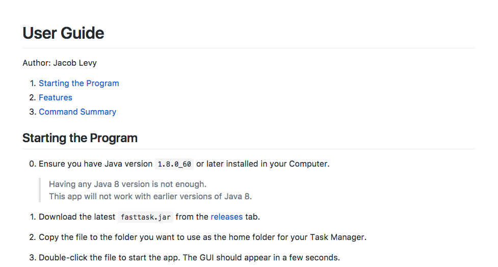
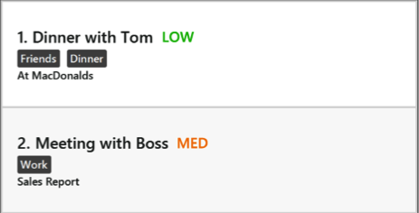
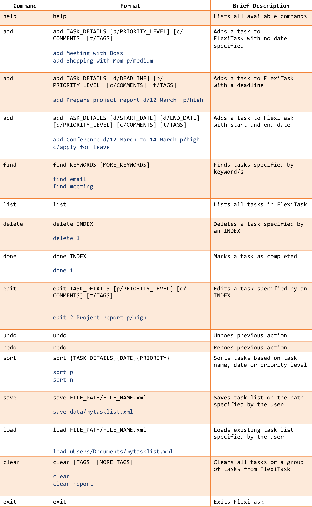

# FlexiTask - User Guide

By : `Team W14-B1`  &nbsp;&nbsp;&nbsp;&nbsp; Since: `February 2017`  &nbsp;&nbsp;&nbsp;&nbsp; Licence: `MIT`

---

1. [Introduction](#1-introduction)
2. [Quick Start](#2-quick-start)
3. [Features](#3-features) 
    3.1. [Viewing help: help](#help) 
    3.2. [Adding a task: add](#add) 
    3.3. [Finding a task: find](#find) 
    3.4. [Listing all tasks: list](#list) 
    3.5. [Deleting a task: delete](#delete) 
    3.6. [Marking a task: done](#done) 
    3.7. [Modifying a task: edit](#edit) 
    3.8. [Undoing changes: undo](#undo) 
    3.9. [Reverting undos: redo](#redo) 
    3.10. [Sorting tasks: sort](#sort) 
    3.11. [Clearing entries: clear](#clear) 
    3.12. [Saving the program data to a specified path: save](#save) 
    3.13. [Loading the program data from a specified path: load](#load) 
    3.14. [Exiting the program: exit](#exit) 
4. [FAQ](#4-faq)
5. [Command Summary](#5-command-summary)

 
## 1. Introduction
FlexiTask is a task manager that allows you to manage your tasks through simple command-line interface (CLI) commands. 

It has many useful features that help to organise your tasks, notably a convenient "upcoming events" feature that let you see your urgent tasks at the top of the list. 

FlexiTask will also be able to sort your tasks according to their priorities, date, or tags, so that you can locate your tasks easily.

Try FlexiTask now and benefit from its convenient features. 

## 2. Quick Start

0. Verify that you have Java version `1.8.0_60` or later installed in your Computer. 

   > Having any Java 8 version is not enough.  
   > This app will not work with earlier versions of Java 8.

1. Download the latest `FlexiTask.jar` from the [releases](../../../releases) tab.
2. Copy the file to the folder you want to use as the home folder for FlexiTask.
3. Double-click the file to start the app. The GUI should appear in a few seconds.
   > 

4. Type the command in the command box and press <kbd>Enter</kbd> to execute it.  
   e.g. typing **`help`** and pressing <kbd>Enter</kbd> will open the help window.
5. Some example commands you can try:
   * **`list`** : lists all tasks
   * **`add`**` Meet mother for dinner ` :
     adds a task named `Meet mother for dinner` to FlexiTask.
   * **`delete`**` 3` : deletes the 3rd task shown in the current list
   * **`exit`** : exits the app
6. Refer to the [Features](#2-features) section below for details of each command. 

## 3. Features

`General Command Format`

> * Words in `UPPER_CASE` are the parameters
> * Items in `SQUARE_BRACKETS` are optional
> * Items in `CURLY_BRACKETS` are exclusive, only one of them can be used
> * Items with `...` after them can have multiple instances
> * Parameters can be in any order
> * Commands can be case-insensitive (Both "Add" and "add" are acceptable)
> * Commands entered must be alphanumeric (only contains letters and words)
> * Commands support ***flexible commands:*** Common alternatives for the keywords will be accepted. These will be listed in the respective sections below.

`Entering in dates`: Flexitask supports flexible date formats that can be entered in the formats specified below:

>  1. `Formal dates`:
> * Formal dates are dates in which the month, day and year are represented as numbers separated by a '-' or a '/'. The year is optional, and the current year will be used if it is not included The format DDMMYYYY is used

>>Example:  

>>* 12/03/2017
>>* 12-05-2017

>  2.  `Relaxed dates`:
> * FlexiTask also supports a more casual style of Relaxed dates. There is no standard format to it

>>Example:  

>>* 3rd March
>>* April 4 2017

>  3. `Relative dates`:
> * FlexiTask supports text that describes a relation with the current date

>>Example:  

>>* Next Thursday
>>* 3 days from now
 

### 3.1. Viewing help: help
  
_Figure 2. Userguide for FlexiTask_

Opens a new window which shows the User Guide of FlexiTask as shown in Figure 2

Format: `help`

> Help is also shown after an incorrect command

 

### 3.2. Adding a task: add

Adds a task
> ***Flexible command:*** `insert`, `create`, `new`, `adds`

Format: `add TASK_DETAILS [p/PRIORITY_LEVEL] [c/COMMENTS] [t/TAGS...] [d/DATES]...`

 

* Use `TASK_DETAILS` to specify the name of the task to be added 
* Use `PRIORITY_LEVEL` to specify importance. Enter one of the three options: 
    high, medium, low
> ***Flexible command:*** `priority/`, `urgency` 
* Use `COMMENTS` to add additional description(s) to the task 
> ***Flexible command:*** `comment/`, `comments/`, `info/` 
* Use `TAGS` to assign category to each task 
> ***Flexible command:*** `tag/`, `tags/`  
> Each tag is separated with spaces after the '/t' command 
> Example: *t/project leisure* means 2 tags of "project" and "leisure" to be created
* Use `DATES` to add a deadline or a timeframe to the task. 
> ***Flexible command:*** `date/`, `dates/` 
> Date and time can be written in any order, as it is processed by an inbuilt natural language processor

Example:

* add attend meeting with boss d/12 march 4pm to 6pm

#### 3.2.1 Adding a floating task
> Floating tasks refers to tasks that do not have a deadline or a timeframe

A task can be entered with just its name

Example:

* add Meet mom for lunch

#### 3.2.2 Adding a task with deadline

If the task is required to be completed by a certain date, you can enter a deadline by specifying a single date and time with the `d/` prefix

Example:

* add Finish up report d/3rd November 3pm

#### 3.2.3 Adding an event

Events can be added by specifying a start and end date or time

Example:

* add attend meeting with boss d/12 march 4pm to 6pm

#### 3.2.4 Setting priority levels

A priority can be assigned to tasks to help you plan your day.  
Priorities will be displayed next to the task name.  

Example:

* add Send email to boss regarding X Project p/high

  
_Figure 3. Tasks with Priorities_

As shown in Figure 3, priority is displayed next to the task name and tags are displayed below the task name.

 

### 3.3. Finding a task: find
Finds all tasks with the following keywords 

> ***Flexible command:*** `locate`

Format: `find KEYWORD...`

> Search is case insensitive  
> Order of keywords does not matter  
> Tasks containing all keywords will be returned

Example:  

* find assignments
> Returns all tasks with assignments in their name or as a tag

* find lecture tutorial
> Returns all tasks with lecture and tutorial in their name or tasks with both lecture and tutorial as tags

 

### 3.4. Listing all tasks: list
Shows a list of all tasks or groups of tasks 

Format: `list`

> List shows uncompleted tasks first before completed tasks 
> Tasks are displayed in the left panel of the GUI as shown in Figure 4

 

### 3.5. Deleting a task: delete

Deletes a task  

> ***Flexible command:*** `remove`, `deletes`, `cancel`

Format: `delete INDEX`

> Deletes a task at the specified INDEX. The index refers to the index number shown in the most recent listing.

Example:
* list delete 2

> Deletes 2nd task from the task list

Deletion is also possible after finding keywords. Delete the task by specifying the INDEX that follows the results of find.
* find tutorial 
delete 1

> Deletes 1st task in the results of the find command

 

### 3.6. Marking a task: done

Marks a tasks as completed 

Format:` done INDEX`

Example:
* list 
    done 2

> Completes 2nd task from the task manager

Similar to `delete`, `done` is also possible after a `find` command 

Example:
* find tutorial 
    done 1

> Completes 1st task in the results of the find command

 

### 3.7. Modifies a current task: edit

Edits a task with the specified index. All parameters in the task with the specified index can be edited 

> ***Flexible command:*** `modify`, `change`, `edits`

Format: `edit INDEX TASK_DETAILS [p/PRIORITY_LEVEL] [c/COMMENTS] [t/TAGS...] [d/DATES]...`

Example:
* find homework 
    edit 2 cs3243 homework due 3 March 11.59pm p/ high

 

### 3.8 Undoing changes: undo

Reverts the results of the previous action, in the event a mistake is made

Format: `undo`

Commands that can be reverted include:
* `add`
* `delete`
* `edit`
* `done`
* `redo`
* `clear`

Example:
* delete 1 
    undo

> Delete action will be reversed

 

### 3.9 Reverting undos: redo

Reverts previous undo command(s)

Format: `redo`

 

## 3.10. Sorting tasks: sort
Sorts tasks based on task name, start date, end date or priority level. 

> ***Flexible command:*** `arrange`

Format: `sort {TASK_DETAILS}{DATE}{PRIORITY_LEVEL}`
>> Only 1 of 3 parameters can be used

> n: Sorts based on task name in alphabetical order 
> d: Sorts based on date starting with the earliest date 
> p: Sorts based on priority assigned starting with the highest priority  

Example:

* sort p 

> Displays all tasks sorted according to priority

 

### 3.11. Clearing entries: clear
Clears all tasks or groups of task 
Format: `clear [TAGS] [MORE_TAGS]`
> Without parameters, clear will delete all tasks from the task manager 
> With parameters, clear will only delete tasks containing all of the tags from the task manager

Example:

* clear completed
* clear completed 2103

 

### 3.12. Saving the program data to a specified path: save
Save FlexiTask list to a file specified by user 
Format: `save FILE_PATH/FILE_NAME.xml`

> File extension must be xml 
> If specified file does not exists, FlexiTask will create the file.

Example:

* save data/mytasklist.xml

 

### 3.13. Loading the program data from a specified path: load
Load FlexiTask list from file specified by user 
Format: `load FILE_PATH/FILE_NAME.xml`

> File extension must be xml 
> File specified must exist

Example:

* load users/user/Documents/mytasklist.xml

### 3.14. Exiting the program: exit
Exits the program 
Format: `exit`

## 4. FAQ

**Q**: How do I save my data in FlexiTask?  
**A**: FlexiTask saves your data automatically, whenever the task list is updated. Data is saved to ‘data/tasklist.xml’.

**Q**: How do I transfer my data to another Computer?  
**A**: Install FlexiTask in the other computer and overwrite the empty data file it creates with the file that contains the data of your previous FlexiTask folder.

**Q**: Is FlexiTask capable of providing reminders for my upcoming tasks?  
**A**: FlexiTask will display your upcoming tasks on the right panel of the User Interface. However, it will not show you a reminder.

## 5. Command Summary 

