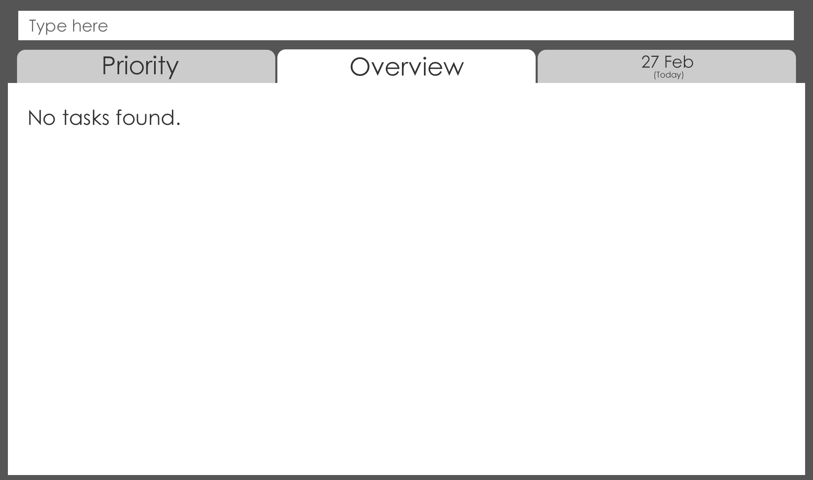

# doTASK - User Guide

By : `Miao Ling` , `Ian` , `Qi Xiang` and `Dylan` - `[W09-B4]` Since : `Feb 2017`

---

1. [Introduction] (#introduction)
2. [Quick Start] (#quick-start)
3. [Features] (#features)
4. [FAQ] (#faq)
5. [Command Summary] (#command-summary)

## 1. Introduction

Our application doTASK helps to improve your productivity and accountability in managing your daily activities. The main feature of our application is its
prioritisation framework, which lets you focus on the important things. This user guide will provide you with the basic information you'll need in setting
up doTASK, as well as guide you on how to use it to make you more efficient in prioritising your tasks.

## 2. Quick Start

1. Ensure you have Java version `1.8.0_60` or later installed in your Computer.

2. Download the latest version of `doTASK.jar` from [releases] tab.

3. Copy the file to the folder you want to use as the home folder for your doTASK.

4. Double-click on the file to start the application. The GUI should appear in a few seconds. 
> 

5. Get started by adding your first task that you have in mind! Refer to **3. Features** for further instructions.  
> 

6. After step 5, you can view your task in 3 different tabs.  

 	**Today/Date**
   > * Shows you the list of tasks you have for the specified date. By default, it will show the tasks for today. Press __Ctrl+Left Arrow__ or __Ctrl+Right Arrow__ to navigate between the dates.
   > 
   >

    **Overview**

   > * Shows you an overall view of the dates. The highest priority tasks will be shown as a preview for every single date. Hold the __Down Arrow key__ to navigate between the dates.
   > 

    **Priority**

   > * Shows you 4 options of priority tabs, from highest to lowest, which are indicated by different colours. Selecting the tab allows you to view the list of tasks that is under that priority. 
   > Eg. By using `switch` feature, you can select the _Highest Priority_ tab. It will bring you to the list of tasks that you have in that tab. 
   > 

## 3. Features

> Command Format
>
> * Items in `UPPER_CASE` are the parameters.
> * Items in `SQUARE_BRACKETS` are optional.
> * Items with `...` after them can have multiple instances.
> * Parameters can be in any order.

### 3.1. Viewing help : `help`
Allows you to view the list of commands available in doTASK.  
Format: `help`

> Help is shown if you enter an incorrect command e.g. `asdf`  
> Alternatively, type `help` to obtain a list of commands that you can use.

### 3.2. Switching tabs: `switch`
Switch the current tab to the next tab.  
Format: `switch`

> There will be 4 tabs, which can be toggled using this command.
> The order in which the tabs will be switched is as follows: 'Priority' -> 'Overview' -> 'Today' -> 'Priority'.

### 3.3. Adding a Task : `add`
Adds a task to the task manager.
> doTASK currently supports the use of floating tasks and tasks with a single deadline. 
> * Floating tasks are tasks that have no deadlines, and can be completed at any time.  
> * Tasks with deadlines will be complemented with reminders, so you won't forget to do them!

Adds a floating task to the task manager.  
Format: `add TASK_NAME p/PRIORITY_LEVEL [i/ANY_INFO] [t/TAGS]`
  > * `PRIORITY_LEVEL` should be defined by integers 1 (high) to 4(low). 
	 > * `ANY_INFO` allows you to key in details with regards to the task [optional]. 
	 > * `TAGS` allows you to assign tags to the tasks [optional].

Adds a task, with a specified deadline, to the task manager.  
Format: `add TASK_NAME d/DEADLINE p/PRIORITY_LEVEL [i/ANY_INFO] [t/TAGS]`
   > * `DEADLINE` can be entered in the format of "date month", "month date", "date month year" or "month date year".  
	 > * If no year is specified, the current year of the system will be used as the year of the deadline. 
	 > * The month must be typed out as the first three letters of the month.

Examples:
* add Buy Milk p/4 t/Chores
* add CS3230 Assignment 1 d/8 Jan 2018 p/1 i/How to do? t/School t/CS3230

### 3.4. Listing the tasks: `list`

Shows a list of all the tasks in the task manager. 
> Listing is done automatically when you switch between the tabs. 
> However, you can choose to list all the tasks you have in the task manager. This list will be shown in a pop up. 
> You can also sort it according to the deadlines, priorities, etc.
> The index of the task as referenced by the task manager will always be shown alongside the task, ie. the index is not affected by filtering the list.

Shows a list of all the tasks in lexicographical order. 
Format: `list all`

Shows a list of all the tasks sorted by deadline. 
Format: `list deadline`

Shows a list of all the tasks sorted by priority level. 
Format: `list priority`

Shows a list of the tasks sorted by a stated priority level, from 1 - 4. 
Format: `list priority PRIORITY_LEVEL`
> Tasks can be given any priority level from 1 to 4.
> Tasks with `PRORITY_LEVEL` priority will be displayed.

Examples:
* `list priority 1`

Shows a list of tasks of the tags sorted in lexicographical order. 
Format: `list t/TAGS...`
> The tasks listed will be in clusters according to tags, but sorted in alphabetical order. 

Examples:
* `list t/CS3230 t/Work`

### 3.5. Editing an existing task: `edit`
Edits an existing task in the task manager. 
Format: `edit i/INDEX [n/TASK_NAME] [d/DEADLINE] [p/PRIORITY_LEVEL] [i/ANY_INFO] [t/TAGS]...`

> * Edits the task as denoted by the `INDEX` digit as shown on the screen. The `INDEX` must be a positive integer, e.g. 1, 2, 3, ...
> * The index of a task can be found beside the task description.
> * At least **one** of the optional [fields] must be provided.
> * Existing fields will be overwritten.

Examples:
* `edit i/1 n/Assignment 2 d/25 Feb 2018 p/2`
* `edit i/4 n/Exercise`

### 3.6. Deleting a task: `delete`
Deletes the specified task. 
Format: `delete INDEX_NUMBER`

> The task labelled `INDEX_NUMBER` will be deleted from the list. 
> `INDEX_NUMBER` of tasks is shown according to the current tab.

Examples:
* `delete 2`
* `delete 5`

### 3.7. Completion of a task: `complete`

Marks the specified task as complete. 
Format: `complete INDEX_NUMBER`
> The task labelled `INDEX_NUMBER` will be marked as completed. 
> `INDEX_NUMBER` of tasks is shown according to the current tab.

Examples:
* `complete 2`
* `complete 5`

### 3.8. Track overall progress: `progress`

Shows all the tasks completed over time and also specifies any overdue tasks. 
A general overview of performance or efficiency based on the usage of the task manager will be shown. 

Format: `progress NUMBER_OF_DAYS`
> `NUMBER_OF_DAYS` is a integer which indicates your progress for the past `NUMBER_OF_DAYS` days (excluding today). 
> This command will provide an analysis on the number of tasks that you have completed or are overdue.

Examples:
* `progress 7`

### 3.9. Search for tasks: `find`

Searches for tasks based on keywords that you want. 

Format: `find KEYWORD`
> No special characters such as ASCII whitespace is allowed. 
> A popout will appear to show you the list of tasks that contains the stated `KEYWORD`.

Examples:
* `find potato`

### 3.10. Undo previous action : `undo`

Undoes previous action that you've made. 
Format : `undo`
> The command last executed will be reversed.
> Only 1 command will be reversed at a time.

### 3.11. Redo previous action : `redo`

Redoes previous `undo` that you've made. 
Format : `redo`
> Any previous `undo` will be reversed, in successive order.

### 3.12. Saving the tasks

Upon creation of tasks, the tasks will be automatically saved in the folder where the program is stored in.
> Do not erase the saved data as it will result in a complete loss of data that cannot be recovered by the application itself.

## 4. FAQ

**Q**: How do I transfer my data to another computer? 
**A**: Install the application in the other computer and overwrite the empty data file with the file <file_name.extension> that contains the data of your current doTASK manager.

**Q**: How do I clear all the tasks under a certain tag? 
**A**: Navigate to `Priority` tab, click the `Clear All` button. There will be a confirmation prompt upon doing so. Click to confirm that you want to clear the tasks with that tag.

**Q**: Will I get reminded if the deadlines of tasks are nearing? 
**A**: For tasks that are due in 24 hours, there will be a notification in the system tray reminding you of the task.

## 5. Command Summary

* **Help** : `help`

* **Switching between tabs** : `switch`

* **Add a Floating Task** : `add TASK_NAME p/PRIORITY_LEVEL [i/ANY_INFO] [t/TAGS]...` 
  e.g. `add Buy a new fan p/4 t/Home`

* **Add** : `add TASK_NAME d/DEADLINE p/PRIORITY_LEVEL [i/ANY_INFO] [t/TAGS]...` 
	e.g. `add Sleep d/27 December 2018 p/1 i/Sleep is good t/Home`

* **List All** : `list all`

* **List All by Deadlines** : `list deadlines`

* **List All by Priority** : `list priority`

* **List by Specific Priority** : `list priority PRIORITY_LEVEL`
	e.g. `list priority 1`

* **List by Tags** : `list t/TAGS [MORE_TAGS]` 
	e.g. `list t/CS2103 t/Work t/School`

* **Edit** : `edit` 
	e.g. `edit i/3 n/Buy a house`

* **Delete** : `delete` 
	e.g. `delete 1`

* **Completion of task** : `complete` 
	e.g. `complete 1`

* **Checking progress/performance** : `progress NUMBER_OF_DAYS` 
	e.g. `progress 7`

* **Search for tasks** : `find KEYWORD` 
	e.g. `find potato`

* **Undo previous action** : `undo` 

* **Redo previous action** : `redo` 
