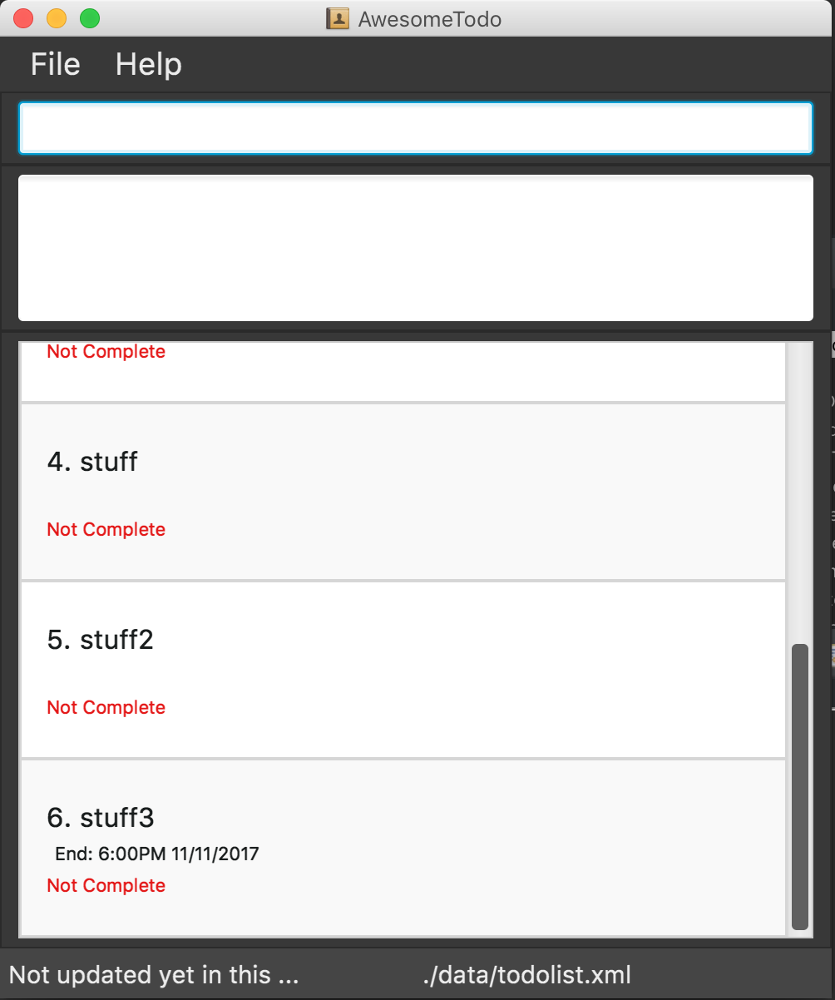

# DoOrDie - User Guide

Please refer to the [Setting up](DeveloperGuide.md#setting-up) section to learn how to set up DoOrDie.

---

1. [Start Project](#start-project)
2. [Features](#features)
3. [FAQ](#faq)
4. [Command Summary](#command-summary)

## 1. Start Project

1. Ensure you have Java version `1.8.0_60` or later installed in your Computer. 

   > Having any Java 8 version is not enough.  
   > This app will not work with earlier versions of Java 8.

2. Download the latest `doordie.jar` from the [releases](../../../releases) tab.
3. Navigate to the location of the `doordie.jar` and double click the jar.
4. The GUI should appear in a few seconds.

5. Refer to the [Features](#features) section below for details of each command. 
6. Pressing the up or down key will allow you to iterate through previous commands executed (if any).
7. Pressing the tab key will auto complete the word at the current cursor if there is a match, otherwise a list of suggestions will be displayed.

## 2. Features

> **Command Format**
>
> * Words in `UPPER_CASE` are the parameters.
> * Items in `SQUARE_BRACKETS` are optional.
> * Items with `...` after them can have multiple instances.
> * Parameters can be in any order.

### 2.1. Viewing help : `HELP`

Format: `help`

> * Help is also shown if you enter an incorrect command e.g. `abcd`

### 2.2. Adding a task: `ADD`

Adds a task to DoOrDie 
<<<<<<< HEAD
Format: `ADD TASKNAME [#LABEL...] ([BY DEADLINE] | [FROM START_DATE TO END_DATE]) [repeat (hourly|daily|weekly|monthly|yearly)]`
=======
Format: `add TASKNAME [label LABEL] ([(by) DEADLINE] | [from START_DATE to END_DATE]) [repeat (hourly|daily|weekly|monthly|yearly)]`
>>>>>>> V0.2-yesha

> * Tasks can have a deadline, or can do without one as well.
>   * Tasks added without specifying a deadline will be displayed under "No Deadline".
>   * Date formats can be flexible. The application is able to parse commonly-used human-readable date formats.
>     * e.g. `Monday`, `next wed`, `tomorrow`, `5 days after`, `4 Apr` etc.
> * Dates can include time as well.
>   * If only time is specified, it will default to 2359.
>   * If time is not specified, it will default to the current time of the particular date.
>   * Time formats are flexible as well. The application supports 24 hour format and AM/PM format.
>     * e.g. `Monday 3pm`, `today 1930`, `5:30pm`, `10.00 am`
> * Recurring task will have the same deadline if `daily/weekly/monthly/yearly` is used
> * Tasks can have any number of label name. (including 0).
<<<<<<< HEAD
> * The `ADD ` command adds tasks without specifying `task`.
=======
> * Tasks can be created for a date that is already passed.
>>>>>>> V0.2-yesha

Examples:

 * `ADD CS2106 Mid terms`
 * `ADD CS2103 V0.0 BY tmr #module`
 * `ADD Make baby BY next wednesday`
 * `ADD go to school repeat daily`

### 2.3 Listing all tasks : `LIST`

Shows a list of all tasks in DoOrDie. Able to filter by type of task (task), or based on status of task such as completed or outstanding.

Format: `LIST [TYPE]`

> Valid parameters for TYPE:
> * `tasks` / `task`
<<<<<<< HEAD
> * `Complete` / `Completed`
> * `Incomplete` / `Outstanding`
> * `Overdue` / `Over`
> * `BY DATE`
> * `FROM STARTDATE TO ENDDATE`
> * `BOOKINGS` / `BOOKING`
=======
> * `completed`
> * `incomplete`
> * `overdue` / `over`
> * `by DATE`
> * `from STARTDATE to ENDDATE`
> * `bookings` / `booking`
>>>>>>> V0.2-yesha

Examples:

* `LIST` 
 Lists all tasks.

* `LIST Overdue` 
 Lists all overdue tasks

<<<<<<< HEAD
* `LIST Outstanding` 
=======
* `list incomplete tasks` 
>>>>>>> V0.2-yesha
 Lists all outstanding tasks

* `LIST Completed` 
 Lists all completed tasks

* `LIST BY today` 
 Lists all tasks due by today

* `LIST FROM monday TO friday` 
 Lists all tasks due within Monday-Friday

* `LIST BOOKINGS` 
 Lists all unconfirmed tasks with their respective bookings

<<<<<<< HEAD
### 2.4. Editing a task : `UPDATE`

Edits the specified task's details.

Format:`UPDATE [TASK_ID] [TASKNAME] [#LABEL...] ([BY DATE] | [FROM START_DATE TO END_DATE]) [done]`
=======
### 2.4. Editing a task : `edit`

Edits the specified task's details.

Format:`edit [TASK_ID] [TASKNAME] [label LABEL] ([(by) DATE] | [from START_DATE to END_DATE]) [completed|incomplete]`
>>>>>>> V0.2-yesha

> * Edits the task with the `TASK_ID`
    The index refers to the id of the task. 
    The index **must be a positive integer** 1, 2, 3, ...
> * At least one of the optional fields excluding `TASK_ID` must be provided.
> * Existing values will be updated to the input values.
> * When editing labels, the existing labels of the task will be removed i.e adding of labels is not cumulative.
> * You can remove all the task's tags by typing `#` without specifying any tags after it.
> * Marking a task as `done` will indicate that the task is completed

Examples:

* `UPDATE CS2106Assignment label` 
  Edits the name of the currently selected task to be `CS2106Assignment` and clears all existing labels.

* `UPDATE 1 label tedious work BY thursday` 
  Edits the label and deadline of the task with id 1 to be `tedious work` and deadline to `Thursday` respectively.

### 2.5. Finding all task containing any keyword in task name and labels : `FIND`

Finds tasks whose name and labels containing any of the specified keywords.

Format: `FIND [TYPE] KEYWORD [MORE_KEYWORDS]...`

> Valid parameters:
> * `TaskName`
> * `LabelName`
> * `Complete` / `Completed`
> * `Incomplete` / `Outstanding`
> * `BY DATE`
> * `DATE`
> * `FROM STARTDATE TO ENDDATE`

> * The search is case insensitive and the order of the keywords does not matter.
> * Task names, label names will be searched, and tasks with at least one keyword match will be return and display to user.

Examples:

* `FIND CS2103` 
Returns all task containing the keyword or label containing `CS2103` & `cs2103`.

* `FIND project` 
Returns all task with the name containing `project` & `Project`.

* `FIND glocery` 
Returns all task with the label name containing `glocery` & `Glocery`.

* `FIND project glocery` 
Returns all tasks having name or label name containing `project`, `Project`,  `glocery`, `Glocery`.

### 2.6. Deleting a task : `DELETE`

Deletes the specified task from the task manager. Reversible via undo command.

Format: `DELETE [INDEX|LABEL]`

> * Deletes the task at the specified `INDEX` or all task with `LABEL`.  
> * The index refers to the index of the task in the display list.
> * The index **must be a positive integer** 1, 2, 3, ...
> * If the label does not exist, command will still be executed but no change will occur

Examples:

* `DELETE` 
  Deletes the currently selected task in DoOrDie.
* `DELETE 2` 
  Deletes the task with the id `2` in the DoOrDie.
* `DELETE school` 
  Deletes all task with the label `school`.

### 2.7. Select a Task : `SELECT`

Selects the task identified by its `id` 
Format: `SELECT TASK_ID`

> * Selects the task and loads the saved links/attachments/details of `TASK_ID`. 
> * The index refers to the id of the task. 
> * The index **must be a positive integer** 1, 2, 3, ...

Examples:

* `SELECT 2` 
  Selects the task of id 2

### 2.8. Add a booking : `BOOK`

Reserve time slots for a certain task that has not been confirmed yet. 
Format: `BOOK TASKNAME [#LABEL...] ON DATE, DATE, [MORE_DATES]...`

> * Date formats can be flexible. The application is able to parse commonly-used human-readable date formats.
>   * e.g. `Monday`, `next wed`, `tomorrow`, `5 days after`, `4 Apr` etc.
> * Dates can include time as well.
>   * If only time is specified, it will default to today's date.
>   * If time is not specified, it will default to the current time of the particular date.
>   * Time formats are flexible as well. The application supports 24 hour format and AM/PM format.
>     * e.g. `Monday 3pm`, `today 1930`, `5:30pm`, `10.00 am`
> * Tasks can have any number of label name. (including 0).
> * DATES and MORE_DATES should be prefixed with a comma if there are multiple dates.

Examples:

* `BOOK CS2103 Meeting ON 1/1/2017 4pm, 2/1/2017 8pm` 
  Reserves time slots on the 1st January 2017 4pm and 2nd January 8pm for CS2103 Meeting

### 2.9. Confirm a booking : `CONFIRM`

Confirm booking of a task and releases other bookings for the confirmed task. 
Format: `CONFIRM TASK_ID (SLOT_NUMBER|DATE)`

> * DATE specified should be one of the bookings that has been made
> * SLOT_NUMBER will be respective to the dates added in that order
> * The index refers to the id of the task. 
> * The index **must be a positive integer** 1, 2, 3, ...

Examples:

* `BOOK CS2103 Meeting ON 1/1/2017 4pm, 2/1/2017 8pm` 
  `CONFIRM 1 1/1/2017 4pm` 
  Confirms the task CS2103 Meeting for 1st January 2017 4pm and releases 2nd January 2017 8pm slot for other tasks
* `BOOK CS2103 Meeting 1/1/2017 4pm, 2/1/2017 8pm` 
  `CONFIRM 1 1` 
  Confirms the task CS2103 Meeting for 1st January 2017 4pm and releases 2nd January 2017 8pm slot for other tasks

### 2.10. Edit a label : `EDITLABEL`

Renames a specific label to another label 
Format: `EDITLABEL OLD_LABEL NEW_LABEL`

> * Label names must be alphanumberic

Examples:

* `EDITLABEL friends oldfriends` 
  Renames all task with the tag `friends` to `oldfriends`.

### 2.11. Undo the previously executed command : `UNDO`

Revert results of a previously executed command. If the previously executed command does not modify the data of DoOrDie, nothing will be reverted. 
Format: `UNDO`

### 2.12. Clearing all entries : `CLEAR`

Clears all entries from DoOrDie. 
Format: `CLEAR`

### 2.13. Push task changes to Google Calendar : `PUSH`

Updates `Google Calendar` with newly added/modified tasks. Priority goes to `DoOrDie` if there is a conflict. 
Format: `PUSH`

### 2.14. Pull task changes from Google Calendar : `PULL`

Downloads data from Google Calendar. Priority goes to `Google Calendar` if there is a conflict. 
Format: `PULL`

### 2.15. Export agenda to PDF file : `EXPORT`

Saves a PDF format with all tasks and details to the same directory as `doordie.jar`. 
Format: `EXPORT [DATE | FROM START_DATE TO END_DATE]`

> * If no date is specified, the default date will be today's date
> * Date formats can be flexible. The application is able to parse commonly-used human-readable date formats.
>   * e.g. `Monday`, `next wed`, `tomorrow`, `5 days after`, `4 Apr` etc.
> * Dates can include time as well.
>   * If only time is specified, it will default to today's date.
>   * If time is not specified, it will default to the current time of the particular date.
>   * Time formats are flexible as well. The application supports 24 hour format and AM/PM format.
>     * e.g. `Monday 3pm`, `today 1930`, `5:30pm`, `10.00 am`

Examples:

* `EXPORT today` 
  Saves a PDF with tasks and details of today
* `EXPORT FROM 2nd Feb TO 9th Feb` 
  Saves a PDF with tasks and details from 2nd February to 9th February of the current year

### 2.16. Exiting the program : `EXIT`

Exits DoOrDie 
Format: `EXIT`

### 2.17. Saving the data

DoOrDie data are saved in the hard disk automatically after any command that changes the data. 
There is no need to save manually.

## 3. FAQ

**Q**: How do I transfer my data to another Computer? 
**A**: Install the app in the other computer and overwrite the empty data file it creates with the file that contains the data of your previous Task Mangager folder.

## 4. Command Summary

* **Help** `HELP`

* **Add** `ADD TASKNAME [#LABEL...] [BY DEADLINE] [repeat (hourly|daily|weekly|monthly|yearly)]` 
  e.g. `ADD CS2106 Mid terms BY tmr 1300 #school`

* **List** `LIST [TYPE]` 
  e.g. `LIST outstanding tasks`

* **Update** `UPDATE [TASK_ID] [TASKNAME] [#LABEL...] ([BY DATE] | [FROM START_DATE TO END_DATE])` 
  e.g. `UPDATE 1 #label tedious work BY thursday #work`

* **Find** `FIND [TYPE] KEYWORD [MORE_KEYWORDS]...` 
  e.g. `FIND CS2103`

* **Delete** `DELETE [TASK_ID|LABEL]` 
  e.g. `DELETE 1`

* **Select** `SELECT TASK_ID` 
  e.g. `SELECT 2`

* **Book** `BOOK TASKNAME [#LABEL...] ON DATE, [MORE_DATES]...` 
  e.g. `BOOK CS2103 Meeting ON 1/1/2017 4pm, 2/1/2017 8pm`

* **Confirm** `CONFIRM TASK_ID (SLOT_NUMBER|DATE)` 
  e.g. `CONFIRM 1 1`

* **Edit Label** `editlabel OLD_LABEL NEW_LABEL` 
  e.g. `EDITLABEL friends oldFriends`

* **Undo** `UNDO`

* **Clear** `CLEAR`

* **Push** `PUSH`

* **Pull** `PULL`

* **Export** `EXPORT [BY DATE | FROM START_DATE TO END_DATE]` 
  e.g. `EXPORT today`

* **Exit** `EXIT`
