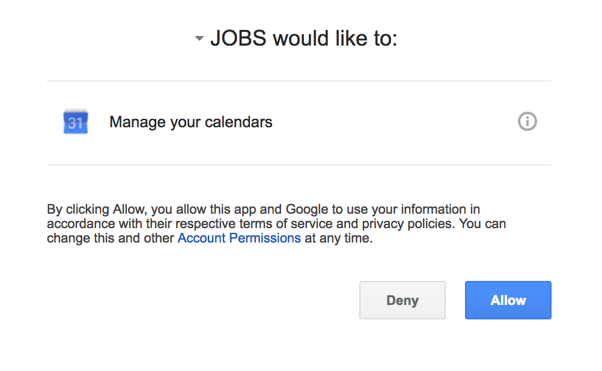

# User Guide

This product is a tool to accept natural language commands via keyboards to manage the user's schedule and todo tasks.

* [First-time user experience](#first-time-user-experience)

* [Start the program](#start-the-program)

* [Feature details](#feature-details)
    * [help](#view-help-help)
    * [add](#add-a-task-add)
    * [delete](#delete-a-task-delete)
    * [find](#find-a-task-find)
    * [list](#list-tasks-list)
    * [edit](#edit-a-task-edit)
    * [undo](#undo-a-task-undo)
    * [redo](#redo-a-task-redo)
    * [set](#set-an-account-set)
    * [display](#display-google-calendar-display)
    * [path](#path-of-taskbook-path)
    * [exit](#exit-the-program-exit)

* [Command Summary](#command-summary)

## First-time user experience
* For first-time configuration, make sure file named _calendar-java-quickstart_ in  `User/home/.credentials` does not exist or has been deleted. 

## Start the program

Double click the JOBS.jar file to start the program.

 

1. User input/command bar: Enter your to-dos here easily using the given Command Tags.
2. Feedback prompt: The outcome to any changes that you make to your tasks is shown here.
3. Display screen: Your tasks are displayed here according to input priority by default.
4. Calendar display: This displays Google Calendar extension based on existing tasks.
5. Exit button: Click to exit the program. Alternatively, type exit in the command bar to exit.

## Feature details

### View help : `help`
Format: `help`

1. Help will show the command list with brief descriptions.
2. Help is also shown if you enter an incorrect command e.g. `abcd`

### Add a task: `add`
Add is the command word to add a task to the task handler application.
Format: `add name/TASK_NAME [start/START_TIME end/END_TIME recur/PERIOD desc/DESCRIPTION tag/TAGS]`
1. User inputs are typed in after / as shown by the uppercase variables.
2. The commands inside square brackets are optional.
3. The time format follows `DD-MM-YY HH:mm`
4. If there is no input for start and end, the task will be considered a **floating task**.
5. If there is input for end, the task will be considered a **task with deadline**.
6. The recur specifies the recurrence period **in days**.

Example :
* `add name/tutorial start/13-01-17 11:00 end/13-01-17 12:00 recur/7 desc/"Tutorial of CS2103" tag/CS2103`
* `add name/v0.0 end/03-03-17 11:00 desc/"Project version 0.0 deadline tag/CS2103 Project"`
* `add name/swim desc/"Remember to swim"`

### Delete a task: `delete`
Delete is the command word that can be used to delete a task.
Format: `delete INDEX`

Example:
* `Delete 1`

### Clear a task: `clear`
Clear is the command word that can be used to delete all task.
Format: `clear`

### Find a task: `find`
Find is the command word that can be used to find a task.
Format: `find name/Name`
1. The command finds tasks which have names or description containing any of the given keywords including substring.

Example:
* `find cs2103`
* `find cs`

### List tasks: `list`
List is the command word to list down all the existing tasks.
Format: `list * | complete | in-progress`
1. \* will list all tasks
2. Complete will list all completed tasks.
3. In-progress will list all pending tasks.

Example:
* `list *`
* `list completed`
* `list pending`
* `list overdue`

### Edit a task: `edit`
Edit is the command word to edit a specific task.
Format : `edit index/INDEX [name/NAME start/START end/END recur/PERIOD desc/DESCRIPTION tag/TAG]`
1. The commands inside square bracket are optional.
>User edits a specific task by specifying the new entry they wish to be reflected on the existing task list.

Example:
* `edit index/1 desc/"The venue has been changed"`
* `edit index/2 start/02-04-17 17:20`

### Undo a task: `undo`
Undo is the command word to erase the last change done. The system supports up to 10 undo.
Format : `undo`

Example:
* `delete 1` >> `undo` (to retrieve the previously deleted task)

### Redo a task: `redo`
Redo is the command to cancel the changes made through undo. The system supports up to 10 redo.
Format : `redo`

### Set an account: `set`
Set in the command to save an account which will be used for the Google Calendar display.
Format : `set email/EMAIL pwd/PASSWORD`
1. If email and password are invalid, user would not be able to sign into Google Calendar, but it would not produce an error.

Example:
* `set email/cs2103rocks@gmail.com pwd/abcdefgh123456`

### Display Google Calendar: `display`
Display is the command to enable the Google Calendar function for JOBS.
Format : `display`
1. Command will redirect user to an internet browser (Google Chrome, Safari, etc.) to request for authorization for Google Calendar API, as shown below. Ensure that during authorization, user is logged into their intended Google account.

 

### Path of taskbook: `path`
Path is the command to change the saving directory of the taskbook and automatically create the .xml file.
Format : `path PATH`
1. **PATH** will have to be a valid directory followed by [name of file].xml.
2. Restriction for MAC, directory preceded by /.
3. [name of file].xml without specification of directory will automatically save document in the project directory.

Example:
* for MAC `path /users/home/desktop/taskbook.xml`
* for Windows `path users/home/desktop/taskbook.xml`

### Exit the program: `exit`
Exits the program.
Format: `exit`

### Save the data
Task data are saved in the hard disk automatically after any command that changes the data. There is no need to save manually.

## Command Summary

Command | Format
-------- | :--------
help | `help`
add | `add name/TASK_NAME [start/START_TIME end/END_TIME recur/PERIOD desc/DESCRIPTION tag/TAGS]`
delete | `delete INDEX`
clear | `clear`
find | `find NAME`
list | `list`
edit | `edit index/INDEX [name/NAME start/START end/END recur/PERIOD desc/DESCRIPTION tag/TAG]`
undo | `undo` 
redo | `redo`
set | `set email/EMAIL pwd/PASSWORD`
display | `display`
path | `path PATH`
exit | `exit`
