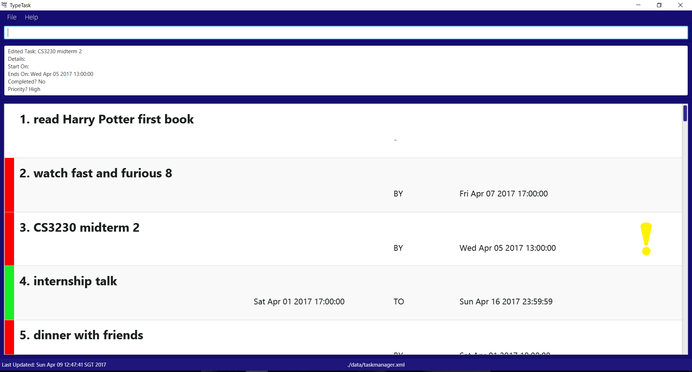

# User Guide
&nbsp;

## Table of contents

1. [Intoduction](https://github.com/CS2103JAN2017-T09-B2/main/blob/master/docs/UserGuide.md#1-introduction) <br>
2. [Quick Start](https://github.com/CS2103JAN2017-T09-B2/main/blob/master/docs/UserGuide.md#2-quick-start) <br>
3. [Features](https://github.com/CS2103JAN2017-T09-B2/main/blob/master/docs/UserGuide.md#3-features) <br>
   3.1.  [Viewing Help](https://github.com/CS2103JAN2017-T09-B2/main/blob/master/docs/UserGuide.md#31-viewing-help--help) <br>
   3.2.  [Adding a Task](https://github.com/CS2103JAN2017-T09-B2/main/blob/master/docs/UserGuide.md#32-adding-a-task-add-a-)  <br>
   3.3.  [Finding a Task](https://github.com/CS2103JAN2017-T09-B2/main/blob/master/docs/UserGuide.md#33-finding-a-task-find-f-search)<br>
   3.4.  [Editing a Task](https://github.com/CS2103JAN2017-T09-B2/main/blob/master/docs/UserGuide.md#34-editing-a-task-edit) <br>
   3.5.  [Removing Deadline from a Task](https://github.com/CS2103JAN2017-T09-B2/main/blob/master/docs/UserGuide.md#35-removing-deadline-from-a-task-removedeadline-rd) <br>
   3.6.  [Deleting a Task](https://github.com/CS2103JAN2017-T09-B2/main/blob/master/docs/UserGuide.md#36-deleting-a-task--delete-d--) <br>
   3.7.  [Completing a Task](https://github.com/CS2103JAN2017-T09-B2/main/blob/master/docs/UserGuide.md#37-completing-a-task--done) <br>
   3.8. [Listing Tasks](https://github.com/CS2103JAN2017-T09-B2/main/blob/master/docs/UserGuide.md#38-listing-tasks--list-listtoday-list-listdone) <br>
   3.9. [Undoing the Latest Command](https://github.com/CS2103JAN2017-T09-B2/main/blob/master/docs/UserGuide.md#39-undoing-the-latest-command--undo-u)<br>
   3.10. [Redoing the Latest Command](https://github.com/CS2103JAN2017-T09-B2/main/blob/master/docs/UserGuide.md#310-redoing-the-latest-command--redo-r)<br>
   3.11. [Saving Data to Another Folder](https://github.com/CS2103JAN2017-T09-B2/main/blob/master/docs/UserGuide.md#311-saving-the-data-to-another-folder--save)<br>
   3.12. [Changing Default Storage Folder](https://github.com/CS2103JAN2017-T09-B2/main/blob/master/docs/UserGuide.md#312-changing-the-default-storage-folder--setting)<br>
   3.13. [Using Data from Another Folder](https://github.com/CS2103JAN2017-T09-B2/main/blob/master/docs/UserGuide.md#313-using-data-from-another-folder--use)<br>
   3.14. [Clearing all Entries](https://github.com/CS2103JAN2017-T09-B2/main/blob/master/docs/UserGuide.md#314-clearing-all-entries--clear)<br>
   3.15. [Exiting the Program](https://github.com/CS2103JAN2017-T09-B2/main/blob/master/docs/UserGuide.md#315-exiting-the-program--exit)<br>
4. [FAQ](https://github.com/CS2103JAN2017-T09-B2/main/blob/master/docs/UserGuide.md#4-faq)<br>
5. [Command Summary](https://github.com/CS2103JAN2017-T09-B2/main/blob/master/docs/UserGuide.md#5-command-summary)<br>
&nbsp;

## 1. Introduction

TypeTask is an easy-to-use task manager which lets you schedule and manage your tasks simply <br>
with a single line of command! With the efficacy of a calendar without its shortcomings, <br>
TypeTask lets you organise your to-dos with ease so you can focus on your actual tasks. <br>
TypeTask is especially good for you if you want: <br>

> To do everything through a single line of command <br>
> To work offline <br>
> To write tasks that have deadlines or start-dates <br>

## 2. Quick Start

1. Ensure you have Java version `1.8.0_60` or later installed in your Computer.<br>

   > Having any Java 8 version is not enough. <br>
   > This app will not work with earlier versions of Java 8.

2. Download the latest `TypeTask.jar` from the [releases](../../../releases) tab.

3. Copy the file to the folder you want to use as the home folder for your Task Manager.

4. Double-click the file to start the app. The GUI should appear in a few seconds.



Fig 1. TypeTask’s User Interface <br>

5. TypeTask automatically assigns your tasks certain colours to help you differentiate them easily.
   `Red`: this uncompleted task’s deadline has passed! Better get on to it. <br>
   `Green`: this uncompleted task has a deadline but is not due yet. Phew! <br>
   `Exclamation Mark`: this uncompleted task was labelled as a priority. <br>
   `Black`: this task has been labelled as completed.<br>
   ```
   > Note that all tasks that fall outside of these categories will appear normally.
      i.e. no additional colours.
   ```

5. Type the command in the command box and press <kbd>Enter</kbd> to execute it. <br>
   e.g. typing **`help`** and pressing <kbd>Enter</kbd> will open the help window.

6. Some example commands you can try:
   * **`list`** : lists all tasks
   * **`add`**` CS2103T Meeting by: 12 Feb 11am` :
     adds a task named `CS2103T Meeting` to the Task Manager.
   * **`delete`**` 1` : deletes the 1st task shown in the current list
   * **`exit`** : exits the app

7. Refer to the [Features](#features) section below for details of each command.<br>
&nbsp;

## 3. Features
Let us now explore the interesting features found in TypeTask!


### 3.1. Viewing Help : `help`
Having trouble navigating the application? Simply type  help to view a summary of TypeTask’s commands. The help screen will also show if you have entered an incorrect command e.g. abcd.

Format:<br>
`help`<br>

### 3.2. Adding a Task: `add`, `a`, `+`
TypeTask supports 3 types of task. They are floating task, deadline task and event task.

```
Things To Note:
> Tasklist will focus on the added task after add command is executed.
> Tasklist will not detect duplicate task names.
> Task name does not allow symbols.
   e.g. "/", ".", ","
```

### 3.2.1. Adding a Floating Task: `add`, `a`, `+`
The first thing you would do is to add your first task! A floating is a task with no deadline and schedule.<br>
Lets make it simple by first adding a floating task. <br>


Format:<br>
`add <TASK NAME>`

Examples:

* `add CS2103T Meeting`
* `add Buy milk`


### 3.2.2. Adding a Deadline Task:  `add`, `a`, `+`
What if you want to submit a report by a certain date or time. You might want to add a task that has a deadline. <br>

Format:<br>
`add <TASK NAME> by:<DATE>`<br>
`add <TASK NAME> by:<TIME>`<br>
`add <TASK NAME> by:<DATE> <TIME>`<br>

```
Things To Note:
> Date can be in mm/dd/yyyy format.
> Space must be used between words for dates.
   e.g "15 Oct", "next monday"
> Time is optional.
> Time can be in hh:mm format. 24 hours format is used.
> Time and Date must have a space in between them.
   e.g. "today 8pm", "15 Oct 11am"
```

Examples:

* `add CS2103T Meeting by: next week`
* `add Buy eggs by: 8pm`
* `add CS2103T Meeting by: next monday 11:10am`


### 3.2.3. Adding an Event Task:  `add`, `a`, `+`
Now you might be interested in adding an event, which has a schedule with a start time and an end time. <br>

Format:<br>
`add <TASK NAME> from:<DATE> to:<DATE>`<br>
`add <TASK NAME> from:<TIME> to:<TIME>`<br>
`add <TASK NAME> from:<DATE> <TIME> to:<DATE> <TIME>`<br>

```
Things To Note:
> Start Date/Time and End Date/Time are compulsory.
> Start Date must be before End Date.
> Date can be in mm/dd/yyyy format.
> Space must be used between words for Date. 
   e.g "15 Oct", "next monday"
> Time is optional.
> Time can be in hh:mm format. 24 hours format is used.
> Time and Date must have a space in between them.
   e.g. "today 8pm", "15 Oct 11am"

```

Examples:

* `add OPEN HOUSE from: 13 Oct to: 16 Oct`
* `add watch television from: 7pm to: 9pm`
* `add Meeting from: tuesday 12:00pm to: tuesday 2:00 pm`


### 3.2.4. Adding a Priority Task/Event :  `add`, `a`, `+`
What if you have task that are more important than others? You can add this task with high priority.

Format:<br>
`add <TASK NAME> p/<PRIORITY>`<br>
`add <TASK NAME> by:<DATE> <TIME> p/<PRIORITY>`<br>
`add <TASK NAME> from:<DATE> <TIME> to:<DATE> <TIME> p/<PRIORITY>`<br>

```
Things To Note:
> Priority will be low by default if a task is added without
  the field “p/<PRIORITY>”.
> Priority must be high or low.
> Priority can be applied to other type of task or event by
  adding this additional field “p/<PRIORITY>”.
```

Examples:
* `add CS2103T Meeting p/high`
* `add Buy eggs by:next week 8pm p/high`
* `add Open House from:5 Nov 11:00am to: 6 Nov 11:00pm p/low`


### 3.3. Finding a Task: `find`, `f`, `search`
You may not want to search through your entire list just to find a certain task. You can easily do so by using the find command, then put in any details about your task.

Format:<br>
`find <KEYWORD>`<br>

```
Things To Note:
> The order of the keywords does not matter.
   e.g. Meeting Tutor will match Tutor Meeting
> The tasks that match at least one keyword will be returned (i.e. OR search).
   e.g. Meeting will match Meeting Tutor
> The keyword is not case-sensitive.
   e.g. Meeting Tutor will match meeting tutor
> The search function prioritise dates.
   e.g. "find tmr" will give a list of tasks with tomorrow date but will not give task name with "tmr"
> The search function does not support finding by months.
> The search function will return the closest day from your current time.
   e.g. "find monday" will give you a list of tasks that have this coming monday date
```

Examples:
* `find Meeting`
* `find next week`
* `find tmr`


### 3.4. Editing a Task: `edit`
Sometimes you may want to change the details of a certain task you have. No need to worry! You can modify a certain task by typing the edit command.

Format:<br>
`edit INDEX <TASK NAME> by: <DATE> <TIME> p/<PRIORITY>`<br>
`edit INDEX from:<DATE> <TIME> to:<DATE> <TIME>`<br>
`edit INDEX from:<DATE> <TIME>`<br>
`edit INDEX to:<DATE> <TIME>`<br>

```
Things To Note:
> Edits the task at the specified INDEX.
  The index refers to the number shown in the last task listing.
> Optional fields are <TASK NAME>, <DATE>, <TIME>, <PRIORITY>.
> At least one of the optional fields must be provided.
> Existing field(s) will be updated with the input fields.
```

Examples:
* `edit 1 by:2 Dec 11:00am p/low`
What it does: Edit your task deadline to 2 Dec 11am and set the priority to low

* `edit 2 CS2103T Meeting`
What it does: Edit your task name to CS2103T Meeting

* `edit 3 from: next week to: next month`
What it does: Edit your task schedule to be from next week to next month

* `edit 4 from: next week`
What it does: Edit your task schedule start date to next week

* `edit 5 to: next month`
What it does: Edit your task schedule end date to next month


### 3.5. Removing Deadline from a Task: `removedeadline`, `rd`
What happens when there is a change to your deadline/schedule but still unsure of the date? You can remove the 
deadline or schedule by using the removedeadline command.

Format:<br>
`removedeadline <INDEX>`

```
Things To Note:
> The task at the specified INDEX will have its deadline/schedule removed.
> The index refers to the index number shown in the most recent listing.
```


### 3.6. Deleting a Task : `delete`, `d`, `-`
There are some tasks that will never be completed and are irrelevant to keep. You can delete these tasks from your list by using the delete command.

Format:<br>
`delete <INDEX>`<br>

```
Things To Note:
> The task at the specified INDEX will be deleted.
> The index refers to the index number shown in the most recent listing.
```

Examples:
* `delete 1`


### 3.7. Completing a Task : `done`
Completed a task? Good for you! You can mark the task as done by typing in the done command. This will move the task to your completed list.

Format:<br>
`done <INDEX>`<br>

```
Things To Note:
> The task at the specified INDEX will be moved from the task
  list to the completed list.
> The index refers to the index number shown in the most recent listing.
> This list will only show you the tasks that are completed.
  Deleted Task are not included.
```

Examples:
* `done 2`

### 3.8. Listing Tasks : `list`, `listtoday`, `list*`, `listdone`
There are different listing commands for you to use! Each listing commands shows you a different kind of task list.

```
Things To Note:
> This list will refresh itself and show you the latest
  list when you add a new task or event.
> This list will be sorted by Priority, Date and Time.
```

### 3.8.1. Listing all Tasks : `list`
Want to view a list of all your tasks? Use the command list to view all your tasks in TypeTask. <br>

Format:<br>
`list`<br>


### 3.8.2. Listing Today Tasks : `listtoday`
By default, you will have a view of all of today’s tasks when the application first starts. However, other commands may have changed the list you’re seeing. To return to the list of today’s tasks, use the  listday command.

Format:<br>
`listtoday`<br>


### 3.8.3. Listing Proirity Tasks : `list*`
Want to focus on your urgent tasks only? You can use the command list* to see a list of all your important tasks.

Format:<br>
`list*`<br>


### 3.8.4. Listing Completed Tasks : `listdone`
To review what you have done (and feel better about yourself!), you may want to look at all your completed tasks. You can do so by using the command listdone to show all of your completed tasks in TypeTask.<br>

Format:<br>
`listdone`<br>


### 3.9. Undoing the Latest Command : `undo`, `u`
Typed in the wrong command and submitted an operation you do not want? Fret not! You can use the undo command to save the hassle of modifying your recent operation. <br>

Format:<br>
`undo`<br>

```
Things To Note:
> This will only work if there is at least one action command is used.
   Action commands: add, edit, delete, done, clear, redo
> This command can be used multiple times.
   e.g You used 10 action commands. You can undo 10 times.
```

### 3.10. Redoing the Latest Command : `redo`, `r`
Typed in the undo command wrongly? Fret not! You can use the redo command to save the hassle of modifying your recent operation. <br>

Format:<br>
`redo`<br>

```
Things To Note:
> This will only work if undo command is used.
> This command can be used multiple times.
   e.g. You undo 10 times. You can redo 10 times.
```

### 3.11. Saving the Data to Another Folder : `save`
Your data is saved to the default storage folder in the hard disk automatically after any command that changes the data. There is no need to save manually! However, you may consider saving TypeTask’s data files into another folder of your choice. To do that, you can use the save command . <br>

Format:<br>
`save <FILE_PATH>`<br>

```
Things To Note:
> The file path provided must be valid.
```

Examples:

* `save C:/Desktop/myTask`


### 3.12. Changing the Default Storage Folder : `setting`
Want to set your default storage folder to another folder? You can do that by typing in the setting command to set the TypeTask folder into a folder of your choice . <br>

Format:<br>
`setting <FILE_PATH>`<br>

```
Things To Note:
> The file path provided must be valid.
```

Examples:

* `setting C:/Desktop/myOtherTask`<br>


### 3.13. Using Data from Another Folder : `use`
After changing TypeTask’s data files, you want to use them from your reallocated folder. You can use the use command to load the data from the specified folder.  <br>

Format:<br>
`use <FILE_PATH>`<br>

```
Things To Note:
> The file path provided must be valid.
```

Examples:

* `use C:/Desktop/myTask`<br>


### 3.14. Clearing all Entries : `clear`
Want to have a fresh start? TypeTask offers a clear command to delete all entries from the Task Manager. <br>
`WARNING` you will lose all your data after this command. Thus, use it wisely. <br>

Format:<br>
`clear`<br>


### 3.15. Exiting the Program : `exit`
Have you completed to schedule your tasks? Good job! To exit the program you can type the command exit. <br>

Format:<br>
`exit`<br>
&nbsp;

## 4. FAQ

**Q**: How do I transfer my data to another Computer?<br>
 Install the app in the other computer and overwrite the empty data file it creates with
 the file that contains the data of your previous Task Manager folder.


## 5. Command Summary


